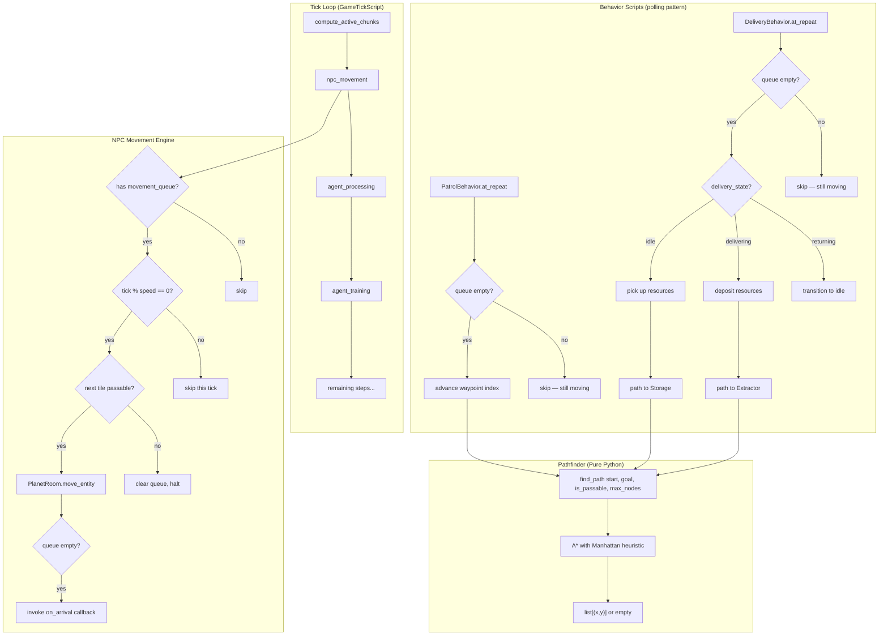
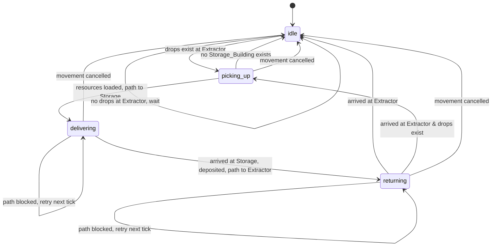

# Design Document: Agent AI — Pathfinding & Autonomous Movement

## Overview

This design adds grid-based A* pathfinding and tick-driven movement to all NPCs, then layers two autonomous behaviors on top for player-owned agents: patrol-route cycling (guards/scouts) and resource-delivery loops (harvesters). The system is built in three layers:

1. **Pathfinder** — a pure-Python A* module with zero Evennia dependencies, operating on a passability callback. This makes it trivially testable and reusable for any future NPC type (enemies, vendors, combat AI).
2. **NPC Movement Engine** — a mixin on the NPC base typeclass that consumes a movement queue one step per tick, respecting movement speed, incapacitation, and dynamic obstacle detection. Integrated into GameTickScript as a new processing step.
3. **Behavior Scripts** — `PatrolBehavior` (guard/scout waypoint cycling) and `DeliveryBehavior` (harvester Extractor→Storage loop) that populate the movement queue via the Pathfinder and manage their own state machines.

All movement state is persisted as Evennia Attributes (`db.*`) so NPCs resume seamlessly after server restarts.

## Architecture



The key architectural decisions:

- **Pathfinder is dependency-free.** It accepts a callable `is_passable(x, y) -> bool` and grid bounds, nothing else. This means property-based tests can exercise it without Evennia stubs.
- **Movement is on the NPC base, not per-role.** The `movement_queue`, `movement_speed`, and tick-advancement logic live on the `NPC` typeclass so enemies and vendors get movement for free.
- **Behaviors are composable scripts.** PatrolBehavior and DeliveryBehavior are Evennia Scripts attached to NPCs, just like the existing HarvesterScript/GuardScript. They set the movement queue and define `on_arrival` callbacks.
- **PatrolBehavior replaces GuardScript and ScoutScript.** The existing placeholder scripts (`GuardScript`, `ScoutScript`) are removed. `ROLE_SCRIPT_MAP` in `agent_scripts.py` is updated so `"guard"` and `"scout"` map to `PatrolBehavior`. The existing `_attach_behavior_script` in AgentSystem handles this automatically.
- **DeliveryBehavior coexists with HarvesterScript.** Harvesters get two scripts: `HarvesterScript` (production) and `DeliveryBehavior` (pickup/delivery). `HarvesterScript.at_repeat` is gated by a check: only produce when the NPC is at the Extractor's coordinates (i.e., `delivery_state` is `"idle"` or `"picking_up"`). When the harvester is in transit (`"delivering"` or `"returning"`), production pauses automatically.
- **One movement step per tick per NPC** (modulated by `movement_speed`). No batched teleportation — movement is visible and interruptible.
- **Per-tick pathfinding is throttled.** A configurable cap (default 10) limits how many path computations happen per tick. Excess requests are deferred.

## Components and Interfaces

### 1. Pathfinder Module

**Location:** `mygame/world/pathfinding.py`

```python
def find_path(
    start: tuple[int, int],
    goal: tuple[int, int],
    is_passable: Callable[[int, int], bool],
    width: int,
    height: int,
    max_nodes: int = 500,
) -> list[tuple[int, int]]:
    """Compute an A* path from start to goal on a bounded grid.

    Args:
        start: (x, y) starting coordinate.
        goal: (x, y) goal coordinate.
        is_passable: Callback returning True if (x, y) is walkable.
        width: Planet grid width (0 <= x < width).
        height: Planet grid height (0 <= y < height).
        max_nodes: Maximum node expansions before giving up.

    Returns:
        Ordered list of (x, y) coordinates from start (exclusive) to
        goal (inclusive). Empty list if no path exists, start == goal,
        or node limit exceeded.
    """
```

- Uses 4-directional adjacency (N/S/E/W).
- Manhattan distance heuristic.
- Returns path excluding the start position (the NPC is already there).
- The `is_passable` callback is constructed by the caller to incorporate terrain, buildings, bounds — the Pathfinder doesn't know about any of those concepts.

### 2. NPC Movement Mixin

**Location:** Added to `mygame/typeclasses/npcs.py` on the `NPC` class.

New persistent attributes on NPC:
- `db.movement_queue`: `list[list[int, int]]` — remaining steps. Empty list = idle.
- `db.movement_delay`: `int` — ticks between steps (1 = fastest, default 1).
- `db.activity_status`: `str` — human-readable status string.

New methods on NPC:
```python
def advance_movement(self, tick_number: int) -> bool:
    """Advance one step if tick aligns with movement_speed.

    Returns True if the NPC moved this tick.
    """

def set_movement_queue(self, path: list[tuple[int, int]]) -> None:
    """Replace the current movement queue with a new path."""

def clear_movement(self) -> None:
    """Clear the movement queue and halt."""

def at_movement_complete(self) -> None:
    """Hook called when the movement queue is exhausted.

    The NPC base implementation is a no-op. Behavior scripts do NOT
    override this method — instead, each script's at_repeat checks
    the NPC's state (empty queue, delivery_state, etc.) and acts
    accordingly. This avoids the multiple-scripts-overriding-one-hook
    problem: each script independently polls the NPC's state each tick
    via its own at_repeat, which is the standard Evennia Script pattern.

    This hook exists for subclass overrides (e.g., enemy NPCs) where
    a single behavior owns the NPC.
    """
```

**Callback pattern:** Behavior scripts (PatrolBehavior, DeliveryBehavior) do NOT rely on `at_movement_complete`. Instead, each script's `at_repeat` checks `if not npc.db.movement_queue:` and triggers its next action. This is consistent with how `HarvesterScript.at_repeat` already works — it checks state each tick rather than waiting for a callback. Multiple scripts can coexist on the same NPC without conflicting over a single hook.

### 3. Movement Processing in GameTickScript

**Location:** New step in `mygame/typeclasses/scripts.py` → `_build_tick_steps`.

Inserted as step 2 (after `active_chunks`, before `agent_processing`):

```python
def process_npc_movement():
    """Advance all NPCs with non-empty movement queues."""
    movement_system = systems.get("movement_system")
    if movement_system:
        movement_system.process_movement(tick_number)
```

**Moving NPC tracking:** The `MovementSystem` maintains an in-memory set `_moving_npcs: set[NPC]` of NPCs with non-empty movement queues. NPCs are added to this set when `set_movement_queue` is called (via a registration callback) and removed when the queue empties or `clear_movement` is called. This avoids a database tag query every tick — the same pattern used by `agent_system._training_buildings` for tracking buildings under construction.

On server restart, the set is rebuilt lazily on first access by scanning all NPCs with the `"npc"` object_type tag and checking `db.movement_queue`.

### 4. Pathfinding Throttle & Movement Tracking

**Location:** `mygame/world/systems/movement_system.py`

```python
class MovementSystem:
    """Manages NPC movement tracking and pathfinding throttling.

    Maintains an in-memory set of moving NPCs to avoid per-tick DB
    queries. Throttles pathfinding requests to prevent tick stalls.
    """

    def __init__(self, max_paths_per_tick: int = 10):
        self.max_paths_per_tick = max_paths_per_tick
        self._pending_requests: list[PathRequest] = []
        self._paths_this_tick: int = 0
        self._moving_npcs: set = set()  # in-memory, rebuilt on restart
        self._initialized: bool = False

    def register_moving(self, npc: Any) -> None:
        """Add an NPC to the moving set (called by NPC.set_movement_queue)."""
        self._moving_npcs.add(npc)

    def unregister_moving(self, npc: Any) -> None:
        """Remove an NPC from the moving set (called by NPC.clear_movement)."""
        self._moving_npcs.discard(npc)

    def process_movement(self, tick_number: int) -> None:
        """Advance all tracked moving NPCs one step."""
        self._ensure_initialized()
        for npc in list(self._moving_npcs):
            try:
                npc.advance_movement(tick_number)
                # Remove if queue is now empty
                queue = getattr(getattr(npc, "db", None), "movement_queue", None)
                if not queue:
                    self._moving_npcs.discard(npc)
            except Exception:
                pass  # per-NPC resilience

    def _ensure_initialized(self) -> None:
        """Lazy rebuild of _moving_npcs from DB on first access after restart."""
        if self._initialized:
            return
        self._initialized = True
        try:
            from evennia.utils.search import search_object_by_tag
            for npc in search_object_by_tag("npc", category="object_type"):
                queue = getattr(getattr(npc, "db", None), "movement_queue", None)
                if queue:
                    self._moving_npcs.add(npc)
        except Exception:
            pass

    def request_path(
        self,
        npc: Any,
        start: tuple[int, int],
        goal: tuple[int, int],
        on_complete: Callable[[list[tuple[int, int]]], None],
    ) -> None:
        """Queue a pathfinding request. Processed this tick if under limit."""

    def process_pathfinding(self) -> None:
        """Process up to max_paths_per_tick pending requests."""

    def reset_tick(self) -> None:
        """Reset the per-tick counter. Called at start of each tick."""
        self._paths_this_tick = 0
```

`PathRequest` is a simple dataclass:
```python
@dataclass
class PathRequest:
    npc: Any
    start: tuple[int, int]
    goal: tuple[int, int]
    on_complete: Callable[[list[tuple[int, int]]], None]
```

### 5. PatrolBehavior Script

**Location:** `mygame/typeclasses/agent_scripts.py` (added alongside existing scripts)

New persistent attributes on NPC:
- `db.patrol_route`: `list[list[int, int]]` — ordered waypoints (2–10).
- `db.patrol_waypoint_index`: `int` — current target waypoint index.

```python
class PatrolBehavior(DefaultScript):
    """Cycles a guard/scout through patrol waypoints.

    Replaces the placeholder GuardScript and ScoutScript.
    Uses the polling pattern: at_repeat checks if the NPC's movement
    queue is empty and triggers the next waypoint path.
    """

    def at_script_creation(self):
        self.key = "patrol_behavior"
        self.interval = 0  # driven by GameTickScript
        self.persistent = True

    def at_repeat(self):
        """If movement queue is empty, path to next waypoint."""
        npc = self.obj
        if npc is None or getattr(getattr(npc, "db", None), "incapacitated", False):
            return
        queue = getattr(npc.db, "movement_queue", None)
        if queue:
            return  # still moving
        # Queue empty — advance to next waypoint
        self._advance_to_next_waypoint(npc)

    def _advance_to_next_waypoint(self, npc):
        """Cycle patrol_waypoint_index and request path to next waypoint."""
```

### 6. DeliveryBehavior Script

**Location:** `mygame/typeclasses/agent_scripts.py`

New persistent attributes on NPC:
- `db.delivery_state`: `str` — one of `"idle"`, `"picking_up"`, `"delivering"`, `"returning"`.
- `db.carried_resources`: `dict[str, int]` — resources currently being carried.
- `db.carry_capacity`: `int` — max total units (default 50).
- `db.delivery_target`: building reference — cached Storage_Building target.

```python
class DeliveryBehavior(DefaultScript):
    """Autonomous Extractor → Storage delivery loop for harvesters.

    Coexists with HarvesterScript on the same NPC. HarvesterScript
    handles production (gated by delivery_state), DeliveryBehavior
    handles pickup/transit/deposit.

    Uses the polling pattern: at_repeat checks delivery_state and
    movement_queue emptiness to drive the FSM.
    """

    def at_script_creation(self):
        self.key = "delivery_behavior"
        self.interval = 0
        self.persistent = True

    def at_repeat(self):
        """State machine: check delivery_state and movement_queue."""
        npc = self.obj
        if npc is None or getattr(getattr(npc, "db", None), "incapacitated", False):
            return
        queue = getattr(npc.db, "movement_queue", None)
        if queue:
            return  # still moving
        # Queue empty — act based on delivery_state
        state = getattr(npc.db, "delivery_state", "idle")
        if state == "idle":
            self._try_pick_up(npc)
        elif state == "picking_up":
            self._start_delivery(npc)
        elif state == "delivering":
            self._deposit_and_return(npc)
        elif state == "returning":
            self._arrived_at_extractor(npc)

    def _try_pick_up(self, npc):
        """Check for drops at Extractor, transition to picking_up."""

    def _start_delivery(self, npc):
        """Path to nearest Storage_Building, set state to delivering."""

    def _deposit_and_return(self, npc):
        """Deposit resources, path back to Extractor, set state to returning."""

    def _arrived_at_extractor(self, npc):
        """Arrived back at Extractor, transition to idle."""

    def pick_up_resources(self, npc) -> bool:
        """Pick up ResourceDrops at Extractor up to carry_capacity."""

    def deposit_resources(self, npc) -> None:
        """Transfer carried_resources to owner's resource pool."""

    def select_delivery_target(self, npc) -> Any | None:
        """Find nearest Vault/HQ owned by same player."""
```

### 7. Passability Callback Factory

**Location:** `mygame/world/pathfinding.py`

```python
def make_passability_checker(
    terrain_generator: TerrainGenerator,
    data_registry: DataRegistry,
    planet_room: PlanetRoom,
    width: int,
    height: int,
) -> Callable[[int, int], bool]:
    """Build an is_passable(x, y) callback for the Pathfinder.

    Checks:
    1. Coordinate within bounds (0 <= x < width, 0 <= y < height).
    2. TerrainDef.passable is True for the terrain at (x, y).
    3. No offline building occupies (x, y) — uses
       PlanetRoom.get_buildings_at(x, y) for O(1) lookup via the
       existing CoordinateIndex.
    """
```

### 8. AgentSystem Integration

Modified methods in `mygame/world/systems/agent_system.py`:

- `assign_agent()` — instead of teleporting, computes a path and sets `movement_queue`. For harvesters assigned to Extractors, also attaches `DeliveryBehavior` alongside `HarvesterScript`.
- `unassign_agent()` — clears movement queue, paths back to HQ.
- New: `set_patrol_route(player, agent_id, waypoints)` — validates and stores patrol route.
- New: `clear_patrol_route(player, agent_id)` — clears patrol and stops movement.
- New: `stop_agent(player, agent_id)` — cancels movement, sets idle.

### 9. ROLE_SCRIPT_MAP Updates

**Location:** `mygame/typeclasses/agent_scripts.py`

The existing placeholder scripts `GuardScript` and `ScoutScript` are removed. The `ROLE_SCRIPT_MAP` is updated:

```python
ROLE_SCRIPT_MAP: dict[str, type | list[type]] = {
    "harvester": [HarvesterScript, DeliveryBehavior],  # production + delivery
    "engineer": EngineerScript,
    "guard": PatrolBehavior,      # replaces GuardScript
    "scout": PatrolBehavior,      # replaces ScoutScript
    "soldier": SoldierScript,     # placeholder (combat AI later)
    "medic": MedicScript,         # placeholder (combat AI later)
}
```

`_attach_behavior_script` in AgentSystem is updated to handle list values — when a role maps to a list of script classes, all scripts in the list are attached.

### 10. HarvesterScript Production Gating

**Location:** `mygame/typeclasses/agent_scripts.py` → `HarvesterScript.at_repeat`

Add a check at the top of `at_repeat`:

```python
def at_repeat(self):
    npc = self.obj
    if npc is None:
        return
    # Only produce when at the Extractor (not in transit)
    delivery_state = getattr(getattr(npc, "db", None), "delivery_state", "idle")
    if delivery_state not in ("idle", "picking_up"):
        return  # in transit — pause production
    # ... existing production logic ...
```

### 11. Player Commands

**Location:** `mygame/commands/agent_commands.py`

New command: `CmdPatrol`
```
Usage:
    patrol <agent_id> <x1>,<y1> <x2>,<y2> [<x3>,<y3> ...]
    patrol <agent_id> clear

Sets a patrol route for a guard or scout agent. The agent will cycle
through the waypoints continuously. Use "clear" to stop patrolling.

Examples:
    patrol 3 50,50 55,50 55,55 50,55
    patrol 3 clear
```

Modified command: `CmdAgents` list output updated to include `activity_status`:
```
Your Agents:
  #1 harvester at Extractor (50, 48) — Delivering 15 Iron to Vault (3 tiles)
  #2 guard patrolling — Patrolling waypoint 2/4
  #3 scout idle — Idle
```

New command: `CmdStopAgent`
```
Usage:
    stopagent <agent_id>

Cancels the agent's current movement and sets it to idle.
```

## Data Models

### NPC Persistent Attributes (new)

| Attribute | Type | Default | Description |
|-----------|------|---------|-------------|
| `db.movement_queue` | `list[list[int]]` | `[]` | Remaining path steps as `[[x,y], ...]` |
| `db.movement_delay` | `int` | `1` | Ticks between movement steps (1 = fastest) |
| `db.activity_status` | `str` | `"Idle"` | Human-readable current behavior |

### Agent-Specific Persistent Attributes (new)

| Attribute | Type | Default | Description |
|-----------|------|---------|-------------|
| `db.patrol_route` | `list[list[int]]` | `None` | Ordered waypoints for patrol |
| `db.patrol_waypoint_index` | `int` | `0` | Current target waypoint |
| `db.delivery_state` | `str` | `"idle"` | Delivery FSM state |
| `db.carried_resources` | `dict[str, int]` | `{}` | Resources in transit |
| `db.carry_capacity` | `int` | `50` | Max carry units |
| `db.delivery_target` | `Building ref` | `None` | Cached storage building |

### New Constants (in `world/constants.py`)

```python
# NPC Movement
# movement_delay = ticks between steps. 1 = fastest (every tick), 2 = every other tick.
# Higher value = slower movement. Named "delay" not "speed" to avoid
# the counterintuitive "higher speed = slower" confusion.
DEFAULT_MOVEMENT_DELAY = 1          # every tick (fastest)
SCOUT_MOVEMENT_DELAY = 1            # fastest
HARVESTER_LADEN_DELAY = 2           # every 2 ticks when carrying
HARVESTER_EMPTY_DELAY = 1           # every tick when returning empty
MAX_PATHFINDING_NODES = 500         # A* node expansion limit
MAX_PATHS_PER_TICK = 10             # pathfinding throttle
MIN_PATROL_WAYPOINTS = 2
MAX_PATROL_WAYPOINTS = 10
DEFAULT_CARRY_CAPACITY = 50         # resource units
```

### Delivery State Machine



All four states from the requirements:
- `idle` — at Extractor, waiting for drops to accumulate
- `picking_up` — at Extractor, loading resources into carried_resources
- `delivering` — in transit to Storage_Building with resources
- `returning` — in transit back to Extractor, empty (movement_speed = 1)


## Correctness Properties

*A property is a characteristic or behavior that should hold true across all valid executions of a system — essentially, a formal statement about what the system should do. Properties serve as the bridge between human-readable specifications and machine-verifiable correctness guarantees.*

### Property 1: Path Adjacency Invariant

*For any* grid (width, height), any passability function, and any start/goal coordinates, if the Pathfinder returns a non-empty path, then every consecutive pair of coordinates in the path SHALL differ by exactly 1 in either the x or y axis (4-directional adjacency), and the first step SHALL be adjacent to start.

**Validates: Requirements 1.1, 1.8**

### Property 2: Path Validity Invariant

*For any* grid (width, height), any passability function, and any start/goal coordinates, if the Pathfinder returns a non-empty path, then every coordinate in the path SHALL satisfy: (a) `0 <= x < width` and `0 <= y < height`, and (b) `is_passable(x, y)` is True.

**Validates: Requirements 1.2, 1.6**

### Property 3: Same-Coordinate Identity

*For any* valid coordinate (x, y) within grid bounds, calling `find_path((x, y), (x, y), ...)` SHALL return an empty list.

**Validates: Requirements 1.5**

### Property 4: Open-Terrain Optimality

*For any* fully-passable grid and any two distinct coordinates start and goal within bounds, the Pathfinder SHALL return a path whose length equals the Manhattan distance between start and goal.

**Validates: Requirements 1.7**

### Property 5: Movement Queue Consumption

*For any* NPC with a movement queue of length N (all coordinates passable, NPC not incapacitated, movement_delay = 1), after exactly N ticks the NPC's position SHALL equal the last coordinate in the original queue, the movement queue SHALL be empty, and the `at_movement_complete` hook SHALL have been invoked exactly once.

**Validates: Requirements 2.1, 2.2**

### Property 6: Incapacitated NPC Freezes Movement

*For any* incapacitated NPC with a non-empty movement queue, advancing any number of ticks SHALL not change the NPC's position and SHALL not consume any entries from the movement queue.

**Validates: Requirements 2.4**

### Property 7: Movement Delay Gating

*For any* NPC with movement_delay D > 0 and a non-empty movement queue, the NPC SHALL advance one step only on ticks where `tick_number % D == 0`, and SHALL not advance on other ticks.

**Validates: Requirements 8.1, 8.6**

### Property 8: Patrol Waypoint Cycling

*For any* guard or scout Agent with a patrol route of length W (all waypoints reachable), after the Agent arrives at waypoint index `i`, the next target waypoint index SHALL be `(i + 1) % W`, and the movement queue SHALL be populated with a path toward that waypoint.

**Validates: Requirements 3.2, 3.3**

### Property 9: Patrol Route Validation

*For any* list of waypoints, the AgentSystem SHALL accept the patrol route if and only if: (a) the list length is between 2 and 10 inclusive, AND (b) every waypoint coordinate is within the planet's valid bounds.

**Validates: Requirements 3.7, 3.8**

### Property 10: Capacity-Limited Resource Pickup

*For any* set of ResourceDrop objects at the Extractor with total amount T, and a harvester Agent with carry_capacity C, the Agent SHALL pick up `min(T, C)` total resource units into carried_resources, and the remaining `max(0, T - C)` units SHALL remain as ResourceDrops on the ground.

**Validates: Requirements 4.2, 9.2**

### Property 11: Resource Deposit Round-Trip

*For any* harvester Agent with carried_resources containing resource amounts, when the Agent deposits at a Storage_Building, the owning player's resource pool SHALL increase by exactly the carried amounts, and the Agent's carried_resources SHALL become an empty dict.

**Validates: Requirements 4.4, 9.4**

### Property 12: Delivery Target Selection

*For any* set of Storage_Buildings (Vaults and HQs) owned by the same player, the delivery target selection SHALL return the building with the minimum Manhattan distance from the Extractor. When multiple buildings are equidistant, a Vault (VT) SHALL be preferred over HQ.

**Validates: Requirements 7.1, 7.2**

### Property 13: Harvester Delay by Delivery State

*For any* harvester Agent, the movement_delay SHALL be 2 when delivery_state is `"delivering"` (carrying resources), and 1 when delivery_state is `"returning"` (empty) or `"idle"`.

**Validates: Requirements 8.4, 8.5**

### Property 14: Equipment Speed Modifier

*For any* NPC with base movement_delay B and an equipped item providing a speed modifier M, the effective movement delay SHALL be `max(1, B - M)` (positive modifier = faster movement).

**Validates: Requirements 8.8**

### Property 15: Pathfinding Throttle

*For any* number of pathfinding requests N submitted in a single tick, the MovementSystem SHALL process at most `max_paths_per_tick` requests and defer the remaining `max(0, N - max_paths_per_tick)` to subsequent ticks.

**Validates: Requirements 6.3**

### Property 16: Reassignment Clears and Replaces Queue

*For any* Agent in transit (non-empty movement queue), when reassigned to a new building, the old movement queue SHALL be replaced with a new path from the Agent's current position to the new building's coordinates.

**Validates: Requirements 11.2**

### Property 17: Cancellation Retains Carried Resources

*For any* harvester Agent carrying resources when movement is cancelled, the carried_resources dict SHALL remain unchanged and the Agent SHALL stay at its current position.

**Validates: Requirements 11.4**

## Error Handling

### Pathfinding Errors

- **No path found**: `find_path` returns an empty list. Callers (behaviors) handle this by retrying next tick or skipping waypoints.
- **Node limit exceeded**: Same as no path — empty list returned. The caller does not distinguish between "truly unreachable" and "too far to compute."
- **Invalid coordinates**: The `is_passable` callback returns False for out-of-bounds coordinates. The Pathfinder never generates out-of-bounds neighbors due to explicit bounds checking in the neighbor generation loop.

### Movement Errors

- **Impassable next step** (dynamic obstacle): NPC halts, clears queue, sets `activity_status` to `"Blocked — waiting"`. Behavior scripts retry pathfinding on the next tick.
- **Building closed exit**: Detected at movement time (not during pathfinding). NPC halts and clears queue. The behavior script re-requests a path, and the passability callback for the re-request includes the blocked tile.
- **NPC incapacitated mid-movement**: Movement freezes. Queue is preserved. When the NPC recovers (respawn), movement resumes from the current queue position.

### Delivery Errors

- **No Storage_Building available**: Harvester stays at Extractor in `idle` state, continues producing via HarvesterScript. Checks for new storage buildings each tick.
- **Storage_Building destroyed mid-delivery**: On next delivery cycle (arrival or retry), `select_delivery_target` picks a new target. If none exists, transitions to `idle`.
- **Incapacitated while carrying**: Drops all carried resources as a ResourceDrop at current coordinates. Sets `carried_resources = {}` and `delivery_state = "idle"`.

### Patrol Errors

- **Unreachable waypoint**: Skipped. Agent advances `patrol_waypoint_index` and tries the next waypoint. If all waypoints are unreachable, agent stays put and retries next tick.
- **Patrol route cleared during transit**: Movement queue cleared immediately. Agent stops at current position.

### GameTickScript Resilience

All movement processing is wrapped in try/except per the existing pattern (Requirement 11.3). A failure processing one NPC's movement does not prevent other NPCs from being processed.

## Testing Strategy

### Property-Based Testing (Hypothesis)

The Pathfinder module and core movement logic are pure functions / simple state machines with clear input/output behavior, making them ideal for property-based testing. The project already uses Hypothesis extensively (see `test_prop_*.py` files).

**Library:** [Hypothesis](https://hypothesis.readthedocs.io/) (already in use)

**Configuration:**
- Minimum 100 examples per property test (`@settings(max_examples=100)`)
- Stateful tests use `stateful_step_count=30`
- Each test tagged with: `Feature: agent-ai, Property {N}: {title}`

**Test file:** `mygame/tests/test_prop_agent_ai.py`

Property tests cover:
- Properties 1–4: Pathfinder correctness (pure function, no Evennia dependencies)
- Properties 5–7: Movement engine (mock NPC with db proxy from conftest)
- Properties 8–9: Patrol validation and cycling (mock agent)
- Properties 10–11: Resource pickup/deposit (mock drops and player)
- Properties 12–13: Delivery target selection and speed (mock buildings)
- Properties 14–17: Equipment modifier, throttle, reassignment, cancellation

### Unit Tests (Example-Based)

**Test file:** `mygame/tests/test_agent_ai_unit.py`

Covers:
- Pathfinder edge cases: no path (walled goal), node limit exceeded, single-tile grids
- Dynamic obstacle detection: tile becomes impassable mid-movement
- Building closed-exit blocking
- Patrol: unreachable waypoint skipping, all-unreachable retry, route clear during transit
- Delivery: no storage building, storage destroyed mid-delivery, incapacitation resource drop
- Activity status string updates on state transitions
- Default attribute values (movement_speed=1, carry_capacity=50)

### Integration Tests

**Test file:** `mygame/tests/test_integration_agent_ai.py`

Covers:
- Full delivery loop: harvester cycles Extractor → Vault → Extractor over multiple ticks
- Full patrol loop: guard cycles through waypoints and wraps
- GameTickScript integration: movement step executes in correct order
- Server restart recovery: persisted state resumes correctly
- AgentSystem.assign_agent paths instead of teleporting
- Throttle: 15 path requests in one tick, only 10 processed

### Test Infrastructure

Tests reuse the existing `conftest.py` Evennia stubs (`_AttrStore`, `_DbProxy`, `MockObj` pattern). The Pathfinder tests need no Evennia stubs at all — they operate on pure Python callbacks.

For movement and behavior tests, a `MockNPC` class extends the conftest pattern with `db.movement_queue`, `db.movement_speed`, `db.coord_x`, `db.coord_y`, and a mock `location` with `move_entity`.
