# Design Document: Alliances

## Overview

The alliance feature adds the game's first many-players-to-one-group construct on
top of a codebase where friend/foe was decided everywhere by a single per-owner
predicate (`world.utils.is_owner`, comparing `.id`). It mirrors that
single-authority precedent twice:

- A single **predicate**, `world.utils.are_allied`, decides "same side" and is
  threaded only through the seams the requirements demand.
- A single **writer**, `AllianceSystem`, owns every mutation of alliance state
  (records + member pointers), exactly as `player_lifecycle.transition` is the
  sole writer of `db.player_state`.

```
                 found / invite / accept / apply / open-join
   (no alliance) ──────────────────────────────────────────▶ (member of an alliance)
        ▲                                                            │
        │  leave / kick / disband / succession / claim               │ promote/demote/transfer/rename
        └────────────────────────────────────────────────────────────┘
```

Alliance state splits into two homes, matching the Evennia Account/Character
split and the persistence gotchas the codebase already documents:

- **Non-derivable state** (name, tag, leader, roster, treasury, active perks,
  pending invites, pending requests, open-join flag, withdraw window) lives in
  one persistent `AllianceRegistry` `DefaultScript`.
- **Per-player pointers** (`db.player_alliance`, `db.alliance_rank`) live on the
  `CombatCharacter`, and the roster is rebuildable from them via
  `search_object_attribute` on the pickled `db_value`.
- **Derived state** (alliance level, leaderboard score, perk effects) is never
  stored authoritatively — it is recomputed from the roster on read (an optional
  memo for alliance level is invalidated on `LEVEL_CHANGED`/roster change).

Integration is deliberately **shallow**. An alliance touches exactly five seams:
combat targeting + XP attribution, fog-of-war vision, stat perks, membership +
treasury, and the leaderboard. Base ownership is untouched.

Beyond the core five seams, this revision folds in the resolved design decisions:
two-sided join requests + an open-join toggle + outsider info, the invite inbox
with expiry and anti-abuse throttling, the name/tag policy with rename/retag,
alliance-tag visibility across four player-facing surfaces, an explicit per-view
column/scope contract, combat-gating of side-changing verbs, an admin router,
even-split treasury on disband, and a PvP/PvE-split, decaying leaderboard kill
term.

## Architecture

```mermaid
graph TD
    subgraph Commands
        AC[commands/alliance_commands.py<br/>GameSubcommandRouter<br/>verb-aware at_pre_cmd lobby gate]
        ADM[commands/admin_commands.py<br/>CmdAdminAlliance router<br/>inspect/force-disband/force-kick/force-transfer/rename]
    end
    AC -->|found/invite/accept/apply/open/leave/deposit/withdraw/activate/chat/rename/claim/ignore| AS[AllianceSystem<br/>SINGLE WRITER]
    ADM -->|force-* route through single writer| AS
    AS -->|writes records| REG[(AllianceRegistry<br/>persistent DefaultScript<br/>db.alliances / db.next_alliance_id)]
    AS -->|writes pointers| CH[CombatCharacter<br/>db.player_alliance / db.alliance_rank]
    AS -->|publishes| EB[EventBus<br/>ALLIANCE_* + RANK_CHANGED + RENAMED + REQUEST_CREATED + TREASURY_*]
    AS -->|resolve id-&gt;object| MR[Member_Resolver<br/>evennia.search_object / ObjectDB]
    AS -->|chat / notify| CHAN[Account channel alliance_&lt;id&gt;<br/>keyed by immutable id, no alias]

    ARE[world.utils.are_allied] -->|reads pointers + registry live-record + real-player guard| CH
    ARE --> REG
    subgraph Combat seams
        TUR[combat_engine.process_turrets] -->|skip allied target| ARE
        GRD[guard_combat_system._acquire_target] -->|skip allied target| ARE
        XPV[_handle_player_defeat own_victim<br/>vs _owning_player of victim] -->|no XP if allied| ARE
        XPB[_handle_building_destruction own_building<br/>resolve attacker_owner] -->|no XP if allied| ARE
        XPV --> OWN[_owning_player]
        XPB --> OWN
        SK1[player-defeat award branch] -->|decay + &#43;pvp| SKPVP[db.scored_kills_pvp]
        SK2[enemy-death award branch] -->|decay + &#43;pve| SKPVE[db.scored_kills_pve]
    end
    subgraph Perk hooks
        FOG[shared_visible_tiles helper at all 3 get_visible_tiles callers<br/>per-ally union PLAYING only + no enemy flag]
        RGN[regen_system.add_modifier_provider]
        HRV[resource_system.process_harvest_tick<br/>own multiplier ON TOP of extractor_harvest_multiplier]
        ATK[_get_attacker_bonus<br/>&#43;flat damage_bonus]
        ARM[_get_target_armor_reduction<br/>&#43;flat damage_reduction]
    end
    AS -->|reads roster| PERKS[compute_alliance_level<br/>active_perks / perk_multiplier<br/>one per category]
    PERKS --> FOG
    PERKS --> RGN
    PERKS --> HRV
    PERKS --> ATK
    PERKS --> ARM
    AS -->|Alliance_Score| LB[Leaderboard top-N + Member_Board]
    LB --> MR
    LB -->|member_level| GPL[world.utils.get_player_level]
    LB -->|member_buildings| GB[characters.get_buildings]
    LB -->|decayed pvp/pve| SKPVP
    LB --> SKPVE
    subgraph Tag visibility
        WHO[game_commands who]
        SCO[game_commands score]
        TIL[look/tile summary]
        MAP[coordinate/map_data_provider tag in payload]
    end
    AS -->|tag lookup| WHO
    AS --> SCO
    AS --> TIL
    AS --> MAP
```



### Membership state and permission transitions

| From \ action | found | invite→accept / apply→accept / open-join | leave | kick (by higher) | promote/demote | transfer | claim | disband | succession (reconcile) |
|---|---|---|---|---|---|---|---|---|---|
| **No alliance** | → Member(Leader) | → Member | — | — | — | — | — | — | — |
| **Member** | — | — | → No alliance | → No alliance | ↕ rank (by Leader) | — | — | — | → Leader if senior & leader gone |
| **Officer** | — | — | → No alliance | → No alliance | ↕ rank (by Leader) | ← becomes Leader | → Leader if leader absent > threshold | — | → Leader if leader gone |
| **Leader** | — | — | → disband if sole; else refuse | — | — | demoted to Officer | (target of claim → demoted) | → all cleared (even-split) | (absent leader triggers succession) |

`None` `db.player_alliance` (never joined) is the entry state; every mutation
that enters or leaves it routes through `AllianceSystem`, which special-cases the
one-alliance-per-player and member-cap invariants before writing. Character
deletion of any member (chardelete) is routed through `AllianceSystem` as an
implicit leave; an absent/deleted Leader is repaired by succession on reconcile
(R4.7 / R14.7) or a proactive Officer `claim` (R4.8). Side-changing verbs
(`leave`/`transfer`/`disband`/`kick`) are refused while the actor is in combat
(R22).

## Components and Interfaces

### 1. `world/utils.py` — the ally predicate (single authority)

```python
def are_allied(a, b) -> bool:
    """True iff a and b are two DISTINCT REAL players sharing a non-None alliance
    that STILL resolves to a live Alliance_Record.

    Real-player guard (C8): each side must have has_account True, not be a
    Sentinel, and have npc_type None — a has_account-False holder is never an
    ally even if a stray pointer were written (so an NPC base owner can never be
    made allied). Sameness is decided like is_owner: compare .id when both are
    non-None (equal ⇒ same ⇒ False), else fall back to identity. Value-based db
    reads only (a DbHolder returns None for unset attrs, so hasattr on db is
    always True; player_alliance is compared with `is None`/`==`, never
    truthiness, so alliance_id 0 is impossible-and-unambiguous). Fails toward
    False if either side has no db, a None db.player_alliance, is the same player,
    is not a real player, the registry is unavailable, or the shared id does not
    resolve to a live record — a lookup failure never suppresses legitimate
    hostility.
    """
```

Added directly alongside `is_owner` (`world/utils.py`), the existing single
friend/foe authority. In combat it is always called with Owning_Players. The
registry live-record check (R1.7) defends against stale pointers left by a
disband while a member was offline (R16.6). The real-player guard (R1.8) is
belt-and-braces against C8.

### 2. `world/systems/alliance_system.py` — the single writer + the registry

Two classes in one module (mirroring how `player_lifecycle` co-locates the FSM
and its helpers):

```python
class AllianceRegistry(DefaultScript):
    # persistent=True; self.db.alliances: dict[int, AllianceRecord]
    # self.db.next_alliance_id: int  (initialized to 1, never 0)
    def get(self, alliance_id) -> dict | None
    def all_alliances(self) -> list[dict]
    def by_tag(self, tag) -> dict | None          # normalized-tag lookup (info/apply/join)

class AllianceSystem(BaseSystem):           # (registry, event_bus)
    # --- id -> object resolution (the single Member_Resolver) ---
    def _resolve_member(self, char_id) -> object | None   # None on miss
    def _live_members(self, alliance_id) -> list[object]  # pointer==id only
    def _is_real_player(self, obj) -> bool                # has_account/Sentinel/npc_type (C8)
    # --- membership (all SINGLE-WRITER mutations) ---
    def found(self, player, name, tag) -> int | None
    def invite(self, actor, target) -> bool
    def accept(self, player, ref) -> bool          # ref = tag | inbox index | id
    def decline(self, player, ref) -> bool
    def apply_request(self, player, ref) -> bool   # `apply`/`request` (B2)
    def accept_request(self, actor, target) -> bool
    def set_open_join(self, actor, flag: bool) -> bool     # Leader-only `open`
    def join_open(self, player, tag) -> bool               # open-join, no invite (B2)
    def leave(self, player) -> bool
    def kick(self, actor, target) -> bool
    def promote(self, actor, target) -> bool       # enforces alliance_max_officers
    def demote(self, actor, target) -> bool
    def transfer(self, actor, target) -> bool
    def claim(self, actor) -> bool                 # Officer absentee-leader claim (A6)
    def disband(self, actor) -> bool               # even-split treasury (A1)
    def rename(self, actor, new_name) -> bool      # cooldown + validators (R19)
    def retag(self, actor, new_tag) -> bool
    def ignore(self, player, target_or_all) -> bool        # invite Ignore_List (C17)
    def on_character_deleted(self, player) -> None    # implicit leave (R4.7)
    # --- invite inbox / expiry / throttling ---
    def pending_invites_for(self, player) -> list[dict]    # {id, tag, name} inbox (C10)
    def replay_invites(self, player) -> None               # on login (C10)
    def _invite_allowed(self, actor, target) -> bool       # cooldown/suppression/ignore/rejoin
    # --- treasury (ordered write + pre-write re-read + in-call rollback, R7/C9) ---
    def deposit(self, player, costs: dict) -> bool
    def withdraw(self, actor, costs: dict) -> bool         # cap + Leader override (B1)
    def _even_split_treasury(self, alliance_id) -> None    # disband refund (A1)
    # --- derivation / perks ---
    def compute_alliance_level(self, alliance_id) -> int   # SUM, capped at #tiers (B4)
    def available_perks(self, alliance_id) -> list[dict]
    def activate_perk(self, actor, perk_key) -> bool       # one-per-category (C2)
    def perk_multiplier(self, player, perk_key) -> float   # 1.0 / 0.0-flat if none
    # --- leaderboard ---
    def _decayed_kills(self, member) -> tuple[float, float]  # lazy decay pvp/pve (B3)
    def alliance_score(self, alliance_id) -> float
    def leaderboard(self, top_n=None) -> list[tuple[int, float]]   # (id, score) desc, top-N
    def member_board(self, alliance_id) -> list[dict]
    # --- tag visibility helper ---
    def tag_for(self, player) -> str | None        # "[TAG]" source for who/score/tile/map
    # --- shared vision helper (used by ALL THREE fog callers) ---
    def shared_visible_tiles(self, member, member_buildings) -> set   # per-ally PLAYING-only union
    # --- reconciliation (rebuilds roster + leader_id, runs succession) ---
    def reconcile(self, alliance_id=None) -> None
```

Every membership method: (1) reads pointers/records value-based, (2) checks the
invariants (rank, cap, one-alliance, real-player, throttle, combat-gate where the
verb changes sides), (3) mutates via read-modify-reassign, (4) publishes the event
with a swallow-on-error wrapper, (5) fires the change notification (C12).

`_resolve_member` is the single id→object bridge (roster stores `.id` ints;
derivation needs live objects to read `get_player_level` /
`db.scored_kills_pvp` / `db.scored_kills_pve` / `get_buildings()`). It uses
`evennia.search_object` / `ObjectDB.objects.filter` and returns `None` on miss;
`_live_members` additionally filters to members whose
`db.player_alliance == alliance_id` (reconcile-then-score, R13.7).

### 3. `commands/alliance_commands.py` — the verb router

`CmdAlliance(GameSubcommandRouter)` with a `subcommands` dict mapping each verb to
`(handler, help, perm)`. Handlers call `AllianceSystem` and never touch records
directly. Verbs: `found`, `invite`, `accept`, `decline`, `invites`, `apply`
(alias `request`), `open`, `join`, `leave`, `kick`, `promote`, `demote`,
`transfer`, `claim`, `disband`, `deposit`, `withdraw`, `chat`, `info`, `perks`,
`activate`, `rename`, `retag`, `ignore`, `board`, `leaderboard`. The `join <tag>`
handler routes to `AllianceSystem.join_open` (open-join without invite/request,
R17.4).

Per-verb lobby availability is realized by two class attributes and an overridden
`at_pre_cmd` that parses the verb from `self.args` BEFORE the lifecycle gate runs:

- `MUTATING_LOBBY_VERBS = {"found","invite","accept","decline","apply","join"}` —
  allowed only while `player_state == LOBBY`; refused in `SPAWNING` with "finish
  choosing your character first" (C6).
- `READONLY_OOC_VERBS = {"info","board","leaderboard"}` — allowed from LOBBY or
  SPAWNING.
- Every other verb applies the normal in-game gate (`GameCommand.at_pre_cmd`) and
  is refused from the lobby with "available in-game only".

The distinction between MUTATING-lobby and READ-ONLY-OOC is why a single
class-level `available_out_of_game` flag is insufficient — see R15.2/C6.
Registered in `commands/default_cmdsets.py::CharacterCmdSet.at_cmdset_creation`
via `self.add(CmdAlliance())`.

Combat gating (R22): the handlers for `leave`, `transfer`, `disband`, `kick`
check the existing `player_in_combat` predicate (the same one that gates quit) and
refuse mid-combat; `deposit`/`withdraw` are intentionally NOT gated.

### 4. `commands/admin_commands.py` — the admin router (C14)

`CmdAdminAlliance(AdminSubcommandRouter)` mirroring the existing admin router
pattern, registered in the admin cmdset. Verbs: `inspect`/`list` (read full state
including treasury, pending invites/requests, `withdraw_window` — bypassing R21
scoping for staff), `force-disband`, `force-kick`, `force-transfer`, `rename`.
Every write verb routes its mutation THROUGH `AllianceSystem` (R23.2) so the
single-writer invariant holds; `force-disband` reuses the even-split + channel
destruction path (R23.4).

### 5. `typeclasses/characters.py` — member pointers

| Field | Role |
|---|---|
| `PLAYER_DEFAULTS["player_alliance"] = None` | The alliance id this character belongs to. |
| `PLAYER_DEFAULTS["alliance_rank"] = None` | `"leader"` / `"officer"` / `"member"`. |
| `PLAYER_DEFAULTS["scored_kills_pvp"] = 0.0` | Decaying PvP leaderboard kills (float; from `_handle_player_defeat`). |
| `PLAYER_DEFAULTS["scored_kills_pve"] = 0.0` | Decaying PvE leaderboard kills (float; from `_handle_enemy_death`). |
| `PLAYER_DEFAULTS["last_kill_decay_tick"] = 0` | Timestamp for lazy Score_Decay of both kill tallies. |
| `PLAYER_DEFAULTS["alliance_invite_ignore"] = None` | Ignore_List: set of blocked inviter ids or `"all"` (C17). |
| `ensure_attributes` | Back-fills the new fields on login (value-based). |

These are NET-NEW fields (there is no pre-existing `scored_kills` tally in the
codebase); the design ADDS `scored_kills_pvp` + `scored_kills_pve` +
`last_kill_decay_tick` directly as the split decaying leaderboard kill tallies
(B3). Character deletion (chardelete,
`lifecycle_commands.py`) notifies `AllianceSystem.on_character_deleted` so the
pointer is not orphaned (R4.7).

### 6. `world/systems/combat_engine.py` — targeting + XP seams

| Seam | Change |
|---|---|
| `process_turrets` (is_owner skip in the target loop) | Add `or are_allied(player, owner)` to the continue-guard so a turret never fires on an ally. |
| `_handle_player_defeat` (`own_victim`) | Extend to also match `attacker_owner is not None and are_allied(attacker_owner, self._owning_player(victim))`. NB: `victim.db.owner` is `None` for a player, so the ally check MUST use the victim's OWNING PLAYER (`_owning_player(victim)` = the victim itself for a player, its owner for an agent), never the raw `victim_owner`. |
| `_handle_building_destruction` (`own_building`) | First resolve `attacker_owner = self._owning_player(attacker)` (not computed today), then extend `own_building` to also match `attacker_owner is not None and are_allied(attacker_owner, owner)` so razing an ally's building (by hand or by an owned unit/bomb) grants no XP. |
| reward branch — `_handle_player_defeat` (`elif attacker_owner is not None:`) | On the non-friendly award branch, lazily decay then increment `db.scored_kills_pvp` on the Owning_Player (PvP leaderboard-eligible). |
| reward branch — `_handle_enemy_death` (`elif attacker_owner is not None:`) | SECOND XP-reward path: lazily decay then increment `db.scored_kills_pve` on the Owning_Player for enemy-NPC kills (PvE counts as a non-friendly kill). |
| `_prepare_attack` | UNCHANGED — manual attack on an ally is allowed and damage not floored. |
| `_record_kill` (cosmetic `db.kills`) | UNCHANGED — still tallies every kill including betrayals; never decays. |
| `_get_attacker_bonus` | Add the alliance combat perk `damage_bonus` as a FLAT additive term LIVE via `perk_multiplier(_owning_player(attacker), ...)` (this site already reads `db.active_powerups`, so a live add is consistent). |
| `_get_target_armor_reduction` | Add the alliance combat perk `damage_reduction` as a FLAT additive term LIVE via `perk_multiplier(_owning_player(target), ...)`. This site reads ONLY equipment today and never consults `db.active_powerups`, so a powerup-based reduction would be silently ignored — the perk term MUST be added here directly. |

The two kill tallies are stored as floats and DECAYED lazily (Score_Decay,
glossary): each increment first multiplies the current tally by
`alliance_score_decay_factor ** elapsed_intervals` and updates
`last_kill_decay_tick`, then adds `+1`. The four locked combat decisions are
INVIOLATE: automated targeting skips allies; manual `_prepare_attack` on an ally
lands and damage is not floored; XP guards evaluate `are_allied` against
`_owning_player` (never raw `db.owner`); allied betrayal grants no XP and no
leaderboard credit.

### 7. `world/systems/guard_combat_system.py` — guard/agent targeting seam

`_acquire_target` — add `or are_allied(player, owner)` to the existing
`is_owner(player, owner)` continue-guard so a guard/agent never acquires an ally.

### 8. `world/coordinate/fog_of_war.py` — shared vision

- `get_visible_tiles(player, player_buildings)` is UNCHANGED in signature (it
  draws one player-position circle at `player_vision_radius` for the single
  `player` arg plus one circle per building at `building_vision_radius`). The
  shared-vision union is built by a SHARED helper,
  `AllianceSystem.shared_visible_tiles(member, member_buildings)`, that calls
  `get_visible_tiles(member, member_buildings)` for the member and, for each
  allied member whose `player_state == PLAYING` (C5), `get_visible_tiles(ally,
  ally_buildings)`, then unions all results. This draws each live ally's POSITION
  at `player_vision_radius` (correct) and each ally's BUILDINGS at
  `building_vision_radius` — allied positions are NOT passed through the
  building-list argument (which would draw them at the wrong radius). No new
  positional parameter is assumed. An offline/lobby ally contributes no vision
  (fixes the offline-member-projects-permanent-vision leak). CRITICAL: there are
  THREE live callers of `get_visible_tiles` that each independently compute a
  member's vision — `procedural_map_renderer.py:149` (ASCII map render),
  `map_data_provider.py:64` (web-client map-data payload), and
  `game_commands.py:597` / `_update_fog_and_render` (look/fog-discovery). The
  per-ally union + PLAYING-only filter SHALL be applied at ALL THREE sites via
  this one shared helper, so shared vision cannot drift between the map, the
  payload, and look.
- `update_discovery`: the enemy-flag check (`owner is not player and owner_name
  != player_key`, currently ~:166) is extended so an allied member's building is
  treated as "not enemy" and is not recorded as an enemy discovery. This
  ally-suppression is likewise invoked from all THREE `update_discovery` call
  sites (renderer, map-data provider, and the look path), so the ally-flag
  suppression cannot drift between them. Tiles/intel already written to the
  discovery bitfield / `buildings_mem` persist after a member leaves (settled
  behavior, A3/R16.7).

### 9. `world/coordinate/map_data_provider.py` + tag-visibility sites (C11)

The per-tile player payload (currently `{name, linkdead}`) gains a `tag` field
carrying `AllianceSystem.tag_for(player)` (or `None`). The `[TAG] Name` render is
applied at four sites (R20): the `who` command and `score` command in
`commands/game_commands.py`, the look/tile summary, and the map per-tile payload
in `map_data_provider.py`. The tag is shown for every player (friend and foe).
NOTE: `CmdScore` (`game_commands.py:2544`) renders only the CALLER's OWN character
sheet — it never lists other players — so its tag prefix is a self-identity nicety
only and is NOT load-bearing for friend/foe disambiguation. The three actual
foe-vs-friend surfaces are the load-bearing ones: `who` (`game_commands.py:3985`),
the `_show_tile_summary` player loop (`game_commands.py:3316-3323`), and the
`map_data_provider` payload (`map_data_provider.py:146`).

### 10. Perk hook adapters (owned by `AllianceSystem`)

| Perk category | Hook | Mechanism |
|---|---|---|
| `shared_vision` | `AllianceSystem.shared_visible_tiles`, invoked by ALL THREE `get_visible_tiles` callers (renderer, map-data provider, look path) | per-ally (PLAYING only) `get_visible_tiles` union (positions at player radius, buildings at building radius); suppress enemy-flagging of allied buildings at all three `update_discovery` call sites |
| `shared_regen` | `RegenSystem.add_modifier_provider(cb)` | `cb(entity)` returns the perk MULTIPLIER for members, else `1.0` |
| `harvest_boost` | `resource_system.process_harvest_tick` (extractor-bonus branch) | multiply member active-presence yield by the perk's OWN multiplier applied ON TOP of the existing `extractor_harvest_multiplier` factor (never reuses that key); agent-driven `process_extractor_production` uses `gather_amount`, not `extractor_harvest_multiplier`, and is OUT of scope |
| `combat_damage` | `_get_attacker_bonus` | add `perk_multiplier` `damage_bonus` as a FLAT additive term for members, live |
| `combat_armor` | `_get_target_armor_reduction` | add `perk_multiplier` `damage_reduction` as a FLAT additive term for members, live — MUST be here, not via powerups |

**Per-effect-type semantics for the yaml author (C1):** `combat_damage` /
`combat_armor` contribute a FLAT ADDITIVE term (a raw `+N` added at the
aggregation site); `shared_regen` / `harvest_boost` contribute a MULTIPLIER
(the yield/regen is scaled by the value). `shared_vision` is a boolean-effect
perk (active/not). At most ONE perk may be active per category (C2) — no
same-category stacking.

All adapters are membership-derived: they read live membership each evaluation and
never copy a bonus onto the member's own `db` (no `PowerupSystem.apply_timed_effect`
write, which would persist past leave and — for reduction — never be consumed), so
leaving instantly removes the effect.

### 11. `world/definitions.py` + `data/config/balance.yaml` — scalars

Genuine BalanceConfig SCALARS (each: field+default here, key in `balance.yaml`, a
validator entry in the appropriate int/float partition of
`validate_balance`/`_balance_fields_by_type`):

| Field | Type | Default |
|---|---|---|
| `alliance_found_min_level` | int | `10` |
| `alliance_join_min_level` | int | `5` |
| `alliance_max_members` | int | `10` |
| `alliance_max_officers` | int | `3` |
| `alliance_tag_max_len` | int | `5` |
| `alliance_leader_absence_days` | int | `7` |
| `alliance_invite_expiry_days` | int | `7` |
| `alliance_invite_cooldown_ticks` | int | `600` |
| `alliance_rejoin_cooldown_ticks` | int | `1800` |
| `alliance_rename_cooldown_ticks` | int | `3600` |
| `alliance_withdraw_cap_per_window` | int | `500` |
| `alliance_withdraw_window_ticks` | int | `3600` |
| `alliance_leaderboard_top_n` | int | `20` |
| `alliance_score_w_level` | float | `1.0` |
| `alliance_score_w_kills_pvp` | float | `3.0` |
| `alliance_score_w_kills_pve` | float | `1.0` |
| `alliance_score_w_buildings` | float | `1.5` |
| `alliance_score_decay_factor` | float | `0.98` |
| `alliance_score_decay_interval_ticks` | int | `600` |
| `extractor_harvest_multiplier` (EXISTING key; int-partition field, unchanged — the harvest perk layers ON TOP of it, never overwriting it) | int | `3` |

The kills weight is ADDED as two NET-NEW split scalars —
`alliance_score_w_kills_pvp` (`3.0`) and `alliance_score_w_kills_pve` (`1.0`)
(B3); there is no pre-existing `alliance_score_w_kills` to remove (alliance is
net-new). The default weights and all decay knobs are first-guess and flagged for
live tuning (R16.8).

`alliance_level_thresholds` is a NESTED (int-keyed) dict, NOT a scalar. The generic
scalar copy in `_build_balance` does not coerce int keys (YAML keys arrive as
strings, so int-level lookups would miss) and the int/float/bool partitions in
`validate_balance` exclude dict fields, so a scalar validator entry is impossible.
It MUST therefore be added to the `special` set in `_build_balance` with explicit
int-key coercion (mirroring `production_scaling` / `base_training_cost`) AND given
a dedicated dict-validation clause in `validate_balance` — not the scalar
procedure. Its concrete calibrated table is in §12 below (B4).

Perk tier/cost definitions live in `data/definitions/alliance_perks.yaml`
(validated on load), not in BalanceConfig, since they are structured records; the
concrete v1 catalog is in §13 below (C1).

### 12. `alliance_level_thresholds` — the calibrated tier table (B4)

The Alliance_Level is the SUM of member Entity_Levels mapped through this table
(chosen over an average so a bigger active alliance climbs faster; small
alliances still reach low tiers). The top threshold is reachable by a realistic
mid-size active roster — NOT the ~600 theoretical max (10 members × level ~60).
The number of tiers here (5) equals the number of Perk_Tiers and is the MAX
Alliance_Level (R8.5).

```yaml
# data/config/balance.yaml  (int-keyed special dict; keys = min summed member level)
alliance_level_thresholds:
  0: 1     # tier 1 — any founded alliance
  40: 2    # tier 2 — e.g. ~2 members near founding level
  100: 3   # tier 3 — a small active roster
  180: 4   # tier 4 — a mid-size active roster
  280: 5   # tier 5 (max) — a large, active, high-level roster (well under the ~600 max)
```

`compute_alliance_level` returns the tier for the greatest threshold `<=` the
summed level, clamped to `[1, 5]`. Level never exceeds tier 5 regardless of
aggregate activity (cap = number of Perk_Tiers, R8.5).

### 13. `data/definitions/alliance_perks.yaml` — the v1 perk catalog (C1)

One perk per category, each with a tier level gate, a treasury activation cost
naming which of the six resource types (Wood / Stone / Iron / Energy / Circuits /
Nexium), and 2–3 upgrade levels with a rising cost curve. Combat perks are FLAT
additive; regen/harvest are multipliers; vision is boolean. All values are
first-guess and flagged for live tuning (R16.8).

```yaml
# data/definitions/alliance_perks.yaml  (validated on load)
perks:
  shared_vision:            # category: shared_vision (boolean effect)
    category: shared_vision
    effect_type: boolean
    levels:
      1: { tier: 2, effect: true,  cost: { Energy: 200, Circuits: 40 } }
      2: { tier: 3, effect: true,  cost: { Energy: 400, Circuits: 90 } }   # e.g. wider ally radius bonus
      3: { tier: 4, effect: true,  cost: { Energy: 700, Circuits: 160, Nexium: 20 } }

  shared_regen:             # category: shared_regen (MULTIPLIER)
    category: shared_regen
    effect_type: multiplier
    levels:
      1: { tier: 2, multiplier: 1.25, cost: { Wood: 150, Energy: 150 } }
      2: { tier: 3, multiplier: 1.40, cost: { Wood: 300, Energy: 300, Circuits: 60 } }
      3: { tier: 4, multiplier: 1.55, cost: { Wood: 500, Energy: 500, Nexium: 25 } }

  harvest_boost:            # category: harvest_boost (MULTIPLIER, ON TOP of extractor_harvest_multiplier)
    category: harvest_boost
    effect_type: multiplier
    levels:
      1: { tier: 2, multiplier: 1.50, cost: { Stone: 200, Iron: 120 } }        # ~+50%
      2: { tier: 3, multiplier: 1.75, cost: { Stone: 400, Iron: 260, Circuits: 60 } }
      3: { tier: 4, multiplier: 2.00, cost: { Stone: 700, Iron: 450, Nexium: 30 } }

  combat_damage:            # category: combat_damage (FLAT additive damage_bonus)
    category: combat_damage
    effect_type: flat
    levels:
      1: { tier: 3, damage_bonus: 2, cost: { Iron: 250, Circuits: 80 } }       # +2 flat
      2: { tier: 4, damage_bonus: 4, cost: { Iron: 500, Circuits: 160, Nexium: 30 } }
      3: { tier: 5, damage_bonus: 6, cost: { Iron: 800, Circuits: 300, Nexium: 80 } }

  combat_armor:             # category: combat_armor (FLAT additive damage_reduction)
    category: combat_armor
    effect_type: flat
    levels:
      1: { tier: 3, damage_reduction: 3, cost: { Stone: 250, Iron: 120 } }     # +3 flat
      2: { tier: 4, damage_reduction: 5, cost: { Stone: 500, Iron: 260, Nexium: 30 } }
      3: { tier: 5, damage_reduction: 7, cost: { Stone: 800, Iron: 450, Nexium: 80 } }
```

At most ONE perk per category may be active at a time (C2); `activate` on the same
category is only permitted as a next-level upgrade of the already-active perk
(R9.5/R9.7). Both gates (level tier unlock + treasury cost) apply on activation and
on each upgrade.

### 14. `server/conf/game_init.py` — wiring

Construct `AllianceSystem(registry, event_bus)`, ensure the `AllianceRegistry`
script exists (create-if-missing, idempotent like the global channel; initialize
`db.next_alliance_id = 1` if unset), register perk hook adapters (regen provider,
combat perk lookups at the two aggregation sites, harvest scaling), and add
`"alliance_system"` to the `game_systems` dict so it is reachable via
`world.utils.get_system(caller, "alliance_system")` (combat_engine reaches it this
way for `perk_multiplier`; the tag-visibility sites reach it for `tag_for`). On
login, `replay_invites` is invoked to re-deliver pending invites (C10).

### Interface contracts

- **Single writer**: no module other than `AllianceSystem` writes an
  Alliance_Record or a Member_Pointer (the admin router routes through it, R23.2).
- **Single ally predicate**: no module other than `world.utils.are_allied`
  decides "same side"; combat callers pass Owning_Players; the predicate also
  verifies the id resolves to a live record and both sides are real players.
- **Value-based reads**: every `db` read coalesces `None`; `hasattr(db, ...)` is
  never used as a presence test; `player_alliance` is compared with `is None`/`==`,
  never truthiness.
- **Read-modify-reassign**: every treasury/roster/active_perks/pending_invites/
  pending_requests/withdraw_window mutation reads, mutates a plain copy, and writes
  back; deposit/withdraw re-read the treasury immediately before write-back (C9).
- **Treasury ordering + rollback + cap**: deposit adds to treasury then deducts
  member (rollback on failure); withdraw subtracts treasury then credits member
  (rollback on failure) subject to the per-window cap with a Leader override; total
  per resource is conserved; disband even-splits with remainder to the Leader.
- **Shallow**: `owner_has_active_hq` / `active_hq_owner_ids` are never consulted
  or modified by any alliance code.

## Data Models

### Per-`CombatCharacter` (`db.*`, seeded by `PLAYER_DEFAULTS`)

| Attribute | Type | Default | Meaning |
|---|---|---|---|
| `player_alliance` | `int \| None` | `None` | The `alliance_id` this character belongs to (`>= 1`; compared with `is None`, never truthiness). |
| `alliance_rank` | `str \| None` | `None` | `"leader"` / `"officer"` / `"member"`. |
| `scored_kills_pvp` | `float` | `0.0` | Decaying PvP leaderboard kills (from `_handle_player_defeat`); NOT incremented for Friendly_Fire. |
| `scored_kills_pve` | `float` | `0.0` | Decaying PvE leaderboard kills (from `_handle_enemy_death`). |
| `last_kill_decay_tick` | `int` | `0` | Timestamp anchoring lazy Score_Decay of both kill tallies. |
| `alliance_invite_ignore` | `set \| None` | `None` | Ignore_List: blocked inviter ids or the `"all"` sentinel (C17). |

These are NET-NEW fields (no pre-existing `scored_kills` tally exists);
`scored_kills_pvp` + `scored_kills_pve` + `last_kill_decay_tick` are ADDED as the
split decaying leaderboard kill tallies (B3).

### Alliance_Record (`AllianceRegistry.db.alliances[alliance_id]`)

| Attribute | Type | Default | Meaning |
|---|---|---|---|
| `id` | `int` | — | Stable alliance identifier (from `next_alliance_id`, `>= 1`). |
| `name` | `str` | — | Unique (after NFKC normalization), non-empty, allowed-charset display name (R19). |
| `tag` | `str` | — | Unique (after normalization), non-empty, ASCII-alnum short tag, ≤ `alliance_tag_max_len` (R19). |
| `leader_id` | `int` | — | `.id` of the Leader character. |
| `officer_ids` | `list[int]` | `[]` | Officer character ids (count ≤ `alliance_max_officers`). |
| `member_ids` | `list[int]` | `[]` | Plain-member character ids. |
| `treasury` | `dict[str,int]` | `{}` | Pooled resources; never negative; even-split on disband. |
| `active_perks` | `dict[str,int]` | `{}` | `perk_key → level`; at most one per Perk_Category. |
| `pending_invites` | `list[dict]` | `[]` | Outbound invites `{id, expiry_tick}`; purged roster-wide on any join; expire per `alliance_invite_expiry_days`. |
| `pending_requests` | `list[int]` | `[]` | INBOUND `apply`/`request` ids (B2); purged roster-wide on any join. |
| `open_join` | `bool` | `False` | Leader-only open-join toggle; `join <tag>` needs no invite while `True` (B2). |
| `withdraw_window` | `dict` | `{}` | Per-window withdrawal accumulator `{window_start_tick, withdrawn: {resource: int}}` (B1). |
| `created_tick` | `int` | current tick | Founding tick (also earliest-join tiebreak for succession). |
| `renamed_tick` | `int` | `0` | Last rename/retag tick, for the rename cooldown (R19.4). |

`AllianceRegistry.db.next_alliance_id: int` — monotonic id source, initialized to
`1` (never `0`, mirroring `next_agent_id`; a coerce-`None`→`1` guard on read).

Derived (never stored authoritatively): `alliance_level` (SUM of member levels
through the calibrated tier table, capped at #tiers; optionally memoized +
invalidated on `LEVEL_CHANGED`/roster change), `alliance_score` (from
live-pointer-filtered roster with decayed kill terms), perk effect multipliers
(from `active_perks` + membership).

Constants (`world/constants.py`): `ALLIANCE_RANKS = ("leader","officer",
"member")`, `ALLIANCE_RANK_ORDER` (for the strictly-lower-rank kick check and the
succession seniority order), `ALLIANCE_PERK_CATEGORIES` (the five categories),
`ALLIANCE_NAME_DENYLIST = ("admin","system","staff","public","chat","pub")`.

Events (`world/event_bus.py`): `ALLIANCE_CREATED`, `ALLIANCE_MEMBER_JOINED`
(alliance_id, player), `ALLIANCE_MEMBER_LEFT`, `ALLIANCE_DISBANDED`,
`ALLIANCE_PERK_ACTIVATED` (alliance_id, perk_key, level), `ALLIANCE_RANK_CHANGED`
(alliance_id, member, new_rank), `ALLIANCE_RENAMED` (alliance_id, old, new),
`ALLIANCE_REQUEST_CREATED` (alliance_id, requester), `ALLIANCE_TREASURY_DEPOSITED`
(alliance_id, actor, amounts), `ALLIANCE_TREASURY_WITHDRAWN` (alliance_id, actor,
amounts).

### View contents (R21 / C15)

| View | Audience | Columns / scope |
|---|---|---|
| `leaderboard` | anyone | top `alliance_leaderboard_top_n` rows: rank / tag / name / score / level |
| `info` | MEMBER | name / tag / leader / member-count / level / active-perks / treasury-balances (treasury to all members; pending invites + requests to Officer+ only) |
| `info <name\|tag>` | OUTSIDER | name / tag / leader / member-count / level / active-perks (NO treasury) |
| `board` | MEMBER | per-member: rank / level / scored_kills (PvP+PvE) / online + last-seen (NO exact coordinates — exact-tile reveal stays exclusive to the shared-vision perk) |
| admin `inspect`/`list` | STAFF | full state incl. treasury, pending invites/requests, `withdraw_window` (bypasses R21 scoping, R23.3) |

## Error Handling

- Every `AllianceSystem` mutation validates invariants FIRST (rank, cap, officer
  cap, one-alliance, real-player, treasury-non-negative, withdraw cap, throttle,
  combat-gate) and returns `False` writing nothing on failure — the caller
  messages the user.
- Event publishing is wrapped to swallow all exceptions (telemetry never breaks a
  mutation), mirroring `player_lifecycle`'s `_publish_state_changed`. The change
  notification (C12) is likewise best-effort.
- `are_allied` returns `False` on any read failure, missing registry, an id that
  does not resolve to a live record, or a non-real-player holder (fail toward
  hostile-allowed).
- Treasury/roster reads coalesce `None`→empty; writes are read-modify-reassign
  because in-place `SaverDict`/`SaverSet` mutation is unreliable. Deposit/withdraw
  use ordered writes with a pre-write-back RE-READ (C9) and in-call rollback so a
  mid-operation failure never dupes or loses resources (R7.1/R7.2/R7.6). The
  re-read keeps the never-negative guarantee valid even on a future async path
  (R16.9); today it relies on Evennia's single-threaded command serialization.
- The even-split disband (A1) credits each resolved member an equal integer share
  via `add_resource` and the non-even remainder to the Leader; the total credited
  equals the pre-split treasury (R7.6). Documented residual risk: a Leader may kick
  everyone then disband to keep the whole split (R16.2) — accepted, not solved.
- Withdrawals are capped per window (B1): the `withdraw_window` accumulator is
  reset when the window elapses; an over-cap Officer withdrawal is refused with the
  remaining allowance; a Leader withdraw bypasses the cap.
- Roster enumeration uses `search_object_attribute` on the pickled `db_value`
  (NOT a `db_strvalue` filter, which matches nothing for a pickled int); the
  helper returns `[]` if search is unavailable so callers never break.
- `_resolve_member` returns `None` on an unresolvable id; derivation treats a
  `None` member (or non-numeric stats) as the default/zero rather than raising.
- Score_Decay guards a `None`/non-numeric `last_kill_decay_tick` by coalescing to
  the current tick (no decay), and clamps a huge elapsed span so `factor**n` never
  underflows to a crash.
- Perk hook adapters guard every entity read and return the identity multiplier
  (`1.0`) / flat `0` / no-op on any failure so a perk bug never breaks combat,
  regen, harvest, or vision.
- Succession (R4.7/R14.7) runs during reconcile: an absent/deleted Leader is
  replaced by the senior remaining member, or the alliance is disbanded
  (even-split first) if none resolve. The Officer `claim` (A6/R4.8) is judged
  on-demand from last-seen data with no timer.
- Name/tag validation (R19) rejects markup codes, reserved substrings, and
  post-normalization collisions; rename/retag additionally enforces the rename
  cooldown.
- Channel wiring: the `alliance_<id>` channel is created on found and DESTROYED on
  disband (unsubscribe all, delete object, A5); account-level writes are never
  performed from a character puppet hook (test-DB rollback safety).

## Correctness Properties

### Property 1: Single writer
Every Alliance_Record and Member_Pointer is written only by `AllianceSystem`
(including via the admin router, which routes through it). (Grep invariant: no
other assignment to `db.player_alliance`, `db.alliance_rank`, or
`AllianceRegistry.db.alliances` exists.)

### Property 2: Single ally authority
"Same side" is decided only by `world.utils.are_allied`, evaluated against
Owning_Players in combat; no seam compares alliance ids inline. `are_allied` is
`True` only when the shared id resolves to a live record and both holders are real
players.

### Property 3: One alliance per player
At any time a player's `db.player_alliance` names at most one alliance; no
founding/accept/request-accept/open-join/join path can create a second; ids are
`>= 1` so `0` never aliases "no alliance".

### Property 4: Roster/pointer consistency
The Alliance_Record roster and the Member_Pointers are reconciled via
`search_object_attribute`; on disagreement the Member_Pointer is authoritative,
the roster and `leader_id` are rebuilt from `db.alliance_rank`, and an
absent/deleted Leader triggers succession (senior member promoted, or even-split
disband if none resolve). An Officer `claim` on an absent Leader (past the absence
threshold) is the proactive counterpart.

### Property 5: Treasury never negative, conserved, and split-on-disband
No `treasury[resource]` is ever negative; a withdrawal or perk cost that would
drive any balance below zero is refused atomically. Across any single
deposit/withdraw (including its rollback branch), the total of each resource type
over (member + treasury) is invariant. On disband the treasury is EVEN-SPLIT
across the current roster (remainder to the Leader), and the total credited equals
the pre-split treasury (no dupe, no loss) — the former discard rule is gone (A1).

### Property 6: Leaderboard determinism
`alliance_score` is a pure function of the current live-pointer-filtered roster
stats (with kill terms taken AFTER lazy decay to a common evaluation tick), and
`leaderboard` orders by descending score with an ascending-id tiebreak, truncated
to `alliance_leaderboard_top_n` — identical state at a given tick always yields an
identical ordering.

### Property 7: Allied-victim earns no reward
A manual kill/hit on an ally grants no XP. The player-defeat guard evaluates
`are_allied(attacker_owner, _owning_player(victim))` (NOT a raw `victim.db.owner`,
which is `None` for a player), and the building guard evaluates
`are_allied(attacker_owner, owner)` after resolving `attacker_owner`. An allied
kill increments neither `scored_kills_pvp` nor `scored_kills_pve`, so betrayal
never feeds progression or the leaderboard.

### Property 8: Automated fire never hits an ally
Turret (`process_turrets`) and guard/agent (`_acquire_target`) acquisition skip
any candidate `are_allied` to the owner, so no automated shot lands on an ally.

### Property 9: Manual targeting unchanged
`_prepare_attack` and the player attack target resolution
(`_attackables_in_view` / `_resolve_attack_target`) are NOT alliance-filtered — a
player can still deliberately attack an ally, and damage is not floored.

### Property 10: Value-based db reads
Given the `DbHolder`-returns-`None` gotcha, all alliance code uses value checks
(`x is None`, `x == id`), never `hasattr(db, ...)` and never truthiness on
`player_alliance`.

### Property 11: Shallow integration
`owner_has_active_hq` / `active_hq_owner_ids` are unchanged and never read by
alliance code; no perk enables ally-territory building or shared ally structures.

### Property 12: Perk effects are membership-derived
No Active_Perk bonus is copied onto a member's own `db` (in particular no
`db.active_powerups` write via `apply_timed_effect`); every effect — including the
combat FLAT `damage_bonus`/`damage_reduction` terms — is recomputed live from
membership at its aggregation seam, so leaving instantly removes it.

### Property 13: Scored_Kills split across PvP/PvE reward paths with decay
`db.scored_kills_pvp` is incremented exactly on the `_handle_player_defeat`
non-friendly XP-award branch and `db.scored_kills_pve` exactly on the
`_handle_enemy_death` non-friendly XP-award branch; neither is incremented on a
friendly-fire/self kill. Both are stored as decaying floats: any read or increment
first applies Score_Decay (`factor ** elapsed_intervals`) and updates
`last_kill_decay_tick`. The leaderboard kills term therefore counts recent PvP
(weight `3.0`) more than recent PvE (weight `1.0`), no betrayals, and old kills
fade.

### Property 14: At most one perk per category
`active_perks` holds at most one perk key per Perk_Category at any time; an
activate in an occupied category is only accepted as a next-level upgrade of the
already-active perk. No same-category stacking (C2).

### Property 15: Withdrawal cap enforced
Within any `alliance_withdraw_window_ticks` window, the cumulative Officer
withdrawal per resource cannot exceed `alliance_withdraw_cap_per_window` without a
Leader override; the `withdraw_window` accumulator resets when the window elapses,
and every treasury movement publishes an audit event (B1).

### Property 16: Real-player membership invariant
`found`/`invite`/`accept`/`apply` reject any target that is not a real player
character (`has_account` True, not a Sentinel, `npc_type` `None`), enforced in the
single writer, and `are_allied` never treats a `has_account`-False holder as an
ally — so an NPC base owner can never be made allied and a PvE fortress stays
targetable (C8).

### Property 17: Side-changing verbs combat-gated
`leave` / `transfer` / `disband` / `kick` are refused while the actor is in combat
(the same `player_in_combat` predicate that gates quit); `deposit` / `withdraw`
are intentionally NOT gated (R22).

## Testing Strategy

### Unit tests (plain fakes, no Evennia DB)

- `world/tests/test_alliance_system.py` — founding (level gate, name/tag policy:
  NFKC normalization, ASCII-alnum, markup rejection, reserved-substring denylist,
  post-normalization uniqueness), free founding, invite/accept/decline (+ purge-on-
  join of invites AND requests, accept-after-disband guard, invite expiry, TAG/
  index acceptance), `apply`/request + officer-accepts-request, `open` toggle +
  open-join without invite, invite inbox listing + login replay, invite cooldown/
  suppression/ignore/rejoin throttling, leave/kick/disband/transfer, claim
  (absent-leader promotes / not-yet-absent refuses), succession (absent leader →
  senior promoted; no members → even-split disband), role permission matrix +
  officer cap, one-alliance-per-player, member cap, treasury deposit/withdraw +
  never-negative + atomic refusal + conservation across rollback + pre-write-back
  re-read, withdraw cap + Leader override + audit events, even-split disband
  (share*count + remainder-to-leader = pre-split total), `compute_alliance_level`
  SUM through the calibrated table + cap at #tiers + monotonicity + non-numeric
  coercion, perk unlock+treasury double-gate + one-per-category + grandfathered
  downgrade, rename/retag validators + cooldown, `alliance_score` (PvP/PvE split
  weights) + deterministic top-N `leaderboard` + live-pointer filtering,
  `member_board`, reconciliation with disagreeing pointer/roster and leader_id
  rebuild.
- `world/tests/test_are_allied.py` — `are_allied` truth table: same alliance
  distinct real players → True; same player (incl. two same-`.id` instances) →
  False; different/None alliance → False; missing db → False; registry unavailable
  → False; shared id not resolving to a live record → False;
  `has_account`-False / Sentinel / `npc_type`-set holder → False (C8).
- `world/tests/test_alliance_combat_seams.py` — turret and guard acquisition skip
  an allied candidate; player A and B allied, A kills B → B combat_xp unchanged, A
  gains no combat_xp, A `scored_kills_pvp`/`scored_kills_pve` unchanged, A
  `db.kills` increments; building razed for an ally → no XP (attacker_owner
  resolved); a NON-friendly player kill increments `scored_kills_pvp` and a
  non-friendly enemy-NPC kill increments `scored_kills_pve`; Score_Decay reduces a
  stale tally on the next read/increment; `_prepare_attack` still lands on an ally.
- `world/tests/test_alliance_perks.py` — shared-vision per-ally union (PLAYING
  allies only, offline ally contributes nothing) + allied buildings not
  enemy-flagged; regen provider returns multiplier for members / `1.0` for
  non-members; harvest term applied ON TOP of `extractor_harvest_multiplier` (never
  overwriting it) at `process_harvest_tick`; combat FLAT `damage_bonus` at
  `_get_attacker_bonus` and FLAT `damage_reduction` at
  `_get_target_armor_reduction`, for members only, and gone after leave (no
  `db.active_powerups` residue); one-perk-per-category refusal.
- `commands/tests/test_alliance_commands.py` — verb routing for all verbs incl.
  `invites`/`apply`/`open`/`claim`/`rename`/`retag`/`ignore`; the verb-aware
  `at_pre_cmd`: MUTATING-lobby verbs usable from LOBBY and refused in SPAWNING,
  READ-ONLY trio usable from LOBBY/SPAWNING, other verbs refused from lobby;
  permission-gated verbs refused for wrong rank; combat-gate refuses
  leave/transfer/disband/kick mid-combat but allows deposit/withdraw; `board` vs
  `leaderboard` vs `info` (member vs outsider) render distinct views per R21;
  not-in-alliance messaging; chat delivery scoped to members via `alliance_<id>`.
- `commands/tests/test_admin_routers.py` — `CmdAdminAlliance` inspect/list read;
  force-disband/force-kick/force-transfer/rename route through `AllianceSystem`
  (single-writer preserved); force-disband even-splits + destroys channel (C14).
- tag-visibility unit checks — `who`, `score`, tile summary render `[TAG] Name`;
  `map_data_provider` payload carries `tag` (or `None`) for friend and foe (R20).

### Integration tests (real Evennia + real DB)

`tests/test_live_boot_smoke.py` (guarded by `EVENNIA_REAL_BOOT=1`,
`TEST_ENVIRONMENT` off):

- `AllianceRegistry` persists; `next_alliance_id` starts at 1; found on a real
  char sets pointers; roster rebuilds via `search_object_attribute` (regression
  guard: a `db_strvalue` filter matches nothing for a pickled int alliance id).
- Full flow: two real chars → found → invite → accept → deposit → activate a
  perk → verify shared vision union and no enemy-flagging of the ally's building →
  disband → verify treasury even-split credited both members and the channel is
  destroyed.
- A real turret does not fire on an allied character standing in range; a manual
  attack on that ally lands but grants no XP and no Scored_Kills (pvp or pve).
- Leaderboard: two real chars with KNOWN level / scored_kills_pvp / scored_kills_pve
  / building counts must produce the EXACT composite Alliance_Score (PvP-weighted,
  post-decay at a fixed tick), so a broken Member_Resolver ranking everything at 0
  fails the test.
- The `alliance_<id>` account channel survives a rename/retag (chat still
  delivered) and is destroyed on disband.

### Test-harness caveat

The Evennia test harness stubs Django and rolls back per test; `AllianceRegistry`
(a persistent `DefaultScript`), `search_object_attribute`, and the id→object
Member_Resolver behave differently under the stub (a pickled `db_value` is
invisible to a `db_strvalue` filter, and account/channel writes from a puppet hook
corrupt the rollback). Unit tests therefore drive `AllianceSystem` and
`are_allied` directly with plain fakes; the real registry, roster enumeration,
id resolution, channel wiring, invite login-replay, and even-split disband are
exercised only in the guarded live-boot smoke test.

## Open Design Questions

All six original open questions and the four forks are now RESOLVED and folded
into the requirements/design above:

- Disband refund → EVEN-SPLIT with remainder to the Leader (A1, R7.5); residual
  kick-then-disband risk is a documented accepted constraint (R16.2).
- Perk re-lock → GRANDFATHERED, settled (A2, R9.6/R16.3).
- Ally-sourced fog intel on leave → KEPT (no scrub), settled (A3, R12.4/R16.7).
- Score weights & metric → PvP `3.0` > PvE `1.0` split with lazy decay (B3);
  SUM-of-levels metric via a calibrated 5-tier table capped at #perk-tiers (B4).
- Chat lifecycle → channel keyed by immutable `alliance_<id>`, DESTROYED on
  disband (A5/C7, R14.6).
- Reconciliation cadence & absentee leader → on-load + on-demand only, plus an
  Officer `claim` verb judged on-demand from last-seen data (A6, R4.8/R16.6).

Genuinely-still-open (deferred to backlog, not blocking): a founding cost and a
treasury capacity cap (currently free/uncapped, R16.11); whether a periodic tick
reconciliation is ever warranted depends on observed pointer/roster drift
(currently no timer is needed, R16.6); and multi-character-per-account support
(out of scope while `MAX_NR_CHARACTERS == 1`, R16.10). No other items remain open.
