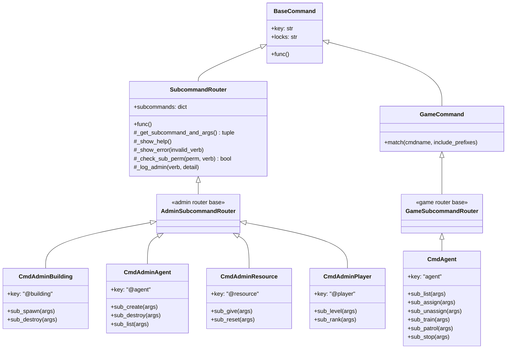
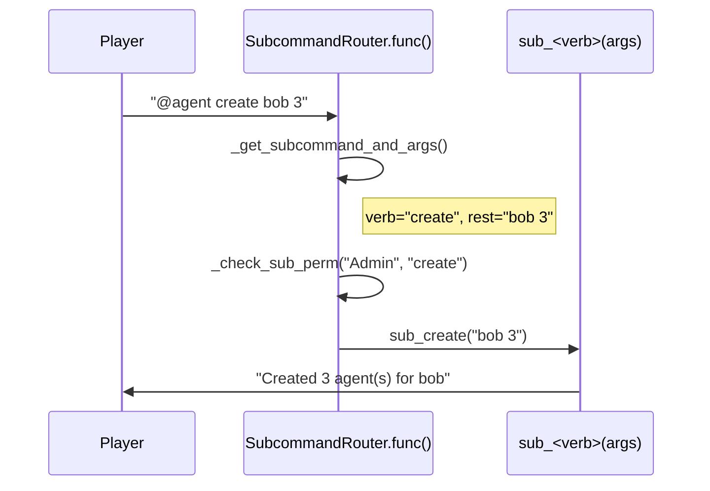

# Design Document: Command Consolidation

## Overview

This feature refactors the command layer of the RTS Combat Overworld to consolidate scattered standalone commands into grouped noun+verb routers. Ten admin commands become four routers (`@building`, `@agent`, `@resource`, `@player`), and six game-facing agent commands become one router (`agent`). Old standalone command classes are deleted. All existing game logic is preserved — only the command dispatch layer changes.

The core abstraction is a `SubcommandRouter` base class that handles subcommand parsing, dispatch, help text generation, and error messages. Each router subclass declares a `subcommands` dict mapping verb strings to handler methods.

### Design Rationale

- **Single dispatch pattern**: Every router uses the same parse → lookup → delegate flow, making the codebase uniform and easy to extend.
- **No logic duplication**: Handler methods on the routers contain the existing command logic, extracted from the old standalone classes. The old classes are deleted.
- **Per-subcommand permissions**: The router checks permissions per-subcommand rather than at the command level, allowing mixed permission levels (e.g., `@agent list` = Builder+, `@agent create` = Admin+).
- **No backward-compatible aliases**: Old command names are removed entirely. The game is in development with a single player — no muscle memory to protect.

## Architecture



### Dispatch Flow



## Components and Interfaces

### SubcommandRouter (Base Class)

Located in `mygame/commands/command_router.py`.

```python
class SubcommandRouter(BaseCommand):
    """
    Base class for commands that dispatch to subcommand handler methods.

    Subclasses define a `subcommands` dict mapping verb strings to
    (handler_method, help_text, required_perm) tuples.
    """

    # Subclasses override this:
    # subcommands = {
    #     "spawn": (sub_spawn, "Spawn a building", "Builder"),
    #     "destroy": (sub_destroy, "Destroy a building", "Builder"),
    # }
    subcommands: dict = {}

    def func(self):
        verb, rest = self._get_subcommand_and_args()
        if verb is None:
            self._show_help()
            return
        entry = self.subcommands.get(verb)
        if entry is None:
            self._show_error(verb)
            return
        handler, _help_text, perm = entry
        if perm and not self._check_sub_perm(perm, verb):
            return
        handler(self, rest)

    def _get_subcommand_and_args(self) -> tuple:
        """Parse first token as verb, remainder as args. Case-insensitive."""
        raw = self.args.strip()
        if not raw:
            return None, ""
        parts = raw.split(None, 1)
        verb = parts[0].lower()
        rest = parts[1] if len(parts) > 1 else ""
        return verb, rest

    def _show_help(self):
        """Display help listing all subcommands."""
        lines = [f"|wUsage: {self.key} <subcommand> [args]|n", ""]
        for verb, (_, help_text, perm) in self.subcommands.items():
            perm_tag = f" ({perm}+)" if perm else ""
            lines.append(f"  |c{verb}|n — {help_text}{perm_tag}")
        self.caller.msg("\n".join(lines))

    def _show_error(self, invalid_verb: str):
        """Display error for unknown subcommand with valid list."""
        valid = ", ".join(self.subcommands.keys())
        self.caller.msg(
            f"Unknown subcommand '{invalid_verb}'. "
            f"Available: {valid}"
        )

    def _check_sub_perm(self, perm: str, verb: str) -> bool:
        """Check caller permission; msg on failure. Returns True if allowed."""
        if self.caller.check_permstring(perm):
            return True
        self.caller.msg(
            f"Permission denied. {perm}+ required for '{verb}'."
        )
        return False

    def _log_admin(self, verb: str, detail: str):
        """Log admin action: operator, command+verb, target."""
        import logging
        logger = logging.getLogger("mygame.admin")
        logger.info(
            "Admin %s: %s %s — %s",
            self.caller.key, self.key, verb, detail,
        )
```

### AdminSubcommandRouter

Inherits `SubcommandRouter` (which inherits `BaseCommand`). Sets `help_category = "Admin"` and `locks = "cmd:perm(Builder);view:perm(Builder)"`. The lock is set to Builder+ (the lowest admin level) — individual subcommands enforce stricter permissions via `_check_sub_perm`.

### GameSubcommandRouter

Inherits both `GameCommand` (for prefix matching) and the dispatch logic from `SubcommandRouter`. Since Python MRO requires careful ordering, `GameSubcommandRouter` inherits `GameCommand` and overrides `func()` with the dispatch logic (composition over multiple inheritance). Sets `help_category = "Game"`.

### Router Definitions

#### CmdAdminBuilding (`@building`)

| Subcommand | Handler | Permission |
|---|---|---|
| `spawn` | `sub_spawn(args)` | Builder+ |
| `destroy` | `sub_destroy(args)` | Builder+ |

- `sub_spawn`: Extracts `<type> [owner=<name>] [level=<N>]` from args. Logic from current `CmdSpawnBuilding.func()`.
- `sub_destroy`: Finds building at caller's tile, deletes it without refund (admin override).

#### CmdAdminAgent (`@agent`)

| Subcommand | Handler | Permission |
|---|---|---|
| `create` | `sub_create(args)` | Admin+ |
| `destroy` | `sub_destroy(args)` | Admin+ |
| `list` | `sub_list(args)` | Builder+ |

- `sub_create`: Logic from `CmdCreateAgent.func()`. Parses `<player> [count]`.
- `sub_destroy`: Logic from `CmdDestroyAgent.func()`. Parses `<id> <player>` or `training <player>`.
- `sub_list`: Logic from `CmdListAgents.func()`. Parses `<player>`.

#### CmdAdminResource (`@resource`)

| Subcommand | Handler | Permission |
|---|---|---|
| `give` | `sub_give(args)` | Builder+ |
| `reset` | `sub_reset(args)` | Admin+ |

- `sub_give`: Logic from `CmdGiveResource.func()`. Parses `<type> <amount> [player]`.
- `sub_reset`: Logic from `CmdResetResources.func()`. Parses `[player]`.

#### CmdAdminPlayer (`@player`)

| Subcommand | Handler | Permission |
|---|---|---|
| `level` | `sub_level(args)` | Admin+ |
| `rank` | `sub_rank(args)` | Admin+ |

- `sub_level`: Logic from `CmdSetLevel.func()`. Parses `<N> [player]`.
- `sub_rank`: Logic from `CmdSetRank.func()`. Parses `<N> [player]`.

#### CmdAgent (`agent`) — Game Command

| Subcommand | Handler | Permission |
|---|---|---|
| `list` | `sub_list(args)` | — |
| `assign` | `sub_assign(args)` | — |
| `unassign` | `sub_unassign(args)` | — |
| `train` | `sub_train(args)` | — |
| `patrol` | `sub_patrol(args)` | — |
| `stop` | `sub_stop(args)` | — |

Each handler contains the logic extracted from the corresponding current standalone command class (`CmdAgents`, `CmdAssign`, `CmdUnassign`, `CmdTrain`, `CmdPatrol`, `CmdStopAgent`).

### File Layout

```
mygame/commands/
├── command_router.py          # SubcommandRouter, AdminSubcommandRouter,
│                              # GameSubcommandRouter
├── admin_commands.py          # CmdAdminBuilding, CmdAdminAgent,
│                              # CmdAdminResource, CmdAdminPlayer,
│                              # + unchanged standalone commands
│                              # (CmdReloadData, CmdTeleport, CmdClearFog,
│                              #  CmdPurgeRooms, CmdMigrate)
├── agent_commands.py          # CmdAgent (game router),
│                              # _get_current_building helper
├── game_commands.py           # Unchanged (GameCommand base, CmdMove, etc.)
├── default_cmdsets.py         # Updated registration
```

## Data Models

No new data models are introduced. This feature operates entirely at the command dispatch layer.

### Command Registration Changes (default_cmdsets.py)

The `CharacterCmdSet.at_cmdset_creation()` registers:

**New routers (replace 16 standalone commands):**
- `CmdAdminBuilding()` — replaces `CmdSpawnBuilding`
- `CmdAdminAgent()` — replaces `CmdCreateAgent`, `CmdDestroyAgent`, `CmdListAgents`
- `CmdAdminResource()` — replaces `CmdGiveResource`, `CmdResetResources`
- `CmdAdminPlayer()` — replaces `CmdSetLevel`, `CmdSetRank`
- `CmdAgent()` — replaces `CmdAgents`, `CmdAssign`, `CmdUnassign`, `CmdTrain`, `CmdPatrol`, `CmdStopAgent`

**Unchanged standalone commands:**
- `CmdReloadData`, `CmdTeleport`, `CmdClearFog`, `CmdPurgeRooms`, `CmdMigrate`

## Correctness Properties

### Property 1: Subcommand dispatch correctness

*For any* `SubcommandRouter` subclass, *for any* verb registered in its `subcommands` dict, and *for any* argument string, calling `func()` with `args = "<verb> <rest>"` SHALL invoke the handler mapped to that verb with `<rest>` as the argument.

**Validates: Requirements 6.1, 6.2, 6.3, 1.1, 2.1, 2.2, 2.4, 3.1, 4.1, 4.2, 5.2, 5.3, 5.5, 5.7**

### Property 2: Invalid subcommand error

*For any* `SubcommandRouter` subclass and *for any* non-empty string that is not a registered verb, calling `func()` SHALL produce an error message containing every valid subcommand name.

**Validates: Requirements 6.4, 1.4, 2.6, 3.4, 4.4, 5.9**

### Property 3: Case-insensitive verb matching

*For any* `SubcommandRouter` subclass and *for any* registered verb, *for any* case variation of that verb, calling `func()` SHALL dispatch to the same handler as the lowercase form.

**Validates: Requirements 6.6**

## Error Handling

### Invalid Subcommand

```
Unknown subcommand '<verb>'. Available: spawn, destroy
```

Handled uniformly by `SubcommandRouter._show_error()`.

### Missing Subcommand

Structured help text listing each subcommand with description. Handled by `SubcommandRouter._show_help()`.

### Permission Denied

```
Permission denied. Admin+ required for 'create'.
```

Checked before dispatch in `_check_sub_perm()`. Handler is NOT invoked.

### Missing or Invalid Handler Arguments

Each handler validates its own arguments and displays usage messages. The router only handles dispatch-level errors.

## Testing Strategy

### Property-Based Tests (Hypothesis)

| Property | Test | Strategy |
|---|---|---|
| P1: Dispatch correctness | `test_subcommand_dispatch` | Generate `(router_class, verb, rest_args)`. Mock handlers. Assert correct handler called with `rest_args`. |
| P2: Invalid verb error | `test_invalid_verb_error` | Generate `(router_class, random_string)` ∉ valid verbs. Assert error message contains all valid verbs. |
| P3: Case-insensitive | `test_case_insensitive_dispatch` | Generate `(router_class, verb, case_variation)`. Assert same handler called. |

### Unit Tests (pytest)

- Help display for each router (no args)
- Per-subcommand permission enforcement
- Admin logging on successful actions
- Command registration: new routers present, old classes absent
- `CmdAgent` inherits `GameCommand`
- `@agent destroy training <player>` variant
- `agent patrol <id> clear` variant

### Test Files

```
mygame/tests/test_command_router.py      # SubcommandRouter base PBT + unit
mygame/tests/test_admin_routers.py       # Admin router handlers + permissions
mygame/tests/test_agent_router.py        # Game agent router handlers
```
