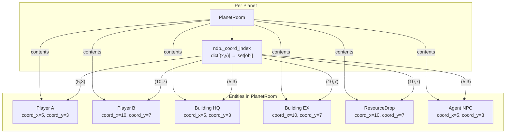
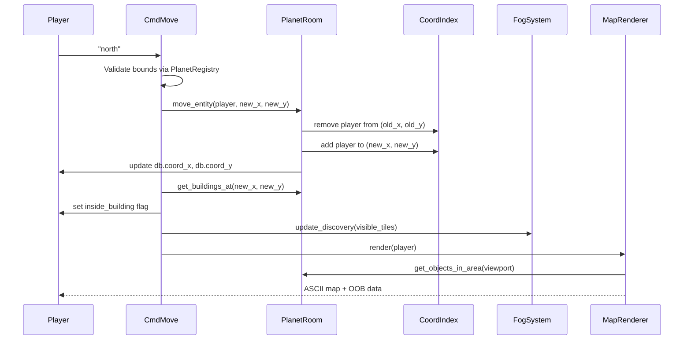

# Design Document: Coordinate Room Refactor

## Overview

This design eliminates the per-tile `OverworldRoom` model entirely. Today, every tile that contains a building gets its own Evennia Room object in the database, resolved on-demand by `TileResolver` and cached by `RoomCache`. This creates unnecessary DB writes, complicates movement (players must `move_to` between rooms), and requires a garbage collector to clean up stale rooms.

The new architecture places all game entities (buildings, resource drops, agents, items, players) inside a single `PlanetRoom` per planet. Each entity carries `coord_x` / `coord_y` attributes identifying its tile. `PlanetRoom` maintains an in-memory coordinate index (`ndb`) for O(1) lookups by `(x, y)`. Movement becomes a simple attribute update — no Evennia `move_to`, no room creation, no room deletion.

### Key Design Decisions

1. **Single room per planet**: One `PlanetRoom` holds all entities. This is the simplest model and avoids all room-lifecycle complexity. The coordinate index makes per-tile queries fast.

2. **Non-persistent index on `ndb`**: The coordinate index lives on `PlanetRoom.ndb` (lost on restart) and is lazily rebuilt from `contents` on first access. This avoids serialization overhead and keeps the index always consistent with Evennia's ground truth.

3. **`move_entity()` for coordinate changes**: A dedicated method atomically updates `coord_x`/`coord_y` and the index, then fires an `at_coord_change` hook so game systems can react. This is the only way to change an entity's tile position within a room. Evennia's `move_to` is reserved for cross-room transfers (e.g., login, planet change). This deliberately bypasses Evennia's `at_pre_move`/`at_post_move` hooks since no room transition occurs.

4. **Resource node depletion as a sparse dict**: Only depleted nodes are stored, keyed by `"x,y"` strings (not tuples) for JSON/admin-panel compatibility. TerrainGenerator remains the source of truth for node existence. Entries are removed when respawn completes.

5. **`inside_building` remains a UI flag**: Players don't physically enter buildings. The flag toggles the building detail panel in the look/map output.

6. **Extracted `CoordinateIndex` class**: The index is a standalone class in `world/coordinate/coordinate_index.py`, not embedded in PlanetRoom. This follows Single Responsibility — PlanetRoom delegates spatial queries to the index. The index is testable in isolation without mocking Evennia rooms.

7. **Proximity filtering via `at_pre_get` hooks, not `search()` override**: Overriding Evennia's `search()` is fragile (complex signature, undocumented kwargs). Instead, objects use `at_pre_get` to reject pickup if the getter isn't at the same coordinates. `look` uses PlanetRoom query methods directly. This is safer and more extensible.

8. **`get_objects_at(x, y, type_tag=None)` as the single query method**: Instead of separate `get_buildings_at`, `get_players_at`, etc., the primary method accepts an optional `type_tag` filter. Convenience wrappers call through to it. New entity types work without adding methods (Open/Closed principle).



## Architecture

### System Interaction Flow



### Subsystem Removal

The following subsystems are deleted entirely:

| Removed | Replacement |
|---------|-------------|
| `OverworldRoom` class | `PlanetRoom` with `CoordinateIndex` |
| `TileResolver` | `PlanetRoom.get_objects_at()`, `get_buildings_at()` |
| `RoomCache` | `CoordinateIndex` on `PlanetRoom.ndb` |
| `RoomGarbageCollector` | Not needed — no rooms to garbage collect |
| `tile_resolver` in `game_systems` | Removed from dict |
| `garbage_collector` in `game_systems` | Removed from dict |

### What Stays Unchanged

- `TerrainGenerator` — still the source of truth for terrain type and resource availability at any coordinate
- `PlanetRegistry` — still validates coordinate bounds
- `FogOfWarSystem` — visibility computation unchanged, only building coordinate reads updated
- `DiscoveryBitfield` — unchanged
- `EventBus`, `DataRegistry`, `CombatEngine`, `RankSystem`, `PowerupSystem`, `TechLabSystem` — unchanged
- `CombatEntity` mixin — unchanged (HP, equipment, incapacitation)
- Player attribute schema (`PLAYER_DEFAULTS`) — unchanged
- `inside_building` flag semantics — unchanged

### What Changes (beyond OverworldRoom removal)

- `NPC` typeclass — inherits from `GameEntity` instead of `DefaultObject` (gains coordinates, tags, spatial queries)

## Components and Interfaces

### 1. GameEntity (extended)

**File**: `mygame/typeclasses/objects.py`

```python
class GameEntity(DefaultObject):
    _object_type_tag: str = "game_entity"

    def at_object_creation(self):
        """Tag the object and initialize coordinate attributes."""
        if self._object_type_tag:
            self.tags.add(self._object_type_tag, category="object_type")
        # Coordinate attributes — None means "not placed on the map"
        self.db.coord_x = None
        self.db.coord_y = None
```

All subclasses (`Building`, `ResourceDrop`, `GameItem`, `NPC`) inherit `coord_x`/`coord_y` automatically. When an entity is in a player's inventory, coordinates are `None`.

### 1b. NPC Inheritance Update

**File**: `mygame/typeclasses/npcs.py`

The `NPC` typeclass changes from `NPC(CombatEntity, DefaultObject)` to `NPC(CombatEntity, GameEntity)`. Since `GameEntity` extends `DefaultObject`, NPC retains all Evennia functionality while gaining coordinate attributes, tag-based identification, and `at_pre_get` proximity checks.

```python
# Before:
class NPC(CombatEntity, DefaultObject): ...

# After:
class NPC(CombatEntity, GameEntity):
    _object_type_tag = "npc"

    def at_object_creation(self):
        super().at_object_creation()  # GameEntity tags + coord init
        self.at_combat_entity_init()  # CombatEntity HP/equipment
        self.db.owner = None
        self.db.npc_type = "agent"
        self.db.agent_id = 0
        self.db.role = ""
        self.db.role_target = None
        self.db.reserve = False
```

This means:
- `NPC.get_all()` returns all NPCs via tag search
- `NPC.get_in_room(planet_room)` returns all NPCs in a PlanetRoom
- `planet_room.get_objects_at(x, y, type_tag="npc")` finds NPCs at a tile
- `planet_room.move_entity(npc, new_x, new_y)` moves NPCs the same way as players
- NPC AI scripts call `move_entity` for pathfinding — same interface as player movement
- `at_coord_change` hook fires on NPC movement for aggro/proximity triggers

Player characters (`CombatCharacter`) do NOT extend `GameEntity` — they extend `DefaultCharacter` and get `coord_x`/`coord_y` via `PLAYER_DEFAULTS`. They participate in the coordinate index through the same attribute convention, just not via `GameEntity` inheritance. This is correct because players have accounts, sessions, and command sets that `DefaultCharacter` provides.

### 2. CoordinateIndex (new)

**File**: `mygame/world/coordinate/coordinate_index.py`

A standalone spatial index class. PlanetRoom owns an instance. Testable in isolation.

```python
class CoordinateIndex:
    """O(1) spatial index mapping (x, y) → set of objects.

    Stored on PlanetRoom.ndb (non-persistent). Lazily rebuilt from
    room contents on first access after restart.

    Future optimization note: if the index grows beyond ~10k keys,
    get_objects_in_area() iterates all keys (O(n) on index size).
    A grid-of-buckets or quadtree can replace the flat dict if needed.
    """

    def __init__(self):
        self._data: dict[tuple[int, int], set] = {}

    def add(self, obj, x: int, y: int) -> None:
        self._data.setdefault((x, y), set()).add(obj)

    def remove(self, obj, x: int, y: int) -> None:
        bucket = self._data.get((x, y))
        if bucket:
            bucket.discard(obj)
            if not bucket:
                del self._data[(x, y)]

    def move(self, obj, old_x, old_y, new_x: int, new_y: int) -> None:
        if old_x is not None and old_y is not None:
            self.remove(obj, int(old_x), int(old_y))
        self.add(obj, new_x, new_y)

    def get_at(self, x: int, y: int) -> list:
        return list(self._data.get((x, y), set()))

    def get_in_area(self, x1: int, y1: int, x2: int, y2: int) -> list:
        result = []
        for (cx, cy), objs in self._data.items():
            if x1 <= cx <= x2 and y1 <= cy <= y2:
                result.extend(objs)
        return result

    def clear(self) -> None:
        self._data.clear()

    def __len__(self) -> int:
        return sum(len(s) for s in self._data.values())

    @classmethod
    def build_from_contents(cls, contents) -> "CoordinateIndex":
        idx = cls()
        for obj in contents:
            cx = getattr(getattr(obj, "db", None), "coord_x", None)
            cy = getattr(getattr(obj, "db", None), "coord_y", None)
            if cx is not None and cy is not None:
                idx.add(obj, int(cx), int(cy))
        return idx
```

### 3. PlanetRoom (enhanced)

**File**: `mygame/typeclasses/rooms.py`

PlanetRoom delegates spatial queries to `CoordinateIndex`. It handles hooks, depletion state, and proximity filtering.

```python
class PlanetRoom(DefaultRoom):

    # --- Lifecycle ---

    def at_init(self):
        """Called on every typeclass cache load (restart/reload).
        Clear the ndb index so it's lazily rebuilt on first access."""
        self.ndb._coord_index = None

    # --- Coordinate Index (ndb, non-persistent) ---

    @property
    def coord_index(self) -> CoordinateIndex:
        """Lazy-init coordinate index. Rebuilt from contents on first access."""
        idx = self.ndb._coord_index
        if idx is None:
            idx = self._rebuild_index()
        return idx

    def _rebuild_index(self) -> CoordinateIndex:
        from world.coordinate.coordinate_index import CoordinateIndex
        idx = CoordinateIndex.build_from_contents(self.contents)
        self.ndb._coord_index = idx
        import logging
        logging.getLogger("mygame.rooms").info(
            "PlanetRoom %s: rebuilt coordinate index (%d objects)", self.key, len(idx)
        )
        return idx

    # --- Query Methods ---

    def get_objects_at(self, x: int, y: int, type_tag: str | None = None) -> list:
        """Return objects at (x, y), optionally filtered by object_type tag.

        Args:
            x, y: Tile coordinates.
            type_tag: If provided, only return objects with this tag in
                      the "object_type" category (e.g., "building", "resource_drop").
        """
        objs = self.coord_index.get_at(x, y)
        if type_tag is None:
            return objs
        return [
            o for o in objs
            if hasattr(o, "tags") and o.tags.get(type_tag, category="object_type")
        ]

    def get_buildings_at(self, x: int, y: int) -> list:
        return self.get_objects_at(x, y, type_tag="building")

    def get_players_at(self, x: int, y: int) -> list:
        return [
            o for o in self.coord_index.get_at(x, y)
            if hasattr(o, "has_account") and o.has_account
        ]

    def get_objects_in_area(self, x1: int, y1: int, x2: int, y2: int) -> list:
        return self.coord_index.get_in_area(x1, y1, x2, y2)

    # --- Mutation ---

    def move_entity(self, obj, new_x: int, new_y: int) -> None:
        """Atomically update an object's coordinates and the index.

        Fires at_coord_change(old_x, old_y, new_x, new_y) on the object
        if the hook exists, for game systems that need to react.
        """
        old_x = getattr(getattr(obj, "db", None), "coord_x", None)
        old_y = getattr(getattr(obj, "db", None), "coord_y", None)
        self.coord_index.move(obj, old_x, old_y, new_x, new_y)
        obj.db.coord_x = new_x
        obj.db.coord_y = new_y
        # Fire custom hook for game system reactions
        if hasattr(obj, "at_coord_change"):
            obj.at_coord_change(old_x, old_y, new_x, new_y)

    # --- Hooks ---

    def at_object_receive(self, moved_obj, source_location, **kwargs):
        """Add arriving object to the coordinate index."""
        super().at_object_receive(moved_obj, source_location, **kwargs)
        cx = getattr(getattr(moved_obj, "db", None), "coord_x", None)
        cy = getattr(getattr(moved_obj, "db", None), "coord_y", None)
        if cx is not None and cy is not None:
            self.coord_index.add(moved_obj, int(cx), int(cy))
        # Show tile info to arriving players (existing behavior preserved)
        ...

    def at_object_leave(self, moved_obj, target_location, **kwargs):
        """Remove departing object from the coordinate index."""
        super().at_object_leave(moved_obj, target_location, **kwargs)
        cx = getattr(getattr(moved_obj, "db", None), "coord_x", None)
        cy = getattr(getattr(moved_obj, "db", None), "coord_y", None)
        if cx is not None and cy is not None:
            idx = self.ndb._coord_index
            if idx is not None:
                idx.remove(moved_obj, int(cx), int(cy))

    # --- Resource Node Depletion (string keys for JSON compat) ---

    def _node_key(self, x: int, y: int) -> str:
        return f"{x},{y}"

    def get_depleted_nodes(self) -> dict:
        """Return the sparse depletion dict: {"x,y": {resource_type, respawn_counter}}."""
        return self.db.depleted_nodes or {}

    def set_node_depleted(self, x: int, y: int, resource_type: str, respawn_counter: int):
        nodes = self.db.depleted_nodes or {}
        nodes[self._node_key(x, y)] = {"resource_type": resource_type, "respawn_counter": respawn_counter}
        self.db.depleted_nodes = nodes

    def clear_node_depletion(self, x: int, y: int):
        nodes = self.db.depleted_nodes or {}
        nodes.pop(self._node_key(x, y), None)
        self.db.depleted_nodes = nodes

    def is_node_depleted(self, x: int, y: int) -> bool:
        nodes = self.db.depleted_nodes or {}
        return self._node_key(x, y) in nodes
```

**Proximity filtering for `get` command**: Instead of overriding `search()`, GameEntity objects use `at_pre_get` to check coordinate proximity:

```python
# In GameEntity (typeclasses/objects.py)
class GameEntity(DefaultObject):
    def at_pre_get(self, getter, **kwargs):
        """Block pickup if getter is not at the same coordinates."""
        if self.db.coord_x is None:
            return True  # not placed, allow (shouldn't happen normally)
        gx = getattr(getattr(getter, "db", None), "coord_x", None)
        gy = getattr(getattr(getter, "db", None), "coord_y", None)
        if gx is None or gy is None:
            return False
        if int(gx) != int(self.db.coord_x) or int(gy) != int(self.db.coord_y):
            getter.msg("That's not here.")
            return False
        return True
```

### 4. CmdMove (simplified)

**File**: `mygame/commands/game_commands.py`

```python
class CmdMove(GameCommand):
    def func(self):
        direction = self._parse_direction()
        if direction is None:
            return
        delta = self.DIRECTION_MAP.get(direction)
        caller = self.caller
        x, y, planet = caller.db.coord_x, caller.db.coord_y, caller.db.coord_planet
        tx, ty = int(x) + delta[0], int(y) + delta[1]

        # Validate bounds
        planet_registry = _get_system(caller, "planet_registry")
        if not planet_registry.is_valid_coordinate(tx, ty, planet):
            caller.msg("You have reached the edge of the map.")
            return

        # Check blocked tiles via coordinate index
        planet_room = caller.location  # Always a PlanetRoom
        buildings_at_target = planet_room.get_buildings_at(tx, ty)
        # ... wall/offline checks against buildings_at_target ...

        # Reset activity state on movement
        # ... (unchanged logic) ...

        # Atomic coordinate update via move_entity
        planet_room.move_entity(caller, tx, ty)

        # Building auto-enter
        if buildings_at_target:
            caller.db.inside_building = True
        else:
            caller.db.inside_building = False

        # Fog + map render (unchanged, but no TileResolver calls)
        ...
```

Key change: `move_entity()` replaces the old pattern of `caller.db.coord_x = tx` + `move_to(room)`. No `TileResolver`, no `OverworldRoom` resolution.

### 5. BuildingSystem (updated)

**File**: `mygame/world/systems/building_system.py`

```python
def _validate_tile_empty(self, tile_or_room, x=None, y=None) -> str | None:
    """Check no building exists at (x, y) in the PlanetRoom."""
    if hasattr(tile_or_room, "get_buildings_at") and x is not None and y is not None:
        if tile_or_room.get_buildings_at(x, y):
            return "This tile already contains a building."
        return None
    # Legacy fallback
    ...

def _default_create_building(building_def, planet_room, owner, x, y):
    """Create building in PlanetRoom with coordinates."""
    building = evennia.create_object(
        "typeclasses.objects.Building",
        key=building_def.name,
        location=planet_room,
    )
    building.db.coord_x = x
    building.db.coord_y = y
    building.attributes.add("building_type", building_def.abbreviation)
    building.attributes.add("owner", owner)
    # ... other attrs ...
    return building
```

### 6. ResourceSystem (updated)

**File**: `mygame/world/systems/resource_system.py`

- `spawn_resource_drop(planet_room, x, y, resource_type, amount)` — updated signature takes PlanetRoom and coordinates explicitly instead of a generic location
- `_spawn_resource_drop()` sets `coord_x`/`coord_y` on the drop and places it in PlanetRoom
- `process_respawns(planet_rooms)` iterates each PlanetRoom's `get_depleted_nodes()` dict instead of OverworldRoom tiles
- `start_harvest()` checks depletion via `PlanetRoom.is_node_depleted(x, y)` and terrain generator

```python
def spawn_resource_drop(planet_room, x, y, resource_type, amount):
    """Create or merge a ResourceDrop at (x, y) in planet_room."""
    if amount <= 0:
        return None
    # Merge with existing drop at same coords + type
    for obj in planet_room.get_objects_at(x, y, type_tag="resource_drop"):
        if getattr(obj.db, "resource_type", None) == resource_type:
            obj.db.amount = (obj.db.amount or 0) + amount
            return obj
    # Create new
    drop = evennia.create_object("typeclasses.objects.ResourceDrop",
                                  key=resource_type, location=planet_room)
    drop.db.resource_type = resource_type
    drop.db.amount = amount
    drop.db.coord_x = x
    drop.db.coord_y = y
    return drop
```

### 7. ProceduralMapRenderer (updated)

**File**: `mygame/world/coordinate/procedural_map_renderer.py`

```python
def render(self, player, player_buildings):
    # ... compute visible_tiles, bounds ...
    planet_room = player.location  # PlanetRoom
    # Single bulk query for the viewport
    area_objects = planet_room.get_objects_in_area(min_x, min_y, max_x, max_y)
    # Group by coordinate
    objects_by_coord = {}
    for obj in area_objects:
        cx = getattr(obj.db, "coord_x", None)
        cy = getattr(obj.db, "coord_y", None)
        if cx is not None and cy is not None:
            objects_by_coord.setdefault((cx, cy), []).append(obj)
    # Render tiles using objects_by_coord instead of get_cached per tile
    ...
```

### 8. MapDataProvider (updated)

**File**: `mygame/world/coordinate/map_data_provider.py`

Same pattern as renderer: bulk `get_objects_in_area()` call, group by coordinate, build tile data from the grouped objects. No more `TileResolver.preload_area()` or `get_cached()`.

### 9. FogOfWarSystem (updated)

**File**: `mygame/world/coordinate/fog_of_war.py`

- `_get_building_coords()` reads `coord_x`/`coord_y` from the building directly instead of from `building.location.x`/`.y`
- `update_discovery()` receives the PlanetRoom and queries buildings at visible coordinates via `get_buildings_at()` instead of `tile_resolver.get_cached()`

### 10. GameTickScript (updated)

**File**: `mygame/typeclasses/scripts.py`

- `_get_all_buildings()` unchanged (tag-based search still works)
- `_get_all_tiles()` removed — no longer needed
- `_compute_active_data()` simplified — no tile filtering needed
- Resource respawn step calls `resource_system.process_respawns(planet_rooms)` passing PlanetRoom objects instead of OverworldRoom tiles

### 11. CombatCharacter (updated)

**File**: `mygame/typeclasses/characters.py`

- `at_post_login()`: ensures player is in the correct PlanetRoom (by `coord_planet`), no TileResolver resolution
- `_enter_tile_room_if_exists()`: removed entirely
- `at_pre_disconnect()`: queries `PlanetRoom.get_objects_at(bx, by)` for ResourceDrop cleanup instead of iterating OverworldRoom contents

### 12. Admin Commands (updated)

**File**: `mygame/commands/admin_commands.py`

- `CmdTeleport`: updates `coord_x`/`coord_y`/`coord_planet`, calls `move_to(planet_room)` only if changing planets
- `CmdSpawnBuilding`: creates building in PlanetRoom at caller's coordinates, no TileResolver
- `CmdPurgeRooms`: updated to delete legacy OverworldRoom objects as migration cleanup

### 13. Migration Script

**File**: `mygame/commands/admin_commands.py` (new `CmdMigrateRooms` command)

```python
class CmdMigrateRooms(BaseCommand):
    """Migrate OverworldRoom contents to PlanetRoom.

    Usage: @migraterooms

    Moves buildings and resource drops from OverworldRooms into the
    corresponding PlanetRoom, setting coord_x/coord_y from the source
    room's x/y attributes. Transfers resource_node_data to PlanetRoom's
    depleted_nodes dict. Deletes empty OverworldRooms after migration.

    Planet mapping: reads the OverworldRoom's 'planet' attribute to
    look up the corresponding PlanetRoom from game_systems["planet_rooms"].
    If no planet attribute exists, logs a warning and skips the room.
    """
    key = "@migraterooms"
    locks = "cmd:perm(Admin)"
```

### 14. Object Pickup/Drop Hooks

**File**: `mygame/typeclasses/objects.py`

```python
class ResourceDrop(GameEntity):
    def at_get(self, getter, **kwargs):
        """Convert to inventory resources and schedule deletion."""
        # ... existing logic (add_resource, zero amount, delay delete) ...
        # Coordinates cleared automatically by PlanetRoom.at_object_leave

class GameItem(GameEntity):
    def at_get(self, getter, **kwargs):
        """Clear coordinates when picked up."""
        self.db.coord_x = None
        self.db.coord_y = None

    def at_drop(self, dropper, **kwargs):
        """Set coordinates to dropper's position when dropped."""
        if hasattr(dropper, "db"):
            self.db.coord_x = getattr(dropper.db, "coord_x", None)
            self.db.coord_y = getattr(dropper.db, "coord_y", None)
```

## Data Models

### Coordinate Index (non-persistent)

```
PlanetRoom.ndb._coord_index: CoordinateIndex
    ._data: dict[tuple[int, int], set[DefaultObject]]
```

- Standalone class in `world/coordinate/coordinate_index.py`
- Key: `(x, y)` integer tuple (internal to the index, not serialized)
- Value: set of Evennia objects at that coordinate
- Lifecycle: `None` after restart (set in `at_init`), lazily rebuilt via `build_from_contents()` on first property access
- Consistency: if index is `None`, rebuilt from `contents`; if a lookup finds an object not in `contents`, falls back to linear scan and logs a warning

### Resource Node Depletion (persistent)

```
PlanetRoom.db.depleted_nodes: dict[str, dict]
```

- Key: `"x,y"` string (e.g., `"50,120"`) — JSON/admin-panel compatible
- Value: `{"resource_type": str, "respawn_counter": int}`
- Sparse: only depleted nodes are stored. Absent key = node available (TerrainGenerator is source of truth)
- Entries removed when respawn_counter reaches 0
- Updated by: `ResourceSystem` on harvest, `ResourceSystem.process_respawns()` on tick

### Entity Coordinate Attributes (persistent)

All `GameEntity` subclasses:
```
obj.db.coord_x: int | None
obj.db.coord_y: int | None
```

Player characters (already exist):
```
player.db.coord_x: int
player.db.coord_y: int
player.db.coord_planet: str
```

### Removed Data

- `OverworldRoom.db.x`, `.db.y`, `.db.planet` — no longer exist
- `OverworldRoom.db.resource_node_data` — replaced by `PlanetRoom.db.depleted_nodes`
- `RoomCache._data` — no longer exists
- All `OverworldRoom` tags (`overworld_tile`, `coord`, `coord_x`, `coord_y`, `coord_planet`, `terrain`, `persistence_type`) — no longer created


## Correctness Properties

*A property is a characteristic or behavior that should hold true across all valid executions of a system — essentially, a formal statement about what the system should do. Properties serve as the bridge between human-readable specifications and machine-verifiable correctness guarantees.*

### Property 1: Coordinate Index Invariant

*For any* PlanetRoom and *for any* sequence of add (at_object_receive), remove (at_object_leave), and move (move_entity) operations, `get_objects_at(x, y)` SHALL return exactly the set of objects whose `coord_x == x` and `coord_y == y` and whose location is the PlanetRoom. Furthermore, if the index is cleared (simulating a server restart) and lazily rebuilt, the rebuilt index SHALL produce identical results to the pre-clear index.

**Validates: Requirements 2.1, 2.5, 2.7, 2.8, 6.5, 6.6, 15.3, 15.5**

### Property 2: Type-Filtered Query Correctness

*For any* PlanetRoom containing a mix of Building objects, player characters, NPC agents, ResourceDrops, and GameItems at various coordinates, `get_buildings_at(x, y)` SHALL return exactly the subset of `get_objects_at(x, y)` that are tagged as buildings, and `get_players_at(x, y)` SHALL return exactly the subset that are player characters.

**Validates: Requirements 2.2, 2.3**

### Property 3: Area Query Correctness

*For any* PlanetRoom with objects at various coordinates and *for any* bounding box `(x1, y1, x2, y2)`, `get_objects_in_area(x1, y1, x2, y2)` SHALL return exactly the set of objects whose `coord_x` is in `[x1, x2]` and `coord_y` is in `[y1, y2]`.

**Validates: Requirements 2.4**

### Property 4: Proximity Message Delivery

*For any* PlanetRoom containing players at various coordinates, when `msg_contents` is called with a `from_obj` at coordinates `(sx, sy)`, only players whose `coord_x == sx` and `coord_y == sy` SHALL receive the message. Players at different coordinates SHALL NOT receive it.

**Validates: Requirements 3.2, 3.6**

### Property 5: Coordinate-Scoped Pickup

*For any* PlanetRoom containing objects at various coordinates and *for any* player at `(sx, sy)`, attempting to pick up (`get`) an object at different coordinates `(ox, oy)` where `(ox, oy) != (sx, sy)` SHALL be blocked by the object's `at_pre_get` hook. Objects at `(sx, sy)` SHALL be pickable.

**Validates: Requirements 3.3**

### Property 6: Drop Coordinate Propagation

*For any* player at coordinates `(px, py)` in a PlanetRoom, when a GameItem is dropped, the item's `coord_x` SHALL equal `px` and `coord_y` SHALL equal `py`. Conversely, when a GameItem is picked up, its `coord_x` and `coord_y` SHALL be `None`.

**Validates: Requirements 3.4, 6.3, 6.4**

### Property 7: Tile Occupancy Validation

*For any* PlanetRoom state, attempting to construct a building at coordinates `(x, y)` where `get_buildings_at(x, y)` returns a non-empty list SHALL fail with an error. Attempting to construct at coordinates where `get_buildings_at(x, y)` returns an empty list (and all other validations pass) SHALL succeed.

**Validates: Requirements 4.2, 14.4**

### Property 8: Resource Drop Merge Correctness

*For any* PlanetRoom containing ResourceDrop objects at various coordinates with various resource types, spawning a new drop of type `T` at `(x, y)` SHALL merge with an existing drop only if that drop has `coord_x == x`, `coord_y == y`, and `resource_type == T`. If no such drop exists, a new ResourceDrop object SHALL be created with the correct coordinates and type.

**Validates: Requirements 5.1, 5.2**

### Property 9: Resource Pickup Accounting

*For any* ResourceDrop with `resource_type == T` and `amount == N` where `N > 0`, when a player picks it up, the player's resource balance for `T` SHALL increase by exactly `N`, and the drop's `amount` SHALL become `0`.

**Validates: Requirements 6.1**

### Property 10: Building Presence Flag

*For any* player movement to coordinates `(tx, ty)` in a PlanetRoom, `inside_building` SHALL be `True` if and only if `get_buildings_at(tx, ty)` returns at least one building. Moving to a tile with no buildings SHALL set `inside_building` to `False`.

**Validates: Requirements 7.4, 7.5**

### Property 11: Depletion Dictionary Sparse Invariant

*For any* PlanetRoom depletion dictionary and *for any* sequence of deplete and respawn-tick operations: (a) the dictionary SHALL contain only entries for currently depleted nodes, (b) each respawn tick SHALL decrement all `respawn_counter` values by 1, and (c) entries whose counter reaches 0 SHALL be removed from the dictionary. An absent key means the node is available.

**Validates: Requirements 9.2, 9.4, 14.3**

## Error Handling

### Coordinate Index Inconsistency

If `get_objects_at(x, y)` finds an object in the index that is no longer in `PlanetRoom.contents` (e.g., deleted without triggering `at_object_leave`), the method SHALL:
1. Log a warning with the object's key and coordinates
2. Remove the stale entry from the index
3. Fall back to a linear scan of `contents` for that specific query
4. Return the linear scan result

### Missing Coordinates

If an object in `PlanetRoom.contents` has `coord_x` or `coord_y` set to `None`, it SHALL NOT appear in the coordinate index and SHALL NOT be returned by any coordinate query method. This is the expected state for objects in transit (e.g., being created but not yet placed).

### Index Rebuild Failure

If `_rebuild_index()` encounters an exception while scanning contents, it SHALL:
1. Log the exception
2. Set `ndb._coord_index` to an empty dict (not `None`, to prevent infinite rebuild loops)
3. All queries will return empty results until the next successful rebuild

### Migration Errors

If the migration script encounters an OverworldRoom with no `x`/`y` attributes, it SHALL:
1. Log a warning with the room's key and id
2. Skip that room
3. Continue processing remaining rooms
4. Include the skipped count in the final report

### move_entity with None Coordinates

If `move_entity()` is called on an object whose current `coord_x`/`coord_y` are `None` (first placement), it SHALL skip the removal step and only perform the add. This supports the pattern of creating an object and then placing it.

## Testing Strategy

### Property-Based Tests (Hypothesis)

The project already uses Hypothesis for property-based testing (see `mygame/tests/test_prop_*.py`). Each correctness property above maps to one or more Hypothesis tests.

**Library**: `hypothesis` (already in use)
**Minimum iterations**: 100 per property test
**Tag format**: `Feature: coordinate-room-refactor, Property {N}: {title}`

**Test file**: `mygame/tests/test_prop_coordinate_index.py`

Properties 1-3 (index invariant, type-filtered queries, area queries) are the highest-value PBT targets because:
- The coordinate index is a pure data structure with clear input/output behavior
- Input space is large (arbitrary object counts, coordinate ranges, operation sequences)
- 100+ iterations will exercise edge cases (empty rooms, single-object rooms, collisions at same coordinate, moves to/from same tile)

Properties 4-5 (message delivery, search filtering) test the proximity filter logic which is also pure and input-dependent.

Properties 8, 9, 11 (merge, pickup accounting, depletion dict) test resource system invariants with varying inputs.

### Generators

```python
# Coordinate strategy: small range to force collisions
coords = st.tuples(st.integers(-10, 10), st.integers(-10, 10))

# Object type strategy
obj_types = st.sampled_from(["building", "player", "agent", "resource_drop", "item"])

# Operation strategy for stateful testing
operations = st.one_of(
    st.tuples(st.just("add"), coords, obj_types),
    st.tuples(st.just("remove"), st.integers(0, 50)),  # index into existing
    st.tuples(st.just("move"), st.integers(0, 50), coords),
)
```

### Unit Tests (Example-Based)

Unit tests cover specific scenarios, integration points, and edge cases not suited for PBT:

- **GameEntity creation**: verify `coord_x`/`coord_y` initialized to `None`
- **Building construction**: verify building placed in PlanetRoom with correct coordinates
- **CmdMove**: verify movement updates coordinates, sets `inside_building` flag, validates bounds
- **CmdTeleport**: verify coordinate and planet updates
- **Migration script**: verify buildings/drops moved from OverworldRoom to PlanetRoom
- **Login flow**: verify player placed in correct PlanetRoom
- **Disconnect cleanup**: verify ResourceDrops deleted at building coordinates
- **HarvesterScript**: verify drops spawned at Extractor coordinates

### Integration Tests

- **Full tick cycle**: GameTickScript processes buildings, respawns, agents with coordinate-based lookups
- **Map rendering**: ProceduralMapRenderer uses `get_objects_in_area` and produces correct output
- **Fog of war**: FogOfWarSystem reads building coordinates from `coord_x`/`coord_y` attributes

### Smoke Tests

- `OverworldRoom` class no longer exists in `typeclasses/rooms.py`
- `TileResolver` class no longer exists in `world/coordinate/tile_resolver.py`
- `RoomCache` class no longer exists in `world/coordinate/room_cache.py`
- `game_systems` dict does not contain `tile_resolver` or `garbage_collector`
- No remaining imports of `TileResolver`, `RoomCache`, or `OverworldRoom` in game commands or systems
