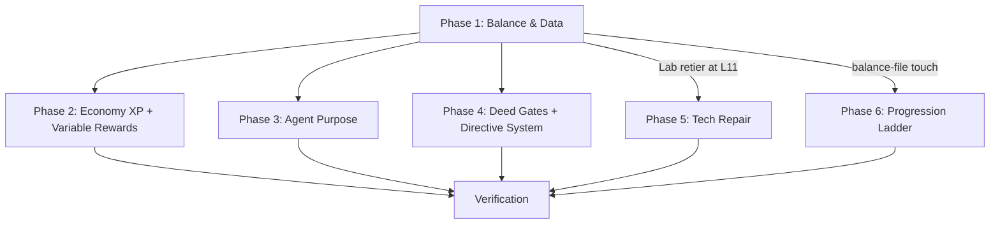

# Implementation Plan: Early-Game Rebalance & Agent Purpose

## Overview

This plan restructures the first-hour experience across six phases:

1. **Balance & Data** — pure YAML/definitions changes (zero runtime logic),
   plus load-time validation of gear pools.
2. **Economy XP + Variable Rewards** — wire XP awards into existing systems,
   add harvest crit and loot range resolution.
3. **Agent Purpose** — cap ceiling fix, role-table changes, scout vision, hide
   stubs.
4. **Deed Gates + Directive System** — the structural additions (counted
   deeds, payload adapter, four new events).
5. **Tech Repair** — research becomes the only tech-acquisition path and all
   five shipped tech effects actually apply (D5 / Requirement 13).
6. **Progression Ladder** — 100-level hybrid curve + widening rank bands
   (D11 / Requirement 14).

Phases 1–3 are independent and can land in any order. Phase 4 depends on
Phase 1 (it references the retiered buildings). Phase 5 is independent of
Phases 2–4 but depends on Phase 1's Lab retier (the earliest tech gate
re-aligns to the new Lab level, L11). Phase 6 is independent of Phases 2–5
EXCEPT that it must land before or with the verification of Phase 1's
threshold-sensitive claims (the hybrid curve changes every threshold above
L2), and the tech-gate alignment (Phase 5 / R13.4) references Corporal = L11,
which the R14 band table deliberately preserves. Each task references its
requirement by number (R1, R2, etc.).

---

## Tasks

### Phase 1: Balance & Data (YAML-only + load-time validation)

- [ ] 1.1 Add economy XP keys to `balance.yaml`: `xp_build_complete`,
  `xp_upgrade_complete`, `xp_harvest_action`, `xp_agent_trained`.
  - _R1.5_
- [ ] 1.2 Add variable-reward keys to `balance.yaml`: `harvest_crit_chance`,
  `harvest_crit_multiplier`, `scout_vision_radius`, `guard_loot_chance`,
  `guard_loot_amount`, `gear_drop_chance`, `rare_gear_chance`.
  - _R5.3, R7.3, R8.5_
- [ ] 1.3 Retune `xp_hq_destroy: 300` and `base_training_ticks: 90` in
  `balance.yaml`.
  - _R1 balance table, R3.3_
- [ ] 1.4 Add the new balance fields to `world/definitions.py` (BalanceConfig
  dataclass) with matching defaults.
  - _R1.5_
- [ ] 1.5 Add validation clauses to `world/schema_validator.py` for the new
  fields (positive int / probability float / positive int).
  - _R1.5_
- [ ] 1.6 Retier `rank_requirement` in `buildings.yaml` per the R2 table.
  - _R2.1_
- [ ] 1.7 Remove or comment `unlocks:` lists from `ranks.yaml` (resolves the
  disagreement with buildings.yaml).
  - _R2.2, R11.2_
- [ ] 1.8 Remove dead config keys `production_scaling` AND `xp_damage` from
  `balance.yaml`, `definitions.py`, and `schema_validator.py` (both are
  loaded and validated but referenced by zero runtime code paths — D10).
  - _R11.1, R11.4_
- [ ] 1.9 Add loot range syntax + gear/rare fields to `outposts.yaml` for
  outpost and fortress templates.
  - _R8.1, R8.3, R8.4_
- [ ] 1.10 Reduce delivery gate in `ability_gates.yaml`: `required_level: 5`.
  - _R3.2_
- [ ] 1.11 Update `test_definitions.py` field count and
  `test_schema_validator.py` for new/removed fields.
  - _(guardrail tests)_
- [ ] 1.12 Add load-time validation of `gear_pool` / `rare_pool` keys in
  `outposts.yaml` against item definitions (in `SchemaValidator` or the
  registry load path) — fail loudly on unknown keys so a drop roll can never
  silently no-op. Include a test: a template with an unknown pool key raises
  at load; known keys pass (D10).
  - _R11.5_

### Phase 2: Economy XP + Variable Rewards (runtime wiring)

- [ ] 2.1 Add `_award_economy_xp` helper to `BuildingSystem` (resolves
  RankSystem via get_system, guards None, calls `award_xp`).
  - _R1.1–2_
- [ ] 2.2 Wire `xp_build_complete` award in `BuildingSystem._complete_construction`
  AND the Engineer-agent completion path (`process_agent_construction` /
  `EngineerScript._complete_construction`, owner resolved from
  `building.db.owner`) — both paths award per D1.
  - _R1.1 (D1)_
- [ ] 2.3 Wire a FLAT `xp_upgrade_complete` award in
  `BuildingSystem._complete_upgrade` — same 30 XP regardless of the new
  level, no ×new_level multiplier (D6).
  - _R1.2 (D6), R12.1_
- [ ] 2.4 Wire `xp_harvest_action` in `ResourceSystem.process_harvest_tick`
  (manual harvest only — check `player` presence, not agent-driven).
  - _R1.3_
- [ ] 2.5 Wire `xp_agent_trained` in `AgentSystem.complete_training`.
  - _R1.4_
- [ ] 2.6 Implement harvest crit in `ResourceSystem.process_harvest_tick`:
  roll crit_chance, spawn bonus drop, fire `harvest_crit` notification.
  - _R7.1, R7.2_
- [ ] 2.7 Implement loot range resolution in `BaseEliminationSystem._drop_loot`:
  detect list → `randint(min, max)`, else fixed.
  - _R8.1_
- [ ] 2.8 Implement gear/rare drop rolls in `_drop_loot` after resource drops.
  - _R8.3, R8.4_
- [ ] 2.9 Implement per-guard mini-drop in CombatEngine `_handle_enemy_death`
  (roll `guard_loot_chance`, drop random resource from base template, only for
  NPC guards with an outpost/fortress owner).
  - _R8.2_
- [ ] 2.10 Add `"harvest_crit"` notification template to
  `notification_presenter.py`.
  - _R7.2_
- [ ] 2.11 Unit tests: economy XP awards (mock RankSystem, verify award_xp
  calls with correct amounts/reasons — flat upgrade award included), crit
  rolls (seed random), loot ranges.
  - _(test coverage)_

### Phase 3: Agent Purpose (role table + fog + cap)

- [ ] 3.1 Change `get_cap_ceiling` in `agent_progression.py`:
  `return max(1, self.get_owner_level(agent))`.
  - _R3.1_
- [ ] 3.2 Add `hidden: bool = False` field to `RoleSpec` dataclass.
  - _R6.2_
- [ ] 3.3 Set `hidden=True` on `soldier` and `medic` entries in `AGENT_ROLES`.
  - _R6.1_
- [ ] 3.4 Derive `VALID_ROLES` with `if not spec.hidden` filter.
  - _R6.1_
- [ ] 3.5 Change `guard` and `scout` to `army=True, buildings=()` in
  `AGENT_ROLES`.
  - _R4.1_
- [ ] 3.6 Remove `("TU",)` from guard and `("RD",)` from scout in
  `AGENT_ROLES` (keep optional station as a future enhancement).
  - _R4.1_
- [ ] 3.7 Update `BUILDING_ROLE_MAP` derivation — guard/scout no longer map
  from TU/RD (or keep them as *optional* station buildings that accept
  guard/scout *in addition* to the no-building path).
  - _R4.2–3_
- [ ] 3.8 Verify `agent assign <id> guard` works without a target building
  (it already handles army roles — the code path exists for soldier).
  - _R4.2_
- [ ] 3.9 Implement scout vision in `fog_of_war.py`:
  - Accept `player_scouts` parameter in `get_visible_tiles`.
  - Add a chebyshev circle per active scout.
  - Read radius from `balance.scout_vision_radius`.
  - _R5.1–3_
- [ ] 3.10 Pass `player_scouts` from `GameTickScript` (or `map_data_provider`)
  — filter player's agents by `role == "scout"`, not incapacitated, same planet.
  - _R5.2_
- [ ] 3.11 Unit tests: cap ceiling (owner L1 → agent ceiling 1, L5 → 5),
  role hiding (VALID_ROLES excludes soldier/medic), guard army assign, scout
  vision union.
  - _(test coverage)_

### Phase 4: Deed Gates + Directive System

- [ ] 4.1 Add `deeds: {}` (dict, deed-id → count — D9) and
  `directives_progress: 0` to `PLAYER_DEFAULTS`.
  - _R9.1 (D9), R10.1_
- [ ] 4.2 Add optional `unlock_deed` (str | null, default null) AND
  `unlock_deed_count` (int, default 1) fields to `BuildingDef` and the YAML
  schema (D9).
  - _R9.2 (D9)_
- [ ] 4.3 Add deed check in `BuildingSystem._validate_construction`: refuse
  with "Requires: {description}" when
  `deeds.get(unlock_deed, 0) >= unlock_deed_count` is not satisfied
  (boolean deeds are simply count ≥ 1).
  - _R9.2, R9.4 (D9)_
- [ ] 4.4 Add `[LOCKED: deed]` suffix in `@building list` / `CmdBuild` display
  for unearned deed-gated buildings.
  - _R9.5_
- [ ] 4.5 Subscribe `BASE_ELIMINATED` → INCREMENT the deed count: NPC outpost
  → `deeds["outpost_cleared"] += 1`; fortress →
  `deeds["fortress_cleared"] += 1` (recorded, gates nothing in this spec).
  Resolve the credited player via the shared payload-resolution helper with
  `player_key: attacker` (attacker → owner via `db.owner` — D7).
  - _R9.3 (D7, D9)_
- [ ] 4.6 Add `unlock_deed: outpost_cleared` to Barracks (implicit count 1)
  and `unlock_deed: outpost_cleared` + `unlock_deed_count: 3` to Lab in
  `buildings.yaml` — NOT `fortress_cleared` (D9: fortresses are group/gear
  content; 3 outposts drives the Act-2 PvE loop).
  - _R9 table (D9)_
- [ ] 4.7 Write `data/definitions/directives.yaml` with the revised 10-step
  sequence per the R10 table (trimmed rewards — non-combat steps total 200
  XP, step 8's combat reward stays 50 — D6). Step 8 declares
  `player_key: attacker` (D7); steps 7 and 10 trigger on `PATROL_SET` with
  conditions `role: guard` / `role: scout` respectively (D8).
  - _R10 table (D6, D7, D8)_
- [ ] 4.8 Add directive YAML loader to `DataRegistry` (list of directive dicts).
  - _R10.4_
- [ ] 4.9 Implement `DirectiveSystem(BaseSystem)` in
  `world/systems/directive_system.py`:
  - Subscribe to all trigger events in the sequence.
  - On event: check player's progress index, match event+condition, award,
    advance, notify.
  - Implement the `_resolve_player` payload adapter (D7): each directive may
    declare `player_key` (default `"player"`) naming the payload key carrying
    the acting entity; NPC/agent/turret actors resolve to their owner via
    `db.owner`; events whose resolved actor is not a player are discarded
    without side effects. Directive 8 uses `player_key: attacker`.
  - _R10.1–3, R10.8 (D7)_
- [ ] 4.10 Add the four new events to `event_bus.py`: `AGENT_TRAINED`,
  `AGENT_ASSIGNED`, `ITEM_EQUIPPED`, `PATROL_SET` (D8 —
  `SCOUT_REVEALED_TILES` is dropped; directive 10 triggers on `PATROL_SET`
  with condition `role: scout`).
  - _R10.9 (D8)_
- [ ] 4.11 Publish the four events (D8): `AGENT_TRAINED` in
  `AgentSystem.complete_training`, `AGENT_ASSIGNED` in the agent assign
  command path, `ITEM_EQUIPPED` in the equip path, and `PATROL_SET` in
  `AgentSystem.set_patrol_route`.
  - _R10.9 (D8)_
- [ ] 4.12 Wire `DirectiveSystem` construction in `game_init.py`.
  - _R10_
- [ ] 4.13 Add `directives` player command: bare = show current + completed
  steps; `directives off` = dismiss-all (set `directives_muted`, forfeit
  remaining rewards); `directives on` = re-enable from current position (D2).
  - _R10.5, R10.7 (D2)_
- [ ] 4.14 Add `directives_muted: False` to `PLAYER_DEFAULTS`; muted players
  still advance progress silently (no reward, no notification).
  - _R10.7 (D2)_
- [ ] 4.15 Unit tests: counted deed gate (refused below required count with
  "Requires: X", granted at/above count, absent `unlock_deed` leaves
  level-only gating intact), directive advance + reward, payload adapter
  (`attacker` → owner resolution, non-player actor discarded), dismiss-all
  (muted advance is silent + rewardless; `on` resumes from current position
  without back-pay).
  - _(test coverage)_

### Phase 5: Tech Repair (research becomes real — D5)

- [ ] 5.1 Remove the tech auto-grant from `RankSystem._unlock_for_rank` and
  the tech revocation from `_revoke_above_rank` — rank promotion/demotion
  keeps planet access and agent caps but never touches technologies.
  Research at a Lab becomes the only tech-acquisition path.
  - _Requirements: 13.1, 13.2_
- [ ] 5.2 Implement `_apply_tech_effect` in `TechLabSystem` (replacing
  `_apply_stat_bonus`): write the five shipped payload keys (`building_hp`,
  `damage`, `damage_reduction`, `sight_range`, `production_multiplier`) into
  `db.tech_bonuses` — additive, except `production_multiplier` which is
  multiplicative. Add a recompute-from-`researched_techs` helper so
  grandfathered players gain real effects on first recompute.
  - _Requirements: 13.3, 13.5_
- [ ] 5.3 Wire the five consumer read points for `db.tech_bonuses`:
  - `damage` → CombatEngine `_get_attacker_bonus`.
  - `damage_reduction` → CombatEngine armor-reduction path.
  - `building_hp` → hp_max computation for the owner's buildings.
  - `sight_range` → FogOfWar vision-radius path.
  - `production_multiplier` → equipment/extractor production path.
  - _Requirements: 13.3_
- [ ] 5.4 Re-align `required_rank` in `technologies.yaml` per the design
  table: Reinforced Walls → Corporal (rank 3, matches Lab at L11), Improved
  Armor → Sergeant, Extended Range → Staff_Sergeant, Advanced Weapons →
  Lieutenant, Rapid Production → Captain.
  - _Requirements: 13.4_
- [ ] 5.5 Add `tech_bonuses: {}` to `PLAYER_DEFAULTS`.
  - _Requirements: 13.3_
- [ ] 5.6 Unit tests: all five payload keys land in `db.tech_bonuses` AND are
  read by their consumer paths (no shipped tech is a no-op); promotion grants
  no techs; demotion revokes no techs (`researched_techs` unchanged across
  rank transitions); grandfathered techs gain effects on recompute.
  - _Requirements: 13.1, 13.2, 13.3, 13.5_

### Phase 6: Progression Ladder (100 levels, hybrid curve — D11)

- [ ] 6.1 Add curve tunables to `balance.yaml` + `BalanceConfig` +
  `schema_validator.py`: `xp_curve_base_delta: 40`,
  `xp_curve_early_ratio: 1.2`, `xp_curve_late_ratio: 1.05`,
  `xp_curve_knee_level: 20`.
  - _Requirements: 14.2_
- [ ] 6.2 Implement the hybrid threshold formula in `world/progression.py`
  (`xp_delta` / `xp_threshold`, memoized 100-entry table), replacing the
  ranks.yaml `xp_threshold` interpolation and retiring
  `FINAL_RANK_XP_PER_LEVEL`.
  - _Requirements: 14.2, 14.4_
- [ ] 6.3 Raise `MAX_LEVEL` to 100 in `world/constants.py`; add the
  `RANK_BANDS` table (12 ranks per the R14 band table); retire
  `LEVELS_PER_RANK` as progression math.
  - _Requirements: 14.1, 14.5_
- [ ] 6.4 Rewrite `rank_from_level` as a `RANK_BANDS` lookup; update
  `world/utils.get_player_level`'s legacy `rank_level → level` fallback to
  map through band start levels.
  - _Requirements: 14.5_
- [ ] 6.5 Remove (or mark derived/display-only) `xp_threshold` fields in
  `ranks.yaml`; keep rank names, `agent_cap`, `planet_access` unchanged.
  - _Requirements: 14.4, 14.6_
- [ ] 6.6 Migration: on login, recompute level from stored `combat_xp` via
  the new curve and keep `max(stored_level, recomputed_level)` (never
  demote).
  - _Requirements: 14.8_
- [ ] 6.7 Unit tests: knee continuity at L20/21, monotonicity property over
  1..100, checkpoint spot values (L2=40, L3=88, L9=660, L20=6,190,
  L100≈1.09M), band lookup edges (Corporal starts L11; Marshal only at
  L100), migration keeps-higher-level rule.
  - _Requirements: 14.2, 14.5, 14.8_

---

## Verification

- [ ] Full fast suite green (2585+ tests).
- [ ] Live-boot smoke: new character → HQ → Extractor → train agent →
  verify level advances to ≥2 from building XP alone.
- [ ] Live-boot smoke: assign guard (no building), set patrol → agent
  patrols, guard auto-attacks an NPC at range.
- [ ] Live-boot smoke: harvest manually → verify occasional crit notification.
- [ ] Live-boot smoke: research a tech at the Lab → verify its effect applies
  (e.g. building hp_max increases) and rank promotion grants nothing.
- [ ] Live-boot smoke: existing character with mid-curve XP logs in → level
  never lower than before; new character dings L2 at 40 XP.
- [ ] Manual play-through of the first-hour timeline (the real acceptance test).

---

## Task Dependency Graph

Phase-level view:



Execution waves (tasks within a wave are independent; same-file tasks are
kept in separate waves):

```json
{
  "waves": [
    { "id": 0, "tasks": ["1.1", "1.6", "1.7", "1.9", "1.10"] },
    { "id": 1, "tasks": ["1.2", "1.4"] },
    { "id": 2, "tasks": ["1.3", "1.5"] },
    { "id": 3, "tasks": ["1.8", "3.1", "3.2"] },
    { "id": 4, "tasks": ["1.12", "2.1", "2.4", "2.5", "2.7", "2.9", "2.10", "3.3", "6.3"] },
    { "id": 5, "tasks": ["1.11", "2.2", "2.6", "2.8", "3.4", "3.9", "6.1", "6.5"] },
    { "id": 6, "tasks": ["2.3", "3.5", "3.10", "6.2", "6.4"] },
    { "id": 7, "tasks": ["2.11", "3.6", "4.1"] },
    { "id": 8, "tasks": ["3.7", "3.8", "4.2", "4.6", "4.7", "4.10", "4.14"] },
    { "id": 9, "tasks": ["3.11", "4.3", "4.8", "4.11", "5.1", "5.4", "5.5"] },
    { "id": 10, "tasks": ["4.4", "4.9", "5.2", "6.6"] },
    { "id": 11, "tasks": ["4.5", "4.12", "4.13", "5.3"] },
    { "id": 12, "tasks": ["4.15", "5.6", "6.7"] }
  ]
}
```

## Notes

- Each task references its requirement(s) by number for traceability against
  the renumbered requirements document (R1–R13); resolved decisions D1–D10
  are annotated where they shaped a task.
- Upgrade XP is a FLAT 30 per completed upgrade (D6) — no ×new_level anywhere
  in Phase 2.
- Deeds are counted (D9): the store is a dict (deed-id → count) and boolean
  deeds are simply count ≥ 1. The Lab gates on 3 cleared outposts, not
  fortresses.
- The directive payload adapter (D7) and the BASE_ELIMINATED deed
  subscription share one player-resolution helper (`player_key`, attacker →
  owner via `db.owner`).
- Phase 5 (Tech Repair) is independent of Phases 2–4 but depends on Phase 1's
  Lab retier — the earliest tech's `required_rank` matches the new Lab gate
  (L11, Corporal).
- Phase 6 reshapes thresholds above L2 only — the L2=40 anchor keeps every
  economy-XP calibration in Phases 1–4 valid; Corporal's band (L11–15)
  preserves the Lab/tech alignment from Phase 5.
- Test tasks (1.11, 1.12's test, 2.11, 3.11, 4.15, 5.6) validate against the
  design's Correctness Properties 1–8 where applicable.
- Checkpoints: the Verification section serves as the final checkpoint —
  ensure all tests pass, ask the user if questions arise.
