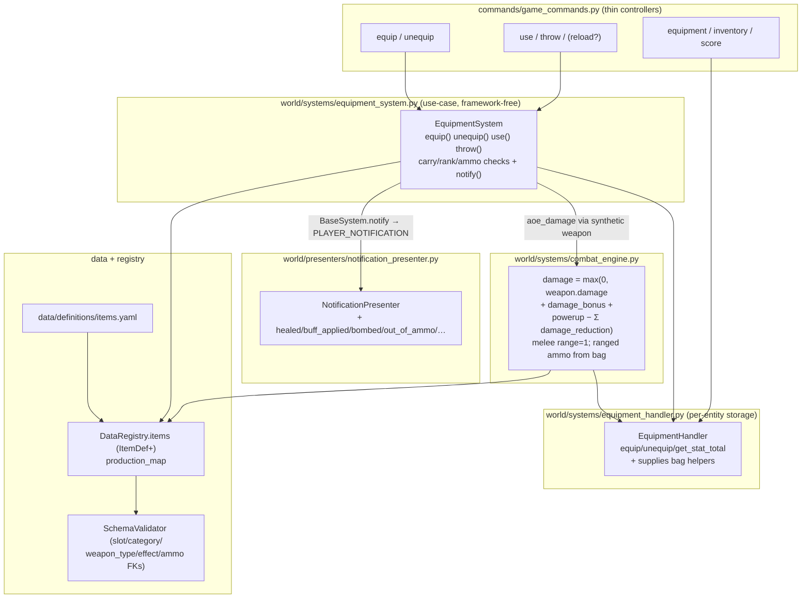

# Design Document

## Overview

This feature deepens the item layer into equipment, weapons, and special items while
changing the combat engine as little as possible. The guiding realization — verified
against the code — is that **combat is already built for multi-slot equipment**:

- Target armor is `target.equipment.get_stat_total("damage_reduction")`, a sum across
  *all* equipped items (`combat_engine.py` `_get_target_armor_reduction`, `equipment_handler.py`
  `get_stat_total`). Nine armor slots aggregate with zero formula change.
- Weapon `range` is already enforced via Manhattan distance
  (`combat_engine.py` attack-queue validation + `_validate_range`), and ammo is already deducted
  on the attack-queue step (~`:124`).
- The synthetic-weapon pattern already exists for non-equipped attackers
  (`_TurretWeapon`, `combat_engine.py`) — the exact mechanism throwable AoE reuses.

(Line numbers throughout this doc are approximate — prefer the named function when locating code, as line refs drift.)
- Equipment slots are already free-form strings keyed off `item.slot`
  (`equipment_handler.py:70`); there is no slot allowlist to fight.

So the work is: a canonical slot vocabulary + item taxonomy in data and constants; a
counted Supply_Bag mirroring `db.resources`; typed weapons; use/throw actions; rank-gated
equipping; and richer display — with combat receiving only two additive touches
(`damage_bonus` in the bonus term, and melee range/ammo gating).

Nine decisions are locked (see requirements D1–D9):

1. **Eleven-slot balanced body model** (`head, eyes, face, torso, arms, hands, legs, feet, back, weapon, accessory`).
2. **Ammo as counted Supplies** in `db.supplies`, coexisting with the existing resource-pool `ammo_cost`.
3. **use/throw ship in this feature**, AoE via synthetic weapon.
4. **`required_rank` enforced on equip/use/throw** (the field already load-validates as a real rank).
5. **Magazine/reload adopted** — ranged weapons fire from a loaded magazine (`db.loaded` up to `magazine_size`); a `reload` action refills it from the counted-ammo Supply_Bag. Shots draw from the magazine, not the bag.
6. **`max_hp` from gear intended but deferred** — declared and load-validated as a numeric stat, but not wired to `hp_max` in this feature (low-priority follow-up).
7. **Weight-based carry cap replaces the count cap** — every item (`Item_Def.weight`) and resource (`BalanceConfig.resource_weights`) has a weight; a holder's carried weight (Supplies + on-person resources, **excluding equipped Gear**) must stay under `BASE_CARRY_WEIGHT + Σ carry_capacity(gear)`. Admins (Builder+) exempt; players and Agents subject.
8. **Real Vault/HQ storage added** — `db.resources` stays the carry-capped **spend pool** (unchanged for all cost checks); Storage_Buildings gain a real stored-resource pool with enforced `storage_capacity`; `deposit`/`withdraw` move between them; harvester delivery fills the building.
9. **Over-capacity inflow spills to the ground** — passive inflow past a carry/storage limit adds up to the limit and spawns the remainder as a `ResourceDrop` (reusing `_spawn_resource_drop`); resources are never destroyed.

Two storage kinds, each mirroring an existing pattern:

| Kind | Category | Storage | Mirrors |
|---|---|---|---|
| **Gear** | armor, weapon, accessory | `db.equipment_slots` (one Game_Item per slot) | today's `EquipmentHandler` |
| **Supply** | ammo, consumable, throwable | `db.supplies: {item_key: count}` | today's `db.resources` |

All mutation routes through the framework-free `EquipmentSystem` use-case; `EquipmentHandler`
stays a pure storage mechanism; all new strings are `PLAYER_NOTIFICATION` events formatted
by `NotificationPresenter`.

## Architecture



## Components and Interfaces

### 1. Data model — `ItemDef` (`world/definitions.py`)

Extend the existing 7-field dataclass; every new field is defaulted so existing
`ItemDef(...)` construction and `GameItem` attribute paths keep working.

```python
@dataclass
class ItemDef:
    key: str
    name: str
    slot: str = ""                      # required for Gear; "" for Supplies
    category: str = "armor"             # NEW: armor|weapon|accessory|ammo|consumable|throwable
    stat_modifiers: dict[str, float] = field(default_factory=dict)
    # weapon
    weapon_type: str | None = None      # NEW: melee|ranged (weapon category only)
    ammo_type: str | None = None        # NEW: ammo item key the magazine holds (ranged)
    ammo_per_shot: int = 1              # NEW
    magazine_size: int | None = None    # NEW: magazine capacity (ranged); weapon tracks db.loaded
    ammo_cost: dict[str, int] | None = None   # existing: resource-pool cost (energy weapons)
    # supply
    effect: dict | None = None          # NEW: {"type": ..., ...} for consumable/throwable
    max_stack: int = 99                 # NEW: per-entry cap in the Supply_Bag
    # weight (carry capacity)
    weight: float = 1.0                 # NEW: per-unit carried weight (≥0); gear + supplies
    # gating
    required_rank: str | None = None    # existing; now enforced on equip/use/throw
    classification: str = "modern"      # existing
```

`data_registry._populate_items` (`data_registry.py:248`) gains `entry.get(...)` reads for
the new fields with these defaults — the same populator pattern already used.

### 2. Constants (`world/constants.py`)

```python
EQUIPMENT_SLOTS = ("head", "eyes", "face", "torso", "arms", "hands",
                   "legs", "feet", "back", "weapon", "accessory")
GEAR_CATEGORIES = ("armor", "weapon", "accessory")
SUPPLY_CATEGORIES = ("ammo", "consumable", "throwable")
ITEM_CATEGORIES = GEAR_CATEGORIES + SUPPLY_CATEGORIES
WEAPON_TYPES = ("melee", "ranged")
# stat keys that aggregate across gear via get_stat_total():
# NB: the `carry_capacity` GEAR STAT (a weight delta added to the limit) is unrelated to the
# per-agent `npc.db.carry_capacity` delivery-load COUNT budget in agent_scripts.py — same word,
# different unit and owner. See §4b.
AGGREGATED_STATS = ("damage_reduction", "damage_bonus", "move_speed",
                    "sight_range", "carry_capacity", "max_hp", "accuracy")
EFFECT_TYPES = ("heal", "buff", "aoe_damage")   # NOT data-only: a new effect needs this tuple + a
                                                # validator rule + a use/throw branch + (usually) a
                                                # presenter kind. The three mechanics are genuinely
                                                # different; a handler-registry would only relocate the
                                                # branch, not remove it. See COMPLEXITY_REVIEW touchpoint row.
BASE_CARRY_WEIGHT = 1000                         # weight units; limit = BASE + Σ carry_capacity(gear)
DEFAULT_RESOURCE_WEIGHT = 1.0                    # per-unit weight for a resource absent from resource_weights
DEFAULT_THROW_RANGE = 4
```

`BASE_CARRY_WEIGHT` is structural (it gates the carry-limit correctness property), so it lives in
`constants.py`, consistent with the two-tier config boundary documented in `COMPLEXITY_REVIEW.md §2d`.
Per-item `weight` is data on `Item_Def` (in `items.yaml`); per-resource weights are hot-tunable in
`balance.yaml` via `BalanceConfig.resource_weights` (see §1b). Weights are deliberately set so a
player can carry a large-but-finite amount; all are post-playtest tuning targets.

### 1b. Weight config — `BalanceConfig.resource_weights` (`world/definitions.py`, `balance.yaml`)

Resources have no def class today (`RESOURCE_TYPES` is a bare tuple; resources live only as dict keys
in `db.resources`), so per-resource weight cannot hang off an `ItemDef`. It becomes a hot-tunable map
on `BalanceConfig`:

```python
resource_weights: dict[str, float] = field(default_factory=lambda: {
    "Wood": 0.5, "Stone": 1.0, "Iron": 1.0, "Energy": 0.2, "Circuits": 0.3, "Nexium": 2.0})
```

Threaded via the existing balance pattern: `BalanceConfig` field → `validate_balance` (new
resource→float rule: keys ⊆ `RESOURCE_TYPES`, values ≥ 0) → `_load_balance` read → optional
override block in `balance.yaml`. With base 1000 and these weights, a player can haul ~2000 Wood or
~500 Nexium — "a lot, but not infinite." A missing resource weight defaults to `DEFAULT_RESOURCE_WEIGHT`.

**Case invariant:** `resource_weights` keys, the `carried_weight` lookup, and `db.resources` keys all
use the canonical title-case `RESOURCE_TYPES` (`"Wood"`, `"Stone"`, …); `add_resource`/`get_resource`
already `.title()` their argument (`characters.py`), and the validator membership check is
case-sensitive against `RESOURCE_TYPES`. Author `balance.yaml` weights title-cased.

### 3. `EquipmentHandler` — storage extensions (`world/systems/equipment_handler.py`)

Keep the entire existing public API. Add Supply_Bag helpers so both Gear and Supplies
have one storage owner per entity:

```python
def get_supplies(self) -> dict[str, int]           # read db.supplies (fallback dict for tests)
def get_supply(self, item_key) -> int
def add_supply(self, item_key, count) -> int        # returns amount actually added (respects max_stack)
def remove_supply(self, item_key, count) -> bool    # False if insufficient; zeroes/removes depleted
def supplies_weight(self, provider) -> float        # Σ item_def.weight × count over db.supplies
```

Storage mirrors `_get_slots`/`_set_slots`: read/write `character.attributes.get/add("supplies", {})`
with a `_supplies` fallback dict for the stubbed test environment. `get_stat_total` is unchanged
and already sums any stat across equipped Gear.

**Carried weight is computed by the `EquipmentSystem`, not the handler**, because it spans two stores
the handler doesn't own the resource side of: `carried_weight(player) = handler.supplies_weight(provider)
+ Σ(resource_weights[type] × player.db.resources[type])`. Equipped Gear weight is **excluded** by
design (worn, not hauled). The `carry_capacity` limit is `BASE_CARRY_WEIGHT + get_stat_total("carry_capacity")`.
`supplies_weight(self, provider)` takes a `DefinitionsProvider` as an **explicit argument** to resolve
each `Item_Def.weight` — the handler's `__init__` takes only `character` today (it does *not* already
hold a provider), so passing the provider per call keeps the handler framework-free without rewriting
its ~20 existing call sites to thread a provider through construction.

### 4. `EquipmentSystem` — the use-case (`world/systems/equipment_system.py`)

Today this class only does per-tick production. Add the mediating actions (all return
`(ok: bool, )` and emit notifications via `BaseSystem.notify`, composing no strings):

```python
def equip(self, player, item) -> bool          # rank gate → handler.equip → notify
def unequip(self, player, slot) -> bool         # validate slot ∈ EQUIPMENT_SLOTS → handler.unequip
def use(self, player, item_key) -> bool         # consumable: has? → apply effect → decrement → notify
def throw(self, player, item_key, tx, ty) -> bool  # throwable: has? → range → AoE via combat → decrement → notify
def reload(self, player) -> bool                # equipped ranged weapon: pull ammo_type from bag → db.loaded
def add_supply_drop(self, player, item_key, count) -> int  # carry-WEIGHT-aware pickup
def carried_weight(self, player) -> float       # supplies + on-person resources (excl. equipped gear)
def carry_limit(self, player) -> float          # BASE_CARRY_WEIGHT + Σ carry_capacity(gear); ∞ for admins
def deposit(self, player, resource, amount) -> int   # Spend_Pool → co-located Storage_Building
def withdraw(self, player, resource, amount) -> int  # Storage_Building → Spend_Pool (carry-weight-capped)
def add_resource_capped(self, holder, resource, amount) -> int  # inflow choke point; spills overflow to ground
```

- **Rank gate** (`equip`, `use`, `throw`): resolve `item_def.required_rank` → rank level via
  the registry rank table (reuse the same lookup `RankSystem` uses), compare against
  `world.utils.get_player_level(player)` / current rank. On fail: `notify(player, "equip_denied", …)`.
- **`use` heal**: `player.take_damage`/`heal` on `CombatEntity` already clamps to `hp_max`
  (`combat_entity.py`) — call `heal(amount)`; `notify(player, "healed", amount=…)`.
- **`use` buff**: reuse the timed-buff machinery `PowerupSystem` already owns. The real
  `db.active_powerups` entry (see `powerup_system.py` `activate`) is keyed and shaped
  `{"<key>": {"expires_tick": <current_tick + duration_ticks>, "effect": {"effect_type": "damage_bonus",
  "effect_value": 10}}}` — expiry compares the absolute `expires_tick` each tick in `process_tick`
  (`powerup_system.py` ~`:158`); it does **not** decrement a per-entry counter. The combat read
  (`_get_attacker_bonus`, `combat_engine.py` ~`:494`, powerup loop ~`:504`) already sums these.
  **Two things are required for this to actually work** (the earlier "no new code" claim was wrong):
  (1) the stim must write the entry in that exact shape, and (2) it must register the player with
  PowerupSystem's expiry tracking (`_active_players`, which `activate` populates) — a directly-written
  `db.active_powerups` entry that skips this is never visited by `process_tick` and **never expires**.
  Prefer routing the stim through a `PowerupSystem.apply_timed_effect(player, effect_type, value,
  duration_ticks)` entry point (extract from `activate`) rather than writing the dict by hand.
  `notify(player, "buff_applied", …)`.
- **`throw` AoE**: build a `_ThrowWeapon(damage, radius)` synthetic item (same shape as
  `_TurretWeapon`), find targets within `radius` of `(tx,ty)` on the player's planet via the
  coordinate index, and route each through the existing `CombatEngine._calculate_damage` +
  application path so armor and clamping apply for free. `notify(thrower, "bombed", …)`.
- **`reload`**: read the equipped `weapon`-slot Game_Item; reject if it has no `ammo_type`
  (`notify "reload_no_ammo_weapon"`) or is already full (`notify "already_loaded"`); else transfer
  `min(magazine_size − db.loaded, bag[ammo_type])` from the Supply_Bag into `db.loaded`, decrement the
  bag by exactly that, and `notify(player, "reloaded", loaded=…, magazine_size=…, remaining=…)`. Fresh
  ranged weapons are created with `db.loaded = magazine_size` (full on acquisition).
- **Carry weight (D7)**: `carry_limit(player)` = `∞` if `is_admin(player)` (Builder+), else
  `BASE_CARRY_WEIGHT + get_stat_total("carry_capacity")`. `add_supply_drop` adds
  `min(request, max_stack_room, floor(weight_room / item.weight))`; leftover spills to a drop and
  `notify(player, "carry_full", carried=…, dropped=…)`. Equipped Gear is excluded from `carried_weight`.
- **Admin exemption (D7)**: every carry cap check is gated `if not is_admin(holder):` using
  `world.utils.is_admin` (the existing `check_permstring("Builder")` path). Only staff are exempt.
  In practice the only holder with a weight-capped resource/supply pool is the **player** — Agents hold
  no `db.resources` and get no `db.supplies` in this feature (D7 scope note), so the cap never binds on
  an Agent; the check is written holder-generically so it extends free if that ever changes. (The
  Storage_Building cap is `storage_capacity`, not `is_admin`-gated — a building is never an admin.)
- **Storage (D8)**: `deposit(player, resource, amount)` moves from `player.db.resources` into a
  co-located Storage_Building's stored pool up to its `storage_capacity`; `withdraw` moves the other
  way, capped by the player's remaining carry weight (leftover stays in storage, `notify`). The
  Storage_Building pool is a new persistent building attribute (e.g. `db.stored_resources: dict`),
  distinct from any player's Spend_Pool. `storage`-capability lookup reuses `building_has_capability`.
  **HQ ships with `storage_capacity: 0`** — this feature raises it (Req 16.2) so a functional store
  exists from level 1; `0` means "no storage," never "unlimited." Delivery target selection skips
  storage buildings with no remaining capacity (Req 16.6) so a full building never spills a whole load.
- **Inflow choke point (D9)**: `add_resource_capped(holder, resource, amount)` is the single funnel
  for inflows that write a *holder pool*. It adds `min(amount, room_at(holder))` (room = carry-weight
  room for a player, `storage_capacity` room for a building) and spawns the remainder via the existing
  `ResourceSystem._spawn_resource_drop` at the holder's coords, then `notify` `carry_full`/`storage_full`;
  admins bypass the cap. The paths that route through it are the ones that actually write a holder pool:
  **drop pickup (`get` → `at_get`)**, **harvester delivery deposit** (into a Storage_Building), and
  **admin `@resource give`** (admins bypass). Extractor output and presence-harvest do **not** route
  through it — in the current code they spawn ground `ResourceDrop`s directly (`resource_system.py`
  ~`:259`/`:267`/`:437`), so the cap bites when the player *picks the drop up*, not when it is produced.

**Scalability (stakeholder concern): `carried_weight` is computed on demand at an inflow/action, never
per tick.** It is only evaluated inside `add_resource_capped` (a pickup, delivery deposit, or admin
give) and inside `withdraw`/`deposit`/`add_supply_drop` — all player-action or per-delivery events, not
the tick loop. Cost is O(distinct supply keys + distinct resource types) per event. **No implementer
should wire `carried_weight` into `GameTickScript`**; a per-tick recompute across all online players is
the only real scaling hazard and is explicitly out of scope. Extractor/presence-harvest production
stays a ground-drop (object-churn is pre-existing, unchanged by this feature).

`EquipmentSystem` gains an injected combat collaborator for `throw`. Consistent with the DI
pass, this is an injected callable (like `CombatEngine.set_agent_xp_awarder`), not a
`game_systems` reach: `equipment_system.set_area_damage_applier(lambda: combat_engine)` wired
in `game_init`. Keeps `world/systems/` free of the service locator and honors the layering guard.

### 4b. Spend_Pool vs. Storage, and the delivery-FSM change (D8)

The single most important compatibility fact: **`db.resources` stays the spend pool.** Every cost
check today (`has_resources`/`deduct_resources` for build, upgrade, research, and the weapon
`ammo_cost`) reads `db.resources`, and none of that changes — it is just now bounded above by carry
weight. Storage is *additive*, not a replacement:

- **Storage_Building pool** — a new persistent `db.stored_resources: dict[str,int]` on `storage`-capability
  buildings (Vault `VT`, HQ), bounded by the building's `storage_capacity` (today cosmetic; now enforced).
  This is where surplus lives beyond what a player carries.
- **Delivery FSM change** (`typeclasses/agent_scripts.py` `DeliveryBehavior`): the deposit step currently
  calls `owner.add_resource(...)` (→ player `db.resources`). It is redirected to deposit into the target
  Storage_Building's pool via `add_resource_capped(building, …)`. This is the one behavioral change to the
  agent-ai delivery loop; the transient per-trip `carried_resources` count and laden/empty movement
  (`DEFAULT_CARRY_CAPACITY`) are untouched (they measure a different thing — see the memo's harmonization
  note; `DEFAULT_CARRY_CAPACITY` is a delivery *load budget*, not the new weight cap).
- **Migration**: existing players simply gain the storage buildings' empty pools; their `db.resources`
  may briefly exceed the new carry cap after deploy — the cap is enforced on *inflow* and on *withdraw*,
  never by retroactively deleting held resources, so a full player just can't gain more until they
  deposit/spend down. This is the safe, non-destructive path.

### 5. Combat engine — the two additive touches (`world/systems/combat_engine.py`)

1. **`damage_bonus` aggregation.** In `_get_attacker_bonus` (`:496`), add
   `attacker.equipment.get_stat_total("damage_bonus")` to the powerup bonus. The existing
   comment "tech/equipment bonuses are folded into weapon damage" is updated: flat gear
   `damage_bonus` (gloves, accessory) now aggregates here. Formula shape unchanged (Req 14.1).
2. **Melee gating + magazine draw.** In the attack-queue validation (`:98`–`:124`):
   - If `weapon_type == "melee"`: effective range = 1 (ignore any `range` stat); skip all ammo.
   - If `weapon_type == "ranged"` and `ammo_type` set: require `weapon.db.loaded >= ammo_per_shot`;
     on a shot, decrement `weapon.db.loaded` by `ammo_per_shot` (the Supply_Bag is *not* touched on a
     shot — it is drawn only by `reload`). Apply any resource `ammo_cost` per shot as today. Empty
     magazine → reject + `notify(attacker, "out_of_ammo", …)` prompting reload.
   - Reload is an `EquipmentSystem.reload` action (design §4), not a combat concern.

Weapon determination (`_get_weapon_item`, `:424`) and the `attacked` notification (`:406`) are
unchanged. Turrets are unaffected (they already use a synthetic weapon with no ammo).

### 6. Presenter — new notification kinds (`world/presenters/notification_presenter.py`)

Add formatter entries to `_FORMATTERS` (one line each), no system-side strings:

| kind | data | example |
|---|---|---|
| `equip_denied` | `item_name, required_rank, current_rank` | `"|r[Equip] {item_name} requires rank {required_rank} (you are {current_rank}).|n"` |
| `out_of_ammo` | `weapon_name, ammo_name` | `"|r[Combat] {weapon_name} is empty — reload to fire.|n"` |
| `reloaded` | `weapon_name, loaded, magazine_size, ammo_name, remaining` | `"|g[Reload] {weapon_name}: {loaded}/{magazine_size} ({remaining} {ammo_name} left).|n"` |
| `reload_failed` | `reason` (`no_ammo`/`already_loaded`/`no_ammo_weapon`) | `"|y[Reload] {reason-specific message}.|n"` |
| `healed` | `amount, hp, hp_max` | `"|g[Use] Healed {amount} HP ({hp}/{hp_max}).|n"` |
| `buff_applied` | `stat, amount, duration_ticks` | `"|g[Use] +{amount} {stat} for {duration_ticks}s.|n"` |
| `bombed` | `count, x, y` | `"|y[Throw] Hit {count} target(s) at ({x},{y}).|n"` |
| `carry_full` | `item_name, carried, dropped` | `"|y[Supply] Carried {carried} {item_name}; {dropped} left behind (over carry weight).|n"` |
| `storage_full` | `resource, stored, dropped, building` | `"|y[Storage] {building} full; stored {stored} {resource}, {dropped} dropped.|n"` |
| `deposited` | `amount, resource, building, stored, capacity` | `"|g[Storage] Deposited {amount} {resource} → {building} ({stored}/{capacity}).|n"` |
| `withdrew` | `amount, resource, carried, limit` | `"|g[Storage] Withdrew {amount} {resource} (carrying {carried}/{limit}).|n"` |

Thrown-at victims reuse the existing `attacked` kind (weapon_name = the bomb's name).
End-to-end presenter tests assert these render, matching the harvest/building pattern already
in the suite.

### 7. Fog-of-war sight bonus (`world/coordinate/fog_of_war.py`)

The player vision radius computation gains `+ player.equipment.get_stat_total("sight_range")`.
This is the single wiring point for the `eyes`/scope stat; everything else about fog is unchanged.

### 8. Commands (`commands/game_commands.py`)

`equip`/`unequip` re-route through `EquipmentSystem` (were calling the handler directly).
`equipment` becomes a full **paperdoll**: iterate `EQUIPMENT_SLOTS` (showing empties), print each
slot's item + stats, then totals. `inventory`/`score` add a **Supplies** section from `get_supplies()`
and a **carried-weight / limit** line (`carried_weight` vs `carry_limit`). New `use`, `throw`, `reload`,
`deposit`, and `withdraw` commands are thin `GameCommand`s using `require_system("equipment_system")`
and `require_coords()`, resolving items via `registry.resolve_item`. `deposit`/`withdraw` locate a
co-located Storage_Building via `buildings_here` + `building_has_capability("storage")` and show the
building's `stored/capacity`. All follow the existing controller shape.

### 9. Content & production (`data/definitions/items.yaml`, `equipment_system.py`)

- Migrate (no load failure): `scope` → `slot: eyes`; `jetpack` → `slot: back`; **`kevlar_vest` and
  `power_armor` → `slot: torso`** (they currently ship `slot: armor`, which is now a *category*, not a
  legal slot — the validator would reject them); add `weapon_type` to the four weapons
  (`combat_knife: melee`, the rifles: `ranged`); add `category` to all eight existing items. Retire the
  ad-hoc slot strings `gadget`, `consumable`, **and `armor`**.
- Seed: body armor per slot (helmet/head, chest/torso, greaves/legs, boots/feet, gloves/hands, …),
  ammo (`rifle_rounds`, `energy_cell`), consumables (`medkit`, `combat_stim`), throwable (`frag_grenade`),
  and a `carry_capacity`-stat "hauler pack" (`back` slot) as the cap-raiser.
- Add a `weight` to every item (reference: light gear 2–5; rifle/armor 8–15; heavy 25–40); set
  `resource_weights` in `balance.yaml` (light per D7).
- Production map: `AR → weapons+ammo`, `AA → armor`, `MB → consumables`, `LB → futuristic+throwables`.
- `EquipmentSystem.process_production` (`:55`) routes Supply-category produce into `add_supply`
  and Gear into a `GameItem` object, keyed off `item_def.category`.

## Data Models

**Supply_Bag** (`db.supplies`): `{"rifle_rounds": 30, "medkit": 2, "frag_grenade": 1}` — non-negative
ints, depleted keys removed.

**Spend_Pool** (`db.resources`, unchanged shape): `{"Wood": 40, "Iron": 12, …}` — the pool all cost
checks read; counts toward carried weight.

**Carried weight** = Σ(`Item_Def.weight` × count) over Supply_Bag + Σ(`resource_weights[type]` × amount)
over Spend_Pool; equipped Gear excluded. **Carry limit** = `BASE_CARRY_WEIGHT + Σ carry_capacity(gear)`,
or ∞ for admins.

**Storage_Building pool** (new `db.stored_resources: dict[str,int]` on `storage`-capability buildings):
`{"Wood": 500, …}` bounded by `storage_capacity`; separate from any Spend_Pool.

**Equipment_Slots** (`db.equipment_slots`, unchanged shape): `{"weapon": <GameItem>, "torso": <GameItem>, …}`.

**Buff entry** (the *real* `db.active_powerups` shape from `powerup_system.py` `activate`):
`{"<key>": {"expires_tick": current_tick + duration_ticks, "effect": {"effect_type": "damage_bonus", "effect_value": 10}}}`.
Expiry is by absolute `expires_tick` (not a decremented counter), and the player must be registered
with PowerupSystem's `_active_players` for `process_tick` to visit and expire it — so a stim applies
its buff via a `PowerupSystem` entry point, not a hand-written dict (see §4 `use` buff).

## Error Handling

- Equip/use/throw failures return `(False, )` and emit a notification; they never raise into the
  command layer. Slot/category/ammo mismatches are validated at load (fail-fast) and again defensively
  at action time.
- `throw` with no valid targets in radius still consumes the item and reports `count=0`.
- Missing `equipment_system` in `get_system` degrades exactly as other systems do (messaged `None`).

## Testing Strategy

- **Unit**: equip rank-gate accept/deny; melee range clamp; ranged ammo check/deduct; use-heal clamp
  to `hp_max`; use-buff writes a powerup-shaped entry; throw AoE hits N targets and respects armor;
  carry-limit partial add.
- **Property-based** (`test_prop_*`): stat aggregation (total = Σ pieces for every `AGGREGATED_STATS`);
  equip/unequip round-trip; Supply_Bag add/remove never goes negative or exceeds `max_stack`;
  carry-weight bound holds for players (the only weight-capped holder here) and is bypassed for admins; over-capacity inflow conserves
  resources (added + dropped == in); deposit/withdraw conserve total and never exceed carry weight.
- **End-to-end presenter**: all 11 new kinds (`equip_denied`, `out_of_ammo`, `reloaded`,
  `reload_failed`, `healed`, `buff_applied`, `bombed`, `carry_full`, `storage_full`, `deposited`,
  `withdrew` — see the presenter table in §6) render through an attached presenter to `player.msg`,
  matching the harvest/building e2e tests.
- **Schema**: validator rejects bad slot/category/weapon_type/ammo_type/effect; accepts the migrated
  and seeded content; `@reloaddata` swaps atomically.
- **Layering guard** must stay green: `EquipmentSystem` gains no module-scope `evennia` import; the
  combat collaborator for `throw` is injected, not reached via `game_systems`.

## Correctness Properties (traceable)

1. **Slot cardinality** — at most one Game_Item per slot; re-equip replaces (Req 1.2, 1.3).
2. **Armor aggregation invariance** — target `damage_reduction` = Σ over all equipped gear; unchanged formula (Req 2.2, 14.1).
3. **Damage-bonus aggregation** — attacker damage includes Σ `damage_bonus` (Req 2.3).
4. **Zero-equipment identity** — no gear/supplies ⇒ behaves as today (Req 2.5, 14.2).
5. **Category→storage** — gear ⇒ slots, supply ⇒ bag; no crossover (Req 3.2, 3.3).
6. **Melee range** — melee effective range = 1 regardless of stat; never consumes ammo (Req 4.2, 4.4).
7. **Magazine draw conservation** — a ranged shot deducts exactly `ammo_per_shot` from `db.loaded` (never the bag); rejected when `db.loaded < ammo_per_shot` (Req 5.3–5.5).
8. **Reload conservation** — `reload` moves exactly `min(magazine_size − loaded, bag[ammo_type])` from bag to `db.loaded`; the sum `db.loaded + bag[ammo_type]` is invariant across a reload (Req 11.1, 11.2).
9. **Rank gate** — equip/use/throw permitted iff player rank ≥ item `required_rank` (Req 7.1, 7.3).
10. **Heal clamp** — `use` heal never exceeds `hp_max` (Req 8.2).
11. **Supply non-negativity & stack cap** — bag counts ∈ [0, max_stack] (Req 10.1, 10.4).
12. **Throw AoE + armor** — every target within radius takes `amount − damage_reduction` (≥0) (Req 9.4, 9.7).
13. **Presenter ownership** — no player-facing string originates in `world/systems/` (Req 12.12).
14. **Schema fail-fast** — invalid slot/category/weapon_type/ammo_type/effect/weight/resource_weights rejected at load (Req 13.5).
15. **API preservation** — existing `EquipmentHandler` methods unchanged in signature/behavior (Req 14.3).
16. **Carry-weight bound** — for any non-admin holder, `carried_weight ≤ BASE_CARRY_WEIGHT + Σ carry_capacity(gear)`; equipped Gear never contributes to `carried_weight`; admins are unbounded (Req 15.4–15.7).
17. **Weight conservation on over-capacity** — for every inflow, `amount_added + amount_dropped == amount_in` (no creation or destruction of resources) (Req 16.6, 16.7).
18. **Deposit/withdraw conservation & split** — `deposit`+`withdraw` conserve total (Spend_Pool + Storage_Building) resources up to caps; withdraw never pushes carried weight over the limit; `db.resources` remains the only pool cost checks read (Req 16.2–16.4, 16.8).

## Resolved decisions & deferred follow-up

- **Magazine/reload — resolved: adopted (D5).** Ranged weapons fire from `db.loaded` (0..`magazine_size`);
  the `reload` action refills from the counted-ammo Supply_Bag. Shots never touch the bag; running dry
  requires a reload. Fresh ranged weapons start full. This is core to the feature (Requirements 5, 11).
- **`max_hp` from gear — resolved: intended but deferred (D6).** `max_hp` is a desired capability but is
  **out of scope for this feature and low priority.** For now it is a declared, load-validated numeric
  stat with no HP effect. The wiring is a small, ready follow-up: fold `get_stat_total("max_hp")` into
  `hp_max` on `CombatEntity` and clamp current HP on unequip (task 6.4). Left unimplemented until
  prioritized so it can be balanced deliberately rather than shipped incidentally.
