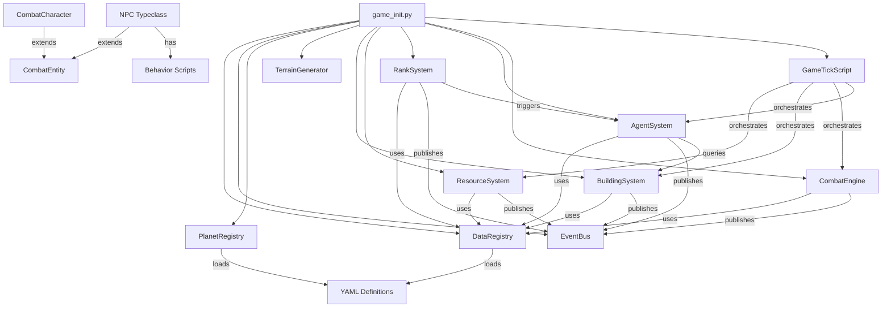
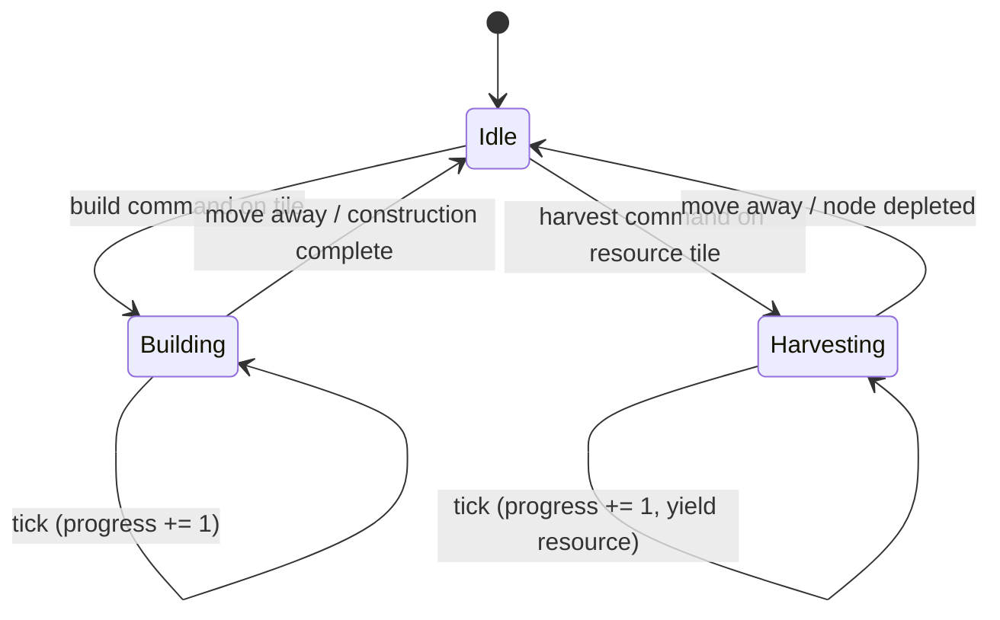
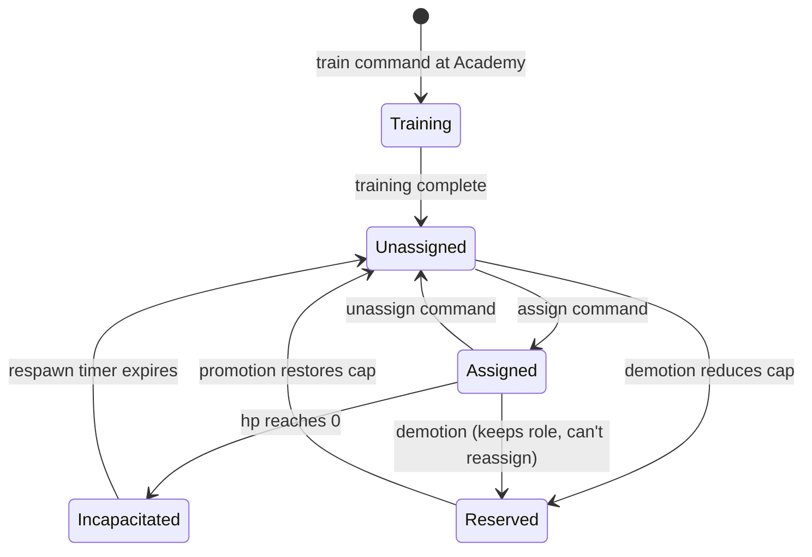

# Design Document — Game Content Phase 1: Core Game Loop

## Overview

Phase 1 replaces the existing placeholder content with the real game content that defines the core gameplay loop. The scope covers 7 major subsystems:

1. **Content Expansion** — Expand from 3 planets/15 terrain types to 6 zones/48 terrain types, replace 8 generic resources with 6 named ones, replace 22 ranks with 12 progression-gated ranks, and replace 11 buildings with 12 purpose-driven types.
2. **CombatEntity Mixin** — Shared base for players and NPCs providing hp, inventory, equipment, incapacitation, and respawn logic.
3. **NPC Typeclass** — Game object extending CombatEntity with owner reference, npc_type tagging, and Evennia Script attachment for behavior.
4. **Agent System** — Player-owned NPC agents with 6 roles (Harvester, Engineer, Soldier, Guard, Scout, Medic), sequential IDs, training, assignment, reserve on demotion, and offline autonomy.
5. **Active-Presence State Machine** — Player states (idle, building, harvesting) with timer-based progress that pauses on departure; agents bypass presence requirement.
6. **Building Inventory** — Resource objects stored inside Extractors/Vaults, transferable via `get`/`drop` commands, with capacity limits and loot rules.
7. **Combat Timer** — 60-second countdown on enemy detection/damage that blocks owner movement through own Walls.

The design preserves all existing interfaces (TerrainGenerator, PlanetRegistry, BuildingSystem, RankSystem, CombatCharacter resource methods) and extends them with new fields and behaviors.

## Existing Code Reuse Map

The following table maps each Phase 1 subsystem to existing code. **~85% of the codebase is reusable** — only the CombatEntity mixin, NPC typeclass, AgentSystem, and agent behavior scripts are genuinely new.

| Subsystem | Action | Existing File | What's Reused | What Changes |
|-----------|--------|---------------|---------------|--------------|
| Terrain/Planet | EXTEND | `world/coordinate/terrain_generator.py` | Entire algorithm (zero changes) | — |
| Terrain/Planet | EXTEND | `world/coordinate/planet_registry.py` | Entire interface (zero changes) | — |
| Terrain/Planet | EXTEND | `world/definitions.py` → `CoordinateSpaceDef` | All fields | Add `rank_requirement` field |
| Terrain/Planet | UPDATE | `data/definitions/planets.yaml` | YAML structure | Expand from 3 to 6 planets |
| Terrain/Planet | UPDATE | `data/definitions/terrain.yaml` | YAML structure | Expand from 15 to 48 terrain types |
| Resources | EXTEND | `world/systems/resource_system.py` | Harvest, production, respawn logic | Add active-presence harvesting, Extractor inventory |
| Resources | EXTEND | `typeclasses/characters.py` → resource methods | `get_resource`, `add_resource`, `has_resources`, `deduct_resources` | Update resource type list (8→6) |
| Buildings | EXTEND | `world/systems/building_system.py` | Validation chain, construction, upgrade, events | Add construction timer, agent assignment, inventory |
| Buildings | EXTEND | `world/definitions.py` → `BuildingDef` | All existing fields | Add `build_time_seconds`, `rank_requirement`, `storage_capacity` |
| Buildings | UPDATE | `data/definitions/buildings.yaml` | YAML structure | Restructure to 12 types with new fields |
| Ranks | EXTEND | `world/systems/rank_system.py` | Promotion, demotion, XP, events | Add sub-levels, agent cap, planet access |
| Ranks | EXTEND | `world/definitions.py` → `RankDef` | name, level, xp_threshold, unlocks | Add `agent_cap`, `planet_access` |
| Ranks | UPDATE | `data/definitions/ranks.yaml` | YAML structure | Restructure to 12 ranks |
| Game Tick | EXTEND | `typeclasses/scripts.py` → `GameTickScript` | Entire tick loop, error handling | Add agent processing + active-presence steps |
| Commands | EXTEND | `commands/game_commands.py` | All existing commands | Extend CmdHarvest, CmdBuild for active-presence |
| Commands | EXTEND | `commands/default_cmdsets.py` | Cmdset registration pattern | Add agent commands |
| Data Registry | EXTEND | `world/data_registry.py` | Loading, validation, hot-reload | Update schema validators for new fields |
| Event Bus | REUSE | `world/event_bus.py` | Entire pub/sub system | Add new event constants |
| Webclient | EXTEND | `web/static/webclient/js/plugins/` | Map renderer, custom_out, CSS | Add agent markers, occupied-building color, tile JSON agent data |
| Map Rendering | EXTEND | `world/coordinate/procedural_map_renderer.py` | Tile rendering, color scheme, fog logic | Add NPC/agent display priority, occupied-building color |
| Map Data | EXTEND | `world/coordinate/map_data_provider.py` | Tile JSON generation | Add `agents` array to visible tile data |
| Combat Entity | **CREATE** | `typeclasses/combat_entity.py` | — | New mixin extracted from CombatCharacter |
| NPC Typeclass | **CREATE** | `typeclasses/npcs.py` | — | New typeclass (DefaultObject + CombatEntity) |
| Agent System | **CREATE** | `world/systems/agent_system.py` | — | New system |
| Agent Scripts | **CREATE** | `typeclasses/agent_scripts.py` | — | New behavior scripts |
| Agent Commands | **CREATE** | `commands/agent_commands.py` | — | New commands |

**Key reuse wins:**
- TerrainGenerator and PlanetRegistry need zero code changes — they're fully generic
- BuildingSystem validation chain is fully reusable — just add new fields to BuildingDef
- RankSystem promotion/demotion logic works with any rank structure
- GameTickScript just needs new processing steps appended
- Evennia's `get`/`drop` commands work out of the box for building inventory

## Architecture

### System Dependency Graph



### Key Architectural Decisions

**Decision 1: CombatEntity as a Mixin (not a base class)**

CombatEntity is implemented as a Python mixin class that does NOT inherit from any Evennia base. This avoids MRO conflicts when CombatCharacter inherits from both `DefaultCharacter` and `CombatEntity`, and when NPC inherits from both `DefaultObject` and `CombatEntity`. The mixin uses `self.db.*` and `self.attributes.*` for persistence, which both DefaultCharacter and DefaultObject provide.

```python
class CombatEntity:
    """Mixin — no Evennia base class."""
    def at_combat_entity_init(self): ...
    def take_damage(self, amount): ...
    def heal(self, amount): ...
    def is_alive(self): ...
    def incapacitate(self, respawn_ticks): ...

class CombatCharacter(CombatEntity, DefaultCharacter): ...
class NPC(CombatEntity, DefaultObject): ...
```

Rationale: Evennia's typeclass system uses `DefaultCharacter(DefaultObject(TypedObject))` and `DefaultObject(TypedObject)`. A shared base class inheriting from either would create diamond inheritance. A mixin avoids this entirely.

**Decision 2: NPC as DefaultObject with Script Attachment**

Agents are NPC game objects (not Characters) because they don't need account puppeting, command sets, or session handling. Behavior is driven by Evennia Scripts attached to the NPC object. Each role has a corresponding Script class (HarvesterScript, GuardScript, etc.) that runs on the game tick.

Rationale: DefaultObject is lighter weight than DefaultCharacter. Scripts are Evennia's native mechanism for timed/repeating behavior on objects. This keeps agent behavior modular and swappable.

**Decision 3: Agent IDs as Sequential Permanent Integers**

Each player's agents get a monotonically increasing integer ID stored on the player (`db.next_agent_id`). IDs are never reused. On demotion, agents with the highest IDs enter reserve first (deterministic ordering). The commander is always ID 1 but is NOT an NPC object — it's the CombatCharacter itself.

Rationale: Permanent sequential IDs give deterministic reserve ordering on demotion without needing timestamps or sorting by creation date. Never reusing IDs prevents confusion when agents are reserved and later restored.

**Decision 4: Active-Presence via Player State Attribute**

The player's current activity state is stored as `db.activity_state` with values: `"idle"`, `"building"`, `"harvesting"`. A `db.activity_target` stores the target tile/building reference. The GameTickScript checks this state each tick: if the player is in a "building" or "harvesting" state AND still on the correct tile, progress increments. If the player moves away, state resets to "idle" and the timer pauses.

Agent assignment bypasses this entirely — the agent's behavior Script runs on the game tick regardless of player location.

Rationale: This is simpler than a full state machine framework. The state is just an attribute checked each tick. No complex transitions needed.

**Decision 5: Building Inventory as Evennia Contents**

Resources stored in buildings (Extractors, Vaults) are represented as lightweight game objects inside the building's `contents`. This leverages Evennia's built-in `get` and `drop` commands for transfer. Each resource object represents a stack with a `db.amount` attribute.

Rationale: Using Evennia's native object containment means `get`/`drop` work out of the box. Resource objects as stacks (not individual units) keep the object count manageable.

**Decision 6: Expanded YAML with New Fields**

Existing YAML files gain new fields rather than new file formats:
- `planets.yaml`: adds `rank_requirement` field per planet
- `terrain.yaml`: expands to 48 entries with updated resource associations
- `ranks.yaml`: restructured to 12 ranks with `agent_cap`, `planet_access`, `unlocks` fields
- `buildings.yaml`: restructured to 12 types with `build_time_seconds`, `max_level`, `rank_requirement`, `requires_agent`, `category` fields

The DataRegistry and definitions.py dataclasses are extended with the new fields, maintaining backward compatibility via defaults.

**Decision 7: Combat Timer as Player Attribute**

The combat timer is stored as `db.combat_timer_expires` (game tick number). The Wall movement check reads this attribute. No separate Script needed — the GameTickScript already processes movement, and the CmdMove command checks the timer before allowing Wall passage.


## Components and Interfaces

### 1. CombatEntity Mixin (`typeclasses/combat_entity.py`)

New file. Pure Python mixin with no Evennia base class.

```python
class CombatEntity:
    """Mixin providing shared combat state for players and NPCs.
    
    Expects the host class to provide self.db.* (Evennia AttributeHandler).
    """
    
    def at_combat_entity_init(self):
        """Called from at_object_creation() of the host typeclass."""
        self.db.hp = 100
        self.db.hp_max = 100
        self.db.equipment_slots = {}       # slot_name -> item_ref
        self.db.incapacitated = False
        self.db.respawn_timer = 0          # ticks remaining
        self.db.respawn_location = None    # room ref or None
    
    def take_damage(self, amount: int) -> int:
        """Reduce hp by amount (min 0). Returns actual damage dealt.
        If hp reaches 0, calls incapacitate()."""
    
    def heal(self, amount: int) -> int:
        """Increase hp by amount (capped at hp_max). Returns actual healing."""
    
    def is_alive(self) -> bool:
        """Return True if hp > 0 and not incapacitated."""
    
    def incapacitate(self, respawn_ticks: int):
        """Mark entity as incapacitated, set respawn timer."""
    
    def tick_respawn(self) -> bool:
        """Decrement respawn timer. If expired, restore and return True."""
    
    def get_structured_state(self) -> dict:
        """Return {hp, hp_max, incapacitated, respawn_timer, equipment_slots}."""
```

### 2. NPC Typeclass (`typeclasses/npcs.py`)

New file. Extends DefaultObject + CombatEntity.

```python
class NPC(CombatEntity, DefaultObject):
    """Base NPC typeclass for agents, enemies, vendors.
    
    Attributes:
        db.owner: reference to owning CombatCharacter (or None)
        db.npc_type: str — "agent", "enemy", "vendor"
        db.agent_id: int — sequential ID (agents only)
        db.role: str — "harvester", "engineer", "soldier", etc. (agents only)
        db.role_target: ref — building or None (agents only)
        db.reserve: bool — True if in reserve due to demotion
    
    Tags:
        ("agent", "npc_type") — for efficient querying
        ("player_<id>", "agent_owner") — for per-player agent lookup
    """
    
    def at_object_creation(self):
        self.at_combat_entity_init()
        self.db.owner = None
        self.db.npc_type = "agent"
        self.db.agent_id = 0
        self.db.role = ""
        self.db.role_target = None
        self.db.reserve = False
```

### 3. Agent Behavior Scripts (`typeclasses/agent_scripts.py`)

New file. Evennia Scripts attached to NPC objects.

```python
class HarvesterScript(DefaultScript):
    """Produces resources each tick when attached to an NPC assigned to an Extractor."""
    def at_repeat(self):
        # Read Extractor's resource type, produce amount based on level,
        # add to Extractor's inventory (contents)

class GuardScript(DefaultScript):
    """Activates Turret auto-attack when attached to an NPC assigned to a Turret."""

class ScoutScript(DefaultScript):
    """Extends Radar vision when attached to an NPC assigned to a Radar."""

class EngineerScript(DefaultScript):
    """Progresses construction/research timers autonomously."""

class SoldierScript(DefaultScript):
    """Participates in army combat calculations."""

class MedicScript(DefaultScript):
    """Heals soldiers after combat, reduces respawn time at Medbay."""
```

Each script has `interval = 0` (no independent timer) and is called by the GameTickScript during the agent processing step. Alternatively, scripts use `interval = 1` matching the game tick and self-manage.

### 4. Agent System (`world/systems/agent_system.py`)

New file. Registered in `game_systems` dict.

```python
class AgentSystem:
    def __init__(self, registry: DataRegistry, event_bus: EventBus): ...
    
    # Training
    def train_agent(self, player, academy_building) -> tuple[bool, str]: ...
    
    # Assignment
    def assign_agent(self, player, agent_id: int, role: str = "", 
                     target_building=None) -> tuple[bool, str]: ...
    def unassign_agent(self, player, agent_id: int) -> tuple[bool, str]: ...
    
    # Queries
    def get_agents(self, player) -> list[NPC]: ...
    def get_agent_by_id(self, player, agent_id: int) -> NPC | None: ...
    def get_agent_count(self, player) -> int: ...
    
    # Demotion handling
    def handle_demotion(self, player, new_agent_cap: int): ...
    def handle_promotion(self, player, new_agent_cap: int): ...
    
    # Tick processing
    def process_tick(self, tick_number: int): ...
```

### 5. Extended CombatCharacter (`typeclasses/characters.py`)

Existing file modified. CombatCharacter gains CombatEntity mixin and new agent-related attributes.

```python
class CombatCharacter(CombatEntity, DefaultCharacter):
    def at_object_creation(self):
        super().at_object_creation()
        self.at_combat_entity_init()
        # New Phase 1 attributes:
        self.db.resources = {"Wood": 30, "Stone": 20, "Iron": 10, 
                             "Energy": 0, "Circuits": 0, "Nexium": 0}
        self.db.next_agent_id = 2  # commander is ID 1
        self.db.activity_state = "idle"  # idle | building | harvesting
        self.db.activity_target = None
        self.db.activity_progress = 0  # ticks elapsed
        self.db.combat_timer_expires = 0  # game tick when timer ends
```

### 6. Extended BuildingDef and RankDef (`world/definitions.py`)

Existing dataclasses extended with new fields:

```python
@dataclass
class BuildingDef:
    # Existing fields preserved...
    build_time_seconds: int = 120
    max_level: int = 5
    rank_requirement: int = 1
    requires_agent: bool = False
    storage_capacity: int = 0  # 0 = no storage

@dataclass
class RankDef:
    # Existing fields preserved...
    agent_cap: int = 2
    planet_access: list[str] = field(default_factory=list)
```

### 7. Extended ResourceSystem

The existing ResourceSystem gains:
- `harvest_manual(player, tile)` — active-presence manual harvesting (replaces instant harvest)
- `process_extractor_production(buildings)` — Harvester agent production per tick
- Extractor inventory management (resource objects in building contents)

### 8. Extended RankSystem

The existing RankSystem gains:
- Sub-level computation (5 levels per rank)
- `rank_demoted` event triggers `AgentSystem.handle_demotion()`
- `rank_promoted` event triggers `AgentSystem.handle_promotion()`
- Planet access gating via `rank_requirement` field

### 9. Agent Commands (`commands/agent_commands.py`)

New file with commands: `CmdAgents`, `CmdAssign`, `CmdUnassign`, `CmdTrain`.

### 10. Combat Timer Integration

- `CmdMove` checks `db.combat_timer_expires` before allowing Wall passage
- EventBus subscriber on `COMBAT_ACTION` and vision events resets the timer
- New event constant: `COMBAT_TIMER_STARTED`

### 11. Map Rendering — Agent and NPC Visibility

Extends the existing `ProceduralMapRenderer` (ASCII) and `MapDataProvider` (webclient JSON) with NPC/agent display. No new files — extends existing rendering pipeline.

**Display priority (highest to lowest):**
1. Player self → `@@` yellow
2. Enemy player → `**` red
3. Own agent (overworld) → `ag` green (or role abbreviation: `ha`, `so`, `gu`, `sc`, `me`, `en`)
4. Enemy agent (overworld) → `ag` red
5. Neutral NPC → `ag` yellow
6. Occupied building (any entity inside) → building abbreviation in dark blue
7. Unoccupied own building → building abbreviation in cyan
8. Unoccupied enemy building → building abbreviation in red
9. Terrain symbol

**ASCII renderer changes** (`procedural_map_renderer.py`):
- `_colored_room()` gains NPC detection: after checking for players, check room contents for NPC objects with `npc_type` tag
- Own agents: `|g{symbol}|n`, enemy agents: `|r{symbol}|n`, neutral: `|y{symbol}|n`
- Building with any entity inside (player or NPC in contents): render abbreviation with `|B` (dark blue) instead of `|c`/`|R`
- Agents inside buildings do NOT render as separate symbols — only the building color changes

**Webclient JSON changes** (`map_data_provider.py`):
- Visible tiles gain an `"agents"` array: `[{"own": true, "role": "harvester"}, ...]`
- Building tiles gain `"occupied": true/false`
- Canvas renderer (`map_renderer.js`) draws:
  - Own agents as green circles with role initial
  - Enemy agents as red circles with `!`
  - Occupied buildings with dark blue (`#2244aa`) background instead of cyan/red

**Color constants:**
| Entity | ASCII Color | Webclient Hex |
|--------|-------------|---------------|
| Own agent | `\|g` (green) | `#33cc33` |
| Enemy agent | `\|r` (red) | `#ff3333` |
| Neutral NPC | `\|y` (yellow) | `#ffdd00` |
| Occupied building | `\|B` (dark blue) | `#2244aa` |

## Data Models

### YAML Definition Schema Changes

#### planets.yaml (expanded)

```yaml
planets:
  - planet_key: "terra"
    planet_type: "earth"
    z_level: 0
    width: 500
    height: 500
    terrain_seed: 42
    terrain_noise_cell_size: 8
    rank_requirement: 1          # NEW
    terrain_weights:
      Plains: 0.20
      Grassland: 0.15
      Forest: 0.20
      Pine_Forest: 0.10
      Rock: 0.10
      Mountain: 0.05
      Swamp: 0.10
      River: 0.10
    persistence_type: "static"
    spawn_x: 250
    spawn_y: 250
    default_planet: true
  # ... 5 more planets (Forge, Tundra, Inferno, Citadel, Space)
```

#### ranks.yaml (restructured)

```yaml
ranks:
  - name: Recruit
    level: 1
    xp_threshold: 0
    agent_cap: 2                 # NEW
    planet_access: [terra]       # NEW
    unlocks: []

  - name: Private
    level: 2
    xp_threshold: 200
    agent_cap: 3
    planet_access: [terra]
    unlocks: [Extractor]
  # ... 10 more ranks
```

#### buildings.yaml (restructured)

```yaml
buildings:
  - name: Headquarters
    abbreviation: HQ
    cost: {Wood: 10, Stone: 10, Iron: 10}
    build_time_seconds: 180      # NEW
    max_level: 5                 # NEW
    rank_requirement: 1          # NEW
    max_health: 500
    requires_hq: false
    required_terrain: null
    category: headquarters
    produces: null
    requires_agent: false        # NEW
    storage_capacity: 0          # NEW
    unlocks: [EX, AC, WL, LB, VT]
  # ... 11 more buildings
```

#### terrain.yaml (expanded to 48)

8 terrain types per planet. Each entry:
```yaml
terrain:
  # Terra (8 types)
  - terrain_type: Plains
    map_symbol: ".."
    resource_type: null
    passable: true
    planet: terra                # NEW — for cross-validation
  - terrain_type: Forest
    map_symbol: "&&"
    resource_type: Wood
    passable: true
    planet: terra
  # ... 46 more entries
```

### Database Attribute Schema (per entity)

#### CombatCharacter (player)

| Attribute | Type | Description |
|-----------|------|-------------|
| `hp` | int | Current health |
| `hp_max` | int | Maximum health |
| `combat_xp` | int | Combat experience points |
| `rank_level` | int | Current rank (1-12) |
| `resources` | dict[str, int] | `{Wood: 30, Stone: 20, Iron: 10, Energy: 0, Circuits: 0, Nexium: 0}` |
| `equipment_slots` | dict | Equipped items by slot |
| `incapacitated` | bool | Whether player is incapacitated |
| `respawn_timer` | int | Ticks until respawn |
| `respawn_location` | ref | Room to respawn at (HQ) |
| `next_agent_id` | int | Next agent ID to assign (starts at 2) |
| `activity_state` | str | `"idle"`, `"building"`, `"harvesting"` |
| `activity_target` | ref | Target tile/building for current activity |
| `activity_progress` | int | Ticks of progress on current activity |
| `combat_timer_expires` | int | Game tick when combat timer ends |
| `coord_x`, `coord_y`, `coord_planet` | int, int, str | Position |
| `discovery_memory` | dict | Fog of war state |

#### NPC (agent)

| Attribute | Type | Description |
|-----------|------|-------------|
| `hp`, `hp_max` | int | Health |
| `owner` | ref | Owning CombatCharacter |
| `npc_type` | str | `"agent"` |
| `agent_id` | int | Permanent sequential ID |
| `role` | str | `""`, `"harvester"`, `"engineer"`, `"soldier"`, `"guard"`, `"scout"`, `"medic"` |
| `role_target` | ref | Building assigned to (or None for army roles) |
| `reserve` | bool | True if reserved due to demotion |
| `incapacitated` | bool | Whether agent is incapacitated |
| `respawn_timer` | int | Ticks until respawn |

Tags: `("agent", "npc_type")`, `("player_<owner_id>", "agent_owner")`

#### Building (extended)

| Attribute | Type | Description |
|-----------|------|-------------|
| `building_type` | str | Abbreviation (HQ, EX, AC, etc.) |
| `owner` | ref | Owning CombatCharacter |
| `building_level` | int | 1-5 |
| `hp`, `hp_max` | int | Health |
| `offline` | bool | Offline protection state |
| `assigned_agent` | ref | NPC assigned to this building (or None) |
| `construction_progress` | int | Ticks of construction completed |
| `construction_total` | int | Total ticks needed for construction |

Building contents (Evennia `contents` list) hold resource stack objects for Extractors and Vaults.

### Resource Stack Object

Lightweight DefaultObject representing a stack of one resource type:

| Attribute | Type | Description |
|-----------|------|-------------|
| `resource_type` | str | Wood, Stone, Iron, Energy, Circuits, Nexium |
| `amount` | int | Number of units in this stack |

Tag: `("resource", "object_type")`

### State Machine: Player Activity



### Agent Lifecycle




## Correctness Properties

*A property is a characteristic or behavior that should hold true across all valid executions of a system — essentially, a formal statement about what the system should do. Properties serve as the bridge between human-readable specifications and machine-verifiable correctness guarantees.*

### Property 1: Definition YAML Round-Trip

*For any* valid game definition object (CoordinateSpaceDef, TerrainDef, BuildingDef, RankDef), serializing it to a YAML-compatible dict and deserializing back SHALL produce an equivalent object.

**Validates: Requirements 1.7, 15.6**

### Property 2: Definition Validation Rejects Invalid Input

*For any* definition dict (planet, terrain, or building) that is missing a required field or has an invalid field value, the corresponding validator SHALL reject it. *For any* definition dict with all required fields present and valid, the validator SHALL accept it.

**Validates: Requirements 1.2, 2.2, 6.2**

### Property 3: Planet Rank Gating

*For any* player rank level and planet rank requirement, travel to the planet SHALL be allowed if and only if the player's rank level is greater than or equal to the planet's rank requirement.

**Validates: Requirements 1.4, 6.5**

### Property 4: Terrain Generation Within Weight Map

*For any* coordinate (x, y) within a planet's bounds, the terrain type returned by TerrainGenerator SHALL be one of the keys in that planet's `terrain_weights` map, and if that terrain type has a non-null `resource_type`, `get_terrain_and_resource` SHALL include it.

**Validates: Requirements 2.3, 2.5, 2.7**

### Property 5: Terrain Generation Determinism

*For any* coordinate (x, y) and seed, calling `get_terrain(x, y)` multiple times SHALL always return the same terrain type.

**Validates: Requirements 2.4**

### Property 6: Resource Add/Deduct Round-Trip

*For any* CombatCharacter resource state, resource type, and positive amount, adding the amount and then deducting the same amount SHALL return the resource to its original value.

**Validates: Requirements 3.7**

### Property 7: Resource Deduction Rejection Preserves State

*For any* CombatCharacter resource state and cost dict where at least one resource cost exceeds the player's current stock, `deduct_resources` SHALL return failure and the resource state SHALL remain unchanged.

**Validates: Requirements 3.6**

### Property 8: Rank Resolution Is a Total Function

*For any* XP value in [0, 120000], `get_rank_for_xp(xp)` SHALL return exactly one RankDef where `rank.xp_threshold <= xp` and either the rank is the highest rank or `next_rank.xp_threshold > xp`. This covers promotion, demotion, and multi-rank jumps in both directions.

**Validates: Requirements 4.2, 4.3, 4.4, 4.9, 4.13**

### Property 9: Sub-Level XP Distribution

*For any* two consecutive rank thresholds T1 and T2, the 5 sub-level boundaries SHALL be evenly spaced at intervals of `(T2 - T1) / 5`, such that Level N starts at `T1 + (N-1) * (T2-T1)/5`.

**Validates: Requirements 4b.2**

### Property 10: CombatEntity Damage/Heal Round-Trip

*For any* CombatEntity with hp and hp_max, and any positive integer N where N <= hp, calling `take_damage(N)` then `heal(N)` SHALL return hp to its pre-damage value, capped at hp_max.

**Validates: Requirements 7.11**

### Property 11: Agent Roster Invariant

*For any* sequence of agent operations (train, assign, unassign, incapacitate, reserve, restore), the sum of active + incapacitated + reserved agents SHALL always equal the total roster size.

**Validates: Requirements 7b.12**

### Property 12: Agent ID Sequentiality

*For any* sequence of agent training operations on a player, the assigned agent IDs SHALL be strictly increasing, unique, and never reused — even after agents are incapacitated or reserved.

**Validates: Requirements 7b.5**

### Property 13: Incapacitated/Reserved Agents Cannot Be Assigned

*For any* agent in incapacitated or reserved state, attempting to assign that agent to any role SHALL fail and the agent's state SHALL remain unchanged.

**Validates: Requirements 7b.11**

### Property 14: Demotion Reserves Highest-ID Agents

*For any* player with N agents and a demotion to a rank with agent cap M < N, the (N - M) agents with the highest IDs SHALL enter reserve status. Agents with lower IDs SHALL remain in their current state.

**Validates: Requirements 4.6, 7b.13**

### Property 15: Agent Training Cost Scaling

*For any* agent number N (the Nth agent being trained), the training cost SHALL be `base_cost × N` where base_cost is {Wood: 15, Stone: 10, Iron: 5}.

**Validates: Requirements 8.3**

### Property 16: Building Upgrade Cost Scaling

*For any* building type with base cost C and target upgrade level L, the upgrade cost SHALL be `C × L` for each resource in the cost map.

**Validates: Requirements 6.8**

### Property 17: Per-Level Building Bonus Computation

*For any* building type and level L (1-5), the per-level bonus SHALL match the defined formula: Extractor storage = `100 + 50 × (L-1)`, Vault storage = `100 + 20 × (L-1)`, Turret damage = `base × (1 + 0.20 × (L-1))`, and so on per the building bonus table.

**Validates: Requirements 6.21, 6.22, 6.23**

### Property 18: Harvester Production Scaling

*For any* Extractor level L with an assigned Harvester agent, the production rate SHALL be `base_rate × (1 + 0.25 × (L-1))`.

**Validates: Requirements 9.2**

### Property 19: Map Display Priority

*For any* visible tile containing multiple entities (player, agents, building), the rendered symbol SHALL follow the priority order: player self > enemy player > own agent > enemy agent > neutral NPC > occupied building > unoccupied building > terrain. A tile with a building containing any entity inside SHALL render the building abbreviation in dark blue regardless of the entity type.

**Validates: Requirements 19.6, 19.5, 19.8**

## Error Handling

### Validation Errors

- **YAML Loading**: If any required YAML file is missing or malformed, `DataRegistry.load_all()` raises `DataRegistryError` with a descriptive message identifying the file and field. The server logs the error and refuses to start with incomplete data.
- **Schema Validation**: Each definition type has field-level validation. Missing required fields, wrong types, or invalid values (e.g., negative HP, empty abbreviation) produce specific error messages collected and raised as a batch.
- **Cross-Validation**: After loading all files, cross-references are validated (e.g., terrain types in planet weights must exist in terrain definitions, building unlock references must be valid abbreviations).

### Runtime Errors

- **Insufficient Resources**: `deduct_resources()` returns `False` without modifying state. Commands display a message listing each resource shortfall.
- **Agent Cap Exceeded**: `train_agent()` returns `(False, "Agent cap reached")`. The player is told their current count and cap.
- **Invalid Assignment**: Assigning to wrong building type, assigning incapacitated/reserved agent, or assigning when building already staffed returns `(False, reason_string)`.
- **Rank Gating**: Travel to a locked planet returns a message with the required rank name. Building a rank-gated building returns a message with the required rank.
- **Combat Timer**: Movement through own Walls during combat timer returns "You cannot pass through your walls during combat (Xs remaining)."
- **Building at Capacity**: Extractor/Vault at storage capacity pauses production and returns "Storage full" on attempted drop.

### Resilience

- **GameTickScript**: Each processing step (resource production, combat resolution, agent ticks) is wrapped in try/except. A failure in one step does not prevent others from executing. Errors are logged with tick number and step name.
- **Event Bus**: Subscriber exceptions are caught and logged; remaining subscribers still receive the event.
- **Hot Reload**: `DataRegistry.reload_all()` loads into a temporary registry first. On validation failure, the current data is preserved and errors are returned.

## Testing Strategy

### Property-Based Tests (Hypothesis)

The project already uses Hypothesis (`.hypothesis/` directory present). Each correctness property maps to a single Hypothesis test with `@settings(max_examples=100)`.

Library: **Hypothesis** (Python)
Configuration: minimum 100 examples per property test.
Tag format: `# Feature: game-content-phase1, Property N: <title>`

Properties to implement as PBT:
1. Definition YAML round-trip (Property 1)
2. Definition validation (Property 2)
3. Planet/building rank gating (Property 3)
4. Terrain within weight map + resource inclusion (Property 4)
5. Terrain determinism (Property 5)
6. Resource add/deduct round-trip (Property 6)
7. Resource deduction rejection (Property 7)
8. Rank resolution total function (Property 8)
9. Sub-level XP distribution (Property 9)
10. CombatEntity damage/heal round-trip (Property 10)
11. Agent roster invariant (Property 11)
12. Agent ID sequentiality (Property 12)
13. Incapacitated/reserved assignment blocked (Property 13)
14. Demotion reserve ordering (Property 14)
15. Training cost scaling (Property 15)
16. Upgrade cost scaling (Property 16)
17. Per-level bonus computation (Property 17)
18. Harvester production scaling (Property 18)

### Unit Tests (pytest)

Example-based tests for specific scenarios:
- Starting resources match spec (30W/20S/10I/0E/0C/0N)
- HQ-first enforcement
- One HQ per player per planet
- Building offline on 0 HP (not destroyed)
- Repair cost = 50% of base
- Extractor requires resource terrain
- Vault rejects non-resource objects
- Rank promotion/demotion event publishing
- Agent training flow (command → timer → completion)
- Context-aware agent assignment (inside Extractor → Harvester)
- Combat timer start/reset/expiry
- Wall movement blocking during combat timer
- Score command output format
- Offline agent behavior continues

### Integration Tests

- Full game tick cycle with agents producing resources
- Construction flow: player presence → timer → completion
- Agent training → assignment → production → collection
- Rank up → new planet access → travel
- Demotion → agent reserve → re-rank → restore
- Combat timer → Wall blocking → timer expiry → free movement
- YAML hot-reload preserves running game state

### Backward Compatibility Tests

- Existing TerrainGenerator interface unchanged
- Existing PlanetRegistry interface unchanged
- Existing BuildingSystem construct/upgrade/destroy signatures unchanged
- Existing RankSystem award_xp/check_promotion/get_rank signatures unchanged
- Existing CombatCharacter resource methods unchanged
- Resource type migration (8 types → 6 types) for existing characters
