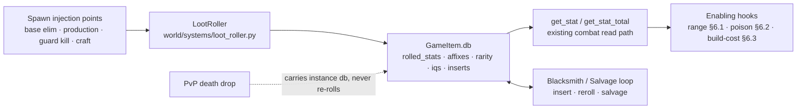

# Design — Item Loot Economy

## Overview

> **Status:** DRAFT for review. Numbers are starting points to tune, not locked.
> **Grounded against source 2026-07-24** (three read-only audits: combat range/
> damage-type hooks, content+balance inventory, crafting/effect/slot map). Every
> "EXISTS" claim below cites the verified hook; every "NEW" item names the touch-point.

### Guiding constraints (from the combat-rebalance steering doc)

- **Gear is loseable power → uncapped**, but rolled magnitudes are the main dial;
  keep bands modest so a god-roll set can't blow past the +6 permanent-tech caps.
- **Typed resists cap at ~50%/axis** via the chip floor (`chip_damage_min_fraction
  = 0.5`) — so `+resist` affixes can be generous (they can't create immunity).
- **Range has no chip-floor analog** — it directly beats melee/kiting, so `+range`
  is the spiciest stat; keep bands small and gate the biggest behind positioning.
- **Never ~2× without counterplay.** Rolled power lives on gear you drop on death
  (the counter). Permanent (tech) bonuses stay under `perm_bonus_cap_*`.

---

## Architecture

The feature is a thin layer over existing spawn and stat-read paths. A new
`LootRoller` service (pure, RNG-injected — §1.2) is called at every `GameItem`
spawn injection point (base-elimination gear drops, production drops, the new
guard-kill path, and the craft path) and writes per-instance results onto
`GameItem.db` (`rolled_stats`, `affixes`, `rarity`, `iqs` — §10). Combat reads
those values through the **existing** `get_stat` / `get_stat_total` path with no
engine change. The Blacksmith/Salvage loop (§4, §5) mutates and destroys
instances, and three small enabling hooks (range resolution §6.1, poison DoT
§6.2, build-cost tech consumer §6.3) unlock the new stat axes. PvP death drops
bypass the roller entirely and carry the instance state (R1.6, §1.2).



---

## Components and Interfaces

### 1. Roll engine (R1) — the core

#### 1.1 Data: `roll_spec` on `ItemDef`

Add one optional field to `ItemDef` (`world/definitions.py`), fully defaulted:

```python
# ItemDef
roll_spec: dict | None = None
# {
#   "stats": { "<stat>": {"min": float, "max": float, "weight": float} },
#   "craft": { "<stat>": {"min": float, "max": float} },   # tighter craft band (R6)
#   "skew": float,          # U^skew; default from balance.loot_roll_skew (2.0)
#   "affix_pool": "weapon"|"armor"|...   # which affix pool this item draws from
# }
```

Example (`assault_rifle`): base `damage 25 / range 5` becomes
```yaml
roll_spec:
  stats:
    damage: {min: 18, max: 30, weight: 3}
    range:  {min: 4,  max: 7,  weight: 1}
  craft:
    damage: {min: 20, max: 25}    # crafted floor: never a god-roll, never terrible
    range:  {min: 4,  max: 5}
  affix_pool: weapon
```

#### 1.2 Where rolling happens — a `LootRoller` service

New `world/systems/loot_roller.py` (pure, RNG-injected). One entry point:

```python
roll_item(item_def, *, source_rarity_weight=0.0, crafted=False, rng) -> RollResult
# RollResult = {stat_modifiers: {..rolled..}, affixes: [...], rarity: str, iqs: int}
```

Called at every `GameItem` spawn that should be rolled. **Injection points:**

*Existing `spawn_gear_drop` paths (three — all already spawn unique GameItems):*
- `base_elimination._spawn_gear_item` (HQ-destroy gear drop) — pass the base tier's
  rarity weight.
- passive/agent production drops — the composition-root gear-drop spawner wired via
  `set_gear_drop_spawner`. Production drops are passive income, so they roll in the
  **lowest rarity bucket with no affixes** (see §3.2).
- PvP death gear drop (`equipment_system._drop_gear_on_death` → the spawner) —
  **no rolling at all**: the drop carries the instance (preservation contract below).

*NEW path (this feature, R3.6):*
- **Guard-kill gear drops** — a new small-chance roll on guard elimination
  (`base_elimination.on_npc_eliminated` area), gated by a new balance tunable
  (`guard_gear_drop_chance`), spawning via `spawn_gear_drop` with the lowest
  rarity source bucket. The existing guard resource mini-drop behavior stays
  unchanged alongside the new gear-drop roll.

*Craft path:*
- `equipment_system.craft` / `_route_produced_item` — `crafted=True` (tight band,
  no affixes).

The roller writes results onto the `GameItem` after `spawn_gear_drop` /
`_create_item` returns, via `GameItem.db` (new fields: `rolled_stats`, `affixes`,
`rarity`, `iqs`). `GameItem.get_stat` (`typeclasses/objects.py`) is updated to
prefer `db.rolled_stats[stat]` over the def base — so combat's existing
`_get_stat` / `get_stat_total` reads see the rolled values with no combat change.

**PvP-drop preservation contract (R1.6):** the PvP death-drop path SHALL carry the
dropped instance's per-item db state — `rolled_stats`, `affixes`, `rarity`, `iqs`,
`inserts` — onto the spawned drop. If the drop spawner creates a fresh `GameItem`
from the `ItemDef`, the wiring MUST copy the instance db across rather than
re-roll. This is an explicit design work item (wiring, not just a test): dropped
gear keeps its rolls, always.

#### 1.3 Skewed distribution

```
rolled = min + (max - min) * (U ** skew)     # U ~ uniform(0,1), skew >= 1
```
`skew=2` → median roll ≈ 25% of band (mostly-low, top rolls rare). Tunable per item
(`roll_spec.skew`) and globally (`balance.loot_roll_skew`). Rarity can **raise the
floor** by clamping `U` to `[floor, 1]` (Epic floor 0.5, Legendary 0.75) before the
skew — so high rarity guarantees good base rolls without removing variance.

---

### 2. IQS formula (R2) — legibility

#### 2.1 Base-stat quality

```
q_s  = (rolled_s - min_s) / (max_s - min_s)        # 0..1 per rolled stat
IQS_base = round(100 * Σ(w_s * q_s) / Σ w_s)        # 0..100, weighted mean
```

Weights `w_s` come from `roll_spec.stats[*].weight` — they encode "which stat
matters" (damage weighted 3× range on a rifle), so a high-damage roll reads as a
better item than a high-range one, matching intuition.

#### 2.2 Affix contribution → displayed score

Each affix has a `value` (its own rolled magnitude normalized × a pool weight). The
**displayed item score** is:

```
score = IQS_base + Σ affix.value      # can exceed 100 → reads as top-tier
```

Rarity is *assigned first* (§3) and *sets the affix budget*; the affixes then push
the displayed score up. So "Legendary 112" is legible: great base rolls (IQS_base
~85) + 4 strong affixes (~27). We display `min(score, 999)` but never clamp the
math — the number is the sort key players trade on.

#### 2.3 Storage + display

- `GameItem.db.iqs` (int), `.rarity` (str), `.affixes` (list of `{key, magnitude}`).
- Name decoration in `GameItem.get_display_name` / the item's appearance:
  `|{rarity_color}|Assault Rifle [{rarity} · {iqs}%]|n`.
- Inspect (`look <item>` / an `inspect` command) shows per-stat `rolled (min–max)`
  and each affix — so "good vs bad" is fully transparent (R2.3).
- Recompute + re-stamp on any reroll/insert (R2.4). One `recompute_iqs(item)` helper
  is the single writer.

---

### 3. Affixes + rarity (R3)

#### 3.1 Rarity tiers

| Rarity | Affix budget | Roll floor (U clamp) | Color |
|---|---|---|---|
| Common | 0 | none | `|w` gray/white |
| Uncommon | 1 | none | `|g` green |
| Rare | 2 | 0.25 | `|c` blue/cyan |
| Epic | 3 | 0.50 | `|m` purple |
| Legendary | 4 | 0.75 | `|y` gold |

#### 3.2 Source-weighted rarity assignment

Drop source contributes a **rarity weight** that shifts the distribution up. Reuse
the existing per-template scaling in `outpost_spawner`/`base_elimination` (outpost <
stronghold < fortress < citadel already scale `gear_rolls`/`rare_gear_chance`). A
simple model:

```
rarity = weighted_choice(RARITY_TABLE[source_bucket])
# guard kill:  mostly Common/Uncommon   (NEW drop path — R3.6)
# outpost:     Uncommon-weighted
# stronghold:  Rare-weighted
# fortress:    Epic reachable
# citadel:     Legendary reachable
```

`RARITY_TABLE` lives in balance (data-tunable). The **guard kill** bucket serves
the NEW guard-kill gear-drop path (§1.2, R3.6) — the other buckets map onto
existing spawns. **Production drops** (the passive/agent gear-drop spawner) use
the lowest bucket with **no affixes** — passive income gets the safe floor
treatment, like the crafted band. **PvP-death drops don't consult this table at
all**: dropped gear carries the instance's existing rarity/rolls per the R1.6
preservation contract (§1.2) — no re-roll, no free rarity inflation from ganking.

#### 3.3 Affix pools

`data/definitions/affixes.yaml` — a new registry, category-keyed:

```yaml
weapon:
  - {key: keen,      stat: damage_bonus,  min: 2, max: 6,  weight: 1.0, name: "of Power"}
  - {key: long,      stat: range,         min: 1, max: 3,  weight: 1.4, name: "of Reach"}   # needs R8
  - {key: venomous,  proc: poison,        min: 1, max: 3,  weight: 1.6, name: "of the Viper"} # needs R9
  - {key: warding_f, stat: fire_resist,   min: 2, max: 6,  weight: 0.8, name: "of Embers"}
armor:
  - {key: sturdy,    stat: damage_reduction, min: 2, max: 6, weight: 1.0, name: "of the Bulwark"}
  - {key: warded,    stat: psychic_resist,   min: 2, max: 6, weight: 0.8, name: "of Clarity"}
```

Affixes are drawn without replacement up to the rarity budget, each rolls its
magnitude (same skew), and — for the aggregating axes (`damage_bonus`,
`damage_reduction`, `<type>_resist`) — **just works** via `get_stat_total`. `range`
and `poison`-proc affixes depend on R8/R9 hooks. Load-time validation cross-checks
affix `stat`/`proc` keys against known axes.

---

### 4. Blacksmith building (R4) + inserts (R5)

#### 4.1 Building

`data/definitions/buildings.yaml` — **Blacksmith (BS)**, `category: equipment`,
`requires_hq: true`, `requires_agent: true`, `max_level: 5`, mid-tier rank gate
(e.g. level ~11 like Lab). No new *capability* needed for the bench itself — the
commands resolve "am I in my operational Blacksmith?" exactly like `craft` does
(`equipment_system.craft` gate order: unknown_item → not_craftable →
wrong_building → not_owner → building_offline / building_upgrading (operational)
→ rank → insufficient_resources, then deduct-first with refund-on-routing-failure).
Blacksmith is added to `EQUIPMENT_BUILDING_TYPES` (currently `("AR","MB","LB")`)
only if it also *produces* items; if it's purely a bench, it needs its own "is this
an upgrade building" check (cheaper: a `BLACKSMITH` capability constant so the
command can find it).

#### 4.2 Commands (new, in `game_commands.py`, delegating to `EquipmentSystem`)

- `insert <insert_item> [weapon]` — apply an insert to the equipped weapon (R5).
- `reroll <item>` — reroll base stats, cost = Salvage + resources (R4.5).
- `salvage <item>` — break down into Salvage (R7); lives at the Blacksmith only.
- (`reforge <item>` — affix reroll: **deferred, not phase 1** (decided §12) —
  the deepest chase but the biggest inflation risk.)

Gate order mirrors `craft` (§4.1: unknown-item / not-craftable / wrong-building /
ownership / operational / rank / cost, deduct-first with refund on routing
failure); each failure emits a `*_failed` notification with a `reason`.

#### 4.3 Inserts — the applied-modifier engine

An insert is an `ItemDef` with `category: insert` and an `insert_effect`:

```yaml
- {key: venom_coating,  name: "Venom Coating",   insert_effect: {type: damage_type, value: poison}, craft_cost: {Biomass: 20, Circuits: 10}}
- {key: extended_barrel,name: "Extended Barrel",  insert_effect: {type: range, value: 2},           craft_cost: {Iron: 20, Circuits: 10}}
- {key: incendiary_core,name: "Incendiary Core",  insert_effect: {type: damage_type, value: fire},  craft_cost: {Magmite: 15}}
- {key: hollowpoint,    name: "Hollow-Point Kit", insert_effect: {type: stat, stat: damage, value: 4, tradeoff: {range: -1}}}
```

Applying at the Blacksmith mutates the **equipped weapon `GameItem`**:
- `type: damage_type` → set `weapon.db.damage_type` (combat reads
  `_get_damage_type` from the instance — **works today** for fire/psychic/blast;
  poison needs R9).
- `type: range` → add to `weapon.db.rolled_stats["range"]` (needs R8 to take effect
  in combat).
- `type: stat` → add to `db.rolled_stats[stat]` (and apply `tradeoff`).
- Record applied inserts in `weapon.db.inserts` (list) for display + slot-limit
  enforcement; **slot limit** = `1 + (blacksmith_level // 3)` (L1–2 → 1 slot, L3+ →
  2). Over-limit → refused.
- `recompute_iqs(weapon)` after.

Inserts persist on the instance, so a modified weapon dropped on death carries them
(R5.4). **Irreversible in this feature (decided)** — preserves value; a costly
"strip" is a possible later option, not shipped here.

#### 4.4 Level scaling

Blacksmith level improves: reroll floor (U clamp rises with level), insert slots
(above), and salvage yield — a per-level yield multiplier
`1 + 0.125 × (level − 1)` (L1 1.0× → L5 1.5×, monotonic per R7.2; a
balance-tunable, see §5 and §9). Each is a small formula keyed off
`get_building_level` — no generic engine exists, so each is explicit (matching how
turret damage / extractor production are per-building formulas).

---

### 5. Salvage economy (R7)

- **Salvage** = a per-player counted currency, stored as a dedicated `db.salvage`
  (int) — **decided**. Weightless and currency-like; avoids touching the
  validator-enforced `RESOURCE_TYPES` tuple. Precedent: the Supply_Bag's
  `db.supplies` counted store.
- `salvage <item>` yield:
  `round((base_salvage + iqs * salvage_per_iqs) * (1 + 0.125 * (blacksmith_level - 1)))`
  — scales with BOTH the item's IQS and the Blacksmith's building level (R7.1): a
  high-IQS item you don't want is worth more raw currency, and the same item at a
  higher-level Blacksmith yields ≥ any lower level (monotonic, R7.2; the level
  multiplier L1 1.0× → L5 1.5× is a balance-tunable, §4.4/§9). Destroys the item.
- Sinks: reroll cost + insert application cost + Refinery conversions. Tune so
  aggregate Salvage-in (from the loot flood) ≈ Salvage-out (rerolls chasing
  god-rolls) → no inflation (R7.4).
- **Balance guard:** without the sink, rolled loot floods and IQS becomes noise —
  the Blacksmith salvage loop is a hard dependency of the economy, not optional.

---

### 6. Enabling hooks

#### 6.1 Weapon range resolution (R8) — NEW

Add `combat_engine._resolve_weapon_range(attacker, weapon_item) -> int`:

```
if melee: return 1
base = _get_stat(weapon_item, "range", 1)          # includes rolled + insert range
owner = _owning_player(attacker)
base += get_tech_bonus(owner, "weapon_range")       # NEW consumed tech key
base += _tile_range_bonus(attacker)                 # Sniper Nest (R10.1); 0 if none
return int(base)
```

Replace the raw reads at `combat_engine.py:321`, `:456`, and
`targeting_system.py:70` with this helper (so queue + resolve + lock never diverge —
the same divergence the design doc warns about). Add a soft ceiling
`balance.max_weapon_range` (e.g. 16) so stacking can't make a global sniper.

> Note: because base range now comes from `db.rolled_stats["range"]` on the weapon
> (via `get_stat`), a `+range` **affix or insert on the weapon itself** works through
> this path. An accessory `+range` has no effect — **range never aggregates across
> equipped items, by design (decided, R8.1)**: range is the highest-risk stat, so it
> gets the narrowest surface (weapon instance + owner tech + tile bonus only).
> Cross-item range aggregation is explicitly out of scope for this feature.

#### 6.2 Poison damage type + DoT (R9) — NEW (mirrors fire burn, ~3 touch-points)

1. `combat_engine._finalize_hit` on-hit dispatch (~`:569`): add
   `elif damage_type == "poison": self._apply_poison_dot(target, raw, attacker)`.
2. New `_apply_poison_dot` — copy of `_apply_fire_dot` (`:760`), appends
   `{"type": "poison", "damage": n, "ticks_remaining": m, "source": attacker}` to
   `db.active_effects`. `n = max(1, round(raw * poison_dot_fraction))`.
3. `tick_effects_on_entity` (~`:845`): add a `"poison"` branch (or generalize the
   `"burn"` branch to any DoT effect) so it ticks + routes zero-HP through
   `_handle_zero_hp`.
4. balance: `poison_dot_fraction` (0.15), `poison_dot_ticks` (4) — poison = lower
   per-tick than fire but longer. Add both to the schema-validator BalanceConfig
   allowlist next to `fire_burn_*`.
5. `poison_resist` needs NO accessor (aggregates via `f"{damage_type}_resist"`);
   `baseline_resist` applies. Counter = regen/medkit out-heals a light DoT (R9.4).

> No `DAMAGE_TYPES` allowlist exists and the loader doesn't validate `damage_type`,
> so `"poison"` is accepted with no validator change. Optional hardening: add a
> `DAMAGE_TYPES` constant + validation.

#### 6.3 Build-cost tech consumer (R11.1) — NEW

`building_system.get_build_cost` / `get_upgrade_cost` multiply the resource cost by
`get_tech_bonus(owner, "build_cost_mult", default=1.0)` (a NEW consumed key). The
`Efficient Construction` tech sets `build_cost_mult` to e.g. 0.85 (−15%). **MUST NOT
reuse `production_multiplier`** (stacks with Rapid Production multiplicatively). Cap
the total reduction (e.g. floor at 0.6) so stacking can't trivialize costs.

---

### 7. New buildings (R10) — capability + scaling per building

Free abbreviations confirmed: `BS, SN, WT, FH, RF`. Each building gets +20%/level
HP free; any *other* per-level effect needs a capability constant + a formula.

| Bld | Cap needed | Per-level scaling | Wiring |
|---|---|---|---|
| **Blacksmith BS** | `BLACKSMITH` (to locate the bench) | reroll floor, insert slots, salvage yield | §4 |
| **Sniper Nest SN** | `RANGE_AURA` | +range while owner is **on the building's tile** (on-tile only — decided; adjacency is an explicit later extension): `1 + (lvl-1)//2` → +1..+3 | §6.1 `_tile_range_bonus` reads the building on the attacker's tile (model on `_building_on_tile` used by `player_is_sheltered`) |
| **Watchtower WT** | `VISION_AURA` | +`sight_range` aura for owner, level-scaled | small: extend the `sight_range` read (fog) with a tile/owned-building aura |
| **Field Hospital FH** | `HEAL_AURA` | HoT to owner on tile, level-scaled | new tick consumer, models the HP-regen path |
| **Refinery RF** | `RESOURCE_CONVERTER` | conversion rate/level | Nexium sink; MUST NOT output Nexium |

Sniper Nest is the flagship of "positional, not permanent" — the +range only applies
while you hold the tile, so it's a defensible strongpoint, not a global buff. This is
the cleanest home for the biggest range numbers (keeps portable `+range` affixes small).

**Data-only win (R10.7), ship immediately:** add `incendiary_rifle`, `psi_blade`,
`blast_launcher` to the `production_map` (AR for incendiary/psi as modern-adjacent or
LB for all three as futuristic) so the shipped typed weapons become obtainable.

---

### 8. New research (R11)

| Tech | Effect key | Consumer | Ships when |
|---|---|---|---|
| Reactive Plating | `damage_reduction` (+N, toward +6 cap) | EXISTS (`combat_engine:2033`) | Phase 1 (data-only) |
| Efficient Construction | `build_cost_mult` (0.85) | NEW (§6.3) | with build-cost hook |
| Salvage Protocols | `salvage_cost_mult` or `craft_cost_mult` | NEW (economy) | with Salvage |
| Ballistics Optimization | `weapon_range` (+1) | NEW (§6.1) | with range hook |
| Toxicology | poison insert unlock / `poison_dot_fraction` boost | NEW (§6.2) | with poison |
| Master Gunsmithing | roll IQS floor / affix chance on crafted | NEW (roll engine) | with affixes |

Guardrails: no new tech may reuse `production_multiplier`; range/damage/DR techs stay
under the +6 permanent caps; every new key has a consumer or is dropped (R11.7).
The consumed key families today are **six**: `building_hp`, `damage`,
`damage_reduction`, `sight_range`, `production_multiplier`, and
`terrain_affinity:{terrain_type}:{kind}` (read by `TerrainModifierSystem`,
terrain-strategy feature) — any key outside these needs its consumer added by
this feature.

---

### 9. Balance calibration (starting numbers — TUNE)

- `loot_roll_skew: 2.0` — median roll ~25% of band.
- Roll bands: set each item's `[min,max]` so **base = ~60–70% of max** (today's flat
  value is a "good but not great" roll), and `min` ≈ today − 30%. Crafted band =
  `[base×0.9, base]` (reliable floor, never exceeds a good loot roll).
- Affix magnitude bands: `damage_bonus`/`damage_reduction`/`resist` 2–6 (in line with
  a single tech, but gear so uncapped — keep to one or two strong affixes via rarity
  budget, not many small ones). `range` affix 1–3 (spicy — low + weighted rare).
- Rarity distribution per source: citadel ≈ {Epic 40%, Legendary 15%, rest lower};
  guard kill ≈ {Common 70%, Uncommon 25%, Rare 5%}. Tune to the raid cadence.
- Salvage: `base_salvage: 5`, `salvage_per_iqs: 0.5` → a 70-IQS item ≈ 40 Salvage
  at Blacksmith L1; the level multiplier (L1 1.0× → L5 1.5×, §4.4) takes that to
  ≈ 60 at L5.
  Reroll cost ≈ 30–60 Salvage (rising with attempts or flat) so a god-roll chase
  burns many mediocre drops.
- Poison: `poison_dot_fraction 0.15`, `poison_dot_ticks 4` (total ~0.6× raw over 4
  ticks — below fire's 0.6 over 3, i.e. slower); `baseline_resist 2.0` applies.
- `max_weapon_range: 16`; Sniper Nest +1..+3; range affix +1..+3; range tech +1 —
  worst-case a sniper_rifle (12) + nest(3) + affix(3) + tech(1) = 19 → clamped 16.
  Verify 16 is not "whole-screen" on the smallest planet.

---

## Data Models

### 10. Data-model summary (all additive / defaulted — R12)

- `ItemDef`: `+roll_spec: dict|None = None`, `+insert_effect: dict|None = None`
  (for `category:"insert"`). `category` gains `"insert"`.
- `GameItem.db` (per-instance, all optional): `rolled_stats`, `affixes`, `rarity`,
  `iqs`, `inserts`. `GameItem.get_stat` prefers `rolled_stats`.
- `BuildingDef` capabilities: `+BLACKSMITH, RANGE_AURA, VISION_AURA, HEAL_AURA,
  RESOURCE_CONVERTER` in `BUILDING_CAPABILITIES`.
- `BalanceConfig` (+ balance.yaml): `loot_roll_skew`, `RARITY_TABLE` (or per-source
  weights), `guard_gear_drop_chance` (NEW guard-kill path, §1.2),
  `salvage_base`/`salvage_per_iqs`/reroll costs, `poison_dot_fraction`/
  `poison_dot_ticks`, `max_weapon_range`, `build_cost_mult` floor. Bump the
  field-count test deliberately; add DoT/economy keys to the schema-validator
  allowlist.
- New tech keys consumed: `weapon_range`, `build_cost_mult`, (economy cost mults).
- New registries: `data/definitions/affixes.yaml`; insert items in `items.yaml` +
  their `production_map` entries.
- `db.salvage: int` per player.

### 12. Decisions

Settled during requirements review — no remaining "decide while building" items
beyond the genuinely open balance tuning in §9:

- **Salvage storage:** dedicated `db.salvage` int (weightless currency). Avoids
  touching the validator-enforced `RESOURCE_TYPES` tuple; the Supply_Bag's
  `db.supplies` counted store is the precedent (§5).
- **Reforge (affix reroll):** deferred — not phase 1. Rerolling *affixes* is the
  deepest chase but the biggest inflation risk (§4.2).
- **Insert reversibility:** irreversible in this feature; a costly strip is a
  possible later option (§4.3).
- **PvP-drop rolling:** dropped gear KEEPS its rolls (R1.6) — the drop carries the
  instance db, never re-rolls (§1.2 preservation contract). Re-rolling on drop
  would erase the value the killer is chasing.
- **Sniper Nest adjacency:** on-tile only; extending to adjacent tiles is an
  explicit later extension, not shipped in this feature (§7).
- **Range aggregation:** weapon-instance only — never aggregates across equipped
  items (§6.1, R8.1).
- **Trading:** out of scope for this feature; the scarcity + salvage loop is the
  economy. Revisit a trade channel/market later.

---

## Error Handling

Failure semantics as specified in the sections above (summary — no new policy):

| Path | Failure behavior | Where specified |
|---|---|---|
| Roll engine | `roll_item` **never raises**; any rolled value is **clamped** to its `[min, max]` band (R1.5) | §1.2, §1.3 |
| Blacksmith commands (`insert`/`reroll`/`salvage`) | Gate order mirrors `craft` (unknown-item / not-craftable / wrong-building / ownership / operational / rank / cost, deduct-first with refund on routing failure); each gate failure emits a `*_failed` notification with a `reason` | §4.1, §4.2 |
| Insert over slot limit | Application **refused** with a clear message; weapon unchanged | §4.3 (R5.3) |
| Definition loading | Load-time validation cross-checks affix `stat`/`proc` keys against known axes and validates `roll_spec` shape — invalid data fails the load, not the runtime | §3.3, §10 |
| Unrolled / legacy items | Pass through untouched: no `roll_spec` → fixed item exactly as today, never retro-rolled, no IQS/rarity readout (R12) | §1.1, §10 |

## Correctness Properties

*A property is a characteristic or behavior that should hold true across all valid executions of a system — essentially, a formal statement about what the system should do. Properties serve as the bridge between human-readable specifications and machine-verifiable correctness guarantees.*

### Property 1: Roll validity, clamping, and determinism

*For any* valid `roll_spec` and any RNG seed, `roll_item` never raises, every rolled stat lies within its `[min, max]` band (clamped), and two calls with the same injected RNG seed produce identical results.

**Validates: Requirements 1.1, 1.5**

### Property 2: Skew distribution shape

*For any* `roll_spec` band and skew `k ≥ 1`, over a large sample of rolls the empirical distribution matches `min + (max − min) · U^k` — in particular, for `k > 1` the sample median falls below the band midpoint (near `min + (max − min) · 0.5^k`).

**Validates: Requirements 1.2**

### Property 3: IQS formula bounds and weighting

*For any* set of rolled stats and weights, IQS equals the weighted mean `100 · Σ(wₛ·qₛ)/Σwₛ`: all-minimum rolls yield 0, all-maximum rolls yield 100, the score is monotone in each rolled stat, affix values add on top of the base IQS, and any reroll/insert re-stamps the score to the recomputed value.

**Validates: Requirements 2.1, 2.2, 2.4**

### Property 4: Crafted band containment and no crafted affixes

*For any* `roll_spec` with a `craft` band, a crafted roll always lands within the craft band, the craft band is contained within the loot band, and a crafted item never receives affixes.

**Validates: Requirements 1.4, 6.1**

### Property 5: Rarity contract — affix budget, floor clamp, no duplicates

*For any* assigned rarity tier, the item's affix count equals that tier's budget, all affix keys are unique and drawn from the item's category pool, and the rarity's roll-floor clamp guarantees base rolls at or above the floor fraction of each band.

**Validates: Requirements 3.1, 3.3, 3.4**

### Property 6: PvP drop preserves instance state

*For any* rolled item instance (any combination of `rolled_stats`, `affixes`, `rarity`, `iqs`, and applied `inserts`), the PvP death-drop path produces a drop carrying exactly that per-instance state — never re-rolled, never mutated.

**Validates: Requirements 1.6, 5.4**

### Property 7: Range resolution formula, scope, and cap

*For any* weapon instance (including rolled and insert range), owner tech bonus, and tile bonus, `_resolve_weapon_range` returns exactly `weapon base + weapon_range tech + tile bonus` clamped to `max_weapon_range`, melee always resolves to 1, and a `+range` value on any non-weapon equipped item has no effect on the result.

**Validates: Requirements 8.1, 8.3**

### Property 8: Poison DoT mirrors the fire model with mitigation

*For any* poison hit with raw damage `d`, a DoT effect of `max(1, round(d · poison_dot_fraction))` per tick for `poison_dot_ticks` ticks is applied, ticking to zero HP routes through `_handle_zero_hp`, and `poison_resist` plus `baseline_resist` mitigate the typed hit per the existing resist math (chip floor included).

**Validates: Requirements 9.1, 9.3**

### Property 9: Unrolled items are untouched

*For any* `ItemDef` without a `roll_spec`, the spawned item carries no `rolled_stats`/`iqs`/`rarity`, `get_stat` returns the def base exactly as today, the display shows no IQS/rarity readout, and the item is never retro-rolled.

**Validates: Requirements 1.3, 2.5, 12.1**

### Property 10: Salvage yield formula and item destruction

*For any* rolled item and any Blacksmith level, salvaging yields exactly `round((base_salvage + iqs · salvage_per_iqs) · level_mult(blacksmith_level))` (monotone non-decreasing in both IQS and Blacksmith level) credited to the owner's `db.salvage`, and the source item is destroyed.

**Validates: Requirements 7.1, 7.2, 7.3**

## Testing Strategy

The Correctness Properties above are implemented as **property-based tests** using
Hypothesis, following the codebase's `test_prop_*` conventions: each property is a
single Hypothesis test with `max_examples ≥ 100`, tagged with a comment of the form
`# Feature: item-loot-economy, Property N: <title>`. The example-based, statistical,
and balance-simulation items below complement them.

### 11. Testing strategy

- **Roller:** deterministic under injected RNG; band clamping; skew shape (statistical
  test over N rolls); crafted band ⊂ loot band; no affixes when crafted.
- **IQS:** min roll → 0, max roll → 100, weighted-mean correctness; affix value adds;
  recompute on reroll/insert.
- **Rarity:** source weight shifts distribution (statistical); affix budget per tier;
  no duplicate affixes; floor clamp raises min roll.
- **Combat integration:** rolled `damage`/`damage_reduction`/`<type>_resist` read
  through existing `get_stat`/`get_stat_total` (no engine change); `range` reads
  through the new `_resolve_weapon_range` at all three sites; poison DoT ticks +
  kills route through `_handle_zero_hp`; `poison_resist` + baseline mitigate.
- **Blacksmith:** insert mutates the equipped weapon instance + slot-limit refusal;
  reroll re-rolls base only + re-stamps IQS + charges Salvage; gate order matches
  craft (§4.1); ownership/operational-status/rank enforced.
- **Salvage:** yield scales with IQS and Blacksmith level (monotonic in level);
  destroys item; currency spent on reroll/insert.
- **Death-loss interaction:** a rolled/inserted weapon dropped on death carries its
  rolls + inserts (the R1.6 preservation contract, §1.2 — the drop spawner must
  preserve instance db, not re-roll).
- **Backward-compat:** unrolled items unchanged; field-count tests; live Django boot.
- **Balance sims:** worst-case range stack ≤ cap; god-roll gear set vs new player
  still beatable (the ~2× principle); Salvage in/out over a raid session ≈ neutral.
