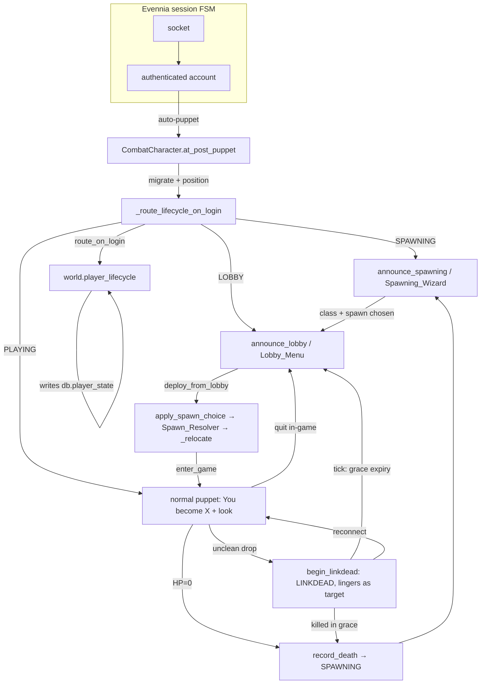

# Design Document: Player Lifecycle

## Overview

The player lifecycle is a persisted, single-writer finite state machine layered
over Evennia's built-in session FSM. Evennia owns the pre-authentication phases
(raw socket → authenticated account); this feature owns the four states a
*character* can dwell in once puppeted:

```
SPAWNING → LOBBY → PLAYING → LINKDEAD
```

The design mirrors the established `resting_activity_status` single-authority
precedent, but for a genuinely persisted FSM (transitions are discrete events,
not a value derived from other fields). One module — `world/player_lifecycle.py`
— is the only writer of `db.player_state`; every other module (command layer,
character hooks, tick loop, combat engine) calls into it.

The whole feature is behind the `LOBBY_FLOW_ENABLED` flag. When off, the
character auto-puppets straight into the world and death respawns in place —
the pre-feature behavior, preserved so the flow can be reverted in one line.

Four behaviors compose on top of the FSM:

1. **Login routing** — `route_on_login` reads the persisted state and resumes the
   player correctly (new → SPAWNING; staging → resume; PLAYING/LINKDEAD →
   reconnect into play).
2. **The staging UI** — a numbered, imperative-command wizard (no EvMenu) for
   class + spawn selection (SPAWNING), and a numbered lobby menu (LOBBY).
3. **Two-level quit + anti-combat-log** — in-game quit retreats to the lobby; a
   dropped connection becomes a linkdead combat target for a grace window; a
   combat timer blocks the retreat.
4. **Death** — routes back through the full spawning wizard.

## Architecture



The lifecycle module is framework-free (no Evennia imports): it operates on any
object with a `.db` and takes the event bus as a parameter or resolves the
process singleton lazily. This keeps it unit-testable with plain fakes and keeps
the FSM logic decoupled from the command/hook layer that drives it.

### State transition table

`PLAYER_STATE_TRANSITIONS` (in `world/constants.py`) is the authoritative edge
set enforced by `transition`:

| From \ event | quit / retreat | deploy / enter | death | unclean drop | reconnect | grace expiry |
|---|---|---|---|---|---|---|
| **SPAWNING** | — | → LOBBY (class+spawn done) | — | (stays SPAWNING) | — | — |
| **LOBBY** | (stays LOBBY) | → PLAYING | — | (stays LOBBY) | — | — |
| **PLAYING** | → LOBBY | — | → SPAWNING | → LINKDEAD | — | — |
| **LINKDEAD** | — | — | → SPAWNING | — | → PLAYING | → LOBBY |

`None` (a brand-new or legacy character) is deliberately absent from the table —
the Login_Router promotes it into an initial state via `transition`, which
special-cases `current is None` to allow any target.

## Components and Interfaces

### 1. `world/player_lifecycle.py` — the FSM (single writer)

The only module that assigns `db.player_state`. Public surface:

```python
def get_state(player) -> str | None
def state_label(state) -> str
def transition(player, new_state, *, reason="", event_bus=None) -> bool  # SINGLE WRITER
def route_on_login(player, *, event_bus=None) -> str
def record_death(player, x, y, planet, *, event_bus=None) -> None
def begin_linkdead(player, now, grace_seconds, *, event_bus=None) -> bool
def clear_linkdead(player) -> None
def is_linkdead_expired(player, now) -> bool
def expire_linkdead(player, *, event_bus=None) -> bool
def enter_game(player, *, event_bus=None) -> bool     # LOBBY → PLAYING
def to_lobby(player, *, reason="quit", event_bus=None) -> bool  # PLAYING → LOBBY
def finish_spawning(player, *, event_bus=None) -> bool  # SPAWNING → LOBBY (guarded on player_class)
```

`transition` validates against the Transition_Table, writes the field, and
publishes `PLAYER_STATE_CHANGED`. All others route their state change through it.

### 2. `world/lobby_flow.py` — the feature flag ONLY

A 31-line module whose entire public surface is:

```python
def lobby_flow_enabled() -> bool   # reads settings.LOBBY_FLOW_ENABLED; False if unreadable
```

> **Naming note:** despite the module name, the deploy/spawn/announce/retreat
> *behavior* lives in `commands/lifecycle_commands.py`, not here. This module is
> only the switch.

### 3. `commands/lifecycle_commands.py` — the staging UI + deploy logic

Command classes (registered into the Character cmdset, except `CmdQuit` →
AccountCmdSet):

| Class | Key / aliases | Role |
|---|---|---|
| `CmdClass` | `class` / `cls` | Pick a class (number, name, key, or prefix); SPAWNING only. |
| `CmdSpawn` | `spawn` | Pick a spawn option (number or prefix); SPAWNING only. |
| `CmdSelect` | `select` / `0`–`9` | Bare-digit front end: routes a typed number to the current SPAWNING step or the Lobby_Menu. |
| `CmdDeploy` | `deploy` / `play` | Deploy from the lobby into the game. |
| `CmdQuit` | `quit` | Two-level quit (subclasses Evennia's account `CmdQuit`). |

Module-level driver functions (not commands): `require_in_game` (the in-game
gate the game commands call), `present_spawning_step` / `_advance_spawning` (the
one-step-at-a-time driver), `_apply_class` / `_apply_spawn`, `deploy_from_lobby`,
`apply_spawn_choice`, `_relocate`, `announce_lobby`, `announce_spawning`.

`CmdEnter` (in `game_commands.py`) routes to `deploy_from_lobby` when the caller
is LOBBY/SPAWNING, so plain `enter` doubles as deploy.

### 4. `typeclasses/characters.py` — the hooks

| Hook / method | Role |
|---|---|
| `PLAYER_DEFAULTS` | Seeds `player_state=None`, `player_class=None`, `death_*`, `linkdead_until=0.0`, combat fields. |
| `at_object_creation` | Deep-copies `PLAYER_DEFAULTS` onto `db`. |
| `ensure_attributes` | Login-time migration; fills only missing/None attrs. |
| `at_post_puppet` | The real post-login hook: `TEST_ENVIRONMENT` guard → migrate → position → `_route_lifecycle_on_login` → staging UI or normal puppet → welcome nudge → `PLAYER_LOGIN`. |
| `_route_lifecycle_on_login` | Calls `route_on_login`; SPAWNING → stow + wizard; LOBBY → menu; PLAYING → normal puppet. |
| `at_post_unpuppet` | Clean-quit (→ LOBBY, stow) vs unclean drop (→ LINKDEAD, linger) classifier via `ndb._clean_quit`. |
| `stow_from_world` | De-index from coordinate index, null location (the "stow" half). |
| `_linkdead_grace_seconds` | Reads `balance.linkdead_grace_seconds` (default 30.0). |

### 5. `typeclasses/accounts.py` — channel subscribe on account login

`at_post_login` calls `super()` then `chat_system.auto_subscribe`. Channel
membership is an account-level concern, deliberately NOT on the character puppet
hook (doing account/channel writes there corrupted EvenniaTest's rollback).

### 6. `world/spawn_resolver.py` — spawn-point resolution

`SpawnResolver.resolve(player, choice, planet_key) -> (planet, x, y) | None`
with injected collaborators (`planet_spawn_func`, `hq_locator_func`,
`in_bounds_func`, `buildings_locator_func`, `min_building_distance`, `rng`). HQ /
death miss → random open tile → planet spawn (last resort) → `None`.

### 7. `world/combat_timer.py` — the in-combat predicate

`player_in_combat(char) -> bool`: `db.combat_timer_expires` strictly in the
future. Shared by the quit gate and the movement gates. Errs toward in-combat on
a tick-lookup failure.

### 8. `world/utils.py` — presence

`player_is_present(entity) -> bool`: LINKDEAD → present (unconditionally, before
the session check); PLAYING/None → present if it holds an account; SPAWNING/LOBBY
→ NOT present (closes the spawn-camp / login-window).

### 9. `typeclasses/scripts.py` — tick-driven grace expiry

The tick loop enumerates LINKDEAD characters via `search_object_attribute`
(pickled `db_value`), and for each expired one calls `expire_linkdead` + world
removal.

### Interface contracts

- **Single writer**: no module other than `player_lifecycle` assigns
  `db.player_state`.
- **Gate opt-out**: `require_in_game` returns True for `state ∈ {None, PLAYING}`,
  so a disabled flow / legacy character is never blocked.
- **Clean-quit signal**: `ndb._clean_quit` is set by `CmdQuit` before disconnect
  and consumed (reset to False) immediately on read in `at_post_unpuppet`.

## Data Models

Lifecycle attributes on `CombatCharacter` (`db.*`), seeded by `PLAYER_DEFAULTS`:

| Attribute | Type | Default | Meaning |
|---|---|---|---|
| `player_state` | `str \| None` | `None` | The persisted FSM state. |
| `player_class` | `str \| None` | `None` | Selected class key/label (cosmetic; no mechanical effect yet). |
| `pending_spawn_choice` | `str \| None` | `None` | `hq`/`death`/`random`, persisted while SPAWNING, consumed on deploy. |
| `death_x`, `death_y` | `int \| None` | `None` | Place-of-death tile. |
| `death_planet` | `str \| None` | `None` | Place-of-death planet (death may be cross-planet). |
| `linkdead_until` | `float` | `0.0` | Wall-clock (monotonic) grace deadline. |
| `combat_timer_expires` | `int` | `0` | Tick-based combat deadline (reset on deploy). |
| `combat_lockout_tick` | `int` | `0` | Build-gate lockout (reset on deploy). |
| `prelogout_location` | room | — | Set by `stow_from_world` for restore. |

Transient (ndb): `ndb._clean_quit` — clean-quit vs dropped-connection marker.

Constants (`world/constants.py`): `PLAYER_STATE_*`, `PLAYER_STATES`,
`PLAYER_STATE_LABELS`, `PLAYER_STATE_TRANSITIONS`,
`RANDOM_SPAWN_MIN_BUILDING_DISTANCE = 20`, `COMBAT_TIMER_DURATION = 60`.
Balance config: `linkdead_grace_seconds = 30.0` (`world/definitions.py`).

Events: `PLAYER_STATE_CHANGED` (player, old_state, new_state, reason);
`PLAYER_LOGIN`; `PLAYER_LOGOUT`.

## Error Handling

- `transition` returns `False` (writes nothing) on an illegal edge or unknown
  state; callers that must know check the return (e.g. `finish_spawning`).
- `_publish_state_changed` swallows all exceptions — telemetry never breaks a
  transition.
- `_route_lifecycle_on_login` and `CmdQuit` routing swallow exceptions at debug
  level and fall through (login/quit must never be blocked by lifecycle bugs).
- `is_linkdead_expired` treats a corrupt deadline as expired (can't wedge).
- `_relocate` and `stow_from_world` are best-effort (never raise into a hook).
- `apply_spawn_choice` treats any resolver miss/exception as "leave the player at
  their last coords" rather than deploying into the void.

## Correctness Properties

### Property 1: Single writer
`db.player_state` is only ever written by `player_lifecycle.transition`. (Grep
invariant: no other assignment to `player_state` exists in the codebase.)

### Property 2: No illegal transitions
For any current state S and target T, `transition` succeeds only if `T == S`
(idempotent) or `T ∈ PLAYER_STATE_TRANSITIONS[S]` (or `S is None`).

### Property 3: Staging is untargetable
A SPAWNING or LOBBY character is never Present (`player_is_present` False), so it
cannot be hit by turret/guard/bomb/melee targeting.

### Property 4: Linkdead lingers as a target
A PLAYING character dropped uncleanly becomes LINKDEAD, is NOT stowed, and is
Present until grace expiry — closing the combat-log escape.

### Property 5: Anti-combat-log on quit
A PLAYING player in combat who issues `quit` neither retreats nor disconnects
(the whole quit is blocked) until their combat timer runs out.

### Property 6: Death re-runs the full wizard
`record_death` clears `player_class` and `pending_spawn_choice`, so a slain
player restarts the Spawning_Wizard at step 1.

### Property 7: Quit → re-enter deploys in place
A clean quit (LOBBY) with no `pending_spawn_choice`, on re-deploy, lands the
player at their last coordinates — NOT a re-rolled spawn.

### Property 8: Deploy clears combat state
After `deploy_from_lobby`, `combat_timer_expires` and `combat_lockout_tick` are
0, so a player who died/quit mid-fight does not re-enter in combat.

### Property 9: Random respawn keeps distance
A `random` spawn lands ≥ `RANDOM_SPAWN_MIN_BUILDING_DISTANCE` from any building
when such a tile is findable, else relaxes to any in-bounds tile.

### Property 10: Flag-off is legacy
With `LOBBY_FLOW_ENABLED` false, login puppets straight into the world, the
in-game gate is inert, and death respawns in place.

## Testing Strategy

### Unit tests (plain fakes, no Evennia DB)

- `world/tests/test_player_lifecycle.py` — the FSM: legal/illegal/idempotent
  transitions, login routing per state, death recording + class/spawn clearing,
  linkdead deadline math + corrupt-deadline handling, enter/quit/finish_spawning.
- `commands/tests/test_lifecycle_commands.py` — `require_in_game` gate; `CmdClass`
  / `CmdSpawn` numbered + name/prefix selection; `CmdSelect` bare-digit routing;
  Lobby_Menu options (incl. session forwarding on `0`); `CmdDeploy` (enters,
  clears combat state, blocked-while-spawning).
- `world/tests/test_spawn_resolver.py` — HQ/death/random resolution, fallbacks,
  min-building-distance sampling + relaxation, nothing-wired → None.
- `world/tests/test_combat_timer.py` — `player_in_combat` semantics incl.
  lookup-failure → errs toward in-combat.

### Integration tests (real Evennia + real DB)

`tests/test_live_boot_smoke.py` boots the real `initialize_game()` wiring and
real typeclasses (guarded by `EVENNIA_REAL_BOOT=1`, `TEST_ENVIRONMENT` off):

- Lifecycle fields seed on real char; router promotes None → SPAWNING
  persistently; illegal edge rejected.
- Full lobby flow end-to-end: fresh → SPAWNING → world-action refused → pick
  class + spawn → LOBBY → deploy → PLAYING in bounds → death → SPAWNING + stowed +
  not Present.
- Linkdead expiry enumerates via `search_object_attribute` and removes to LOBBY
  (H1 regression: `db_strvalue` filter matched nothing → infinite grace).
- Clean-quit-vs-drop on a real char (marker → LOBBY stowed; no marker → LINKDEAD
  lingering, still indexed).
- LINKDEAD present to turret/guard targeting on a real room.

### Test-harness caveat

`at_post_puppet` short-circuits under `settings.TEST_ENVIRONMENT` because
`EvenniaTest.setUp` does a synthetic `login()` that puppets a bare fixture; the
custom login side-effects (DB writes) corrupt the per-test rollback. The smoke
tests therefore drive `_route_lifecycle_on_login` (and the FSM) directly rather
than relying on the puppet hook firing.

## Open Design Questions (see Requirements 12–13)

- **Auto-puppet dependency (R12):** the staging model assumes `AUTO_PUPPET_ON_LOGIN`
  + `MULTISESSION_MODE=0` (Evennia defaults, never set explicitly). A future
  config change would land players at OOC char-select instead of the lobby.
- **Grace vs combat timer (R13.1):** 30 wall-clock seconds vs 60 ticks, on
  different clocks — the anti-combat-log window may be shorter than the combat
  lockout.
- **`finish_spawning` guard (R13.2):** guards on `player_class` only, not
  `pending_spawn_choice`.
- **Reconnect-vs-expiry race (R13.3)** and **crash-resume (R13.4):** need explicit
  intended behavior.
- **`player_class` mechanics (R13.5):** cosmetic until a class-effects feature is
  specified.
