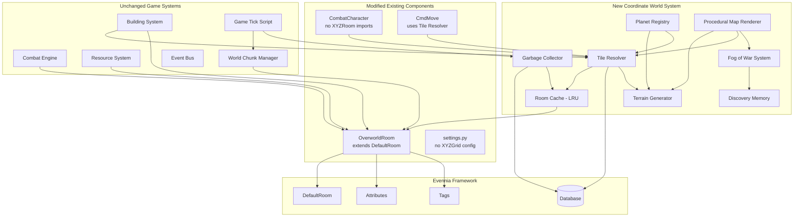
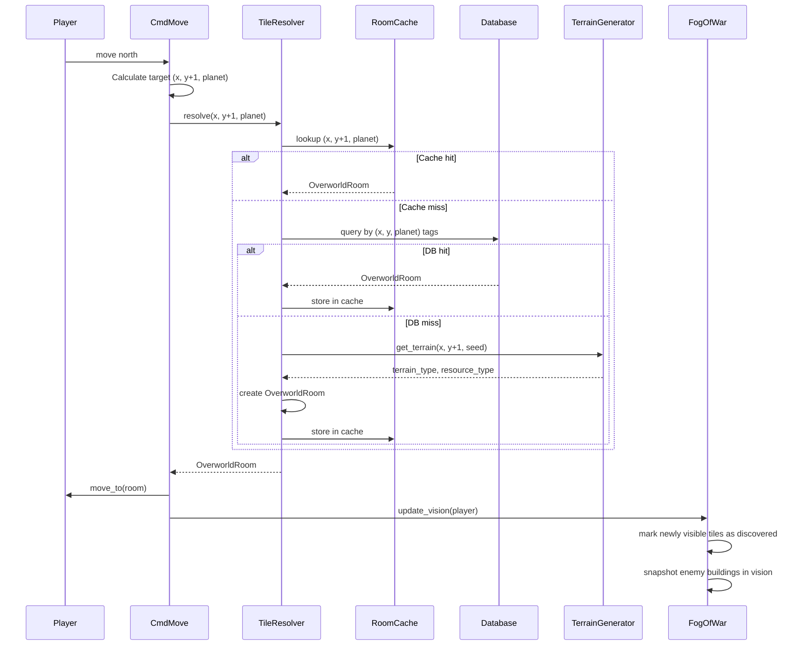
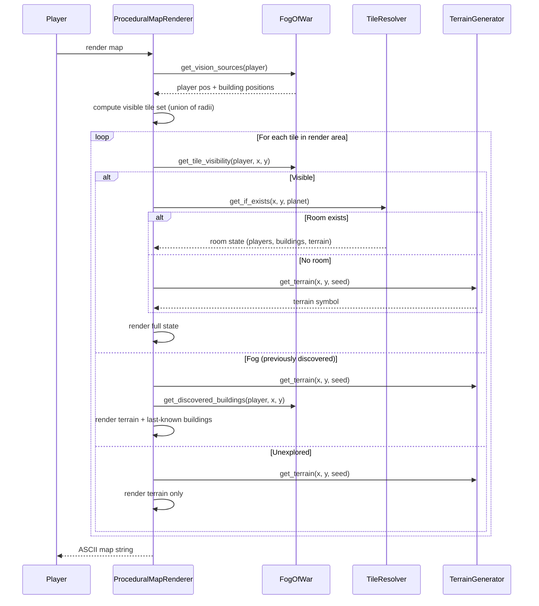

# Design Document: Procedural Coordinate World

## Overview

This design replaces the Evennia XYZGrid contrib dependency with a custom procedural coordinate-based world system. The current system pre-generates every room and exit as database objects from an ASCII map string via XYZGrid, which does not scale beyond small maps. The new system:

- Moves players by coordinate arithmetic — no Exit objects
- Creates rooms on-demand when players visit tiles (or when buildings are placed)
- Generates terrain procedurally from a per-planet seed using a hash-based value noise algorithm (no scipy dependency)
- Supports two room persistence models: Static (persist forever, for buildable planets) and Dynamic (garbage collected, for ephemeral spaces like space)
- Renders the ASCII map from procedural terrain data without requiring rooms to exist for every visible tile
- Implements RTS-style Fog of War with three visibility states (visible, fog, unexplored) and per-player discovery memory that persists enemy building snapshots

The design preserves the public interfaces of all existing game systems (BuildingSystem, CombatEngine, ResourceSystem, RankSystem, PowerupSystem, TechLabSystem, EquipmentSystem, WorldChunkManager) by keeping the OverworldRoom interface identical — only the base class changes from XYZRoom to DefaultRoom, and coordinates move from XYZGrid's internal system to simple Evennia Attributes.

### Design Principles

1. **On-demand creation**: Rooms exist in the database only when needed (player visit or building placement). The Terrain_Generator provides terrain for any coordinate without a room.
2. **Seed-deterministic**: Given the same (x, y, seed), terrain output is always identical. No randomness at query time.
3. **No scipy**: The noise algorithm uses only Python stdlib (hash-based value noise with bilinear interpolation).
4. **Backward compatible**: All existing systems continue to work through the unchanged OverworldRoom public interface.
5. **Presentation-agnostic**: The Procedural_Map_Renderer consumes terrain data and room state; it does not create rooms for rendering.

## Architecture

### High-Level System Diagram



### Request Flow: Player Movement



### Request Flow: Map Rendering



## Components and Interfaces

### 1. Planet Registry (`world/planet_registry.py`)

Stores Coordinate_Space definitions. Loaded from YAML via the existing Data_Registry pattern.

```python
@dataclass
class CoordinateSpaceDef:
    """Definition for a single planet's coordinate space."""
    planet_key: str              # e.g. "earth_planet", "space"
    planet_type: str             # "earth" or "industrial" — determines terrain set
    width: int                   # grid width in tiles
    height: int                  # grid height in tiles
    terrain_seed: int            # seed for deterministic terrain generation
    terrain_noise_cell_size: int # coarse grid size for noise interpolation (default 8)
    terrain_weights: dict[str, float]  # terrain_type -> relative weight
    persistence_type: str        # "static" or "dynamic"
    spawn_x: int = 0            # default spawn X
    spawn_y: int = 0            # default spawn Y
    default_planet: bool = False # if True, new players spawn here

class PlanetRegistry:
    """Configuration store for all Coordinate_Space definitions."""

    _spaces: dict[str, CoordinateSpaceDef]

    def __init__(self) -> None: ...
    def load_from_yaml(self, path: str) -> None: ...
    def get_space(self, planet_key: str) -> CoordinateSpaceDef: ...
    def list_planets(self) -> list[str]: ...
    def is_valid_coordinate(self, x: int, y: int, planet_key: str) -> bool: ...
```

YAML format (loaded from `data/definitions/planets.yaml`):

```yaml
planets:
  - planet_key: "earth_planet"
    planet_type: "earth"
    width: 100
    height: 100
    terrain_seed: 42
    terrain_weights:
      Plains: 0.35
      Forest: 0.25
      Mud: 0.15
      Rock: 0.15
      Mountain: 0.10
    persistence_type: "static"
    spawn_x: 50
    spawn_y: 50

  - planet_key: "industrial_planet"
    planet_type: "industrial"
    width: 50
    height: 50
    terrain_seed: 7
    terrain_weights:
      Power_Grid: 0.30
      Scrapyard: 0.30
      Circuit_Field: 0.25
      Ruins: 0.15
    persistence_type: "static"
    spawn_x: 25
    spawn_y: 25

  - planet_key: "space"
    planet_type: "space"
    width: 200
    height: 200
    terrain_seed: 99
    terrain_weights: {}
    persistence_type: "dynamic"
    spawn_x: 100
    spawn_y: 100
```

### 2. Terrain Generator (`world/terrain_generator.py`)

Deterministically computes terrain for any (x, y) given a seed and planet configuration. Uses hash-based value noise with bilinear interpolation — no external dependencies.

```python
class TerrainGenerator:
    """Deterministic terrain generator using hash-based value noise."""

    def __init__(self, space_def: CoordinateSpaceDef) -> None: ...

    def get_terrain(self, x: int, y: int) -> str:
        """Return the terrain type string for coordinate (x, y).

        Deterministic: same (x, y) + same seed = same result, always.
        """
        ...

    def get_terrain_and_resource(self, x: int, y: int) -> tuple[str, str | None]:
        """Return (terrain_type, resource_type) for coordinate (x, y).

        resource_type is derived from the planet's terrain-to-resource mapping.
        Returns None for resource_type if the terrain has no associated resource.
        """
        ...

    def _noise(self, x: int, y: int) -> float:
        """Hash-based value noise returning a float in [0, 1).

        Uses a deterministic hash of (x, y, seed) with bilinear
        interpolation between grid points for smooth terrain clustering.
        No scipy or numpy required.
        """
        ...

    def _terrain_from_noise(self, noise_value: float) -> str:
        """Map a noise value in [0, 1) to a terrain type using cumulative weights."""
        ...
```

The noise algorithm:
1. Divide coordinate space into a coarse grid (e.g., cell_size=8)
2. For each coarse grid corner, compute `hash((corner_x, corner_y, seed)) % large_prime / large_prime` to get a float in [0, 1)
3. Bilinearly interpolate the four corner values at the fine (x, y) position
4. Map the interpolated value to a terrain type using cumulative weight thresholds

This produces natural-looking terrain clusters without any external library.

### 3. Tile Resolver (`world/tile_resolver.py`)

Single entry point for resolving coordinates to rooms. All game systems use this instead of XYZRoom.objects.get_xyz.

```python
class TileResolver:
    """Resolves (x, y, planet) coordinates to OverworldRoom instances."""

    def __init__(
        self,
        planet_registry: PlanetRegistry,
        terrain_generators: dict[str, TerrainGenerator],
        room_cache: RoomCache,
    ) -> None: ...

    def resolve(self, x: int, y: int, planet: str) -> OverworldRoom:
        """Return the OverworldRoom for (x, y, planet), creating on demand.

        Lookup order: cache -> database -> create new.
        Raises ValueError if coordinates are out of bounds.
        """
        ...

    def get_if_exists(self, x: int, y: int, planet: str) -> OverworldRoom | None:
        """Return existing room or None. Does not create."""
        ...

    def get_or_generate_terrain(self, x: int, y: int, planet: str) -> tuple[str, str | None]:
        """Return (terrain_type, resource_type) without creating a room.

        If a room exists, reads from the room. Otherwise queries TerrainGenerator.
        Used by the Procedural_Map_Renderer for tiles that don't need rooms.
        """
        ...

    def _create_room(self, x: int, y: int, planet: str) -> OverworldRoom:
        """Create a new OverworldRoom with correct attributes and tags.

        Tags: ("overworld_tile", "room_type"), (terrain, "terrain"),
              (persistence_type, "persistence_type"),
              (str(x), "coord_x"), (str(y), "coord_y"), (planet, "coord_planet")
        Attributes: x (int), y (int), planet (str), resource_node_data (dict)
        Key: "{TerrainType} ({x},{y})"
        """
        ...

    def _db_lookup(self, x: int, y: int, planet: str) -> OverworldRoom | None:
        """Query the database for an existing room at (x, y, planet)."""
        ...
```

### 4. Room Cache (`world/room_cache.py`)

LRU cache for recently accessed rooms. Avoids repeated database queries.

```python
class RoomCache:
    """LRU cache mapping (x, y, planet) -> OverworldRoom."""

    def __init__(self, max_size: int = 1000) -> None:
        """Args: max_size read from balance.room_cache_max_size."""
        ...

    def get(self, x: int, y: int, planet: str) -> OverworldRoom | None: ...
    def put(self, x: int, y: int, planet: str, room: OverworldRoom) -> None: ...
    def remove(self, x: int, y: int, planet: str) -> None: ...
    def clear(self) -> None: ...
    @property
    def size(self) -> int: ...
```

Implemented using `collections.OrderedDict` for O(1) LRU eviction.

### 5. Garbage Collector (`world/garbage_collector.py`)

Periodically removes Dynamic_Rooms that have no players and no buildings.

```python
class RoomGarbageCollector:
    """Removes unused Dynamic_Rooms from the database."""

    def __init__(
        self,
        room_cache: RoomCache,
        interval_ticks: int = 100,
        min_age_ticks: int = 50,
    ) -> None:
        """Args: interval_ticks from balance.gc_interval_ticks,
        min_age_ticks from balance.gc_min_age_ticks."""
        ...

    def run(self) -> int:
        """Execute one GC pass. Returns count of rooms deleted.

        Finds Dynamic_Rooms (tagged persistence_type=dynamic) with:
        - No player characters present (contents check)
        - No buildings present (contents check)
        - No custom modifications (description matches default pattern)

        Deletes eligible rooms from DB and removes from cache.
        Never touches Static_Rooms.
        """
        ...
```

Integrated into the GameTickScript — runs every `interval_ticks` ticks.

### 6. OverworldRoom (Modified) (`typeclasses/rooms.py`)

Changes from current implementation:
- Extends `DefaultRoom` instead of `XYZRoom`
- Stores coordinates as Attributes (x, y, planet) instead of XYZGrid's system
- Removes `xyz` property, adds individual `x`, `y`, `planet_name` properties
- All other public interface methods remain identical

```python
class OverworldRoom(DefaultRoom):
    """A single tile on the overworld map.

    Extends DefaultRoom (not XYZRoom). Coordinates stored as Attributes.
    """

    @property
    def x(self) -> int:
        return self.attributes.get("x", default=0)

    @property
    def y(self) -> int:
        return self.attributes.get("y", default=0)

    @property
    def planet_name(self) -> str:
        return self.attributes.get("planet", default="unknown")

    @property
    def terrain_type(self) -> str:
        """Return terrain from Tag (unchanged interface)."""
        tag = self.tags.get(category="terrain", return_list=False)
        return tag or "unknown"

    @property
    def resource_node(self) -> dict | None:
        """Return resource node data (unchanged interface)."""
        return self.attributes.get("resource_node_data", default=None)

    @property
    def building(self):
        """Return first Building in contents (unchanged interface)."""
        ...

    def get_display_symbol(self, looker) -> str:
        """2-char symbol with priority (unchanged interface)."""
        ...

    def get_structured_state(self) -> dict:
        """Presentation-agnostic state dict (unchanged interface)."""
        ...
```

### 7. CombatCharacter (Modified) (`typeclasses/characters.py`)

Changes:
- Remove XYZRoom import from `_maybe_move_to_overworld`
- Use TileResolver for spawn placement
- Store player coordinates as Attributes: `coord_x`, `coord_y`, `coord_planet`
- Add `discovery_memory` Attribute for Fog of War

```python
class CombatCharacter(DefaultCharacter):
    """Player character — XYZGrid dependency removed."""

    def at_object_creation(self):
        super().at_object_creation()
        # ... existing attribute initialization ...
        # New: coordinate tracking
        self.db.coord_x = 0
        self.db.coord_y = 0
        self.db.coord_planet = ""
        # New: fog of war discovery memory
        self.db.discovery_memory = {}  # (x,y,planet) -> DiscoveryEntry

    def _maybe_move_to_overworld(self):
        """Move from Limbo to spawn — uses TileResolver, not XYZRoom."""
        ...
```

### 8. CmdMove (Modified) (`commands/game_commands.py`)

Changes:
- Resolve target tile via TileResolver instead of XYZGrid exit objects
- Validate bounds via PlanetRegistry
- Update player coordinate Attributes after move

```python
class CmdMove(BaseCommand):
    """Move to an adjacent tile using coordinate arithmetic."""

    def func(self):
        # 1. Parse direction -> (dx, dy)
        # 2. Read current (x, y, planet) from caller Attributes
        # 3. Calculate target (x+dx, y+dy)
        # 4. Validate bounds via PlanetRegistry
        # 5. Resolve target room via TileResolver
        # 6. Check for offline building blocking
        # 7. Move player to room
        # 8. Update caller's coord_x, coord_y Attributes
        ...
```

### 9. Fog of War System (`world/fog_of_war.py`)

Manages per-player visibility and discovery memory.

```python
@dataclass
class DiscoveredBuildingState:
    """Snapshot of an enemy building seen in fog."""
    building_type: str   # abbreviation e.g. "HQ"
    owner_name: str
    x: int
    y: int

class FogOfWarSystem:
    """RTS-style fog of war with discovery memory."""

    PLAYER_VISION_RADIUS: int = 10   # read from balance.player_vision_radius
    BUILDING_VISION_RADIUS: int = 7  # read from balance.building_vision_radius

    def __init__(self, balance: BalanceConfig) -> None:
        self.player_vision_radius = balance.player_vision_radius
        self.building_vision_radius = balance.building_vision_radius

    def get_visible_tiles(
        self, player: CombatCharacter, player_buildings: list
    ) -> set[tuple[int, int]]:
        """Compute the union of all vision circles for the player.

        Vision sources:
        - Circle of radius 10 around player position
        - Circle of radius 7 around each owned building
        Returns set of (x, y) tuples.
        """
        ...

    def get_tile_visibility(
        self, player: CombatCharacter, x: int, y: int,
        visible_tiles: set[tuple[int, int]]
    ) -> str:
        """Return 'visible', 'fog', or 'unexplored' for a tile."""
        ...

    def update_discovery(
        self, player: CombatCharacter, visible_tiles: set[tuple[int, int]],
        tile_resolver: TileResolver
    ) -> None:
        """Update the player's discovery memory for all currently visible tiles.

        - Mark tiles as discovered
        - Snapshot enemy buildings on visible tiles
        - Update/remove stale building snapshots when vision is regained
        """
        ...

    def get_discovered_buildings(
        self, player: CombatCharacter, x: int, y: int
    ) -> list[DiscoveredBuildingState]:
        """Return last-known enemy building snapshots for a fog tile."""
        ...

    def _get_discovery_memory(self, player: CombatCharacter) -> dict: ...
    def _save_discovery_memory(self, player: CombatCharacter, memory: dict) -> None: ...
```

Discovery memory is stored as a persistent Attribute on the CombatCharacter:
```python
# Structure of discovery_memory Attribute:
{
    "discovered": set(),  # set of (x, y) tuples that have been seen
    "buildings": {        # (x, y) -> DiscoveredBuildingState dict
        (15, 20): {"building_type": "HQ", "owner_name": "Enemy1", "x": 15, "y": 20},
    }
}
```

### 10. Procedural Map Renderer (`world/procedural_map_renderer.py`)

Replaces the existing ASCIIMapRenderer with fog-of-war-aware rendering that works with procedural terrain.

```python
class ProceduralMapRenderer:
    """Renders ASCII map from procedural terrain with RTS fog of war."""

    def __init__(
        self,
        tile_resolver: TileResolver,
        fog_system: FogOfWarSystem,
        terrain_generators: dict[str, TerrainGenerator],
    ) -> None: ...

    def render(
        self,
        player: CombatCharacter,
        player_buildings: list,
    ) -> str:
        """Render the full ASCII map for a player.

        1. Compute visible tiles (union of vision radii)
        2. Determine render bounds (max extent of vision)
        3. For each tile in bounds:
           - visible: full state (players, buildings, terrain)
           - fog: terrain + discovered buildings from memory
           - unexplored: terrain only
        4. Return multi-line ASCII string, 2 chars per tile
        """
        ...

    def _get_tile_symbol(
        self,
        x: int, y: int, planet: str,
        visibility: str,
        player: CombatCharacter,
        visible_tiles: set[tuple[int, int]],
    ) -> str:
        """Get the 2-char symbol for a tile based on visibility state.

        visible: @@ > ** > building abbr > terrain
        fog: discovered building abbr > terrain (no players shown)
        unexplored: terrain only
        """
        ...
```

## Data Models

### CoordinateSpaceDef (new dataclass in `world/definitions.py`)

```python
@dataclass
class CoordinateSpaceDef:
    planet_key: str
    planet_type: str
    width: int
    height: int
    terrain_seed: int
    terrain_noise_cell_size: int = 8
    terrain_weights: dict[str, float] = field(default_factory=dict)
    persistence_type: str = "static"
    spawn_x: int = 0
    spawn_y: int = 0
    default_planet: bool = False
```

### BalanceConfig additions (added to existing `world/definitions.py` BalanceConfig)

```python
# New fields added to the existing BalanceConfig dataclass:
player_vision_radius: int = 10       # tiles visible around the player
building_vision_radius: int = 7      # tiles visible around each owned building
room_cache_max_size: int = 1000      # max rooms in the LRU cache
gc_interval_ticks: int = 100         # garbage collection frequency
gc_min_age_ticks: int = 50           # min ticks before a dynamic room is GC-eligible
```

### OverworldRoom Attributes (on-demand created rooms)

| Attribute | Type | Description |
|---|---|---|
| `x` | int | X coordinate |
| `y` | int | Y coordinate |
| `planet` | str | Planet key string |
| `resource_node_data` | dict | `{resource_type, depleted, respawn_counter}` |

### OverworldRoom Tags

| Tag Value | Category | Description |
|---|---|---|
| terrain type string | `terrain` | e.g. "Plains", "Forest" |
| `overworld_tile` | `room_type` | For GameTickScript discovery |
| `static` or `dynamic` | `persistence_type` | Room lifecycle type |
| str(x) | `coord_x` | For DB lookup |
| str(y) | `coord_y` | For DB lookup |
| planet_key | `coord_planet` | For DB lookup |

### CombatCharacter New Attributes

| Attribute | Type | Description |
|---|---|---|
| `coord_x` | int | Current X position |
| `coord_y` | int | Current Y position |
| `coord_planet` | str | Current planet key |
| `discovery_memory` | dict | Fog of war discovery data |

### Discovery Memory Structure

```python
{
    "discovered": {(x, y), ...},  # set of discovered tile coordinates
    "buildings": {
        (x, y): {
            "building_type": "HQ",
            "owner_name": "PlayerName",
            "x": x,
            "y": y,
        },
        ...
    }
}
```

### Settings Changes

Remove from `settings.py`:
```python
# REMOVE:
EXTRA_LAUNCHER_COMMANDS = {"xyzgrid": "..."}
PROTOTYPE_MODULES = ["evennia.contrib.grid.xyzgrid.prototypes"]
# REMOVE:
OVERWORLD_SPAWN_COORDS = (...)  # now lives in planets.yaml per-planet
```

### Configuration Location Summary

All tunable values live in one of two places:

**`data/definitions/planets.yaml`** — per-planet configuration:
```yaml
planets:
  - planet_key: "earth_planet"
    planet_type: "earth"
    width: 100
    height: 100
    terrain_seed: 42
    terrain_noise_cell_size: 8    # coarse grid size for noise interpolation
    terrain_weights:
      Plains: 0.35
      Forest: 0.25
      Mud: 0.15
      Rock: 0.15
      Mountain: 0.10
    persistence_type: "static"
    spawn_x: 50                   # default spawn X for new players
    spawn_y: 50                   # default spawn Y for new players
    default_planet: true          # first-login planet (only one should be true)
```

**`data/config/balance.yaml`** — global gameplay/infrastructure values (added to existing BalanceConfig):
```yaml
# --- Existing values (unchanged) ---
turret_damage: 15
# ...

# --- New: Coordinate World config ---
player_vision_radius: 10         # tiles visible around the player character
building_vision_radius: 7        # tiles visible around each owned building
room_cache_max_size: 1000        # max rooms held in the LRU cache
gc_interval_ticks: 100           # how often garbage collection runs
gc_min_age_ticks: 50             # minimum age before a dynamic room is eligible for GC
```

**No config in Python code or `settings.py`**: The `FogOfWarSystem`, `RoomCache`, `RoomGarbageCollector`, and `TerrainGenerator` all read their parameters from the `BalanceConfig` or `CoordinateSpaceDef` passed to them at initialization — no hardcoded magic numbers.

**`settings.py`** retains only Evennia framework settings:
```python
BASE_CHARACTER_TYPECLASS = "typeclasses.characters.CombatCharacter"
# No OVERWORLD_SPAWN_COORDS — spawn location comes from planets.yaml (default_planet + spawn_x/spawn_y)
# No EXTRA_LAUNCHER_COMMANDS — XYZGrid removed
# No PROTOTYPE_MODULES — XYZGrid removed
```


## Correctness Properties

*A property is a characteristic or behavior that should hold true across all valid executions of a system — essentially, a formal statement about what the system should do. Properties serve as the bridge between human-readable specifications and machine-verifiable correctness guarantees.*

### Property 1: Terrain generation determinism

*For any* coordinate (x, y) and any terrain seed, calling `get_terrain(x, y)` multiple times SHALL always return the same terrain type string.

**Validates: Requirements 3.1, 3.2**

### Property 2: Terrain output is always in the configured terrain set

*For any* coordinate (x, y) within a Coordinate_Space, the terrain type returned by the Terrain_Generator SHALL be a member of the planet's configured terrain type set (e.g., Earth terrains or Industrial terrains).

**Validates: Requirements 3.4**

### Property 3: Terrain-to-resource mapping consistency

*For any* coordinate (x, y), the resource type returned by `get_terrain_and_resource(x, y)` SHALL match the planet's terrain-to-resource mapping for the terrain type at that coordinate. If the terrain has no associated resource, the resource type SHALL be None.

**Validates: Requirements 3.6, 9.3**

### Property 4: Room creation produces correct attributes and tags

*For any* valid coordinate (x, y, planet), when the Tile_Resolver creates a new On_Demand_Room, the room SHALL have: x and y Attributes matching the input coordinates, a planet Attribute matching the planet key, a terrain Tag matching the Terrain_Generator output for that coordinate, a resource_node_data Attribute consistent with the terrain-to-resource mapping, a persistence_type Tag matching the Coordinate_Space configuration, an "overworld_tile" Tag in category "room_type", and a key in the format "{TerrainType} ({x},{y})".

**Validates: Requirements 2.1, 2.5, 2.6, 2.7, 2.8, 2.9, 2.10, 9.5, 9.6, 10.2, 10.3**

### Property 5: Room cache round-trip

*For any* coordinate (x, y, planet) and any OverworldRoom, storing the room in the Room_Cache via `put` and then retrieving it via `get` SHALL return the same room object. For any coordinate not in the cache, `get` SHALL return None.

**Validates: Requirements 2.2, 4.1**

### Property 6: Room cache LRU eviction respects max size

*For any* sequence of `put` operations on a Room_Cache with max_size N, the cache size SHALL never exceed N. When the cache is full and a new entry is added, the least-recently-used entry SHALL be evicted.

**Validates: Requirements 4.2**

### Property 7: Garbage collection never deletes static rooms

*For any* set of rooms processed by the Garbage_Collector, all Static_Rooms (tagged persistence_type="static") SHALL be preserved regardless of whether they contain players, buildings, or custom state. Only Dynamic_Rooms that are empty (no players, no buildings) and unmodified SHALL be eligible for deletion.

**Validates: Requirements 4.3, 4.6, 4.7, 4.8, 10.5**

### Property 8: Movement respects coordinate space bounds

*For any* player position (x, y) and direction, if the target coordinate (x+dx, y+dy) is within the Coordinate_Space bounds (0 ≤ x+dx < width, 0 ≤ y+dy < height), movement SHALL succeed. If the target is outside bounds, movement SHALL be rejected.

**Validates: Requirements 1.1, 1.2, 1.3**

### Property 9: Player coordinate attributes match location after movement

*For any* successful movement to coordinate (tx, ty), the Player_Character's coord_x and coord_y Attributes SHALL equal tx and ty respectively, and the Player_Character's location SHALL be the OverworldRoom at (tx, ty, planet).

**Validates: Requirements 1.4**

### Property 10: Vision computation is the union of all vision source circles

*For any* player position and set of owned building positions, the set of visible tiles SHALL equal the union of: a circle of radius 10 (Chebyshev distance) centered on the player position, and a circle of radius 7 centered on each owned building position.

**Validates: Requirements 5.9, 11.8**

### Property 11: Fog tiles hide enemy players but show discovered buildings

*For any* tile in the "fog" visibility state (previously discovered, not currently visible), the rendered symbol SHALL never show enemy Player_Characters ("**"). If the player's Discovery_Memory contains a building snapshot for that tile, the rendered symbol SHALL show the building abbreviation. Otherwise, the rendered symbol SHALL show the terrain symbol.

**Validates: Requirements 5.6, 11.5, 11.6**

### Property 12: Discovery memory records all visible tiles and enemy building snapshots

*For any* set of tiles entering a Player_Character's vision, all those tiles SHALL be marked as discovered in the Discovery_Memory. For any visible tile containing an enemy Building, a Discovered_Building_State snapshot SHALL be stored with the building's type abbreviation, owner name, and position.

**Validates: Requirements 11.2, 11.3, 11.4**

### Property 13: Planet coordinate spaces are isolated

*For any* two distinct planet keys, resolving a coordinate (x, y) on planet A SHALL return a different room than resolving the same (x, y) on planet B. Operations on one planet's Coordinate_Space SHALL not affect rooms or state in another planet's Coordinate_Space.

**Validates: Requirements 6.3, 6.4**

## Error Handling

### Coordinate Validation
- Out-of-bounds coordinates: `CmdMove` rejects with "edge of the map" message. `TileResolver.resolve()` raises `ValueError`.
- Invalid planet key: `PlanetRegistry.get_space()` raises `KeyError`. `TileResolver` propagates the error.

### Room Creation Failures
- Database errors during room creation: `TileResolver._create_room()` catches database exceptions, logs the error, and re-raises. The calling command displays a generic error to the player.
- Terrain generation errors: Should never occur (pure deterministic function), but if the noise value falls outside [0, 1), the generator clamps it and logs a warning.

### Cache Errors
- Cache corruption (room deleted from DB but still in cache): `TileResolver` validates that cached rooms still exist in the DB on access. Stale entries are evicted.
- Cache full: LRU eviction handles this automatically. No error state.

### Garbage Collection Safety
- GC runs in a try/except block within the GameTickScript. Errors are logged but do not halt the tick loop.
- GC double-checks room contents before deletion to avoid race conditions with player movement.

### Fog of War
- Discovery memory corruption: If the `discovery_memory` Attribute is missing or malformed, the system initializes a fresh empty memory. No crash.
- Building owner lookup failure: If a building's owner cannot be resolved, the snapshot stores "Unknown" as the owner name.

### Backward Compatibility
- If any game system attempts to access `room.xyz` (the old XYZRoom property), it will get an `AttributeError`. All such references must be updated to use `room.x`, `room.y`, `room.planet_name`.
- The `CombatEngine._get_coords()` helper already falls back to `x`/`y` attributes when `xyz` is not available, so it works without changes.

## Testing Strategy

### Property-Based Tests (Hypothesis)

The project already uses Hypothesis for PBT (see existing tests in `mygame/typeclasses/tests/`). Each correctness property above maps to one or more Hypothesis test functions with a minimum of 100 examples per test.

Each property test is tagged with:
```python
# Feature: procedural-coordinate-world, Property N: <property_text>
```

Properties to implement as PBT:
- Property 1: Terrain determinism — generate random (x, y, seed), call twice, assert equal
- Property 2: Terrain in valid set — generate random coords, assert output in terrain set
- Property 3: Terrain-resource mapping — generate random coords, assert resource matches terrain
- Property 4: Room creation correctness — generate random coords, create room, assert all attributes/tags
- Property 5: Cache round-trip — generate random coords/rooms, put/get, assert identity
- Property 6: Cache LRU eviction — generate operation sequences, assert size invariant
- Property 7: GC never deletes static — generate mixed room sets, run GC, assert static rooms preserved
- Property 8: Movement bounds — generate random positions/directions, assert success/rejection matches bounds
- Property 9: Coordinate attributes after move — generate valid moves, assert attributes match
- Property 10: Vision union — generate positions, compute vision, assert equals union of circles
- Property 11: Fog hides enemies — generate fog tiles with entities, assert enemies hidden
- Property 12: Discovery memory — generate vision sets with buildings, assert memory updated
- Property 13: Planet isolation — generate ops on two planets, assert no cross-contamination

### Unit Tests (Example-Based)

- CmdMove: specific movement scenarios (north from (5,5), edge cases at (0,0))
- TileResolver: DB fallback path, building placement triggers room creation
- PlanetRegistry: loading from YAML, default persistence types
- OverworldRoom: interface compatibility (all existing properties/methods work)
- CombatCharacter: first-login spawn, discovery memory persistence across sessions
- ProceduralMapRenderer: specific rendering scenarios with known tile states

### Integration Tests

- BuildingSystem + TileResolver: construct building on new tile, verify room created
- CombatEngine + new OverworldRoom: attack resolution with coordinate-based range
- ResourceSystem + new OverworldRoom: harvest from procedurally generated resource node
- WorldChunkManager + new rooms: chunk computation with Attribute-based coordinates
- GameTickScript + GC: verify GC runs at configured interval and cleans dynamic rooms

### Smoke Tests

- No XYZGrid imports in any modified file
- No Exit objects created during movement
- Settings.py has no XYZGrid configuration
- OverworldRoom extends DefaultRoom, not XYZRoom
