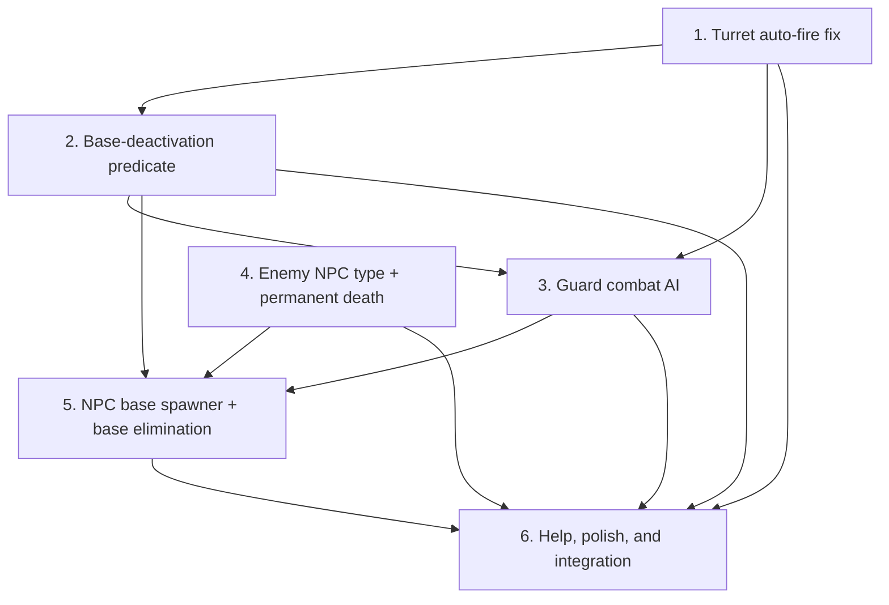

# Implementation Plan: NPC Outposts & Fortresses

## Overview

Enemy bases on the map — outposts (easy) and fortresses (hard) — that players raid for XP and loot.
Built in six incrementally-shippable phases. Each phase is independently testable and produces a
working game state. Every defensive system (turrets, guards, base-elimination) is ownership-generic
and immediately benefits PvP as well as PvE.

**Phases → PR mapping:**
- **Phase 1** (PR1): Turret fix + `get_nearby_players` — prerequisite; fixes a live bug; PvP benefit immediate.
- **Phase 2** (PR2): "No HQ = base inert" predicate + deactivation messaging — PvP core mechanic.
- **Phase 3** (PR3): Guard combat AI — PvP-ready; guards defend player bases AND NPC bases.
- **Phase 4** (PR4): Enemy NPC type + permanent death — PvE combat resolution.
- **Phase 5** (PR5): Base elimination handler + spawner + templates — full PvE loop.
- **Phase 6** (PR6): Balance tuning, help, and final integration tests.

## Tasks

- [x] 1. Turret auto-fire fix (Phase 1)
  - [x] 1.1 Add `TURRET = "turret"` capability constant to `world/constants.py`
    - _Requirements: 1.1_
  - [x] 1.2 Add a `capabilities: [turret]` field to the Turret BuildingDef (abbreviation `TU`) in `buildings.yaml`
    - Add the capability ONLY to the Turret entry — do NOT add `turret` to the HQ. `process_turrets` iterates every building with the `turret` capability, so tagging the HQ would make every HQ auto-fire like a turret.
    - Verify: grep for the `TU` / Turret entry in buildings.yaml; it currently has NO `capabilities` field, so add one with value `[turret]`
    - _Requirements: 1.1_
  - [x] 1.3 Replace `building_type != "VV"` in `combat_engine.process_turrets` with `building_has_capability(building, TURRET)`
    - _Requirements: 1.1, 12.1_
  - [x] 1.4 Add `PlanetRoom.get_nearby_players(x, y, radius)` using CoordinateIndex spatial query + Manhattan filter
    - _Requirements: 1.2, 1.3_
  - [x] 1.5 Update `process_turrets` to call `building.location.get_nearby_players(bx, by, turret_radius)` instead of the nonexistent `_get_nearby_players`
    - _Requirements: 1.3_
  - [x] 1.6 Change turret owner-skip from `player is owner` to `is_owner(player, owner)`
    - _Requirements: 1.4_
  - [x] 1.7 Update existing turret tests to use the real building type (`"TU"` / capability) and assert targeting via the new spatial query
    - Reconcile the `get_nearby_players` signature change: the existing turret test fakes define a 1-arg `get_nearby_players(self, radius)` (in `test_combat_engine.py` and `test_prop_combat_engine.py`), which conflicts with the new 3-arg `PlanetRoom.get_nearby_players(x, y, radius)`. Update these fakes to the 3-arg signature (or retire the old 1-arg `_get_nearby_players` hook and migrate its callers/fakes) so the two contracts cannot coexist with mismatched signatures.
    - _Requirements: 12.6_
  - [x] 1.8 Add the deactivation gate (placeholder until Phase 2 lands): `if not owner_has_active_hq(owner, planet): continue`
    - Can stub `owner_has_active_hq` to always return True for now; Phase 2 wires the real check
    - _Requirements: 1.5_

- [x] 2. Base-deactivation predicate (Phase 2)
  - [x] 2.1 Implement `owner_has_active_hq(owner, planet)` in `world/utils.py`
    - Queries the owner's buildings for a headquarters capability on the given planet
    - _Requirements: 2.1, 2.5_
  - [x] 2.2 Gate `process_turrets` on `owner_has_active_hq` (replace Phase 1 placeholder)
    - _Requirements: 1.5, 2.2_
  - [x] 2.3 Gate `EquipmentSystem.process_production` — skip buildings whose owner fails the check
    - _Requirements: 2.2_
  - [x] 2.4 Gate building commands (craft, research, deposit, withdraw, closeexit, openexit, assign, unassign) — reject with "Your base is deactivated — rebuild an HQ."
    - _Requirements: 2.2_
  - [x] 2.5 Add `base_deactivated` notification (fires in the existing `_handle_building_destruction` when a player HQ is destroyed)
    - _Requirements: 10.4_
  - [x] 2.6 Add `base_reactivated` notification (fires when HQ construction completes for a player whose base was inert)
    - _Requirements: 10.5, 2.3_
  - [x] 2.7 Tests: deactivation predicate unit tests, gated systems reject when no HQ, reactivation on HQ rebuild, notification assertions
    - _Requirements: 12.6_

- [x] 3. Guard combat AI (Phase 3)
  - [x] 3.1 Create `world/systems/guard_combat_system.py` with `GuardCombatSystem(BaseSystem)`
    - `process_tick(tick_number, npcs)` — main per-tick method (takes the NPC/agent roster)
    - _Requirements: 3.1_
  - [x] 3.2 Register in `game_init.py` and add `"guard_combat"` to `TICK_STEP_ORDER` (before `combat_resolution`)
    - _Requirements: 3.1_
  - [x] 3.3 Wire in `_build_tick_steps`: feed the cached agent roster, call process_tick (role filtering happens inside the system)
    - _Requirements: 3.1_
  - [x] 3.4 Implement target acquisition: `get_nearby_players(npc_x, npc_y, aggro_radius)`, exclude owner (by `.id`), pick nearest
    - _Requirements: 3.2, 3.4_
  - [x] 3.5 Implement `_GuardWeapon` synthetic weapon (melee + ranged variants with configurable damage/range); queue_attack accepts an explicit weapon so guards flow through the full range/self/ammo pipeline
    - _Requirements: 3.3_
  - [x] 3.6 Gate on `owner_has_active_hq` — skip guards whose owner's base is deactivated (ownerless guards fail the same gate)
    - _Requirements: 3.2_
  - [x] 3.7 Skip incapacitated / reserved / 0-HP guards
    - _Requirements: 3.5_
  - [x] 3.8 Add balance fields to `BalanceConfig`: `guard_melee_damage`, `guard_ranged_damage`, `guard_ranged_range`, `guard_aggro_radius` (+ schema validation, balance.yaml, field-count contract 50→54)
    - _Requirements: 9.1_
  - [x] 3.9 Tests: guard targets nearest non-owner, skips own owner (by id), skips deactivated/ownerless/under-construction-HQ, range/damage correct, melee vs ranged, no attack when incapacitated/reserved/dead, per-guard error isolation, tick-step ordering
    - _Requirements: 12.6_

- [x] 4. Enemy NPC type + permanent death (Phase 4)
  - [x] 4.1 Add `_is_enemy_npc(target)` helper to CombatEngine: checks `db.npc_type == "enemy"`
    - _Requirements: 4.1_
  - [x] 4.2 Add `_handle_enemy_death(target, attacker)` to CombatEngine
    - Award `xp_kill` to non-owner attacker (same is_owner guard as player kills); agent attackers route through the freeze-aware AgentSystem, mirroring `_handle_player_defeat`
    - Publish `NPC_ELIMINATED` event (BEFORE delete, so subscribers can read victim coords/owner)
    - Delete target (`target.delete()`)
    - Relies on `NPC.at_object_delete` to bump the `agent_index` generation — no duplicate bump here
    - _Requirements: 4.2, 4.3, 4.4, 4.5_
  - [x] 4.3 Insert the `_is_enemy_npc` check in `_finalize_hit` BEFORE the `_is_player` check, so enemy NPCs die permanently (an enemy also satisfies `_is_player` via `db.combat_xp`)
    - _Requirements: 4.2, 4.3_
  - [x] 4.4 Add `npc_killed` notification kind + formatter ("|g[Combat] Killed {name}. +{xp} XP.|n"); fired only for a non-owner player attacker
    - _Requirements: 10.2_
  - [x] 4.5 Tests: enemy NPC deleted at 0 HP, not respawned, xp_kill awarded, NPC_ELIMINATED published before delete, is_owner anti-farm guard, agent-attacker XP routing, player agents still respawn (regression), notification, presenter render
    - _Requirements: 12.3, 12.6_

- [x] 5. NPC base spawner + base elimination (Phase 5)
  - [x] 5.1 Create `world/systems/outpost_spawner.py` with `OutpostSpawnerSystem(BaseSystem)`
    - _Requirements: 7.1_
  - [x] 5.2 Define base template data model (`BaseTemplateDef`/`TemplateBuildingDef`/`TemplateGuardDef`) and load from optional `data/definitions/outposts.yaml` (absent → empty, hot-reloadable)
    - _Requirements: 7.5, 8.1, 8.2, 8.5_
  - [x] 5.3 Implement Sentinel_Character creation (`typeclasses/sentinel.py`, CombatCharacter subclass, never puppeted, msg no-op, `is_sentinel` marker + tag)
    - _Requirements: 5.1, 5.2, 5.6_
  - [x] 5.4 Implement placement algorithm (in-bounds, passable terrain, unoccupied tile per template offset, min separation between bases)
    - _Requirements: 7.2_
  - [x] 5.5 Implement `spawn_base(planet, tier, coords)` — creates sentinel, buildings (via factory) at offsets w/ template HP, guards (via NPC factory)
    - _Requirements: 5.3, 5.4, 5.5, 8.3, 8.4_
  - [x] 5.6 Implement `spawn_initial(planet)` — places outpost_count + fortress_count bases at init
    - _Requirements: 7.2_
  - [x] 5.7 Wire into `initialize_game()` — spawn_initial per planet after rooms created; idempotent (skips if any sentinel already exists on restart)
    - _Requirements: 7.2_
  - [x] 5.8 Implement base-elimination handler (`world/systems/base_elimination.py`): subscribe to BUILDING_DESTROYED, detect Sentinel-owned HQ, wipe base, award xp_hq_destroy + drop loot, publish BASE_ELIMINATED; player HQ untouched (PvP fork)
    - _Requirements: 6.1, 6.2, 6.3, 6.4, 6.5_
  - [x] 5.9 Implement respawn cooldown: spawner subscribes to BASE_ELIMINATED, queues respawn at current_tick + outpost_respawn_ticks; `process_respawns` wired as the `"outpost_respawn"` tick step
    - _Requirements: 7.3_
  - [x] 5.10 Add admin command `@outpost spawn <tier> [x y]` + `@outpost list` (Builder+)
    - _Requirements: 7.4_
  - [x] 5.11 Add balance fields: `xp_hq_destroy`, `outpost_respawn_ticks`, `outpost_count`, `fortress_count`, `outpost_guard_hp`, `fortress_guard_hp` (+ schema + yaml + field-count 54→60)
    - _Requirements: 9.1_
  - [x] 5.12 Add `base_eliminated` notification kind + formatter + NPC_ELIMINATED/BASE_ELIMINATED events
    - _Requirements: 10.3, 6.4_
  - [x] 5.13 Tests: base wipe on NPC HQ destruction, XP + loot awarded, PvP path doesn't wipe, non-HQ ignored, respawn after cooldown (not before), placement validity (bounds/passable/occupied/separation), template parsing, sentinel behavior, admin command, tick step
    - _Requirements: 6.6, 12.6_

- [x] 6. Help, polish, and integration (Phase 6)
  - [x] 6.1 Help entries: added "outposts" topic (tiers, finding, raiding, respawns) + updated "combat" topic with a "Guards" section and a "Destroying a Base" section (PvE wipe + PvP deactivation); cross-linked from tutorial/buildings; 7 guard tests (world/tests/test_help_entries.py)
    - _Requirements: 11.4_
  - [x] 6.2 Update `scan` to label sentinel-owned NPC buildings/guards with a "|R[Enemy]|n" prefix (detect by owner-is-sentinel, NOT owner!=caller, so PvP players aren't mislabeled); 3 tests
    - _Requirements: 11.4_
  - [x] 6.3 End-to-end integration test (tests/test_integration_pve_raid.py): wires OutpostSpawner + GuardCombat + CombatEngine + BaseElimination on one event bus — spawn outpost → guards attack player → player destroys HQ → base wipes (buildings+guards+sentinel) → XP+loot awarded → respawn queued and fires after cooldown
    - _Requirements: 12.6_
  - [x] 6.4 Verified map rendering (no code change): _colored_objects renders sentinel-owned buildings dark-red |R and enemy guards red |r via existing owner-id logic; fog reveals bases by vision + persists enemy buildings. Added 4 production-path tests locking in enemy-red for a sentinel-owned building/guard.
    - _Requirements: 11.1, 11.2, 11.3_
  - [x] 6.5 Final balance pass: reviewed tunable coherence (outpost soloable ~20 dmg/tick vs 100 HP, ~800 XP reward; fortress ~75 dmg/tick from range needs rank 5+ gear; turret_radius 10 > guard_aggro 5 = turrets open at range; respawn ~10 min). Numbers match the spec's difficulty intent; no live playtest data, so values left at their spec defaults rather than changed blindly.
    - _Requirements: 9.1, 9.2, 9.3_
  - [x] 6.6 No new BalanceConfig fields in Phase 6 (all PvE fields landed in Phases 3 & 5); field-count contract already at 60 — verified, nothing to bump.
    - _Requirements: 12.6_

## Task Dependency Graph



```json
{
  "waves": [
    { "id": 0, "tasks": ["1"] },
    { "id": 1, "tasks": ["2", "4"] },
    { "id": 2, "tasks": ["3"] },
    { "id": 3, "tasks": ["5"] },
    { "id": 4, "tasks": ["6"] }
  ]
}
```

**Key cross-task dependencies:**
- **Phase 1 → Phase 2**: Task 1.8 adds the deactivation gate with a stubbed `owner_has_active_hq` (always returns True). Task 2.1 implements the real predicate and task 2.2 replaces the Phase 1 placeholder.
- **Phase 1 → Phase 3**: Task 3.4 (guard target acquisition) reuses `PlanetRoom.get_nearby_players` introduced in task 1.4.
- **Phase 2 → Phase 3**: Task 3.6 gates guards on the real `owner_has_active_hq` from task 2.1.
- **Phases 2/3/4 → Phase 5**: The spawner (Phase 5) needs a functional base — deactivation semantics (Phase 2), defending guards (Phase 3), and enemy-NPC permanent death (Phase 4) must all exist before a placed base behaves correctly.
- **Phase 4** is an independent combat-engine change (enemy NPC death) that has no upstream dependency beyond the base combat engine; it can proceed in parallel with Phases 1–3 but is required before Phase 5.
- **All prior → Phase 6**: Help, polish, and end-to-end integration depend on every preceding phase being in place.

## Notes

- Each phase is independently shippable as its own PR (see the Phases → PR mapping in the Overview).
- Every defensive system (turrets, guards, base-elimination) is ownership-generic, so each phase benefits PvP as well as PvE.
- The full existing test suite must remain green after each phase — no phase may regress prior behavior.
