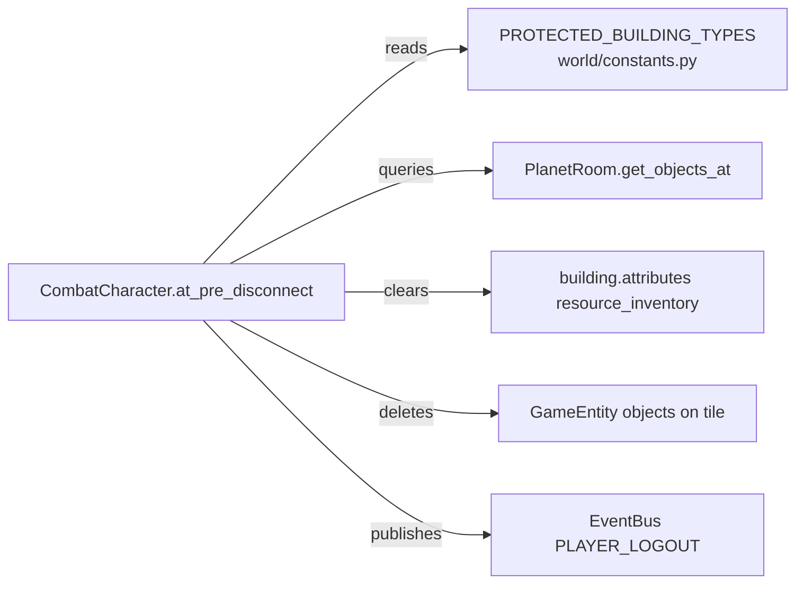

# Design Document: Quit Building Cleanup

## Overview

This feature extends the existing `CombatCharacter.at_pre_disconnect` cleanup logic to comprehensively destroy all unprotected building contents when a player disconnects. The current implementation only deletes `ResourceDrop` objects from non-Vault tiles using a hardcoded `"VT"` check. The new design:

1. Replaces the hardcoded `"VT"` skip with a configurable `PROTECTED_BUILDING_TYPES` set in `world/constants.py`.
2. Clears `resource_inventory` on Extractor buildings (`"EX"` type).
3. Deletes **all** objects at unprotected building tiles (not just `ResourceDrop`s), excluding the building itself.
4. Wraps per-building cleanup in individual try/except so one failure doesn't block the rest.

The cleanup runs synchronously inside `at_pre_disconnect`, before the `player_logout` event is published on the EventBus.

## Architecture

The change is localized to two files:



No new classes, modules, or database migrations are introduced. The existing `at_pre_disconnect` method is refactored in-place, and a single constant is added to `world/constants.py`.

## Components and Interfaces

### 1. `PROTECTED_BUILDING_TYPES` constant (`world/constants.py`)

```python
# Building types whose contents survive player disconnect.
# Add future storage building abbreviations here (e.g. "SB").
PROTECTED_BUILDING_TYPES: set[str] = {"VT"}
```

A `frozenset` or plain `set` of two-letter building type abbreviations. The cleanup loop checks membership with `btype in PROTECTED_BUILDING_TYPES`. No hardcoded building type strings appear anywhere in the cleanup logic.

### 2. Refactored `CombatCharacter.at_pre_disconnect` (`typeclasses/characters.py`)

The method is restructured into a clear per-building cleanup loop:

```python
def at_pre_disconnect(self, **kwargs):
    from world.constants import PROTECTED_BUILDING_TYPES

    try:
        buildings = self.get_buildings()
        for b in buildings:
            try:
                btype = _get_building_type(b)
                if btype in PROTECTED_BUILDING_TYPES:
                    continue

                # 1. Clear extractor resource_inventory
                if btype == "EX":
                    _clear_extractor_inventory(b)

                # 2. Delete all objects at building tile (except building)
                _delete_objects_at_building(b)
            except Exception:
                logger.debug("Cleanup error for building %s", 
                             getattr(b, "key", "?"), exc_info=True)
    except Exception:
        logger.debug("Failed cleanup on disconnect for %s",
                     getattr(self, "key", "?"), exc_info=True)

    # Always publish logout event
    try:
        from world.event_bus import event_bus, PLAYER_LOGOUT
        event_bus.publish(PLAYER_LOGOUT, player=self)
    except Exception:
        pass
```

### 3. Helper functions (private, in `characters.py`)

These are extracted for testability and clarity:

- **`_get_building_type(building) -> str | None`**: Reads `building_type` via `attributes.get` with `db` fallback. Mirrors the existing pattern.

- **`_clear_extractor_inventory(building) -> None`**: Resets `resource_inventory` to `{}` using `attributes.add` with `db` fallback. Follows the same accessor pattern as `ResourceSystem._set_extractor_inventory`.

- **`_delete_objects_at_building(building) -> None`**: Resolves `(coord_x, coord_y)` and `location` (PlanetRoom). Calls `room.get_objects_at(x, y)` **without** a `type_tag` filter to get all objects. Excludes the building itself from the result set, then calls `obj.delete()` on each remaining object. Falls back to iterating `room.contents` and matching coordinates if `get_objects_at` is unavailable.

### Interface contracts

| Function | Input | Output | Side effects |
|---|---|---|---|
| `_get_building_type(b)` | Building-like object | `str \| None` | None |
| `_clear_extractor_inventory(b)` | Building with `resource_inventory` | `None` | Sets `resource_inventory = {}` |
| `_delete_objects_at_building(b)` | Building with coords + location | `None` | Deletes objects from DB |

## Data Models

No new data models are introduced. Existing attributes used:

| Object | Attribute | Type | Access pattern |
|---|---|---|---|
| Building | `building_type` | `str` | `attributes.get` / `db` fallback |
| Building | `coord_x`, `coord_y` | `int` | `db.coord_x`, `db.coord_y` |
| Building | `owner` | `Character ref` | `attributes.get` |
| Building (EX) | `resource_inventory` | `dict[str, int]` | `attributes.add({})` / `db` fallback |
| GameEntity | `coord_x`, `coord_y` | `int` | `db.coord_x`, `db.coord_y` |
| PlanetRoom | coordinate index | internal | `get_objects_at(x, y)` |

The `PROTECTED_BUILDING_TYPES` constant is a module-level `set[str]` — no persistence needed.


## Correctness Properties

*A property is a characteristic or behavior that should hold true across all valid executions of a system — essentially, a formal statement about what the system should do. Properties serve as the bridge between human-readable specifications and machine-verifiable correctness guarantees.*

### Property 1: Protected building preservation

*For any* set of buildings owned by a player where some buildings have a `building_type` in `PROTECTED_BUILDING_TYPES`, after running disconnect cleanup, all objects at protected building coordinates SHALL remain present and any `resource_inventory` on protected buildings SHALL be unchanged.

**Validates: Requirements 1.2, 3.1, 3.2, 3.3**

### Property 2: Unprotected building tile cleanup

*For any* unprotected building (building_type not in `PROTECTED_BUILDING_TYPES`) with any set of objects at its `(coord_x, coord_y)` tile, after running disconnect cleanup, all objects at that tile except the building itself SHALL be deleted.

**Validates: Requirements 1.3, 5.1**

### Property 3: Extractor inventory cleared

*For any* unprotected Extractor building (building_type `"EX"`) with any `resource_inventory` dict, after running disconnect cleanup, the `resource_inventory` SHALL be an empty dictionary `{}`.

**Validates: Requirements 2.1**

### Property 4: Error isolation across buildings

*For any* ordered list of buildings where one building raises an exception during cleanup, all buildings processed after the failing building SHALL still have their cleanup applied (objects deleted, inventory cleared as applicable).

**Validates: Requirements 4.1**

### Property 5: Logout event always fires

*For any* disconnect cleanup execution — whether cleanup succeeds fully, partially fails, or fails entirely — the `PLAYER_LOGOUT` event SHALL be published on the EventBus.

**Validates: Requirements 4.2, 4.3**

## Error Handling

| Scope | Strategy | Behavior |
|---|---|---|
| Per-building cleanup | `try/except Exception` around each building in the loop | Log at `debug` level with `exc_info=True`, continue to next building |
| Outer cleanup (e.g. `get_buildings` fails) | `try/except Exception` around the entire building loop | Log at `debug` level, fall through to event publishing |
| Event publishing | `try/except Exception` around `event_bus.publish` | Silently swallow — disconnect must never be blocked |
| Missing coordinates / location | Guard with `if bx is None or by is None or room is None: continue` | Skip building, no log (this is normal for unplaced buildings) |
| Missing `resource_inventory` on Extractor | Guard with `attributes.get` returning `None` | Skip clearing, no error |
| Missing `get_objects_at` on room | Fallback to iterating `room.contents` and matching `coord_x`/`coord_y` | Functionally equivalent, slightly less efficient |

The key design principle: **never block disconnect**. Every layer has its own exception handler so the player can always log out cleanly.

## Testing Strategy

### Property-Based Tests (Hypothesis)

The project already uses Hypothesis with the Evennia stub pattern (see `test_prop_offline_protection.py`). Each property test will use lightweight fake objects (`FakeBuilding`, `FakePlanetRoom`, `FakeGameEntity`) that mirror the attribute access patterns of real Evennia objects.

**Library**: `hypothesis` (already in use)
**Minimum iterations**: 100 per property (`@settings(max_examples=100)`)

Each property test will be tagged with:
```
Feature: quit-building-cleanup, Property {N}: {property_text}
```

**Property test plan:**

| Property | Generator strategy | Assertion |
|---|---|---|
| 1: Protected building preservation | Random buildings (mix of protected/unprotected types), random objects at each tile, random resource_inventory dicts | Objects at protected tiles unchanged, inventory unchanged |
| 2: Unprotected building tile cleanup | Random unprotected buildings with random objects at tiles | All non-building objects deleted, building survives |
| 3: Extractor inventory cleared | Random Extractors with random `dict[str, int]` inventories | `resource_inventory == {}` after cleanup |
| 4: Error isolation | Random building lists with one injected failure at random position | Buildings after failure position are still cleaned |
| 5: Logout event always fires | Random cleanup scenarios (normal, per-building error, total failure) | Event published in all cases |

### Unit Tests

Focused example-based tests for:
- `PROTECTED_BUILDING_TYPES` constant equals `{"VT"}` (Req 6.2)
- Accessor pattern matches `ResourceSystem._set_extractor_inventory` (Req 2.2)
- Fallback path when room lacks `get_objects_at` (Req 5.3)
- Building with no coordinates is skipped without error (Req 1.4)
- Extractor with no `resource_inventory` attribute is skipped without error (Req 2.3)

### Edge Cases (covered by property generators)

- Empty building list (player owns no buildings)
- All buildings are protected (nothing to clean)
- Building at tile with zero objects
- Extractor with empty `resource_inventory` already
- Multiple objects of different types at same tile
- Building with `None` coordinates
