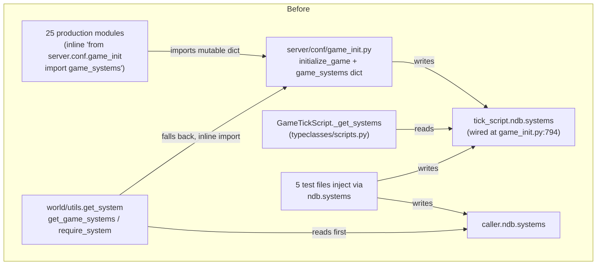
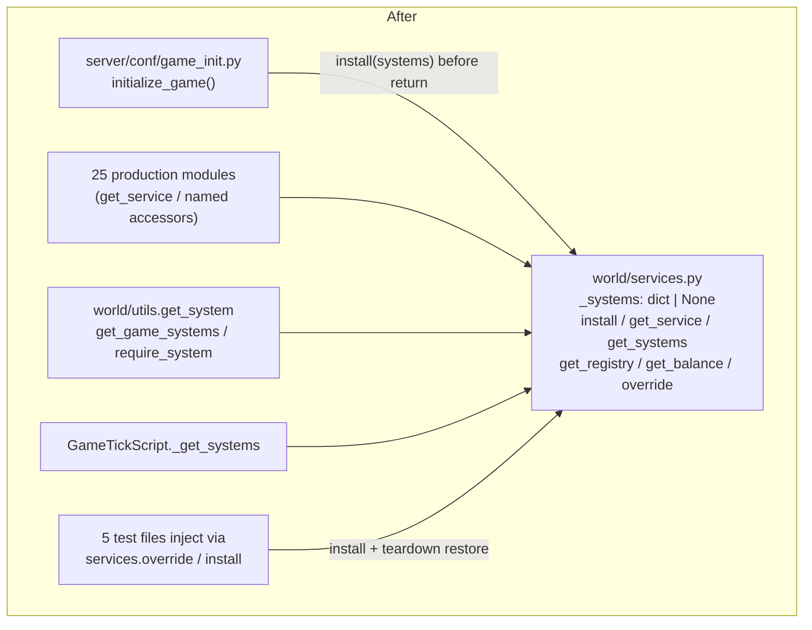

# Design Document

## Overview

This design covers stages 1–2 of the hardening program for the Evennia-based RTS/combat MUD in
`mygame/` (~44k lines): a comment hygiene sweep (Stage 1a), three small shared helpers
(Stage 1b), and a services facade replacing scattered `game_systems` imports and the
`ndb.systems` lookup path (Stage 2).

The overriding invariant is **zero player-visible behavior change**. Every stage ends with the
full test suite green (`python -m pytest mygame -q` from the repo root, currently 2783 passing,
1 skipped), and Stage 1b/2 must keep at least 2783 passing tests. The design therefore favors
mechanical, per-site-verifiable transformations over structural rewrites, and sequences the
work so that every intermediate commit is green.

Key design decisions, with rationale:

1. **Preserve messaging behavior per call site through helper parameters, not through a single
   canonical behavior.** The two existing player resolvers differ in scope *and* in
   miss-messaging; the shared helper parameterizes both axes so each converted site reproduces
   its previous messages exactly (Requirement 2.3).
2. **`coords_of` returns stored values without coercion; `get_coords` keeps its `int()`
   coercion in a thin delegating wrapper.** This preserves both existing contracts exactly
   rather than unifying them behind one coercion policy (Requirement 3.6, 3.9).
3. **The facade is a leaf module with no imports from `server.conf.game_init`.** The
   composition root pushes state *into* the facade (`services.install(systems)`); consumers
   pull state *out*. This inverts the current dependency direction and eliminates the circular
   import risk that motivated the inline function-level imports (Requirement 5.9).
4. **The `ndb.systems` path is retired last**, after all five injecting test files have been
   migrated to `services` injection, so no intermediate commit breaks tests (Requirement 7.2
   explicitly permits interim states that retain the `ndb.systems` read).
5. **Attribute convention (db-primary) is applied only to lines this spec touches**
   (Requirement 8.3/8.5); the one sanctioned survivor of the defensive `getattr` pattern is the
   `coords_of` implementation itself, which Requirement 3.7 explicitly carves out.

## Architecture

### System access: before

Today, system access has three competing paths: 25 inline imports of the mutable
`game_systems` dict from the init module, a per-character `ndb.systems` read inside
`world/utils.get_system`, and a per-script `ndb.systems`/`db.systems` read inside
`GameTickScript._get_systems` (wired by `game_init.py:794`). Tests inject through whichever
path the code under test happens to use.



Problems: the init module is imported from everywhere (circular-import hazard managed by
function-level imports), the dict is mutable shared state with no defined access point, and
tests must know which of three injection mechanisms the code under test uses.

### System access: after

`world/services.py` becomes the single owner of the installed systems mapping. The
composition root calls `install()`; everything else calls accessors. `services` imports
nothing from `game_init`, so every consumer can import it at module level.



The dependency arrow between `game_init` and its consumers reverses: previously consumers
imported `game_init`; now `game_init` imports `services` and pushes into it. `services` is a
dependency leaf (stdlib-only imports), so no import cycle is possible.

### Stage 1 architecture notes

Stage 1a touches no architecture — it is a text-only sweep with an AST-equivalence
verification gate (see Migration Strategy).

Stage 1b adds two functions to the existing `world/utils.py` (`resolve_player`, `coords_of`)
and routes three call sites through the existing `world/combat_timer.player_in_combat`. No new
modules, no new dependencies: `commands/*` already imports `world/utils` and
`world/combat_timer`.

## Components and Interfaces

### Component 1: Comment hygiene sweep (Stage 1a)

Not a code component — a bounded editing procedure over ~48 identified historical comments in
production code (found via patterns such as "pre-fix", "the reported bug", "TOCTOU",
"belt-and-braces", "the removed per-tile building attribute", "FIXED by", "saw coord_x=None
during create_object").

Decision procedure per comment (implements Requirements 1.2–1.4):

1. Does the comment describe a constraint that still restricts future changes?
   - **Yes** → rewrite as a present-tense Rationale_Comment preserving the constraint's
     meaning (e.g. "FIXED: we now publish X after Y to avoid the race" becomes "X must be
     published after Y; publishing before Y races with Z").
   - **No** (pure history: removed code, old bug narrative, fix chronology) → delete the
     comment; delete the whole line when the line is comment-only.
   - **Ambiguous** → rewrite as a Rationale_Comment rather than delete (fail-safe direction).
2. Escape hatch: if a comment's text is asserted by a test (some tests assert on docstring
   or help text content), leave it unchanged and record the exception. Exceptions are
   recorded in the Stage 1a commit message as a list of `file:line — reason` entries
   (Requirement 1.1).

Hard constraints:

- Zero changes to executable code (Requirement 1.6). Verified mechanically by the
  AST-equivalence check described in Migration Strategy.
- Docstring edits are allowed (docstrings are in scope for the sweep) but must not change any
  docstring that a test asserts on — the escape hatch covers these.
- Every pre-existing Rationale_Comment is retained with its constraint intact
  (Requirement 1.5); the sweep only touches comments matched as historical.

### Component 2: Player_Resolver (`world/utils.resolve_player`)

Consolidates two divergent implementations:

| | `command_router.py` `AdminSubcommandRouter.resolve_player` | `alliance_commands.py` `_resolve_player` |
|---|---|---|
| Scope | local (`caller.search(name)`) | global (`caller.search(name, global_search=True)`) |
| Empty-name guard | none — search runs on the empty string | messages "Specify a player by name.", returns None, no search |
| Miss messaging | Evennia's search self-messages, **then** the router adds "Could not find player '{name}'." | Evennia's search self-messages only; no extra message |
| Test-double guard | `hasattr(caller, "search")` — no search attr → None → router message | `hasattr(caller, "search")` — no search attr → None, no message |

The two sites differ on three axes (scope, empty-name handling, miss messaging), so the
shared helper parameterizes all three. Defaults are tuned to the router site so its eight
call sites need no keyword arguments:

```python
# world/utils.py

def resolve_player(
    caller: Any,
    name: str,
    *,
    global_search: bool = False,
    not_found_msg: str | None = "Could not find player '{name}'.",
    empty_name_msg: str | None = None,
) -> Any | None:
    """Resolve a player character by name, or msg the caller and return None.

    The single player-by-name resolution routine (Player_Resolver). Evennia's
    ``caller.search`` self-messages on miss/ambiguity; ``not_found_msg`` is an
    *additional* message this helper sends on a None result ("{name}" is
    formatted in), or None to rely on search's own messaging alone.
    ``empty_name_msg``, when set, short-circuits falsy names with that message
    and no search; when None, a falsy name is passed to search unchanged. The
    ``hasattr`` guard keeps the helper working under command test doubles that
    do not provide ``search``.
    """
    if not name and empty_name_msg is not None:
        caller.msg(empty_name_msg)
        return None
    if hasattr(caller, "search"):
        if global_search:
            target = caller.search(name, global_search=True)
        else:
            target = caller.search(name)
    else:
        target = None
    if target is None and not_found_msg is not None:
        caller.msg(not_found_msg.format(name=name))
    return target
```

Behavioral fidelity notes:

- The router path calls `caller.search(name)` with no extra kwargs — exactly the previous
  call shape — so Evennia's own miss/multimatch messaging is byte-identical, and the helper's
  additional "Could not find player '{name}'." reproduces the router's double-message
  behavior on a miss under real Evennia (Requirement 2.3).
- The alliance path passes `global_search=True` (previous call shape preserved),
  `not_found_msg=None` (search's own messaging only, as before), and
  `empty_name_msg="Specify a player by name."` (previous guard preserved).
- Multi-match: Evennia's search returns None and self-messages on ambiguity; both previous
  implementations relied on that, and the helper preserves it (the `not_found_msg` fires on
  the router path, matching its previous behavior where any None triggered the message).
- No exception is raised for unresolvable input; the failure indication is the None return
  (Requirement 2.6).

Call-site conversion (Requirements 2.2, 2.4, 2.8):

- **Delete** `AdminSubcommandRouter.resolve_player` in `commands/command_router.py`. Convert
  its eight call sites (all in `commands/admin_commands.py`, of the form
  `self.resolve_player(player_name)`) to `resolve_player(self.caller, player_name)` — helper
  defaults reproduce router behavior with zero per-site configuration.
- **Delete** `_resolve_player` in `commands/alliance_commands.py`. Convert its six call sites
  to the helper with the alliance keyword set, e.g.:

  ```python
  target = resolve_player(
      self.caller, args.strip(), global_search=True,
      not_found_msg=None, empty_name_msg="Specify a player by name.",
  )
  ```

- No thin delegate wrappers are kept: Requirement 2.4 demands zero resolution function
  definitions outside the Player_Resolver in these two files, verified by inspection. The
  kwargs repetition at the six alliance sites is accepted as the cost of strict compliance.

### Component 3: Coordinate_Accessor (`world/utils.coords_of`)

```python
# world/utils.py

def coords_of(entity: Any) -> tuple[int, int, str | None] | None:
    """Return *entity*'s overworld coordinates as ``(x, y, planet)``, or None.

    The single coordinate-read implementation (Coordinate_Accessor). Returns
    None when the entity has no ``db`` handler or when either ``coord_x`` or
    ``coord_y`` is absent/None — never raises. ``planet`` is the stored
    ``coord_planet`` value or None when unset. Values are returned as stored
    (no coercion); every write path int-coerces via ``place_on_tile``, so x/y
    are ints in practice. This function is the one sanctioned home of the
    defensive nested-getattr coordinate read; all other sites call it.
    """
    db = getattr(entity, "db", None)
    if db is None:
        return None
    cx = getattr(db, "coord_x", None)
    cy = getattr(db, "coord_y", None)
    if cx is None or cy is None:
        return None
    return (cx, cy, getattr(db, "coord_planet", None))
```

Design decisions:

- **No coercion in `coords_of`.** The ~80 raw `getattr` sites return stored values uncoerced;
  coercing in the accessor could change behavior at converted sites if a non-int value ever
  appeared. Returning stored values makes the conversion an exact substitution
  (Requirement 3.6). In practice values are always ints (all writes go through
  `place_on_tile`, which int-coerces).
- **`get_coords` becomes a delegating wrapper**, preserving its exact existing contract
  (`(int(x), int(y))` or None, no planet) so its existing callers are untouched
  (Requirement 3.9):

  ```python
  def get_coords(obj: Any) -> tuple[int, int] | None:
      """Extract (x, y) from an object. Delegates to coords_of."""
      coords = coords_of(obj)
      if coords is None:
          return None
      return (int(coords[0]), int(coords[1]))
  ```

- **Internal `getattr` use is sanctioned.** Requirement 3.7 exempts the Coordinate_Accessor's
  own implementation from the zero-occurrence check, and the defensive form is required for
  None-safety across test doubles whose `db` is a plain namespace (plain attribute access
  would raise `AttributeError` for unset attributes, unlike Evennia's AttributeHandler which
  returns None). The Attribute_Convention (Requirement 8) governs converted *call sites*,
  which after conversion contain no attribute reads at all — they call `coords_of`.

Call-site conversion (Requirements 3.4–3.7):

- In scope: all ~80 production sites reading `coord_x`/`coord_y` with a None default — 42
  direct `getattr(entity.db, "coord_x", None)`, 27 nested
  `getattr(getattr(entity, "db", None), "coord_x", None)`, ~11 variants.
- Conversion shapes:

  ```python
  # before
  cx = getattr(entity.db, "coord_x", None)
  cy = getattr(entity.db, "coord_y", None)
  if cx is None or cy is None:
      ...miss path...

  # after
  coords = coords_of(entity)
  if coords is None:
      ...miss path...
  else:
      cx, cy, _planet = coords
  ```

  Sites that also read `coord_planet` with a None default bind the third element instead of
  discarding it. Sites that only need presence checks use `coords_of(entity) is None`.
- Out of scope, left byte-identical: sites with non-None defaults
  (`getattr(entity.db, "coord_x", 0)`, `"?"` display defaults) — Requirement 3.5.
- Sites that read only one coordinate with a None default (if any exist among the variants)
  convert to `coords_of` only where the site's semantics are "both-or-nothing"; a site that
  genuinely treats `coord_x` independently of `coord_y` keeps its read but is converted to
  the `entity.db.coord_x` form per the Attribute_Convention when its line is touched. The
  implementation task must flag any such site for explicit review rather than silently
  changing its miss condition.

### Component 4: Single in-combat check (routing through `player_in_combat`)

No new code. The existing `world/combat_timer.player_in_combat(char)` is already the
authoritative check: returns False for missing `db`/expiry ≤ 0, compares
`expiry > current_tick` otherwise, and **fails closed** (returns True for positive expiry)
when the tick lookup raises (Requirement 4.6 is already implemented).

Converted read sites (Requirement 4.1, 4.2):

| Site | Current form | Conversion |
|---|---|---|
| `commands/game_commands.py:438` (wall gate) | `expiry > 0` | `player_in_combat(caller)` |
| `commands/game_commands.py:573` (move lag) | tick compare | `player_in_combat(caller)` |
| `commands/game_commands.py:4604` (`CmdRecall`) | re-implemented tick compare | `player_in_combat(caller)`; keep the existing recall-blocked-during-combat message |

Semantic note on the `> 0` wall-gate site (438): the previous form treats a positive-but-
expired timer (0 < expiry ≤ current tick) as in-combat during the window before the tick
script resets it; `player_in_combat` reports not-in-combat there. Requirement 4.3 constrains
only the enumerated states (0/unset/None → not-in-combat; expiry > tick → in-combat) and
Requirement 4.1 explicitly includes the greater-than-zero form in the conversion, so this
one-tick-window alignment to the authoritative definition is sanctioned. It is not
player-visible in practice: the tick script clears expired timers every tick.

Explicitly unchanged (Requirements 4.4, 4.5):

- All writes to `db.combat_timer_expires` (deploy-time reset in
  `commands/lifecycle_commands.py`, per-tick expiry reset in `decrement_combat_timers` at
  `typeclasses/scripts.py:567` — Requirement 4.4; its `tick_number >= expires` reset logic
  triggers on the negation of in-combat and cannot be expressed via `player_in_combat`).
- Non-boolean reads: the status display computing remaining combat time from the raw expiry
  (`commands/game_commands.py:2737` — Requirement 4.5; the boolean check cannot render the
  "Combat: Ns" countdown).

### Component 5: Services_Facade (`world/services.py`)

New module, stdlib-only imports, zero imports from `server.conf.game_init`
(Requirement 5.9):

```python
"""Facade over the installed game systems.

The single access point for game systems. The composition root
(server/conf/game_init.py initialize_game) constructs the systems and calls
install(); everything else reads through the accessors. This module imports
nothing from server.conf — the dependency points from the composition root
into this module, never back.
"""

from __future__ import annotations

from contextlib import contextmanager
from typing import Any, Iterator

_systems: dict[str, Any] | None = None


def install(systems: dict[str, Any]) -> None:
    """Store *systems* as the installed mapping, replacing any previous one.

    Stores the dict by reference (not a copy), matching the previous
    shared-``game_systems``-dict semantics: mutations made by the owner after
    install are visible through the accessors.
    """
    global _systems
    _systems = systems


def get_service(name: str) -> Any | None:
    """Return the installed system named *name*, or None (also pre-install)."""
    if _systems is None:
        return None
    return _systems.get(name)


def get_systems() -> dict[str, Any]:
    """Return the installed systems dict, or an empty dict pre-install."""
    return _systems if _systems is not None else {}


def get_registry() -> Any | None:
    """Return the installed registry system, or None."""
    return get_service("registry")


def get_balance() -> Any | None:
    """Return the balance configuration on the installed registry, or None."""
    registry = get_registry()
    return getattr(registry, "balance", None)


@contextmanager
def override(systems: dict[str, Any]) -> Iterator[None]:
    """Temporarily install *systems*; restore the prior state on exit.

    Test injection helper: snapshots the current installed state (including
    the not-installed None state) and restores it on exit, so no injected
    system leaks into subsequently executed tests.
    """
    global _systems
    previous = _systems
    _systems = systems
    try:
        yield
    finally:
        _systems = previous
```

Design decisions:

- `_systems` distinguishes "never installed" (None) from "installed empty dict" ({}), so
  pre-install accessor behavior (return None / empty dict) is well-defined
  (Requirements 5.6, 5.8, 7.7).
- `get_balance` uses `getattr(..., None)` on the registry object — this is a plain Python
  attribute on a system object, not an Evennia persistent attribute, so the
  Attribute_Convention (which governs `obj.db` reads) does not apply.
- `override` lives in `services.py` itself rather than a conftest so both pytest-style and
  unittest-style tests can use it, and so the snapshot/restore logic sits next to the state
  it manages (Requirement 7.9).

### Component 6: Composition root wiring (`server/conf/game_init.py`)

Two changes inside `initialize_game()`:

1. After the systems dict is fully populated and before the function returns:

   ```python
   from world import services
   services.install(systems)
   ```

   (Requirement 5.5.) The module-level `game_systems` dict inside `game_init` remains as-is —
   it is internal to the composition root after the migration, and removing it is out of
   scope for this spec's zero-behavior-change goal.

2. Delete line 794, `tick_script.ndb.systems = systems` (Requirement 7.3). Performed in the
   same migration step as the `GameTickScript._get_systems` rewrite (see Migration Strategy)
   so no intermediate commit leaves the tick script without a systems source.

### Component 7: System lookup helpers rewire (`world/utils.py`)

```python
from world import services  # module-level; services is a dependency leaf


def get_system(caller: Any, system_name: str) -> Any | None:
    """Look up a game system by name via the services facade.

    *caller* is unused and retained for signature compatibility with the
    existing call sites (the previous implementation read caller.ndb.systems).
    """
    return services.get_service(system_name)


def get_game_systems() -> dict:
    """Return the installed systems dict (empty dict before install)."""
    return services.get_systems()
```

- `get_system` keeps its two-argument signature so no call site changes (Requirement 7.2);
  the `ndb.systems` read and the inline `game_init` import both disappear.
- `require_system` is **unchanged** — it already delegates to `get_system` and owns the
  "{label} unavailable." message with the default-label derivation
  (`name.replace("_", " ").capitalize()`), satisfying Requirement 7.5 with zero edits.
- The module-level `from world import services` is safe: `services` imports only stdlib, so
  no cycle with `world/utils` is possible.

### Component 8: Tick script rewire (`typeclasses/scripts.py`)

```python
def _get_systems(self):
    """Retrieve the installed game systems from the services facade.

    Returns:
        dict of system name -> system instance, or None if not installed.
    """
    from world.services import get_systems
    systems = get_systems()
    return systems or None
```

The `or None` preserves the method's existing contract exactly (callers check for a falsy
result to skip the tick body): previously it returned None when neither `ndb.systems` nor
the dead `db.systems` fallback was set; now it returns None when the facade is empty or not
installed (Requirement 7.8). The dead `db.systems` fallback disappears with the rewrite.

### Component 9: Migration of the 25 inline `game_systems` imports

Mechanical per-site transformation (Requirements 6.1–6.4):

```python
# before (typical site)
try:
    from server.conf.game_init import game_systems
    system = game_systems.get("agent_system")
except (ImportError, AttributeError):
    system = None

# after
from world.services import get_service   # module-level import
system = get_service("agent_system")
```

- The facade returns None both pre-install and for absent keys, which is exactly the value
  the previous `except` fallback and the previous `dict.get` miss produced — so each site's
  existing None-handling covers both cases unchanged (Requirement 6.4).
- Imports move to module level (`from world.services import get_service` or
  `from world import services`): the function-level import pattern existed only to dodge the
  `game_init` circular-import hazard, which the facade eliminates. Where a site prefers a
  named accessor (`get_registry`, `get_balance`), it uses that instead of
  `get_service("registry")` (Requirement 6.2).
- Sites that fetched the whole dict migrate to `services.get_systems()`.

### Component 10: Test injection migration (5 files)

The five files that inject via `ndb.systems` — `commands/tests/test_travel_commands.py`,
`commands/tests/test_game_commands.py`, `commands/tests/test_admin_routers.py`,
`tests/test_live_boot_smoke.py`, `world/systems/tests/test_combat_engine.py` — migrate to
facade injection with guaranteed teardown restore (Requirements 7.4, 7.9).

Standard patterns, chosen per test style:

```python
# unittest-style TestCase (the dominant style in these files)
def setUp(self):
    self._services_cm = services.override({"agent_system": self.fake_agents, ...})
    self._services_cm.__enter__()
    self.addCleanup(self._services_cm.__exit__, None, None, None)

# pytest-style
@pytest.fixture
def installed_systems():
    with services.override({...}) as _:
        yield
```

- `addCleanup` (rather than `tearDown`) guarantees restore even when `setUp` partially fails
  after the install.
- Fake system objects and `_NDB`/caller test doubles keep their shapes; only the injection
  mechanism changes. Callers' `ndb` attributes may keep existing unrelated state; the
  `.systems` injection specifically moves to the facade.
- `tests/test_live_boot_smoke.py` exercises `initialize_game()`, which now calls
  `services.install()` itself; that test wraps its run in `services.override({})` (or
  equivalent snapshot/restore) so the boot's install does not leak past the test.

## Data Models

No persistent data model changes. The relevant in-memory shapes:

- **Installed systems mapping** — `dict[str, Any]`, keyed by system name (e.g. `"registry"`,
  `"agent_system"`); values are live system instances. Owned by
  `world/services._systems: dict[str, Any] | None`, where None means "install() has never
  run". Stored by reference; the composition root remains free to populate it before install.
- **Coordinate triple** — `tuple[int, int, str | None] | None` from `coords_of`: `(x, y,
  planet)` with `planet` None when `coord_planet` is unset; None when either coordinate is
  absent/None or the entity has no `db` handler. The legacy `tuple[int, int] | None` shape of
  `get_coords` is retained by its wrapper.
- **Resolver result** — the resolved player object, or None as the failure indication
  (messaging side effects per the parameter set described in Component 2).
- **Persistent attributes read (unchanged shapes)** — `db.coord_x`/`db.coord_y` (int),
  `db.coord_planet` (str or unset), `db.combat_timer_expires` (int tick, 0/unset when not in
  combat). This spec changes how they are read, never what is stored.

## Migration Strategy

Each numbered step below ends with the full suite green (`python -m pytest mygame -q`, zero
failures, zero errors; ≥2783 passing from Stage 1b on). A stage does not begin until the
previous stage's suite is green (Requirement 9.4). Every modified line stays ≤100 chars per
`.flake8` (Requirement 9.7).

### Stage 1a — comment sweep

1. Sweep the ~48 identified comments per the Component 1 decision procedure; record
   escape-hatch exceptions in the commit message.
2. **Verification gates:**
   - Full suite green (Requirement 1.7).
   - AST-equivalence check (Requirement 1.6): for every touched file, parse the before and
     after sources, replace every docstring node (first string-expression statement of each
     `Module`/`ClassDef`/`FunctionDef`/`AsyncFunctionDef` body) with a fixed placeholder,
     then assert `ast.dump(before) == ast.dump(after)`. Comments never appear in the AST and
     docstrings are normalized away, so any surviving difference is an executable-code
     change. Implemented as a small throwaway script run against `git stash` /
     `git show HEAD:...` copies of the touched files; not committed.
   - Grep gate: the historical-comment search patterns return zero hits outside recorded
     exceptions.

### Stage 1b — helpers (three independent sub-steps, each suite-verified)

1. **Player_Resolver**: add `resolve_player` to `world/utils.py` with its unit tests
   (four input classes × both parameter profiles, Requirement 2.7); convert the eight
   `admin_commands.py` sites and delete the router method; convert the six
   `alliance_commands.py` sites and delete `_resolve_player`. Gate: suite green + inspection
   of both files shows zero local resolver definitions (Requirement 2.4).
2. **Coordinate_Accessor**: add `coords_of` + tests; re-point `get_coords` to delegate;
   convert the ~80 None-default sites file by file. Gate: suite green + grep shows zero
   `getattr(...db, "coord_x", None)` / nested-form occurrences outside `coords_of`
   (Requirement 3.7); non-None-default sites byte-identical (Requirement 3.5).
3. **Combat check**: convert the three listed read sites to `player_in_combat`. Gate: suite
   green + grep shows no `combat_timer_expires`-vs-tick comparison outside
   `world/combat_timer.py` (Requirement 4.7); write sites and display reads byte-identical.

### Stage 2 — services facade (ordered so every intermediate commit is green)

1. **Add the facade**: create `world/services.py` + its unit/property tests. Nothing imports
   it yet; zero behavior change.
2. **Wire the composition root**: `services.install(systems)` at the end of
   `initialize_game()`. The `ndb.systems` wiring at line 794 stays for now (dual path;
   Requirement 7.2 interim state).
3. **Migrate the 25 inline imports** to facade accessors (Component 9). Safe ordering note:
   these sites bypass `get_system`, so the still-live `ndb.systems` test injection path is
   unaffected; unit-test contexts where nothing was installed previously read an
   empty/absent `game_systems` dict (→ None) and now read a pre-install facade (→ None) —
   same observable result.
4. **Migrate the five injecting test files** to `services.override`/`install` with
   `addCleanup` restore (Component 10). The production `ndb.systems` read in `get_system`
   still exists but is now exercised by nothing.
5. **Retire the ndb path**: rewire `get_system`/`get_game_systems` (Component 7), rewrite
   `GameTickScript._get_systems` (Component 8), and delete `game_init.py:794` — one step, so
   the tick script's source of systems switches atomically.
6. **Final gates**: full suite ≥2783 passing; grep gates — zero
   `from server.conf.game_init import game_systems` outside `server/conf/game_init.py`
   (Requirement 6.1), zero `ndb.systems` reads/writes for system lookup (Requirements 7.2,
   7.3), `world/services.py` contains zero `server.conf` imports (Requirement 5.9).

### Attribute convention enforcement (cross-cutting)

Applied only to lines whose executable code this spec modifies (Requirements 8.1–8.5): a
touched read with a static key and None/no default becomes `obj.db.x`; a touched read with a
non-None default or dynamic key becomes `obj.attributes.get(...)` with the default/key
explicit. Comment-only line edits (Stage 1a) never change access forms. The `coords_of`
implementation is the sanctioned exception (see Component 3). Review of each conversion
confirms present/absent-value equivalence (Requirement 8.6) — for `obj.db.x` vs
`getattr(obj.db, "x", None)` these are equivalent on Evennia's AttributeHandler, which
returns None for missing attributes.

## Correctness Properties

*A property is a characteristic or behavior that should hold true across all valid executions
of a system — essentially, a formal statement about what the system should do. Properties
serve as the bridge between human-readable specifications and machine-verifiable correctness
guarantees.*

The properties below cover the new/changed pure logic (the helpers and the facade). The
refactoring's site conversions themselves are verified by the existing 2783-test suite plus
the grep/AST gates in the Migration Strategy, not by new properties.

### Property 1: Resolver totality — unresolvable input never raises

*For any* name string (including empty, whitespace-only, and arbitrary unicode), any
`global_search` value, and any `not_found_msg`/`empty_name_msg` combination, calling
`resolve_player` with a caller whose `search` returns None — or with a caller that has no
`search` attribute — returns None without raising, and sends exactly the messages its
parameter contract specifies (`empty_name_msg` alone for falsy names when set; otherwise
`not_found_msg` formatted with the name when set).

**Validates: Requirements 2.6**

### Property 2: coords_of correctness and None-safety across arbitrary entity shapes

*For any* entity shape — no `db` attribute, `db` set to None, or a `db` namespace holding any
subset of `coord_x`, `coord_y`, `coord_planet` with values drawn from ints and None —
`coords_of(entity)` never raises, returns `(x, y, planet)` exactly when both `coord_x` and
`coord_y` are present and non-None (with `planet` the stored `coord_planet` value or None
when unset), and returns None in every other case.

**Validates: Requirements 3.2, 3.3**

### Property 3: get_coords is the (x, y) projection of coords_of

*For any* entity shape drawn from the Property 2 generator, `get_coords(entity)` equals
`(int(x), int(y))` when `coords_of(entity)` is `(x, y, planet)`, and equals None exactly when
`coords_of(entity)` is None.

**Validates: Requirements 3.9**

### Property 4: player_in_combat is equivalent to the reference comparison, failing closed

*For any* `db.combat_timer_expires` value drawn from {unset, None, 0, negative ints, positive
ints} and any current-tick value, `player_in_combat(char)` returns exactly
`expiry_or_zero > 0 and expiry > current_tick`; and in the generator mode where the tick
lookup raises, it returns exactly `expiry_or_zero > 0` (fail closed). A char with no `db`
returns False in all modes.

**Validates: Requirements 4.3, 4.6**

### Property 5: Facade install/get round-trip with replacement

*For any* sequence of dicts installed in order and ending with dict `d`, and any probe key
(drawn from `d`'s keys, earlier dicts' keys, and fresh keys): `get_service(key)` returns the
identical object `d[key]` when `key in d` and None otherwise (so keys unique to earlier
installs return None, proving replacement), and `get_systems()` / `get_game_systems()` return
`d` itself; before any install, `get_service` returns None and `get_game_systems()` returns
an empty dict.

**Validates: Requirements 5.2, 5.3, 5.6, 7.7**

### Property 6: get_system agrees with get_service and ignores ndb.systems

*For any* installed mapping, any probe name (present or absent), and any caller double —
including callers whose `ndb.systems` holds decoy systems under the same names —
`get_system(caller, name)` returns the identical object that `get_service(name)` returns,
and never returns a decoy from `ndb.systems`.

**Validates: Requirements 7.1, 7.2**

### Property 7: require_system failure message format

*For any* system name (composed of letters and underscores) with no installed system, and
any optional label, `require_system(caller, name, label)` returns None and sends the caller
exactly one message equal to `f"{label} unavailable."` when a label is given, and
`f"{name.replace('_', ' ').capitalize()} unavailable."` when the label is omitted.

**Validates: Requirements 7.5**

### Property 8: override restore round-trip

*For any* prior facade state (never-installed, or an arbitrary installed dict) and any
injected dict, entering and exiting `services.override(injected)` — whether the body
completes normally or raises — leaves the facade state identical (same object, including the
never-installed state) to the prior state, while inside the body `get_service` reflects the
injected dict.

**Validates: Requirements 7.9**

## Error Handling

- **`resolve_player`** never raises for unresolvable input: the failure indication is a None
  return, with messaging governed by its parameters (Component 2). Exceptions raised *by*
  Evennia's `search` itself (not expected in practice) propagate unchanged — the previous
  implementations did not catch them either, and swallowing them would hide real faults.
- **`coords_of`** is total over arbitrary entity shapes: missing `db`, plain-namespace test
  doubles, and absent/None coordinates all return None rather than raising (Property 2). It
  performs no coercion, so no ValueError path exists.
- **`player_in_combat`** (existing, unchanged) fails closed: if the current tick cannot be
  read, any positive expiry reports in-combat, so converted gates block rather than allow
  (Requirement 4.6).
- **Facade accessors** never raise for missing state: pre-install and absent-key reads return
  None (`get_service`, `get_registry`, `get_balance`) or an empty dict (`get_systems`).
  Migrated sites keep their existing None-handling (the "unavailable" message paths), which
  previously covered `ImportError`/`AttributeError`/key-miss and now covers the facade's None
  (Requirement 6.4). `install` performs no validation — the composition root owns the dict's
  correctness, matching the previous trust model for the module-level dict.
- **`require_system`** (existing, unchanged) remains the user-facing error boundary for
  command handlers: messages "{label} unavailable." and returns None, and callers return
  early (Requirement 7.5).
- **Stage 1a** has no runtime error surface; its failure mode is a bad edit, caught by the
  AST-equivalence gate and the suite.

## Testing Strategy

### Property-based tests

The project already uses Hypothesis (a `.hypothesis` store exists at the repo root), so the
eight correctness properties are implemented with **Hypothesis**, one property-based test per
property, colocated with the unit tests for each component
(`mygame/world/tests/` for utils/services/combat_timer properties).

- Minimum **100 iterations** per property test (`@settings(max_examples=100)` or higher).
- Each test is tagged with a comment referencing its design property, in the format:
  `# Feature: refactor-foundations, Property N: <property title>`.
- Generators use plain-Python test doubles (namespace `db` objects, recording callers,
  sentinel system objects) — no Evennia server or database needed, so 100+ iterations are
  cheap. Facade properties snapshot/restore `services` state around each example (using
  `services.override` itself for Properties 5–7, which also dogfoods Property 8's subject).
- The `player_in_combat` property patches the tick source (`_get_current_tick`) with both a
  returning and a raising mode.

### Example-based unit tests

Focused examples where behavior is per-scenario rather than universal:

- **Resolver input classes** (Requirement 2.3, 2.7, 2.8): fake caller with scripted `search`
  and recorded `msg`; the four input classes (one match, no match, multi-match via
  search-returns-None, empty name) under both parameter profiles (router defaults, alliance
  kwargs); scope-forwarding assertions on recorded `search` kwargs.
- **Facade named accessors** (Requirements 5.4, 5.7, 5.8): `get_registry` present/absent;
  `get_balance` with a registry carrying `balance`, a registry without it, and no registry.
- **`GameTickScript._get_systems` contract** (Requirement 7.8): returns the installed dict
  when non-empty, None when empty or not installed.
- **`CmdRecall` combat gate** (Requirement 4.2): in-combat rejects with the blocked-during-
  combat message; not-in-combat proceeds. (Existing tests cover this; they are extended only
  if coverage is missing.)

### Integration / smoke verification

- **Full suite as the behavior-preservation oracle**: `python -m pytest mygame -q` after
  every migration step; stage gates require zero failures/errors and (Stages 1b/2) ≥2783
  passing (Requirements 1.7, 2.5, 3.8, 4.8, 6.6, 7.6, 9.1–9.4). No pre-existing test is
  deleted, skipped, or weakened; only the five injection-mechanism migrations touch existing
  tests (Requirement 9.6).
- **Boot smoke** (Requirement 5.5): the existing `tests/test_live_boot_smoke.py` (migrated to
  facade injection) verifies `initialize_game()` installs the systems into the facade.
- **Mechanical gates** (per Migration Strategy): Stage 1a AST-equivalence check; grep gates
  for historical-comment patterns, raw coordinate-read patterns, tick-comparison patterns,
  inline `game_systems` imports, and `ndb.systems` usage; `flake8` for the 100-char limit
  (Requirement 9.7).

### What is deliberately not property-tested

Site-conversion parity (Requirements 3.6, 6.3, 6.4) and the comment sweep are verified by
the existing suite plus the mechanical gates — writing new universal properties over
converted call sites would duplicate the suite's per-command assertions without adding input
coverage, since the conversions are exact substitutions of already-tested code paths.
