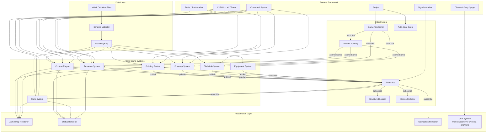
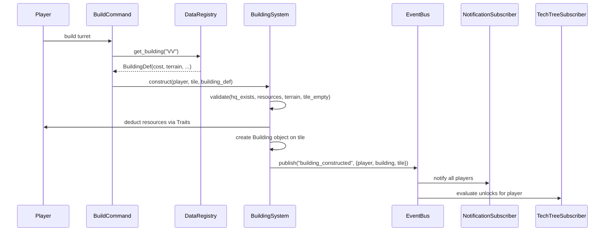
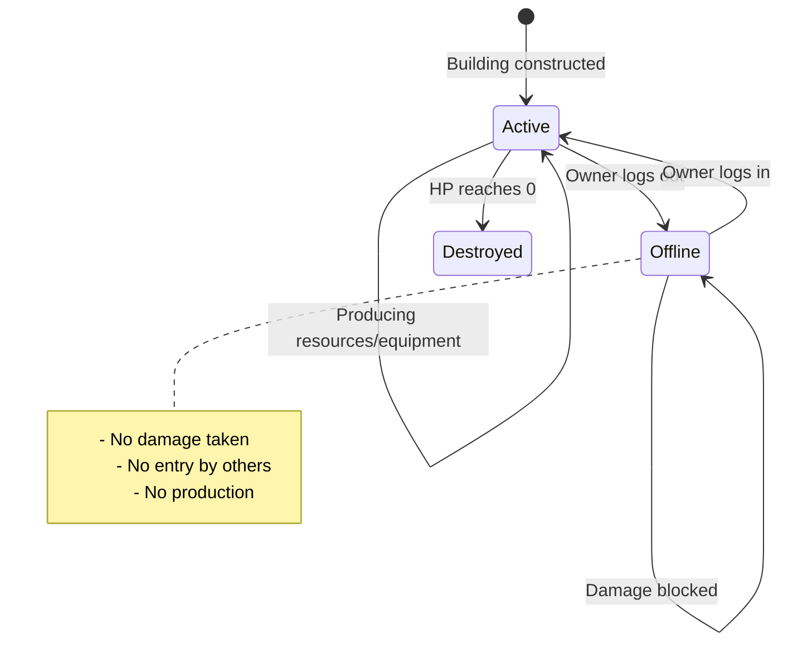
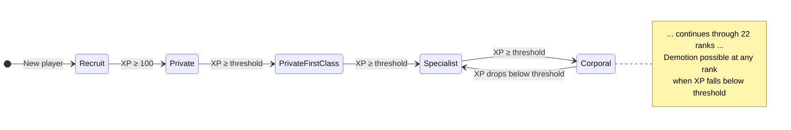

# Design Document: RTS Combat Overworld

## Overview

This design describes an RTS-inspired combat overworld game built on the Evennia MU* framework. Players explore coordinate-based maps across multiple planet types, gather terrain-specific resources, construct buildings following a technology tree, engage in real-time PvP combat, and progress through a 22-tier military rank system. The system is data-driven: all entity definitions live in YAML files loaded by a centralized Data Registry with schema validation and hot-reload support. All equippable items (weapons, armor, gadgets, consumables) use a single `GameItem` typeclass differentiated entirely by YAML-defined slot types and stat modifiers, managed by an `EquipmentHandler` on each character.

The architecture leverages four key Evennia subsystems:

- **XYZGrid** (`evennia.contrib.grid.xyzgrid`) — Each planet is a named Z-layer in the XYZGrid. Tiles are `XYZRoom` instances with terrain tags. The grid handles coordinate-based room lookup and exit generation.
- **Traits** (`evennia.contrib.rpg.traits`) — Player stats (HP as `GaugeTrait`, Combat_XP and resources as `CounterTrait`, Rank as `StaticTrait`) are stored on the Character typeclass via `TraitHandler`.
- **Scripts** (`evennia.scripts.scripts.DefaultScript`) — The game tick loop is a persistent `DefaultScript` with `interval` and `at_repeat()`. It survives server reloads via Evennia's built-in Script persistence.
- **Signals** (`evennia.contrib.base_systems.components.signals.SignalsHandler`) — The event bus wraps `SignalsHandler` as a global singleton. Game systems publish named events; subscribers (notifications, XP awards, offline protection) react without coupling.

Additionally, the game delegates to Evennia's built-in systems wherever possible:

- **Channels** (`evennia.comms`) — Global chat uses an Evennia Channel ("Global") with custom rank formatting. No custom broadcast infrastructure.
- **Communication commands** — Local `say` and private `page` commands are Evennia built-ins. Only message formatting is overridden to include player rank.
- **Admin commands** — Teleport (`@tel`), kick (`@boot`), inspect (`@examine`), permissions (`@perm`), and banning (`@ban`) use Evennia's built-in commands. Only game-specific commands (`@reloaddata`, `@giveresource`) are custom.
- **Permissions** — Access control uses Evennia's permission hierarchy (Player → Helper → Builder → Admin → Developer) and `perm()` lock function. No custom trust level system.

### Design Principles

1. **Data-driven**: No hardcoded entity constants. All buildings, items, ranks, technologies, powerups, terrain, and balance values come from YAML definition files. New item categories require only a new slot value and stat keys in YAML — no code changes.
2. **Presentation-agnostic**: Game logic exposes structured state; rendering (ASCII map, status displays) is a separate layer consuming that state.
3. **Event-driven**: Systems communicate via the event bus. Adding new reactions to game events means subscribing, not modifying publishers.
4. **Chunked processing**: Only active world regions are processed each tick, keeping large maps performant.

## Architecture

### High-Level System Diagram



### Request Flow (Example: Build Command)




## Components and Interfaces

### 1. Data Registry (`world/data_registry.py`)

The centralized runtime store for all loaded definitions and configuration. Implemented as a module-level singleton initialized at server startup.

```python
class DataRegistry:
    """Centralized registry holding all game definitions loaded from YAML."""

    buildings: dict[str, BuildingDef]       # keyed by abbreviation ("HQ", "MM", ...)
    items: dict[str, ItemDef]               # keyed by item key (all item types)
    item_production_map: dict[str, list[str]]  # building abbr -> list of item keys
    ranks: list[RankDef]                    # ordered by level ascending
    technologies: dict[str, TechnologyDef]  # keyed by tech key
    powerups: dict[str, PowerupDef]         # keyed by powerup key
    terrain: dict[str, TerrainDef]          # keyed by terrain type string
    planets: dict[str, PlanetDef]           # keyed by planet name
    balance: BalanceConfig                  # game balance values

    def load_all(self, base_path: str = "data") -> None: ...
    def reload_all(self) -> tuple[bool, list[str]]: ...
    def get_building(self, abbr: str) -> BuildingDef: ...
    def get_item(self, key: str) -> ItemDef: ...
    def get_items_for_slot(self, slot: str) -> list[ItemDef]: ...
    def get_items_for_building(self, building_abbr: str) -> list[ItemDef]: ...
    def get_rank_for_xp(self, xp: int) -> RankDef: ...
    def get_rank_by_name(self, name: str) -> RankDef: ...
    def get_technologies_for_rank(self, rank_level: int) -> list[TechnologyDef]: ...
    def get_powerups_for_rank(self, rank_level: int) -> list[PowerupDef]: ...
    def get_terrain(self, terrain_type: str) -> TerrainDef: ...
    def get_planet(self, name: str) -> PlanetDef: ...
```

**Validation flow**: `load_all()` reads each YAML file, passes it through `SchemaValidator`, then populates the registry. Cross-references (e.g., building `required_terrain` → terrain definitions, item `required_rank` → rank names, production_map building abbreviations → building definitions) are validated after all files are loaded. If any required file is missing or fails validation, startup is aborted with descriptive errors. The balance config file is optional — missing means hardcoded defaults with a logged warning.

**Hot-reload**: `reload_all()` re-reads and re-validates all files into a temporary registry. On success, it atomically swaps the contents. On failure, the current data is preserved and errors are returned to the caller. The Data Registry also hooks into Evennia's `at_server_reload()` to automatically re-validate definitions when the server is soft-restarted via `@reload`.

### 2. Schema Validator (`world/schema_validator.py`)

Validates raw YAML dicts against expected schemas before they enter the registry.

```python
class SchemaValidator:
    """Validates definition file contents against expected schemas."""

    def validate_buildings(self, data: list[dict]) -> list[str]: ...
    def validate_items(self, data: dict) -> list[str]: ...
    def validate_ranks(self, data: list[dict]) -> list[str]: ...
    def validate_technologies(self, data: list[dict]) -> list[str]: ...
    def validate_powerups(self, data: list[dict]) -> list[str]: ...
    def validate_terrain(self, data: dict) -> list[str]: ...
    def validate_balance(self, data: dict) -> list[str]: ...
    def cross_validate(self, registry: DataRegistry) -> list[str]: ...
```

Each method returns a list of error strings (empty = valid). `cross_validate()` checks inter-file references after all files are loaded.

### 3. Event Bus (`world/event_bus.py`)

A global publish-subscribe system wrapping Evennia's `SignalsHandler`.

```python
class EventBus:
    """Global event bus for decoupled system communication."""

    _handler: SignalsHandler

    def publish(self, event_name: str, **kwargs) -> None: ...
    def subscribe(self, event_name: str, callback: Callable) -> None: ...
    def unsubscribe(self, event_name: str, callback: Callable) -> None: ...
```

**Published events** (Requirement 28):
| Event Name | Payload Keys |
|---|---|
| `player_login` | `player` |
| `player_logout` | `player` |
| `player_moved` | `player, from_tile, to_tile` |
| `player_eliminated` | `attacker, victim` |
| `building_constructed` | `player, building, tile` |
| `building_destroyed` | `attacker, building, tile` |
| `building_upgraded` | `player, building, old_level, new_level` |
| `rank_promoted` | `player, old_rank, new_rank` |
| `rank_demoted` | `player, old_rank, new_rank` |
| `combat_action` | `attacker, target, item, damage` |
| `powerup_activated` | `player, powerup` |
| `powerup_expired` | `player, powerup` |
| `technology_researched` | `player, technology` |
| `resource_gathered` | `player, resource_type, amount, tile` |
| `tick_completed` | `tick_number, duration_ms` |

### 4. Overworld Tile (`typeclasses/rooms.py` — `OverworldRoom`)

Extends `XYZRoom` to represent a single tile on the overworld.

```python
class OverworldRoom(XYZRoom):
    """A single tile on the overworld map."""

    @property
    def terrain_type(self) -> str: ...          # read from Tag
    @property
    def resource_node(self) -> ResourceNode | None: ...
    @property
    def building(self) -> Building | None: ...
    @property
    def planet_name(self) -> str: ...           # Z-coordinate = planet name

    def get_display_symbol(self, looker) -> str: ...  # 2-char symbol with priority
    def at_object_receive(self, moved_obj, source_location, **kwargs): ...
    def get_structured_state(self) -> dict: ... # presentation-agnostic state
```

**Terrain** is stored as an Evennia `Tag` with category `"terrain"` on the room. The Z-coordinate of the XYZGrid encodes the planet name (e.g., `"earth_1"`, `"industrial_1"`).

**Display priority** (Requirement 1.8): `@@` (self) > `**` (other player) > building abbreviation > terrain symbol.

### 5. Player Character (`typeclasses/characters.py` — `CombatCharacter`)

Extends Evennia's `DefaultCharacter` with Traits for all game stats.

```python
class CombatCharacter(DefaultCharacter):
    """Player character with combat stats, resources, rank, and inventory."""

    # Traits (initialized in at_object_creation)
    # GaugeTrait: hp (min=0, max=player_default_health)
    # CounterTrait: combat_xp (min=0)
    # StaticTrait: rank_level
    # CounterTrait per resource: straw, clay, wood, stone, iron, energy, metals, circuits
    # EquipmentHandler: manages Equipment_Slots (weapon, armor, gadget, etc.)
    # Attribute: active_powerups (dict of key -> {expires_tick, effect})
    # Attribute: powerup_cooldowns (dict of key -> ready_tick)
    # Attribute: researched_techs (set of tech keys)
    # Attribute: combat_lockout_tick (int, tick when combat lockout expires)

    equipment: EquipmentHandler  # initialized in at_object_creation

    def at_object_creation(self): ...
    def get_resource(self, resource_type: str) -> int: ...
    def add_resource(self, resource_type: str, amount: int) -> None: ...
    def deduct_resources(self, costs: dict[str, int]) -> bool: ...
    def has_resources(self, costs: dict[str, int]) -> bool: ...
    def get_buildings(self) -> list[Building]: ...
    def get_structured_status(self) -> dict: ...  # presentation-agnostic
    def at_post_login(self, session, **kwargs): ...   # triggers player_login event, auto-subscribes to Global channel
    def at_pre_disconnect(self, **kwargs): ...        # triggers player_logout event
```

### 6. Building Object (`typeclasses/objects.py` — `Building`)

An Evennia `DefaultObject` placed on an `OverworldRoom` tile.

```python
class Building(DefaultObject):
    """A building placed on an overworld tile."""

    # Attributes: building_type (str abbr), owner (Character dbref),
    #   building_level (int, for resource buildings), offline (bool)

    @property
    def building_def(self) -> BuildingDef: ...  # lookup from DataRegistry
    @property
    def owner(self) -> CombatCharacter: ...
    @property
    def is_offline(self) -> bool: ...
    @property
    def building_level(self) -> int: ...

    def set_offline(self, state: bool) -> None: ...
    def take_damage(self, amount: int, attacker) -> None: ...
    def get_display_abbreviation(self) -> str: ...
    def get_structured_state(self) -> dict: ...
```

HP is a `GaugeTrait` on the Building object, initialized to `building_def.max_health`.

### 6a. GameItem (`typeclasses/objects.py` — `GameItem`)

A single unified typeclass for all equippable/usable items. Extends Evennia's `DefaultObject`. Items are generic objects differentiated entirely by their YAML-defined properties — no subclasses needed for weapons, armor, gadgets, etc.

```python
class GameItem(DefaultObject):
    """A unified item object. Slot type and stats come from the item definition."""

    # Attributes set at creation from ItemDef:
    #   item_key (str) — references the ItemDef in DataRegistry
    #   slot (str) — "weapon", "armor", "gadget", "consumable", etc.
    #   stat_modifiers (dict) — {"damage": 25, "range": 3} etc.
    #   ammo_cost (dict | None) — {"iron": 1} or None
    #   classification (str) — "modern" or "futuristic"
    #   required_rank (str | None) — rank name or None

    @property
    def item_def(self) -> ItemDef: ...          # lookup from DataRegistry by item_key
    @property
    def slot(self) -> str: ...
    @property
    def stat_modifiers(self) -> dict[str, float]: ...
    @property
    def ammo_cost(self) -> dict[str, int] | None: ...

    def get_stat(self, stat_name: str, default: float = 0) -> float: ...
    def get_structured_state(self) -> dict: ...
```

**Key design decision**: There is no `Weapon` or `Armor` subclass. A weapon is simply a `GameItem` with `slot="weapon"` and a `damage` key in `stat_modifiers`. An armor piece is a `GameItem` with `slot="armor"` and a `damage_reduction` key. Adding a new item category (e.g., "gadget" with "sight_range" bonus) requires only a new entry in `items.yaml` — zero code changes.

### 6b. EquipmentHandler (`world/equipment_handler.py`)

Manages equipment slots on a `CombatCharacter`. Adapted from EvAdventure's `EquipmentHandler` pattern. Stores equipped items as Attributes on the character.

```python
class EquipmentHandler:
    """Manages equipment slots on a character. One item per slot."""

    def __init__(self, character: CombatCharacter): ...

    def equip(self, item: GameItem) -> tuple[bool, str]: ...
    def unequip(self, slot: str) -> GameItem | None: ...
    def get_equipped(self, slot: str) -> GameItem | None: ...
    def get_all_equipped(self) -> dict[str, GameItem]: ...
    def get_stat_total(self, stat_name: str) -> float: ...
    def get_slot_names(self) -> list[str]: ...
```

**Slot management**: Valid slot names are derived from the loaded item definitions (all unique `slot` values). Each slot holds at most one `GameItem`. Equipping to an occupied slot auto-unequips the existing item back to inventory.

**Stat aggregation**: `get_stat_total(stat_name)` sums the given stat across all equipped items. The CombatEngine uses `get_stat_total("damage")` for attack damage and `get_stat_total("damage_reduction")` for defense.

**Persistence**: Equipped items are stored as an Attribute on the character: `equipment_slots` → `dict[str, GameItem_dbref]`. On character load, dbrefs are resolved to live objects.

### 7. Building System (`world/building_system.py`)

Handles construction, upgrade, and destruction logic.

```python
class BuildingSystem:
    """Manages building construction, upgrades, and destruction."""

    def __init__(self, registry: DataRegistry, event_bus: EventBus): ...

    def construct(self, player: CombatCharacter, tile: OverworldRoom,
                  building_abbr: str) -> tuple[bool, str]: ...
    def upgrade(self, player: CombatCharacter,
                building: Building) -> tuple[bool, str]: ...
    def destroy(self, building: Building, attacker: CombatCharacter = None) -> None: ...
    def set_player_buildings_offline(self, player: CombatCharacter, offline: bool) -> None: ...

    # Validation helpers
    def _validate_hq_requirement(self, player, building_def) -> str | None: ...
    def _validate_terrain(self, tile, building_def) -> str | None: ...
    def _validate_resources(self, player, costs) -> str | None: ...
    def _validate_tile_empty(self, tile) -> str | None: ...
    def _validate_build_range(self, player, tile) -> str | None: ...
    def _validate_combat_lockout(self, player) -> str | None: ...
```

**Construction flow** (Requirements 3, 4):
1. Check player has HQ (unless building HQ)
2. Check terrain matches `required_terrain` (for resource buildings)
3. Check tile has no existing building
4. Check tile is within build range
5. Check player is not in combat lockout
6. Check player has sufficient resources
7. Deduct resources, create `Building` object on tile
8. Publish `building_constructed` event

**Upgrade flow** (Requirement 5):
1. Check building is a resource building owned by player
2. Check level < 5
3. Calculate cost: `base_cost * target_level`
4. Check resources, deduct, increment level
5. Publish `building_upgraded` event

### 8. Combat Engine (`world/combat_engine.py`)

Resolves attack actions and manages combat state. Reads damage from the attacker's equipped weapon-slot GameItem and damage_reduction from the target's equipped armor-slot GameItem.

```python
class CombatEngine:
    """Resolves combat actions each game tick."""

    def __init__(self, registry: DataRegistry, event_bus: EventBus): ...

    pending_actions: list[AttackAction]

    def queue_attack(self, attacker: CombatCharacter, target) -> tuple[bool, str]: ...
    def resolve_tick(self, active_buildings: list[Building]) -> None: ...
    def process_turrets(self, active_buildings: list[Building]) -> None: ...

    def _get_weapon_item(self, attacker: CombatCharacter) -> GameItem | None: ...
    def _validate_range(self, attacker_tile, target_tile, weapon_range) -> bool: ...
    def _validate_ammo(self, attacker, weapon_item: GameItem) -> str | None: ...
    def _calculate_damage(self, attacker: CombatCharacter, target, weapon_item: GameItem) -> int: ...
    def _apply_damage(self, target, damage: int, attacker) -> None: ...
    def _handle_player_defeat(self, victim, attacker) -> None: ...
    def _handle_building_destruction(self, building, attacker) -> None: ...
```

**Attack resolution** (Requirement 6):
1. Get attacker's weapon-slot GameItem via `attacker.equipment.get_equipped("weapon")`
2. Read range from `weapon_item.get_stat("range")`
3. Validate target in range
4. Read ammo_cost from `weapon_item.ammo_cost`; validate and deduct ammo resources
5. Calculate damage: `weapon_item.get_stat("damage")` + tech bonuses + powerup modifiers
6. If target is a player, subtract `target.equipment.get_stat_total("damage_reduction")`
7. Apply net damage to target HP (minimum 0 after reduction)
8. If target HP ≤ 0: handle defeat/destruction, award XP, publish events
9. Notify target of attack details (including GameItem name)

**Turret auto-attack** (Requirement 6.5): Each tick, active turrets find the nearest hostile player within 10 tiles (configurable via `balance.turret_radius`) and queue an attack action.

**Combat lockout** (Requirement 6.10): A player who has attacked or been attacked within the last `combat_lockout_ticks` (from balance config) cannot issue build commands.

### 9. Rank System (`world/rank_system.py`)

Manages rank progression and demotion.

```python
class RankSystem:
    """Manages player rank progression based on Combat XP."""

    def __init__(self, registry: DataRegistry, event_bus: EventBus): ...

    def award_xp(self, player: CombatCharacter, amount: int, reason: str) -> None: ...
    def deduct_xp(self, player: CombatCharacter, amount: int) -> None: ...
    def check_promotion(self, player: CombatCharacter) -> None: ...
    def check_demotion(self, player: CombatCharacter) -> None: ...
    def get_rank(self, player: CombatCharacter) -> RankDef: ...
    def get_status(self, player: CombatCharacter) -> dict: ...
```

**Promotion** (Requirement 7.3): After XP award, if `combat_xp >= next_rank.xp_threshold`, promote and publish `rank_promoted`. Unlock all techs/powerups for the new rank and below.

**Demotion** (Requirement 7.5): After XP deduction, if `combat_xp < current_rank.xp_threshold`, find the correct lower rank and demote. Revoke techs/powerups that required the lost rank. Publish `rank_demoted`.

### 10. Resource System (`world/resource_system.py`)

Handles manual gathering and automated resource building production.

```python
class ResourceSystem:
    """Manages resource gathering and production."""

    def __init__(self, registry: DataRegistry, event_bus: EventBus): ...

    def harvest(self, player: CombatCharacter, tile: OverworldRoom) -> tuple[bool, str]: ...
    def process_production(self, active_buildings: list[Building]) -> None: ...
    def process_respawns(self, tiles: list[OverworldRoom]) -> None: ...
```

**Manual harvest** (Requirement 2): Yields 1 unit from the tile's resource node (if present and not depleted). Depleted nodes start a respawn counter.

**Automated production** (Requirement 5.2): Each tick, active resource buildings produce `balance.production_scaling[building_level]` units of their resource for the online owner.

**Respawn** (Requirement 15): Depleted nodes decrement a counter each tick. At zero, the node restores to 1 gatherable unit.

### 11. Powerup System (`world/powerup_system.py`)

Manages temporary combat buffs.

```python
class PowerupSystem:
    """Manages powerup activation, duration, and cooldown."""

    def __init__(self, registry: DataRegistry, event_bus: EventBus): ...

    def activate(self, player: CombatCharacter, powerup_key: str) -> tuple[bool, str]: ...
    def process_tick(self, current_tick: int) -> None: ...
    def get_active_powerups(self, player: CombatCharacter) -> list[dict]: ...
    def get_stat_modifier(self, player: CombatCharacter, stat: str) -> float: ...
```

Active powerups and cooldowns are stored as Attributes on the `CombatCharacter`. Each tick, the system decrements durations and removes expired powerups (publishing `powerup_expired`).

### 12. Tech Lab System (`world/tech_system.py`)

Manages technology research.

```python
class TechLabSystem:
    """Manages technology research at Tech Labs."""

    def __init__(self, registry: DataRegistry, event_bus: EventBus): ...

    def list_available(self, player: CombatCharacter) -> list[TechnologyDef]: ...
    def start_research(self, player: CombatCharacter, tech_key: str,
                       tech_lab: Building) -> tuple[bool, str]: ...
    def process_tick(self) -> None: ...
    def apply_technology(self, player: CombatCharacter, tech_def: TechnologyDef) -> None: ...
```

Research timers are stored as Attributes on the Tech_Lab building. Each tick, active timers decrement. On completion, the technology effect is applied and `technology_researched` is published.

### 13. Equipment System (`world/equipment_system.py`)

Manages equipment building production. Creates GameItem instances from item definitions.

```python
class EquipmentSystem:
    """Manages Armory and Armorer GameItem generation."""

    def __init__(self, registry: DataRegistry, event_bus: EventBus): ...

    def process_production(self, active_buildings: list[Building]) -> None: ...
    def _create_game_item(self, item_def: ItemDef, owner: CombatCharacter) -> GameItem: ...
```

Each tick, active equipment buildings look up their producible items via `registry.get_items_for_building(building_abbr)`, select one, create a `GameItem` instance with the definition's attributes, and add it to the owner's inventory. The Armory produces weapon-slot items; the Armorer produces armor-slot items — but this is determined entirely by the item definitions in `items.yaml`, not by code.

### 14. Game Tick Script (`typeclasses/scripts.py` — `GameTickScript`)

The central real-time loop.

```python
class GameTickScript(DefaultScript):
    """Persistent script driving the game tick loop."""

    def at_script_creation(self):
        self.key = "game_tick"
        self.interval = 1  # configurable, default 1 second
        self.persistent = True

    def at_repeat(self):
        # 1. Determine active chunks
        # 2. Resource building production (active chunks only)
        # 3. Equipment building production (active chunks only)
        # 4. Combat engine resolution (pending actions)
        # 5. Turret auto-attacks (active chunks only)
        # 6. Powerup duration decrements
        # 7. Technology research timer decrements
        # 8. Resource node respawn counter decrements
        # 9. Publish tick_completed event
        # 10. Record metrics
```

Error handling (Requirement 11.3): Each processing step is wrapped in try/except. Errors are logged with structured context and the tick continues.

### 15. World Chunking (`world/chunking.py`)

Divides the overworld into rectangular chunks for performance.

```python
class WorldChunkManager:
    """Manages world chunks for tick processing optimization."""

    def __init__(self, chunk_size: int = 10): ...

    def get_active_chunks(self, planet: str, online_players: list) -> set[tuple[int, int]]: ...
    def get_tiles_in_chunks(self, planet: str, chunks: set) -> list[OverworldRoom]: ...
    def get_buildings_in_chunks(self, planet: str, chunks: set) -> list[Building]: ...
```

A chunk is active if any online player is within it or within one chunk radius. Chunk coordinates are `(x // chunk_size, y // chunk_size)`.

### 16. ASCII Map Renderer (`world/map_renderer.py`)

Presentation layer for the overworld map.

```python
class ASCIIMapRenderer:
    """Renders the overworld as a 2-char-per-tile ASCII grid."""

    def render(self, center: tuple[int, int], sight_range: int,
               planet: str, looker: CombatCharacter) -> str: ...
    def get_tile_symbol(self, tile: OverworldRoom, looker: CombatCharacter) -> str: ...
```

Fog of War (Requirement 1.9): Tiles outside sight range show only terrain symbols, hiding enemy players and buildings.

### 17. Chat System (`world/chat_system.py`)

A thin wrapper over Evennia's existing communication infrastructure. Configures game channels on startup and overrides message formatting to include player rank. All heavy lifting is delegated to Evennia's built-in `say`, `page`, and `Channel` systems.

```python
from evennia.comms.models import ChannelDB

class ChatSystem:
    """Thin wrapper over Evennia's channel/say/page infrastructure.
    
    Responsibilities:
    - Ensure the "Global" game channel exists on startup
    - Auto-subscribe players to the "Global" channel on login
    - Override channel message formatting to include player Rank
    - Override page (DM) formatting to include player Rank
    
    Delegates to:
    - Evennia's Channel system for global chat delivery
    - Evennia's built-in `say` command for local room chat
    - Evennia's built-in `page` command for direct messages
    """

    GLOBAL_CHANNEL_KEY = "Global"

    def ensure_global_channel(self) -> ChannelDB: ...
    def auto_subscribe(self, player: CombatCharacter) -> None: ...
    def format_channel_message(self, sender: CombatCharacter, message: str) -> str: ...
    def format_dm_message(self, sender: CombatCharacter, message: str) -> str: ...
```

**Startup**: `ensure_global_channel()` is called during server initialization. It uses `ChannelDB.objects.get_or_create()` to create the "Global" channel with appropriate locks (`listen:all();send:all();control:perm(Admin)`).

**Login hook**: `auto_subscribe()` is called from `CombatCharacter.at_post_login()`. It connects the player to the "Global" channel via `channel.connect(player)`.

**Message formatting**: The `format_channel_message()` method produces `"[{rank}] {name}: {message}"`. This is applied by subclassing the channel or overriding `channel_prefix()` on the custom channel typeclass.

**Local say**: Uses Evennia's default `say` command unmodified — it already broadcasts to all objects in the same room.

**Direct messages**: Uses Evennia's default `page` command. A thin `CmdMessage` wrapper calls `format_dm_message()` to prepend rank, then delegates to `page`.

### 18. Notification System (`world/notification_system.py`)

Subscribes to events and broadcasts global notifications using Evennia's session handler for delivery.

```python
from evennia import SESSION_HANDLER

class NotificationSystem:
    """Subscribes to game events and sends global notifications.
    
    Uses Evennia's SESSION_HANDLER to broadcast to all connected sessions
    rather than implementing custom broadcast infrastructure.
    """

    def __init__(self, event_bus: EventBus): ...

    def _broadcast(self, message: str) -> None:
        """Send a message to all connected sessions via SESSION_HANDLER."""
        for session in SESSION_HANDLER.all_connected_sessions():
            session.msg(text=message)

    def on_player_login(self, player, **kwargs) -> None: ...
    def on_player_logout(self, player, **kwargs) -> None: ...
    def on_player_eliminated(self, attacker, victim, **kwargs) -> None: ...
    def on_rank_promoted(self, player, old_rank, new_rank, **kwargs) -> None: ...
    def on_rank_demoted(self, player, old_rank, new_rank, **kwargs) -> None: ...
```

### 19. Structured Logger (`world/logging.py`)

Wraps Python's `logging` module with structured context fields.

```python
class GameLogger:
    """Structured logging for game events."""

    def log_event(self, event_type: str, **context) -> None: ...
```

Each entry includes: timestamp, log level, logger name, event type, and context key-value pairs. Supports both human-readable and JSON output formats via Evennia's logging settings.

### 20. Metrics Collector (`world/metrics.py`)

Lightweight in-memory counters and gauges.

```python
class MetricsCollector:
    """Tracks server health metrics."""

    connected_players: int          # gauge
    commands_processed: int         # counter
    tick_duration_ms: float         # per-tick
    combat_actions: int             # counter
    buildings_constructed: int      # counter
    errors: int                     # counter

    def record_tick(self, duration_ms: float) -> None: ...
    def increment(self, metric: str, amount: int = 1) -> None: ...
    def log_summary(self) -> None: ...
```

Summary is logged at a configurable interval (default 60s). Enabled/disabled via `balance.metrics_enabled`.

### 21. Auto-Save Script (`typeclasses/scripts.py` — `AutoSaveScript`)

```python
class AutoSaveScript(DefaultScript):
    """Periodically saves player and world state."""

    def at_script_creation(self):
        self.key = "auto_save"
        self.interval = 30  # configurable via balance.save_interval
        self.persistent = True

    def at_repeat(self):
        # Async save of all connected player states
        # Error handling: log and retry next interval
```

### 22. Admin Commands (`commands/admin_commands.py`)

Game-specific admin commands only. Common moderation tasks use Evennia's built-in commands.

**Evennia built-in commands (use directly, do not reimplement):**

| Evennia Command | Purpose |
|---|---|
| `@tel <player> = <destination>` | Teleport player to coordinates/room |
| `@boot <account>` | Kick/disconnect a player (supports reason, quiet mode) |
| `@examine <object>` | Inspect any object with full attribute details |
| `@perm <account> = <perm>` | Set/remove permissions |
| `@ban / @unban` | Ban/unban accounts |
| `@wall <message>` | Broadcast to all connected sessions |
| `@give <object> = <target>` | Give objects to characters |
| `@force <object> = <command>` | Force object to execute a command |

**Game-specific admin commands (new):**

| Command | Permission | Description |
|---|---|---|
| `@reloaddata` | Builder+ | Hot-reload all YAML definition files (distinct from Evennia's `@reload` which restarts server code) |
| `@giveresource <player> <resource> <amount>` | Builder+ | Add resources to a player's trait counters (distinct from `@give` which transfers objects) |

All game-specific commands use Evennia's `perm()` lock function for access control (e.g., `locks = "cmd:perm(Builder)"`). Each execution is logged with operator name, command, and target.

The `@reloaddata` command also hooks into Evennia's `at_server_reload()` to automatically re-validate definitions when the server is soft-restarted via `@reload`.

### 23. Player Commands (`commands/game_commands.py`)

| Command | Description | Requirement |
|---|---|---|
| `move <direction>` | Move to adjacent tile | 1.6 |
| `look` / `map` | Display local ASCII map | 1.7 |
| `harvest` | Gather resource from current tile | 2.3 |
| `build <type>` | Construct building on current tile | 3.3 |
| `upgrade <building>` | Upgrade resource building | 5.3 |
| `attack <target>` | Attack player or building | 6.3, 6.4 |
| `equip <item>` | Equip a GameItem to its slot | 6.2 |
| `unequip <slot>` | Unequip item from slot | 6.17 |
| `research <tech>` | Start technology research | 8.2 |
| `powerup <key>` | Activate a powerup | 9.2 |
| `status` | Display player status | 16.1 |
| `buildings` | List owned buildings | 16.2 |
| `scan` | Scan visible entities | 16.3 |
| `technology` | List technologies | 16.4 |
| `inventory` | Display inventory | 16.5 |
| `chat <message>` | Send to Global channel (Evennia Channel) | 13.3 |
| `message <player> <text>` | Direct message (delegates to Evennia `page`) | 13.5 |
| `say <message>` | Local room chat (delegates to Evennia `say`) | 13.8 |


## Data Models

### Definition File Schemas

All definition files are YAML. Below are the schemas for each.

#### `data/definitions/buildings.yaml`

```yaml
# List of building definitions
- name: "Headquarters"
  abbreviation: "HQ"          # 2-char map symbol
  cost:                        # resource_name -> integer
    wood: 100
    stone: 100
  max_health: 500
  requires_hq: false           # HQ itself doesn't require HQ
  required_terrain: null        # null = any terrain
  category: "headquarters"     # headquarters | resource | equipment | defense | research
  produces: null               # resource type string for resource buildings
  unlocks: ["MM", "QQ", "II", "LL", "KK", "AA", "AR", "VV", "TL", "HV"]
  map_symbol: "HQ"

- name: "Mill"
  abbreviation: "MM"
  cost:
    straw: 50
    wood: 30
  max_health: 200
  requires_hq: true
  required_terrain: "Plains"
  category: "resource"
  produces: "Straw"
  unlocks: []
  map_symbol: "MM"
# ... (other buildings follow same schema)
```

#### `data/definitions/items.yaml`

```yaml
# Unified item definitions — all item types in one file
items:
  - name: "Assault Rifle"
    key: "assault_rifle"
    slot: "weapon"
    stat_modifiers:
      damage: 25
      range: 3
    ammo_cost:                   # null if no ammo required
      iron: 1
    classification: "modern"     # modern | futuristic
    required_rank: null           # null = available to all ranks

  - name: "Plasma Cannon"
    key: "plasma_cannon"
    slot: "weapon"
    stat_modifiers:
      damage: 60
      range: 5
    ammo_cost:
      energy: 3
      circuits: 1
    classification: "futuristic"
    required_rank: "Captain"

  - name: "Combat Knife"
    key: "combat_knife"
    slot: "weapon"
    stat_modifiers:
      damage: 10
      range: 1
    ammo_cost: null
    classification: "modern"
    required_rank: null

  - name: "Kevlar Vest"
    key: "kevlar_vest"
    slot: "armor"
    stat_modifiers:
      damage_reduction: 5
    ammo_cost: null
    classification: "modern"
    required_rank: null

  - name: "Tactical Scope"
    key: "tactical_scope"
    slot: "gadget"
    stat_modifiers:
      sight_range: 3
    ammo_cost: null
    classification: "modern"
    required_rank: "Sergeant"

# Maps building abbreviations to the item keys they can produce
production_map:
  AA: ["combat_knife", "assault_rifle"]     # Armory produces weapon-slot items
  AR: ["kevlar_vest"]                        # Armorer produces armor-slot items
```

#### `data/definitions/ranks.yaml`

```yaml
- name: "Recruit"
  level: 0
  xp_threshold: 0
  unlocks: []                  # tech/powerup keys unlocked at this rank

- name: "Private"
  level: 1
  xp_threshold: 100
  unlocks: ["basic_armor"]

# ... 22 ranks total, xp_threshold strictly increasing
```

#### `data/definitions/technologies.yaml`

```yaml
- name: "Reinforced Walls"
  key: "reinforced_walls"
  required_rank: "Sergeant"
  resource_cost:
    stone: 200
    iron: 100
  research_ticks: 60
  effect_type: "stat_bonus"     # stat_bonus | building_unlock | item_unlock
  effect_value:
    stat: "max_hp"
    bonus: 50
```

#### `data/definitions/powerups.yaml`

```yaml
- name: "Adrenaline Rush"
  key: "adrenaline_rush"
  required_rank: "Corporal"
  effect_type: "damage_bonus"
  effect_value: 1.5             # multiplier
  duration_ticks: 30
  cooldown_ticks: 120
```

#### `data/definitions/terrain.yaml`

```yaml
terrain:
  - type: "Plains"
    resource: "Straw"
    map_symbol: "PP"
    description: "Open grasslands"
  - type: "Mud"
    resource: "Clay"
    map_symbol: "~~"
    description: "Wet muddy ground"
  # ... other terrain types

planets:
  - name: "Earth_Planet"
    terrain_types: ["Plains", "Mud", "Forest", "Rock", "Mountain"]
    description: "A world of natural resources"
  - name: "Industrial_Planet"
    terrain_types: ["Power_Grid", "Scrapyard", "Circuit_Field", "Ruins"]
    description: "A world of technological resources"
```

#### `data/config/balance.yaml`

```yaml
production_scaling:
  1: 10
  2: 50
  3: 150
  4: 400
  5: 1000
turret_damage: 15
turret_radius: 10
xp_building_destruction: 50
xp_player_elimination: 100
xp_elimination_penalty: 50
gather_amount: 1
player_default_health: 100
resource_respawn_ticks: 30
combat_lockout_ticks: 5
tick_interval: 1
chunk_size: 10
save_interval: 30
metrics_enabled: false
metrics_interval: 60
```

### Evennia Persistence Model

| Game Concept | Evennia Storage | Details |
|---|---|---|
| Overworld Tile | `XYZRoom` + Tag(category="terrain") | Terrain stored as tag, Z-coord = planet |
| Player Character | `CombatCharacter` typeclass | Stats via TraitHandler |
| HP | `GaugeTrait` on Character/Building | min=0, max from definition |
| Combat XP | `CounterTrait` on Character | min=0 |
| Rank Level | `StaticTrait` on Character | integer level |
| Resources | `CounterTrait` per type on Character | 8 resource types |
| Building | `Building` typeclass (DefaultObject) | Placed in OverworldRoom |
| Building Level | `Attribute` on Building | int 1-5 |
| Building Owner | `Attribute` on Building | Character dbref |
| Offline State | `Attribute` on Building | boolean |
| GameItem | `GameItem` typeclass (DefaultObject) | In character inventory or equipped |
| Equipment Slots | `Attribute` on Character (`equipment_slots`) | dict: slot_name → GameItem dbref |
| Item Definition Key | `Attribute` on GameItem (`item_key`) | References ItemDef in DataRegistry |
| Active Powerups | `Attribute` on Character | dict: key → expiry tick |
| Powerup Cooldowns | `Attribute` on Character | dict: key → ready tick |
| Researched Techs | `Attribute` on Character | set of tech keys |
| Research Timers | `Attribute` on Tech_Lab Building | dict: tech_key → ticks_remaining |
| Resource Node State | `Attribute` on OverworldRoom | dict: amount, respawn_counter |
| Game Tick State | `GameTickScript` (persistent Script) | tick counter, pending actions |
| Definition Data | In-memory `DataRegistry` | Loaded from YAML at startup |

### State Transition: Offline Building Protection



### Rank Progression Flow




## Correctness Properties

*A property is a characteristic or behavior that should hold true across all valid executions of a system — essentially, a formal statement about what the system should do. Properties serve as the bridge between human-readable specifications and machine-verifiable correctness guarantees.*

### Property 1: Tile display symbol priority

*For any* overworld tile with any combination of players, buildings, and terrain, the 2-character display symbol SHALL follow the priority: player indicator ("@@"/"**") > building abbreviation > terrain symbol. If a player is present, the symbol must be a player indicator regardless of other contents.

**Validates: Requirements 1.8**

### Property 2: Fog of War filtering

*For any* player position and sight range, tiles outside the sight range SHALL show only their terrain symbol, hiding all enemy players and enemy buildings.

**Validates: Requirements 1.9**

### Property 3: Resource trait accounting

*For any* sequence of resource additions and deductions across all 8 resource types, the player's trait counters SHALL reflect the exact net amount. Adding N units of resource R and then deducting M units (where M ≤ current) SHALL result in a counter value equal to the previous value + N - M.

**Validates: Requirements 2.4**

### Property 4: Harvest yields correct resource type

*For any* tile with a resource node, harvesting SHALL yield exactly the resource type mapped to that tile's terrain type (as defined in the terrain definitions), and the yield SHALL be exactly 1 unit when no resource building is present.

**Validates: Requirements 2.3, 2.7**

### Property 5: Resource node respawn cycle

*For any* resource node that is depleted to zero, after exactly `resource_respawn_ticks` game ticks (and no resource building on the tile), the node SHALL restore to exactly 1 gatherable unit.

**Validates: Requirements 2.6, 15.1, 15.2, 15.4**

### Property 6: HQ prerequisite enforcement

*For any* building type where `requires_hq` is true, attempting to construct that building when the player has no Headquarters SHALL be rejected. Conversely, constructing a Headquarters SHALL always be allowed regardless of other buildings.

**Validates: Requirements 3.1, 3.2**

### Property 7: Building construction resource deduction

*For any* valid building construction (HQ exists or building is HQ, correct terrain, empty tile, in range, not in combat, sufficient resources), the player's resource counters SHALL decrease by exactly the building's defined cost, and a building object SHALL appear on the target tile with the correct owner, max HP, and type.

**Validates: Requirements 3.3, 3.6**

### Property 8: Terrain-restricted building placement

*For any* resource building type with a non-null `required_terrain`, construction SHALL succeed only on tiles whose terrain type matches `required_terrain`. Construction on any other terrain type SHALL be rejected.

**Validates: Requirements 4.2, 4.4**

### Property 9: Resource building level invariant

*For any* resource building, the building level SHALL always be in the range [1, 5]. A newly constructed resource building SHALL have level 1. Upgrading a building at level L (where L < 5) SHALL result in level L+1. Upgrading at level 5 SHALL be rejected.

**Validates: Requirements 5.1, 5.6, 5.7**

### Property 10: Resource production scales with level

*For any* active resource building at level L owned by an online player, the resource produced per game tick SHALL equal `balance.production_scaling[L]`.

**Validates: Requirements 5.2**

### Property 11: Upgrade cost formula

*For any* resource building at level L being upgraded to level L+1, the resource cost SHALL equal the building's base construction cost multiplied by (L+1).

**Validates: Requirements 5.4**

### Property 12: Attack damage application

*For any* attack action where the attacker has a weapon-slot GameItem equipped and is within the item's range stat_modifier of the target and has sufficient ammo (if the item defines ammo_cost), the target's HP SHALL decrease by the weapon GameItem's damage stat_modifier (plus any tech/powerup modifiers, minus the target's armor-slot GameItem damage_reduction stat_modifier if any, minimum 0), and ammo resources SHALL be deducted from the attacker before damage is applied.

**Validates: Requirements 6.1, 6.3, 6.4, 6.11, 6.16**

### Property 13: Turret targets nearest hostile

*For any* active turret and set of hostile players within `turret_radius` tiles, the turret SHALL target the player with the minimum tile distance. If no hostile player is within range, the turret SHALL not attack.

**Validates: Requirements 6.5**

### Property 14: Player defeat consequences

*For any* player whose HP reaches zero from combat, the attacker SHALL receive `xp_player_elimination` Combat XP, the defeated player SHALL lose `xp_elimination_penalty` Combat XP (not below 0), and the defeated player SHALL respawn at a designated spawn tile.

**Validates: Requirements 6.6**

### Property 15: Combat lockout prevents building

*For any* player who has attacked or been attacked within the last `combat_lockout_ticks` game ticks, all build commands SHALL be rejected.

**Validates: Requirements 6.10**

### Property 16: Attack resolution ordering

*For any* set of attack actions queued during a game tick, the combat engine SHALL resolve them in the order they were received (FIFO).

**Validates: Requirements 6.9**

### Property 17: Rank assignment from XP

*For any* Combat XP value, the player's rank SHALL be the highest rank whose `xp_threshold` is less than or equal to the player's Combat XP. Promotion occurs when XP meets or exceeds the next rank's threshold; demotion occurs when XP falls below the current rank's threshold.

**Validates: Requirements 7.3, 7.5**

### Property 18: Rank-gated access consistency

*For any* player at rank R, the set of available technologies and powerups SHALL be exactly those whose `required_rank` level is ≤ R's level. On promotion, newly qualifying items are unlocked. On demotion, items requiring the lost rank are revoked.

**Validates: Requirements 7.6, 7.7**

### Property 19: Strictly increasing rank thresholds

*For any* loaded rank definitions, if rank A has level < rank B's level, then rank A's `xp_threshold` SHALL be strictly less than rank B's `xp_threshold`.

**Validates: Requirements 7.2**

### Property 20: Powerup activation and expiry round-trip

*For any* powerup activated by a player with sufficient rank, the player's relevant combat stat SHALL be modified by the powerup's `effect_value` for exactly `duration_ticks` game ticks. After expiry, the stat SHALL return to its pre-activation value.

**Validates: Requirements 9.2, 9.3, 9.4**

### Property 21: Powerup cooldown enforcement

*For any* powerup that has been activated, attempting to reactivate it within `cooldown_ticks` game ticks SHALL be rejected. After the cooldown expires, reactivation SHALL be allowed.

**Validates: Requirements 9.5**

### Property 22: Offline building protection round-trip

*For any* player who logs out and then logs back in, all their buildings SHALL transition to offline state on logout (blocking damage, entry, and production) and return to active state on login (resuming normal function).

**Validates: Requirements 10.1, 10.2, 10.3, 10.4, 10.5**

### Property 23: Tick error resilience

*For any* game tick where one processing step throws an error, all other processing steps in that tick SHALL still execute, and the error SHALL be logged.

**Validates: Requirements 11.3**

### Property 24: Chat message delivery scope

*For any* global chat message sent via the "Global" Evennia Channel, all subscribed players SHALL receive it with sender name and rank. *For any* direct message sent via Evennia's `page` command, only the sender and target SHALL receive it. *For any* local say via Evennia's `say` command, only players on the same tile SHALL receive it. The rank formatting override SHALL correctly prepend the sender's current rank to all global chat and direct messages.

**Validates: Requirements 13.3, 13.4, 13.5, 13.6, 13.8**

### Property 25: Equipment production per tick

*For any* active equipment building (Armory or Armorer) owned by an online player, exactly one GameItem from the building's production_map item list SHALL be created and added to the owner's inventory per game tick, with the GameItem's slot and stat_modifiers matching its item definition.

**Validates: Requirements 14.1, 14.2, 14.3, 14.4**

### Property 26: Schema validation catches invalid definitions

*For any* definition file entry missing a required field, containing an invalid type, or referencing a non-existent cross-reference (terrain, rank, building abbreviation, item key in production_map), the schema validator SHALL report a validation error and prevent the data from entering the registry.

**Validates: Requirements 17.2, 17.3, 17.4, 17.5, 18.4, 19.3, 20.3, 21.4, 22.3**

### Property 27: Hot-reload atomicity

*For any* hot-reload attempt, if all definition files pass validation the registry SHALL be updated with the new data. If any file fails validation, the registry SHALL retain its previous contents unchanged.

**Validates: Requirements 26.2, 26.3, 26.4**

### Property 28: Event bus publish-subscribe delivery

*For any* event published on the event bus with a given name and payload, all subscribed handlers for that event name SHALL be called with the payload. Handlers subscribed to different event names SHALL not be called.

**Validates: Requirements 28.1, 28.2**

### Property 29: World chunk activation

*For any* set of online player positions and a given chunk size, a chunk SHALL be active if and only if at least one player is located within the chunk or within one chunk radius of it. Buildings in inactive chunks SHALL not be processed during the game tick.

**Validates: Requirements 31.2, 31.3**

### Property 30: Chunk coordinate assignment

*For any* tile at coordinates (x, y) and chunk size S, the tile SHALL belong to chunk (x // S, y // S).

**Validates: Requirements 31.1**

### Property 31: EquipmentHandler slot management

*For any* GameItem with a defined slot, equipping it SHALL place it in the matching Equipment_Slot. Equipping a GameItem whose slot does not match the target slot SHALL be rejected. Each slot SHALL hold at most one GameItem; equipping a new item to an occupied slot SHALL unequip the existing item to inventory. Unequipping a slot SHALL remove the item and return it to inventory, leaving the slot empty.

**Validates: Requirements 6.2, 6.17, 6.18**

### Property 32: Equip/unequip round-trip

*For any* GameItem equipped to its matching slot, unequipping that slot SHALL return the exact same GameItem to inventory, and the slot SHALL be empty. Re-equipping the same item SHALL restore the slot to its previous state.

**Validates: Requirements 6.2, 6.17**


## Error Handling

### Command Validation Errors

All player-facing commands follow a validate-then-execute pattern. Validation failures return a descriptive error message to the player without modifying game state.

| Error Condition | Response |
|---|---|
| Build without HQ | "You must construct a Headquarters first." |
| Build with insufficient resources | "Insufficient resources: need {amount} {resource}, have {current}." (listed per missing resource) |
| Build on occupied tile | "This tile already contains a building." |
| Build on wrong terrain | "A {building} requires {terrain} terrain." |
| Build out of range | "Target tile is too far away." |
| Build during combat lockout | "Cannot build while in combat." |
| Upgrade at max level | "This building is already at maximum level (5)." |
| Upgrade with insufficient resources | Same format as build |
| Attack out of range | "Target is out of range ({distance} tiles, max {range})." |
| Attack without ammo | "Insufficient ammo: need {amount} {resource}." |
| Attack own building | "You cannot attack your own buildings." |
| Equip invalid item | "Unknown item: {key}." |
| Equip wrong slot | "Cannot equip {item} to {slot} slot." |
| Research above rank | "Requires rank {rank} (you are {current_rank})." |
| Research without resources | Same format as build |
| Powerup on cooldown | "Powerup on cooldown: {remaining} ticks remaining." |
| Powerup above rank | Same format as research |
| Harvest no resource | "No resources available at this location." |
| Move to impassable tile | "That tile is impassable." |
| Move to offline building tile | "That tile is blocked by an offline building." |
| DM to offline player | "{name} is not currently online." |

### System-Level Error Handling

**Game Tick Errors** (Requirement 11.3): Each processing phase in the tick loop is wrapped in a try/except block. On error:
1. Log the error with full structured context (tick number, phase, exception details)
2. Increment the `errors` metric counter
3. Skip the failed phase and continue with the next phase
4. The tick completes even if one or more phases fail

**Data Registry Errors**:
- Missing required definition file at startup → abort startup with descriptive error listing the missing file path
- Schema validation failure at startup → abort startup with all validation errors listed
- Missing balance config → log warning, use hardcoded defaults, continue startup
- Hot-reload validation failure → reject reload, preserve current data, return errors to operator

**Auto-Save Errors** (Requirement 32.3): On save failure, log the error and retry on the next save interval. Do not crash the tick loop.

**Script Persistence**: The `GameTickScript` and `AutoSaveScript` are marked `persistent=True`. On server reload, Evennia automatically restarts them. Pending combat actions are stored as Script attributes and survive reloads.

### Damage to Offline Buildings

Attacks targeting offline buildings are silently blocked — no damage is applied, and the attacker receives a message: "That building is protected (owner offline)." This prevents griefing while the owner is away.

## Testing Strategy

### Testing Framework

- **Unit tests**: Python `unittest` (Evennia's standard) with Evennia's `EvenniaTestCase` for tests requiring database access
- **Property-based tests**: `hypothesis` library for Python
- **Mocking**: `unittest.mock` for isolating systems from Evennia's database layer

### Property-Based Testing Configuration

Each property test runs a minimum of 100 iterations using Hypothesis. Tests are tagged with the design property they validate:

```python
# Feature: rts-combat-overworld, Property 1: Tile display symbol priority
@given(tile_state=tile_state_strategy())
@settings(max_examples=100)
def test_tile_display_priority(tile_state):
    ...
```

### Test Categories

**Property-based tests** (32 properties from Correctness Properties section):
These test universal invariants across randomly generated inputs. Key areas:
- Tile rendering priority (Property 1)
- Resource accounting (Properties 3, 4, 5)
- Building system invariants (Properties 6, 7, 8, 9, 10, 11)
- Combat mechanics (Properties 12, 13, 14, 15, 16)
- Rank system (Properties 17, 18, 19)
- Powerup lifecycle (Properties 20, 21)
- Offline protection (Property 22)
- Tick resilience (Property 23)
- Chat delivery scoping (Property 24)
- Equipment production (Property 25)
- Schema validation (Property 26)
- Hot-reload atomicity (Property 27)
- Event bus delivery (Property 28)
- World chunking (Properties 29, 30)
- EquipmentHandler slot management (Properties 31, 32)

**Hypothesis strategies** needed:
- `tile_state_strategy()` — generates tiles with random combinations of players, buildings, terrain
- `resource_cost_strategy()` — generates random resource cost dicts
- `building_def_strategy()` — generates random valid/invalid building definitions
- `item_def_strategy()` — generates random GameItem definitions with various slots and stat_modifiers
- `game_item_strategy()` — generates random GameItem instances for equip/unequip testing
- `rank_list_strategy()` — generates ordered rank lists with increasing thresholds
- `combat_scenario_strategy()` — generates attacker/target positions, equipped GameItems, HP values
- `powerup_strategy()` — generates powerup definitions with duration/cooldown
- `chunk_position_strategy()` — generates random coordinates and chunk sizes
- `definition_file_strategy()` — generates random YAML definition content (valid and invalid)

**Example-based unit tests** (specific scenarios and edge cases):
- All 11 building abbreviations match expected values (Req 4.1)
- Earth and Industrial planet terrain/resource mappings (Req 2.1, 2.2)
- 22 ranks exist in correct order (Req 7.1)
- Balance config defaults when file is missing (Req 24.3)
- Admin command permission checks (Req 33.3)
- Notification message format for each event type (Req 12.1-12.6)
- Status/buildings/scan/technology/inventory command output (Req 16.1-16.5)

**Integration tests** (system interactions):
- Full build → upgrade → production cycle
- Full combat → defeat → XP → rank change cycle
- Tech Lab research → completion → effect application
- Login → build → logout → offline protection → login → resume
- Hot-reload with running game tick
- Auto-save during active gameplay

### Test Organization

```
tests/
├── test_data_registry.py      # Properties 26, 27 + loading tests
├── test_schema_validator.py   # Property 26 + edge cases
├── test_building_system.py    # Properties 6, 7, 8, 9, 10, 11
├── test_combat_engine.py      # Properties 12, 13, 14, 15, 16
├── test_rank_system.py        # Properties 17, 18, 19
├── test_resource_system.py    # Properties 3, 4, 5
├── test_powerup_system.py     # Properties 20, 21
├── test_offline_protection.py # Property 22
├── test_chat_system.py        # Property 24
├── test_equipment_system.py   # Property 25
├── test_equipment_handler.py  # Properties 31, 32
├── test_game_item.py          # GameItem creation and stat_modifiers
├── test_event_bus.py          # Property 28
├── test_world_chunking.py     # Properties 29, 30
├── test_map_renderer.py       # Properties 1, 2
├── test_game_tick.py          # Property 23
├── test_commands.py           # Example-based command tests
└── test_integration.py        # End-to-end integration tests
```

