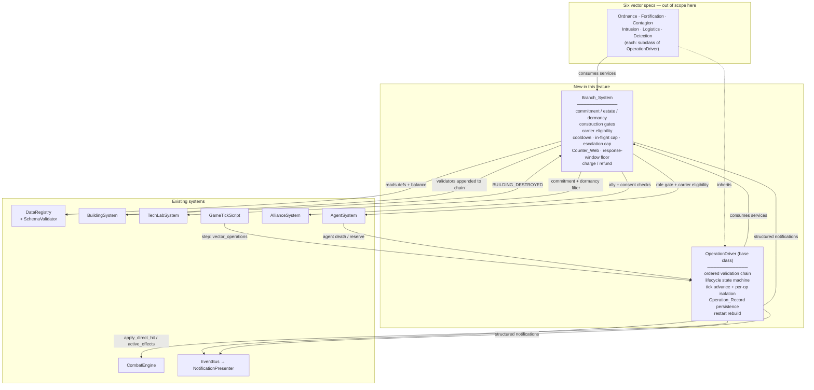
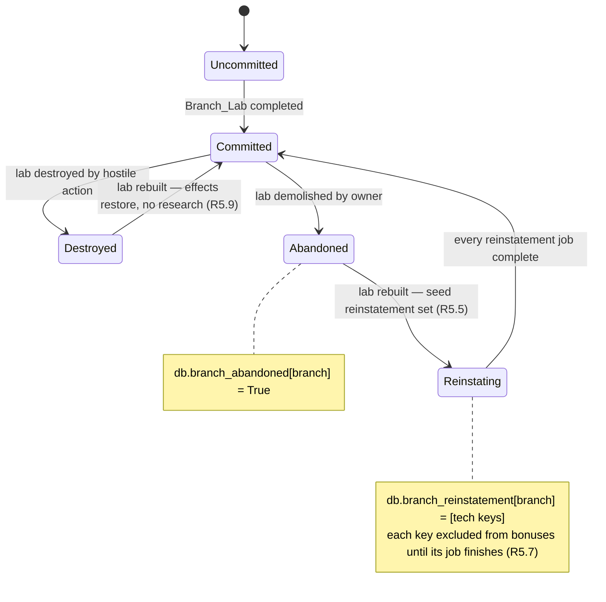
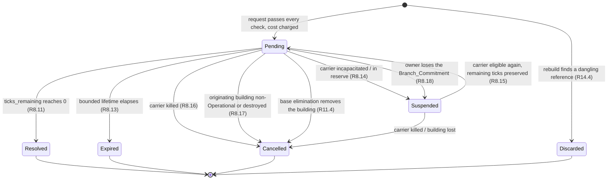

# Design Document

## Overview

This feature adds two components and extends five existing ones. It ships **no** combat vector.

The two new components:

- **`Branch_System`** — the authority on what Branch a thing belongs to, what Branch a player is committed to on a planet, what that player's Branch_Estate contains, whether a Branch is dormant, and the shared framework services (cooldown, in-flight cap, escalation cap, Counter_Web, carrier eligibility, charge/refund) that the six future Vector_Systems consume rather than reimplement.
- **The Operation Contract** — a base class plus a state enum and a record dataclass that together own the entire Vector_Operation lifecycle. A Vector_System is a subclass that supplies target validation, an effect, and a persistence owner. Everything else — validation order, charge-then-refund, notification points, Response_Window floor, tick advancement, suspend/resume, cancellation, cooldown, cap, persistence discipline, restart rebuild — is inherited.

The design principle throughout: **derive, do not store.** Branch_Commitment is a query over owned buildings, not a field. Branch_Estate is a query. Branch_Dormancy is the absence of a commitment, not a flag. The only new persisted player state is the reinstatement bookkeeping that genuinely cannot be derived (§3.5), and the Operation_Records that live on the world objects the operations act through.

### What is already in place

The research-lab-trees feature built most of the commitment substrate, and this design reuses it rather than replacing it:

| Existing seam | What it already does | What this feature adds |
| --- | --- | --- |
| `RESEARCH_TREES` (`world/constants.py`) | Closed four-value tree vocabulary | Two values (`bio`, `cyber`); becomes the six-Branch vocabulary |
| `SchemaValidator.cross_validate` tree↔lab block | Bijection when any lab exists, tree-has-techs coverage | Unconditional six-Branch bijection, error text naming both abbreviations, plus eight new Branch rules |
| `world.utils.owner_research_lab` | Finds the owner's completed lab on a planet; skips `under_construction`, **does not** check `offline` | Nothing. This is exactly Requirement 3.9 — commitment already follows ownership, not Operational state |
| `TechLabSystem.owned_research_tree` | Derives the hosted tree from the owned lab, never stores it | Renamed-in-spirit to `Branch_System.commitment`; TechLabSystem delegates |
| `TechLabSystem.recompute_tech_bonuses` | Rebuilds `db.tech_bonuses` from scratch out of `researched_techs` | A filter: only the committed Branch's techs, minus techs awaiting Reinstatement |
| `BuildingSystem._validate_construction` | Ordered validator list, first failure wins | Three validators appended (affiliation, switch, unlock-tech) |
| `BuildingSystem.get_building_investment` | Cumulative build + upgrade cost, owner-discounted | Reused verbatim for the demolish refund on Branch_Buildings, and as the parity-score input |
| `CombatEngine.apply_direct_hit` | Single-hit entry: damage calc → apply → lockout/event/notify/defeat | The only path a Vector_Operation may damage through |
| `BombSystem` (`process_tick` / `_tick_one` / `rebuild_from_world`) | Fused tile object, per-item try/except isolation, restart re-tracking from placed objects | The template the Operation driver generalizes |
| `BaseSystem.notify` | Publishes structured `(player, kind, data)` on `PLAYER_NOTIFICATION` | Nine new notification kinds; no text composed in a system |
| `GameTickScript.at_repeat` | Ordered named steps, each wrapped in try/except | One new step, `vector_operations` |

## Architecture



### Ownership boundaries

**`Branch_System` owns:**

- Branch identity resolution: which Branch a building definition, technology, or agent role belongs to; which lab hosts a Branch.
- `commitment(player, planet)` and its negation (no commitment).
- `estate(player, planet, branch)` and `estate_count`.
- Dormancy: `is_dormant`, and the Operational overlay that reports a Branch_Building inert while its Branch is dormant (R5.4).
- The three construction gates this feature adds, exposed as callables `BuildingSystem` appends to its existing chain.
- The single write path for the two new persisted player attributes (`db.branch_abandoned`, `db.branch_reinstatement`) — R15.5.
- The shared framework services of R15.8, consumed by every Vector_System.

**`Branch_System` explicitly does not own:**

- Any Signature_Vector mechanics, effect shape, radius, or magnitude.
- Damage arithmetic, resist axes, chip floor, rank-gap damper — those stay in `CombatEngine`; the Branch_System only guarantees vectors route through it.
- Building creation, construction timers, refund arithmetic — `BuildingSystem`.
- Writing `db.tech_bonuses` — `TechLabSystem` stays the single writer; the Branch_System supplies the filter it applies.
- The agent roster, training, XP tables, agent cap — `AgentSystem`.
- Notification text — the `NotificationPresenter`.

**`OperationDriver` owns:** the lifecycle. **A Vector_System owns:** target semantics and the effect. Nothing else.

### Composition root

Both attach in `server/conf/game_init.py` alongside the existing systems, with every framework-dependent collaborator injected (R15.1, R15.4). No module-scope Evennia import in either file.

```python
# server/conf/game_init.py — after building_system / tech_system / agent_system exist
from world.systems.branch_system import BranchSystem

branch_system = BranchSystem(
    registry, event_bus,
    current_tick_func=_get_current_tick,
    building_system=building_system,
    tech_system=tech_system,
    agent_system=agent_system,
    alliance_system=alliance_system,
    combat_engine=combat_engine,
)
# The three construction gates join the existing ordered chain in one call,
# so BuildingSystem never imports BranchSystem.
building_system.set_branch_validators(branch_system.construction_validators())
# TechLabSystem asks the Branch_System which Branch is live before it
# rebuilds db.tech_bonuses.
tech_system.set_branch_resolver(branch_system)
# AgentSystem gates the four newly introduced roles on commitment.
agent_system.set_branch_resolver(branch_system)

game_systems["branch_system"] = branch_system
# Each vector spec appends its own system here and registers it:
#   branch_system.register_vector(ordnance_system)
```

A Vector_System that is constructed without a collaborator it needs refuses its operations and logs the gap rather than raising (R15.2) — the driver checks `self._required_collaborators` once per request and returns a `MISSING_COLLABORATOR` outcome.

Tick registration (R15.9) is one new named step in `GameTickScript._build_tick_steps`, placed after `combat_resolution` and before `effect_ticks` so an operation that resolves damage this tick has its damage-over-time seeded by the same tick's effect step:

```python
if branch_system:
    registered["vector_operations"] = (
        lambda: branch_system.process_tick(tick_number)
    )
```

`Branch_System.process_tick` fans out to each registered Vector_System's `advance_all(tick)` inside its own try/except, so a broken vector cannot stop the others — the same isolation shape `at_repeat` already uses for steps and `BombSystem.process_tick` uses for bombs.

## Components and Interfaces

### `Branch_System` interface

```python
class BranchSystem(BaseSystem):
    """Branch identity, commitment, dormancy, and the shared vector services."""

    # ---- identity (R1.6, R2.6, R15.4) ---------------------------------
    def branch_of_building(self, abbr_or_def) -> str | None: ...
    def branch_of_technology(self, tech_key: str) -> str | None: ...
    def lab_for_branch(self, branch: str) -> str | None: ...
    def branch_buildings(self, branch: str) -> list[str]: ...
    def role_for_branch(self, branch: str) -> str | None: ...
    def branch_overview(self) -> list[dict]: ...          # R13.3

    # ---- commitment (R3) ----------------------------------------------
    def commitment(self, player, planet=None) -> str | None: ...
    def has_commitment(self, player, branch, planet=None) -> bool: ...

    # ---- estate (R4) --------------------------------------------------
    def estate(self, player, branch, planet=None) -> list: ...
    def estate_count(self, player, branch, planet=None) -> int: ...
    def conflicting_estates(self, player, planet, incoming_branch) -> dict[str, list]: ...

    # ---- dormancy (R5) ------------------------------------------------
    def dormant_branches(self, player, planet=None) -> dict[str, int]: ...
    def is_operational(self, building) -> bool: ...        # utils gate AND branch live

    # ---- construction gates (R3.3-3.5, R4.1-4.2, R4.8, R6.2-6.3) ------
    def construction_validators(self) -> list: ...

    # ---- shared vector services (R15.8) ------------------------------
    def eligible_carrier(self, player, role, planet=None): ...        # R7.5
    def cooldown_remaining(self, building, kind) -> int: ...          # R8.19
    def note_cooldown(self, building, kind) -> None: ...
    def in_flight_count(self, player, kind, planet) -> int: ...       # R8.20
    def in_flight_cap(self, kind) -> int: ...
    def escalation_remaining(self, actor, target) -> int: ...         # R10.6
    def note_escalation(self, actor, target) -> None: ...
    def counter_multiplier(self, actor_branch, target_branch) -> float: ...  # R9.4-9.5
    def response_window(self, base_ticks, reduction=0) -> int: ...    # R8.8
    def charge(self, player, cost) -> bool: ...                       # R12.2
    def refund(self, player, cost) -> None: ...                       # R8.6
    def may_target(self, actor, target) -> str | None: ...            # R10.4, R11.9, R10.7

    # ---- tick fan-out (R15.9) ----------------------------------------
    def register_vector(self, vector) -> None: ...
    def process_tick(self, tick_number: int) -> None: ...
```

Every method returns a value for every input and raises nothing into a caller (R15.3). Queries that cannot resolve return `None`, `0`, `{}`, or `[]`. Gates return `str | None` — a message key, never composed prose.

### Construction gates

`BuildingSystem` gains one setter and splices the returned callables into its existing `_validate_construction` list. Position matters: R4.8 and R13.4 both require the report to precede any resource charge, so the gates must sit above `_validate_resources`. They slot in immediately after `_validate_one_research_lab_per_planet` — the existing lab gate they extend — and before the rank gate:

```
hq_requirement
one_hq_per_planet
shield_generator_cap
one_research_lab_per_planet     ← existing; now covers all six labs (R3.6)
branch_affiliation              ← NEW (R3.3, R3.4, R3.5)
branch_switch                   ← NEW (R4.1, R4.2, R4.8, R13.4)
unlock_technology               ← NEW (R6.2, R6.3)
rank_requirement
deed_requirement
terrain / buildable / extractor_terrain / tile_empty / build_range / combat_lockout
resources                       ← charge happens after this (R4.8 satisfied)
```

Placement rationale: the Branch gates are *identity* checks like the HQ and lab caps — they answer "may this player build this class of thing here at all", which is cheaper and more informative to answer than "is the tile right". Putting them before the rank gate also means a wrong-Branch attempt reads as a wrong-Branch error rather than a misleading rank error, matching the precedent `TechLabSystem.start_research` already set for its lab gate.

`_validate_one_research_lab_per_planet` needs no change: it keys on the `RESEARCH_LAB` capability, so the two new labs are covered the moment they declare it (R3.6). Its message text changes to point at the Branch vocabulary.

### The Operation Contract

See §4 for the full design. The interface summary:

```python
class OperationDriver:
    """Framework half of a Vector_System. A vector subclasses this."""

    operation_kind: str                 # subclass sets
    branch: str                         # subclass sets
    _required_collaborators: tuple[str, ...] = ()

    # ---- inherited, do not override ----------------------------------
    def request(self, player, **params) -> OperationOutcome: ...
    def advance_all(self, tick: int) -> None: ...
    def rebuild(self, planet_rooms) -> int: ...
    def cancel(self, record, reason: str) -> OperationOutcome: ...
    def suspend(self, record, reason: str) -> None: ...
    def resume(self, record) -> None: ...

    # ---- hooks a vector supplies -------------------------------------
    def validate_target(self, ctx) -> str | None: ...       # required
    def build_record(self, ctx) -> OperationRecord: ...     # required
    def on_resolve(self, record) -> None: ...               # required
    def persistence_owner(self, record): ...                # required
    def discover_records(self, planet_rooms): ...           # required
    def on_expire(self, record) -> None: ...                # optional
    def on_suspend(self, record) -> None: ...               # optional
    def on_resume(self, record) -> None: ...                # optional
    def on_cancel(self, record) -> None: ...                # optional
    def on_discard(self, record) -> None: ...               # optional
```

## Data Models

### 1. `BuildingDef` — two new fields

```python
@dataclass
class BuildingDef:
    ...
    research_tree: str | None = None      # existing: for research_lab buildings only
    #: Branch_Affiliation: the one Branch this building belongs to. None = a
    #: Neutral_Building, buildable under any Branch_Commitment. Every building
    #: shipped before this feature omits it (R2.2, R2.5).
    branch: str | None = None
    #: Unlocking technology key. When set, construction requires that the owner
    #: has researched the technology AND that its effects are currently applied
    #: (i.e. its Branch is committed and it is not awaiting Reinstatement) — R6.2.
    unlock_technology: str | None = None
```

Naming: `branch` over `branch_affiliation` because it reads cleanly in YAML and matches `research_tree`'s brevity. The two fields are independent — a lab declares `research_tree` (which Branch it *hosts*) and may optionally declare `branch` (which must equal it, R2.4); a non-lab Branch_Building declares only `branch`.

### 2. `world/constants.py` — six Branches

```python
RESEARCH_TREE_WEAPONS  = "weapons"
RESEARCH_TREE_DEFENSE  = "defense"
RESEARCH_TREE_RESOURCE = "resource"
RESEARCH_TREE_RESEARCH = "research"
RESEARCH_TREE_BIO      = "bio"        # NEW
RESEARCH_TREE_CYBER    = "cyber"      # NEW

RESEARCH_TREES: tuple[str, ...] = (
    RESEARCH_TREE_WEAPONS, RESEARCH_TREE_DEFENSE, RESEARCH_TREE_RESOURCE,
    RESEARCH_TREE_RESEARCH, RESEARCH_TREE_BIO, RESEARCH_TREE_CYBER,
)

#: Branch and tree are the same vocabulary seen from two angles: a tree is the
#: research line, a Branch is that line plus its buildings, roles, and vector.
#: One tuple, two names, so neither term needs a translation table.
BRANCHES = RESEARCH_TREES

#: Branch -> doctrine display name (R13.3 overview, presenter labels).
BRANCH_DOCTRINE = {
    "weapons": "Ordnance", "defense": "Fortification", "resource": "Logistics",
    "research": "Recon",   "bio": "Biowarfare",        "cyber": "Signals",
}

#: Branch -> the ONE Carrier_Agent role that Branch owns (R7.4, R7.11).
BRANCH_ROLE = {
    "weapons": "spotter", "defense": "sapper", "resource": "courier",
    "research": "scout",  "bio": "medic",      "cyber": "infiltrator",
}

#: Branch -> its Operation_Kind identifier (R7.2 lookup key, balance-field stem).
BRANCH_OPERATION_KIND = {
    "weapons": "strategic_strike", "defense": "trap", "resource": "convoy",
    "research": "detection_sweep", "bio": "contagion", "cyber": "intrusion",
}

OPERATION_KINDS: tuple[str, ...] = tuple(BRANCH_OPERATION_KIND.values())

#: New persisted player attributes this feature introduces. Branch_System is
#: their single writer (R15.5).
ATTR_BRANCH_ABANDONED    = "branch_abandoned"     # {branch: True}
ATTR_BRANCH_REINSTATEMENT = "branch_reinstatement" # {branch: [tech_key, ...]}
```

`BRANCHES` as an alias rather than a second tuple keeps the SchemaValidator's existing `RESEARCH_TREES` rules working untouched while giving the new code the domain word.

### 3. Two new lab buildings

Modelled on the existing four (same level/deed gate, same shape). Costs are drawn to land inside the parity tolerance the validator now enforces (§Schema rule 8).

```yaml
# Biolab — hosts the `bio` Branch (Biowarfare: contagion, carrier medics).
- name: Biolab
  abbreviation: BX
  cost: {Wood: 15, Stone: 15, Iron: 20, Biomass: 15}
  build_time_seconds: 38
  max_level: 5
  rank_requirement: 11
  unlock_deed: outpost_cleared
  unlock_deed_count: 3
  max_health: 250
  requires_hq: true
  required_terrain: null
  category: research
  produces: null
  requires_agent: true
  storage_capacity: 0
  capabilities: [research_lab]
  research_tree: bio
  branch: bio
  map_symbol: BX

# Signals Lab — hosts the `cyber` Branch (Signals: intrusion, infiltrators).
- name: Signals Lab
  abbreviation: SG
  cost: {Wood: 15, Stone: 15, Iron: 20, Circuits: 12}
  build_time_seconds: 38
  max_level: 5
  rank_requirement: 11
  unlock_deed: outpost_cleared
  unlock_deed_count: 3
  max_health: 250
  requires_hq: true
  required_terrain: null
  category: research
  produces: null
  requires_agent: true
  storage_capacity: 0
  capabilities: [research_lab]
  research_tree: cyber
  branch: cyber
  map_symbol: SG
```

Each of the six Branches also needs at least one non-lab Branch_Building (R2.7) and its Signature_Vector building behind an unlocking technology of that Branch (R6.7). Those buildings belong to the six vector specs; this spec adds only the validator rules that make their absence a load-time error, and one illustration of the shape:

```yaml
# Illustrative only — the real definition ships with tech-tree-vector-ordnance.
- name: Targeting Array
  abbreviation: TA
  cost: {Iron: 40, Circuits: 20, Energy: 15}   # late-game resource — R12.4
  rank_requirement: 11            # >= the Weapons Lab's 11 — R10.5
  ...
  branch: weapons                 # Branch_Affiliation — R2.1
  unlock_technology: precision_targeting   # a `weapons` tech — R6.5, R6.7
```

### 4. `data/definitions/branches.yaml` — Counter_Web and the Operation_Kind registry

One new optional definition file, loaded by `DataRegistry._load_branches` following the exact pattern of `_load_alliance_perks` / `_load_directives` / `_load_affixes` (optional file, present-but-invalid fails the load, absent yields empty and the Branch features go inert).

```yaml
# Counter_Web (R9.1): branch -> the branches it holds a bounded advantage over.
# The shipped cycle gives each Branch exactly one advantage and exactly one
# disadvantage, so no Branch is doubly countered.
counter_web:
  weapons:  [defense]
  defense:  [bio]
  bio:      [cyber]
  cyber:    [resource]
  resource: [research]
  research: [weapons]

# Per-Operation_Kind registry (R7.2, R8.19, R8.20, R7.10, R12.1). Each entry
# names the Balance_Config field that holds the tunable, so the value is hot
# and the *binding* is data.
operations:
  strategic_strike:
    branch: weapons
    carrier_role: spotter
    cost_field: strategic_strike_cost
    cooldown_field: strategic_strike_cooldown_ticks
    cap_field: strategic_strike_max_in_flight
    agent_xp_field: agent_xp_strategic_strike
  trap:
    branch: defense
    carrier_role: sapper
    cost_field: trap_cost
    cooldown_field: trap_cooldown_ticks
    cap_field: trap_max_in_flight
    agent_xp_field: agent_xp_trap
  contagion:
    branch: bio
    carrier_role: medic
    cost_field: contagion_cost
    cooldown_field: contagion_cooldown_ticks
    cap_field: contagion_max_in_flight
    agent_xp_field: agent_xp_contagion
  intrusion:
    branch: cyber
    carrier_role: infiltrator
    cost_field: intrusion_cost
    cooldown_field: intrusion_cooldown_ticks
    cap_field: intrusion_max_in_flight
    agent_xp_field: agent_xp_intrusion
  convoy:
    branch: resource
    carrier_role: courier
    cost_field: convoy_cost
    cooldown_field: convoy_cooldown_ticks
    cap_field: convoy_max_in_flight
    agent_xp_field: agent_xp_convoy
  detection_sweep:
    branch: research
    carrier_role: scout
    cost_field: detection_sweep_cost
    cooldown_field: detection_sweep_cooldown_ticks
    cap_field: detection_sweep_max_in_flight
    agent_xp_field: agent_xp_detection_sweep
```

```python
@dataclass(frozen=True)
class OperationKindDef:
    """One Signature_Vector's framework binding (R7.2, R8.19, R8.20, R12.1)."""
    kind: str
    branch: str
    carrier_role: str
    cost_field: str
    cooldown_field: str
    cap_field: str
    agent_xp_field: str
```

New registry surface:

```python
self.counter_web: dict[str, tuple[str, ...]] = {}
self.operation_kinds: dict[str, OperationKindDef] = {}
```

Tradeoff on indirection: the registry entry names a *balance field* rather than holding the number, so tuning stays in `balance.yaml` behind `@reload` (R15.7) and the vector-to-field binding stays reviewable in one table. The cost is one extra hop at read time, which is negligible against a per-request path.

### 5. New agent roles

Four roles are new (`spotter`, `sapper`, `courier`, `infiltrator`); `medic` exists as a hidden placeholder and becomes visible under the `bio` Branch; `scout` already exists and ships visible.

`RoleSpec` gains one field so `BRANCH_ROLE` and the role table cannot drift:

```python
@dataclass(frozen=True)
class RoleSpec:
    ...
    #: The Branch this role belongs to, or None for a Branch-free role.
    #: A role with a branch is assignable only under that Branch_Commitment.
    branch: str | None = None

AGENT_ROLES: dict[str, RoleSpec] = {
    ...
    "spotter":     RoleSpec("spotter", SpotterScript, "spotter_script",
                            army=True, branch="weapons"),
    "sapper":      RoleSpec("sapper", SapperScript, "sapper_script",
                            army=True, branch="defense"),
    "courier":     RoleSpec("courier", CourierScript, "courier_script",
                            army=True, branch="resource"),
    "infiltrator": RoleSpec("infiltrator", InfiltratorScript,
                            "infiltrator_script", army=True, branch="cyber"),
    "medic":       RoleSpec("medic", MedicScript, "medic_script",
                            army=True, branch="bio"),      # hidden=True dropped
    "scout":       RoleSpec("scout", PatrolBehavior, "patrol_behavior",
                            army=True, branch="research"),
}
```

**Decided asymmetry, stated once:** R7.6's commitment gate applies to "a role introduced by this feature". `scout` is not — it ships today as a free army role any player may assign, and gating it would break existing players' patrols. So `scout` carries `branch="research"` for the R7.11 bijection and for Carrier_Agent lookup, but `AgentSystem.assign_role` does not gate it. The five gated roles are `spotter`, `sapper`, `courier`, `infiltrator`, `medic`. The Recon Branch is still gated where it counts: a Detection_Sweep request fails the Branch_Commitment check in the operation validation chain (R8.3) regardless of who owns a scout. The alternative — gating scout — buys uniformity at the cost of a live regression, which is the wrong trade.

`AgentSystem` changes, all small:

- `assign_role` consults the injected branch resolver when `spec.branch` is set and the role is in the gated set: refuse with the required Branch when the commitment does not match (R7.6, R7.7).
- A new `unassign_branch_roles(player, planet, branch)` called by `Branch_System` when a commitment lapses, setting each matching agent to unassigned (R7.8). It reuses the existing `_detach_behavior_script` + `role_target` clearing path.
- `award_operation_xp(agent, kind)` reads `AGENT_XP_SOURCE_FIELDS`-style lookup from `OperationKindDef.agent_xp_field` (R7.10).
- The rank-derived agent cap is untouched (R7.9).

### 6. New `BalanceConfig` fields

Seven cross-cutting fields plus four per Operation_Kind. The per-kind fields ship here with placeholder defaults so the naming contract is real and validated from day one (R12.1 requires a per-use cost for *every* kind); each vector spec tunes its own four.

```python
    # --- Branch framework (tech-tree-branch-foundation) ---------------- #
    #: Reinstatement discount: a re-researched technology in a previously
    #: abandoned Branch costs this fraction of its defined resource cost AND
    #: takes this fraction of its defined duration (R5.6). 1.0 = full price.
    branch_reinstatement_cost_fraction: float = 0.5
    #: Floor on the Response_Window of a hostile Vector_Operation, in ticks,
    #: measured from the target's notification to the effect (R8.8). No
    #: Counter_Web reduction may take a window below this.
    minimum_response_window_ticks: int = 5
    #: Ceiling on a Counter_Web advantage multiplier (R9.4). An advantage
    #: changes a magnitude or a timing; it never grants immunity.
    counter_advantage_cap: float = 1.35
    #: Allowed fractional deviation of a Branch's investment score from the
    #: six-Branch mean before the load fails (R9.10).
    branch_cost_parity_tolerance: float = 0.20
    #: Entity_Level below which a player cannot be the target of a hostile
    #: Vector_Operation (R10.4).
    new_player_vector_shield_level: int = 10
    #: Rolling window (ticks) for the per-attacker-per-target escalation cap.
    escalation_window_ticks: int = 600
    #: Max hostile Vector_Operations one player may resolve against one target
    #: player inside escalation_window_ticks (R10.6).
    escalation_cap: int = 3

    # --- Per-Operation_Kind tunables (R7.10, R8.19, R8.20, R12.1) ------ #
    # Placeholder defaults; each vector spec tunes its own four fields.
    strategic_strike_cost: dict[str, int] = field(
        default_factory=lambda: {"Iron": 20, "Circuits": 5})
    strategic_strike_cooldown_ticks: int = 60
    strategic_strike_max_in_flight: int = 2
    agent_xp_strategic_strike: int = 30
    trap_cost: dict[str, int] = field(
        default_factory=lambda: {"Iron": 15, "Circuits": 4})
    trap_cooldown_ticks: int = 45
    trap_max_in_flight: int = 4
    agent_xp_trap: int = 25
    contagion_cost: dict[str, int] = field(
        default_factory=lambda: {"Biomass": 20, "Energy": 8})
    contagion_cooldown_ticks: int = 60
    contagion_max_in_flight: int = 2
    agent_xp_contagion: int = 30
    intrusion_cost: dict[str, int] = field(
        default_factory=lambda: {"Circuits": 18, "Energy": 10})
    intrusion_cooldown_ticks: int = 75
    intrusion_max_in_flight: int = 2
    agent_xp_intrusion: int = 30
    convoy_cost: dict[str, int] = field(
        default_factory=lambda: {"Energy": 12, "Iron": 10})
    convoy_cooldown_ticks: int = 30
    convoy_max_in_flight: int = 3
    agent_xp_convoy: int = 20
    detection_sweep_cost: dict[str, int] = field(
        default_factory=lambda: {"Energy": 15, "Circuits": 6})
    detection_sweep_cooldown_ticks: int = 45
    detection_sweep_max_in_flight: int = 2
    agent_xp_detection_sweep: int = 20
```

The scalar fields are picked up automatically by `SchemaValidator._balance_fields_by_type` (it partitions `dataclasses.fields(BalanceConfig)` by type), so int/float type checking is free. The six `*_cost` dicts join the existing `resource_map_fields` list, which already enforces canonical resource names and positive ints. Range checks for the seven cross-cutting fields are explicit additions (R15.6):

| Field | Range |
| --- | --- |
| `branch_reinstatement_cost_fraction` | `0.0 <= v <= 1.0` |
| `minimum_response_window_ticks` | `v >= 1` |
| `counter_advantage_cap` | `v >= 1.0` |
| `branch_cost_parity_tolerance` | `0.0 < v <= 1.0` |
| `new_player_vector_shield_level` | `1 <= v <= MAX_LEVEL` |
| `escalation_window_ticks` | `v >= 1` |
| `escalation_cap` | `v >= 1` |

### 7. `Operation_Record` — the persisted shape

```python
class OperationState(StrEnum):
    """Vector_Operation lifecycle states (R8.1). StrEnum so a persisted value
    round-trips as a plain string through Evennia attributes."""
    PENDING   = "pending"
    SUSPENDED = "suspended"
    RESOLVED  = "resolved"
    EXPIRED   = "expired"
    CANCELLED = "cancelled"
    DISCARDED = "discarded"

TERMINAL_STATES = frozenset({
    OperationState.RESOLVED, OperationState.EXPIRED,
    OperationState.CANCELLED, OperationState.DISCARDED,
})


@dataclass
class OperationRecord:
    """The persisted description of one Vector_Operation (R8.21, R14.1).

    Stored as a plain dict under the ``vector_operations`` attribute of the
    durable owner the vector nominates — the world object the operation acts
    through (a placed trap object, a convoy object) or the entity it is
    attached to (an intruded building, an infected agent). Every field is a
    value or a resolvable reference, never a live object graph.
    """
    op_id: str                      # uuid4 hex; the identity across a rebuild
    kind: str                       # Operation_Kind
    owner_ref: Any                  # owning player (dbref/id, resolved lazily)
    building_ref: Any               # originating Branch_Building
    carrier_ref: Any                # Carrier_Agent
    planet: str | None
    target_x: int | None
    target_y: int | None
    target_ref: Any                 # target entity, when the vector has one
    ticks_remaining: int
    lifetime_remaining: int | None  # None = no bounded lifetime (R8.13 n/a)
    magnitude: float
    radius: int
    state: str                      # an OperationState value
    suspended_ticks: int | None     # ticks held at suspension (R8.15)
    charged: dict[str, int]         # what was charged, for the R8.6 refund
```

**Persistence discipline (R14.7, R14.8).** Evennia attribute writes do not observe in-place mutation of a stored container, so every write is read-copy-write, and every read is by value with a documented default:

```python
def _write_records(self, owner, records: list[dict]) -> None:
    """Read the container, replace it wholesale, write it back (R14.7)."""
    if owner is None or not hasattr(owner, "attributes"):
        return
    owner.attributes.add("vector_operations", list(records))

def _read_records(self, owner) -> list[dict]:
    """Read by value; an absent attribute is an empty list (R14.8)."""
    if owner is None or not hasattr(owner, "attributes"):
        return []
    return list(owner.attributes.get("vector_operations", default=[]) or [])
```

### Schema validator: the new rules

All rules append to the existing collected-error lists, so one load reports every Branch error across every file (R1.7) — the registry already accumulates per-file errors and only raises after all files are validated.

**Per-building rules (in `validate_buildings`):**

1. **Branch_Affiliation vocabulary** (R2.3) — `branch`, when present, must be one of `BRANCHES`. Error names the abbreviation and the offending value.
2. **Lab affiliation agreement** (R2.4) — a building with the `research_lab` capability must have `branch` absent or equal to `research_tree`. Error names the abbreviation and both values.
3. **Unlock-technology type** — `unlock_technology`, when present, must be a non-empty string. (The FK check is cross-file.)

**Cross-file rules (in `cross_validate`):**

4. **Six-Branch tree↔lab bijection** (R1.2, R1.3, R1.4) — the existing block, with the `any_lab` escape hatch kept for the minimal test fixtures but the *duplicate* check made unconditional and its message extended to name both abbreviations and the duplicated Branch. A Branch hosted by no lab is an error whenever the dataset uses labs at all.
5. **Every Branch has a technology** (R1.5) — each of the six must appear as some `TechnologyDef.tree`.
6. **Every Branch has a non-lab building** (R2.7) — each of the six must have at least one `BuildingDef` with `branch == B` and without the `research_lab` capability.
7. **Unlock-technology FK and Branch agreement** (R6.4, R6.5) — the named key must exist in `registry.technologies`, and its `tree` must equal the building's `branch`. Two distinct errors, each naming the abbreviation, the key, and (for the second) both Branch values.
8. **Investment-score parity** (R9.9, R9.10):

   ```python
   def _branch_investment_score(self, registry, branch: str) -> float:
       """Σ over the Branch's lab + Branch_Buildings' build costs and its
       technologies' resource costs, of amount × the resource's weight."""
       weights = registry.balance.resource_weights
       def weigh(cost_map):
           return sum(amt * weights.get(res, DEFAULT_RESOURCE_WEIGHT)
                      for res, amt in (cost_map or {}).items())
       score = sum(weigh(b.cost) for b in registry.buildings.values()
                   if b.branch == branch or b.research_tree == branch)
       score += sum(weigh(t.resource_cost) for t in registry.technologies.values()
                    if t.tree == branch)
       return score
   ```

   Then `mean = sum(scores) / 6` and any Branch with `abs(score - mean) / mean > balance.branch_cost_parity_tolerance` is an error naming the Branch, its score, and the mean. Resources absent from `resource_weights` (`Biomass`, `Cryogen`, `Magmite`, `Aether` today) weigh `DEFAULT_RESOURCE_WEIGHT` — worth noting when authoring, since a Biomass-heavy Branch is scored at 1.0/unit until someone adds a weight.
9. **Role↔Branch bijection** (R7.11) — over the six roles in `BRANCH_ROLE`: each role belongs to exactly one Branch and each Branch owns exactly one role. Cross-checked against `AGENT_ROLES[role].branch` so the constant and the role table cannot disagree. Two error shapes, one per failing direction, naming the role or the Branch.
10. **Counter_Web well-formedness** (R9.2, R9.3, R9.12) — every key and every listed value is one of the six (R9.12); out-degree `1 <= len(v) <= 2` (R9.2 lower bound, R9.3 upper bound); in-degree `>= 1` for every Branch (R9.2). Self-edges rejected. Each failure names the Branch.
11. **Branch content level floor** (R10.5) — every Branch_Building's `rank_requirement` must be `>=` its Branch's lab's `rank_requirement`. Error names the abbreviation and both values. (`rank_requirement` is the field the existing level gate reads, so this is the level requirement the requirement means.)
12. **Late-game resource in the vector chain** (R12.5) — for each Branch, the union of build costs over the buildings gated behind that Branch's Signature_Vector unlock technology must include at least one of `Circuits`, `Energy`, `Nexium`. Error names the Branch.

Rule 12 needs a way to know which building is the Signature_Vector building. Rather than a new flag, the design uses the R6.7 relationship: the Signature_Vector building is the Branch_Building whose `unlock_technology` is set — and the validator requires each Branch to have at least one such building (folded into rule 6 as a second condition). One less field, one more inference; the tradeoff is that a Branch with several tech-gated buildings must have the late-game resource in at least one of them, which is the intent anyway.

## Commitment, Dormancy, and Reinstatement

### 3.1 Commitment is a query, never a field

```python
def commitment(self, player, planet=None) -> str | None:
    """The Branch *player* is committed to on *planet*, or None (R3.1, R3.2).

    Derived from the Branch_Lab the player OWNS there. Holds no stored copy,
    so no restart and no missed event can desynchronize it from the buildings
    that define it (R14.6).
    """
    if planet is None:
        planet = getattr(getattr(player, "db", None), "coord_planet", None)
    lab = owner_research_lab(player, planet=planet, provider=self.registry)
    if lab is None:
        return None                                   # R3.2
    btype = get_building_type(lab)
    if not btype:
        return None
    try:
        bdef = self.registry.get_building(btype)
    except (KeyError, AttributeError):
        return None
    return getattr(bdef, "research_tree", None)
```

This is `TechLabSystem.owned_research_tree` moved to its proper owner; `TechLabSystem` delegates to the injected resolver and keeps its method as a thin forwarder so existing callers and tests keep working.

**R3.9 falls out of the existing seam and needs no new code.** `owner_research_lab` filters on `under_construction` only — it never consults `offline` or `building_is_operational`. So a lab suspended by a Signals intrusion, knocked to 0 HP and offline, or mid-upgrade is still *owned and completed*, and its owner's Branch_Commitment stands. R3.8's counterpart — a lab *destroyed* — removes the building from `get_buildings()`, so the commitment vanishes with it. Ownership of a completed lab is the whole rule.

Consequences, all intended: R5.10 (a suspended lab withholds the lab's function, not the Branch's researched bonuses) is automatic, because bonuses key on commitment and commitment ignores Operational state. What the suspension *does* withhold is anything gated on the lab being Operational — starting a research job, and any lab capability behavior — which is exactly "the building's function".

### 3.2 Dormancy is a filter on the bonus recompute

`db.tech_bonuses` is already fully derived state with a from-scratch rebuild (`TechLabSystem.recompute_tech_bonuses`). Dormancy is one filter added to that rebuild:

```python
def recompute_tech_bonuses(self, player, planet=None) -> None:
    """Rebuild db.tech_bonuses from the researched set, filtered to the
    player's live Branch_Commitment on the occupied planet (R5.1, R5.2)."""
    db = getattr(player, "db", None)
    if db is None:
        return
    # An UNWIRED resolver (minimal test fixtures, pre-feature datasets) means
    # no dormancy: apply everything, exactly as before this feature. Without
    # this branch an unwired resolver would silently zero every bonus.
    gated = self._branch is not None
    active = self._branch.commitment(player, planet) if gated else None
    pending = self._pending_reinstatement(player, active) if gated else frozenset()
    db.tech_bonuses = {}
    if gated and active is None:             # committed to nothing -> no bonuses
        return
    for tech_key in self._get_researched_techs(player):
        tdef = self.registry.technologies.get(tech_key)
        if tdef is None or not tdef.effect_value:
            continue
        if gated and tdef.tree != active:    # R5.1 — dormant Branch, inert
            continue
        if tech_key in pending:              # R5.7 — not yet reinstated
            continue
        self._apply_tech_effect(player, tdef)
```

The researched set itself is never touched (R5.3) — dormancy suspends effects, not history. The `gated` flag is what keeps every existing TechLabSystem test passing unchanged: those fixtures construct the system without a Branch resolver, so they keep the pre-feature accumulate-everything behavior.

**Recompute trigger points.** The rebuild is cheap (a loop over a small set) and idempotent, so it runs on every event that can change the answer rather than trying to be clever:

| Trigger | Source |
| --- | --- |
| Login | existing login recompute path |
| Research completed | `TechLabSystem.process_tick` |
| Admin grant/revoke | `admin_grant_technology` / `admin_revoke_technology` (already call it) |
| Branch_Lab completed | `CONSTRUCTION_COMPLETED` subscriber in Branch_System |
| Branch_Lab destroyed | `BUILDING_DESTROYED` subscriber in Branch_System |
| Branch_Lab demolished | the demolish path, via the same subscriber |
| Player changes planet | `PLAYER_MOVED` / the cross-planet arrival path |

### 3.3 Branch_Estate is a query too

```python
def estate(self, player, branch, planet=None) -> list:
    """Buildings *player* owns on *planet* affiliated with *branch* (R4.7, R14.6).

    Includes the Branch's lab and includes buildings still under construction —
    a half-built Branch_Building blocks a switch.
    """
    out = []
    for b in self._owned_buildings(player):
        if planet is not None and self._building_planet(b) not in (None, planet):
            continue
        if self._branch_of_live_building(b) == branch:
            out.append(b)
    return out
```

`_branch_of_live_building` reads the building's `building_type`, resolves the `BuildingDef` through the **injected** registry (R15.4), and returns `bdef.branch or bdef.research_tree` — so a lab counts toward its own Branch's estate even if it omits the optional `branch` field. Under-construction buildings are included because the query does not filter them (R4.7); no special case is needed, only the absence of one.

Because the estate is a query over owned buildings, R4.6 (a hostile destruction advances the owner's switch exactly like a demolition) and R4.3 (an emptied estate frees the planet for any lab) are both free: destruction removes the building from `get_buildings()`, so the next query returns a shorter list. Nothing counts destructions.

### 3.4 A dormant Branch_Building reports non-Operational

```python
def is_operational(self, building) -> bool:
    """The existing Operational gate AND the building's Branch being live (R5.4)."""
    from world.utils import building_is_operational
    if not building_is_operational(building):
        return False
    branch = self._branch_of_live_building(building)
    if branch is None:
        return True                          # Neutral_Building — unaffected
    owner = get_obj_attr(building, "owner")
    return self.commitment(owner, self._building_planet(building)) == branch
```

`world.utils.building_is_operational` is deliberately **not** modified. It has many callers, no registry access, and no business reaching into commitment state; changing it would couple a value-based helper to a system. Instead the overlay lives on the Branch_System, and the consumers that need it call it: the Operation driver's originating-building check, and each Branch_Building's own capability behavior (shipped by the vector specs). Neutral_Buildings are unaffected either way, which bounds the blast radius to the buildings this feature introduces. The cost of the choice is that a future Branch_Building author must remember to use the overlay rather than the util; the mitigation is that the driver's own gate covers every Vector_Operation, which is where it matters.

### 3.5 Reinstatement

Requirements 5.5 and 5.9 differ on one point only: a Branch abandoned *voluntarily* costs Reinstatement research; a Branch whose lab was *destroyed* does not. Nothing derivable from the world distinguishes them after the fact — the lab is simply gone either way. So exactly one bit is persisted, written at the one moment the distinction is known:

```python
# db.branch_abandoned : {branch: True}
# Written ONLY when the owner voluntarily demolishes that Branch's lab.
# Hostile destruction never writes it. Branch_System is the single writer (R15.5).
```

Flow:



On `CONSTRUCTION_COMPLETED` for a Branch_Lab hosting Branch `B`:

```python
abandoned = dict(getattr(db, ATTR_BRANCH_ABANDONED, None) or {})
if abandoned.pop(B, False):
    recorded = [k for k in tech.researched_techs(player)
                if self.branch_of_technology(k) == B]
    pending = dict(getattr(db, ATTR_BRANCH_REINSTATEMENT, None) or {})
    pending[B] = recorded                      # R5.5
    db.branch_reinstatement = pending
    db.branch_abandoned = abandoned
# else: destroyed-and-rebuilt — nothing to seed, effects return on recompute (R5.9)
tech.recompute_tech_bonuses(player, planet)
```

A Reinstatement job is an ordinary entry in `TechLabSystem._active_research` carrying a `reinstatement: True` marker, so it shares the tick countdown, the completion publish, and the rank gate (R5.8) with a first-time research job. Only cost and duration are scaled:

```python
fraction = float(self.registry.balance.branch_reinstatement_cost_fraction)
cost = {res: max(1, int(round(amt * fraction)))
        for res, amt in (tdef.resource_cost or {}).items()}   # R5.6
ticks = max(1, int(round(tdef.research_ticks * fraction)))    # R5.6
```

On completion the key is removed from `db.branch_reinstatement[B]` and `recompute_tech_bonuses` runs, so the effect lands at the same moment a first-time research effect would. `start_research` treats a key present in the pending set as reinstatable rather than "already researched", which is the only branch its existing already-researched check needs.

Why a pending *set* rather than re-deleting the keys from `researched_techs` and re-adding them: R5.3 requires the record to be retained through dormancy, and the technology view (R13.2) must report the count of recorded technologies in a dormant Branch. Keeping the record intact and tracking a small exclusion set satisfies both, and keeps `researched_techs` monotonic — which every other consumer already assumes.

### 3.6 Switching

`_validate_branch_switch` fires only when the requested building is a Branch_Lab. It asks for every *other* Branch's estate on the target planet and refuses while any is non-empty:

```python
conflicts = self.conflicting_estates(player, planet, incoming_branch)
if conflicts:
    # R4.1: the count. R4.2: the abbreviation and coordinates of each.
    return branch_switch_blocked(conflicts)          # message key + data
```

The refusal reports the count (R4.1) and every blocking building's abbreviation and coordinates (R4.2) — as structured notification data, not composed text (R13.5). When there are no conflicts but the player currently holds a different commitment, the gate still fires informationally: it reports the count of recorded technologies in the outgoing Branch that will go dormant, and it does so from inside the validation chain, which runs before `_validate_resources` and therefore before any charge (R4.8, R13.4).

On a successful demolish of any Branch_Building, the demolish path reports the number of buildings remaining in that building's Branch_Estate on that planet (R4.5) — one `estate_count` call, and progress toward a switch becomes measurable. The refund itself is the existing `demolish_refund_rates` × `get_building_investment` path, unchanged, which is precisely R4.4: a partial refund means abandoning a Branch returns less than was invested in it.

## The Operation Contract

This is the load-bearing section. Everything below is framework code that ships with this spec; a vector spec supplies five hooks and inherits the rest.

### 4.1 Lifecycle state machine



Terminal-state finality (R8.2) is enforced in one place — the only function that writes `record.state`:

```python
def _transition(self, record, new_state, *, reason="") -> bool:
    """The single writer of record.state. Refuses to move a terminal record."""
    if record.state in TERMINAL_STATES:
        logger.debug("%s: %s is terminal (%s); ignoring -> %s",
                     self.operation_kind, record.op_id, record.state, new_state)
        return False
    record.state = str(new_state)
    self._persist(record)
    return True
```

Every path — resolve, expire, cancel, suspend, resume, discard, and the tick advance — goes through `_transition`. There is no second assignment to `state` anywhere in the driver, so "no advancement after a terminal state" is a structural property rather than a discipline, and it is directly testable (Property 15).

### 4.2 The ordered validation chain

R8.3 fixes the order and R8.4 fixes the failure shape: report the failing check and the value required to pass it, and change nothing. The driver implements it as a list of named closures — the same shape `BuildingSystem._validate_construction` already uses, so the two read alike:

```python
_CHECK_ORDER = (
    "collaborators",      # R15.2  — an unwired system degrades to a refusal
    "commitment",         # R8.3   — Branch_Commitment matches this vector's Branch
    "origin",             # R8.3   — building owned, Operational, Active_HQ_Rule
    "unlock",             # R8.3   — the originating building's unlock technology
    "carrier",            # R8.3   — an eligible Carrier_Agent of the right role
    "target",             # R8.3   — vector-supplied target validity + R10.4/R11.9
    "cooldown",           # R8.19
    "in_flight",          # R8.20
    "resources",          # R8.3   — sufficiency; the charge happens after
)

def request(self, player, **params) -> OperationOutcome:
    ctx = self._build_context(player, params)
    for name in self._CHECK_ORDER:
        err = getattr(self, f"_check_{name}")(ctx)
        if err is not None:
            # R8.4: name the failing check and the required value; nothing changed.
            return OperationOutcome.refused(check=name, detail=err)
    ...
```

The order is not arbitrary. Cheap identity checks precede expensive world queries; refusals a player can act on immediately (build a lab, train a spotter) precede refusals that depend on timing (cooldown, cap); and resource sufficiency is last so a player who is blocked for a structural reason hears the structural reason rather than "not enough Iron". Determinism matters as much as the ordering: for one input the chain yields exactly one refusal reason, which Property 13 pins down.

`_check_target` folds in the protection gates, because they are target-validity questions: the new-player shield (R10.4), the allied-target refusal (R11.9), and the escalation cap (R10.6) — all via `Branch_System.may_target`, which applies them to alliance members and allies on identical terms (R10.7).

### 4.3 Charge, then enter Pending — and refund if that fails

```python
    charged = self._resource_cost()                        # R12.1 via balance field
    if not self._branch.charge(player, charged):           # R12.2 — whole or none
        return OperationOutcome.refused(
            check="resources", detail=insufficient_detail(player, charged))  # R12.3
    try:
        record = self.build_record(ctx)                    # vector hook
        record.charged = dict(charged)
        record.state = str(OperationState.PENDING)         # R8.5
        record.ticks_remaining = self._floor_response_window(record)
        self._track(record)
        self._persist(record)
    except Exception:
        logger.exception("%s: failed to enter Pending; refunding",
                         self.operation_kind)
        self._branch.refund(player, charged)               # R8.6 — full amount
        return OperationOutcome.failed(check="pending_entry")
    self._notify_targets_pending(record)                   # R8.7
    self._branch.note_cooldown(record.building_ref, self.operation_kind)
    return OperationOutcome.accepted(record)               # R8.24
```

`charge` is whole-or-none because it delegates to the character's existing `deduct_resources`, which already checks `has_resources` first and returns `False` without partial mutation. `refund` adds each line back through `add_resource`. Together they give the conservation Property 14 tests: a request that ends refused-or-failed leaves the player's resource dict exactly as it was.

An NPC-originated operation charges nothing (R12.6): `_resource_cost` returns `{}` when the owner is an NPC base sentinel, and `charge({})` is a no-op that succeeds.

### 4.4 Notification points

Five points, all through `BaseSystem.notify` with structured data and no composed text (R13.5). Nine new kinds are added to `NotificationPresenter._FORMATTERS` (R13.6, R13.8) — and because the presenter logs a warning for an unregistered kind, a missing formatter is caught by the registry-coverage test rather than surfacing as a blank line:

| Point | Kind | Payload | Requirement |
| --- | --- | --- | --- |
| Hostile op enters Pending | `vector_incoming` | kind, attacker_name, x, y, ticks | R8.7 |
| Op resolves | `vector_resolved` | kind, x, y | R8.12 |
| Op resolves, recipient affected | `vector_hit` | kind, attacker_name, x, y | R8.12 |
| Op suspended | `vector_suspended` | kind, reason, x, y | R13.6 |
| Op resumed | `vector_resumed` | kind, ticks_remaining | R13.6 |
| Bounded lifetime elapsed | `vector_expired` | kind, x, y | R8.13 |
| Op cancelled | `vector_cancelled` | kind, reason | R8.16, R8.17 |
| Record discarded on rebuild | `vector_discarded` | kind | R13.6 |
| Support consent missing | `vector_consent_required` | kind, ally_name | R11.8 |

R8.12 distinguishes two audiences at resolution: players who own an affected entity, and players standing on an affected tile. The driver resolves both from the effect's area and de-duplicates, so a player who is both gets one notification.

### 4.5 Response_Window floor

```python
def _floor_response_window(self, record) -> int:
    """R8.8: no Counter_Web reduction takes a hostile window below the floor."""
    floor = int(self.registry.balance.minimum_response_window_ticks)
    if not self._is_hostile(record):
        return max(0, int(record.ticks_remaining))
    return max(floor, int(record.ticks_remaining))
```

Applied at the single point where a record enters Pending, and re-applied on resume, so a Counter_Web Response_Window reduction (R9.4's second permitted form) is clamped rather than trusted. The floor is a `max`, not a subtraction — which is why Property 17 can state it unconditionally over every reduction value, including absurd ones.

### 4.6 Counter_Web advantage: one, capped, non-compounding

```python
def counter_multiplier(self, actor_branch, target_branch) -> float:
    """At most ONE advantage, clamped to [1.0, counter_advantage_cap] (R9.4, R9.5)."""
    if not actor_branch or not target_branch:
        return 1.0
    edges = self.registry.counter_web.get(actor_branch, ())
    if target_branch not in edges:
        return 1.0
    cap = float(self.registry.balance.counter_advantage_cap)
    raw = self._edge_magnitude(actor_branch, target_branch)   # defaults to cap
    return max(1.0, min(cap, float(raw)))
```

The advantage is a single lookup returning a single clamped value, so there is no accumulation loop to get wrong: non-compounding (R9.5) is structural rather than enforced. `_edge_magnitude` returns the cap unless the Counter_Web declares a per-edge value, which is a deliberate simplification for the framework — a per-pair magnitude is a balance question the vector specs are better placed to answer, and a future per-edge value flows through the same clamp without touching any caller. The clamp's lower bound of 1.0 means a mis-authored edge can only ever be neutral, never a penalty.

Every damage source a vector introduces routes through `CombatEngine.apply_direct_hit` or the existing `db.active_effects` list (R8.23), which is what makes R9.11 and R10.1–10.2 free: the chip-damage floor (`chip_damage_min_fraction`), the typed-resist axes, the permanent-bonus caps, shield absorption, the rank-gap damage damper (`_rank_gap_damage_mult`), and the rank-gap XP/loot reduction all live inside that path. A vector that wanted to bypass them would have to write its own damage application, which the driver does not offer — the only effect hooks available are `apply_direct_hit` and an `active_effects` append.

Kill attribution (R10.3) is also inherited: `apply_direct_hit(attacker=record.owner, ...)` passes the owning player as the attacker, so the existing kill accounting credits the player rather than the carrier or the placed object — the same choice `BombSystem._detonate` already makes for its placer.

### 4.7 Per-tick advancement with per-operation isolation

Modelled directly on `BombSystem.process_tick` / `_tick_one`:

```python
def advance_all(self, tick: int) -> None:
    """Advance every non-terminal operation by one tick (R8.9, R8.10)."""
    survivors = []
    for record in self._tracked:
        try:
            keep = self._advance_one(record, tick)
        except Exception:                                   # noqa: BLE001
            logger.exception("%s: advance failed for operation %s",
                             self.operation_kind, record.op_id)
            keep = True        # keep tracking; one bad tick is not a terminal state
        if keep:
            survivors.append(record)
    self._tracked = survivors

def _advance_one(self, record, tick: int) -> bool:
    if record.state in TERMINAL_STATES:
        return False
    # 1. Preconditions that can end or pause the operation, checked before the
    #    clock so a doomed operation never gets a free tick of progress.
    if (reason := self._carrier_fatal(record)):
        self.cancel(record, reason)                          # R8.16
        return False
    if (reason := self._origin_fatal(record)):
        self.cancel(record, reason)                          # R8.17
        return False
    if (reason := self._suspend_reason(record)):
        self.suspend(record, reason)                         # R8.14, R8.18
        return True
    if record.state == OperationState.SUSPENDED:
        self.resume(record)                                  # R8.15
    # 2. Bounded lifetime, then the effect clock.
    if record.lifetime_remaining is not None:
        record.lifetime_remaining -= 1
        if record.lifetime_remaining <= 0:
            self._expire(record)                             # R8.13
            return False
    record.ticks_remaining -= 1
    if record.ticks_remaining <= 0:
        self._resolve(record)                                # R8.11
        return False
    self._persist(record)
    return True
```

Isolation semantics differ from `BombSystem` in one deliberate way: a bomb that raises is dropped, while an operation that raises is **kept** and retried next tick. A dropped operation would be a silent hazard leak — the record stays persisted on its owner, so a rebuild would resurrect it anyway. Keeping it means a transient failure (a momentarily unresolvable reference) self-heals, and a permanent one is visible as a repeating log line rather than a vanished operation. `_carrier_fatal`/`_origin_fatal` are the intended exits.

`suspend` snapshots `record.suspended_ticks = record.ticks_remaining` and `resume` restores it, so suspension delays rather than restarts (R8.15) — Property 16 pins this.

### 4.8 Cooldown, in-flight cap, escalation cap

All three are ledgers the `Branch_System` owns, so all six vectors share one implementation (R15.8):

- **Cooldown** (R8.19) is per originating building per Operation_Kind, persisted on the building as `db.vector_cooldowns = {kind: ready_at_tick}`, read against the injected `current_tick_func`. `cooldown_remaining` returns `max(0, ready_at - now)`, which the refusal reports.
- **In-flight cap** (R8.20) counts the vector's own non-terminal records for that player on that planet, so it needs no separate ledger — the tracked set *is* the count. The refusal reports the count and the cap.
- **Escalation cap** (R10.6) is per attacker per target inside a rolling window, persisted on the attacker as `db.vector_escalation = {target_id: [tick, ...]}`, pruned to `escalation_window_ticks` on each read. The refusal reports the remaining ticks until the oldest entry ages out. Applied to alliance members and allies identically (R10.7) — the ledger keys on target identity and knows nothing about alliances.

### 4.9 Persistence and restart rebuild

Records live on the durable owner the vector nominates (R14.1) — the world object the operation acts through, or the entity it is attached to. That choice is the vector's because only the vector knows whether its operation *has* a world object; the driver only requires that `persistence_owner(record)` returns something with an `attributes` handler.

```python
def rebuild(self, planet_rooms) -> int:
    """Re-track every non-terminal operation from persisted records (R8.22, R14.3-14.5).

    Idempotent: keyed by op_id, so rebuilding twice yields the same tracked
    set as rebuilding once.
    """
    tracked: dict[str, OperationRecord] = {}
    for owner in self.discover_records(planet_rooms):        # vector hook
        for raw in self._read_records(owner):
            try:
                record = OperationRecord.from_dict(raw)
            except Exception:                                # noqa: BLE001
                logger.exception("%s: rebuild failed for one record",
                                 self.operation_kind)
                continue                                     # R14.5
            if record.state in TERMINAL_STATES:
                continue
            missing = self._resolve_refs(record)
            if missing:
                self._discard(record, missing)               # R14.4
                continue
            tracked[record.op_id] = record                   # R14.3 — idempotent
    self._tracked = list(tracked.values())
    return len(self._tracked)
```

`op_id` is the identity that makes idempotence structural: a dict keyed by it cannot hold a duplicate, so a second rebuild over the same persisted state produces the same set. `from_dict` reads every field by value with a documented default (R14.8), which is also what makes the round-trip property (Property 21) meaningful — `to_dict` then `from_dict` is the identity on the persisted fields.

Rebuild is driven at server start from `game_init`, alongside the existing `BombSystem.rebuild_from_world` call, and each vector's rebuild is isolated so one broken vector does not stop the others.

Branch_Commitment and Branch_Estate need no rebuild at all (R14.6) — they are queries over owned buildings, and the buildings persist themselves.

### 4.10 What a vector spec must supply

Concretely, the whole surface a Signature_Vector spec implements:

```python
class OrdnanceSystem(OperationDriver, BaseSystem):
    operation_kind = "strategic_strike"
    branch = "weapons"
    _required_collaborators = ("combat_engine",)

    def validate_target(self, ctx) -> str | None: ...
    def build_record(self, ctx) -> OperationRecord: ...
    def on_resolve(self, record) -> None: ...          # the effect
    def persistence_owner(self, record): ...
    def discover_records(self, planet_rooms): ...
```

Plus its data: one Branch_Building chain with an unlock technology, its technologies, its four Balance_Config values, its Doctrine_Counter, and its notification payload fields. It inherits: the validation chain and its order, refusal shape, charge and refund, notification points, Response_Window floor, tick advancement and isolation, suspend/resume, every cancellation trigger, cooldown, in-flight cap, escalation cap, Counter_Web application, persistence, and restart rebuild. No vector may relax any of it — the driver owns the control flow and the hooks are called from inside it.

## Error Handling

The `Branch_System` half of the feature never signals by raising. Every public query returns a documented empty value when it cannot resolve an answer — `None` for a commitment or a Branch lookup, `0` for a count, `[]` for an estate, `{}` for a dormancy map — so a caller distinguishes "no answer" from "error" by the value alone and no caller needs a try/except around a query (R15.3). Every gate returns `str | None`: a message key plus structured data, never composed prose, so the refusal text lives in the `NotificationPresenter` and a gate cannot leak player-facing wording into a system (R13.5). And an unwired collaborator degrades rather than fails: a `TechLabSystem` constructed without a Branch resolver keeps its pre-feature accumulate-everything bonus behavior instead of filtering to a commitment it cannot read, which is why an absent resolver never silently zeroes a player's bonuses (§3.2), and a Vector_System missing a collaborator it declared refuses its operations at the first check and logs the missing name instead of raising (R15.2).

The driver's failure posture, in one place:

| Failure | Response | Requirement |
| --- | --- | --- |
| A check fails | Refuse; name the check and the required value; change nothing | R8.4 |
| A collaborator is unwired | Refuse at the first check; log the missing name | R15.2 |
| Cost charged, Pending entry raises | Full refund; log; return `failed` | R8.6 |
| One operation's tick raises | Log with kind + `op_id`; keep it tracked; advance the rest | R8.10 |
| One vector's `advance_all` raises | Caught by `Branch_System.process_tick`; other vectors still advance | R8.10 |
| A rebuilt record has a dangling reference | `Discarded`; log kind + missing reference | R14.4 |
| One record's rebuild raises | Log; rebuild the remaining records | R14.5 |
| A command-layer call | Always an `OperationOutcome`; never an exception | R8.24, R15.3 |

Nothing in the driver raises into a caller. `OperationOutcome` carries the resulting lifecycle state (or the refusal), so a caller reads the result rather than inferring it (R8.24):

```python
@dataclass(frozen=True)
class OperationOutcome:
    ok: bool
    state: str | None          # an OperationState value when an op exists
    check: str | None          # the failing check name, when refused
    detail: dict | None        # structured refusal data for the presenter
    op_id: str | None
```

## Correctness Properties

*A property is a characteristic or behavior that should hold true across all valid executions of a system — essentially, a formal statement about what the system should do. Properties serve as the bridge between human-readable specifications and machine-verifiable correctness guarantees.*

This feature is a good fit for property-based testing. The framework half is almost entirely pure logic over generated data: schema predicates over datasets, a lifecycle state machine over event sequences, arithmetic over ticks and cost maps, and a serialization round-trip. The Vector_Systems' effects are not — those belong to the vector specs, which will add their own properties for their own mechanics.

The prework consolidated roughly forty candidate properties down to twenty-six by collapsing families that share one generator and one reference computation. The most significant merges: sixteen separate validator rules became one error-set-equality property; eight per-transition lifecycle assertions became one event-sequence property; and Requirements 3.9 and 5.10 became *generator dimensions* (random Operational flags) inside the commitment and dormancy properties rather than peers of them, because that is precisely what they assert — that the answer does not depend on those flags.

### Shared Hypothesis strategies

These composites are defined once in `mygame/world/systems/tests/branch_strategies.py` and imported by every property module below, matching the established style of `test_prop_building_system.py` (Evennia stubbed at import, framework-free fakes, `@given` + `@settings(max_examples=...)`).

| Strategy | Draws |
| --- | --- |
| `branch_st` | `st.sampled_from(BRANCHES)` |
| `maybe_branch_st` | `st.one_of(st.none(), branch_st)` — the Neutral / no-commitment case |
| `noisy_branch_st` | `branch_st \| st.text()` — in- and out-of-vocabulary values |
| `abbr_st` | `st.text(alphabet=ascii_uppercase, min_size=2, max_size=2)` |
| `cost_map_st` | `st.dictionaries(st.sampled_from(RESOURCE_TYPES), st.integers(1, 500), max_size=4)` |
| `building_def_dict_st` | A building YAML dict with `branch` / `unlock_technology` present, absent, or `None`, and random `research_lab` capability |
| `tech_def_dict_st` | A technology YAML dict with a `tree` from `noisy_branch_st` |
| `tech_key_st` | `st.sampled_from(FIXTURE_TECH_KEYS)` — keys of a six-Branch fixture tech set |
| `dataset_st` | `st.lists(building_def_dict_st)` + `st.lists(tech_def_dict_st)` + a role→Branch map + a Counter_Web graph — the whole load input |
| `counter_web_st` | `st.dictionaries(noisy_branch_st, st.lists(noisy_branch_st, max_size=3))` |
| `owned_buildings_st` | A list of `FakeBuilding(building_type, planet, under_construction, offline, upgrading)` across two or three planets |
| `researched_set_st` | `st.sets(tech_key_st)` spanning all six Branches |
| `pending_set_st` | `st.sets(tech_key_st)` — the reinstatement exclusion set |
| `agent_state_st` | `st.tuples(alive, role, in_reserve, incapacitated)` — the four eligibility flags |
| `lifecycle_event_st` | `st.sampled_from(("tick", "suspend", "resume", "cancel", "expire", "resolve", "discard", "carrier_killed", "building_lost", "commitment_lost", "base_eliminated"))` |
| `event_sequence_st` | `st.lists(lifecycle_event_st, min_size=1, max_size=25)` |
| `record_st` | `st.builds(OperationRecord, ...)` over every persisted field including the `None` cases |
| `check_subset_st` | `st.sets(st.sampled_from(OperationDriver._CHECK_ORDER))` — the forced-failure lattice |
| `tick_st` | `st.integers(0, 100_000)` |
| `balance_value_st` | Per-field pools mixing valid values, out-of-range values, wrong types, `None`, and `float("nan")` |

### Property 1: Catalog validation reports exactly the reference violation set

*For any* generated dataset of building definitions, technology definitions, a role-to-Branch map, and a Counter_Web graph, the set of Branch-related validation causes the SchemaValidator reports equals the set computed by a reference predicate evaluation over the same dataset, and every cause is reported in a single load rather than one per load.

Strategies: `dataset_st`, `counter_web_st`, `noisy_branch_st`, `abbr_st`.

**Validates: Requirements 1.2, 1.3, 1.4, 1.5, 1.7, 2.3, 2.4, 2.7, 6.4, 6.5, 6.7, 7.11, 9.2, 9.3, 9.12, 10.5, 12.4, 12.5**

### Property 2: A Branch's investment score is the weighted sum, and the parity flag is the tolerance comparison

*For any* six Branches' worth of building costs and technology costs, and any resource-weight map and parity tolerance, each Branch's computed investment score equals the sum over every cost line of amount times that resource's weight (defaulting to `DEFAULT_RESOURCE_WEIGHT` for an unweighted resource), and the set of Branches the validator flags equals the set whose absolute deviation from the six-Branch mean exceeds the tolerance fraction.

Strategies: `cost_map_st`, `st.floats(0.01, 1.0)` for the tolerance, `st.dictionaries` for the weight map.

**Validates: Requirements 9.9, 9.10**

### Property 3: Definition fields round-trip through the loader with documented defaults

*For any* building, technology, Counter_Web, Operation_Kind, or NPC-base-template definition dict, loading it and reading the resulting definition object yields the declared value for each field this feature introduces, and yields the documented default (`None` for `branch` and `unlock_technology`, empty for the Counter_Web and the kind registry) for each field the dict omits.

Strategies: `building_def_dict_st`, `tech_def_dict_st`, `counter_web_st`.

**Validates: Requirements 2.1, 2.2, 6.1, 9.1, 11.5**

### Property 4: Registry accessors agree with a naive scan, with or without a global registry

*For any* loaded dataset and any Branch, the registry's per-Branch accessors (hosting lab, technologies, affiliated buildings) and the Branch overview projection return exactly what a direct linear scan of the definitions returns, and the answers are identical whether or not the process-wide `DataRegistry` singleton is installed.

Strategies: `dataset_st`, `branch_st`.

**Validates: Requirements 1.6, 2.6, 13.3, 15.4**

### Property 5: Branch_Commitment is the owned completed lab's Branch, independent of Operational state and of restarts

*For any* set of owned buildings spread across planets — labs of arbitrary Branches, non-labs, and arbitrary `under_construction` / `offline` / `upgrading` flags — and any query planet, `commitment(player, planet)` equals the Branch of the first owned lab on that planet whose `under_construction` flag is false, and `None` when there is none; the answer is unchanged by an intervening simulated restart, and changes immediately when the building set changes with no invalidation call.

Strategies: `owned_buildings_st`, `st.sampled_from(planets)`.

**Validates: Requirements 3.1, 3.2, 3.7, 3.8, 3.9, 5.10, 14.6**

### Property 6: Branch_Estate membership equals the reference scan, and the switch report equals the estate

*For any* set of owned buildings across planets and any incoming Branch, the estate for each Branch equals the reference scan over the same set (planet-scoped, including buildings under construction, including that Branch's lab), a lab request for the incoming Branch is refused if and only if some other Branch's estate on that planet is non-empty, and the refusal reports exactly that estate's count and exactly its members' abbreviations and coordinates.

Strategies: `owned_buildings_st`, `branch_st`.

**Validates: Requirements 4.1, 4.2, 4.3, 4.5, 4.7, 13.4**

### Property 7: Applied tech bonuses equal the accumulation over the committed, non-pending techs

*For any* researched technology set spanning all six Branches, any Branch_Commitment (including none), and any reinstatement-pending subset, `db.tech_bonuses` after a recompute equals the reference accumulation — additive for every payload key except `production_multiplier`, which composes multiplicatively — over exactly those researched technologies whose tree is the live commitment and which are not pending; `researched_techs` is unchanged by the recompute; and the reported researched and dormant counts equal the reference partition of the same set.

Strategies: `researched_set_st`, `maybe_branch_st`, `pending_set_st`, plus random lab `offline` / `upgrading` flags so the property also asserts independence from them.

**Validates: Requirements 5.1, 5.2, 5.3, 5.7, 5.10, 13.1, 13.2**

### Property 8: A Reinstatement job costs the defined values scaled by the configured fraction

*For any* technology resource cost map, research duration, and reinstatement fraction in `[0, 1]`, the Reinstatement job's charged cost equals each defined line scaled by the fraction with the documented rounding and per-line floor of one, and its duration equals the defined duration scaled by the same fraction with a floor of one tick.

Strategies: `cost_map_st`, `st.integers(1, 500)`, `st.floats(0.0, 1.0)`.

**Validates: Requirements 5.6**

### Property 9: Reinstatement is required after abandonment and not after destruction

*For any* sequence of Branch-lab lifecycle events (commit, demolish, destroy, rebuild) and any recorded technology set, after each rebuild the pending-reinstatement set for that Branch equals the recorded technologies of that Branch if and only if the immediately preceding loss of that Branch's lab was a voluntary demolition, and is empty when it was a destruction.

Strategies: `st.lists(st.sampled_from(("commit", "demolish", "destroy", "rebuild")))`, `researched_set_st`.

**Validates: Requirements 5.5, 5.9**

### Property 10: A Branch_Building is Operational exactly when the base gate passes and its Branch is live

*For any* building with arbitrary `offline` / `under_construction` flags, any Branch_Affiliation including none, and any owner commitment including none, `Branch_System.is_operational` returns true if and only if `world.utils.building_is_operational` returns true AND the owner holds a completed headquarters on that planet AND (the affiliation is `None` OR the owner's commitment on that planet equals the affiliation).

Strategies: `st.booleans()` per flag, `maybe_branch_st` twice.

**Validates: Requirements 5.4, 11.3**

### Property 11: Carrier eligibility is the conjunction of the four conditions

*For any* combination of the four agent flags — alive, assigned to the role the Operation_Kind requires, active outside reserve, free of incapacitation — `eligible_carrier` returns that agent if and only if all four hold, and no Vector_Operation reaches the Pending state without one.

Strategies: `agent_state_st`, `st.sampled_from(OPERATION_KINDS)`.

**Validates: Requirements 7.1, 7.5**

### Property 12: The Branch role gate permits exactly matching commitments, and a lapse clears exactly the gated roles on that planet

*For any* gated role and any commitment, role assignment succeeds if and only if the commitment equals the role's Branch, and the refusal names that Branch; and *for any* agent roster spread across planets with mixed roles, after a commitment lapses on one planet exactly the agents holding gated roles of that Branch on that planet become unassigned, while agents on other planets and agents in ungated roles are untouched.

Strategies: `st.sampled_from(GATED_BRANCH_ROLES)`, `maybe_branch_st`, a roster strategy over `(planet, role)` pairs.

**Validates: Requirements 7.6, 7.7, 7.8**

### Property 13: The validation chain refuses at the earliest failing check, with exactly one reason

*For any* subset of the nine checks forced to fail, `request` returns a refusal naming the check that is earliest in the declared order among the failing subset, carries exactly one check name, and no operation, resource, or world state changes.

Strategies: `check_subset_st`.

**Validates: Requirements 6.6, 7.3, 8.3, 8.4, 11.9, 15.2**

### Property 14: Resources are conserved unless an operation reaches Pending

*For any* starting resource map, any Operation_Kind cost, any owner kind (player or NPC base), and any injected failure point, the requester's resource map after a request is byte-identical to the starting map whenever the outcome is anything other than an accepted Pending operation — including the charge-then-fail path, which refunds the whole charged amount — and is reduced by exactly the cost when the outcome is accepted and the owner is a player, and unchanged when the owner is an NPC base.

Strategies: `cost_map_st` twice (cost and holdings), `st.sampled_from(("player", "npc"))`, `st.sampled_from(FAULT_POINTS)`.

**Validates: Requirements 4.8, 8.4, 8.5, 8.6, 12.2, 12.6**

### Property 15: A terminal state is final, and each event drives the expected transition

*For any* sequence of lifecycle events applied to an operation, the record's state is always one of the six declared values; once it enters Resolved, Expired, Cancelled, or Discarded, no subsequent event changes its state, `ticks_remaining`, or `lifetime_remaining`, and no hook (`on_resolve`, `on_expire`, `on_cancel`, `on_discard`) fires more than once; and before that, each event kind drives the transition the contract declares — a killed carrier and a lost originating building to Cancelled, an ineligible carrier and a lost Branch_Commitment to Suspended, an elapsed effect clock to Resolved, an elapsed lifetime to Expired, and a base elimination to Cancelled for exactly those operations whose building was removed.

Strategies: `event_sequence_st`, `record_st`.

**Validates: Requirements 8.1, 8.2, 8.11, 8.13, 8.16, 8.17, 8.18, 11.4**

### Property 16: Suspension delays rather than restarts, and one tick advances by exactly one

*For any* remaining-tick count and any sequence of suspend, advance, and resume cycles, the operation's `ticks_remaining` immediately after each resume equals the value it held at the corresponding suspension, no advance while Suspended changes it, and each advance of a Pending operation decreases it by exactly one — so the total elapsed ticks to resolution equals the original count plus the total suspended duration.

Strategies: `st.integers(1, 200)`, `st.lists(st.sampled_from(("advance", "suspend", "resume")))`.

**Validates: Requirements 8.9, 8.14, 8.15**

### Property 17: The Response_Window never falls below the floor, whatever the reduction

*For any* base window, any Counter_Web Response_Window reduction (including negative, zero, and absurdly large values), any configured floor, and any owner kind, a hostile operation's `ticks_remaining` on entering Pending is at least the floor and equals `max(floor, base - reduction)`; the same holds after every resume; and the resulting window and notification set are identical for a player-owned and an NPC-base-owned operation.

Strategies: `st.integers(-1000, 1000)` for the reduction, `st.integers(0, 500)` for the base, `st.integers(1, 50)` for the floor, `st.sampled_from(("player", "npc"))`.

**Validates: Requirements 8.8, 9.4, 11.6**

### Property 18: A Counter_Web advantage is bounded and never compounds

*For any* Counter_Web graph and any (actor Branch, target Branch) pair, the resolved advantage multiplier lies in the closed interval `[1.0, counter_advantage_cap]`, equals exactly `1.0` when the graph names no edge from actor to target, and equals a single capped value — never a product of two or more — when it does, regardless of how many paths, duplicate entries, or self-edges the graph contains.

Strategies: `counter_web_st`, `branch_st` twice, `st.floats(1.0, 5.0)` for the cap.

**Validates: Requirements 9.4, 9.5**

### Property 19: Cooldown and in-flight counts equal their reference computations, and refusals report them

*For any* configured cooldown length and any elapsed tick count, a request is refused if and only if the elapsed count is strictly less than the length, and the refusal reports exactly `length - elapsed` remaining ticks; and *for any* set of tracked operations across kinds, planets, players, and lifecycle states, the in-flight count equals the reference scan restricted to that player, that kind, that planet, and non-terminal states, and a request is refused if and only if that count is at least the cap, reporting both the count and the cap.

Strategies: `tick_st` twice, `st.integers(0, 200)` for the length, `st.lists(record_st)` for the tracked set, `st.integers(1, 10)` for the cap.

**Validates: Requirements 8.19, 8.20**

### Property 20: The escalation cap and the new-player shield hold regardless of the alliance relationship

*For any* sequence of resolution ticks against one target, any window length, any cap, any target level, any shield level, and any alliance relationship between the two players, a hostile request is refused if and only if the target's level is below the shield level or the count of resolutions inside the rolling window is at least the cap; the refusal reports the qualifying level in the first case and the ticks until the oldest windowed entry ages out in the second; and the outcome is identical whether the two are unaffiliated, alliance members, or allies.

Strategies: `st.lists(tick_st)`, `st.integers(1, 5000)` for the window, `st.integers(1, 10)` for the cap, `st.integers(1, MAX_LEVEL)` twice, `st.sampled_from(("none", "member", "ally"))`.

**Validates: Requirements 10.4, 10.6, 10.7**

### Property 21: An Operation_Record round-trips through persistence

*For any* Operation_Record, writing it to its durable owner and rebuilding from that owner produces a record whose Operation_Kind, owner, originating building, Carrier_Agent, target coordinate, target entity, remaining ticks, effect magnitude, effect radius, lifecycle state, and charged amount all equal the values written.

Strategies: `record_st`.

**Validates: Requirements 8.21, 8.22, 14.1, 14.2**

### Property 22: Rebuilding is idempotent, isolated, and discards dangling records

*For any* set of persisted raw records with an arbitrary subset corrupted and an arbitrary subset of references nulled, rebuilding produces the same tracked set as rebuilding twice (keyed by `op_id`, so no operation is duplicated); every well-formed record with resolvable references is tracked; every record with at least one unresolvable reference is Discarded with a log naming the Operation_Kind and each missing reference; and every corrupt record produces exactly one log line while leaving the rest recovered.

Strategies: `st.lists(record_st)`, `st.sets(st.sampled_from(("owner", "building", "carrier", "target")))`, `st.sets(st.integers())` for the corrupt indices.

**Validates: Requirements 14.3, 14.4, 14.5**

### Property 23: Reading a partial record yields documented defaults and never raises

*For any* persisted record dict with an arbitrary subset of keys removed or set to `None`, `OperationRecord.from_dict` returns a fully populated record whose absent fields hold the documented default for each, and raises no exception.

Strategies: `record_st` composed with a key-removal strategy.

**Validates: Requirements 14.8**

### Property 24: Every request and every public query returns a value and raises nothing

*For any* parameter mapping — including wrong types, `None`, empty, and adversarially large values — `OperationDriver.request` returns an `OperationOutcome` naming the resulting lifecycle state or the refusal, and every public `Branch_System` query and gate returns its documented value type; neither raises into the caller.

Strategies: `st.dictionaries(st.text(), st.one_of(st.none(), st.text(), st.integers(), st.floats(allow_nan=True), st.lists(st.integers())))`.

**Validates: Requirements 8.24, 15.3**

### Property 25: An area effect reaches every entity in the area, allied or not

*For any* placement of entities at arbitrary offsets around a resolution coordinate, with arbitrary owners drawn from {the originating player, an ally of the originating player, an unaffiliated player}, the affected set equals exactly those entities within the effect radius, with no entity excluded on the grounds of ownership or alliance.

Strategies: `st.lists(st.tuples(st.integers(-10, 10), st.integers(-10, 10), st.sampled_from(("self", "ally", "enemy"))))`, `st.integers(0, 8)` for the radius.

**Validates: Requirements 11.10**

### Property 26: Balance-field validation reports exactly the reference violation set

*For any* assignment of values to the Balance_Config fields this feature introduces — mixing valid values, out-of-range values, wrong types, `None`, and non-finite floats — the set of validation causes reported equals the reference set of type and range violations, and all of them are reported in a single validation call.

Strategies: `balance_value_st` per field, combined into one config dict.

**Validates: Requirements 15.6**

## Testing Strategy

Three levels, with a strict rule about what belongs where: property tests own the universal claims, unit tests own the concrete examples and the "no special case" guards, and integration tests own the wiring.

### Property-based tests

Library: **Hypothesis**, already the project's choice — `mygame/world/systems/tests/test_prop_*.py` and `mygame/world/tests/test_prop_*.py` establish the pattern, and the design follows it exactly rather than inventing a second style. No property-based machinery is written from scratch.

- One property test per property above, no more. Each property is implemented as a **single** `@given` test (its clauses are assertions inside one test, not separate tests), so the count of property tests equals the count of properties.
- `@settings(max_examples=100)` minimum on every property test, since the coverage comes from the randomization.
- Each test carries the design reference as a comment above the test class, in the established format:

  ```python
  # Feature: tech-tree-branch-foundation, Property 15: A terminal state is final,
  # and each event drives the expected transition
  #
  # **Validates: Requirements 8.1, 8.2, 8.11, 8.13, 8.16, 8.17, 8.18, 11.4**
  class TestProperty15TerminalFinality(unittest.TestCase):
      @given(events=event_sequence_st, record=record_st)
      @settings(max_examples=200)
      def test_terminal_state_is_final(self, events, record):
          ...
  ```

- New modules, twenty-six property tests in five files plus the shared strategies:

  | Module | Properties |
  | --- | --- |
  | `test_prop_branch_catalog.py` | 1, 2, 3, 4, 26 |
  | `test_prop_branch_commitment.py` | 5, 6, 7, 10, 12 |
  | `test_prop_branch_reinstatement.py` | 8, 9 |
  | `test_prop_operation_lifecycle.py` | 11, 13, 14, 15, 16, 17, 18, 19, 20, 24, 25 |
  | `test_prop_operation_persistence.py` | 21, 22, 23 |
  | `branch_strategies.py` | shared generators, no tests |

- Properties 15, 16, and 22 get a raised `max_examples` (200) because their generators are sequence-shaped and the interesting failures live in orderings.

### Unit tests

Concrete examples, edge cases, and the guards the prework classified as EXAMPLE. Deliberately few — the property tests cover the input space, so these cover the things that do not vary:

- Fixed-cardinality and membership assertions: six Branches, six Operation_Kind registry entries, six roles in `AGENT_ROLES` with the expected `branch`, six cost fields present and well-formed, unchanged alliance perk categories.
- Notification payload shapes: one test per new kind asserting the published `data` dict carries the documented fields.
- Presenter coverage: every kind the new systems can emit is a key of `NotificationPresenter._FORMATTERS`, and all six lifecycle states have a kind. This is the guard that makes an unrendered kind a test failure rather than a blank line.
- No-special-case guards: shields project onto and guards defend a Branch_Building identically to a Neutral_Building; the demolish refund on a Branch_Building equals `rate × get_building_investment`; the rank-derived agent cap is unchanged; harvest and extractor output are unchanged under every commitment; the existing one-lab-per-planet limit refuses each of the other five labs.
- Architectural guards: the new modules import with `evennia` absent from `sys.modules`; no top-level `evennia` import in either module's AST; no module outside `branch_system.py` assigns `db.branch_abandoned` or `db.branch_reinstatement`; the mocked `CombatEngine` receives the owning player as `attacker`; the mocked engine is the *only* damage path the driver calls.
- Hot-reload: mutate each new balance field after construction and assert the next request reflects it.
- The no-upkeep guard: run 100 ticks with a Branch_Estate and no operations, assert resources unchanged.

### Integration tests

Few, and only for wiring the unit and property levels cannot reach:

- Composition-root smoke: build the system graph, assert `branch_system` is installed, that its three validators are in `BuildingSystem`'s chain in the documented positions, and that `_build_tick_steps` produces a `vector_operations` step which drives every registered vector.
- A restart round-trip against a fake world: place operations, tear down and rebuild the systems, assert every non-terminal operation is tracked and advances on the next tick.
- A directive-chain assertion that the Branch-commitment step sits at or after the lab level and deed gate.

### Running without a global registry or a live framework

Requirements 15.1 and 15.4 are what make all of the above cheap, and the test harness is the proof:

- Every collaborator is constructor-injected, so a test builds `BranchSystem(registry, event_bus, building_system=Fake(), ...)` with fakes and never touches `game_systems`, `get_service`, or `DataRegistry.get_instance()`.
- Every capability and affiliation lookup passes `provider=self.registry` — the pattern `TechLabSystem.owned_research_tree` and `BuildingSystem._building_has_capability` already use — so a test registry built in-memory from dicts is sufficient. Property 4 asserts this directly by clearing the singleton and re-running the same queries.
- The Evennia stub block at the top of each property module (copied from `test_prop_building_system.py`) satisfies the handful of typeclass imports the fakes need.
- The fakes are the existing ones: `FakePlayer` with `get_resource` / `has_resources` / `deduct_resources` / `get_buildings`, `FakeBuilding` with a `db` and an `attributes` handler, `FakeAttributes` for the read-copy-write persistence discipline. A deliberately in-place-hostile variant of `FakeAttributes` — one that discards mutations to a returned container — is added so the R14.7 discipline is testable rather than assumed.

## Requirements Traceability

| Design section | Requirements satisfied |
| --- | --- |
| Overview — existing seams table | 1.1, 3.9, 5.10, 15.1, 15.4 |
| Architecture — ownership boundaries | 3.1, 5.3, 15.5, 15.8 |
| Architecture — composition root | 15.1, 15.2, 15.3, 15.4, 15.9 |
| Components — `Branch_System` interface | 1.6, 2.6, 3.1, 3.2, 3.7, 4.5, 7.5, 8.19, 8.20, 9.4, 9.5, 10.6, 13.3, 15.3, 15.8 |
| Components — construction gates and their position | 3.3, 3.4, 3.5, 3.6, 4.1, 4.2, 4.8, 6.2, 6.3, 6.6, 13.4 |
| Data model — `BuildingDef` fields | 2.1, 2.2, 2.5, 2.6, 6.1 |
| Data model — six Branches in constants | 1.1, 7.4, 7.11 |
| Data model — two new lab buildings | 1.2, 2.4, 3.6, 10.5 |
| Data model — `branches.yaml` (Counter_Web + kind registry) | 7.2, 9.1, 12.1 |
| Data model — new agent roles | 7.4, 7.6, 7.7, 7.9, 7.10, 7.11 |
| Data model — new `BalanceConfig` fields | 5.6, 8.8, 8.19, 8.20, 9.4, 9.10, 10.4, 10.6, 12.1, 15.6, 15.7 |
| Data model — `Operation_Record` and persistence discipline | 8.21, 14.1, 14.7, 14.8 |
| Data model — schema validator rules | 1.2, 1.3, 1.4, 1.5, 1.7, 2.3, 2.4, 2.7, 6.4, 6.5, 6.7, 7.11, 9.2, 9.3, 9.9, 9.10, 9.12, 10.5, 12.5, 15.6 |
| §3.1 Commitment is a query | 3.1, 3.2, 3.7, 3.8, 3.9, 5.10, 14.6 |
| §3.2 Dormancy as a filtered recompute | 5.1, 5.2, 5.3, 5.7, 5.10, 13.1, 13.2 |
| §3.3 Branch_Estate query | 4.3, 4.6, 4.7, 14.6 |
| §3.4 Operational overlay | 5.4, 11.3 |
| §3.5 Reinstatement | 5.5, 5.6, 5.8, 5.9, 13.2, 15.5 |
| §3.6 Switching | 4.1, 4.2, 4.4, 4.5, 4.8, 13.4 |
| §4.1 Lifecycle state machine | 8.1, 8.2, 8.11, 8.13, 8.14, 8.16, 8.17, 8.18 |
| §4.2 Ordered validation chain | 6.6, 7.1, 7.3, 8.3, 8.4, 10.4, 10.6, 10.7, 11.9, 15.2 |
| §4.3 Charge then Pending, with refund | 8.5, 8.6, 12.2, 12.3, 12.6 |
| §4.4 Notification points | 8.7, 8.12, 8.13, 8.16, 8.17, 11.8, 13.5, 13.6, 13.8 |
| §4.5 Response_Window floor | 8.8, 9.4, 11.6 |
| §4.6 Counter_Web application and the damage pipeline | 8.23, 9.4, 9.5, 9.8, 9.11, 10.1, 10.2, 10.3 |
| §4.7 Tick advancement and isolation | 8.9, 8.10, 8.11, 8.13, 8.14, 8.15, 8.16, 8.17, 8.18, 11.4, 15.9 |
| §4.8 Cooldown, in-flight cap, escalation cap | 8.19, 8.20, 10.6, 10.7, 15.8 |
| §4.9 Persistence and rebuild | 8.21, 8.22, 14.1, 14.2, 14.3, 14.4, 14.5, 14.6, 14.7, 14.8 |
| §4.10 What a vector supplies | 7.1, 8.1–8.24 (as inherited obligations), 9.6, 9.7, 11.6 |
| Error Handling | 8.4, 8.6, 8.10, 8.24, 13.5, 14.4, 14.5, 15.2, 15.3 |
| Correctness Properties 1–26 | every testable criterion in Requirements 1–15 |
| Testing Strategy | 9.6, 9.7, 9.8, 9.11, 10.1, 10.2, 10.3, 10.8, 11.1, 11.2, 11.7, 11.8, 11.11, 12.1, 12.3, 12.7, 12.8, 13.5, 13.6, 13.7, 13.8, 14.7, 15.1, 15.5, 15.7, 15.8, 15.9 |
| Migration and Rollout | 2.5, 3.6, 5.3, 10.8, 12.7 |

Every one of the fifteen requirements appears. The requirements this design satisfies mainly by *not* changing existing behavior (10.8, 11.1, 11.2, 11.7, 12.7, 12.8) are traced to the Testing Strategy's no-special-case guards, because a guard test is the only meaningful design artifact for a no-change obligation.

## Migration and Rollout

### Existing buildings stay Neutral

`branch` and `unlock_technology` are both optional with a `None` default, and every building definition shipped before this feature omits them. So every existing building is a Neutral_Building: buildable under any Branch_Commitment and under none (R2.5), unaffected by the affiliation gate, and unaffected by the Operational overlay (which returns early for a `None` affiliation). No YAML edit is required for any existing building, and the two new construction gates are no-ops for all of them.

The one existing definition change is additive: the four current labs may declare `branch` equal to their `research_tree`, or leave it absent. The design leaves them absent, because `_branch_of_live_building` falls back to `research_tree` for a lab, so both spellings work and the smaller diff is preferable.

### Existing research records keep working

`researched_techs` is untouched in shape and content. `db.tech_bonuses` remains fully derived and is still rebuilt from scratch by `recompute_tech_bonuses` — the only change is the filter. Every existing technology declares one of the four original trees (`TechnologyDef.tree` defaults to `"research"`, so even an unclassified legacy tech lands in a real Branch), so no technology becomes orphaned.

`db.branch_abandoned` and `db.branch_reinstatement` are absent for every existing player and read as empty dicts (R14.8's default discipline applied to player state). An absent `branch_abandoned` means no player is retroactively charged Reinstatement for a lab they demolished before this feature shipped — a deliberate grandfathering choice, and the same shape as the existing tech-bonus grandfathering that `recompute_tech_bonuses` already performs on login.

### What changes on ship day for a player who already owns a lab

This is the one visible behavioral change, and it is worth stating plainly.

Before: a player's `db.tech_bonuses` accumulated every technology they had ever researched, across every tree, regardless of which lab they currently owned.

After: bonuses are filtered to the Branch their currently-owned lab hosts on the planet they occupy (R5.1).

So a player who researched Weapons techs on one planet, demolished the Weapons Lab, and built a Defense Lab keeps the Weapons research record but loses the Weapons bonuses until they commit to `weapons` again — and, because the demolition predates the feature, they get them back on the next Weapons Lab completion **without** a Reinstatement charge (no `branch_abandoned` flag exists for them). A player who owns exactly one lab and only researched in its tree — the overwhelmingly common case, since the one-lab-per-planet rule has been in force since the research-lab-trees feature — sees no change at all.

The change lands on the first `recompute_tech_bonuses` after the update, which is the existing login recompute. No migration script, no data backfill: the recompute is the migration, which is the payoff for having kept the bonus dict derived.

### Rollout order

The framework ships inert. Concretely:

1. Constants, definition fields, the two labs, `branches.yaml`, the balance fields, and the validator rules land first. At this point the six Branches exist in data, the catalog validates, and a player can build a Biolab or Signals Lab and research in `bio` / `cyber` — the two new trees need at least one technology each and one non-lab building each to satisfy Rules 5 and 6, which ship with them.
2. `Branch_System`, the three construction gates, the dormancy filter, the reinstatement path, and the role changes land second. At this point commitment, switching, dormancy, and the role gates are live.
3. The `OperationDriver`, the `Operation_Record`, the lifecycle, the ledgers, and the tick step land third. With no Vector_System registered, `process_tick` iterates an empty list and the whole operation half is dormant — a Counter_Web is loaded and validated but nothing consumes it, which is exactly the state the six vector specs then build on.

Each stage is independently shippable and independently revertible, and no stage requires a vector spec to exist.
