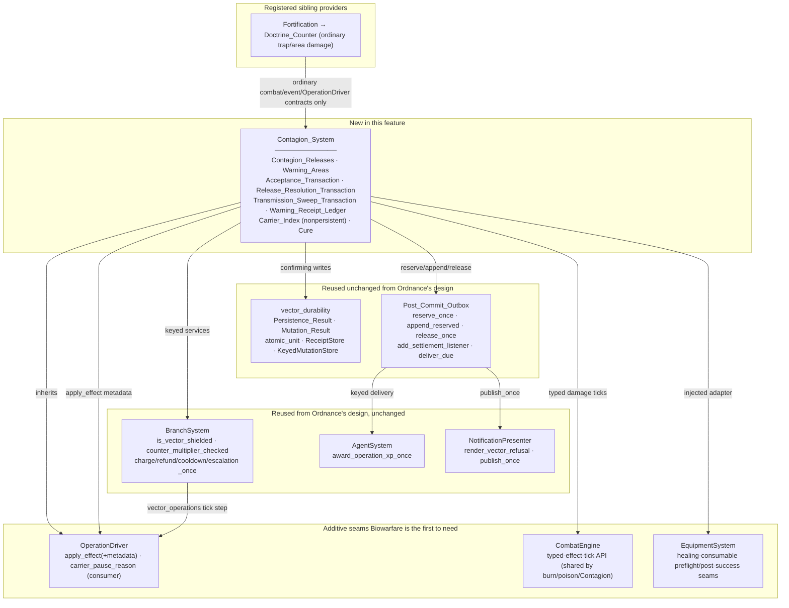
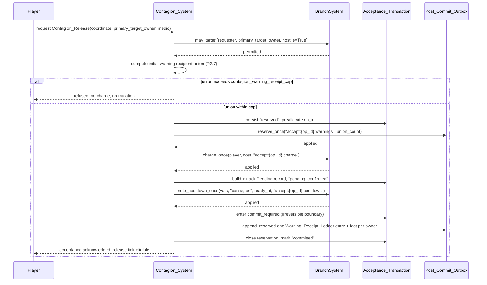
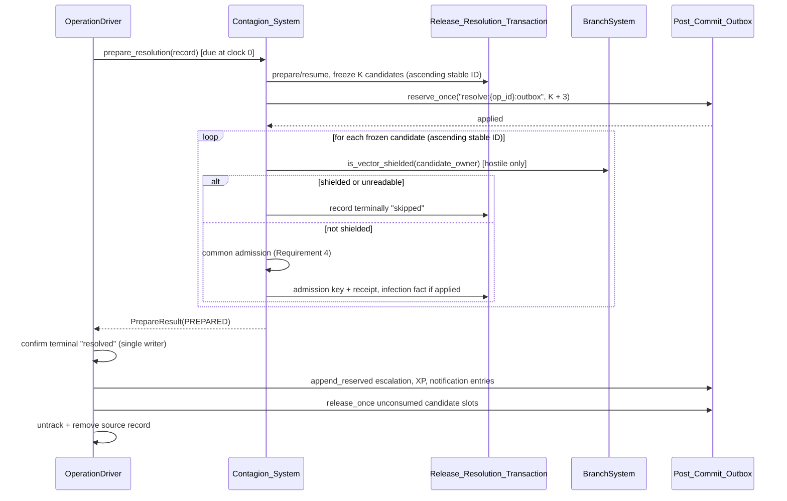
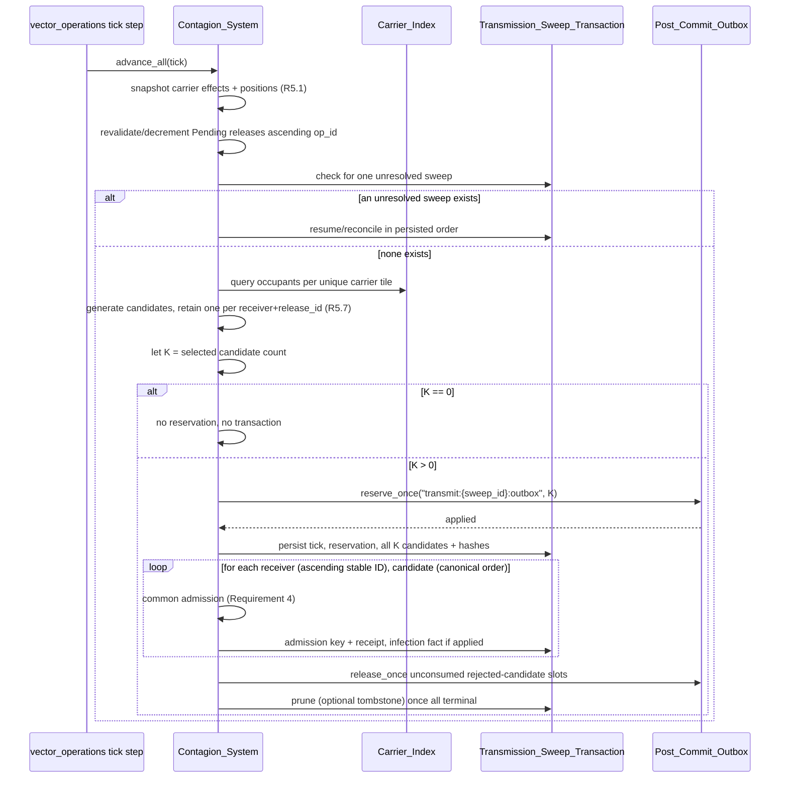
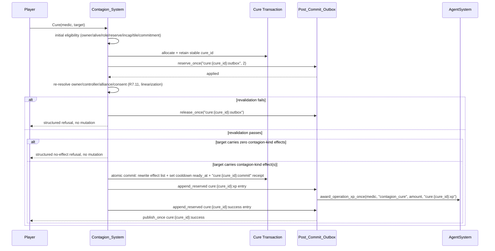
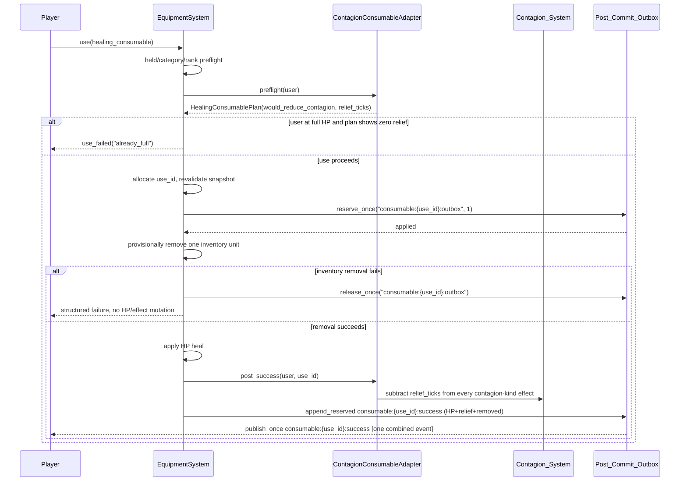

# Design Document

## Overview

This feature ships the **Biowarfare** Signature_Vector — **Contagion** — as the second of the six vector specs. It extends the shared contracts the Ordnance design (`.kiro/specs/tech-tree-vector-ordnance/design.md`) already defines and does not redefine them: `atomic_unit`, `Persistence_Result`, `Mutation_Result`, `ReceiptStore`, `KeyedMutationStore`, `Post_Commit_Outbox` (`reserve_once`/`append_reserved`/`release_once`/`validate_capacity_at_startup`/`set_publish_sink`/`add_settlement_listener`/`deliver_due`), `publish_once` on `NotificationPresenter`, the rollback/two-caches analysis, the owner-scoped receipt read, the sqlite3 serialization story, and ten of the eleven `OperationDriver` driver changes. Where this document says "per Ordnance's design", the cited section there is the normative definition; this document states only what Biowarfare adds or narrows on top of it.

Four things ship:

- **`Contagion_System`** — the `contagion` Vector_System. It owns Contagion_Releases, Warning_Areas, the Warning_Receipt_Ledger, transmission sweeps, explicit medic Cure, and the healing-consumable relief seam. It supplies the five required hooks and overrides one additive optional hook, `carrier_pause_reason`.
- **Reused shared durability layer** — nothing new here; Biowarfare is the second consumer of exactly what Ordnance built.
- **New seams this feature is the first to need** — an additive metadata parameter on `OperationDriver.apply_effect` (R1.3/R1.4), a shared typed-effect-tick API on `CombatEngine` that burn and ordinary poison must also be rerouted through (R1.12–R1.15), a nonpersistent `Carrier_Index` on `Contagion_System` itself (R6), and injected `EquipmentSystem` preflight/post-success seams for the healing-consumable relief path (R8.1).
- **Seams this feature reuses from Ordnance's design unchanged** — `BranchSystem.is_vector_shielded`, `BranchSystem.counter_multiplier_checked`, `AgentSystem.award_operation_xp_once`, `BranchSystem.charge_once`/`refund_once`/`note_cooldown_once`/`note_escalation_once`, `OperationRecord.schema_version`/`vector_data`, and `carrier_pause_reason` itself, whose name, default, and consultation point Biowarfare's requirements fix and Ordnance's design was reconciled to (see "The `carrier_policy` conflict" below).

### The `carrier_policy` conflict, and how it was resolved

Ordnance's design originally introduced a hook named `carrier_policy(record) -> str | None`, added as a new call site inside `_advance_one` and defaulting to reproduce the shipped `_suspend_reason` body verbatim. Biowarfare's requirements — R1.1 ("SHALL override the additive runtime hook `carrier_pause_reason(record)`") and R1.21 ("THE OperationDriver SHALL expose the additive, vector-specific, read-only runtime hook `carrier_pause_reason(record)`, whose default returns no pause reason for existing vectors, and `_suspend_reason(record)` SHALL consult that hook after inherited fatal conditions have been evaluated") — fix a same-seam hook under a different name and a different, strictly additive contract: `_suspend_reason` stays the call site, keeps its shipped two checks, and gains one appended third check whose default answers `None`.

Ordnance's own requirements never fix `carrier_policy` by name anywhere; the name was Ordnance's discretionary design choice, not a requirement. Biowarfare's requirements are final and cannot be changed to match a sibling's naming. So this was not a genuine cross-spec conflict to arbitrate — Ordnance's design was reconciled to Biowarfare's fixed name and contract: the shared layer now exposes `carrier_pause_reason(record)` with an empty default consulted from inside the unmodified `_suspend_reason` body, and Ordnance overrides only `origin_fatal_reason` (its cancel-side hook), needing no override of `carrier_pause_reason` at all because its two suspend causes — carrier unavailability and lapsed `weapons` commitment — are already the shipped `_carrier_unavailable`/`_commitment_lapsed` checks `_suspend_reason` runs before ever reaching the new hook. That reconciliation is already applied to `tech-tree-vector-ordnance/design.md`; this document treats `carrier_pause_reason` as settled shared infrastructure, and Biowarfare is its first real consumer.

### Why this is not a second copy of Ordnance's durability chapter

Ordnance earned the durability layer's specification by solving the hard problem — atomic multi-attribute domain writes, the two-cache rollback hazard, sqlite3's serialization story, the settlement-gated terminal-removal split — once, generically. Biowarfare's Requirement 1 criteria 23, 30, and 31–32 restate `Persistence_Result`, `Post_Commit_Outbox`, and the reservation discipline in the same words Ordnance's requirements use, which is the two specs' shared Introduction language ("extends, does not create parallel versions of") made concrete: this document does not re-derive `atomic_unit`, does not re-argue why `select_for_update` is a no-op on sqlite3, and does not redraw the rollback/two-caches diagram. It cites the Ordnance sections that already prove those points and spends its own space on what Biowarfare adds: the effect schema and its damage path, transmission determinism, the Carrier_Index, Cure, and the consumable seam.

### The prepare shape Biowarfare actually needs, and why it differs from Signals

R1.27 restates the same result-preserving prepare protocol Ordnance's design specifies (`prepare_resolution` / `PrepareResult` / the driver-owned confirming terminal writer): `_resolve` calls `prepare_resolution` directly rather than through `_run_hook`, because `_run_hook` discards return values and cannot carry a `RETRY`/`SETTLED_NO_EFFECT`/`INDETERMINATE` outcome; only the driver's confirming writer persists `resolved` and its receipt. Biowarfare is a second consumer of that same seam, not a reason to add another one — but being a real consumer of it means overriding `prepare_resolution` itself, not only the required `on_resolve` hook (see "The five R1.1 hooks" above for why both are needed).

Where Biowarfare's own shape differs from a staged-commit vector (the kind Signals needs, with a separate `on_resolved_commit` seam that finalizes an effect only after terminal confirmation) is in when admission happens. R2.22 requires every frozen release candidate to reach a durable terminal outcome (`applied`, `rejected`, or a definitive `skipped`) **before** the OperationDriver may confirm `resolved`, untrack, or remove the record — the ordering is candidate admission first, terminal confirmation second, not the reverse. So Biowarfare's `prepare_resolution` override does the real work: it prepares or resumes the Release_Resolution_Transaction (R2.11), freezes the candidate snapshot, and drives every candidate through the common admission contract (Requirement 4) to a terminal outcome, returning `PREPARED` once every candidate is terminal and the transaction's own receipts (escalation, XP, notification) are reserved. Biowarfare implements the five required hooks R1.1 names, plus this one additive override of `prepare_resolution`; it does not override `on_resolved_commit`, and the shipped default — a no-op returning `confirmed` — is correct for it, because there is no post-terminal commit step left to do: everything that needs to happen before `resolved` already happened inside `prepare_resolution`.

## Architecture



### Ownership boundaries

**`Contagion_System` owns:** Contagion_Effect schema semantics and admission; the canonical coordinate and Primary_Target_Owner snapshot; the Acceptance_Transaction, Release_Resolution_Transaction, and Transmission_Sweep_Transaction; the Warning_Area index and Warning_Receipt_Ledger; the nonpersistent Carrier_Index; transmission candidate generation, shield filtering, and Counter_Web-checked arithmetic; Cure; and the healing-consumable adapter's Contagion-specific half.

**`Contagion_System` explicitly does not own:** lifecycle state (`OperationDriver`), targeting policy (`BranchSystem.may_target`, called once per release at request time per R2.5), damage arithmetic and death routing (`CombatEngine`'s typed-effect-tick API and the zero-HP route it delegates to), XP (`AgentSystem`), player-facing prose (`NotificationPresenter`), outbox capacity accounting (`Post_Commit_Outbox`), or the healing-consumable item/inventory mechanics (`EquipmentSystem`, which Biowarfare only adapts into).

**Fortification's Doctrine_Counter integration owns nothing on Biowarfare's side.** R3.9 requires the two systems to "communicate this counter only through the shared combat, event, and OperationDriver contracts" and "import neither sibling system directly" — Fortification deals ordinary trap or area damage to the live medic through `CombatEngine`, and the inherited fatal-carrier check cancels the Pending release exactly as any other carrier death would (R3.6, R3.8). Biowarfare adds no vector-specific counter-recognition code; the shipped fatal-check ordering is the entire mechanism.

## Components and Interfaces

### The five R1.1 hooks

```python
class ContagionSystem(OperationDriver, BaseSystem):
    operation_kind = "contagion"
    branch = "bio"

    def validate_target(self, ctx: Any) -> str | None: ...
    def build_record(self, ctx: Any) -> OperationRecord: ...
    def on_resolve(self, record: OperationRecord) -> None: ...
    def persistence_owner(self, record: OperationRecord) -> Any: ...
    def discover_records(self, planet_rooms: Any) -> Iterable[Any]: ...

    # The one additive optional hook this vector overrides (R1.1, R1.21):
    def carrier_pause_reason(self, record: OperationRecord) -> str | None: ...
```

Every signature above matches the shipped `OperationDriver` contract exactly (`operation_contract.py:1112`, `:1169`, `:1213`, and the driver's own `persistence_owner`/`build_record` declarations) rather than an invented result type: `validate_target` answers a plain refusal-key string or `None` (its caller `_check_target` reads exactly that), and `on_resolve` is `-> None` — it changes the world through `apply_effect`/`apply_typed_effect_tick` and the admission calls below, but it does not itself return a `PrepareResult`. That type is `prepare_resolution`'s answer, and `prepare_resolution` is a *separate* driver method `_resolve` calls directly, not through `_run_hook` (Ordnance's design, "Eleven changes to shipped behaviour," change 1). Its shipped default is a legacy adapter that maps a void `on_resolve` to `PREPARED` unconditionally — so a vector implementing only `on_resolve` gets no way to report `RETRY`, `SETTLED_NO_EFFECT`, or `INDETERMINATE` back to the driver.

**Biowarfare overrides `prepare_resolution` too, not only `on_resolve`.** This is necessary, not optional: R1.27 requires a due operation to "remain tracked at zero when preparation fails, when a required candidate mutation is `indeterminate`, when persistence is `rejected` before a terminal candidate receipt exists, when required outbox capacity is unavailable" — and R2.22 requires the driver to withhold `resolved` until every frozen candidate reaches a durable terminal outcome. Neither is expressible through the legacy adapter's unconditional `PREPARED`, because that adapter discards whatever `on_resolve` returns (`on_resolve` is declared `-> None` precisely because nothing downstream of it reads a return value). So `ContagionSystem.prepare_resolution` is the method that actually drives candidate admission and answers `PrepareResult`; `on_resolve` is implemented too, per R1.1's literal hook list, but as a thin body whose real work happens in the `prepare_resolution` override — consistent with how Ordnance's own `Ordnance_System` is structured, where `on_resolve` "SHALL participate only as the prepare half of the explicit resolution protocol" (Ordnance requirements R1.1) is achieved by putting the substantive logic in `prepare_resolution` while still declaring `on_resolve` to satisfy R1.1's required-five list. Biowarfare's R1.1 requires the same five hooks by name and separately requires (R1.27) exactly the behaviour only `prepare_resolution` can deliver, so this design commits to overriding both: `on_resolve` to satisfy the required-hook list, `prepare_resolution` to actually carry `RETRY`/`SETTLED_NO_EFFECT`/`INDETERMINATE` outcomes to the driver.

```python
class ContagionSystem(OperationDriver, BaseSystem):
    # ... the five required hooks above, plus:
    def prepare_resolution(self, record: OperationRecord) -> "PrepareResult": ...
```

**`validate_target`** runs the coordinate, radius, Primary_Target_Owner, medic-eligibility, and Plant_Origin checks (R2.2–R2.5, R3.1–R3.2) inside the inherited ordered validation chain, and calls `BranchSystem.may_target(requester, primary_target_owner_ref, hostile=True)` exactly once (R2.5) — the single call the requirements name; nothing else in this vector calls `may_target` again, including collateral (R2.13, R5.6).

**`build_record`** sets `OperationRecord.target_ref` to the Primary_Target_Owner (R2.5), persists the medic's exact coordinate as `Plant_Origin_Tile` (R3.3), and writes the version-1 `vector_data` payload defined below (R1.20).

**`on_resolve`** and **`prepare_resolution`** together are the result-preserving prepare pair discussed above: `prepare_resolution` prepares or resumes the Release_Resolution_Transaction, freezes the candidate snapshot (R2.11), and drives every candidate to a terminal admission outcome before answering `PREPARED` (R2.22); `on_resolve` is implemented to satisfy R1.1's required-hook list and performs no terminal write of its own (R1.27).

**`persistence_owner`** returns the accepting player — the same owner the Acceptance_Transaction, the Pending record, and the terminal receipt live on. See "Persistence-owner choice" below for why this is the accepting player rather than the medic or the target.

**`discover_records`** is the restart rebuild hook; it takes the same `planet_rooms` argument the shipped driver's call site always supplies and yields durable owners, exactly like every other vector, and reads each owner's `vector_operations` container through the unchanged `_read_records`.

**`carrier_pause_reason`** is Biowarfare's one required override of an optional hook, and its contract is fixed word-for-word by R3.4: it "SHALL return a pause reason if the same `carrier_ref` is no longer actively assigned as an eligible `medic`, enters reserve, becomes incapacitated, is not In_World, or is not at the exact Plant_Origin planet and coordinate." `_suspend_reason` (unchanged, per Ordnance's design) consults this hook after its own two inherited checks (`_carrier_unavailable`, `_commitment_lapsed`) — so a Contagion release additionally suspends for a reason no other vector has: the medic leaving the exact Plant_Origin tile. Biowarfare overrides no lifecycle writer and creates no second suspend/resume path (R3.4); `_suspend_reason`'s single inherited transition remains the only writer.

### Persistence-owner choice

The accepting player is the persistence owner, for the same reason Ordnance chose the launching player over the Designation_Holder or the target: `persistence_owner` must return an object stable across the whole operation lifecycle, on which `vector_operations` and its terminal receipt can live without the record depending on an object the vector does not control the lifetime of.

- **Not the medic.** The medic (`carrier_ref`) is a controllable agent, not a player-level persistence root, and R3.6 requires the operation to cancel — not merely lose its storage — when the medic dies. Storing the record on the medic would tie the Pending release's persistence to an agent object whose own lifecycle (death, reassignment, deletion) is exactly the thing the vector must react to, not depend on for storage.
- **Not the Primary_Target_Owner.** The target never consents to holding the attacker's operation data, and R9.7 requires dormancy and every other lifecycle fact to be enforceable "from the metadata on each applied effect even after its Operation_Record has become terminal and disappeared" — i.e. the applied Contagion_Effect (stored on each recipient) is deliberately decoupled from the Operation_Record's storage location precisely so the record's owner and the effect's carriers can differ freely.
- **The accepting player** is who pays the `bio` Branch_Commitment cost, owns the Culture Vats, and is the escalation/XP attribution root (R2.5, R2.16). It is exactly the object every other vector already uses this way, so `persistence_owner` needs no new precedent.

### `vector_data` schema for a Contagion_Release

R1.20 fixes the exact field list. Per-value types follow the same immutable-by-value discipline Ordnance's design established for `vector_data` (deep-copied on every read/write, R1.19):

| Field | Type | Mutability | Fixing criterion |
| --- | --- | --- | --- |
| `release_id` | `str` (equals top-level `op_id`) | immutable | R1.20 |
| `primary_target_owner_ref` | stable owner reference (equals top-level `target_ref`) | immutable | R1.20 |
| `release_planet` | canonical planet reference | immutable | R1.20 |
| `release_x`, `release_y` | `int` | immutable | R1.20 |
| `affected_radius` | `int` | immutable | R1.20 |
| `raw_damage` | `int` | immutable | R1.20 |
| `effect_duration_ticks` | `int` | immutable | R1.20 |
| `release_delay_ticks` | `int` | immutable | R1.20 |
| `minimum_response_window_ticks` | `int` (snapshotted floor) | immutable | R1.20 |
| `carrier_ref` | stable medic reference (equals top-level `carrier_ref`) | immutable | R1.20 |
| `plant_origin_planet` | canonical planet reference | immutable | R1.20 |
| `plant_origin_x`, `plant_origin_y` | `int` | immutable | R1.20 |
| `agent_xp_contagion_snapshot` | `int` | immutable | R1.20 |

**Deliberately excluded from `vector_data`, and where each actually lives instead** (R1.20's second sentence, which is as load-bearing as its field list): the initial Warning_Area marker and its publication tick live in the Acceptance_Transaction (R2.6, R2.17); direct-warning receipts live in the Warning_Receipt_Ledger, a third container separate from both the Operation_Record and the transaction (R2.7, R2.20); warned-owner identities live in the Post_Commit_Outbox's warning entries. Discovery or rebuild that finds a legacy record whose data cannot safely establish the required release values logs, isolates, and discards it rather than inventing a coordinate, identity, timing, warning, or lifecycle value (R1.20's last sentence).

### The four durable transactions

Biowarfare needs four durable transactions where Ordnance needed two (Acceptance_Transaction, Strike_Resolution_Transaction), because transmission is a second, independent recurring event Ordnance's single-shot area strike never had to model.

| Transaction | Keyed by | Owns | Fixing requirement |
| --- | --- | --- | --- |
| **Acceptance_Transaction** | preallocated `op_id` | initial warning recipient union, `accept:{op_id}:warnings` reservation, charge, Pending entry, cooldown, initial Warning_Area publication, compensation phases | R2.6, R2.7, R2.17–R2.19 |
| **Release_Resolution_Transaction** | `release_id` (equals `op_id`) | frozen candidate snapshot, per-candidate admission keys/receipts, the `K + 3`-slot `resolve:{op_id}:outbox` reservation | R2.11, R2.21–R2.23 |
| **Transmission_Sweep_Transaction** | stable `sweep_id` | one frozen sweep's `K` selected candidates, the `transmit:{sweep_id}:outbox` reservation, per-candidate admission keys | R5.15, R6.11 |
| **Warning_Receipt_Ledger** | `(release_id, canonical_owner_id)` | one entry per warned owner, replay-safe, separate from `vector_operations` and from the Acceptance_Transaction | R2.7, R2.9, R2.20 |

Each is persisted "separately from the Operation_Record" (R2.21), which is the same design choice Ordnance made for its own transactions and receipts: none of the four lives inside `vector_operations`'s bare-list shape, and none of them is required to survive only as long as the source record does — R2.10, R2.22, and R6.11 each separately require a transaction or ledger to outlive terminal removal until its own settlement completes.

### Reservation IDs and exact slot counts

Every reservation ID below is fixed by name and every slot count is fixed by an explicit criterion — none is inferred.

| Reservation ID | Slot count | What each slot authorizes | Fixing criterion |
| --- | --- | --- | --- |
| `accept:{op_id}:warnings` | `union_count` (exact size of the frozen initial direct-warning recipient union) | one `(release_id, canonical_owner_id)` Warning_Receipt_Ledger entry + outbox fact per warned owner | R2.7 |
| `resolve:{op_id}:outbox` (Release_Resolution_Transaction's reservation) | `K + 3` (`K` = frozen candidate count) | one possible infection entry per candidate, plus one slot each for escalation, XP, and release-resolution notification | R2.21 |
| `transmit:{sweep_id}:outbox` | `K` (exact finite selected-candidate count for that sweep) | one possible infection entry per selected transmission candidate | R5.15 |
| `warn:{op_id}:entry:{owner_id}` (stable late-warning ID, one per late entrant) | `1` | one optional direct warning dispatched to an owner who entered the warned area after publication | R2.9 |
| `cure:{cure_id}:outbox` | `2` | one XP entry + one success-notification entry | R7.7 |
| `consumable:{use_id}:outbox` | `1` | one combined HP-heal-plus-Contagion-relief success event | R8.4 |

**The stable late-warning reservation ID's schema.** R2.9 requires "the stable late-warning reservation ID for that release and owner" but does not spell its literal template; this design fixes it as `warn:{op_id}:entry:{owner_id}`, mirroring the shape every other reservation ID in this feature already uses (`{phase}:{operation-identity}:{qualifier}`) and matching the `warn:` reservation cited in Ordnance's design for its own later-entry warning path (`tech-tree-vector-ordnance/design.md`, the movement-entry-index section) — Biowarfare reuses that exact naming shape rather than inventing a second one, since both vectors solve the identical "an entity enters a warned area after publication" problem. One slot authorizes at most one direct warning to that one owner for that one release; a second entry attempt by the same owner replays the existing Warning_Receipt_Ledger receipt rather than reserving again (R2.9).

**The Release_Resolution_Transaction's reservation ID's literal template.** R2.21 fixes the slot count (`K + 3`) and every slot's purpose but, like the late-warning ID above, does not spell a literal reservation-ID string. This design fixes it as `resolve:{op_id}:outbox`, the identical literal Ordnance's design already uses for its own `K + 3`-shaped Strike_Resolution_Transaction reservation (`reserve_once("resolve:{op_id}:outbox", intents + 3)`, in the impact lifecycle flow there) — reused rather than reinvented, since both vectors reserve the same shape (one slot per candidate plus three fixed post-resolution slots) under the same `resolve:` phase prefix every other resolution-time reservation in this feature already follows.

### Mutation keys

| Mutation key | Fixing criterion |
| --- | --- |
| `accept:{op_id}:charge` | R2.18, R1.25 |
| `accept:{op_id}:refund` | R2.19, R1.25 |
| `accept:{op_id}:cooldown` | R2.18, R1.25 |
| `resolve:{op_id}:escalation` | R2.5, R1.25 |
| `resolve:{op_id}:xp` | R2.16, R1.25 |
| `release:{release_id}:recipient:{stable_id}` (admission key; its infection event is that key plus `:infection`) | R2.14, R4.9, R12.15 |
| `transmit:{sweep_id}:receiver:{receiver_id}:release:{release_id}` (admission key; its infection event is that key plus `:infection`) | R5.15, R12.15 |
| `cure:{cure_id}:commit` | R7.7, R1.25 |
| `cure:{cure_id}:xp` | R7.10, R1.25 |
| `cure:{cure_id}:success` | R7.13, R1.25 |
| `resolve:{op_id}:notification` | R2.21 |

Every one of these follows the shared `Mutation_Result` discipline Ordnance's design fixes: an original `applied` or `rejected` outcome commits atomically with its domain mutation, a same-key/same-payload replay answers `duplicate(prior=<original_outcome>)` without a second effect, a same-key/different-payload replay answers `conflict` and fails closed, and a receiptless capacity `rejected` never later replays as `duplicate(prior=rejected)` (R1.24, R1.30, R1.25).

## Data Models

### `Contagion_Effect`

Persisted by value inside the existing `db.active_effects` list on the affected entity, using exactly the four-key legacy shape (`type`, `damage`, `ticks_remaining`, `source`) the shipped `tick_effects_on_entity` (`combat_engine.py:860`) already reads, plus the version-1 fields R1.5 adds:

```python
{
    "type": "poison",                  # legacy discriminator; shared tick reads this
    "damage": raw_damage,              # legacy field name; holds Raw_Damage
    "ticks_remaining": ticks_remaining,
    "source": source_ref_or_none,      # legacy fallback attribution (R1.17)

    # Version-1 additions (R1.5):
    "schema_version": 1,
    "effect_kind": "contagion",
    "release_id": release_id,          # immutable, equals the accepting op_id
    "source_ref": source_ref,          # immutable; wins over legacy "source" (R1.17)
    "origin_planet": origin_planet,    # immutable canonical planet reference
    "generation": generation,          # immutable int, 0 for a direct release
    "applied_tick": applied_tick,      # immutable
}
```

**Why the legacy four-key shape is kept rather than replaced.** R1.10 requires "THE shared active-effect reader SHALL continue to read and tick legacy four-key burn and poison entries, and SHALL not infer `effect_kind = "contagion"` for an entry that lacks that value" — so a Contagion_Effect is a strict superset of the legacy mapping shape, never a parallel structure the reader must special-case by absence of fields. `type` is always `"poison"` for a Contagion_Effect (R1.5), which is what lets the shared DoT branch in `tick_effects_on_entity` recognize it as damaging without reading `effect_kind` at all; `effect_kind` exists purely so criterion consumers (admission caps, Cure, the consumable seam, dormancy) can select Contagion entries specifically, without also selecting ordinary poison.

**Immutability boundary (R1.8).** `release_id`, `source_ref`, `origin_planet`, `generation`, `damage` (Raw_Damage), and `applied_tick` are immutable once admitted; only `ticks_remaining` may decrease. Every reader, ticker, admission path, Cure path, and consumable path enforces this through read-copy-write reassignment of the whole `active_effects` list (R1.7) — never an in-place mutation of one entry — which is the same discipline the shipped `apply_effect` above already uses at `store.active_effects = effects` and the same one `_persist_owner` uses for `vector_operations`.

**Malformed-entry isolation (R1.11).** An entry that is not a mapping, names an unsupported schema version, or has malformed required fields for its `effect_kind` is skipped and logged in isolation; every other readable entry on the same entity continues processing unaffected. This is the same per-entry isolation discipline R2.15 and R4.10 apply to release/transmission candidates, and the same discipline R1.18 applies to a version-1 `OperationRecord` missing required Contagion metadata — see Property 2 and Property 17 in the correctness properties section below.

### `Designation`-equivalent: there is none

Ordnance's Designation is a durable, shareable, capacity-capped observation value with its own reservation lifecycle. Biowarfare has no equivalent value object: a release names a coordinate and a Primary_Target_Owner directly at request time (R2.1, R2.4), validated once through `may_target` and never persisted as a reusable, transferable observation. This is a real asymmetry between the two vectors' domain models, not an omission — Biowarfare's Introduction and R2.1 both describe one hostile request producing one release, with no analogue to Ordnance's Designation_Holder/Designation_Producer/target-sharing consent chain.

### `Acceptance_Transaction` — Biowarfare's shape

Reuses Ordnance's Acceptance_Transaction concept and phase vocabulary (`reserved`, `charged`, `pending_confirmed`, `commit_required`/`committed`, `compensating`, `compensated`, `indeterminate` — R2.17) but with Biowarfare-specific contents: the frozen initial warning recipient union and its `accept:{op_id}:warnings` reservation (R2.7) replace Ordnance's single-target Warning_Area publication with a multi-recipient one, because a Contagion release's public warning is inherently area-based rather than point-based.

### `Release_Resolution_Transaction`

Analogous in role to Ordnance's Strike_Resolution_Transaction (both are the durable per-operation impact record) but keyed by `release_id` rather than by a strike's `op_id` under a different name, since for Biowarfare the two are the same value (R2.21 says "release ID" and R1.20 sets `release_id` equal to top-level `op_id`). It stores the frozen candidate stable IDs in ascending order (R2.11, R5.10), never a building (R2.11 explicitly excludes buildings from Contagion release/transmission candidates, unlike Ordnance's area strike which retains buildings), each candidate's admission key/receipt/infection-event triple, and the `K + 3`-slot reservation.

### `Transmission_Sweep_Transaction`

Has no Ordnance analogue — Ordnance never re-evaluates a completed strike on a later tick. It exists because R5 requires transmission to run every Contagion sweep as a recurring, deterministic process: one carrier-effect snapshot, decayed candidate generation, cross-carrier retained-candidate selection, and bounded admission, all re-derived fresh each sweep from that sweep's own snapshot (R5.1, R5.10). At most one is ever unresolved at a time (R5.15, R6.11); a second `sweep_id` is never allocated while the first remains unsettled.

### Carrier_Index

A **nonpersistent** structure — the one deliberately non-durable value object in this feature, and stated as such rather than left ambiguous, because R6.1 fixes it that way: "THE Contagion_System SHALL maintain a nonpersistent Carrier_Index keyed by canonical `(planet, x, y)` and containing only In_World entities with at least one valid unexpired Contagion_Effect." It is rebuilt once at startup from the already-cached effect-capable entity roster (R6.5) and maintained incrementally afterward from active-effect add/decrement/expiry/cure/consumable-relief/respawn-clear events, coordinate-movement events, death events, and world-entry/world-exit events — never from a per-tick entity scan (R6.2). Ordnance has no equivalent because Ordnance never needs to answer "which entities currently carry an effect, grouped by tile" — that question exists only because transmission is spatial and recurring.

```python
class CarrierIndex:
    """Nonpersistent, rebuilt at startup, maintained incrementally (R6.1-R6.5)."""

    def __init__(self) -> None:
        self._by_tile: dict[tuple[Any, int, int], set[str]] = {}   # (planet, x, y) -> stable_ids

    def rebuild_once(self, effect_capable_roster: Iterable[Any]) -> None: ...  # R6.5, R6.6
    def on_effect_added(self, entity: Any) -> None: ...
    def on_effect_removed(self, entity: Any) -> None: ...          # expiry, cure, relief, respawn-clear
    def on_moved(self, entity: Any, old_tile, new_tile) -> None: ...
    def on_world_exit(self, entity: Any) -> None: ...
    def on_world_entry(self, entity: Any) -> None: ...
    def carriers_at(self, planet: Any, x: int, y: int) -> frozenset[str]: ...
```

Its rebuild is a one-time pass over an already-cached roster the composition root hands it (R6.5) — not a second database or object-database scan — and a malformed effect entry or an entity lacking canonical coordinates is skipped and logged individually without aborting the rest of the rebuild (R6.6).

## New seams on shipped components

Each seam below is classified additive, opt-in, or behaviour-change-for-every-vector, with the criterion that forces the classification — following the same discipline Ordnance's design used for its eleven `OperationDriver` changes, and checked against the same shipped call sites rather than asserted.

### `OperationDriver.apply_effect` — additive metadata parameter

**Shipped today** (`operation_contract.py:3857`): `apply_effect(self, record, target, effect_type, damage=0, ticks=1) -> bool`. It builds exactly the four-key mapping (`type`, `damage`, `ticks_remaining`, `source`) and appends it via read-copy-write to `target`'s `active_effects` (verified: the append at `:3924`-`:3930`, the reassignment `store.active_effects = effects` at `:3931`).

**The change** (R1.3, R1.4): one new optional `metadata: dict | None = None` parameter.

```python
def apply_effect(
    self, record, target, effect_type, damage=0, ticks=1,
    metadata: dict | None = None,
) -> bool: ...
```

**Classification: additive.** R1.3 fixes this explicitly: "THE shared `OperationDriver.apply_effect` API SHALL be extended additively with an optional metadata input, so that every existing caller using only `record`, `target`, `effect_type`, `damage`, and `ticks` retains its existing call and result contract." The default `None` means every existing call site — there are none in shipped production code today per the same ground-truth Ordnance's design established (no production `OperationDriver` subclass exists yet), but the *contract* must hold regardless — sees byte-identical behaviour: the four legacy keys are built exactly as before, and nothing about the base effect's `type`, `damage`, `ticks_remaining`, or legacy `source` values can be overwritten by supplied metadata (R1.4). Implementation: `apply_effect` copies `metadata` (a fresh copy, never the caller's own dict — R1.19's "never aliases a caller-owned input" discipline applies here too) and merges it into the appended mapping only for keys outside that reserved four, i.e. `schema_version`, `effect_kind`, `release_id`, `source_ref`, `origin_planet`, and `generation` for Biowarfare's own call.

### `CombatEngine` — the shared typed-effect-tick API

**Shipped today.** `tick_effects_on_entity` (`combat_engine.py:860`) is the sole per-entity effect-tick entry point. Its DoT branch (`:895`-`:909`) calls `self._apply_damage(entity, dmg, source)` directly — a bare integer subtraction that bypasses `_calculate_damage`'s typed-resistance dispatch (`:1215`-`:1226`), chip-damage floor (`:1230`-`:1239`), and rank-gap damage damping (`:1241`-`:1248`) entirely, because those three live inside `_calculate_damage`, which only a direct-hit path (`apply_direct_hit`/`apply_direct_hit_once`) calls. `_apply_damage` itself (`:2547`) does apply shield-before-HP draining via `_drain_shield` (`:2559`, helper at `:2566`-`:2581`), so shield absorption is already shared between direct hits and DoT ticks — but typed resistance, the chip floor, and rank-gap damping are not. Zero-HP routing already goes through the shared `_handle_zero_hp` (`:906`, dispatching to the same three defeat handlers a direct hit uses), and rank-gap XP/loot damping already lives downstream of that dispatch inside `_handle_player_defeat` (`:1483`-`:1493`), so a DoT kill already receives the correct XP/loot damping for free — it is only the **damage** side (typed resistance, chip floor, rank-gap damage multiplier) that a bare `_apply_damage` call skips today.

**The requirement.** R1.12–R1.15 require one shared typed-effect-tick API that burn, ordinary poison, and Contagion must all route through, applying "the current typed-resistance axis, the current chip-damage floor, current shield absorption, current rank-gap damage damping, and the shared zero-HP death route" (R1.13) uniformly.

```python
class CombatEngine:
    def apply_typed_effect_tick(
        self, target: Any, raw_damage: int, damage_type: str, source: Any,
    ) -> int:
        """Apply one DoT tick with the same pipeline a direct hit uses (R1.12-R1.15).

        Delegates to the existing private helpers rather than re-deriving them:
        typed resistance via ``_get_target_typed_resist`` (the same branch
        ``_calculate_damage`` takes for a non-physical ``damage_type`` at
        ``:1225``-``:1226``), the chip floor via ``_chip_damage_min_fraction``
        (``:1250``), rank-gap damage damping via ``_rank_gap_damage_mult``
        (``:1307``), then ``_apply_damage`` for shield-before-HP application
        (``:2547``), then ``_handle_zero_hp`` on a lethal result (``:527``) —
        which already dispatches to the handler that applies rank-gap XP/loot
        damping (``_handle_player_defeat:1483``-``:1493``) with no new code.

        Never executes on-hit typed-effect creation or weapon-proc logic
        (R1.14), so a tick cannot recursively create another DoT.

        Returns:
            The net damage actually applied (post-resistance, post-floor,
            post-rank-gap, pre-shield-absorption accounting is internal).
        """
```

**Classification: additive for the API's existence, but a behaviour change for burn and ordinary poison's own damage numbers — named honestly rather than glossed.** Adding `apply_typed_effect_tick` as a new method is purely additive; nothing shipped calls it yet. But R1.12's "every damaging active effect, **including burn, ordinary poison, and Contagion**, SHALL use that API" requires `tick_effects_on_entity`'s DoT branch itself to change — burn and ordinary poison's `_apply_damage(entity, dmg, source)` call at `:902` is replaced by a call to `apply_typed_effect_tick`. That is not additive by the definition Ordnance's design uses (a change that alters shipped behaviour for every existing caller with no way to opt out): a burn or poison tick against a target with nonzero typed resistance, an active chip floor, or an active rank-gap gap will now deal a different amount of damage than it does today, because those three factors did not apply to DoT ticks before. This design does not claim otherwise. The forcing criterion is R1.12 itself — it names burn and ordinary poison explicitly, not just Contagion — and the justification is that leaving them on the old bare-subtraction path while only Contagion used the new API would mean two different damage pipelines coexisting for what R1.14 calls the same class of effect (`fire`→burn, `poison`→ordinary poison and Contagion), which the requirement is explicit about disallowing ("a poison or Contagion_Effect to `poison`" — one mapping, one path).

**Why this is a materially different additivity argument than Ordnance's `apply_direct_hit_once`.** Ordnance's engine change added a new keyed transaction wrapper around existing direct-hit machinery with no change to what any existing caller received. Biowarfare's engine change **reroutes two existing damage sources through machinery they did not go through before**, which changes their numeric output for any target carrying nonzero typed resistance, a fractional chip floor, or a rank-gap situation. This design states that plainly rather than presenting the two as the same shape of change.

**Damage-type mapping (R1.14):** a burn ticks as `fire`; an ordinary poison or Contagion_Effect ticks as `poison`. `apply_typed_effect_tick`'s `damage_type` argument is supplied by the caller (`tick_effects_on_entity`'s DoT branch), derived from `effect["type"]` via the same `{"burn": "fire", "poison": "poison"}` mapping — `"poison"` covers both ordinary poison and Contagion because both share `type = "poison"` in the legacy four-key shape (see the `Contagion_Effect` schema above).

**Attribution (R1.14, R1.17):** the tick attributes to the effective source selected under R1.17 — `source_ref` first when present and readable, falling back to legacy `source` only for a readable legacy effect lacking `source_ref`. Selecting either leaves both stored fields unchanged.

### The Counter_Web-checked lookup that gates each Contagion tick

R1.15 requires the adapter to distinguish a **truly ownerless** recipient (which uses explicit `neutral(1.0)`, never a fallback) from an **owned** one, for whom exactly one `BranchSystem.counter_multiplier_checked("bio", target_branch)` result — reused unchanged from Ordnance's design — decides whether that tick fires:

```python
def contagion_tick_multiplier(self, recipient) -> tuple[float | None, str | None]:
    """Return (multiplier, skip_reason). multiplier is None iff the tick is skipped.

    - Truly ownerless recipient -> (1.0, None), explicit neutral, no Branch lookup (R1.15).
    - Owned recipient -> exactly one counter_multiplier_checked("bio", target_branch) call:
        neutral(1.0)            -> (1.0, None)
        advantage(m), m finite  -> (m, None)
        unavailable(reason)     -> (None, reason)   # no offensive tick this tick; clock still advances
        invalid(reason)         -> (None, reason)   # same; malformed response classifies here too
        unreadable owner/branch -> (None, "unreadable")
    """
```

A skipped tick still follows the normal stored-effect clock (`ticks_remaining` decrements regardless) — only the offensive damage call is withheld, and the skip is logged in isolation (R1.15). This is the same fail-closed discipline Ordnance's design applies to its own Counter_Web-checked lookup at impact; Biowarfare's is a per-tick, per-recipient instance of the identical rule rather than a new one.

### `EquipmentSystem` — healing-consumable preflight/post-success seams

**Shipped today.** `EquipmentSystem.use` (`equipment_system.py:676`) is a single-phase method: held/category/rank preflight, then apply-then-consume for a `"heal"` or `"buff"` effect (verified: the full-HP short-circuit at the `hp >= hp_max` check, `_apply_heal` then `handler.remove_supply` in that order, `use_failed` notifications per reason). There is no existing two-phase (side-effect-free-preflight, then commit) split anywhere in `use` today — apply and consume are adjacent statements in one method body, not two injectable seams.

**The requirement (R8.1).** "THE EquipmentSystem SHALL expose injected healing-consumable preflight and post-success seams, and THE composition root SHALL inject the Contagion_System adapter without either system importing the other directly." This is genuinely new structure, not a reuse of an existing hook — this design does not claim a shipped precedent that does not exist for the two-phase split itself, only for the general injected-adapter pattern Ordnance's design also uses (`combat_engine`/`branch_system` collaborators declared and injected, never imported at module scope).

```python
# equipment_system.py — additive
class HealingConsumablePlan:
    """Immutable, side-effect-free preflight answer (R8.2)."""
    would_reduce_contagion: bool
    contagion_relief_ticks: int          # the current contagion_consumable_relief_ticks snapshot

class EquipmentSystem:
    def set_healing_consumable_adapter(self, adapter: "ContagionConsumableAdapter") -> None: ...

class ContagionConsumableAdapter(Protocol):
    def preflight(self, user: Any) -> HealingConsumablePlan: ...          # R8.2, side-effect free
    def post_success(self, user: Any, use_id: str) -> None: ...          # R8.6, commits Contagion relief
```

**`preflight`** is side-effect-free (R8.2): it reads the user's current Contagion_Effects and the current `contagion_consumable_relief_ticks` and answers whether the use would reduce at least one valid effect, without mutating anything. `EquipmentSystem.use` consults it to decide the full-HP gate: today a full-HP user is refused outright (`already_full`); R8.3 requires that refusal to be withheld when the preflight plan shows the use would still reduce a Contagion_Effect, so a full-HP player with an active Contagion_Effect can still consume the item for its Contagion relief alone.

**`post_success`** is the commit half, called only after `EquipmentSystem.use` has confirmed the one-slot `consumable:{use_id}:outbox` reservation (R8.4) and provisionally removed exactly one inventory unit (R8.4). It subtracts the current `contagion_consumable_relief_ticks` from `ticks_remaining` on every `effect_kind = "contagion"` mapping via read-copy-write, removing each result at or below zero, and preserving ordinary poison, burn, and every unrelated effect untouched (R8.6).

**Atomicity and rollback (R8.5, R8.8, R8.9).** `EquipmentSystem.use`'s existing revalidate-then-mutate structure is extended: before any mutation, it allocates a stable `use_id`, revalidates the held item/rank/HP/effect snapshot under that use transaction, and reserves the one outbox slot. Inventory removal happens provisionally before healing or Contagion relief is applied; if that removal fails, neither HP healing nor any active-effect mutation commits, and the confirmed reservation is released via `release_once` (R8.5). If `preflight`/`post_success` raises, returns failure, observes a stale plan, or the effect rewrite/reserved success fact cannot persist, the provisional inventory removal, HP, and active-effect list all roll back to their pre-request values, no success notification publishes, and an indeterminate reservation or commit is retained for readback rather than treated as absence (R8.8). A hook failure is isolated to that one use; retrying the same `use_id` reuses its reservation and event ID without duplicating inventory consumption, relief, or publication (R8.9).

**One combined success event, not two (R8.7).** A successful use commits inventory consumption, HP healing, and Contagion relief atomically, with one `append_reserved` fact under `consumable:{use_id}:success` containing HP healed, relief applied, and effects removed — delivered through `publish_once` as a single structured event, never as separate healing and Contagion-relief notifications for the same use.

**The below-full-HP, zero-relief case (R8.10)** — a user below full HP whose preflight plan shows zero Contagion relief — preserves the shipped healing-consumable behaviour exactly, but now subject to the same pre-mutation one-slot reservation and single-combined-success-entry discipline as every other outcome; this is what keeps the ordinary `"heal"` path from becoming a second, unreserved code path alongside the new one.

### `BranchSystem.is_vector_shielded` and `counter_multiplier_checked` — reused unchanged

Both are defined normatively in Ordnance's design (`tech-tree-vector-ordnance/design.md`, the `BranchSystem` additive-API block) and Biowarfare adds no new seam for either — it is simply their second production consumer. `is_vector_shielded(target_owner)` gates every potential hostile release and transmission recipient (R2.13, R5.6): a shielded or unresolvable-owner recipient is skipped with no candidate created, and `may_target` is never called for that recipient — own and allied collateral bypass this hostile-only shield query entirely and remain indiscriminate, exactly as Ordnance's design specifies for its own collateral. `counter_multiplier_checked("bio", target_branch)` is called at most once per Contagion tick per the adapter above, using only the two affirmative variants (`neutral`, `advantage`) for arithmetic — never the legacy float `counter_multiplier` (R1.15's last sentence).

### Classification summary

| Seam | Component | Classification | Forcing criterion |
| --- | --- | --- | --- |
| `apply_effect(..., metadata=None)` | `OperationDriver` | additive | R1.3, R1.4 |
| `carrier_pause_reason` (override; hook itself is shared infrastructure, already additive per Ordnance's design) | `OperationDriver` | additive (Biowarfare's override) | R1.1, R1.21, R3.4 |
| `apply_typed_effect_tick` (the method) | `CombatEngine` | additive | R1.12 |
| Rerouting burn/poison's DoT branch through it | `CombatEngine` | **behaviour change for every existing DoT tick** (not opt-in — no flag) | R1.12, R1.13 |
| Healing-consumable preflight/post-success seams | `EquipmentSystem` | additive (new injected seam; no existing two-phase split to extend) | R8.1 |
| `is_vector_shielded`, `counter_multiplier_checked` | `BranchSystem` | reused unchanged (defined by Ordnance's design) | R2.13, R5.6, R1.15 |
| `award_operation_xp_once`, `charge_once`/`refund_once`/`note_cooldown_once`/`note_escalation_once` | `BranchSystem`/`AgentSystem` | reused unchanged | R2.16, Ordnance requirements R1.9 (defines the four `_once` APIs' shared `Mutation_Result` contract), R2.18 |
| `Post_Commit_Outbox.reserve_once`/`append_reserved`/`release_once` | shared outbox | reused unchanged | R1.30–R1.32 |
| Nonpersistent `Carrier_Index` | `Contagion_System` (new, not a shipped-component seam) | net-new, no shipped precedent | R6.1 |

Only one entry in this table is a behaviour change with no opt-out, and it is named as such rather than folded into "additive": rerouting the shipped DoT branch through the new typed-effect-tick API changes burn and ordinary poison's damage output against any target with nonzero typed resistance, a fractional chip floor, or an active rank-gap damper. Every other seam is additive, and the `Carrier_Index` is stated as having no shipped precedent — it is a wholly new nonpersistent structure, not an extension of anything that exists today.

## Lifecycle Flows

Each diagram's reservation count matches the slot table above exactly — every `reserve_once` call shown carries the same slot count the table fixes for that reservation ID.

### 1. Release acceptance



### 2. Release resolution (candidate admission)



### 3. Transmission sweep



### 4. Explicit medic Cure



### 5. Healing-consumable relief



## Determinism and Bounded Work

| Axis | Bound | Source |
| --- | --- | --- |
| Transmission sweep work | `O(C + O + K log K)` for `C` active indexed carriers, `O` occupants returned across unique carrier tiles, `K` generated candidates | R6.4, R12.9 |
| Occupant queries per sweep | exactly one per unique carrier tile, reused across every carrier effect on that tile | R6.3 |
| Candidate/receiver ordering | canonical: Raw_Damage descending, generation ascending, `release_id` lexical ascending, source-carrier stable ID lexical ascending; receivers by lexical stable ID | R5.7, R5.8 |
| Retained candidate per receiver+`release_id` | exactly one — highest Raw_Damage, then lowest generation, then lexically lowest source-carrier stable ID | R5.7 |
| Initial warning recipient union | bounded by `contagion_warning_receipt_cap` (validated `[1, 4096]`), refused before charge if exceeded | R2.7, R11.16 |
| Live Warning_Receipt_Ledger size | never exceeds the hard validated maximum `4096`, regardless of hot-reload cap changes | R2.20, R11.16 |
| Live unresolved Transmission_Sweep_Transaction count | at most one at any time | R5.15, R6.11 |
| Persistent live sweep storage | `O(K)` for one frozen sweep; never one live journal per processed tick | R5.15, R6.11 |
| Outbox live work (all vector workflows) | bounded by `vector_outbox_capacity`; release/transmission add `O(K)`, initial warnings add at most `contagion_warning_receipt_cap`, Cure adds 2, a consumable use or optional late warning adds 1 | R6.12 |
| Effect admission caps | `contagion_max_effects_per_entity` `[1, 64]`, `contagion_damage_cap` `[1, 1_000_000]` | R11.7, R4.5 |
| Carrier_Index rebuild | one pass over the already-cached roster at startup; no second scan | R6.5 |
| Ordinary per-tick work | no map-size, room, global-entity, or database scan | R6.4 |

No path performs a full-world, full-table, or object-database scan. Persistence order, discovery order, tracked-container order, occupant-query order, active-effect order, and mapping iteration are never tie-breakers (R5.14, R12.8).

## Balance and Validation

Thirteen new Balance_Config fields join the collected `SchemaValidator` pass (R11.1–R11.10), plus the shared global `vector_outbox_capacity` this feature's Contagion workflows also draw on but do not own or snapshot per-release:

| Field | Range/type | Cross-field rule |
| --- | --- | --- |
| `contagion_release_delay_ticks` | int, `[minimum_response_window_ticks, 3600]` | — |
| `contagion_release_radius` | int, `[1, 50]` | — |
| `contagion_radius` | int, `[1, 10]` | — |
| `contagion_damage_per_tick` | int, `[1, 1_000_000]` | `contagion_damage_cap >= contagion_damage_per_tick` |
| `contagion_damage_cap` | int, `[1, 1_000_000]` | see above |
| `contagion_duration_ticks` | int, `[1, 86400]` | `contagion_consumable_relief_ticks <= contagion_duration_ticks` |
| `contagion_transmission_decay` | finite non-Boolean real, `(0.0, 1.0)` exclusive both ends | — |
| `contagion_max_generations` | int, `[0, 100]` | — |
| `contagion_max_effects_per_entity` | int, `[1, 64]` | — |
| `contagion_consumable_relief_ticks` | int, `[1, 86400]` | see above |
| `contagion_cure_cooldown_ticks` | int, `[1, 86400]` | — |
| `agent_xp_contagion_cure` | int, `[0, 1_000_000]` | — |
| `contagion_warning_receipt_cap` | int, `[1, 4096]` | never exceeds hard max `4096` regardless of hot reload |
| `contagion_cost` (shipped, revalidated) | nonempty mapping, positive-int values | must contain ≥1 of `Circuits`/`Energy`/`Nexium` |
| `contagion_cooldown_ticks` | int, `[1, 86400]` | — |
| `contagion_max_in_flight` | int, `[1, 100]` | — |
| `agent_xp_contagion` | int, `[0, 1_000_000]` | — |
| `vector_outbox_capacity` (shared, not owned by this feature) | int, `[1, 1_000_000]` | validated at startup before any vector workflow mutates; rejected below confirmed current use |

Booleans are rejected everywhere an integer field is declared, NaN/infinity are rejected before range comparison for `contagion_transmission_decay`, and every error across every field is collected into one validation result before the load fails (R11.11).

**Hot reload never retunes a snapshot already taken.** A release's delay, minimum response floor, affected radius, Raw_Damage, duration, `Plant_Origin_Tile`, acceptance-time XP amount, cooldown `ready_at`, and initial warning inputs are all snapshotted at acceptance and untouched by a later reload (R11.12). A cap-lowering reload never evicts, clamps, merges, or rewrites an existing effect or ledger entry that already exceeds the new cap (R4.6, R11.14, R2.20, R11.16) — it only withholds new admissions until the entity's state falls back under both caps. The one deliberate exception is the Counter_Web relationship itself: each effect tick and each transmission decision reads the *current* decay, generation limit, duration, effect-count cap, Raw_Damage cap, and at most one current checked Counter_Web result (R11.13) — because R1.15 requires the "current" Branch relationship, not the one in force at admission.

## Error Handling

The posture differs by direction of harm, following the same asymmetry Ordnance's design states explicitly:

- **A refusal that could let a player keep resources or an item they should have lost never happens silently.** Every refused release, Cure, warning query, or consumable use leaves resources, inventory, active-effect lists, cooldowns, XP, tracked operations, the Carrier_Index, and public-warning state completely unchanged except for an immutable terminal rejected reservation receipt or finite-retention tombstone that itself owns zero slots and authorizes no event (R12.16).
- **A mutation that could silently duplicate an effect, a charge, or an XP award never happens without a receipt.** Every keyed mutation and every outbox append commits atomically with its receipt; a same-key/same-payload retry always replays the original outcome rather than repeating the effect (Ordnance requirements R1.9; R12.19 here).
- **Ambiguity is never resolved by assumption.** An `indeterminate` result from persistence, a reservation, or a keyed mutation retains its claim and is reconciled by positive readback under its original key — never treated as absence, never retried under a replacement key, never allowed to unblock a dependent decision (R2.10, R4.10, R5.14, R7.11).
- **A `conflict` always quarantines rather than guesses.** A same-key/different-payload result blocks the owning transaction (Release_Resolution_Transaction, Transmission_Sweep_Transaction, Acceptance_Transaction, or Cure transaction) from further progress until explicit reconciliation proves the authoritative payload; it is never converted to a terminal rejection or a completed no-op (R2.14, R4.9, R5.9, R7.8).
- **Per-entry isolation never lets one bad record stop the rest.** A malformed active-effect entry, an unresolvable candidate owner, or a malformed startup-roster entry is logged and skipped individually; every other readable entry, candidate, or roster member continues processing unaffected (R1.11, R2.15, R6.6).

Logging names the Operation_Kind, `op_id`/`release_id`/`cure_id`/`use_id`/`sweep_id` as applicable, and the affected candidate, recipient, or pair — matching the shipped driver's convention Ordnance's design also follows.

## Correctness Properties

Each traces to its own Requirement 12 property, using this design's earlier requirement/criterion numbering (`R2`, `R4`, etc.) for cross-references.

### Property 1: Effect identity is preserved end to end

For all valid version-1 Contagion_Effects, persisting, reading, copying, decrementing, and rewriting the active-effect list preserves `release_id`, `source_ref`, `origin_planet`, `generation`, Raw_Damage, and `applied_tick` exactly, including after the originating Operation_Record is removed.

**Validates: Requirements 12.1**

### Property 2: Malformed entries are isolated, never contagious

For all active-effect lists containing malformed and legacy entries, processing one malformed entry never changes whether any other readable entry ticks, persists, expires, cures, or receives consumable relief.

**Validates: Requirements 12.2**

### Property 3: Exactly one typed-effect-tick call per authorized tick, no recursive proc

For all readable damaging active effects with positive Raw_Damage, a burn or ordinary poison tick and every Contagion tick authorized by explicit ownerless `neutral(1.0)` or an affirmative checked result makes exactly one typed-effect-tick call and no recursive active-effect proc. An owned recipient whose owner, Branch, or checked lookup is unreadable/`unavailable`/`invalid` receives no offensive call that tick while its stored clock still advances. No Contagion_System path performs direct HP subtraction.

**Validates: Requirements 12.3**

### Property 4: Per-release uniqueness holds under every admission state

For all entities and `release_id` values, admission leaves at most one unexpired Contagion_Effect with that identity; a candidate encountering an existing same-release effect produces the original terminal `rejected` reason `already_present` and leaves that mapping byte-for-value unchanged apart from the ordinary tick.

**Validates: Requirements 12.4**

### Property 5: Admission caps are never bypassed, including by a lowered reload

For all admission states and current caps, a candidate is admitted if and only if no unexpired same-release effect exists and adding it keeps both count and aggregate Raw_Damage within their current caps; a rejection or `duplicate(prior=rejected)` replay evicts or rewrites no existing effect, including after a cap-lowering reload.

**Validates: Requirements 12.5**

### Property 6: Transmission decay is exact and generation-bounded

For all transmission chains, candidate Raw_Damage equals the floor of the selected carrier's Raw_Damage times the current decay, is at least 1, and candidate generation never exceeds the current configured maximum.

**Validates: Requirements 12.6**

### Property 7: A sweep's snapshot is its whole universe

For all sweeps, an effect absent from the start snapshot generates zero candidates in that sweep, while an effect admitted before `effect_ticks` takes its first damage tick that same tick if its entity is In_World.

**Validates: Requirements 12.7**

### Property 8: Determinism under every container/iteration order

For all permutations of tracked Pending releases, persistence discovery, carriers, occupants, active-effect entries, and mapping iteration, the frozen due set is identical; due releases apply by ascending `release_id`, each release's recipients by ascending stable ID, and transmission receivers/candidates follow their canonical order — no container order is ever a tie-breaker.

**Validates: Requirements 12.8**

### Property 9: Sweep work is bounded and independent of world size

For all sweeps with `C` active indexed carriers, `O` occupants returned across unique carrier tiles, and `K` generated candidates, occupant-query count equals the number of unique snapshotted carrier tiles and total work is `O(C + O + K log K)`, independent of map, room, global-entity, and database size.

**Validates: Requirements 12.9**

### Property 10: Offline entities are frozen, not damaged or drained

For all fully offline or lobby-removed intervals, an entity's `ticks_remaining`, HP, and transmission output are unchanged by elapsed game ticks; returning In_World resumes from exactly the retained state, unless respawn cleared it.

**Validates: Requirements 12.10**

### Property 11: Dormancy silences transmission without erasing damage

For all commitment histories, applied effects tick during source dormancy, emit no transmission while the persisted source lacks `bio` on `origin_planet`, and need no live Operation_Record to resume future transmission.

**Validates: Requirements 12.11**

### Property 12: Fatal cancellation always wins the same-tick race

For all same-tick Fortification carrier kills and release-clock expiry, death routing and inherited fatal cancellation settle before `_suspend_reason`, `carrier_pause_reason(record)`, or release resolution, leaving zero newly released effects and zero release XP.

**Validates: Requirements 12.12**

### Property 13: Cure is exactly-once under every race

For all Cure races, retries, crashes, and rebuilds, one durable `cure_id`, one confirmed two-slot reservation, and one `cure:{cure_id}:commit` receipt authorize at most one atomic effect-list rewrite and cooldown start; only an original applied outcome or its replay owns the one `cure:{cure_id}:xp` and one `cure:{cure_id}:success` entry; an original rejected outcome or its replay authorizes neither and releases both slots; indeterminate state retains its claim; conflict authorizes neither and quarantines. Caller serialization alone proves no exactly-once property.

**Validates: Requirements 12.13**

### Property 14: The consumable relief is atomic across reservation, inventory, HP, and effects

For all healing-consumable requests, a confirmed one-slot reservation precedes inventory, HP, and effect mutation. Every failure mode leaves inventory count, HP, and the active-effect list at their pre-request values with no success event; a confirmed unused slot is released while an indeterminate claim is retained. For all successes, exactly one unit is consumed, every Contagion_Effect receives exactly one relief subtraction, and the same atomic commit owns exactly one combined success entry.

**Validates: Requirements 12.14**

### Property 15: An admitted effect is never without its infection event

For all infection candidates, the fixed release or transmission event key is included in the admission payload hash; the effect-list change or terminal no-op, admission receipt, and (iff `applied`) the one reserved outbox fact are atomic, so no crash exposes an admitted effect without event eligibility. `duplicate(prior=applied)` replays the same fact under the same event ID; `conflict` retains and quarantines rather than becoming terminal progress.

**Validates: Requirements 12.15**

### Property 16: Refusals leave everything untouched but the receipt

For all refused release, Cure, warning-query, and healing-consumable requests, every player-visible and internal state named in Requirement 12.16 remains unchanged except the immutable terminal rejected reservation receipt or finite-retention tombstone, which owns zero slots and authorizes no event.

**Validates: Requirements 12.16**

### Property 17: Schema decoding and deep-value preservation are exact

For all `OperationRecord` constructions and payloads, `OperationRecord()` starts at version `1`, `from_dict({})` starts at version `0`, every malformed/absent/non-exact-integer/Boolean schema value decodes as `0`, unsupported versions are quarantined unrewritten, and every fallback `vector_data` is a distinct fresh mapping; unreadable storage remains `indeterminate`. For all valid version-1 records and nested `vector_data`, persist/read/discover/rebuild preserve every shipped field with deep value equality and no shared nested identity.

**Validates: Requirements 12.17**

### Property 18: The warning union and its cap hold under every permutation

For all accepted releases, permutations of initially present bodies and area/primary-target overlap produce one initial canonical owner union before charge and at most one immutable warning receipt per owner and release; a union above cap refuses before charge; a live ledger never exceeds `4096`, never evicts a live receipt, and never admits an unknown owner at or above the current cap.

**Validates: Requirements 12.18**

### Property 19: Persistence and mutation results mean exactly what they claim

For all shared persistence operations, `confirmed` implies durable acknowledgement or positive readback, `rejected` implies definite non-application, and ambiguity/unreadability remains `indeterminate`. For all keyed mutations, the mutation and its receipt are atomic; same-key/same-payload replay returns the prior result; same-key/different-payload replay returns `conflict`, mutates nothing, and quarantines until reconciliation.

**Validates: Requirements 12.19**

### Property 20: Acceptance crash recovery converges to exactly one outcome

For all crashes, timeouts, retries, and restarts at any Acceptance_Transaction phase, at most one `accept:{op_id}:charge` applies, and acknowledgment/ticking occurs if and only if Pending, keyed cooldown, the live Warning_Area marker, every initial warning receipt, and warning outbox facts are all durably confirmed. Before keyed cooldown confirmation, compensation settles through the confirming terminal writer and uses at most one linked refund; after it, recovery rolls forward only.

**Validates: Requirements 12.20**

### Property 21: Release resolution is exactly-once per candidate under replay

For all release-resolution crashes and replays, persisted recipient IDs and order are unchanged, each admission key produces at most one effect-list mutation, and an effect write never exists without its matching atomic receipt. The release stays tracked at zero until every candidate is terminal and terminal persistence is confirmed; its Release_Resolution_Transaction survives source-record removal until all post-commit work settles.

**Validates: Requirements 12.21**

### Property 22: Suspend/resume never refloors, and fatal cancellation always preempts

For all carrier-unavailability and commitment-lapse suspension intervals, resume restores exactly the held clock regardless of elapsed ticks or current config, and never reflowers or restarts it. For a competing physical carrier death, destroyed/deleted origin, or source-base loss, fatal cancellation wins before suspension or resolution.

**Validates: Requirements 12.22**

### Property 23: Every keyed retry uses exactly its fixed key, never the legacy API

For all acceptance, compensation, resolution, and Cure retries, Biowarfare uses exactly the fixed mutation keys this design's table lists and never the legacy unkeyed API; same-payload replay never duplicates a charge, refund, cooldown, escalation, XP award, or notification.

**Validates: Requirements 12.23**

### Property 24: Cure's linearization point, not its initial read, decides the outcome

For all Cure interleavings in which target ownership, medic control, alliance, or `support` consent changes after initial validation, the values re-resolved immediately before mutation inside the target/medic boundary decide the outcome; revocation or unreadability at that point leaves effects, cooldown, receipt, XP, and success notification unchanged.

**Validates: Requirements 12.24**

### Property 25: Warning cleanup never races a late duplicate dispatch

For all terminal warning cleanup interleavings, no Warning_Receipt_Ledger or warning-outbox entry is pruned until terminal persistence is confirmed, every later-entry path is disabled, and every related outbox entry is settled; rebuild retains unsettled bounded receipts without requiring the terminal Operation_Record, and pruning never permits a late duplicate dispatch.

**Validates: Requirements 12.25**

### Property 26: At most one unresolved sweep transaction, ever

For all transmission crashes and retries, at most one unresolved Transmission_Sweep_Transaction exists; its frozen identities, order, keys, hashes, and event IDs are unchanged across replay, and each admission/publication settles at most once. While unsettled, no later sweep is allocated, though Pending releases and ordinary ticks continue. Live persistent sweep state stays `O(K)` and never grows by one unresolved journal per tick.

**Validates: Requirements 12.26**

## Testing Strategy

Property tests carry the crash-safety and determinism claims, following the same strategy shape Ordnance's design used, extended for Biowarfare's own mechanisms:

1. **Effect identity round-trip (Property 1).** Persist, read, copy, decrement, and rewrite a version-1 Contagion_Effect across a simulated restart; every immutable field byte-equal before and after, including after the source Operation_Record is removed.
2. **Malformed-entry isolation (Property 2).** An active-effect list mixing legacy burn/poison, valid Contagion, and malformed entries: one malformed entry never changes whether any other entry ticks, persists, cures, or receives relief.
3. **Typed-effect-tick routing and no-recursion (Property 3).** Assert `apply_typed_effect_tick` is the only call site reached from `tick_effects_on_entity`'s DoT branch for burn, ordinary poison, and Contagion; assert it applies typed resistance, the chip floor, rank-gap damping, and shield-before-HP identically to a direct hit against the same target state; assert zero recursive effect creation from inside a tick.
4. **Per-release uniqueness and cap enforcement (Properties 4–5).** Property-test candidate admission against randomized existing-effect states and cap configurations, including a cap-lowering hot reload mid-test, asserting the admit-iff rule holds and no existing effect is evicted or rewritten by a rejection.
5. **Transmission decay and generation bound (Property 6).** Randomized carrier Raw_Damage and decay values: candidate Raw_Damage always equals `floor(carrier_raw_damage * decay)`, never below 1 is created, and generation never exceeds the configured maximum.
6. **Sweep snapshot isolation (Property 7).** An effect admitted mid-sweep never contributes a transmission candidate in that same sweep; it does take its first damage tick that tick.
7. **Determinism under shuffled order (Property 8).** Shuffle stored records, tracked lists, carrier snapshots, and mapping iteration order; assert the frozen due set, candidate order, and final admitted set are identical across every permutation.
8. **Bounded sweep work (Property 9).** Assert occupant-query count equals unique carrier tile count and total work is `O(C + O + K log K)` across a range of `C`/`O`/`K`, independent of unrelated world/room/entity counts.
9. **Offline freeze and resume (Property 10).** An entity taken offline mid-effect: `ticks_remaining`/HP/transmission output frozen for the offline interval; resumes from exactly the retained state on return.
10. **Dormancy silences transmission only (Property 11).** A source losing `bio` commitment: effect keeps ticking, transmission stops, and resumes on the next sweep after commitment is regained, with no Operation_Record required.
11. **Same-tick fatal-cancellation race (Property 12).** Fortification carrier kill landing in the same scheduler tick as release-clock expiry: assert Cancelled always wins, zero release XP, zero newly released effects.
12. **Cure exactly-once under race/retry/crash (Property 13).** Concurrent and retried Cure requests against the same target/medic pair, including simulated crash points at each Cure transaction phase: at most one commit, receipts converge correctly for applied/rejected/indeterminate/conflict.
13. **Consumable relief atomicity (Property 14).** Inject failure at each boundary (reservation, inventory removal, hook, effect-write, outbox-append): assert full rollback of inventory/HP/effects on every failure and exactly-once combined success on every success.
14. **Admission-event atomicity (Property 15).** Crash-point sweep across the common admission function: no interleaving exposes an admitted effect without its matching infection event eligible.
15. **Refusal non-mutation (Property 16).** Every refusal path (release, Cure, warning query, consumable) leaves every named piece of state byte-identical except the terminal rejected receipt/tombstone.
16. **Schema decoding exactness (Property 17).** `OperationRecord()` versions and `from_dict({})` edge cases, including out-of-range integers, non-mapping `vector_data`, and unreadable storage.
17. **Warning union and cap (Property 18).** Randomized overlapping area/primary-target bodies: exactly one canonical union, cap enforcement before charge, ledger never exceeding `4096` under any hot-reload sequence.
18. **Mutation-result semantics (Property 19).** Direct unit coverage of `applied`/`duplicate`/`conflict`/`rejected`/`indeterminate` for every keyed mutation this feature introduces.
19. **Acceptance crash-point sweep (Property 20).** Injecting `rejected`/`indeterminate` at every Acceptance_Transaction phase boundary and replaying: convergence to exactly one committed acceptance or one confirmed compensation.
20. **Release-resolution replay (Property 21).** Crash and replay at every candidate admission boundary: recipient order and keys unchanged, at most one mutation per key.
21. **Suspend/resume clock exactness and fatal preemption (Property 22).** Suspend for medic unavailability or commitment lapse, resume, and assert the exact held clock with no reflooring; race a fatal condition against a pending resume and assert fatal wins.
22. **Keyed-key exhaustiveness (Property 23).** Static/dynamic assertion that every Biowarfare mutation call site uses one of the fixed keys in this design's table and never the legacy unkeyed API.
23. **Cure linearization race (Property 24).** Change ownership/alliance/consent between initial validation and the Cure's mutation boundary; assert the linearization-time values decide the outcome.
24. **Warning cleanup ordering (Property 25).** Terminal a release with unsettled outbox entries; assert no pruning occurs until settlement, and rebuild retains unsettled receipts without the terminal record.
25. **Single unresolved sweep invariant (Property 26).** Crash mid-sweep and attempt to allocate a second `sweep_id`; assert refusal until the first is settled and pruned.

Three shipped suites are part of this feature's definition of done, reused from Ordnance's design rather than re-established:

- **`world/systems/tests/test_prop_operation_lifecycle.py`.** `carrier_pause_reason` is already classified in `DRIVER_ANSWER_TYPES` by Ordnance's design (as the reconciled name); this feature adds no new public `OperationDriver` method beyond the `apply_effect` metadata parameter, which changes an existing entry's signature rather than adding a new public method, so Property 24's completeness clause needs no new table entry for it. `REQUIRED_HOOKS` stays at five; Biowarfare implements exactly the five R1.1 names and overrides one already-optional hook.
- **`world/systems/tests/test_prop_operation_persistence.py`.** Biowarfare's `_persist`/`_persist_owner` round-trips exercise the same upsert-by-`op_id` and terminal-empty-container assertions every vector shares; `_source_removable`'s settlement gate (defined by Ordnance's design) must answer `True` only once every one of Biowarfare's own outbox reservations (`accept:...`, `resolve:...`, `transmit:...`) is settled, not merely once the terminal write commits — this is the suite where that ordering is exercised for a vector with actual registered outbox work, rather than the zero-outbox-work vector Ordnance's own suite coverage used as its baseline case.
- **`world/systems/tests/test_operation_contract.py`.** The `apply_effect` tests already present there (`:4784`-`:4790`) assert the legacy four-key append shape and the read-copy-write replacement discipline; this feature's tests extend that coverage with the metadata parameter and the version-1 fields, without changing what the existing assertions check.

Unit tests cover the Contagion_Effect value shape, coordinate/radius/Primary_Target_Owner validation, the Carrier_Index's incremental-update event handlers, `is_vector_shielded`/`counter_multiplier_checked` call-site discipline, presenter formatter coverage for every notification kind and refusal key this feature introduces, and collected balance validation across all thirteen new fields plus their cross-field rules.
