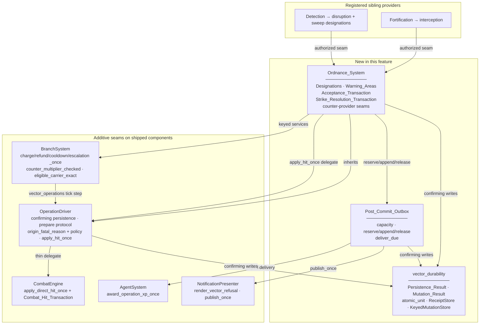
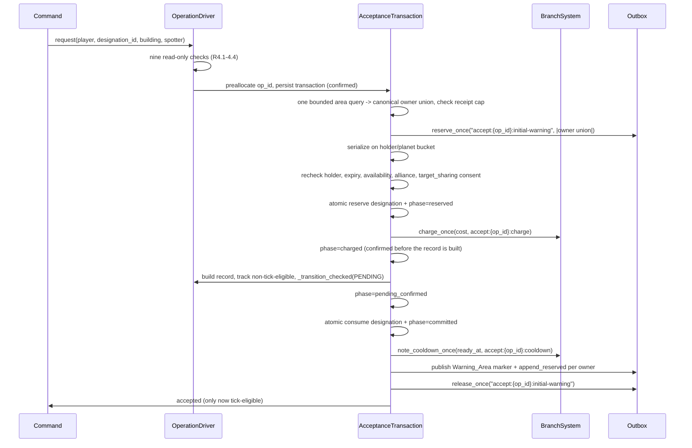
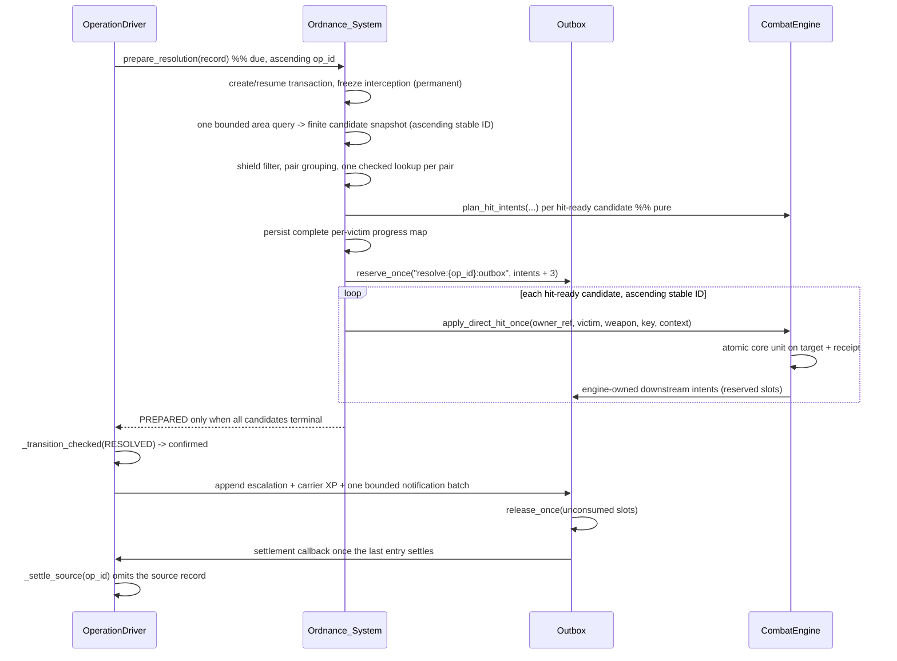

# Design Document

## Overview

This feature ships the **Ordnance** Signature_Vector — the **Strategic_Strike** — plus the additive shared contracts its requirements depend on. It is the first of the six vector specs, so it carries the shared durability layer that Biowarfare and Signals then reuse unchanged.

Three things ship:

- **`Ordnance_System`** — the `strategic_strike` Vector_System. It owns Designations, the Warning_Area index, impact resolution, and the two authorized counter-provider seams. It supplies five hooks and inherits the rest of the lifecycle.
- **The shared durability layer** — `Persistence_Result`, `Mutation_Result`, the keyed mutation store, and the capacity-governed `Post_Commit_Outbox`. Shared by all six vectors; it lives beside the Operation Contract, not inside Ordnance.
- **New seams on five shipped components** — `OperationDriver` (confirming persistence, resolution prepare protocol, origin/dormancy split, keyed hit delegate), `BranchSystem` (keyed mutations, checked Counter_Web, exact-candidate carrier), `AgentSystem` (keyed XP), `CombatEngine` (engine-owned keyed hit transaction), and `NotificationPresenter` (generic vector refusal plus the idempotent `publish_once` sink the outbox delivers through). Mostly additive or opt-in, but not entirely: three of the eleven `OperationDriver` changes alter shipped behaviour for every vector with no flag, and each is named with the criterion that forces it in "Eleven changes to shipped behaviour" below. The `CombatEngine` conjuncts stay additive for two different reasons, and they are not interchangeable: the three conjuncts *inside* the engine read the engine's **own** `is_death_pending` predicate and are inert because no shipped path writes the `death_pending` marker, while the conjuncts outside the engine take an injected predicate that reads as "not pending" when nothing is wired.

### The load-bearing design decision

The requirements repeatedly demand that a domain change and its immutable receipt commit **atomically**, and that `confirmed` mean durable acknowledgement rather than "the write did not raise".

Evennia attributes alone cannot supply that: they are separate rows with no write acknowledgement, and several of the shipped mutations this feature must key are spread across multiple attributes and multiple objects (`_apply_damage` writes `db.hp`, `db.shield`, and `db.shield_regen_accumulator`; `_finalize_hit` also writes `combat_lockout_tick` on up to **four** objects — the attacker at `combat_engine.py:460`, the target at `:462`, and each side's owning player at `:470` and `:472`). A "one attribute per atomic unit" rule would therefore be false for most of this feature.

The real primitive is the database underneath. Evennia attributes are Django rows, and this codebase already uses Django transactions directly (`world/channel_utils.py` wraps channel mutations in `transaction.atomic()`). So:

> **One atomic unit is one `django.db.transaction.atomic()` block that performs every domain write and writes its immutable receipt, with the participating owners' attribute rows locked in a canonical order.**

```python
# world/systems/vector_durability.py
@contextmanager
def atomic_unit(owners, *, lock_order_key=lambda o: getattr(o, "id", 0)):
    """One durable unit: lock the participating rows, then commit or roll back.

    On rollback every participating owner's handler cache is dropped, because
    Django rolls back rows and Evennia caches Attribute *instances* in two
    separate places. The drop reaches one of them; the read rule below is what
    makes the other one irrelevant (see "Rollback, and the two caches Django
    does not roll back" below).
    """
    from django.db import transaction
    ordered = sorted([o for o in owners if o is not None], key=lock_order_key)
    try:
        with transaction.atomic():
            for owner in ordered:
                _ensure_receipt_row(owner)   # the row must exist to be lockable
                _lock_attributes(owner)      # select_for_update where supported
            yield
    except BaseException:
        for owner in ordered:
            _invalidate_attribute_cache(owner)   # handler.reset_cache() only
        raise
```

Three consequences, each of which fixes a specific defect a single-attribute rule would have had:

1. **Receipts never live inside a legacy ledger.** Each owner gets one dedicated `vector_receipts` attribute. `BranchSystem._cooldown_map` and `_escalation_map` normalize their ledgers to `{kind: int}` and `{target_id: [int]}` and write back exactly what they read, so a receipt stored inside `vector_cooldowns` or `vector_escalation` would be erased by the next legacy `note_cooldown` / `note_escalation` call — calls R1.7 keeps working for other callers. A separate attribute written inside the same transaction is immune.
2. **Multi-attribute and multi-object domain changes are legal.** The hit's HP, shield, accumulator, and lockout writes, and the acceptance saga's holder-bucket plus payer plus record writes, are each one transaction.
3. **`confirmed` means the rows committed.** A transaction that returns without raising has committed those rows; one that raises has rolled them back entirely. Ambiguity is narrowed to the case where the process dies mid-commit or the connection is lost, which is exactly what `indeterminate` is for: recovery re-reads the receipt under a fresh transaction, and only a positive read of a well-formed container without the key is authoritative absence (R1.8, R12.17). "The rows" is the operative qualifier — see immediately below.

### Rollback, and the two caches Django does not roll back

Django rolls back **rows**. Evennia caches **Attribute instances** in two independent places — the per-object `AttributeHandler` backend cache and the process-wide idmapper `__instance_cache__` — and mutates the instance *before* saving it:

```python
def do_update_attribute(self, attr, value, strvalue):      # ModelAttributeBackend
    ...
    attr.value = value          # in-memory, and the instance is idmapper-shared
    attr.db_strvalue = None
    attr.save(update_fields=["db_strvalue", "db_value"])
```

`AttributeHandler.get` → `_get_cache` → `_get_cache_key` (`evennia/typeclasses/attributes.py:540`) returns that cached instance without re-querying whenever `TYPECLASS_AGGRESSIVE_CACHE` is on, which is the shipped default, and `do_create_attribute` (`attributes.py:1065`) ends in `_set_cache(key, category, new_attr)`. So a rolled-back `atomic_unit` leaves the *uncommitted* value readable through `obj.attributes` for the life of the process. Left alone, that is fatal to the whole durability layer: `ReceiptStore.find` would see a phantom key and return `duplicate(prior=applied)` for a mutation that never committed, and `confirm_absent` — the only source of authoritative absence — would inherit the same lie, making R12.17's "authoritative absence distinguishable from unreadability" unsatisfiable. And dropping that handler cache is **not** sufficient on its own, for the reason rule 2 below sets out.

Two rules, and every receipt and domain read in this feature obeys both:

1. **Reads inside a unit bypass the caches, and they are owner-scoped.** `ReceiptStore.read` / `find` / `confirm_absent`, and every domain read a `mutate()` body makes to decide its outcome, query the database directly under the open transaction. Two properties of that query are load-bearing, because getting either wrong silently answers from the wrong row or from a stale object:

   - **The filter goes through the `db_attributes` m2m table, with the owner id in it.** None of `db_key`, `db_category`, `db_model`, `db_attrtype` identifies an owner — `db_model` holds the model *name*, e.g. `"objectdb"` — so a filter over `Attribute.objects` on those four columns alone matches `vector_receipts` on **every** object of that model. `ModelAttributeBackend.query_key` (`evennia/typeclasses/attributes.py:1041`) is the shape to copy: it filters `db_attributes.through.objects` on `{"%s__id" % self._model: self._objid}` plus `attribute__db_model__iexact`, `attribute__db_attrtype`, `attribute__db_key__iexact`, and `attribute__db_category__iexact`. Both readers that decide something are unusable without the owner id: `find(owner, mutation_id)` would answer `duplicate` versus `applied` out of another owner's container, and `confirm_absent` — the only source of authoritative absence, which Property 5 rests on — would report absence only when no object anywhere held the key.
   - **The read materializes columns, not `Attribute` instances.** `Attribute` is a `SharedMemoryModel` (`attributes.py:349`), and `SharedMemoryModelBase.__call__` (`evennia/utils/idmapper/models.py:55`) returns the pk-cached instance instead of the one Django just built, discarding the freshly loaded column values; `_get_cache_key` (`idmapper/models.py:259`) finds the pk in the positional values `from_db` passes, so **any** queryset that materializes `Attribute` objects hands back the same instance whose `.value` was mutated before a rollback. So these reads select the scalar `db_value` column rather than materializing the row. Nothing is instantiated, so there is nothing for the idmapper to substitute.

     **Nothing unpickles the column by hand, and an implementer who does will fail on the first receipt read.** `db_value` is a `PickledObjectField` (`attributes.py:361`), and Django runs a field's `from_db_value` converter over `values_list` results: `FlatValuesListIterable` (`django/db/models/query.py:268`) iterates `compiler.results_iter` at `:277`, which builds the converters at `django/db/models/sql/compiler.py:1577` and applies them at `:1580`. `PickledObjectField.from_db_value` (`evennia/utils/picklefield.py:245`) is therefore already applied, and the read hands back the decoded object — a `pickle.loads` on top of it raises. What is deliberately **not** applied is Evennia's own `from_pickle`, the second pass `Attribute.value` makes at `attributes.py:449` to turn packed references back into live objects. Skipping it is safe on this path and only on this path, because every container the path reads holds plain values by rule: `vector_receipts` holds keys, payload hashes, outcome strings, and reasons, and the domain reads a `mutate()` body makes are the normalized ledgers (`vector_cooldowns`' `{kind: int}`, `vector_escalation`'s `{target_id: [int]}`), the `designations` bucket R3.1 and R3.2 require to be plain values or stable reference values, and integer combat-state fields. A container that stored a live object would need `from_pickle`; none of these may store one, which is why that is stated as a rule rather than observed as a fact. Where an already-materialized instance must be trusted instead, `refresh_from_db()` on that row or `flush_cached_instance` (`idmapper/models.py:353`) on the participating rows is the explicit alternative; the `.values()` read is preferred because it is cheaper and carries no ordering hazard.

     **The column name depends on which queryset the read starts from, and getting it wrong is a `FieldError` on the first receipt read.** `query_key` returns a queryset over the auto-created `ObjectDB.db_attributes` **through** model (`attributes.py:1051`), whose only fields are the two foreign keys and `id`; `db_value` is a field on `Attribute` (`attributes.py:361`), not on the through row. So the through-table shape this design copies must traverse the relation — `.values_list("attribute__db_value", flat=True)` — using the same `attribute` accessor `query_key`'s sibling readers already use to reach the row (`attributes.py:1037`). The other valid shape starts from `Attribute` and filters by the reverse relation instead:

     ```python
     Attribute.objects.filter(
         objectdb__id=owner_id,
         db_model__iexact="objectdb",
         db_attrtype=None,
         db_key__iexact="vector_receipts",
         db_category__iexact=None,
     ).values_list("db_value", flat=True)
     ```

     The reverse query name is `objectdb` because `db_attributes` (`evennia/typeclasses/models.py:244`) declares no `related_name`, so Django derives it from the concrete model. Either shape is acceptable, and the idmapper argument holds for both for the same two reasons: the owner id stays in the filter, and `.values_list` materializes no `Attribute`.

   Both properties are one rule, not two competing ones: the scalar read still has to be scoped through the through table by owner id. Neither reader calls `obj.attributes.get`. A read that reaches the handler is reading a cache with no transactional identity, which is why this is structural rather than a preference.

2. **Rollback invalidates the participating owners' handler caches, and that alone is not sufficient.** `atomic_unit` calls the handler's `reset_cache()` on every locked owner on the way out of a failed unit. `reset_cache` is used rather than per-key `_delete_cache` because a unit may have touched several keys on one owner and the cheap correct answer is to drop that owner's cache wholesale. Its reach must not be overstated, though: `AttributeHandler.reset_cache` (`attributes.py:1436`) delegates to the backend's `reset_cache` (`attributes.py:696`), which clears `_cache`, `_catcache`, and `_cache_complete` and nothing else. The idmapper's `__instance_cache__` is untouched, so a later read that materializes `Attribute` objects — including a post-rollback re-read and a fresh-transaction recovery re-read — can still be handed the instance carrying the discarded value. What makes the discarded value unobservable to this feature is rule 1's scalar-column read, not this cache drop. The drop is still worth doing, because it stops ordinary `obj.attributes.get` callers elsewhere in the codebase from serving a rolled-back value out of the handler cache.

The same two rules govern recovery: the post-crash re-read opens a fresh transaction, filters the through table by owner id, and selects `db_value`, so "positive read of a well-formed container without the key" is a statement about committed rows. Writes may keep using the handler (`obj.attributes.add`) — a write's visibility problem is what rollback creates, and rules 1 and 2 together cover it.

### What actually serializes two concurrent creators of one key

`select_for_update` is **not** the answer on the shipped configuration, and the design should not pretend otherwise:

- **It is a silent no-op on sqlite3**, which is the default `ENGINE` in `evennia/settings_default.py`. Django emits no `FOR UPDATE` clause when `connection.features.has_select_for_update` is false; it does not raise.
- **A first write has no row to lock.** The very first `vector_receipts` write on an owner is a `do_create_attribute`, so there is nothing for a row lock to serialize against — which is exactly the concurrent case that matters, two creators of the same key.

So the serialization story is stated per backend, and the design does not depend on the row lock being real:

| Backend | What serializes the unit |
| --- | --- |
| sqlite3 (shipped default) | SQLite admits **one write transaction at a time**. Both creators of one key read before they write, so the loser holds a shared lock that cannot be promoted and its write **raises** — it does not block and then read the winner's committed receipt. The result mapping below sends that raise to `indeterminate`, which retains the claim and retries under the same key, and it is the *retry* that observes the winner's receipt |
| PostgreSQL / MySQL | `select_for_update` on the participating owners' attribute rows, taken in ascending owner id so two sagas touching the same owners cannot deadlock each other |

`_ensure_receipt_row(owner)` in `atomic_unit` is what makes the second row true rather than aspirational: the empty `vector_receipts` container is created for every participating owner **before** the lock is taken, so from the first unit onward there is always a row to lock. And because it is created inside the same transaction, a rollback removes it again.

Independent of either backend, `KeyedMutationStore.apply` re-reads the receipt (rule 1, under the open transaction) immediately before it writes, so a lost update is *detected* — the loser sees the winner's key and returns `duplicate` or `conflict` — rather than assumed impossible. That check is the actual correctness guarantee; the locks are an optimization that avoids the retry.

One deployment note, because it bounds what `confirmed` can mean: Evennia's shipped `SQLITE3_PRAGMAS` include `PRAGMA synchronous=OFF`. A committed transaction is therefore durable against a **process** crash but not against OS or power loss. That is a deployment tuning matter rather than a design one — every recovery path here already re-derives state from receipts and treats an unreadable fact as `indeterminate` — but a deployment that needs power-loss durability must raise that pragma.

Where a workflow genuinely cannot be one transaction — because it must call an external sink, or must be observable between steps — it is a **journalled saga** of individually atomic, individually receipted steps whose recovery is driven by the journal rather than by inference.

| Keyed mutation | Atomic unit contents | Receipt location |
| --- | --- | --- |
| `charge_once` / `refund_once` | `deduct_resources` / `add_resource` on the payer | payer `vector_receipts` |
| `note_cooldown_once` | `vector_cooldowns` read-copy-write on the origin | origin `vector_receipts` |
| `note_escalation_once` | `vector_escalation` read-copy-write on the actor | actor `vector_receipts` |
| `award_operation_xp_once` | `agent.award_xp` and its rank recompute | agent `vector_receipts` |
| `apply_direct_hit_once` | every `_apply_damage` / `_finalize_hit` write | **target** `vector_receipts` |
| Designation reserve / consume | holder `designations` bucket | holder `vector_receipts` |
| Terminal state write | `vector_operations` write carrying the **terminal** state + terminal receipt | **persistence owner** `vector_receipts` |
| `settle:{op_id}:source-removal` (settlement-gated) | `vector_operations` removal by omission | **persistence owner** `vector_receipts` |
| Outbox reserve / append / release | global outbox document | same document |

**The terminal write and the source removal are two units, not one.** Six criteria forbid removing the source record at the moment the terminal state commits: R1.8 ("A durably terminal operation MAY stop ticking, but its source record SHALL be removed only after terminal confirmation, every required shared-outbox entry is settled, and every related reservation is confirmed released or fully consumed and closed"), R8.13 ("The source OperationRecord SHALL not be removed before those confirmations"), R6.11, R7.7, R9.15, and R12.18. And R8.12 puts the three post-resolution appends — the bounded notification batch, the escalation, and the carrier XP — *after* durable Resolved confirmation, so at the instant the terminal write commits none of those three entries exists, none is settled, and `release_once("resolve:{op_id}:outbox")` has not run. Removing the record there is the earliest possible moment; the requirements name the latest required one.

The mechanism the split works with is the shipped one, and it is worth stating precisely because change 9 turns on it. `_persist_owner` (`operation_contract.py:4093`) removes a record **by omission**, not by a delete call: line `:4105` computes `keep`, line `:4106` stores `_records_payload([record], owner) if keep else []`, the matched stored entry then contributes nothing to the rebuilt list, and the trailing append pass is guarded by `if payload and ...` at `:4118` before `_write_records` at `:4120`. So "remove" is spelled "store nothing for this `op_id`".

**So `keep` becomes a settlement predicate rather than a terminality predicate.** Change 9 names it `_source_removable(record, target_state)`, and `keep` is its negation. It answers `True` — the record may go — only when the target state is terminal **and** every related shared-outbox entry is confirmed settled **and** every related reservation is confirmed released or fully consumed and closed. Until then a terminal transition **stores the record carrying its terminal state**, and a separate later pass is what finally omits it. That pass needs a driver, and nothing shipped can be it.

**Why it needs one: after the terminal write, nothing can reach `_persist_owner` for that `op_id` again.** `_persist_owner` (`operation_contract.py:4093`) is reached only from `_persist` (`:4038`) and `_persist_many` (`:4059`), and both need a live `OperationRecord` handed in. The callers are the seven `_transition` sites and `advance_all`'s batched persist at `:2996`, which walks `tracked_records()` — and every terminal transition untracks its record first: `_resolve` at `:3355`, `cancel` at `:3322`, `_expire` at `:3388`, `_discard` at `:4552`. So in-process the record is never offered again. Across a restart `rebuild` (`:4221`-`:4236`) declines it too: `_rebuild_one` (`:4244`) answers `None` for a settled record at `:4262`-`:4263` and the loop `continue`s at `:4235` — the very behaviour the safety argument below leans on also removes the only reader that could hand the record back. And `PostCommitOutbox.deliver_due(budget)` cannot stand in: it is global and vector-agnostic, it holds no path to the owning vector's `persistence_owner(record)`, and it cannot materialize a record that is gone from memory. Left there the record is stored forever and `vector_operations` grows without bound for exactly the three vectors that register outbox work — which is the rationale the shipped `_persist_owner` docstring gives for removing a terminal record at all: "keeping it would only grow the attribute without bound" (`:4099`-`:4101`).

**Primary driver — a per-vector settlement callback, registered at the composition root.** `PostCommitOutbox` grows one composition-root method beside `set_publish_sink`:

```python
def add_settlement_listener(self, operation_kind, callback) -> None: ...
```

It is composition-root surface rather than producer surface, so R1.11's "SHALL expose **exactly** `reserve_once` / `append_reserved` / `release_once`" is untouched — the same line this design already draws around `validate_capacity_at_startup`, `set_publish_sink`, and `deliver_due`. Registration is one line in `game_init.py`, immediately after `register_vector`:

```python
vector_outbox.add_settlement_listener(
    ordnance_system.operation_kind, ordnance_system._settle_source,
)
```

**The registration carries the vector because the outbox cannot infer it.** `reserve_once(reservation_id, slots)` and `append_reserved(reservation_id, event_id, kind, payload, recipients)` have the signatures R1.11 fixes with the word "exactly", so neither can carry a producer identity, and a reservation ID like `resolve:{op_id}:outbox` names a phase and an operation but no vector. So the outbox holds the bound callbacks it was handed, and when `deliver_due(budget)` confirms the settlement that closes the last live unsettled entry for an `op_id` with no related reservation still open, it calls each registered callback with that `op_id`. A callback whose vector does not own that `op_id` answers a no-op, so the fan-out is bounded by the vector registry: at most one listener per registered vector.

**`_settle_source(op_id)` is what re-reaches `_persist_owner`.** It is private, it lives on the vector, and it does four things:

1. re-reads the persistence owner's container through the unchanged module-level `_read_records` (`:792`);
2. finds the stored entry for `op_id` and rebuilds it with `OperationRecord.from_dict` (`:570`) — which is why the record does not need to have survived in memory;
3. calls `_persist_owner` with the target state taken from that stored payload's own `"state"` string (`to_dict` writes it at `:564`). It is terminal, so `_source_removable(record, target_state)` is asked about the state the record already holds, now answers `True` because the last entry has settled, `keep` at `:4105` is `False`, `:4106` stores `[]`, and the entry is omitted;
4. writes the removal receipt under `settle:{op_id}:source-removal` on the persistence owner, inside the same `atomic_unit` as the omission.

It never calls `_transition` or `_transition_checked`, so it cannot resurrect a settled operation or move it again, and it is idempotent twice over: a second call finds no stored entry, and the receipt replays as `duplicate(prior=applied)`.

**Storing a terminal record needs no further change to make it safe.** `_rebuild_one` (`operation_contract.py:4244`) parses the payload and then answers `None` for a settled record at `:4262`-`:4263`, so a stored terminal record is read at restart, recognized as settled, and not re-tracked. That is exactly R1.8's "MAY stop ticking": the operation stops ticking because rebuild declines to track it, not because its row was deleted.

**Backstop driver — restart, and it is explicitly the backstop.** `rebuild` already reads every stored payload at `:4224`, so the same pass that declines to track a settled record hands its `op_id` to `_settle_source` instead of dropping it silently at `:4235`. The decision costs no extra parse: the state is a plain string in the payload. This covers the one gap the callback cannot — a crash between the settlement confirming and the removal committing. It is not the primary path, and saying so matters: a restart-only driver would leave the container growing between restarts for every operation that settled since the last one, which is the failure the callback exists to prevent.

**All three new driver methods are private, so none of them touches the classification tables.** `public_method_names()` (`test_prop_operation_lifecycle.py:733`) is built from `vars(OperationDriver)` filtered by `if not name.startswith("_")` at `:737`, so `_settle_source`, `_source_removable`, and `_transition_checked` sit outside the surface Property 24's completeness clause measures and need no `DRIVER_ANSWER_TYPES` entry. The five-new-public-methods table below stays at five.

**The predicate answers "removable" immediately for an operation with no registered outbox work,** and that clause is what keeps the change additive. `test_prop_operation_persistence.py` drives `vector._persist(...)` directly at `:341` and asserts at `:342`-`:345` that a terminal record leaves the container empty. That vector registers no outbox work at all, so `_source_removable` finds nothing outstanding, answers `True` on the first call, `keep` is `False`, and the container is empty exactly as shipped. Every vector that registers no outbox work — which is every vector but Ordnance and its two siblings — sees byte-identical behaviour.

The terminal receipt still cannot live in `vector_operations`, and it still outlives the record — but the reason is now the other way round. It is not that removal happens first; it is that the settlement-gated removal step **reads** the receipt to decide, and the receipt must still be readable after the record is gone so a restart cannot mistake an already-removed operation for one that never terminated. It lives in the persistence owner's `vector_receipts`.

The split also restores two things the collapsed version had made unreachable. R5.10's "A matching terminal operation reached after committed acceptance SHALL … retain its source until all appended entries settle" now describes a state that exists, and the restart-table row "Matching terminal operation after committed acceptance" now has a record to find — because a terminal operation whose entries have not settled is still stored.

**What is net-new here, stated plainly.** The `transaction.atomic()` precedent is real: `world/channel_utils.py` opens one at `:59`, `:74`, `:107`, and `:125`, each lazily imported inside its function, each wrapping one query plus one mutation, each inside a `try` whose `except Exception` logs at debug and returns. Everything else in this layer has no shipped precedent and is not presented as having one — the `vector_receipts` attribute, `Persistence_Result`, the per-record schema integer, the whole `Post_Commit_Outbox`, and post-commit scheduling. On that last point specifically: there is **no `transaction.on_commit` anywhere in `mygame/`**, so the "post-commit" in `Post_Commit_Outbox` names this feature's own durable-then-deliver discipline rather than a Django hook this codebase already uses. `EventBus.publish` (`world/event_bus.py:137`) is synchronous and in-process with no queue, no capacity governance, and no transaction awareness, which is why the outbox is a new component rather than a setting on the bus.

### What is already in place

The Branch foundation supplies most of the substrate. This design extends it rather than replacing it:

| Existing seam | What it already does | What this feature adds |
| --- | --- | --- |
| `OperationDriver` (`world/systems/operation_contract.py`) | Six-state lifecycle, ordered nine-check chain, charge-then-refund, response floor, tick advance with per-op isolation, restart rebuild | Confirming persistence results, resolution prepare protocol, `origin_fatal_reason`, the additive `carrier_pause_reason` hook, `apply_hit_once` delegate, `schema_version`/`vector_data` |
| `OperationDriver._transition` (`operation_contract.py:3969`) | The single writer of `record.state`; assigns at `:4025`, *then* persists at `:4031`; answers a plain `bool` | Keeps its `-> bool` contract byte-for-byte and becomes a wrapper over a new `_transition_checked` that answers `Persistence_Result`; the persistence call takes the **target** state as an argument, and `record.state` is assigned only once the durable write confirms |
| `OperationDriver._accept` | Charge → build → floor → track → Pending → notify targets → cooldown | An overridable acceptance seam so a vector can run the journalled saga instead |
| `OperationDriver._advance_one` (`:2998`) | Fatal → pause → resume → lifetime → effect clock; reads `_origin_fatal` at `:3042` and `_suspend_reason` at `:3045`; decrements both clocks *before* the transition call (`:3053`, `:3057`) and drops a due record after `cancel` / `_expire` / `_resolve` **regardless of whether the transition took** | Asks the new `origin_fatal_reason` hook at `:3042` in place of `_origin_fatal`; keeps calling `_suspend_reason` unchanged at `:3045`, but `_suspend_reason`'s own body now consults the additive `carrier_pause_reason(record)` hook after its two inherited checks; retains a due record at clock `0`; **keeps a record whose transition was refused** and clamps the decremented clock back to `0` on the two due branches that decrement before transitioning; and **skips the fatal, pause, resume, and bounded-lifetime branches entirely while the record's resolution transaction reports confirmed in-flight combat**, falling through to the resolve retry instead (change 11a) |
| `OperationDriver.advance_all` | Walks `tracked_records()` in tracking order | Walks a canonical ascending `op_id` order |
| `OperationDriver._track` | Makes a record advanceable immediately | Honours a `tick_eligible` flag so a built-but-uncommitted record cannot tick |
| `OperationDriver._resolve` | `_run_hook(on_resolve)`, transition, unkeyed `note_escalation`, `_notify_resolution` | Result-preserving prepare; both inherited side effects suppressed for outbox vectors |
| `_read_records` / `_write_records` | Read-copy-write of `vector_operations`, by value, one write per owner | Unchanged shape **and unchanged signatures**; wrapped by `atomic_unit`. The confirming result is carried by `_persist` / `_persist_many` / `_persist_owner`, which change 9 already modifies |
| `BranchSystem.may_target` | New-player shield, allied refusal, support consent, escalation cap in one answer | Unchanged, but Ordnance adds a fail-closed guard for an unresolvable owner |
| `BranchSystem.is_operational` (`branch_system.py:593`-`:660`) | Three conjuncts folded into one `bool`: the base gate `world.utils.building_is_operational` (imported at `:643`, called at `:646`), the Active_HQ_Rule through the private `_owner_has_active_hq` (`:672`, called at `:655`), and Branch dormancy at `:660`; `False` for anything it cannot read (`:638`-`:641`) | Unchanged, plus an additive `origin_operational_excluding_dormancy(building)` answering the first two conjuncts alone, so Ordnance's `origin_fatal_reason` override can withhold `CANCEL_ORIGIN_LOST` for dormancy only (R1.6) |
| `BranchSystem.charge` / `refund` | Whole-or-none via the payer's own resource methods | Keyed `charge_once` / `refund_once` wrapping them inside `atomic_unit` |
| `BranchSystem.note_cooldown` / `note_escalation` | Normalizing read-copy-write ledgers on building/player | Keyed `_once` variants; snapshotted `ready_at` and `resolved_tick`; receipts kept out of the ledgers |
| `BranchSystem.counter_multiplier` (`branch_system.py:2602`) | One lookup, one clamp into `[1.0, counter_advantage_cap]`, no accumulation, failure collapses to `1.0`; **no production caller anywhere — tests only** | `counter_multiplier_checked` with four explicit variants, added beside it; because the shipped float form has no production consumer, nothing shipped changes |
| `BranchSystem.eligible_carrier` | Returns the *first* eligible agent | `eligible_carrier_exact(player, role, candidate, planet)` |
| `BranchSystem.register_vector` / `process_tick` | Vector registry and per-vector isolated tick fan-out | One more registered vector; a declared canonical kind order |
| `CombatEngine.apply_direct_hit` | Damage calc → apply → lockout/event/notify/defeat | Engine-owned `apply_direct_hit_once` with a durable `Combat_Hit_Transaction` |
| `CombatEngine.SyntheticWeapon` | Flat `amount`/`radius`; carries no `damage_type`, so it reads as `physical` | One optional `damage_type` field, so the strike weapon can be `blast` |
| `BombSystem._blast_targets` | Chebyshev area query via `location.get_objects_in_area` / `coord_index.get_in_area`, cover-breaching | The exact enumeration and cover semantics Ordnance reuses |
| `AgentSystem` freeze-aware XP | Awards operation XP by `(agent, kind)`, reads live balance | `award_operation_xp_once` with snapshotted amount and key |
| `NotificationPresenter` | Structured `(player, kind, data)` formatting; refusal rendering is the module-level construction-specific `render_construction_refusal` (`notification_presenter.py:1144`) | `render_vector_refusal(key, data)` plus formatter coverage, **and** `publish_once(event_id, kind, payload, recipients) -> MutationResult` — the idempotent delivery sink R1.2 lists as an injected collaborator and the glossary's `Post_Commit_Outbox` entry fixes the signature of. R1.11 does not name it: it fixes the outbox's own three producer signatures, not the sink's. It is net-new: the shipped presenter has no `publish_once`. Same key and payload replays as `duplicate(prior=<original_outcome>)` with no second dispatch; a changed payload or recipient set under one `event_id` is `conflict`; an unreadable delivery fact is `indeterminate`. The outbox marks an entry settled only once that receipt is durably confirmed (R11.13) |

### What this design adds

| New module | Responsibility |
| --- | --- |
| `world/systems/vector_durability.py` | `Persistence_Result`, `Mutation_Result`, `atomic_unit`, `ReceiptStore`, `KeyedMutationStore` |
| `world/systems/vector_outbox.py` | `PostCommitOutbox` — capacity, reservations, entries, delivery through the injected `publish_once` sink it calls but does not own, and the registered per-vector settlement callbacks it fans a closed `op_id` out to |
| `world/systems/ordnance_system.py` | `OrdnanceSystem` — the vector |
| `world/systems/ordnance_designations.py` | The Designation value and its per-holder bucket store |
| `world/systems/ordnance_warning.py` | The Warning_Area index and movement-entry integration |
| `commands/cmd_ordnance.py` | Designate, launch, list, and warning-query commands |
| `typeclasses/scripts.py` (addition) | `VectorOutboxRegistry` — the persistent global `DefaultScript` holding the one outbox document, alongside the shipped `AllianceRegistry` |

## Architecture



### Ownership boundaries

**`Ordnance_System` owns:** Designation value semantics, capacity and sharing; the canonical coordinate and Primary_Target_Owner snapshot; the Acceptance_Transaction and Strike_Resolution_Transaction; the Warning_Area index; candidate enumeration, shield filtering, Counter_Web grouping, and per-victim magnitude arithmetic; the two provider seams and their receipt maps.

**`Ordnance_System` explicitly does not own:** lifecycle state (`OperationDriver`), targeting policy (`BranchSystem.may_target`), damage arithmetic and death routing (`CombatEngine`), XP (`AgentSystem`), player-facing prose (`NotificationPresenter`), or outbox capacity accounting (`PostCommitOutbox`).

**`CombatEngine` owns** the whole hit, now including its durable keyed transaction and every downstream consequence. Ordnance never edits HP, shields, death state, XP, loot, or ownership (R8.9).

**`PostCommitOutbox` owns** global capacity. No vector may exceed it, and no vector may evict another's work (R1.11).

### Composition root

Wiring joins `mygame/server/conf/game_init.py` after `branch_system` exists. No module-scope framework import in any new module (R1.3).

Four collaborators do not exist yet and ship with this feature, so they are constructed here rather than assumed:

| New collaborator | Module | What it is |
| --- | --- | --- |
| `receipt_store` | `world/systems/vector_durability.py` | The `atomic_unit` / receipt reader-writer over `vector_receipts` |
| `vector_outbox_registry` | `typeclasses/scripts.py` | A new persistent global `DefaultScript` holding the one outbox document in `db.outbox`. Exactly the `AllianceRegistry` pattern — a thin data holder in `typeclasses` because `world/systems` may not import Evennia at module scope — ensured idempotently through `search_script` / `create_script`. It is **not** an existing singleton: `branch_system.process_tick` resolves no global-state holder, and `GameTickScript` holds only `db.tick_count` |
| `coordinate_service` | `world/systems/ordnance_designations.py` | Canonical planet resolution and in-bounds validation over `PlanetRegistry` |
| `area_query` | `world/systems/ordnance_warning.py` | The one bounded-square adapter over `location.get_objects_in_area` / `coord_index.get_in_area`, i.e. exactly `BombSystem._blast_targets`' enumeration extracted for reuse |

**Where in `game_init.py` this goes, and why not at the vector seam.** The registration comment sits at `:491`, but one collaborator above needs an authority that does not exist there yet, and exactly one:

- `CoordinateService` needs **`PlanetRegistry`** — `list_planets`, `get_space`, `is_valid_coordinate` — for R2.4's "verify that the supplied planet already exists and return the in-bounds canonical planet and coordinate". `PlanetRegistry` is constructed at `:535` (the import is at `:529`). The definitions/balance `registry` is a different object and does not know which planets exist as world space, so `CoordinateService(registry)` would validate nothing.
- `AreaQuery` does **not** constrain the position. It takes `planet_rooms` as a *provider*, `lambda: game_systems.get("planet_rooms", {})` — the same shape `OutpostSpawnerSystem` already uses at `:740` — and `game_systems` does not carry the key until `:823`. The lambda is late-bound to that dict, so where `planet_rooms` is populated is irrelevant to it; and the name is declared at `:524`, **outside** the coordinate-world `try:`, so it is always at least an empty dict.

Every other bounds consumer in the file is late-bound to the same authority for exactly this reason (`bomb_system.set_in_bounds_func(planet_registry.is_valid_coordinate)`, and the same call for `fog_system` and `spawn_resolver`).

**And the position is after `:649`, not after `:625`.** The `planet_rooms` rebinding at `:625` sits *inside* the `try:` opened at `:526`, whose outer `except Exception:` at `:649` logs "Procedural Coordinate World initialization failed — coordinate systems will be unavailable." Constructing Ordnance inside that block would put two things that must not be silently swallowed behind a catch-all that reports something else entirely: R11.1's capacity validation, whose whole job is to *reject* a bad configuration loudly, and the R1.4 `register_vector` call, whose failure would leave the vector unregistered with a coordinate-world message as the only trace. It would also land before `planet_rooms` is populated at `:634`/`:644` in any case. So Ordnance is constructed and registered after the block closes at `:649`, which R1.4 permits: it only requires registration before the `registered_vectors()` rebuild loop, read at `:915`.

The cost of standing outside that block is explicit rather than hidden: whenever the coordinate-world initialization failed, `planet_registry` is `None` at `:649`. `CoordinateService(None)` is therefore constructed with no authority, and it must degrade to R1.2's structured refusal on every coordinate query rather than raise at first use — the same fail-closed posture every other unwired collaborator in this design takes. Designation and launch then refuse with a readable key; nothing raises into the command layer (R10.3).

```python
from world.systems.vector_durability import ReceiptStore
from world.systems.vector_outbox import PostCommitOutbox
from world.systems.ordnance_system import OrdnanceSystem
from world.systems.ordnance_designations import CoordinateService
from world.systems.ordnance_warning import AreaQuery

receipt_store = ReceiptStore(current_tick_func=_get_current_tick)

# The persistent global holder, ensured HERE rather than in _start_scripts:
# validate_capacity_at_startup must read confirmed durable current use before
# any producer is registered (R11.1), and _start_scripts(game_systems) runs at
# :933 — after the rebuild loop at :915. `_ensure_script` is a new lowercase
# helper factored out of the shipped search_script/create_script
# AllianceRegistry ensure, so both use one idempotent path.
vector_outbox_registry = _ensure_script(
    "vector_outbox_registry", "typeclasses.scripts.VectorOutboxRegistry",
)

# One global outbox, shared by every vector (R1.11).
vector_outbox = PostCommitOutbox(
    registry, receipts=receipt_store, holder=vector_outbox_registry,
    current_tick_func=_get_current_tick,
)
# R11.1 — validated at startup BEFORE any vector producer is registered and
# before any outbox work is admitted. Needs only the registry and the holder,
# so it does not wait for the presenter. R11.5: this obtains a confirmed
# durable current-use value and rejects a capacity below it or an unreadable
# one, which is why it cannot be a pure range check on the balance field.
vector_outbox.validate_capacity_at_startup(registry)

ordnance_system = OrdnanceSystem(
    registry, event_bus,
    # must expose origin_operational_excluding_dormancy (R1.2, R1.6)
    branch_system=branch_system,
    combat_engine=combat_engine,          # must expose apply_direct_hit_once
    agent_system=agent_system,
    current_tick_func=_get_current_tick,
    # planet_registry is None whenever the :526 try block failed. The service
    # is still constructed and degrades to R1.2's structured refusal.
    coordinate_service=CoordinateService(planet_registry),
    area_query=AreaQuery(planet_rooms_provider=lambda: game_systems.get("planet_rooms", {})),
    receipts=receipt_store,
    outbox=vector_outbox,
)
branch_system.register_vector(ordnance_system)     # R1.4 — before the rebuild loop
# The settlement-gated source-removal driver. The outbox is global and its three
# producer signatures are fixed exactly, so nothing in an entry or a reservation
# ID names the owning vector: the registration has to carry it.
vector_outbox.add_settlement_listener(
    ordnance_system.operation_kind, ordnance_system._settle_source,
)
game_systems["ordnance_system"] = ordnance_system

# Later, once the presenter exists (:672). Only the sink waits on it.
# publish_once is the presenter's new method, not the outbox's: the outbox
# calls the sink, and NotificationPresenter is the component that grows it.
vector_outbox.set_publish_sink(notification_presenter.publish_once)
```

Two ordering facts hold this together. **Capacity validation precedes `register_vector`**, because R11.1 requires `vector_outbox_capacity` to be validated "before any vector producer is registered or any outbox work is admitted" — and R11.5 gives that validation real work, obtaining a confirmed durable current-use figure and rejecting a capacity below it, so it cannot be folded into the `SchemaValidator`'s range pass. **Registration still precedes the `registered_vectors()` rebuild loop**, read at `:915`, so restart reconciliation runs for Ordnance on the same pass as every other vector (R1.4). Only `set_publish_sink` is late-bound, because `NotificationPresenter` is constructed at `:672` and the outbox performs no delivery until the tick step runs. And the `VectorOutboxRegistry` ensure cannot wait for `_start_scripts(game_systems)` at `:933`, because that runs after the rebuild loop — which is what forces the ensure out of it and into this block.

## Components and Interfaces

### The shared durability layer

#### `Persistence_Result`, `atomic_unit`, and `ReceiptStore`

```python
class Phase(StrEnum):
    CONFIRMED = "confirmed"
    REJECTED = "rejected"
    INDETERMINATE = "indeterminate"

@dataclass(frozen=True)
class PersistenceResult:
    phase: Phase
    reason: str | None = None
    # Deliberately NO __bool__. Every consumer reads `phase` or a named
    # field; nothing anywhere tests this object for truthiness.
```

**`Persistence_Result` defines no `__bool__`, and nothing tests it for truthiness.** A frozen dataclass without `__bool__` is always truthy, so `if result:` would read every refusal as success. Every consumer therefore matches on `phase` or reads a named field. The shipped precedent for that discipline is `OperationOutcome` (`operation_contract.py:616`), a frozen dataclass that is likewise always truthy and carries an explicit `ok: bool` — shipped code reads `.ok`, never the object. `Mutation_Result` follows the same rule: consumers match `outcome`, never the object. This is why change 9 leaves `_transition`'s `-> bool` alone instead of widening it.

`atomic_unit(owners)` is the transaction context shown above. `ReceiptStore` reads and writes the per-owner `vector_receipts` document *inside* a caller-supplied unit; it never opens its own transaction, because a receipt must share the domain change's transaction rather than follow it.

```python
class ReceiptStore:
    # Every read below goes through the db_attributes m2m through table with
    # the owner id in the filter, and pulls the receipt column scalar-wise as
    # .values_list("attribute__db_value", flat=True) -- db_value lives on
    # Attribute, not on the through row, so the relation has to be traversed.
    # Nothing materializes an Attribute, and nothing touches
    # obj.attributes / AttributeHandler. The field's own from_db_value
    # converter decodes the column, so nothing here calls pickle.loads and
    # nothing applies Evennia's from_pickle. See rule 1 above.
    def read(self, owner) -> tuple[dict, PersistenceResult]: ...
    def find(self, owner, mutation_id) -> tuple[dict | None, PersistenceResult]: ...
    def write(self, owner, mutation_id, payload_hash, outcome, reason=None) -> None: ...
    def confirm_absent(self, owner, mutation_id) -> PersistenceResult: ...
```

`write` is only legal inside an `atomic_unit`; calling it outside raises in development and is refused in production, so the atomicity rule is enforced structurally rather than by review. The reads carry the same structural rule in the other direction: they take the transaction-visible, owner-scoped column value, never the handler's cache and never an idmapper-shared instance, for the reasons given above.

Result mapping, all of it derived from Django's own guarantees rather than from a readback heuristic:

- the transaction returns → `confirmed`
- the transaction raises a domain refusal → `rejected`
- the transaction raises a database or connection error, or the process dies mid-commit → `indeterminate`, resolved later by re-reading the receipt in a fresh transaction

`confirm_absent` is the only source of authoritative absence: it must positively read **that owner's** well-formed `vector_receipts` row — through the m2m through table with the owner id in the filter, selecting `attribute__db_value`, under a transaction of its own if the caller has none — and find the key missing. Owner scoping is what makes the answer mean anything: a filter on `db_key`/`db_category`/`db_model`/`db_attrtype` alone would report absence only when no object anywhere held the key. An unreadable row is `indeterminate` (R5.10, R12.6). A row the handler's cache claims exists but the query does not return is treated as absent, because the query is the authority. Nothing here raises into a caller (R10.3).

**`vector_operations` keeps its shipped shape.** It stays a bare list of record dicts, and `_read_records` / `_write_records` are unchanged — the transaction supplies durability, so no `revision` envelope is added and no migration of the existing attribute is required. This matters because those two functions are module-level and shared by all six vectors.

#### `Mutation_Result` and `KeyedMutationStore`

```python
class Outcome(StrEnum):
    APPLIED = "applied"
    DUPLICATE = "duplicate"
    CONFLICT = "conflict"
    REJECTED = "rejected"
    INDETERMINATE = "indeterminate"

@dataclass(frozen=True)
class MutationResult:
    outcome: Outcome
    prior: Outcome | None = None      # applied | rejected, only when outcome is DUPLICATE
    reason: str | None = None
    receipted: bool = False           # False marks a retriable refusal
    data: dict | None = None
```

The two senses of `rejected` the requirements distinguish are carried by one flag rather than two names:

- `rejected(receipted=True)` — a **terminal domain no-op** with an immutable reason. It replays as `duplicate(prior=rejected)`.
- `rejected(receipted=False)` — a **retriable refusal** that recorded nothing, such as a claimless capacity rejection. It never replays as a duplicate (R1.11 glossary, R8.8).

`KeyedMutationStore.apply(owners, mutation_id, payload, mutate)` is the single implementation every `_once` API delegates to:

1. Open `atomic_unit(owners)`: ensure each participating owner's `vector_receipts` row exists, then lock those rows in ascending owner id where the backend supports it. Consistent lock ordering is what keeps two concurrent sagas from deadlocking each other on a locking backend; on sqlite3 the single-writer transaction does the serializing instead, and the loser's raise maps to `indeterminate`.
2. `ReceiptStore.find(receipt_owner, mutation_id)` — the owner-scoped scalar read of rule 1, under this transaction, not the handler cache and not a materialized `Attribute`. Present and payload hash equal → `duplicate(prior=<stored outcome>)`, no mutation. Present and different → `conflict`.
3. Otherwise call `mutate()`. It performs the domain writes — however many attributes and objects they span — and returns either success or a terminal no-op reason. Any read it makes to *decide* that outcome goes through the same owner-scoped transaction-visible path.
4. `ReceiptStore.write(...)` in the same open transaction, immediately re-checking that the key is still absent so a lost update is detected rather than assumed away.
5. Commit. Returning → `applied` or `rejected(receipted=True)`. A domain refusal raised before any write → `rejected(receipted=False)`. A database or connection failure → `indeterminate`, with the participating owners' handler caches dropped on the way out; the value stays unobservable because every later read is the scalar read, not because the drop reached the idmapper.

Because steps 3 and 4 share one transaction, the receipt cannot exist without the domain change or the change without the receipt — including when the change touches `db.hp`, `db.shield`, and `db.shield_regen_accumulator` on one target and `combat_lockout_tick` on up to four objects.

#### `Post_Commit_Outbox`

One global document in `VectorOutboxRegistry.db.outbox`, so capacity is a single-writer CAS rather than a distributed sum.

```python
class PostCommitOutbox:
    # The three producer methods, with exactly the signatures R1.11 fixes.
    def reserve_once(self, reservation_id, slots) -> MutationResult: ...
    def append_reserved(self, reservation_id, event_id, kind, payload, recipients) -> MutationResult: ...
    def release_once(self, reservation_id) -> MutationResult: ...
    # Composition-root and tick-step surface, not producer surface.
    def validate_capacity_at_startup(self, registry) -> PersistenceResult: ...
    def set_publish_sink(self, sink) -> None: ...
    def add_settlement_listener(self, operation_kind, callback) -> None: ...
    def deliver_due(self, budget) -> None: ...        # drains via publish_once / keyed APIs
```

The invariant `live_unsettled_entries + unconsumed_reserved_slots <= vector_outbox_capacity` is checked inside the same `commit` that would change either term, so it cannot be violated by a race (R1.11).

Capacity behaviour, all required by R1.11, R11.5, and R11.13:

- Insufficient capacity → `rejected(receipted=False)`, no slot consumed, same reservation ID retriable later.
- Existing entries and reservations are never evicted; a hot reload below current use is refused, and the running value stays in force.
- An entry settles — and stops consuming capacity — only when its `publish_once` or named keyed-API receipt is confirmed.
- Settled entries and closed reservations compact to constant-size tombstones under finite retention, and only after the owning transaction has durably recorded settlement.

**Reservation is the backpressure point.** A workflow reserves its exact bounded manifest *before* its first irreversible act. A new launch that cannot reserve refuses before charge; a due strike that cannot reserve stays tracked at clock `0` and keeps counting against the in-flight cap (R8.8). A later entrant who cannot reserve its one slot loses only the *direct delivery*: the public Warning_Area stays queryable, no warning receipt is written, and the claimless refusal stays retriable under the same reservation ID (R7.5, R12.18). This is what stops a `publish_once` outage from silently converting terminal operations into unbounded durable backlog.

#### Slot counts are exactly what the requirements fix them at

Four reservation IDs, four counts, and not one of them is negotiable:

| Reservation ID | Slots | Reserved before | Released by |
| --- | --- | --- | --- |
| `accept:{op_id}:initial-warning` | the distinct stable-owner union count, exactly | Designation reservation and charge (R5.4) | `release_once` after the complete manifest is appended, or after confirmed pre-commit abandonment (R5.6, R5.7) |
| `resolve:{op_id}:outbox` | `engine_intent_slot_count + 3`, exactly | the first combat mutation (R8.8) | `release_once` after the manifest is appended and remaining slots are unauthorizable (R8.12) |
| `counter:{op_id}:{counter_kind}:{action_id}:outbox` | `1` | the atomic counter adjustment (R9.11) | `release_once` after confirmed append (R9.12, R9.13) |
| `warn:{op_id}:entry:{owner_id}` | `1` | `append_reserved` and the optional direct delivery to a later entrant (R7.5) | `release_once` after durable append (R7.5) |

**The fourth row is R7.5's later-entry warning, and it is not optional.** When an unknown owner enters a live `Warning_Area` below the snapshotted `strategic_strike_warning_receipt_cap`, R7.5 requires the system to *first* call `reserve_once` for exactly one slot; only an original `applied` or matching `duplicate(prior=applied)` reservation may be followed by `append_reserved` and delivery, and after durable append it closes with `release_once`. R7.9 and R12.8 restate the one-slot demand ("every optional later warning SHALL demand exactly one slot", "a claimless one-slot global-outbox rejection"), and R12.18 restates the suppression rule ("an optional later warning without one slot SHALL suppress only direct delivery while retaining the public marker").

R7.9 leaves the ID schema to the design, requiring only fixed-schema stable references and bounded operation/kind fields, so the design fixes it as `warn:{op_id}:entry:{owner_id}` — the same shape as the other three, keyed by `op_id` plus the entering owner's stable identity. Both halves of that key earn their place: the owner id makes a re-entry by the same owner idempotent, so walking in and out of the area cannot consume a second slot, and it keeps two different owners entering the same area from colliding on one reservation. It is deliberately distinct from the `accept:` prefix, because R7.3 says the later-entry event "is not pre-reserved here" — the initial-warning reservation carries no room for it. The matching event ID is derived from operation, later-warning kind, and canonical owner exactly as R7.5 requires, and the `vector_data` warning receipt map keys the same two pieces of identity for the same reason — as exactly two concrete key shapes, `initial:{owner_id}` and `entry:{owner_id}`, not one key with a pipe in it.

All four are reserved **against the one global pool**. There is no Ordnance-private pool, no per-operation pool, and no per-operation allowance that a later phase draws down — R1.11 forbids all three by name. Nor is anything added to the initial-warning count: R5.4, R7.3, R12.8, and R12.15 each state that the `accept:{op_id}:initial-warning` demand *is* the distinct stable-owner union count, so an impact allowance folded into it would contradict four criteria at once. And the three producer methods keep exactly the signatures R1.11 fixes with the word "exactly" — `reserve_once(reservation_id, slots)`, `append_reserved(reservation_id, event_id, kind, payload, recipients)`, `release_once(reservation_id)` — with no `purpose` or other added parameter. The launch and impact sequence diagrams below carry the same numbers as this table.

#### What a full pool actually does, and why it is not deadlock

It is tempting to read a saturated pool as a deadlock — acceptance reserves earlier in time than impact, both draw on one undifferentiated pool, and a parked strike keeps counting against `strategic_strike_max_in_flight`. That reading depends on accepted strikes pinning their initial-warning slots for the whole flight, and they do not:

- **A reservation is short-lived.** R5.6 requires `release_once("accept:{op_id}:initial-warning")` once the manifest is durably appended, which happens at commit — not at impact. So a strike in flight holds **no unconsumed reserved slots**.
- **A live entry drains.** What a strike in flight may still hold is live *unsettled* entries, and those settle as soon as their `publish_once` receipt confirms, which `deliver_due` works through every tick.
- **No reservation waits on another reservation.** That is the actual deadlock condition, and it does not exist here: every reservation is opened and closed within one saga step, and every abandonment path (definitive recheck refusal, pre-commit compensation, quarantine) closes it too.

So a persistently full pool means one thing only: **the sink is not draining**. Refusing new work in that state is correct — it is the whole point of R1.11's no-eviction rule — and R7.5 and R10.9 already require the saturation to surface as structured operational status rather than as silence.

#### Contention, and the liveness limitation the design does not paper over

What remains is not deadlock but **starvation**: with a slow sink and a stream of launches, new admissions can keep taking the slots a due strike needs for its impact manifest, so the strike parks at clock `0` while capacity is technically cycling. An earlier draft answered that with a global admission watermark — a threshold `reserve_once` raised whenever a continuation reservation was refused, classified by the phase prefix of the reservation ID, so `accept:` work could only draw on capacity above it. **That mechanism is removed in full, and nothing mechanical replaces it.** Four reasons, each independently sufficient:

1. **No criterion asks for it.** R11.7 already fixes the behaviour: if impact demand exceeds total or currently available shared capacity, reservation returns a claimless `rejected` and the strike stays tracked and counting at clock `0` without truncation, hit, or terminal transition, retriable under the same reservation ID. R8.8 and R12.18 say the same thing from their own directions. No criterion in this spec demands an admission-time sufficiency guarantee, and inventing one is not the design's call to make.
2. **It cannot be made correct inside the requirement envelope.** Its per-operation term had to know which operations hold an open acceptance and no closed resolution. R5.6 releases `accept:{op_id}:initial-warning` at commit, so for a strike actually in flight the outbox holds nothing but a closed-reservation tombstone — and R11.13 prunes tombstones under finite retention. Learning "no closed resolution" would therefore need either an additional producer method beyond the three R1.11 fixes — and R1.11's "SHALL expose **exactly** `reserve_once` / `append_reserved` / `release_once`" forbids a fourth — or a durable structure no requirement provides. That argument is asymmetric with this design's own `validate_capacity_at_startup` / `set_publish_sink` / `add_settlement_listener` / `deliver_due`, and the asymmetry is admitted rather than glossed: those four are composition-root and tick-step surface that no vector calls to admit work, so they are not the producer surface R1.11 enumerates, whereas a watermark query a producer consults to decide whether it may reserve is exactly that surface. The line is defensible but it is a judgement, not a proof — which is why reason 2 is not asked to carry the removal. Reasons 1, 3, and 4 each do that on their own.
3. **Its failure mode is worse than the problem.** Contributions were unclamped, and R8.8 bans abandoning the reservation for a strike whose demand exceeds the pool. So that strike's demand entered the watermark and never left, and from that moment every `accept:` reservation in the process — Ordnance, Biowarfare, and Signals alike — was refused against an empty pool and an idle sink, exitable only by an operator raising `vector_outbox_capacity`. The milder version needs no pathology at all: a handful of strikes in flight puts the threshold above a modest capacity and blocks every launch.
4. **It never delivered the guarantee it was added for.** Strict priority was granted to a *class*, not an *order*. One-slot `counter:` work draws on the same free capacity; `strategic_strike_action_receipt_cap` allows up to 1024 live receipts per operation; and interception and disruption arrive from a sibling system on any tick. A stream of one-slot continuations can therefore hold free capacity at zero against a parked impact reservation waiting for a contiguous block, with every refusal correctly ordered and the strike still starved.

What the design commits to instead is an honest statement of the limitation:

- **A refused impact reservation parks and retries under the same reservation ID** (R8.8, R11.7). There is no admission-side preemption, and no reservation of future capacity. A parked strike also cannot age out while it waits: Ordnance sets no bounded lifetime, so `_advance_one`'s expiry branch is skipped entirely and `Expired` is unreachable for it (change 10).
- **Under sustained contention that retry is unbounded.** This is a known liveness limitation, stated as one rather than dressed as a bound the design cannot deliver. What *is* guaranteed is safety: no truncated candidate list, no omitted intent, no partial reservation, no hit, no terminal transition, and no lost claim.
- **The condition is operator-visible.** R10.9 requires observable outbox-capacity/backpressure status on the listing paths, and the refusal renders through the **existing** `outbox_capacity_reached` key — the one R9.11 already names and R10.8 already puts in the presenter's coverage obligation. So there is no new refusal key to add, because there is no watermark refusal to name.
- **The operator remedy is R11.5's hot-reload increase** of `vector_outbox_capacity`, which governs subsequent reservation decisions without evicting, rewriting, or prematurely settling anything.
- **`reserve_once`'s own contract stays the only capacity gate.** It accepts `slots` as an exact non-Boolean positive integer and atomically claims that exact number only when capacity permits. That is the capacity governance the `Post_Commit_Outbox` was always specified to have, and nothing else about the settled `Post_Commit_Outbox` decision changes.

#### Why capacity cannot be cross-validated against radius

`vector_outbox_capacity` is validated only as R11.1 and R11.5 specify: an exact non-Boolean integer in `[1, 1_000_000]`, rejected when it is below a **confirmed durable current-use** value or when that current use is unreadable. There is deliberately no cross-validation of the form "capacity must fit one worst-case strike", because no such worst case is computable from configuration:

- **The area query returns occupants, not tiles.** `get_objects_in_area(x1, y1, x2, y2)` yields every object in the square, and `_blast_targets`' filter keeps every player, agent, and building in Chebyshev range. A building, its owner, and several agents on one tile are four candidates, so candidate count is bounded by the **population** in the area, not by `(2 * radius + 1)^2`. R11.7 says exactly this: work is proportional to the bounded area *plus the finite materialized returned occupants*. Finite is not a function of radius.
- **`strategic_strike_warning_receipt_cap` does not help.** It bounds distinct *owners*, and one owner contributes arbitrarily many candidates.

So `engine_intent_slot_count` is finite for any given resolution — which is what R8.8 and R11.7 require, and what the immutable candidate snapshot makes true — but it is not bounded by config, and a validator that pretended otherwise would be checking a formula against the wrong quantity. The earlier draft's formula also disagreed with its own prose, requiring room for `strategic_strike_max_in_flight` worst cases while claiming to require room for one; both are removed rather than reconciled.

The consequence is stated rather than hidden: **a strike can be admitted whose impact demand exceeds the whole pool.** The requirements already fix that behaviour and forbid every shortcut out of it — R11.7 names demand above total or currently available capacity explicitly, and R8.8 and R11.7 together require the strike to stay tracked and counting in flight at clock `0`, retriable under the same reservation ID, with no truncated candidate list, no omitted intent, no hidden batching, and no partial reservation. R10.9 requires the condition surfaced as structured status, R11.5 permits the hot-reload increase, and no criterion demands an admission-time sufficiency guarantee. So the design's obligations are the ones it can actually meet: park correctly — and park for as long as it takes, which is only safe because Ordnance sets no bounded lifetime and so cannot reach `Expired` while parked (change 10) — keep the reservation retriable under its original ID, and surface the condition as operator-visible structured backpressure status through the command layer. The operator remedy is a hot-reload **increase** of `vector_outbox_capacity`, which governs subsequent reservation decisions without evicting or rewriting anything.

Demand is kept small at the other end, where the design does have control: `plan_hit_intents` is derived from the immutable target kind, weapon, attacker, and context, so a building candidate is planned no respawn intent and a non-player candidate no rank-gap XP intent. The manifest still covers every consequence class that request may require, as R8.8 demands — the reduction is in what a given candidate can require, not in what is counted.

### Additive seams on shipped components

#### `OperationDriver`

```python
# Resolution protocol (R1.8, R8.11)
class PrepareOutcome(StrEnum):
    PREPARED = "prepared"
    RETRY = "retry"
    SETTLED_NO_EFFECT = "settled_no_effect"
    INDETERMINATE = "indeterminate"

@dataclass(frozen=True)
class PrepareResult:
    outcome: PrepareOutcome
    transaction_id: str | None = None
    reason: str | None = None

class OperationDriver:
    def prepare_resolution(self, record) -> PrepareResult: ...   # default: PREPARED
    def on_resolved_commit(self, record, confirmation) -> PersistenceResult: ...
    def origin_fatal_reason(self, record) -> str | None: ...
    def carrier_pause_reason(self, record) -> str | None: ...
    def apply_hit_once(self, record, victim, weapon, mutation_id, context) -> MutationResult: ...
```

**Eleven changes to shipped behaviour.** The compatibility surface is not the one an earlier draft of this design named: there is **no production `OperationDriver` subclass**. `game_init.py` says so at the registration seam (`:492` — "The registry ships empty until then, which makes the per-tick fan-out … a no-op"), and the only subclasses in the tree are the test doubles `_Vector` (`test_prop_operation_lifecycle.py:570` and `test_prop_operation_persistence.py:191`), `_BareDriver` (`test_prop_operation_lifecycle.py:638`), and `_RoundTripVector` (`test_branch_integration.py:810`). What these changes must not break is the driver's own architectural guard, covered in "What the driver changes must not break" below.

**Not all eleven are additive, and the design does not claim they are.** An earlier draft asserted that each change is "additive or opt-in". That is false: three of them alter shipped behaviour for every vector with no flag to switch off, because the criteria that force them are not vector-scoped. The honest per-change classification:

| Change | Classification | If it changes behaviour for every vector, what forces it |
| --- | --- | --- |
| 1. `_resolve` calls `prepare_resolution` directly | additive — legacy adapter maps a void `on_resolve` to `PREPARED` | — |
| 2. `_advance_one` retains a due record on `RETRY`/`INDETERMINATE` | additive — no shipped prepare hook exists to answer either | — |
| 3. `_accept` becomes an overridable seam | additive — default body unchanged | — |
| 4. `_track` honours `tick_eligible` | additive — the flag defaults to eligible | — |
| 5. `advance_all` walks ascending `op_id` | **behaviour change for every vector** | R8.1's due order and Property 14 are order guarantees over the whole tick step, not per-vector opt-ins. The change is order-only; isolation and the batched persist at `:2996` are untouched |
| 6. `_resolve`'s escalation and notification suppressed | opt-in — `escalates_via_outbox` / `notifies_via_outbox` default `False` | — |
| 7. `origin_fatal_reason` (new call site) + `carrier_pause_reason` (new consultation inside unchanged `_suspend_reason`) | additive — `origin_fatal_reason`'s default reproduces the shipped `_origin_fatal` body exactly, `carrier_pause_reason`'s default is `None` for every vector, and `_suspend_reason` itself is untouched apart from the one new consultation appended after its two existing checks; the dormancy carve-out lives in Ordnance's `origin_fatal_reason` override, and Ordnance overrides `carrier_pause_reason` for nothing | — |
| 8. `resume` re-flooring per-vector | opt-in — `refloors_on_resume` defaults `True` | — |
| 9a. `_transition` keeps `-> bool`; `_transition_checked` is new | additive — see below | — |
| 9b. `_transition` assigns `record.state` only on a confirmed durable write | **behaviour change for every vector** | R1.8 requires `confirmed` to mean durable acknowledgement for *every* operation write, and R8.11 requires a due operation to stay tracked at clock `0` whenever the terminal write is rejected or indeterminate. Neither is conditioned on a vector flag, and a flag would mean shipping a known-broken order for anyone who did not set it |
| 9c. `_persist_owner`'s removal-by-omission becomes settlement-gated, with `_settle_source` as its driver and `rebuild` as its backstop | additive — `_source_removable` answers `True` on the first call for an operation that registers no outbox work, so `keep` is `False` and a terminal record is dropped exactly as shipped, no settlement callback is ever registered for it, and the rebuild backstop finds nothing stored to remove | — |
| 10. `_advance_one` keeps a record whose transition was refused, clamped at `0` | **behaviour change for every vector** | R8.11 again, plus R7.4/R10.9's requirement that the reported clock be the authoritative one. A record the driver refused to settle and then untracked is a leak for any vector, not only Ordnance |
| 11a. `_advance_one` skips the fatal, pause, resume, and bounded-lifetime branches while combat is in flight | additive — the guard reads the record's resolution transaction, and a vector that stages none reports no in-flight combat, so the predicate is always false for every shipped vector | — |
| 11b. `_transition` refuses a terminal state other than `Resolved` while combat is in flight | additive — same predicate, same reason, and it refuses nothing non-terminal | — |

The three behaviour changes are safe to make unconditionally for the same reason the compatibility surface is small: there is no production subclass to break, and the affected shipped behaviour is exercised only by the driver's own suites, which are named in the Testing Strategy as part of the definition of done.

1. **`_resolve` calls `prepare_resolution` directly, not through `_run_hook`.** `_run_hook` discards return values and swallows exceptions, so it cannot carry a prepare outcome. A legacy adapter maps an existing void `on_resolve` to `PREPARED`, so a vector that implements only the shipped hook behaves exactly as it does today (R1.8).
2. **`_advance_one` retains a due record at clock `0`** on `RETRY` or `INDETERMINATE` from prepare. The record stays non-terminal and tracked, and the same transaction is resumed by identity rather than staged again (R8.11). The *non-confirmed terminal write* case is a separate problem in the shipped write order, and change 9 is what closes it.
3. **`_accept` becomes an overridable seam.** The shipped body charges unkeyed, floors the window, notifies targets, and notes an unkeyed cooldown at Pending entry — all of which R1.7, R5.5, R5.6, and R7.1 forbid for Strategic_Strike. The default body is unchanged for every other vector; Ordnance overrides it with the journalled saga and never calls the unkeyed services.
4. **`_track` honours a `tick_eligible` predicate, which is derived rather than stored.** A record built inside the saga is tracked but not advanceable until its Acceptance_Transaction phase is `committed` and its Warning_Area marker is durable — and both of those are already durable facts the record links to, so `tick_eligible` is **computed from them, not persisted as a field**. No new `OperationRecord` field is added for it, and the restart question answers itself: rebuild re-derives eligibility from the same two facts it re-reads anyway, so a crash between build and commit cannot leave a record that is durably marked eligible and actually is not. The default for a vector that links no such facts is eligible, which is what keeps the change additive (R5.6, R7.1).
5. **`advance_all` walks a canonical ascending `op_id` order** instead of tracking order, so R8.1's due order and Property 14 have an actual mechanism. The change is order-only; isolation and the batched persist are untouched.
6. **`_resolve`'s two inherited side effects are suppressed for outbox vectors.** The shipped body calls unkeyed `note_escalation` — forbidden by R1.7 and a second escalation against R4.7 — and `_notify_resolution`, which runs its **own** area query through `_resolution_audience` → `_affected_entities` at radius up to `_MAX_AUDIENCE_RADIUS` and publishes unkeyed. Both violate R8.12, R8.13, and R11.7's one-query bound. A vector opts into `escalates_via_outbox = True` / `notifies_via_outbox = True`; both default to `False`, so a vector that sets neither keeps the shipped behaviour.
7. **`origin_fatal_reason` is a new call site replacing `_origin_fatal`; `carrier_pause_reason` is a new consultation appended inside the unchanged `_suspend_reason` body, not a new call site.** These are two different shapes of addition, and Biowarfare's requirements (R1.1, R1.21) fix the second shape by name: `carrier_pause_reason(record)` defaults to no pause reason, and `_suspend_reason(record)` consults it **after** the inherited fatal — properly, inherited *suspend* — conditions have been evaluated. `_advance_one`'s own call site at `:3045` is untouched; it still asks `_suspend_reason`, and `_suspend_reason`'s body is what changes.

   **`_advance_one` gains exactly one new call site, at the fatal check.** Without asking a fatal-reason hook, Ordnance's dormancy carve-out is never reachable on the inherited advance and R1.6 cannot be met — and R1.7 bans running a second lifecycle to compensate. The call site moves: `:3042`/`:3043` ask `origin_fatal_reason` instead of `_origin_fatal` directly. The order does not change, which matters because the fatal checks run **before** the suspend read today, so whichever answers first still decides.

   **`origin_fatal_reason`'s default is byte-for-byte the shipped `_origin_fatal` body.** Deleted origin → `CANCEL_ORIGIN_LOST` at `:3127`, and a `False` from `self._ask("is_operational", building, default=True)` at `:3128` → `CANCEL_ORIGIN_LOST` at `:3129`. Nothing is carved out of that default, which is what keeps the classification honestly additive: for every other vector an offline, upgrading, **or dormant** origin still cancels exactly as it does today.

   **`carrier_pause_reason`'s default is `None` for every vector, appended after `_suspend_reason`'s two existing checks rather than replacing them.** `_suspend_reason` (`:3132`) keeps its shipped body unchanged — `_carrier_unavailable` then `_commitment_lapsed` — and gains a third, final check: `if (paused := self.carrier_pause_reason(record)) is not None: return paused`. A vector that overrides nothing sees the shipped two-cause suspend behaviour exactly, because the appended check always answers `None`.

   **Ordnance needs no override of `carrier_pause_reason` at all — its suspend causes are already the shipped two.** R1.1.6 requires Ordnance to "suspend for carrier unavailability or lapsed `weapons` commitment" and "resume with the exact held clock when both recover". `_carrier_unavailable` already reads carrier reserve/incapacitation generically, and `_commitment_lapsed` already reads `self.commitment(owner, planet) != self.branch` — and Ordnance declares `branch = "weapons"` (R1.1.1), so that check already is Ordnance's lapsed-commitment suspend cause with no vector-specific code. `carrier_pause_reason` exists for a vector whose pause condition the two inherited checks cannot express — Biowarfare's medic-eligibility and exact-tile pause (R7.4) is exactly that case — and Ordnance is not one of them, so this design overrides only `origin_fatal_reason`.

   **The cancel half is what splits dormancy off, and it needs a new Branch seam to do it.** `BranchSystem.is_operational` (`branch_system.py:593`-`:660`) folds three conjuncts into one Boolean: the base gate `world.utils.building_is_operational` (imported lazily at `:643`, called at `:646`), the Active_HQ_Rule through the private `_owner_has_active_hq` (`:672`, called at `:655`), and Branch dormancy — `return self.commitment(owner, planet) == branch` at `:660`. So today a dormant Branch reads as non-Operational and `_origin_fatal` cancels for that cause alone.

   **An override has nothing to re-ask the first two conjuncts with.** The only public decomposition on the shipped surface is `commitment`, which tells Ordnance that dormancy is *a* cause and never that it is the *only* one; the base gate is a function-local import inside `is_operational` and the HQ read is private; and the composition root injects `branch_system`, `combat_engine`, `agent_system`, `current_tick_func`, `coordinate_service`, `area_query`, `receipts`, and `outbox` — nothing that answers the two non-dormancy conjuncts. Left there, the override has to either cancel on dormancy-only, breaching R1.6, or suspend on an offline or upgrading origin, breaching this design's own statement that those still cancel. Ordnance lazily importing `world.utils` itself is not the way out either: it would reimplement half the overlay inside the vector and leave the Active_HQ_Rule unasked.

   **So one more additive Branch API joins the others: `origin_operational_excluding_dormancy(building)`,** listed with `charge_once`, `refund_once`, `counter_multiplier_checked`, `is_vector_shielded`, and `eligible_carrier_exact` below. It answers exactly `is_operational`'s first two conjuncts — the base gate and the Active_HQ_Rule — and deliberately omits the third, so a `False` from it means "offline, under construction or upgrading, deleted, or no completed HQ on that planet" and never "dormant". It fails closed the same way `is_operational` itself does, and for the same documented reason (`:638`-`:641`: "``False`` for a building this system cannot read, one carrying no resolvable owner, and any other unresolvable input — never a raise"): an unreadable building, an unresolvable owner, a raising base gate, or any non-Boolean answer reads as **not operational**, so the dormancy carve-out can never be used to keep a strike alive over an origin nobody can read. That direction costs nothing in the unwired case, because the seam is only ever asked once `is_operational` has already answered `False` — the driver's optimistic `self._ask("is_operational", building, default=True)` at `:3128` is what shields a strike from an unreachable Branch service, and it is unchanged.

   **With that seam the override is small.** Ordnance's `origin_fatal_reason` keeps the shipped deleted-origin read (`:3126`-`:3127`), then asks the seam when `is_operational` is `False`: a `True` answer means dormancy is the only failing conjunct, so `CANCEL_ORIGIN_LOST` is withheld — which is R1.6's "SHALL never return `branch_dormant` from it" — and a `False` answer cancels exactly as today. The unmodified shipped `_suspend_reason`, with its two inherited checks, then suspends for that dormancy cause (through `_commitment_lapsed`) and for carrier unavailability. A physically destroyed or deleted origin still cancels through the `origin_fatal_reason` override (R1.6). R1.2 requires every collaborator to be declared, so `branch_system` is declared as having to expose this seam, the same way `combat_engine` is declared as having to expose `apply_direct_hit_once`.

8. **`resume` re-flooring becomes per-vector.** The shipped `resume` calls `_floor_response_window` again, which can lengthen a held clock from hot-reloaded balance. A vector sets `refloors_on_resume = False`; the default stays `True`. Ordnance opts out so the floor is evaluated exactly once at publication and resume restores the exact snapshot, including accepted disruption (R7.2, R9.8).

9. **`_transition` assigns `record.state` only once the durable write is confirmed — and the persistence call is told the target state.** The shipped order (`operation_contract.py:3969`) is assign-then-persist:

   ```python
   record.state = target        # :4025
   logger.debug(...)
   self._persist(record)        # :4031
   return True                  # :4032
   ```

   With a confirming persistence seam that ordering is a trap, and it is the one place where R8.11's "stays tracked at clock `0`" is otherwise unachievable. Once `_persist` answers non-confirmed, `record.state` is already terminal, so `_advance_one`'s opening `self._settled(record)` at `:3037` drops the record from tracking on the next pass; `_transition`'s own terminal-finality guard then refuses every retry; and because `_persist_owner` never stored the terminal state, the durable record is still non-terminal and `rebuild` resurrects it at the next restart. The strike strands mid-resolution holding confirmed hits and reserved slots.

   **Simply moving `_persist` above the assignment inverts the very bug it fixes, because the persistence path has exactly one read of the record's state.** `_persist_owner` reads `record.state` once, at `:4105`, and that single read feeds *both* decisions: `keep` is computed from it, and `:4106` serializes the payload from the same object through `_records_payload` (`:890`) → `to_dict()` (`:540`), which emits `"state": str(self.state)`. Persist before the assignment and the payload carries the **pre-transition** state, and the settlement predicate is asked about that same pre-transition state. A terminal transition would then store the record as **Pending** — which is not the storing this design wants; the atomic unit is the terminal *state* write plus the terminal receipt, so the payload has to say `Resolved`. It would write a receipt saying the operation is terminal beside a record saying it is Pending, and `rebuild` — which only declines to track a record whose *stored* state is settled (`:4262`) — would re-track it and hand it another tick. Any reordering that leaves the persistence path reading the record's own state gets the payload and the removal decision wrong together, because there is only the one read.

   **So the persistence call takes the target state as an argument, and it carries the confirming result back.** `_persist` / `_persist_many` / `_persist_owner` gain an optional target-state parameter — a mapping `states` of `op_id` → target state, defaulting to an **empty mapping** `{}` rather than `None` so `states.get(...)` is valid as written on every call — and they are the three functions whose answer widens to `Persistence_Result`. The module-level `_read_records` (`:792`) and `_write_records` (`:855`) keep their shipped signatures untouched, which matters because both are bound as staticmethods (`:1105`, `:1106`) and shared by all six vectors; widening either one would be an unclassified change to every vector's write path.

   - `keep` becomes `not self._source_removable(record, states.get(op_id, record.state))` — a **settlement** predicate, not a terminality one, for the six criteria set out in "The terminal write and the source removal are two units, not one" above. A terminal target state therefore *stores* the record carrying that state, and the settlement-gated pass — `_settle_source(op_id)`, driven by the outbox settlement callback and backstopped at restart, both specified in "The terminal write and the source removal are two units, not one" above — is what later omits it. For a vector that registers no outbox work the predicate answers `True` on the first call, so `keep` is `False`, terminal removal is byte-identical to shipped, and no callback is ever registered for it — which is what `test_prop_operation_persistence.py:342`-`:345` asserts.
   - The payload is serialized from `dataclasses.replace(record, state=target)`, so `to_dict()` (`:540`) stays the single serializer and the live record is not mutated just to build a payload. `OperationRecord` is a plain non-frozen `@dataclass` (`:462`/`:463`), so `replace()` is available — and the shipped lifecycle and persistence property suites already use `replace(record)` on it (for example `test_prop_operation_persistence.py:341`, which drives terminal removal through exactly this path).
   - With `states` defaulting to empty, the batch path is **unchanged**: `advance_all` (`:2928`) still calls `self._persist_many(survivors)` at `:2996` with no target state, no transition is in flight there, and `keep` and the payload come from `record.state` exactly as shipped. That is what keeps the batch persist additive.

   The resulting order inside the transition is therefore: build the payload for the **target** state, perform the durable write inside the atomic unit alongside the terminal receipt, and assign `record.state = target` **only** once that write is confirmed. That delivers the property the earlier pass wanted — the in-memory record is never ahead of the durable one — without inverting the terminal decision. A non-confirmed result leaves the in-memory state exactly as it was, and the record stays non-terminal, tracked, and retriable under the same transaction identity. Assignment-then-revert would also reach the same end state but is worse: a concurrent read between the two sees a state that never existed. The invariant that `_transition` is the *only* writer of `record.state` is untouched (R1.8, R8.11).

   **`_transition` keeps its shipped `-> bool` contract exactly, and the four-way result arrives on a new method.** Making `_transition` return a frozen `Persistence_Result` would make every one of the seven shipped `if not self._transition(...)` guards read a refusal as **success**, because a frozen dataclass with no `__bool__` is always truthy. The consequences are not hypothetical:

   - `_resolve` (`:3351`) would untrack the record at `:3355`, note escalation at `:3357`, and notify at `:3362` on a terminal write that did not commit — and its `on_resolve` effect hook has already run at `:3350`.
   - `_accept` (`:1448`, guard at `:1457`) would keep the charge and report an accepted operation that persisted nowhere, instead of refunding through `_refund_failed_entry`.
   - `cancel` (`:3318`) would report `accepted` for a cancellation that never persisted.

   Property 10 asserts the opposite of all three, so the change is made the other way round: `_transition_checked(record, new_state, reason="") -> Persistence_Result` becomes the new full-fidelity primitive that does the work, and `_transition` is redefined as a thin wrapper returning the confirmed-phase field of that result. The seven guards at `:1448`/`:1457`, `:3246`, `:3288`, `:3318`, `:3351`, `:3384`, and `:4542` are then untouched and keep their exact shipped semantics — including the writes each performs *before* its guard, such as `record.suspended_ticks` at `:3245` and the `resume` re-floor at `:3286`. New keyed paths call `_transition_checked` for the four-way outcome.

   `Persistence_Result` defines **no `__bool__`**, and nothing anywhere tests it for truthiness: every consumer reads a named field or matches on the phase. The shipped precedent for that discipline is `OperationOutcome` (`:616`), a frozen dataclass that is likewise always truthy and carries an explicit `ok: bool` field — shipped code reads `.ok`, never the object. Same rule here.

10. **`_advance_one`'s fatal and lifetime branches honour a refused transition.** The shipped branches discard the transition's answer:

    ```python
    if (fatal := self._carrier_fatal(record)) is not None:
        self.cancel(record, fatal)                    # R8.16
        return False
    if (fatal := self._origin_fatal(record)) is not None:
        self.cancel(record, fatal)                    # R8.17
        return False
    ```

    (The `# R8.16` / `# R8.17` comments are the shipped source's own annotations, and they cite the Branch-foundation spec's numbering, not this spec's. This spec's Requirement 8 ends at 8.13.)

    `cancel` is careful — a refused `_transition` returns `_settled_outcome` without untracking — but `_advance_one` returns `False` either way, so `advance_all` leaves the record out of `survivors`. The `_expire` branch and the `_resolve` branch have the same shape. Combined with change 11b's resolution-in-progress guard, the shipped shape would untrack precisely the operation it just refused to cancel: the strike stops ticking while non-terminal, its `resolve:{op_id}:outbox` slots stay reserved and unconsumed, its candidates stay `pending` or `core_applied_pending_downstream`, and nothing resumes any of it until restart.

    The change has three parts, and only the first was in the earlier draft.

    **Read the answer.** Each branch keeps the record when the transition did not take. `cancel` already answers an `OperationOutcome` whose `ok` is `False` for a refused transition, and `_expire` / `_resolve` already answer `False`, so the fix is to read those answers — `keep = not cancelled` rather than an unconditional `return False`. That mechanism is sound as it stands.

    **Clamp the clock, because `_advance_one` decrements before it calls the transition.** `record.lifetime_remaining = lifetime - 1` happens at `:3053`, *before* the `<= 0` test at `:3054` and the `_expire` call at `:3055`; `record.ticks_remaining = ... - 1` happens at `:3057`, before the test at `:3058` and the `_resolve` call at `:3059`. So a record retained past a refused transition is decremented **again** on the next pass, and `advance_all`'s batched write at `:2996` persists every survivor — the durable clock walks to `−1`, `−2`, and onward, while R8.8, R8.11, and R11.7 all say the strike stays at clock `0` and R7.4 and R10.9 require *that* clock reported. So both retained branches clamp:

    - refused `_resolve` (`:3057`/`:3058`): `record.ticks_remaining = max(0, record.ticks_remaining)`.
    - refused `_expire` (`:3053`/`:3054`): `record.lifetime_remaining = max(0, record.lifetime_remaining)` — the value is already `<= 0` when that branch is taken, so the clamp is exactly a `max(0, ...)` and never lengthens a lifetime.

    The clamp is scoped to exactly those two branches, and the correctness properties are scoped with it: the fatal branches at `:3039`-`:3044` and `cancel` sit **before** any decrement, so a fatal cancellation refused at `ticks_remaining = 50` retains the record at 50 and the clock is not the thing being asserted there. The clamp is what makes the persisted clock equal the clock R7.4 and R10.9 report, so a parked strike reads `0` on the listing paths and in the public Warning_Area rather than a negative number that no criterion describes. A record kept this way is retried on the next tick at clock `0`, which is exactly the retention R1.8 and R8.11 ask for, and the only thing that makes change 11 safe (R1.8, R8.11, R1.6, R6.11).

    **Leave the bounded lifetime unset, because the clamp does not reach the branch that would expire a parked strike.** A strike parked at clock `0` by a refused `resolve:{op_id}:outbox` reservation has applied nothing, so it reports no confirmed in-flight combat, so change 11 does not guard it and `_expire`'s `_transition` at `:3384` is not refused. On each parked pass `lifetime_remaining` would walk down at `:3053`, cross `<= 0` at `:3054`, and settle the strike as `Expired` at `:3055` with its `resolve:` slots still reserved and its candidates still `pending` — which R8.8 forbids by name ("with no hit or terminal transition") and R11.7 repeats. The clamp above is no help: it clamps the lifetime only on the branch where `_expire` was **refused**, not on the retained-resolve branch.

    So **Ordnance leaves `lifetime_remaining` unset.** The field is `int | None = None` (`operation_contract.py:513`), documented at `:511`-`:512` as "``None`` means no bounded lifetime, so R8.13's expiry does not apply to this operation", and `_advance_one` honours that literally: `_as_opt_int` (`:364`) answers `None` for it, the `if lifetime is not None:` guard at `:3052` is false, and the whole branch at `:3051`-`:3056` is skipped — no decrement, no `<= 0` test, no `_expire`. The requirements back this rather than merely permit it: no criterion in Requirement 6 or 7 gives a Strategic_Strike a bounded lifetime. R6.5 and R6.6 enumerate what acceptance snapshots — flight ticks, radius, raw damage, response floor, cooldown ready tick, warning cap, XP — and no expiry deadline appears among them, so a strike has no deadline to miss and R8.13's expiry does not apply to it. A strike leaves flight through `Resolved`, or through the `Cancelled` that R1.6 fixes; never through `Expired`.

    The refused-`_expire` clamp above stays specified all the same. It belongs to the shared driver change, R8.11's retention is not vector-scoped, and a sibling vector may well set a bounded lifetime — one that does is kept out of that branch mid-resolution by 11a's skip rather than by this clamp. Ordnance itself simply never takes that branch.

11. **The resolution-in-progress guard, in two halves: one at `_advance_one`, one at `_transition`.** `cancel` is reachable at any moment from `handle_player_eliminated`, `handle_building_destroyed`, and `handle_base_eliminated`, and `_advance_one` runs the fatal checks at `:3039`-`:3044`, ahead of the effect clock at `:3057`. A strike holding confirmed hits could otherwise be cancelled mid-resolution, settling with pending candidates and stranding its reserved slots. A guard at the transition writer alone does not close that, though — it deadlocks the very resolution it protects, which is why the guard is specified at both places and why the transition half is narrower than an earlier draft had it.

    **11a. `_advance_one` skips the fatal, pause, resume, and bounded-lifetime branches while the record's resolution transaction reports confirmed in-flight combat**, recording each skipped reason on the transaction as a pending post-resolution intent — the same treatment 11b gives a cancellation — and falls through to the resolve retry at clock `0`. Two mechanisms make this half load-bearing rather than tidy:

    - **A permanent stall.** `_carrier_fatal` (`:3089`) tests `self._is_deleted(carrier) or self._is_dead(carrier)` at `:3103`, and both are permanent conditions rather than transient ones, so a carrier killed mid-resolution answers on every tick. `cancel` (`:3296`) calls `_transition` at `:3318` and returns `_settled_outcome` — `ok=False` (`:3436`-`:3442`) — from `:3321` when the guard refuses it. Change 10 reads that answer as `keep = not cancelled` → `True` **and returns**, so control never reaches `:3059`. `_resolve` is reachable only through that line, so the resolution is never retried, so combat stays in flight, so `cancel` stays refused. The strike sits at clock `0` indefinitely holding its `resolve:{op_id}:outbox` slots and its `core_applied_pending_downstream` candidates — the exact leak the guard exists to prevent, and the direct opposite of 11b's claim that the resolution finishes settling and the operation then reaches `Resolved`. The bounded-lifetime branch at `:3051`-`:3056` stalls the same way one branch lower down — 11b refuses `_expire`'s `_transition` at `:3384`, change 10 then retains and returns, and the resolve retry at `:3057`-`:3059` is never reached — so a sibling vector that sets a bounded lifetime needs that branch skipped too, and Ordnance is immune only by construction, because change 10's third part leaves `lifetime_remaining` unset.
    - **An unwritable suspension.** Non-terminal targets are exactly `Pending` and `Suspended`, so a guard that refused a non-terminal target state would refuse `suspend` and `resume` as well. For a strike mid-resolution whose `weapons` commitment lapses or whose carrier is benched, `_suspend_reason` answers a suspend reason, `suspend`'s `_transition` at `:3246` is refused, and `_advance_one` returns `True` at `:3047` before the clock — so the strike is neither Suspended (contra R1.6) nor resolving (contra R8.11), while `record.suspended_ticks` was already written at `:3245`, and R7.4 has the public Warning_Area reporting `Pending` for an operation whose own policy says Suspended.

    **11b. `_transition` refuses a terminal state other than `Resolved` while the record's resolution transaction reports confirmed in-flight combat — and refuses nothing non-terminal.** With 11a in place the second mechanism above cannot arise, so the non-terminal half is dropped rather than kept and worked around: suspend and resume stay writable, and `_transition`'s remaining job is the narrow one of refusing a terminal state that is not `Resolved`. The cancellation is recorded on the transaction as a pending post-resolution intent, the resolution finishes settling its candidates, and the operation then reaches `Resolved` with its reservation drained. Nothing is lost and nothing double-applies (R8.10, R8.11).

    Both halves are additive on the same ground: the predicate reads the record's resolution transaction, and a vector that stages none reports no in-flight combat, so it is always false for every shipped vector. Both are correct only in company with change 10 — a refusal that untracked the record would convert a race into a permanent leak. And neither reaches a strike parked by a refused impact reservation: that strike has applied nothing, so it reports no in-flight combat, which is exactly why change 10's third part above has to keep `_expire` away from it by another route.

### What the driver changes must not break

The five new public methods — `prepare_resolution`, `on_resolved_commit`, `origin_fatal_reason`, `carrier_pause_reason`, `apply_hit_once` — walk straight into the driver's own completeness guard. `test_prop_operation_lifecycle.py` asserts that the classification tables *are* the public surface (`:1615`):

```python
classified = (
    frozenset(DRIVER_ANSWER_TYPES)
    | frozenset(REQUIRED_HOOKS)
    | frozenset(OPTIONAL_HOOKS)
)
self.assertEqual(classified, public_method_names(), ...)
```

with the failure message spelling out the remedy: a new public method must be added to `DRIVER_ANSWER_TYPES` (an entry point, with its declared answer type) or to a hook tuple.

**The same suite constrains which tuple, and it is a hard constraint.** For every name in `OPTIONAL_HOOKS` it asserts that a bare driver's hook answers `None` (`:1676`):

```python
for name in OPTIONAL_HOOKS:
    self.assertIsNone(
        self._answer(
            f"bare.{name}",
            lambda n=name: getattr(bare, n)(replace(record)),
        ),
        f"the optional hook {name} must default to a no-op",
    )
```

So a method with a declared non-`None` answer **cannot** sit in `OPTIONAL_HOOKS` as that tuple is asserted. `prepare_resolution`, which defaults to `PREPARED`, and `on_resolved_commit`, which answers a `Persistence_Result`, would both fail that clause immediately. And the reciprocal constraint bites too: `DRIVER_ANSWER_TYPES` is exercised over all three driver flavours — `("wired", "unwired", "bare")` at `:1635` — so every entry needs a declared answer for a driver with no collaborators at all.

**`REQUIRED_HOOKS` is not touched, and that is the point.** R1.1 fixes the required five by name — `validate_target`, `build_record`, `on_resolve`, `persistence_owner`, `discover_records` — so that tuple must not grow, and nothing in this design's classification joins it. The shipped comment above the two tuples (`:292`-`:295`) reads "The five hooks a vector spec MUST implement, and the five it may", with "a sixth appearing must fail Property 24's completeness clause rather than be absorbed by it". Only the **second** count in that sentence could ever move, and it moves only when a genuinely no-op-returning-`None` hook is added. This feature adds none, so both counts stay at five and the comment stands as written. What a later vector spec must not do is edit the first count to make a guard go quiet.

The classification this design commits to, with the answer each entry gives when nothing is wired:

| New method | Table | Declared answer | Answer with nothing wired |
| --- | --- | --- | --- |
| `prepare_resolution` | `DRIVER_ANSWER_TYPES` | `PrepareResult` | `PREPARED` — the legacy adapter's answer, so a vector implementing only the shipped void `on_resolve` behaves exactly as today |
| `on_resolved_commit` | `DRIVER_ANSWER_TYPES` | `PersistenceResult` | `confirmed` with no reason — a vector with no post-terminal commit work has nothing that can fail |
| `origin_fatal_reason` | `DRIVER_ANSWER_TYPES` | `str` or `None` | exactly the shipped `_origin_fatal` body's answer |
| `carrier_pause_reason` | `DRIVER_ANSWER_TYPES` | `str` or `None` | `None` for every flavour — Ordnance overrides nothing here, and `_suspend_reason` itself (unchanged, not classified here because it is not new) still answers the shipped two causes |
| `apply_hit_once` | `DRIVER_ANSWER_TYPES` | `MutationResult` | a **receiptless `rejected`** carrying R1.2's structured unwired-collaborator refusal |

None of the five joins `OPTIONAL_HOOKS` even though `carrier_pause_reason`'s default genuinely is `None`: `DRIVER_ANSWER_TYPES` is where this design places it, kept alongside `origin_fatal_reason` for one consistent table rather than split across two, and the completeness clause is satisfied either way since `DRIVER_ANSWER_TYPES` only requires a declared answer per flavour, not a `None`-only one. The rule for anything that later might sit in `OPTIONAL_HOOKS` instead is stated once: only a hook whose default genuinely returns `None` may go there, and this design chooses not to for either of its two `str | None` hooks so both are held to the same declared-type discipline as `apply_hit_once`.

**`apply_hit_once` with no engine wired is spelled out rather than left implied**, because it is the one entry whose declared answer is a result object with no natural null. With no `CombatEngine` — or one that does not expose `apply_direct_hit_once` — the delegate answers `Mutation_Result` `rejected` with `receipted=False` and R1.2's structured refusal reason, which is R1.2's own requirement that "the inherited collaborator check returns a structured refusal instead of allowing a request to raise". Under the shared vocabulary a receiptless `rejected` is a **retriable** refusal: it records no original receipt, so it never replays as `duplicate(prior=rejected)`, and the candidate stays `pending` rather than becoming a terminal `skipped_by_engine`. That distinction is load-bearing — an unwired engine must not be able to mark a victim permanently unhittable.

The same test's next clause asserts the Branch service table is exactly what the shipped driver asks, and `OPERATION_CHECK_ORDER` is cross-checked against `OperationDriver._CHECK_ORDER` in `test_operation_contract.py`. This feature adds no Branch service to the driver's own ask (Ordnance holds its keyed collaborators itself) and adds no validation check, so both cross-checks should still pass unchanged — and the Testing Strategy names them so that is verified rather than assumed.

`OperationRecord` gains `schema_version: int = 1` and `vector_data: dict`. `from_dict` decodes an absent or malformed version as `0`, preserves any exact non-Boolean integer verbatim, and quarantines anything outside `{0, 1}` without rewriting it (R6.1). `to_dict`/`from_dict` deep-copy `vector_data` in both directions.

Both fields are **net-new**: the shipped `OperationRecord` (`operation_contract.py:463`) carries no schema, record, or version integer of any kind, so there is no shipped quarantine behaviour to inherit and none to point at as precedent. `OperationRecord()` and `from_dict({})` currently both produce the same all-defaults record; the `1` versus `0` split is introduced here. And because `vector_operations` keeps its shipped bare-list shape, the integer is a **per-record key inside each record dict**, never an envelope around the list — which is what lets `_read_records` (`:792`) and `_write_records` (`:855`) stay untouched and shared by all six vectors with no migration.

#### `CombatEngine.apply_direct_hit_once`

This is the seam the previous review round proved could not be faked by a caller-side wrapper. The engine owns it because only the engine can put the damage and the receipt in the same write.

```python
def apply_direct_hit_once(self, attacker, target, weapon_item, mutation_id,
                          context) -> MutationResult: ...
def plan_hit_intents(self, attacker, target, weapon_item, context) -> tuple[str, ...]: ...
```

`plan_hit_intents` is **pure**. It returns the fixed-schema bounded intent manifest — the deterministic keys for every consequence class this request may require (death routing, rank-gap XP/loot, respawn or destruction, events, notifications). Ordnance calls it during prepare to compute `engine_intent_slot_count`, so the reservation is exact and finite before any damage (R8.8).

The atomic core unit, one `KeyedMutationStore.apply` on the **target**:

- immutable request hash; observed combat-state version and preconditions — which cover `db.hp`, `db.shield`, `db.shield_regen_accumulator`, `db.armor_shred`, and `db.active_effects`, because the blast path writes or clears each of them
- computed damage; every shield, HP, `armor_shred`, and other target combat-state delta; resulting state
- a `death_pending` marker when HP reaches zero
- the hit receipt and the deterministic downstream intent keys

This replaces the shipped `_finalize_hit` cascade for this path: the cascade's steps become engine-owned keyed/outbox work derived from the confirmed receipt, each applied at most once, each settling as a receipted no-op when inapplicable.

**`death_pending` needs an enforcement point, not just a marker.** Nothing shipped knows the flag; the existing gates read `reserve`, `incapacitated`, and `hp`. The engine therefore exposes one predicate, `CombatEngine.is_death_pending(entity)`, and it is consulted at four distinct enforcement points for four distinct reasons — three of them inside the engine, and one group outside it.

**First, on the function that actually routes death.** `_handle_zero_hp` is the single defeat-branching choke point — it is the only caller of `_handle_player_defeat`, `_handle_enemy_death`, and `_handle_building_destruction` anywhere in `combat_engine.py` — and its own docstring names both of its callers: "shared by `_finalize_hit` and the effect tick (burn DoT deaths)". A death-pending target returns from it without branching, and the pending death is settled only by the keyed downstream intent derived from the confirmed hit receipt. R8.9 reserves that routing to keyed settlement and R12.13 requires the target to stay non-actionable until it confirms.

**Second, at the top of the whole effect tick, ahead of every write it makes.** Guarding `_handle_zero_hp` alone removes the routing consequence but not the state consequence, and the state consequence is what quarantines a strike. `tick_effects_on_entity` (`combat_engine.py:860`) writes target combat state at five sites, and only two of them are inside the DoT branch:

```python
def tick_effects_on_entity(self, entity):               # :860
    entity_db = getattr(entity, "db", None)             # :875
    if entity_db is not None:
        shred = getattr(entity_db, "armor_shred", 0) or 0
        if shred > 0:
            ...
            if decay > 0:
                entity_db.armor_shred = max(0, shred - decay)   # :882
    effects = getattr(entity_db, "active_effects", None)        # :884
    if not effects:
        return
    remaining = []
    for effect in effects:
        ...
        if etype in ("burn", "poison"):                 # :895
            dmg = effect.get("damage", 1)               # :900
            source = self._live_or_none(effect.get("source"))   # :901
            self._apply_damage(entity, dmg, source)     # :902
            if self._get_hp(entity) <= 0:               # :903
                self._handle_zero_hp(entity, source)    # :906
                if getattr(entity, "db", None) is not None:
                    entity.db.active_effects = []       # :908
                return                                  # :909
        effect["ticks_remaining"] = ticks - 1           # :911
        ...
    entity.db.active_effects = remaining if remaining else []    # :915
```

**A conjunct on the branch at `:895` does not prevent the writes it would have to prevent.** Three of them escape it:

- **The shred decay at `:882` runs unconditionally**, for every effect-capable entity every tick, *before* the `active_effects` read at `:884` and long before the branch. `armor_shred` is target combat state that the strike's own blast hit writes — `_finalize_hit` dispatches `_apply_blast_shred(target)` at `:518` for `damage_type == "blast"`, which is exactly the damage type R8.3 requires the strike to use — so decaying it outside the keyed unit changes the very field the hit just set, on any death-pending target, regardless of the conjunct and regardless of whether the entity carries any effects at all.
- **The counter decrement at `:911` runs when the branch conjunct is false.** Control falls straight through the `if`, so every surviving DoT on a death-pending target still loses a tick.
- **The container rewrite at `:915` runs on the same fall-through** — and a DoT on its last tick leaves `remaining` empty, so `:915` writes `[]`. That is the identical wipe the design claims to prevent at `:908`, reached one line lower down.

Every one of those is the changed target version that R12.13 says **quarantines** rather than silently skips, so the conjunct as branch-placed would leave the exact failure it exists to close: an unrelated burn ticking on a death-pending victim quarantines that candidate and stalls the whole resolution. The design's own Testing item 5 asserts `db.hp`, `db.shield`, `db.armor_shred`, the shield-regen accumulator, and `active_effects` are all unchanged after such a tick, and branch placement cannot deliver that.

**So the gate is an early return at the top of the function**, ahead of the shred decay at `:882`:

```python
def tick_effects_on_entity(self, entity):
    if self.is_death_pending(entity):
        return                       # keyed death settlement owns this entity
    ...
```

One place skips the shred decay, the damage, the counter decrements, and the container rewrite together, and the keyed death settlement owns clearing the effects. The alternative — declaring that downstream intents do not version-check target state, or excluding `armor_shred` and the effect list from the recorded version — is not available, because R12.13 requires exactly that check. Dropping a tick's worth of effect work on a target that is about to die is the same posture `resolve_tick` already takes when it drops a queued action on the cover, melee, and range re-checks at `:387`, `:392`, and `:398`: a gate that fails at resolution time drops the action rather than partially applying it. The third enforcement point below is that same posture applied to `resolve_tick` itself.

**Third, on the queued-attack path, before it calculates damage.** `resolve_tick` (`combat_engine.py:360`) is an engine method, so its gate reads the engine's **own** predicate and belongs to the in-engine group rather than to the injected one. It is a separate enforcement point because the `_handle_zero_hp` conjunct covers only half of what Testing item 5 requires. It does deliver "does not route": `_handle_zero_hp` is verifiably the only caller of the three defeat handlers (the calls at `:542`, `:544`, and `:546`; the handlers themselves at `:1410`, `:1578`, and `:1648`). It does not deliver "neither damages": `resolve_tick` calls `_calculate_damage` at `:413` and `_apply_damage` at `:416` — which spends the shield and writes HP through `_drain_shield` and `_set_hp` (`:2547`) — and then `_finalize_hit` (`:424`), whose blast dispatch calls `_apply_blast_shred` at `:518` and writes `armor_shred`. Every one of those lands **before** `_handle_zero_hp` at `:525`, and every one of them is a changed target-state version, which R12.13 makes a **quarantine** rather than a skip: the `Combat_Hit_Transaction`'s recorded version no longer matches when a downstream intent resumes.

So the gate goes at the top of the per-action body, ahead of `_calculate_damage` at `:413` and alongside the three re-checks the same loop already makes:

```python
for action in actions:
    ...
    if self.is_death_pending(target):
        self._refund_ammo(action)    # keyed death settlement owns this target
        continue
```

The refund is there because that is what the three neighbouring re-checks do at `:389`, `:393`, and `:399` — the shot was never fired, so its ammo is not spent — and the `continue` is the same drop-rather-than-partially-apply posture. Testing item 5 makes this path mandatory rather than optional: a queued attack resolving after the strike landed must not reach `_handle_player_defeat`, `_handle_enemy_death`, or `_handle_building_destruction`. Gating it here rather than at `_handle_zero_hp` is what additionally keeps it from touching the target's combat state on the way there.

**Fourth, on the actor and selection gates**, so a death-pending entity cannot act or be chosen while it waits: `GuardCombatSystem._is_combat_ready`, the targeting selection path, `MovementSystem`'s move gate, `RegenSystem`, and the command layer's actionable check. These are the places that already consult `reserve` / `incapacitated` / `hp`, and they are about non-actionability rather than about death routing — which is why they do not substitute for the first three conjuncts.

**Why each group is compatible, stated separately, because the two arguments are not the same.** The first three conjuncts are *inside* `CombatEngine` and read the engine's **own** `is_death_pending` — a method the engine owns is not injected into the engine, and there is no unwired state for it. What keeps them inert is that **nothing shipped writes the `death_pending` marker**: only the new `apply_direct_hit_once` does, so the predicate is false for `_finalize_hit`, `resolve_tick`, turrets, guards, and bombs, and every shipped defeat-routing and burn/poison path behaves exactly as today. The fourth group sits in other systems, which take the predicate as an **injected** collaborator; an unwired one reads as "not pending", so those gates are additive on the usual grounds. The name is `is_death_pending` in both cases — in-engine call sites read `self.is_death_pending(entity)`, not a private alias (R8.9, R12.13).

**The blast weapon must be typed.** `SyntheticWeapon` carries no `damage_type`, and `_get_damage_type` defaults to `physical`, so reusing it verbatim would silently bypass `blast_resist` and `_apply_blast_shred` that R8.3 requires. `SyntheticWeapon` gains one optional `damage_type` field defaulting to `None`; Ordnance constructs it with `damage_type="blast"`. `BombSystem` passes nothing and keeps its current physical behaviour, so no existing test changes.

The legacy `apply_direct_hit` stays exactly as it is for its existing callers, including `BombSystem`. Ordnance never calls it (R1.7).

#### `BranchSystem` and `AgentSystem`

```python
# BranchSystem
def charge_once(self, player, cost, mutation_id) -> MutationResult: ...
def refund_once(self, player, cost, mutation_id, charge_mutation_id) -> MutationResult: ...
def note_cooldown_once(self, building, kind, ready_at, mutation_id) -> MutationResult: ...
def note_escalation_once(self, actor, target, resolved_tick, mutation_id) -> MutationResult: ...
def counter_multiplier_checked(self, actor_branch, target_branch) -> CheckedMultiplier: ...
def is_vector_shielded(self, target_owner) -> bool: ...
def eligible_carrier_exact(self, player, role, candidate, planet) -> str | None: ...
def origin_operational_excluding_dormancy(self, building) -> bool: ...

# AgentSystem
def award_operation_xp_once(self, agent, kind, amount, mutation_id) -> MutationResult: ...
```

`CheckedMultiplier` is a four-variant result — `neutral(1.0)`, `advantage(m)`, `unavailable(reason)`, `invalid(reason)`. Only the first two authorize arithmetic. The shipped `counter_multiplier` collapses registry failure, malformed edges, and a genuine no-edge relationship into the same `1.0`, so a caller cannot fail closed; the checked variant separates them (R1.10). `note_cooldown_once` and `award_operation_xp_once` take a snapshotted `ready_at` and `amount` so a replay after a hot reload cannot read a different value (R6.8, R11.5).

`is_vector_shielded` reads only the target owner's current new-player shield and fails closed as shielded for any unresolvable owner, unavailable query, or non-Boolean result (R4.9).

`origin_operational_excluding_dormancy` answers `is_operational`'s base gate and Active_HQ_Rule conjuncts *without* its Branch-dormancy conjunct, and fails closed as not operational for any building, owner, or base-gate read it cannot make. It is the seam Ordnance's `origin_fatal_reason` override asks in order to tell a dormancy-only non-Operational origin from an offline, upgrading, deleted, or HQ-less one, which is what makes R1.6's carve-out implementable without reaching past `BranchSystem` into `world.utils` (R1.6).

## Data Models

### Designation

Persisted by value on the holder, bucketed per planet under a new `designations` attribute (R3.1).

```python
@dataclass(frozen=True)
class Designation:
    designation_id: str
    holder_ref: Any
    planet: str
    x: int
    y: int
    producer_kind: str                 # "spotter" | "detection_sweep"
    producer_ref: Any | None
    primary_target_owner_ref: Any
    created_tick: int
    expires_at_tick: int
    # the only mutable pair, and only before consumption
    reservation_state: str = "available"      # "available" | "reserved"
    reserved_operation_id: str | None = None
```

Frozen dataclass with `replace()` for the reservation change, so "immutable except reservation" is structural rather than a discipline (R2.1, R2.2).

### `vector_data` for a Strategic_Strike

```python
{
  "designation_id": str, "designation_holder_ref": Any,
  "producer_kind": str, "producer_ref": Any | None,
  "primary_target_owner_ref": Any,
  "raw_base_damage": int, "strike_radius": int,
  "flight_ticks_at_acceptance": int,
  "response_window_floor_ticks": int,
  "warning_published_tick": int | None,
  "warning_receipt_cap_at_acceptance": int,
  # keyed by (warning_kind, owner_id) so an owner's initial warning and a later
  # entry warning are distinct keys rather than a payload conflict. Exactly two
  # concrete key shapes: "initial:{owner_id}" and "entry:{owner_id}".
  "warning_receipts": {"initial:{owner_id}": {"hash": str, "outcome": str},
                       "entry:{owner_id}": {"hash": str, "outcome": str}},
  "interception_fraction": float, "disruption_ticks": int,
  "frozen_interception_fraction": float | None,
  "action_receipts": {"interception": {...}, "disruption": {...}},
  "agent_xp_strategic_strike": int,
  "acceptance_transaction_id": str,
  "initial_warning_reservation_id": str,
  "impact_reservation_id": str | None,
  "resolution_transaction_id": str | None,
  "hit_transaction_keys": {stable_id: "strike:{op_id}:victim:{stable_id}"},
}
```

The warning receipt key includes the warning kind because R7.3 and R7.5 are two distinct deliveries to the same owner. Keying by owner alone would make a later-entry warning collide with that owner's initial warning under a different payload, and the conflict rule would then quarantine a delivery the requirements explicitly permit. The `entry:{owner_id}` half of that key is derivable straight from the `warn:{op_id}:entry:{owner_id}` reservation ID in the slot table above, so no extra durable field is needed to link a later-entry receipt to its reservation — which is the point of fixing both schemas from the same two pieces of stable identity.

Top-level `magnitude`/`radius` mirror `raw_base_damage`/`strike_radius` on every write so a legacy reader still sees consistent values (R6.6).

### The three transactions

```python
@dataclass
class AcceptanceTransaction:          # keyed by op_id (R5.2)
    op_id: str
    phase: str      # reserved|charged|pending_confirmed|committed|compensating|compensated|indeterminate
    designation_id: str
    designation_holder_ref: Any
    reservation_id: str
    charged_cost: dict[str, int]
    cooldown_ready_at: int
    initial_warning_owners: tuple[str, ...]     # frozen, bounded by the cap
    outbox_reservation_id: str
    receipts: dict[str, dict]                   # charge/refund/cooldown/reserve/append
```

```python
@dataclass
class StrikeResolutionTransaction:    # keyed by op_id (R8.1)
    op_id: str
    phase: str
    resolution_epoch_tick: int
    frozen_interception_fraction: float
    candidate_snapshot: tuple[CandidateEntry, ...]   # ascending stable ID
    candidate_count: int
    pair_outcomes: dict[str, CheckedMultiplier]      # owner/Branch pair -> one result
    progress: dict[str, str]   # stable_id -> pending|skipped|skipped_counter_unavailable
                               #              |skipped_by_engine
                               #              |core_applied_pending_downstream|applied_settled
    hit_ready_count: int
    engine_intent_slot_count: int
    outbox_reservation_id: str
```

`Combat_Hit_Transaction` lives on the target and is owned by `CombatEngine`; Ordnance only references its key and reads its receipt.

### Warning_Area

A non-persistent index keyed by `(planet, op_id)` for queries, rebuilt at startup from the durable per-operation marker. The **marker** is durable (it gates tick eligibility and carries `warning_published_tick`); the index is derived (R7.1, R7.4).

The movement-entry path reads this index rather than rescanning operations, planets, rooms, or players (R11.8). For an unknown owner below the snapshotted receipt cap it runs the fourth reservation from the slot table — `reserve_once("warn:{op_id}:entry:{owner_id}", 1)` — then `append_reserved`, then `publish_once` with the **then-current** remaining ticks, then `release_once`. A claimless capacity refusal suppresses only the direct delivery and writes no warning receipt; the marker stays queryable and the clock is neither restarted nor re-floored (R7.5, R7.6).

## Lifecycle Flows

### 1. Designation creation

Read-only validation, then one confirming write to the holder's planet bucket. The bucket is reconciled and pruned only on holder load, first access, or an explicit maintenance write — never as a side effect of a read-only list or validation (R3.3, R3.4).

### 2. Launch — the acceptance saga



Four decisions worth naming:

- **The warning union and its reservation come first** (R5.4). The owner union is computed from the one bounded area query, checked against `strategic_strike_warning_receipt_cap`, and reserved under `accept:{op_id}:initial-warning` *before* the Designation is reserved and before any charge. A union over the cap, or a claimless capacity refusal, therefore costs the player nothing.
- **The consent recheck is inside the bucket serialization boundary, immediately before the reservation linearizes** (R5.3). A preflight consent read is advisory; revocation racing the reservation must lose.
- **The target-owner guard is explicit.** `BranchSystem.may_target` returns `None` — permit — for a target whose owner it cannot resolve, and `_check_target` reads `None` as a pass. Ordnance's `validate_target` therefore refuses **before** calling `may_target` when `primary_target_owner_ref` cannot be resolved to a canonical player, so an unresolvable owner can never be admitted unshielded, unallied-checked, and unescalated (R4.4).
- **`committed` is the irreversible boundary.** Before it, compensation acts only on confirmed facts, and a possibly-Pending operation is settled *only* through the transition writer to `Cancelled` before any refund or Designation restoration. After it, the saga rolls forward: a failed cooldown or warning append never refunds or restores, it retries (R5.7).

Every ambiguous outcome retains the transaction, the reservation, and the operation linkage. Absence is never inferred from unreadable storage (R5.10).

### 3. Impact — the resolution transaction



The freeze is permanent once confirmed; a rejected or indeterminate freeze applies no damage and leaves the strike at clock `0` (R8.1). The candidate snapshot is taken once and reused by every retry, so movement after the snapshot cannot change this epoch, and a partial or streaming query result is `indeterminate` rather than a truncated impact (R8.2).

Progress values and their meaning (R8.10):

| Value | Meaning | Terminal? |
| --- | --- | --- |
| `pending` | reserved and authorized, no engine call confirmed | no |
| `skipped` | definitive pre-engine failure, receipted with a reason | yes |
| `skipped_counter_unavailable` | pair's checked lookup was `unavailable`/`invalid` | yes |
| `skipped_by_engine` | engine returned an original `rejected` core outcome | yes |
| `core_applied_pending_downstream` | core hit confirmed, downstream intents outstanding | no |
| `applied_settled` | core hit and every reserved intent confirmed | yes |

`Resolved` is requested only when every snapshotted candidate holds a terminal value. A `duplicate(prior=applied)` core hit without confirmed downstream settlement is explicitly not terminal, which is what prevents the shipped "settle after partial effect" behaviour from silently dropping consequences (R8.11).

### 4. Counter seams

Both seams share one ordered path, and the order is the whole contract:

0. **Authenticate the caller.** The seam refuses anything that is not the **registered provider instance** for this counter kind, or that does not hold the capability Ordnance issued to that instance — a structured `rejected` no-op that mutates no operation, source, receipt map, outbox, or notification state (R9.1, R9.4). This is step 0 and not step 5 for a specific reason: step 2 hands back stored totals for any key the caller names, so an identity check placed after it would answer an unauthenticated caller with real operation data for any key it could guess. R9.10's ordering constraint — receipt lookup *before* provider authorization — is about the **provider's** domain checks in step 5 (planet, range, ownership, commitment, Operational), which genuinely must not run for a replayed key. It does not license answering a caller whose identity has not been established. Failing this step is not a `duplicate`, whatever receipts exist.
1. **Validate the action ID** — nonempty, UTF-8 encoding at most 128 bytes. Otherwise a structured no-op with no receipt (R9.2).
2. **Receipt lookup on the composite `(counter_kind, action_id)`**, before provider authorization. Same payload → `duplicate(prior=…)` with the stored totals, no reauthorization, no reapplication, no renotification, including after restart. Different payload → `conflict`, fail closed (R9.10).
3. **Phase gate.** A *new* key is accepted only while the strike is Pending or Suspended and only before the resolution prepare/freeze is persisted. If that freeze is persisted **or its persistence is indeterminate**, a new key returns `wrong_phase`; an unknown operation returns `unknown_operation`; a terminal one returns `terminal`. A known key stays replayable regardless of phase (R9.5, R9.7, R9.11).
4. **Combined receipt cap.** If the operation's combined live receipt count across *both* kinds is at or above `strategic_strike_action_receipt_cap`, an unknown key returns `receipt_cap_reached` with no authorization, mutation, persistence, or notification. Counting both partitions together is what stops a caller from doubling capacity by alternating kinds (R9.9, R9.10).
5. **Provider authorization** — same planet, source within provider range of the Warning_Area, actor owns or controls the source, actor holds the provider's Branch commitment, source committed to this action, source currently Operational (R9.3).
6. **Domain validation and remainder arithmetic.** Interception takes a finite fraction in `(0.0, 0.75]`, rejecting Booleans, NaN, and infinities, and applies `max(0.0, min(requested, strategic_strike_max_interception_fraction - accepted))`. Disruption takes an exact non-Boolean integer in `[1, 3600]` and applies `max(0, min(requested, strategic_strike_max_disruption_ticks - accepted))`. Neither may exceed the cap in force for that action or the absolute `0.75` ceiling, and a later lower cap prevents further change without rewriting an accepted total (R9.5, R9.6, R9.8).
7. **Reserve the notification slot** under `counter:{op_id}:{counter_kind}:{action_id}:outbox`. Without a confirmed slot nothing mutates (R9.11).
8. **One atomic unit** writes the adjustment, the cumulative total, the receipt, and the reserved outbox append. `applied` is returned only after commit (R9.9).

Two details the arithmetic depends on:

- **Disruption while Suspended must extend the authoritative held clock, not the live one.** Because Ordnance opts out of re-flooring on resume, a disruption that touched only `ticks_remaining` while the record is Suspended would be discarded when `resume` restores `suspended_ticks`. The seam therefore extends `suspended_ticks` *and* the displayed remaining clock for a Suspended strike, and `ticks_remaining` for a Pending one (R9.8).
- **An authorized action whose applied delta is zero solely because its adjustment cap is exhausted still gets a receipt** — a durable `cap_reached` original-`rejected` no-op carrying key, payload hash, cap, and prior totals. It replays as `duplicate(prior=rejected)` and returns the same outcome even if a later hot reload raises the cap (R9.11, R9.15).

### 5. Restart reconciliation

One pass per holder bucket and per tracked operation, driven entirely by durable phases and receipts:

| Durable state | Action |
| --- | --- |
| Transaction `committed` + matching non-terminal operation | consume leftover reservation, rebuild, finish cooldown/warning readiness |
| Confirmed pre-commit `Cancelled`, or confirmed authoritative absence | finish cleanup, keyed refund, restore Designation, then apply expiry |
| Matching terminal operation after committed acceptance | consume reservation, never refund, retain the source until every appended entry settles (R5.10) — reachable precisely because a terminal record is stored, not removed at the terminal write. One whose entries have all already settled is handed to `_settle_source` on this same pass, which is the backstop removal driver |
| Resolution transaction with outstanding candidates | resume from progress map; never re-enumerate, never re-hit an applied key |
| Anything unreadable, conflicting, or timed out | retain and isolate the reservation/transaction, retry later |

Uncertainty never makes a Designation reusable and never fabricates a rollback (R5.10, R12.6).

## Determinism and Bounded Work

| Axis | Bound | Source |
| --- | --- | --- |
| Due strike order | ascending `op_id` | R8.1 |
| Victim order | ascending stable entity ID | R8.8 |
| Area enumeration | one query, `(2r+1)^2` plus returned occupants | R11.7 |
| Counter_Web lookups | one per distinct victim owner/Branch pair | R11.10 |
| Designation work | holder's bounded per-planet bucket, `designation_cap` | R11.9 |
| Counter receipts | combined `strategic_strike_action_receipt_cap`, action ID ≤ 128 UTF-8 bytes | R9.9, R9.2 |
| Warning receipts | `strategic_strike_warning_receipt_cap` | R7.5 |
| Initial-warning slots | exactly the distinct stable-owner union count | R5.4, R7.3 |
| Impact slots | exactly `engine_intent_slot_count + 3` | R8.8, R11.7 |
| Counter-action slots | exactly `1` per positive adjustment | R9.11, R12.15 |
| Later-entry warning slots | exactly `1` per entering owner | R7.5, R7.9 |
| Outbox | one global `vector_outbox_capacity`, reserved before irreversible work | R1.11 |

`engine_intent_slot_count` is finite for any one resolution because the candidate snapshot is finite and the per-candidate intent schema is fixed and bounded — but it is a function of the occupants the area query returned, not of `radius`, so it is not bounded by configuration. That distinction is what the capacity section above turns on.

No path performs a full-world, full-table, or object-database scan. Persistence, discovery, tracked-list, and mapping iteration order are never tie-breakers.

## Balance and Validation

New fields join `balance.yaml` and the collected `SchemaValidator` pass (R11.1–11.4): the eleven Ordnance fields, plus `strategic_strike_action_receipt_cap` `[1, 1024]`, `strategic_strike_warning_receipt_cap` `[1, 4096]`, and the global `vector_outbox_capacity` `[1, 1_000_000]`. Booleans are rejected everywhere, integer fields require exact `int`, and NaN/infinity are rejected before range comparison. All errors are collected in one load failure.

`strategic_strike_cost` is validated too, and it is not a range check. R11.3 requires it to be a nonempty map from known canonical resource names to non-Boolean **positive** integers, and to carry at least one of `Circuits`, `Energy`, or `Nexium` with a positive amount — so an empty map, an unknown resource name, a zero or negative amount, a Boolean amount, and a cost made only of early-game resources are each a collected field error rather than a load that succeeds and refuses every launch later.

Hot reload affects only later admissions, acceptances, and new adjustments. It never rewrites a snapshotted flight, radius, raw damage, response floor, cooldown tick, warning cap, XP amount, confirmed adjustment, frozen interception, or resolution snapshot; and it is refused outright if it would drop `vector_outbox_capacity` below a confirmed durable current use, or if that current use is unreadable (R11.5).

## Error Handling

The posture differs by direction of harm, and each choice is deliberate:

| Failure | Response | Why |
| --- | --- | --- |
| Any request-path exception | structured `OperationOutcome`, never a raise | R10.3 — a command layer reads a result |
| Unreadable Branch service during validation | refuse that check | a check that cannot run has not passed |
| Unreadable owner or failed shield query for hostile collateral | treat as shielded, skip | fail closed protects new players (R4.9) |
| `unavailable`/`invalid` checked Counter_Web for a resolvable pair | durably skip that pair, continue others | never let a lookup failure become neutral damage (R8.7) |
| One candidate's engine call fails definitively | typed skip, continue canonical order | one victim must not cost the rest (R8.10) |
| `indeterminate` anywhere | retain claim, retry same key, no acknowledgement either way | never invent absence or rollback (R12.17) |
| `conflict` (same key, different payload) | quarantine for operator-visible reconciliation | a payload contradiction is corruption, not progress |
| Outbox at capacity | refuse new work before irreversible acts; retain existing; render the existing `outbox_capacity_reached` key | backpressure instead of unbounded backlog (R1.11, R9.11, R10.8) |
| Impact reservation refused for an already-committed strike | park at clock `0`, keep counting in flight, retry the same reservation ID, surface structured backpressure status | truncating candidates or omitting an intent is forbidden, so parking is the only legal answer (R8.8, R11.7, R10.9) |
| A unit rolls back | drop the participating owners' handler caches; treat the write as never having happened; every later read is the owner-scoped `.values()` read | Django rolls back rows, and neither Evennia cache is rolled back with them |
| Unregistered caller or missing capability at a counter seam | structured `rejected` no-op **before** any receipt lookup | a receipt lookup answers with real totals, so identity comes first (R9.1, R9.4) |
| Provider authorization condition fails | structured `rejected` no-op, no mutation | R9.4 |

Logging names the Operation_Kind, `op_id`, and the affected candidate or pair, matching the shipped driver's convention.

## Correctness Properties

*A property is a characteristic or behavior that should hold true across all valid executions of a system — essentially, a formal statement about what the system should do. Properties serve as the bridge between human-readable specifications and machine-verifiable correctness guarantees.*

The invariants this design must hold, each traceable to a Requirement 12 property. They are the contract implementation is checked against, and the strategy below exercises them.

### Property 1: One Designation authorizes one strike

Across all orderings and duplicate requests naming one `designation_id`, at most one reservation and one matching Pending operation exist, and the Designation is consumed at most once.

**Validates: Requirements 12.5, 5.9**

### Property 2: Consent linearizes at reservation

Alliance and `target_sharing` state re-resolved inside the holder/planet boundary immediately before reservation decides the outcome. Revocation racing that boundary reserves, charges, and launches nothing.

**Validates: Requirements 12.5, 5.3, 3.9**

### Property 3: Compensation is receipt-driven

A charged request that fails before `committed` restores the whole snapshotted cost and the Designation exactly once, and only after confirmed `Cancelled` and transition cleanup. After `committed` it never refunds or restores.

**Validates: Requirements 12.4, 5.7, 5.8**

### Property 4: Ambiguity is never a decision

No `indeterminate` result is reported as acceptance or rollback. The reservation, operation linkage, and transaction persist until confirming readback, and authoritative absence requires a positive read.

**Validates: Requirements 12.6, 12.17, 5.10**

### Property 5: A rolled-back unit is invisible to every later read

For any `atomic_unit` whose transaction rolls back, no later read — receipt lookup, `confirm_absent`, recovery re-read, or any domain read the unit performed — observes any value the unit wrote, regardless of what either Evennia cache still holds. In particular a rolled-back keyed mutation never subsequently reports `duplicate(prior=applied)`, and `confirm_absent` returns authoritative absence for its key. Every such read is also owner-scoped: it answers about the owner it was asked about and no other.

**Validates: Requirements 12.17, 12.3, 5.10**

### Property 6: The response floor is evaluated once

From durable Warning_Area publication to earliest impact is at least the snapshotted floor. Suspend holds the exact clock, resume restores it, and disruption only lengthens it.

**Validates: Requirements 12.8, 7.1, 7.2**

### Property 7: Damage is a pure function of the frozen epoch

Per-victim pre-combat magnitude equals `max(1, floor(raw_base_damage * one_counter_multiplier * (1 - frozen_interception_fraction)))`, with one persisted checked result per owner/Branch pair and no compounding.

**Validates: Requirements 12.11, 12.12, 8.5, 8.6**

### Property 8: A lookup failure never becomes damage

`unavailable` and `invalid` pair outcomes durably skip every candidate in that pair. Only a truly ownerless retained entity may carry an explicit neutral `1.0`.

**Validates: Requirements 12.11, 8.7, 4.9**

### Property 9: Each hit applies at most once

Every candidate holds exactly one terminal progress value. An applied hit key never damages twice, a definitive pre-engine failure stays a typed skip, an indeterminate hit stays pending, and `Resolved` waits for every candidate.

**Validates: Requirements 12.13, 8.8, 8.10, 8.11**

### Property 10: A refused or unconfirmed transition never untracks

For any operation and any lifecycle transition the writer refuses, or whose persistence answers `rejected` or `indeterminate`, the record's in-memory state is unchanged, it remains non-terminal, it remains tracked, and it is offered a tick on the next pass. The clock that tick is offered at depends on which branch refused, and the property says only what the clamp delivers: for a **due** operation whose `_expire` or `_resolve` transition was refused, it is clock `0` — and `0` is what both the in-memory and the durable clock actually hold, never a negative value walked down by repeated decrements. A refused fatal, pause, or resume transition runs before either clock is decremented, so it retains the record with its clock **unchanged**. No such operation is left holding an unconsumed reservation or a non-terminal candidate with nothing driving it.

**Validates: Requirements 12.13, 12.17, 8.11, 6.11, 1.8**

### Property 11: Capacity refusal is claimless, bounded, and lossless

For any interleaving of launches, later-entry warnings, counter actions, and due resolutions against a saturated outbox, `live_unsettled_entries + unconsumed_reserved_slots` never exceeds `vector_outbox_capacity`; every capacity refusal is claimless, records no original receipt, consumes no slot, stays retriable under its original reservation ID, and is never reported as `duplicate(prior=rejected)`; and no live entry, unconsumed reservation, or indeterminate claim is ever evicted to admit new work. A refused impact reservation leaves its strike tracked and counting in flight at clock `0` with no truncated candidate list, no omitted intent, no partial reservation, no hit, and no terminal transition. This property asserts safety, not progress: under sustained contention the retry is unbounded, which is the stated liveness limitation above.

**Validates: Requirements 12.18, 12.15, 11.7, 8.8, 1.11**

### Property 12: Post-terminal effects are keyed and pre-reserved

Escalation, carrier XP, and the resolution notification occupy slots reserved before damage, replay under their original keys, and apply at most once.

**Validates: Requirements 12.14, 12.18, 8.12, 6.8**

### Property 13: Work is bounded

Area, Designation, receipt, Counter_Web, and outbox work stay within their declared bounds, and no ordinary path scans the world or database.

**Validates: Requirements 12.15, 11.7, 11.9, 11.10, 11.12**

### Property 14: Order is canonical

Identical durable state produces identical results regardless of storage, tracking, spatial-query, outbox, or mapping iteration order.

**Validates: Requirements 12.9, 12.13, 8.1, 8.8**

### Property 15: Schema decoding is exact

`OperationRecord()` is version `1`, `from_dict({})` is `0`, malformed decodes to `0`, unsupported readable integers are quarantined unrewritten, and each fallback `vector_data` is a distinct fresh mapping.

**Validates: Requirements 12.2, 6.1, 6.2**

## Testing Strategy

Property tests carry the crash-safety claims, because example tests cannot cover interleavings:

1. **Crash-point sweep.** For every boundary in the acceptance saga and the resolution transaction, injecting `rejected` or `indeterminate` and replaying converges to exactly one committed acceptance or one confirmed compensation — never a double charge, double refund, duplicate cooldown, reused Designation, or duplicate warning (R12.3, R12.5).
2. **Keyed replay.** Same key and payload replays as `duplicate(prior=…)` and produces no second external effect; same key with a different payload conflicts and mutates nothing (R12.17).
3. **Rollback invisibility, over both caches.** For a unit forced to roll back after its domain write, every subsequent read — receipt lookup, `confirm_absent`, and a fresh-transaction recovery re-read — reports absence, and the keyed mutation never later answers `duplicate(prior=applied)`. Run with `TYPECLASS_AGGRESSIVE_CACHE` on, since that is the default and half the hazard. The other half is asserted separately: with the rolled-back `Attribute` instance still live in the idmapper's `__instance_cache__`, the reads must still report absence — which is the assertion that catches a `.values()` read quietly regressing into an instance-materializing one (Property 5, R12.17).
4. **Owner scoping.** Two owners each holding a `vector_receipts` container: `find(owner_a, key)` never answers from `owner_b`'s container, and `confirm_absent(owner_a, key)` reports absence for a key only `owner_b` holds. This is the assertion that catches a filter that dropped the m2m through-table join.
5. **Hit exactly-once.** Replaying an applied hit key applies no further damage; a `death_pending` target stays non-actionable until keyed settlement (R12.13). Includes the two death-routing paths specifically: an effect tick carrying a burn or poison on a death-pending target at 0 HP, and an attack queued before the strike landed resolving through `resolve_tick`, neither of which may reach `_handle_player_defeat`, `_handle_enemy_death`, or `_handle_building_destruction`. And the effect tick is asserted on *state*, not only on routing: `db.hp`, `db.shield`, the shield-regen accumulator, `db.armor_shred`, and `active_effects` must all be unchanged after a burn or poison tick on a death-pending target, so the `Combat_Hit_Transaction`'s recorded target-state version still matches when a downstream intent resumes and nothing quarantines. `armor_shred` and `active_effects` are the two that pin the gate's *placement*: the shred decay at `combat_engine.py:882` runs before any effect is read, and the container rewrite at `:915` runs on the fall-through past the DoT branch, so both assertions fail against a branch-level conjunct and pass only against the early return at the top of the function. The case is also run on a death-pending target carrying a DoT on its **last** tick, since that is the interleaving where `:915` writes `[]`.
6. **Transition retention, and the clock it retains.** For every refused transition and every `rejected`/`indeterminate` terminal persistence, the record keeps its prior state, stays non-terminal, and stays tracked — asserted across the fatal, resolve, and cancel branches, and across a cancel that races confirmed in-flight combat. The clock assertion is scoped to the one branch the clamp reaches for a strike: on a refused `_resolve`, `ticks_remaining` must read `0` both in memory and in the record `advance_all` batched through, never `−1` or lower, asserted over **many** consecutive refused passes rather than one, because the failure mode the clamp closes only shows up on the second. The fatal and cancel branches are asserted the other way round: they run before any decrement, so the clock must come out **unchanged**, not `0`. The refused-`_expire` clamp is asserted in the same suite over a driver test vector that sets a bounded lifetime, because Ordnance sets none and so never takes that branch (change 10) (Property 10, R1.8, R8.11, R7.4).
7. **Determinism.** Shuffling stored records, tracked lists, area-query order, and mapping iteration leaves the due order, candidate order, pair results, and final damage set identical (R12.9, R12.13).
8. **Magnitude arithmetic.** `raw_base_damage = 1`, multiplier `1`, frozen fraction `0.75` yields exactly `1`, not `0` (R12.12).
9. **Response floor.** Floor evaluated once at publication; suspend/resume with disruption restores the exact clock without reflooring (R12.8).
10. **Bounds and capacity.** Receipt saturation, action-ID length, and the absence of any full-world scan; the exact slot counts, all four of them (`|owner union|` for the initial warning, `engine_intent_slot_count + 3` for impact, `1` for a counter action, `1` for a later-entry warning); the global invariant `live_unsettled_entries + unconsumed_reserved_slots <= vector_outbox_capacity` holding at every transition; and every capacity refusal being claimless, retriable under its original reservation ID, and never replayed as `duplicate(prior=rejected)` (Property 11, R12.15, R12.18).
11. **Schema.** `OperationRecord()` is version `1`, `from_dict({})` is `0`, malformed decodes to `0`, an unsupported readable integer is quarantined unrewritten, and each fallback `vector_data` is a distinct fresh mapping (R12.2).

Unit tests cover the Designation value, coordinate validation, shield filtering, the counter seam's step-0 refusal for an unregistered caller or a missing capability, presenter formatter coverage, and collected balance validation.

Five shipped suites are part of this feature's definition of done rather than assumed collateral:

- **`world/systems/tests/test_prop_operation_lifecycle.py`.** Property 24's completeness clause (`:1615`) fails the moment a public `OperationDriver` method is unclassified, so all five new methods go into `DRIVER_ANSWER_TYPES` per the table above, each with an answer for the `bare` flavour at `:1635`. The three new private driver methods — `_transition_checked`, `_source_removable`, `_settle_source` — are outside what that clause measures, because `public_method_names()` (`:733`) filters on `if not name.startswith("_")` at `:737`; the suite is where that stays true rather than assumed. `REQUIRED_HOOKS` and `OPTIONAL_HOOKS` are both left at five, and the shared comment at `:292`-`:295` is left as written — the earlier plan to file two of the new methods into `OPTIONAL_HOOKS` would have failed the "must default to a no-op" clause at `:1676`. The `_CHECK_ORDER` ↔ `OPERATION_CHECK_ORDER` cross-check in `test_operation_contract.py` and the Branch-service-table clause must both still pass untouched, which is the check that this feature added no validation step and no driver-level Branch dependency.
- **`world/systems/tests/test_prop_operation_persistence.py`.** `_Vector` subclasses `OperationDriver` (`:191`) and the suite drives `vector._persist(...)` directly (`:323`, `:324`, `:341`), asserting that a repeat persist is an upsert keyed by `op_id` (`:326`-`:329`) and that a terminal record leaves the container empty (`:342`-`:345`). Changes 9, 9c, and 10 land squarely in those transition-and-persist round-trips: the empty-mapping default for the target-state parameter must keep the batch and single-record paths byte-identical, terminal removal must still be by omission, and `_source_removable` must answer `True` on the first call for this vector — it registers no outbox work — so `:342`-`:345` still reads an empty container.
- **`world/tests/test_branch_integration.py`.** `_RoundTripVector` subclasses `OperationDriver` (`:810`) and this is the only suite that drives the *real* `vector_operations` tick step end to end — request through the nine-check chain, a real persistence write, a restart, and the rebuild fan-out as `game_init` writes it — asserting on the stored `state` payload (`:1042`). Changes 9 and 10 reach it for the same reason: they alter what the transition writes and when, and this suite is where an ordering regression shows up as a wrong durable state rather than as a unit-test failure.
- **`BombSystem` tests.** `SyntheticWeapon`'s new `damage_type` defaults to `None`, and `_get_damage_type` requires a truthy string before falling through to `physical`, so the bomb path keeps its behaviour. The shared `_blast_targets` enumeration is extracted for reuse, not altered.
- **`CombatEngine` tests.** The legacy `apply_direct_hit` cascade is untouched for its existing callers; `apply_direct_hit_once` is a separate entry point. The three in-engine `is_death_pending` conjuncts — in `_handle_zero_hp` (`combat_engine.py:527`), as an early return at the top of `tick_effects_on_entity` (`:860`), and in `resolve_tick`'s per-action body (`resolve_tick` at `:360`, the gate ahead of `_calculate_damage` at `:413`) — read the engine's **own** predicate, so the compatibility argument is not injection: it is that no shipped path writes the `death_pending` marker, only the new `apply_direct_hit_once` does, so the predicate is false throughout the existing defeat-routing and burn/poison suites and they are unaffected. That is asserted directly rather than assumed: a run of those suites with no keyed hit anywhere must observe the predicate answering `False` on every call.
