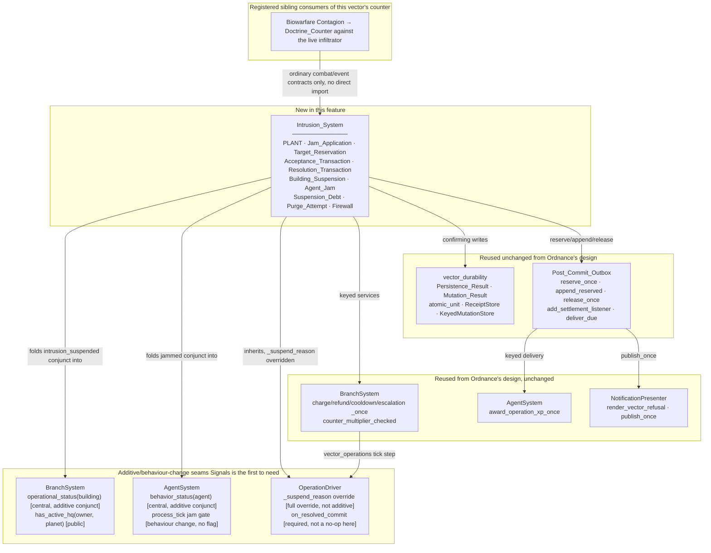
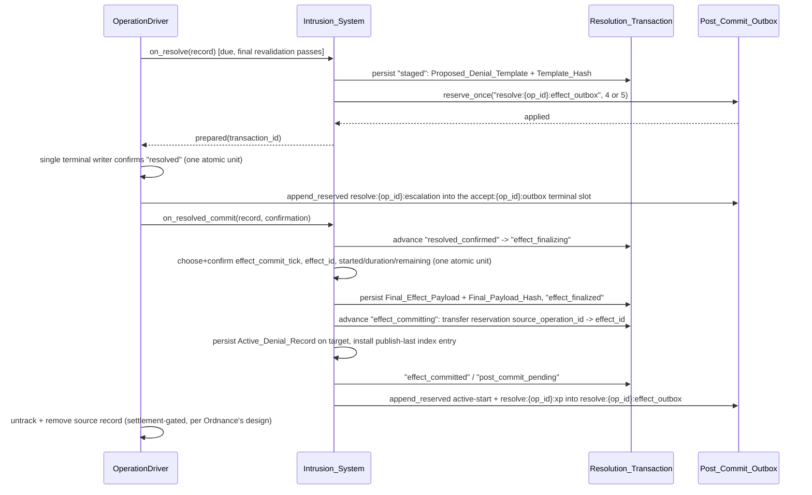
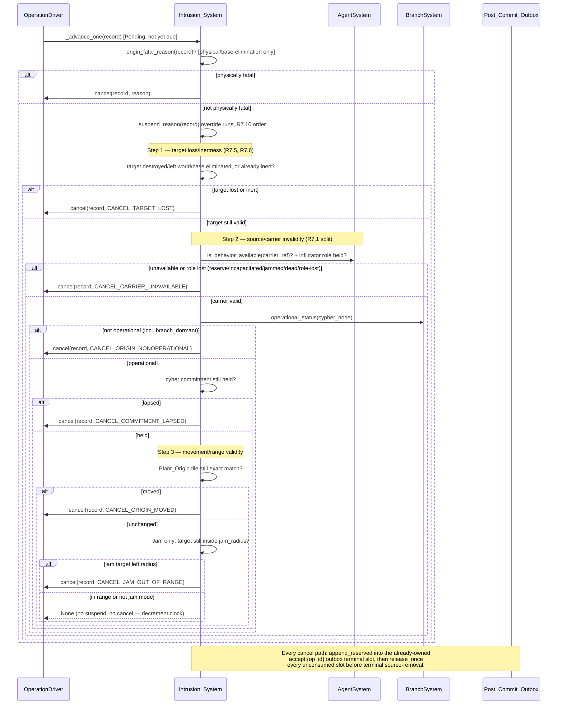

# Design Document

## Overview

This feature ships the **Signals** Signature_Vector — **Intrusion**, through one `intrusion` Operation_Kind with two modes (`plant` → Building_Suspension, `jam` → Agent_Jam) — as the third of the six vector specs. It extends the shared contracts Ordnance's design (`.kiro/specs/tech-tree-vector-ordnance/design.md`) already defines and does not redefine them: `atomic_unit`, `Persistence_Result`, `Mutation_Result`, `ReceiptStore`, `KeyedMutationStore`, `Post_Commit_Outbox` (`reserve_once`/`append_reserved`/`release_once`/`validate_capacity_at_startup`/`set_publish_sink`/`add_settlement_listener`/`deliver_due`), `publish_once` on `NotificationPresenter`, the rollback/two-caches analysis, the owner-scoped receipt read, the sqlite3 serialization story, and the shared `OperationDriver` change set. Where this document says "per Ordnance's design", the cited section there is the normative definition; this document states only what Signals adds, narrows, or — in one case — genuinely diverges from.

Signals deals **no damage of any kind** (R1.8: "no hit-point damage, ownership transfer, deletion, or stored-state replacement to a denial target"), so unlike Biowarfare it needs no `CombatEngine` seam at all. Its distinctive problem is the opposite of damage: **denial of function** — withholding a building's or an agent's normal capability without touching any of the state that capability would have read or written. That is why its two biggest new seams are read-side: a central `BranchSystem.operational_status` decision and a central `AgentSystem.behavior_status` decision, each folding one new conjunct into an existing yes/no answer without owning or mutating anything the existing conjuncts already govern.

Four things ship:

- **`Intrusion_System`** — the `intrusion` Vector_System. It owns PLANT and Jam_Application requests, the Target_Reservation that keeps them exclusive, the staged Resolution_Transaction and its effect-finalization/commit sequence, Building_Suspension and Agent_Jam records, Suspension_Debt, Purge_Attempt, and the Firewall self-perk. It implements **six** hooks, one more than Ordnance's and Biowarfare's five, because `on_resolved_commit` is a required override here rather than an inherited no-op.
- **Reused shared durability layer** — nothing new; Signals is the third consumer of exactly what Ordnance built.
- **New seams this feature is the first to need** — `BranchSystem.operational_status(building)` and `AgentSystem.behavior_status(agent)`, the two central multi-reason status queries this vector's denial mechanics fold into; a jam-aware gate inserted into `AgentSystem.process_tick`'s interval-zero behavior-script dispatch; and a genuinely different use of driver change 7 than either sibling vector makes (see "The suspend-to-cancel divergence" below).
- **Seams this feature reuses from Ordnance's design unchanged** — `charge_once`/`refund_once`/`note_cooldown_once`/`note_escalation_once`, `award_operation_xp_once`, `counter_multiplier_checked`, `OperationRecord.schema_version`/`vector_data`, and the settlement-gated terminal-removal split (`_source_removable`/`_settle_source`).

### The suspend-to-cancel divergence, and why `carrier_pause_reason` is not the mechanism

Biowarfare's `carrier_pause_reason` (R1.1/R1.21 there) is a strictly **additive** hook: `_suspend_reason` keeps its shipped two checks unchanged and consults one more check appended after them, defaulting to `None`. That shape works because Biowarfare only ever wants to **add** a new reason to suspend — it never wants to change what the two inherited checks already decide.

Signals' requirement is the opposite polarity. R7.9 is explicit: "Intrusion_System overrides the inherited carrier-unavailable/nonphysical-origin/commitment-lapse suspension policies for both modes: these conditions produce terminal `cancelled`, not `OperationState.SUSPENDED`." That is not a new suspend reason to append — it is a demand to **veto** the two inherited suspend causes (carrier unavailability, commitment lapse) and reroute them into cancellation instead. No additive hook appended after `_suspend_reason`'s existing checks can do that, because an additive check can only ever add a `str` reason on top of whatever the two inherited checks already decided; it has no way to suppress or override an inherited check's own answer. This is confirmed by the absence of any `carrier_pause_reason`-equivalent fixed anywhere in Signals' fifteen requirements — the mechanism genuinely is not there, and this design does not invent one that contradicts that absence.

**The resolution: `Intrusion_System` overrides `_suspend_reason` itself.** `_suspend_reason` is a private driver method (`operation_contract.py:3132`), not one of the fixed five-or-six required hooks and not one of the optional additive hooks either — nothing in the shared framework seals it against a full override, and overriding it wholesale creates no second lifecycle writer, because the override still routes exclusively through the single inherited `cancel`/`suspend` transition methods; it only changes which of those two transitions a given condition reaches.

```python
class IntrusionSystem(OperationDriver, BaseSystem):
    def _suspend_reason(self, record: OperationRecord) -> str | None:
        """Signals never suspends (R7.9): every inherited suspend cause instead
        cancels through this override, and the override then always answers
        ``None`` so the caller's ``if pause is not None: self.suspend(...)``
        branch (`:3045`-`:3047`) is never taken for this vector.

        Runs at the same point in ``_advance_one`` the shipped suspend check
        runs, and its checks follow R7.10's fixed global evaluation order —
        target loss/inertness first, then source/carrier invalidity under the
        R7.1 split, then movement/range validity, only then letting the clock
        decrement:

        1. Target loss/inertness (R7.5, R7.6) — the target-owned side of the
           matrix, which nothing shipped checks for free (see "Why target
           loss needs its own handler" below).
        2. Source/carrier invalidity (R7.1's split): carrier availability
           including role (R7.3), origin's nonphysical operational status
           including branch_dormant (R7.1, R7.4), and cyber commitment (R7.8).
        3. Movement/range validity: Plant_Origin exact-tile match (R7.2) and,
           for Jam, the target's continued presence inside the snapshotted
           jam_radius (R7.7).

        Only step 3 passing lets ``_advance_one`` decrement the clock (R7.10's
        own "and SHALL decrement or resolve the application only if every
        preceding check passes").
        """
        # 1. Target loss/inertness (R7.5, R7.6) — checked before anything
        #    source- or carrier-side, per R7.10's fixed order.
        if self._target_lost_or_inert(record):                                # R7.5, R7.6
            self.cancel(record, CANCEL_TARGET_LOST)
            return None

        # 2. Source/carrier invalidity, per the R7.1 split.
        if (not self._agent_system.is_behavior_available(record.carrier_ref)
                or not self._infiltrator_role_held(record)):                  # R5.7 + R7.3's role clause
            self.cancel(record, CANCEL_CARRIER_UNAVAILABLE)
            return None
        status = self._branch_system.operational_status(record.building_ref)  # R7.1, R7.4
        if status != "operational" and status != "intrusion_suspended":
            # Every nonphysical reason, INCLUDING branch_dormant, cancels here.
            # A physically destroyed/deleted Cypher Node is caught earlier by
            # the unmodified origin_fatal_reason override below, so this branch
            # never has to re-derive that half of the decision.
            self.cancel(record, CANCEL_ORIGIN_NONOPERATIONAL)
            return None
        if self._commitment_lapsed_for_cyber(record):                        # R7.8
            self.cancel(record, CANCEL_COMMITMENT_LAPSED)
            return None

        # 3. Movement/range validity, evaluated only once source/carrier are clean.
        if self._plant_origin_invalid(record):                               # R7.2
            self.cancel(record, CANCEL_ORIGIN_MOVED)
            return None
        if record.mode == "jam" and self._jam_target_left_radius(record):    # R7.7
            self.cancel(record, CANCEL_JAM_OUT_OF_RANGE)
            return None
        return None
```

**Why target loss needs its own handler — nothing shipped checks it for free.** The inherited fatal-event handlers (`handle_player_eliminated`, `handle_building_destroyed`, `handle_base_eliminated`) match on `record.carrier_ref` or the origin `building_ref`; none of them reads `record.target_ref`. Every prior vector's `target_ref` has been either a coordinate-adjacent value (Ordnance) or an attribution snapshot (Biowarfare's Primary_Target_Owner), never an independently-lifecycled world object whose own destruction must cancel the operation. Signals is the first vector for which `target_ref` names a concrete enemy building or agent with its own death/deletion/base-elimination lifecycle, so `_target_lost_or_inert` is new code, not an inherited check: it asks whether the target is destroyed, has left the world, or its base has been eliminated (R7.5), or whether its `operational_status`/`behavior_status` has already gone inert for a reason unrelated to this operation's own reservation (R7.6) — and for Jam specifically, whether the target has drifted outside the Cypher Node's snapshotted `jam_radius` is deferred to step 3 rather than folded in here, because R7.10 classifies range as "movement/range validity", a category distinct from "target... inertness".

**`origin_fatal_reason` keeps its normal, restricted meaning and is not stretched to cover this.** R1.18 requires it to "report only physical or source-fatal conditions independent of Branch commitment" and to "never return `branch_dormant`" — a requirement Signals shares word-for-word with Ordnance and Biowarfare. A commitment lapse or a dormancy-caused non-operational Cypher Node is explicitly **not** independent of Branch commitment, so folding either into `origin_fatal_reason` would violate that criterion directly. Signals' `origin_fatal_reason` override therefore answers only for a *physically* destroyed or deleted Cypher Node and a base-eliminated source — the same shape **Ordnance's** override uses (Biowarfare needs no override of `origin_fatal_reason` at all and relies on the shared default, since none of its fatal causes are commitment-dormancy-adjacent) — and the nonphysical half of R7.4 ("or returns any non-operational reason [...] including `branch_dormant`") is caught by the `_suspend_reason` override above instead, exactly as R7.4's own second sentence requires: "`origin_fatal_reason` must not misclassify this Branch-policy reason as physical loss."

**Consequently Signals' Pending applications, in practice, never reach `OperationState.SUSPENDED`.** Every inherited suspend cause is intercepted and cancels instead. The generic resume transition is not deleted — R1.18's last sentence still requires "any generic resume SHALL retain the exact remaining countdown without reflooring" — so this design still sets `refloors_on_resume = False` (the same opt-out Ordnance's design uses, for the same reason: the floor is evaluated once at publication and must not lengthen on a resume this vector does not expect to take). It is specified as inert-but-correct rather than removed, because nothing in the shared framework guarantees `_suspend_reason` can never be reached by some future code path this design has not enumerated, and a resume that silently reflowered would be a worse failure than a resume that is simply never exercised.

### Why this is not a second copy of Ordnance's durability chapter

Signals' Requirement 1 criteria 15, 19, 20, and 21 restate `Persistence_Result`, `Mutation_Result`, and the reservation discipline in the same words Ordnance's and Biowarfare's requirements use — the third occurrence of the shared Introduction language ("extends the shipped Branch and operation contracts... does not create parallel versions"). This document does not re-derive `atomic_unit`, does not re-argue the sqlite3 serialization story, and does not redraw the rollback/two-caches diagram. It spends its own space on what is genuinely new: the central operational-status/behavior-status folding, the four-transaction staged-commit protocol (`on_resolved_commit` doing real work, unlike Biowarfare's no-op default), Target_Reservation exclusivity, Suspension_Debt, Purge_Attempt, and Firewall.

## Architecture



### Ownership boundaries

**`Intrusion_System` owns:** PLANT and Jam_Application request validation and admission; Target_Reservation exclusivity; the Acceptance_Transaction and Resolution_Transaction (including the effect-finalization/commit sequence inside `on_resolved_commit`); Building_Suspension and Agent_Jam record content and their active-index entries; Suspension_Debt accounting; Purge_Attempt; and the Firewall self-perk's range query and penalty snapshot.

**`Intrusion_System` explicitly does not own:** the *combination rule* that folds `intrusion_suspended`/`jammed` into a building's or agent's overall status (`BranchSystem.operational_status`/`AgentSystem.behavior_status` own the combination; Signals only contributes the one conjunct), lifecycle state (`OperationDriver`), targeting policy (`BranchSystem.may_target`), XP (`AgentSystem.award_operation_xp_once`), player-facing prose (`NotificationPresenter`), or outbox capacity accounting (`Post_Commit_Outbox`).

**Biowarfare's Doctrine_Counter integration owns nothing on Signals' side, symmetrically to how Signals is Biowarfare's Doctrine_Counter.** R10.6–R10.7 fix this precisely: "Signals Doctrine_Counter = Biowarfare's standard Contagion or combat damage acting on the live infiltrator, through existing damage/death paths" and "Intrusion_System imports no Biowarfare implementation, grants no direct immunity/special damage, reacts only to the ordinary carrier-death event and source-validity result." Signals adds no vector-specific counter-recognition code; the ordinary carrier-death event routing through the (overridden, in this vector's case) fatal/cancel path is the entire mechanism, exactly mirroring Biowarfare's R3.9 statement about Fortification.

## Components and Interfaces

### The six R1.1 hooks

R1.1 fixes six hook names for `Intrusion_System`, one more than Ordnance's and Biowarfare's five: `validate_target`, `build_record`, `on_resolve`, `on_resolved_commit`, `persistence_owner`, `discover_records`. `on_resolved_commit` is required here — not the inherited no-op default every other vector so far has left alone — because R1.5 and R3.10–R3.11 place the entire effect-finalization/commit sequence inside it, not inside `on_resolve`.

```python
class IntrusionSystem(OperationDriver, BaseSystem):
    operation_kind = "intrusion"
    branch = "cyber"

    def validate_target(self, ctx: Any) -> str | None: ...
    def build_record(self, ctx: Any) -> OperationRecord: ...
    def on_resolve(self, record: OperationRecord) -> None: ...
    def on_resolved_commit(self, record: OperationRecord, confirmation) -> "PersistenceResult": ...
    def persistence_owner(self, record: OperationRecord) -> Any: ...
    def discover_records(self, planet_rooms: Any) -> Iterable[Any]: ...

    # Additive override of a private driver method, not one of the six
    # required/optional hooks — see "The suspend-to-cancel divergence" above:
    def _suspend_reason(self, record: OperationRecord) -> str | None: ...

    # Additive override, shared shape with Ordnance's own (Biowarfare relies
    # on the shared default for this hook instead):
    def origin_fatal_reason(self, record: OperationRecord) -> str | None: ...
```

**`validate_target`** runs the Cypher_Node/infiltrator/target checks (R6.1–R6.6) inside the inherited ordered validation chain, and calls `BranchSystem.may_target(requester, target_ref, hostile=True)` (R6.1) — the concrete target, per mode a building or an agent, never the owner reference.

**`build_record`** snapshots the infiltrator's exact `Plant_Origin` planet/x/y (R6.6), resolves and persists the canonical `target_owner_ref` as a read-only admission step that fails closed pre-mutation if the owner is absent/noncanonical/unreadable (R6.6), and writes the version-1 `vector_data` payload defined below (R2.3–R2.4).

**`on_resolve`** is the prepare half of the staged-commit protocol: it idempotently persists exactly one Resolution_Transaction in phase `staged`, containing the immutable Proposed_Denial_Template and Template_Hash, and confirms the exact `resolve:{op_id}:effect_outbox` reservation (4 slots for `jam`, 5 for `plant`) before returning `prepared(transaction_id)` (R3.8). It writes no commit-time field — `effect_commit_tick`, `effect_id`, `started_tick`, `duration_ticks`, `remaining_ticks` — and never reads `now` (R3.8's own text, and the Glossary's `Proposed_Denial_Template` entry).

**`on_resolved_commit`** is where the real, effect-creating work happens, and only after the driver's single terminal writer has already confirmed `resolved` in one atomic unit (R3.9). On its first eligible attempt it advances `resolved_confirmed` → `effect_finalizing` → (durably choose and confirm `effect_commit_tick`, `effect_id`, final `started_tick`/`duration_ticks`/`remaining_ticks` in one atomic finalization unit) → `effect_finalized` → `effect_committing` (transfer the reservation from `source_operation_id` to the confirmed `effect_id`, persist the Final_Effect_Payload verbatim as the authoritative Active_Denial_Record, install the publish-last active-index entry) → `effect_committed`/`post_commit_pending` (R3.10–R3.11). Every retry, rebuild, or delayed commit reuses the same confirmed tick, identity, payload, and hash — it never re-reads `now` or recomputes duration (R3.11's last sentences).

**`persistence_owner`** returns the accepting player, for the operation record itself (R2.5: "Operation_Record persists a concrete `target_ref`... never rewritten to an owner identity"). Building_Suspension and Agent_Jam are **not** owned by this method's answer at all — they persist on the target building or target agent respectively, in a container separate from that target's `vector_operations` (R2.6) — see "Persistence-owner choice, twice over" below for why an Intrusion operation genuinely needs two different persistence-owner answers depending on what is being asked about.

**`discover_records`** is the restart rebuild hook, unchanged in shape from every other vector: it takes `planet_rooms` and yields durable owners, each read through the unchanged `_read_records`.

### Persistence-owner choice, twice over

Ordnance and Biowarfare each have one persistence-owner answer, because their operative artifact (the strike record, the Contagion_Effect) either lives with the record or lives on a recipient the record's own owner never needs to be asked about again. Signals genuinely needs two different answers to "where does the durable fact live", and this design states that as an intentional asymmetry rather than glossing over it:

1. **The Operation_Record itself** (the Pending PLANT/Jam_Application, its Acceptance_Transaction) persists on the **accepting player** — `persistence_owner`'s actual return value, exactly like every other vector.
2. **The committed Active_Denial_Record** (Building_Suspension or Agent_Jam) persists on the **target** — the building or the agent — in a container separate from that target's own `vector_operations` (R2.6). This is not what `persistence_owner` answers; it is a second, target-scoped persistence decision Requirement 2 fixes directly, and it exists because R12.1 requires "destruction/base-elimination flows [to] invoke Intrusion_System's target handlers before deleting any target-owned container" — the denial record must be reachable *from the target* so those flows can find and remove it without a global scan, exactly as a shield or a status-effect list is target-scoped rather than attacker-scoped.
3. **The Resolution_Transaction** persists in a **third, separate staging container** (R2.7: "persists in a third, separate staging container, idempotently keyed by source operation"), because it must remain the recovery authority after the source Operation_Record is terminal and removed (R1.17: "Only a confirmed terminal receipt in the atomic unit from Acceptance Criterion 12... SHALL permit untracking or removal of the Operation_Record and entry into `on_resolved_commit`") and after the committed effect it produced may itself later end — neither the accepting player's nor the target's own lifecycle can be trusted to carry it, since either one dying or losing the relevant object does not mean the transaction's recovery obligations are finished.

None of the three is optional or interchangeable: Requirement 2's field-by-field schema (below) fixes exactly what lives in each.

### `vector_data` schema for an Intrusion request

R2.3–R2.4 fix the exact field list for version-1 `vector_data`, deep-copied by value on every read/write (R2.2's round-trip requirement, the same discipline Biowarfare's `vector_data` uses):

| Field | Type | Mutability | Fixing criterion |
| --- | --- | --- | --- |
| `mode` | `"plant"` \| `"jam"` | immutable | R2.3 |
| `plant_origin_planet` | canonical planet reference | immutable | R2.3 |
| `plant_origin_x`, `plant_origin_y` | `int` | immutable | R2.3 |
| `required_plant_ticks` | `int` (post-floor, post-Firewall final value) | immutable | R2.3 |
| `firewall_applied` | `bool` | immutable | R2.3, R10.2–R10.3 |
| `target_reservation_id` | stable reservation identity | immutable | R2.3 |
| `target_owner_ref` | canonical persistent owner reference | immutable, never re-resolved | R2.3, R3.3 |
| base effect duration, configured bounds, debt-policy snapshot, `agent_xp_intrusion` amount | mixed | immutable | R2.4 |

**`target_owner_ref`'s restriction is explicit and load-bearing (R2.3's last clause).** It is "attribution and replay data, including the target identity passed to delayed escalation; it never replaces the concrete target and never authorizes a live ownership-sensitive decision" — never usable for `may_target`, alliance, consent, or purge-actor authorization (R3.3). Every one of those live decisions re-resolves ownership fresh at its own linearization point; only escalation delivery (R8.6, discussed below) is allowed to use the frozen snapshot, because escalation is explicitly a replay of an attribution fact recorded at a moment that has already passed, not a live authorization decision.

**`target_ref` is never overwritten by `target_owner_ref` (R2.5).** The Operation_Record's concrete `target_ref` — the building or agent itself — is what `BranchSystem.may_target` and every lifecycle event key off; `target_owner_ref` is a second, independent field for escalation and attribution only.

### The four durable transactions

| Transaction | Keyed by | Persists on | Owns | Fixing requirement |
| --- | --- | --- | --- | --- |
| **Acceptance_Transaction** | preallocated `op_id` | accepting player | target reservation identity, immutable `target_owner_ref`, exact charge + receipt, Operation_Record linkage, cooldown receipt, the `accept:{op_id}:outbox` reservation, Pending-warning/outbox receipts, compensation receipts | R2.16, R3.3–R3.6 |
| **Resolution_Transaction** | source `op_id` | a third, separate staging container (not the accepting player's, not the target's) | Proposed_Denial_Template + Template_Hash, the `resolve:{op_id}:effect_outbox` reservation, effect-finalization receipt, `effect_commit_tick`, `effect_id`, Final_Effect_Payload + Final_Payload_Hash, reservation-transfer/effect-persistence/index-commit receipts, escalation/XP/notification receipts | R2.7, R3.8–R3.20 |
| **Active_Denial_Record** (Building_Suspension / Agent_Jam) | `effect_id` | the target building or target agent, separate from that target's `vector_operations` | the twelve-field committed effect schema (below), `purge_state` | R2.6, R2.8–R2.10 |
| **Purge_Attempt** | `(effect_id, attempt_id)` | inside the Building_Suspension's own `purge_state` — not a fifth container | `actor_ref`, `remaining_ticks`, `last_validated_tick` | R2.9, R11.1–R11.13 |

**Why "third, separate staging container" is stated as its own design decision rather than folded into either persistence-owner answer.** The Resolution_Transaction must remain the recovery authority after the source Operation_Record is terminal and removed — R1.17 requires "Only a confirmed terminal receipt in the atomic unit from Acceptance Criterion 12, with every receipt-authorized required entry durably appended from its reservation and every unneeded reserved slot durably released, SHALL permit untracking or removal of the Operation_Record and entry into `on_resolved_commit`" — and must also survive independently of whatever later happens to the *committed* effect it produced (an ended Building_Suspension does not retroactively invalidate the transaction that created it — R2.18's tombstone-after-completion rule is what eventually retires it, not the effect's own ending). Neither the accepting player (whose relationship to the operation ends at Operation_Record removal) nor the target (whose relationship is to the *effect*, not to the transaction that produced it) is the right long-term home.

### Active_Denial_Record schema

Exactly the twelve fields R2.8 fixes, plus `purge_state`'s own three sub-fields (R2.9):

| Field | Type | Mutability |
| --- | --- | --- |
| `schema_version` | `int`, currently `1` | immutable |
| `effect_id` | stable identity, confirmed once at finalization | immutable |
| `mode` | `"plant"` \| `"jam"` | immutable |
| `source_operation_id` | equals the originating `op_id` | immutable |
| `source_ref` | attacker/source reference | immutable |
| `origin_building_ref` | the Cypher Node | immutable |
| `carrier_ref` | the infiltrator | immutable |
| `target_ref` | the building or agent | immutable |
| `planet` | canonical planet reference | immutable |
| `started_tick` | equals the confirmed `effect_commit_tick` | immutable |
| `duration_ticks` | derived from the template's final proposed duration | immutable |
| `remaining_ticks` | — | decrements exactly once per processed tick (R8.8); not decremented on the commit tick itself (R3.11) |
| `purge_state.actor_ref` | entity reference or `None` | mutates only inside a purge-serialization boundary |
| `purge_state.remaining_ticks` | `int`, `0` when inactive | mutates only inside a purge-serialization boundary |
| `purge_state.last_validated_tick` | `int` or `None` | mutates only inside a purge-serialization boundary |

Every field but the three `purge_state` sub-fields and `remaining_ticks` is fixed permanently at effect finalization — the committed record is byte-equal to the Final_Effect_Payload that produced it (R3.11's "Committed record is byte-equal to Final_Effect_Payload and matches Final_Payload_Hash"). `purge_state` defaults to `actor_ref = None`, `remaining_ticks = 0`, `last_validated_tick = None` when no purge is active, which is always the case for an Agent_Jam (R2.9, R11.13's confirmation that no purge command exists for Jam).

### Reservation IDs and exact slot counts

| Reservation ID | Slot count | What each slot authorizes | Fixing criterion |
| --- | --- | --- | --- |
| `accept:{op_id}:outbox` | `2` | one Pending warning + one eventual terminal outcome | R1.22, R3.3–R3.4 |
| `resolve:{op_id}:effect_outbox` | `4` (Jam) / `5` (PLANT) | active start, `resolve:{op_id}:xp` award, one eventual ending, one eventual reservation-release settlement, and — PLANT only — one eventual debt closure | R1.22, R2.7, R3.8 |
| `purge:{effect_id}:{attempt_id}:outbox` | `2` | one purge start + one eventual abandonment | R1.22, R11.6, R11.11 |

Every count above is exact and finite, never a wildcard or unbounded/not-yet-discovered recipient set (R1.22's own wording, shared verbatim with Biowarfare's and Ordnance's equivalent reservation-discipline criteria). The PLANT/Jam slot-count asymmetry (5 vs 4) is not incidental: PLANT alone carries a debt-closure obligation (Suspension_Debt, Requirement 9), so PLANT alone needs the fifth slot; Jam has no debt concept and so needs only four.

### Mutation keys

| Mutation key | Fixing criterion |
| --- | --- |
| `accept:{op_id}:charge` | R1.19, R3.5 |
| `accept:{op_id}:refund` | R1.19, R3.6 |
| `accept:{op_id}:cooldown` | R1.19, R3.5, R6.11 |
| `resolve:{op_id}:escalation` | R1.19, R3.9, R8.6, R15 Property 19 |
| `resolve:{op_id}:xp` | R1.19, R8.7, R15 Property 20 |
| debt-closure key, derived from `effect_id` (no fixed literal template given by the requirements) | R9.10 |

**The debt-closure key has no literal template fixed by the requirements, and this design does not invent a false precision it cannot back.** R9.10 says only "a stable mutation key derived from `effect_id`" — unlike the reservation IDs above, no exact string format is given. This design fixes it as `debt:{effect_id}:close`, following the same `{phase}:{identity}:{qualifier}` shape every other key in this feature already uses, but flags explicitly that this specific literal is this design's own choice rather than a requirements-fixed string, exactly as this document's Biowarfare sibling flagged its own late-warning reservation ID as a design choice filling a requirements-left gap.

Every one of these follows the shared `Mutation_Result` discipline Ordnance's design fixes (R1.24, R1.30 in Ordnance's own numbering govern the general contract; R1.19–R1.21 here restate it for Signals specifically): an original `applied` or `rejected` outcome commits atomically with its domain mutation, a same-key/same-payload replay answers `duplicate(prior=<original_outcome>)` without a second effect, a same-key/different-payload replay answers `conflict` and fails closed, and a receiptless capacity `rejected` never later replays as `duplicate(prior=rejected)`.

## Data Models

### `Target_Reservation`

A target-persisted exclusive claim spanning an accepted Pending application, any in-progress Resolution_Transaction, and the active effect it creates — global across attackers, so at most one such chain exists per building lane and per agent lane at any time (R3.1). Unlike Ordnance's Designation, which is a standalone shareable value object, Target_Reservation has no independent identity outside the chain it spans: it is a property of the target (one building, one agent), not a value a player holds or transfers.

```python
@dataclass(frozen=True)
class TargetReservation:
    reservation_id: str
    target_ref: Any            # the concrete building or agent
    op_id: str                 # the operation currently holding the claim
    # No holder, no sharing, no consent chain — unlike Ordnance's Designation.
```

### `Purge_Attempt`

Not a fifth durable container — it lives entirely inside the Building_Suspension's own `purge_state` sub-mapping (R2.9), which is why it appears in the Active_Denial_Record schema above rather than in its own row in the four-transaction table. At most one in-progress attempt exists per Building_Suspension (R11.4); a second concurrent request for the same `effect_id` and payload replays the existing attempt rather than resetting it (R11.5).

### `Suspension_Debt`

The rolling sum of **actual** Building_Suspension interval overlap on one target across all attackers — target-global, not per-attacker (R9.1). Unlike a per-attacker ledger, this means one player's prior suspension contributes to the cap that limits every other player's ability to suspend the same building, which is the mechanism that bounds sequential attacks from different attackers stacking into permanent suppression (the Requirement 9 User Story's own framing). Computed at validation tick `now` over window `W` as `Σ over every retained completed interval + any active interval of max(0, min(end, now) - max(start, now - W))`, treating an active interval's end as `now` (R9.2).

### `Firewall`

A Signals **self-perk**, explicitly not the Doctrine_Counter (R10.5). One target-owned Operational Cypher Node within the configured `firewall_radius` of the target building adds exactly one snapshotted `firewall_plant_penalty_ticks` to the PLANT's required response ticks, persisted as `firewall_applied = true`; multiple eligible nodes never stack a second penalty (R10.1–R10.2). The Doctrine_Counter is a separate mechanism entirely — Biowarfare's ordinary Contagion or combat damage against the live infiltrator, through existing damage/death paths, imported by neither vector directly (R10.6–R10.7).

### `Proposed_Denial_Template` and `Final_Effect_Payload`

The two-stage value objects that make the staged-commit protocol's separation of "prepared" from "committed" concrete:

```python
@dataclass(frozen=True)
class ProposedDenialTemplate:
    """Everything on_resolve can know before effect commit. No commit-time
    field: effect_commit_tick, effect_id, started_tick, duration_ticks, and
    remaining_ticks are all absent here by construction (R3.8)."""
    mode: str
    final_proposed_duration_ticks: int
    # ... every other pre-commit-knowable value; never `now`, never a tick.

@dataclass(frozen=True)
class FinalEffectPayload:
    """Frozen once, on the first eligible on_resolved_commit attempt (R3.10).
    Shape is exactly the Active_Denial_Record schema. Every retry, rebuild, or
    delayed commit reuses this exact object — never recomputed."""
    schema_version: int
    effect_id: str
    mode: str
    source_operation_id: str
    source_ref: Any
    origin_building_ref: Any
    carrier_ref: Any
    target_ref: Any
    planet: Any
    started_tick: int          # == the confirmed effect_commit_tick
    duration_ticks: int        # derived from the template's final proposed duration
    remaining_ticks: int
    purge_state: dict
```

`Template_Hash` covers only `ProposedDenialTemplate`'s fields; `Final_Payload_Hash` covers the full `FinalEffectPayload` including its commit-time fields. The two hashes are always distinct and are computed at different times by construction — Template_Hash at `on_resolve`, Final_Payload_Hash at the first eligible `on_resolved_commit` attempt — which is exactly what makes it structurally impossible for a retry to accidentally recompute a duration or re-read `now` a second time: there is no code path where the template is re-hashed after commit-time fields exist, because those fields never enter the template's own representation at all.

## New seams on shipped components

### `BranchSystem.operational_status(building)` — a central, additive multi-reason query

**Shipped today.** `BranchSystem.is_operational(building)` (`branch_system.py:593`-`:660`) combines exactly three conjuncts sequentially with early-return `False`: the base gate `building_is_operational` (offline/under-construction, `world/utils.py`), the Active_HQ_Rule via `_owner_has_active_hq`, and Branch dormancy via `commitment(owner, planet) == branch` — returning a plain Boolean with no way to distinguish *which* conjunct failed.

**The requirement (R4.1–R4.3).** A new public `operational_status(building)` returns exactly one of `operational`, `unreadable`, `offline`, `under_construction`, `no_active_hq`, `branch_dormant`, or `intrusion_suspended` — a reason-valued query, not a Boolean — and `is_operational` becomes a thin delegate: `is_operational(building) == (operational_status(building) == "operational")`, with no separate Boolean implementation surviving alongside it.

```python
class BranchSystem:
    def operational_status(self, building: Any) -> str:
        """Central reason-valued query (R4.1-R4.2). Precedence, cheapest-to-
        falsify first, exactly mirroring is_operational's existing ordering
        with one new conjunct appended at the end:

        unreadable -> offline -> under_construction -> no_active_hq ->
        branch_dormant -> intrusion_suspended -> operational
        """
        # ... the shipped three conjuncts, now returning a reason string
        # instead of False, plus the new fourth conjunct:
        if self._intrusion_provider is not None:
            if self._intrusion_provider.has_active_suspension(building):
                return "intrusion_suspended"
        return "operational"

    def is_operational(self, building: Any) -> bool:
        return self.operational_status(building) == "operational"     # R4.3

    def has_active_hq(self, owner: Any, planet: Any) -> bool: ...     # R4.4, now public
```

**Insertion point for the fourth conjunct, with a citation to why it belongs there and not upstream.** The shipped `is_operational` combines its three conjuncts in the order base-gate → Active_HQ_Rule → dormancy (`branch_system.py:645`-`:659`), each an early return. The new `intrusion_suspended` conjunct is inserted **after** dormancy and **before** the final `operational` return — i.e. exactly where R4.2's fixed precedence puts it: "unreadable... explicit `offline`... `under_construction`... no active HQ... mismatched or absent Branch commitment... active Building_Suspension, then `operational`." This ordering is not arbitrary: `commitment()`'s own shipped docstring already states the precedent this design leans on — "A completed lab that is... suspended by a hostile Signals intrusion **still** confers its owner's commitment... Commitment follows ownership, not the Operational state" — which is the shipped codebase's own advance confirmation that a Signals suspension must gate the *function* conjunct (`is_operational`/`operational_status`), never the *ownership/bonus* conjunct (`commitment`). The seam belongs in `operational_status`, not in `commitment`, because the shipped code already draws that exact line.

**Classification: additive.** R4.6 fixes the unwired default explicitly: "WHILE no Intrusion_System is registered or its active-status provider is not injected, THE BranchSystem SHALL treat the intrusion conjunct as satisfied and SHALL NOT freeze a building merely because a persisted record exists" — so every building that today answers `operational` continues to answer `operational` with no `Intrusion_System` wired, and the widening from Boolean to seven-way reason string is additive from every existing caller's point of view *only if* every existing caller is migrated to read `is_operational`'s unchanged Boolean delegate rather than a raw string comparison — which is exactly why R4.8–R4.9 require explicit consumer migration rather than assuming overlay coverage (see "Behaviour changes with no opt-out" below for why the migration itself is not additive).

**`has_active_hq` becomes public (R4.4).** The shipped Active_HQ_Rule is read through the private `_owner_has_active_hq`; R4.4 requires a public `has_active_hq(owner, planet)` and requires every consumer to use it rather than reach the private helper. This is additive on the same ground as the rest of this table: the private helper's body is unchanged, only its calling convention gains a public front door.

### `AgentSystem.behavior_status(agent)` — the mirror-image central query, plus a real behaviour change inside `process_tick`

**Shipped today.** `AgentSystem.process_tick(tick_number, agents)` (`agent_system.py:1059`) runs two passes: a per-agent time-served XP pass, then an interval-zero behavior-script dispatch pass (`:1095`-`:1116`) that iterates `agent.scripts.all()`, filters to `interval == 0`, and calls `at_repeat()` on each — gated today by exactly one check, `reserve` (`:1104`-`:1105`); incapacitation is deliberately not checked here because each behavior script guards its own incapacitation internally.

**The requirement (R5.1–R5.6).** A new public `behavior_status(agent)` distinguishes at least `available`, `unreadable`, `dead`, `reserve`, `incapacitated`, and `jammed`, with every non-Jam reason evaluated before `jammed` (R5.2); `is_behavior_available` is its Boolean delegate. While a jammed agent's Agent_Jam is present in the registered active index, `process_tick` skips **both** that agent's per-tick progression **and** its interval-zero dispatch (R5.5) — without detaching, deleting, recreating, pausing, or reattaching any script (R5.6).

```python
class AgentSystem:
    def behavior_status(self, agent: Any) -> str:
        """Central reason-valued query (R5.1-R5.2). Non-Jam reasons first:
        unreadable -> dead -> reserve -> incapacitated -> jammed -> available.
        """
        # ... the shipped dead/reserve/incapacitated reads, now returning a
        # reason string, plus the new jammed conjunct evaluated last:
        if self._intrusion_provider is not None:
            if self._intrusion_provider.has_active_jam(agent):
                return "jammed"
        return "available"

    def is_behavior_available(self, agent: Any) -> bool:
        return self.behavior_status(agent) == "available"

    def process_tick(self, tick_number: int, agents: list | None = None) -> None:
        for agent in agents:
            if not self.is_behavior_available(agent):        # NEW single gate (R5.5)
                continue                                      # skips BOTH passes
            self._process_agent_tick(agent)                   # pass 1, unchanged
        for agent in agents:
            if not self.is_behavior_available(agent):         # same predicate, pass 2
                continue
            if not hasattr(agent, "scripts"):
                continue
            try:
                for script in agent.scripts.all():
                    if getattr(script, "interval", None) == 0:
                        try:
                            script.at_repeat()
                        except Exception:
                            ...
            except Exception:
                pass
```

**Exact insertion point, cited against the shipped body.** The shipped interval-zero dispatch loop (`agent_system.py:1095`-`:1116`) gates only on `reserve` at `:1104`-`:1105`, immediately before entering the `try:` at `:1106`. The additive gate replaces that single `reserve` check with a call to the new `is_behavior_available(agent)`, at the identical position in the loop — the mechanical seam is the same line gap the shipped `reserve` check already occupies, widened to answer a five-or-six-way reason rather than one Boolean.

**Classification: this is not one additive change — it is one additive query plus one behaviour change with no opt-out, and this design does not blur the two together.** `behavior_status` existing at all, and its `jammed` conjunct defaulting to satisfied when no `Intrusion_System` is wired (R5.4, the mirror of R4.6), is additive: every agent that today answers "available" continues to. But **replacing `process_tick`'s existing bare `reserve` check with `is_behavior_available`** is a behaviour change for every agent with no flag to opt out of it, for the same class of reason Ordnance's design names its own three unconditional driver changes: R5.7 requires "`BranchSystem`'s selected-carrier eligibility and `OperationDriver`'s runtime carrier-unavailable decision [to] consume the same AgentSystem behavior-availability result rather than duplicating reserve, incapacitation, or Jam reads" — a criterion about *every* carrier-consuming caller in the system, not a Signals-scoped opt-in. Before this change, `process_tick`'s dispatch gate and any other consumer's own incapacitation/reserve read were two independently-maintained checks that happened to agree; after this change, they are the same call, so a future divergence between "is this agent benched for its behaviour script" and "is this agent benched for a Vector_Operation" becomes structurally impossible rather than a bug that could reappear. That is the intended effect, but it is still a change to `process_tick`'s existing gating condition with no vector-scoped flag guarding it, and this design states that plainly rather than filing it under "additive" alongside `behavior_status`'s own introduction.

**Incapacitation's absence from the shipped gate is preserved, not silently added.** The shipped dispatch loop deliberately does not check incapacitation (per its own design: "each script guards incapacitation itself"). `is_behavior_available` *does* fold incapacitation into its own answer (R5.2 requires `behavior_status` to distinguish `incapacitated`), so replacing the bare `reserve` check with `is_behavior_available` also newly gates dispatch on incapacitation — a second behaviour change riding along with the jam-gate insertion, and one this design flags rather than treats as free. This is required, not incidental: R5.7's "consume the same... result rather than duplicating" leaves no room for `process_tick` to keep its own narrower gate while every other consumer reads the wider one, because that would be exactly the duplication R5.7 forbids.

### Carrier eligibility reuse (R5.7)

`BranchSystem`'s carrier-selection eligibility check and `OperationDriver`'s carrier-unavailable decision (reached through this vector's `_suspend_reason` override above) both call the same `AgentSystem.is_behavior_available(agent)` rather than each independently reading `reserve`/`incapacitated`/jam state. This is what makes R6.3's infiltrator-selection check ("not incapacitated, and not jammed") and the `_suspend_reason` override's own first check ("not `self._agent_system.is_behavior_available(record.carrier_ref)`") the same predicate rather than two hand-maintained copies of it.

### Classification summary

| Seam | Component | Classification | Forcing criterion |
| --- | --- | --- | --- |
| `operational_status` (new method, `intrusion_suspended` conjunct defaulting satisfied) | `BranchSystem` | additive | R4.1–R4.3, R4.6 |
| `has_active_hq` (new public front door on an unchanged private body) | `BranchSystem` | additive | R4.4 |
| Consumer migration off `world.utils.building_is_operational` (turret auto-fire, equipment production, extractor/Harvester production, lab research, aura behavior, shield gen/regen, every vector origin check) | multiple shipped systems | **behaviour change per migrated consumer, explicitly required, not additive** | R4.8–R4.9 |
| `behavior_status`/`is_behavior_available` (new methods, `jammed` conjunct defaulting satisfied) | `AgentSystem` | additive | R5.1–R5.4 |
| `process_tick`'s dispatch gate widened from bare `reserve` to `is_behavior_available` | `AgentSystem` | **behaviour change for every agent, no opt-out** — folds in incapacitation and jam alongside reserve | R5.5, R5.7 |
| `_suspend_reason` full override (not an additive appended check) | `OperationDriver` | **full override of a private method**, additive in effect only because the predicate it reads (staged Resolution_Transaction / registered Intrusion_System) is always false for every other shipped vector | R7.9 |
| `origin_fatal_reason` override (physical/base-elimination causes only) | `OperationDriver` | additive, same shape as Ordnance's own override (Biowarfare relies on the shared default instead) | R1.18, R7.1, R7.4 |
| `on_resolved_commit` (required override, not the inherited no-op) | `OperationDriver` | additive as a seam; **required** for this vector where it is optional for Ordnance/Biowarfare | R3.10–R3.11 |

Two entries above are named as unconditional behaviour changes rather than filed under "additive": the consumer migration off `world.utils.building_is_operational` (R4.8–R4.9 require it explicitly, consumer by consumer, and R4.13 forbids claiming any consumer is covered "merely because BranchSystem has an overlay"), and `process_tick`'s dispatch-gate widening (R5.5, R5.7). Both are required by name in the requirements, not discretionary hardening this design chose to add.

## Lifecycle Flows

Each diagram's reservation count matches the slot table above exactly.

### 1. PLANT/Jam acceptance

```mermaid
sequenceDiagram
    participant Player
    participant Intrusion_System
    participant BranchSystem
    participant AcceptanceTxn as Acceptance_Transaction
    participant Outbox as Post_Commit_Outbox

    Player->>Intrusion_System: request(mode, cypher_node, infiltrator, target)
    Intrusion_System->>BranchSystem: may_target(requester, target_ref, hostile=True)
    BranchSystem-->>Intrusion_System: permitted
    Intrusion_System->>Intrusion_System: resolve canonical target_owner_ref (fail closed if unresolvable)
    Intrusion_System->>AcceptanceTxn: preallocate op_id + reservation identity, persist "reserved"
    Intrusion_System->>Outbox: reserve_once("accept:{op_id}:outbox", 2)
    Outbox-->>Intrusion_System: applied
    Intrusion_System->>Intrusion_System: serialize on target, reserve Target_Reservation
    Intrusion_System->>BranchSystem: charge_once(player, cost, "accept:{op_id}:charge")
    BranchSystem-->>Intrusion_System: applied
    Intrusion_System->>AcceptanceTxn: build Operation_Record, "pending_confirmed" (not tick-eligible)
    Intrusion_System->>BranchSystem: note_cooldown_once(origin, "intrusion", ready_at, "accept:{op_id}:cooldown")
    BranchSystem-->>Intrusion_System: applied
    Intrusion_System->>Outbox: append_reserved warning+floor marker into slot 1
    Intrusion_System->>AcceptanceTxn: mark "committed"; record becomes tick-eligible
    Intrusion_System-->>Player: acceptance acknowledged
```

### 2. Resolution — prepare, terminal confirm, then finalize/commit



### 3. Pending cancellation (the suspend-to-cancel override in action)



### 4. Purge attempt

```mermaid
sequenceDiagram
    participant Owner
    participant Intrusion_System
    participant Outbox as Post_Commit_Outbox

    Owner->>Intrusion_System: request purge(actor)
    Intrusion_System->>Intrusion_System: serialize on (target, effect_id); validate requester+actor
    alt validation fails
        Intrusion_System-->>Owner: structured refusal, no mutation
    else validation passes
        Intrusion_System->>Outbox: reserve_once("purge:{effect_id}:{attempt_id}:outbox", 2)
        Outbox-->>Intrusion_System: applied
        Intrusion_System->>Intrusion_System: snapshot intrusion_purge_ticks into purge_state.remaining_ticks
        Intrusion_System->>Intrusion_System: set actor_ref, last_validated_tick = now (no immediate progress)
        Intrusion_System->>Outbox: append_reserved purge-start event into slot 1
        loop each later tick
            Intrusion_System->>Intrusion_System: re-validate owner/controller/alliance/consent/tile (same boundary)
            alt still valid
                Intrusion_System->>Intrusion_System: decrement remaining_ticks (at most once/tick)
            else invalidated
                Intrusion_System->>Intrusion_System: atomically abandon: clear actor_ref, reset progress
                Intrusion_System->>Outbox: append_reserved abandonment event into slot 2
                Intrusion_System->>Outbox: release_once purge:{effect_id}:{attempt_id}:outbox
            end
        end
        opt remaining_ticks reaches zero, re-validation still passes
            Intrusion_System->>Intrusion_System: choose immutable "purged" ending
            Intrusion_System->>Outbox: append_reserved ending entry into resolve:{op_id}:effect_outbox ending slot
            Intrusion_System->>Intrusion_System: keyed debt closure via the effect's debt-closure slot
            Intrusion_System->>Outbox: release_once purge:{effect_id}:{attempt_id}:outbox
            Intrusion_System->>Outbox: release_once remaining unconsumed resolve:{op_id}:effect_outbox slots
        end
    end
```

## Determinism and Bounded Work

| Axis | Bound | Source |
| --- | --- | --- |
| Firewall admission query | proportional to bounded `firewall_radius` area + returned candidates, no full-roster/world/table/database scan | R10.1, R15 (bounded-work property) |
| Purge state accounting | one continuously-validated in-progress attempt per Building_Suspension | R11.4 |
| Live Purge_Attempt count | at most one per Building_Suspension | R11.4 |
| Target_Reservation exclusivity | at most one winning claim per building lane, at most one per agent lane, across all attackers | R3.1, R15 Property 6 |
| Outbox live work (all vector workflows) | bounded by `vector_outbox_capacity`; `accept:{op_id}:outbox` = 2, `resolve:{op_id}:effect_outbox` = 4/5, `purge:{effect_id}:{attempt_id}:outbox` = 2 | R1.21–R1.22 |
| Suspension_Debt pruning | only intervals with `end_tick <= now - 604800`, during explicit maintenance or an already-updating write, never during a pure read | R9.7–R9.8 |
| Tombstone retention horizon | 604800 processed ticks after settlement, before pruning to a constant-size tombstone | R2.18 |
| Active-effect clock decrement | exactly once per processed world tick, independent of chunk activity or carrier position | R8.8 |
| Effect countdown batching | at most one read-copy-write per target per tick | R2.14 |
| Consumer migration scans | none — every migrated capability check asks the central gate for the concrete building it already holds a reference to; no roster/world/table scan | R4.12 |

Persistence order, discovery order, tracked-container order, and mapping iteration are never tie-breakers — every same-tick outcome is independent of them (R8.19, the determinism property discussed under Correctness Properties below).

## Balance and Validation

Twelve new Signals-specific Balance_Config fields join the collected `SchemaValidator` pass, plus the shared global `vector_outbox_capacity` this feature's workflows also draw on but do not own or snapshot per-request:

| Field | Range/type | Cross-field rule |
| --- | --- | --- |
| `intrusion_plant_ticks` | int, `[minimum_response_window_ticks, 3600]` | — |
| `intrusion_duration_ticks` | int, `[2, 86400]` | — |
| `intrusion_max_duration_ticks` | int, `[intrusion_duration_ticks, 86400]` | must be ≥ `intrusion_duration_ticks` |
| `intrusion_purge_ticks` | int, `[1, 86399]` | must be `< intrusion_duration_ticks` |
| `suspension_debt_cap_ticks`, `suspension_debt_window_ticks` | int, either both `0` or both `[1, 604800]` | when enabled, `intrusion_max_duration_ticks <= suspension_debt_cap_ticks` |
| `firewall_radius` | int, `[1, 50]` | — |
| `firewall_plant_penalty_ticks` | int, `[0, 3600]` | — |
| `jam_radius` | int, `[1, 50]` | — |
| `jam_application_ticks` | int, `[minimum_response_window_ticks, 3600]` | — |
| `jam_duration_ticks` | int, `[1, 86400]` | — |
| `jam_cost` | nonempty mapping, canonical keys, exact-positive-int values | ≥1 of `Circuits`/`Energy`/`Nexium` |
| `intrusion_cost` (shipped, revalidated) | same rules as `jam_cost` | same |
| `intrusion_cooldown_ticks` | int, `[1, 86400]` | — |
| `intrusion_max_in_flight` | int, `[1, 100]` | — |
| `agent_xp_intrusion` | int, `[0, 1_000_000]` | — |
| `vector_outbox_capacity` (shared, not owned by this feature) | int, `[1, 1_000_000]` | validated at startup before any vector workflow mutates; rejected below confirmed current use |

Booleans, integral floats, strings, and other coercible representations are rejected everywhere an exact integer is declared; NaN and infinity are rejected before range comparison for every fractional-permitted field; every discoverable error across every field and cross-field relationship is collected into one deterministic result before the load fails — a type error in one field never suppresses errors in others (R14.1, R14.12).

**Hot reload never retunes a snapshot already taken.** Application duration, base active duration, applicable maximum duration, the Firewall decision and its penalty, debt-policy values needed by that request, canonical mode-aware cost, and the `agent_xp_intrusion` amount are all snapshotted at acceptance; a reload affects only later requests (R14.13). A purge attempt's duration is snapshotted at its own acceptance; a reload never changes an in-progress attempt, only a later one after abandonment (R14.14). **The one deliberate exception is the Counter_Web relationship** — R14.15 requires the target owner's *current* Branch relationship at building-effect creation, because R8.1 needs it fresh at that transition; each prepare attempt calls `counter_multiplier_checked` exactly once, accepts only `neutral(1.0)` or a finite `advantage(multiplier)`, and applies it once through `min(maximum, ceil(base * multiplier))` — no failure is ever coerced to `1.0`.

## Error Handling

The same asymmetric posture Ordnance's and Biowarfare's designs both state explicitly, restated here for Signals' own mechanisms:

- **A refusal never silently lets a player keep something they should have lost, and never silently loses something they paid for.** Every genuinely refused request leaves resources, cooldowns, the Target_Reservation, Suspension_Debt, every index, and target status completely unchanged except a no-domain-effect refusal journal that owns zero slots and authorizes no event (R15 Property 15).
- **A mutation that could silently duplicate a charge, an XP award, or an effect never happens without a receipt.** Every keyed mutation and every outbox append commits atomically with its receipt; a same-key/same-payload retry always replays the original outcome (R1.19, R15 Property 25).
- **Ambiguity is never resolved by assumption.** An `indeterminate` persistence, reservation, or mutation result retains its claim and is reconciled by positive readback under its original key — never treated as absence, never retried under a replacement key (R3.4, R3.6, R3.14, R11.8).
- **A `conflict` always quarantines rather than guesses.** A same-key/different-payload result blocks the owning transaction (Acceptance_Transaction, Resolution_Transaction, or a Purge_Attempt) from further progress until explicit reconciliation proves the authoritative payload (R3.4, R3.8, R11.5).
- **Per-entry isolation never lets one bad record stop the rest.** A malformed active-effect entry, an unresolvable candidate, or a malformed startup-roster entry is logged and skipped individually; rebuild reconciles every transaction by durable phase before installing active-index entries, and an ambiguous one stays hidden with its claim preserved rather than blocking the rest of the rebuild (R12.6–R12.7, R12.13).
- **A capacity refusal is always claimless and never silently truncates work already in progress.** A definitively rejected reservation refuses before any charge, cooldown, Target_Reservation, Operation_Record, effect, purge, or debt mutation; a due operation whose reservation is definitively rejected stays tracked and counting at zero with no effect, no terminal transition, and no required event append (R1.22).

Logging names the Operation_Kind, `op_id`/`effect_id`/`attempt_id` as applicable, and the affected candidate or target — matching the shipped driver's convention Ordnance's design also follows.

## Correctness Properties

Each traces to its own Requirement 15 property.

### Property 1: A visible effect always traces to a terminal resolved receipt

For all observable active effects, a durable terminal receipt establishes that the source PLANT or Jam_Application resolved, became untracked, and had its terminal Operation_Record removed; the reservation is owned by `effect_id`; the Active_Denial_Record, retained Resolution_Transaction receipt, and active-index entry agree; no active effect requires a non-terminal or retained source Operation_Record.

**Validates: Requirements 15.1**

### Property 2: Terminal states never move or duplicate

For all four terminal Operation_States, a late tick, event, rebuild, or duplicate command never moves or recreates the terminal Operation_Record or creates a second transaction or effect; idempotent advance of the retained transaction for a confirmed `resolved` receipt is recovery, not recreation; a tombstone prevents recreation after pruning.

**Validates: Requirements 15.2**

### Property 3: Building_Suspension removal touches only the intrusion conjunct

For all Building_Suspension endings, removal deletes only the intrusion conjunct; ownership, level, hit points, shield, contents, assignments, and construction/upgrade progress equal the values non-Intrusion causes would have produced.

**Validates: Requirements 15.3**

### Property 4: A building non-operational for another reason stays that way after suspension ends

For all buildings still offline, under construction, without an active HQ, or Branch-dormant when suspension ends, `operational_status` remains that reason rather than becoming `operational`.

**Validates: Requirements 15.4**

### Property 5: Agent_Jam removal touches only the Jam conjunct

For all Agent_Jam endings, removal deletes only the Jam conjunct and preserves role, assignment, reserve, incapacitation, movement, carried resources, XP, HP, and script objects except for unrelated changes made by other systems.

**Validates: Requirements 15.5**

### Property 6: At most one winning claim per target lane

For all targets and every interleaving of acceptance, reservation, charge, Pending confirmation, staging, terminal transition, effect commit, ending, restart, and lifecycle events, at most one winning claim spans the Acceptance_Transaction, Pending operation, Resolution_Transaction, and committed effect in the building lane, and at most one in the agent lane.

**Validates: Requirements 15.6**

### Property 7: Duplicate claims converge to the same winner regardless of discovery order

For all duplicate persisted claims, rebuild chooses the same winner regardless of discovery order and converges reservations, compensated loser receipts, active records, and indexes to that winner without prematurely exposing or deleting a loser's recovery evidence.

**Validates: Requirements 15.7**

### Property 8: Debt validation is exact, and never uses a lookup-failure fallback

For all debt ledgers, validation equals the exact interval-overlap sum of Requirement 9; an accepted proposal satisfies `current_debt + proposed_effective_duration <= cap` when enabled; the proposed duration uses exactly one affirmative checked multiplier and never a lookup-failure fallback.

**Validates: Requirements 15.8**

### Property 9: Early endings close debt for actual elapsed time only

For all early purge or source-loss endings, the keyed debt-closure mutation records only actual `[started_tick, ending_tick)` elapsed time, never the unused scheduled remainder; replay returns the prior receipt rather than appending another interval.

**Validates: Requirements 15.9**

### Property 10: Purge progress requires continuous validity and adds no free progress

For all Purge_Attempts, duplicate tick processing and server downtime add no progress; loss or unreadability of owner, controller, alliance, consent, actor life, presence, or exact tile atomically resets the attempt without progress; a completion tied with natural expiry produces exactly one keyed `purged` ending.

**Validates: Requirements 15.10**

### Property 11: The Jam gate is shared and script-attachment-preserving

For all jammed agents, the shared behavior gate prevents both AgentSystem progression and behavior-script dispatch without changing script attachment, and every carried non-Intrusion operation observes the same Jam unavailability.

**Validates: Requirements 15.11**

### Property 12: Version-1 metadata round-trips deeply and by value

For all valid version-1 OperationRecord metadata, serializing and rebuilding deeply preserve every shipped field and all nested `vector_data` by value with no shared mutable identity, including mode, exact Plant_Origin, required ticks, Firewall snapshot, reservation identity, debt-policy snapshots, and snapshotted XP award.

**Validates: Requirements 15.12**

### Property 13: Schema decoding is exact

For all `OperationRecord` constructions and payloads, `OperationRecord()` defaults to version `1`, `from_dict({})`/an absent version/a malformed value yields legacy version `0`, a present exact non-Boolean integer is preserved verbatim, only `0` and `1` are interpreted, and every other integer is quarantined without partial rewrite. Absent or malformed `vector_data` produces a fresh unshared empty mapping per read; unreadable storage yields `indeterminate`, never a synthesized version, mapping, or absence.

**Validates: Requirements 15.13**

### Property 14: Active_Denial_Record round-trips restore the same remaining ticks

For all valid Active_Denial_Records, serializing and rebuilding preserve every field and purge subfield and restore the same remaining logical ticks without crediting server downtime.

**Validates: Requirements 15.14**

### Property 15: Refusals leave everything untouched but the receipt

For all genuinely refused requests, resources, cooldown, escalation, XP, debt, reservations, Operation_Records, Resolution_Transactions, Active_Denial_Records, active indexes, and target status remain unchanged except a no-domain-effect refusal journal and, after the retention horizon, its tombstone. For definitively failed pre-terminal activations after committed acceptance, the accepted charge and cooldown retain their outcome, but no XP/debt/denial/index/status change occurs. An indeterminate acceptance is never classified refused or reusable. Escalation is eligible only after the confirmed terminal `resolved` receipt.

**Validates: Requirements 15.15**

### Property 16: Same-tick source death never leaves a surviving denial

For all same-tick source-death and activation interleavings, no persistent or visible Building_Suspension or Agent_Jam from the dead source survives the tick, no activation XP or start is enqueued, and retained receipts make the result replay-safe.

**Validates: Requirements 15.16**

### Property 17: Feature absence never fabricates or discards records

For all feature-absence states, persisted acceptance, resolution, denial, ending, and outbox records remain available for a later rebuild while BranchSystem and AgentSystem behave as though the Intrusion conjuncts are absent.

**Validates: Requirements 15.17**

### Property 18: Ordinary-tick work is bounded and proportional

For all ordinary ticks after the one startup rebuild, work is proportional to indexed acceptance/Pending operations, transactions needing reconciliation, committed effects, active purge attempts, ending journals, and eligible outbox entries, with at most one clock write per target and no full-scan of any kind; each Firewall lookup is proportional only to its bounded area plus returned candidates.

**Validates: Requirements 15.18**

### Property 19: Escalation is enqueued exactly once, only by the driver's own path

For all durably resolved Signals source operations, `_resolve` enqueues exactly one immutable `resolve:{op_id}:escalation` intent into its already-reserved terminal slot after terminal confirmation, delivered via `note_escalation_once` with the admission-snapshotted `target_owner_ref`; replay applies at most one mutation, a different payload conflicts and fails closed, and no hook/retry/rebuild/compensation path calls escalation directly.

**Validates: Requirements 15.19**

### Property 20: Start/XP enqueue only after commit survives same-tick reconciliation

For all effects that complete authoritative commit and survive same-tick source-invalid reconciliation, the immutable start event and snapshotted XP mutation are durably enqueued afterward, keyed by `(effect_id, start)` and `resolve:{op_id}:xp`, applied at most once. No staging or failed commit enqueues activation XP or start; retries reuse prior receipts rather than rereading live amounts.

**Validates: Requirements 15.20**

### Property 21: Every ending is one atomic, keyed, replay-safe unit

For all active-effect endings, one immutable ending kind and tick keys active/index removal, reservation release, debt closure, purge effects, and ending outbox work, each consuming an already-reserved slot; every domain change and receipt is atomic, every replay returns `duplicate(prior=<original_outcome>)`, and an indeterminate step retains the journal and claim without early publication.

**Validates: Requirements 15.21**

### Property 22: Determinism under every iteration order

For all identical tick-start persisted states, same-tick acceptance, Pending, resolution-transaction, committed-active, purge, ending, XP, and outbox outcomes are identical regardless of discovery, tracked-list, spatial-candidate, outbox, or database iteration order.

**Validates: Requirements 15.22**

### Property 23: A staged proposal is never authoritative, and failure converges cleanly

For all resolution interleavings, a staged proposal is never authoritative, a due Pending operation stays tracked at zero on retry or missing confirmation, and a visible effect never precedes a confirmed terminal receipt. Definite failure converges through a retained compensated transaction to no active denial; indeterminate results preserve the hidden transaction until readback finishes or compensates it. Removing the confirmed terminal source record leaves the transaction or its tombstone as recovery authority.

**Validates: Requirements 15.23**

### Property 24: Balance_Config validation rejects every coercion and collects every error

For all Signals Balance_Config payloads, Boolean/integral-float/string/coercible representations never satisfy an exact-integer field, and non-finite/Boolean values never satisfy a fractional field. Every cost key is exact and canonical, every cost value an exact positive non-Boolean integer, and the collected result contains every independently discoverable error.

**Validates: Requirements 15.24**

### Property 25: Acceptance crash recovery converges to exactly one outcome

For every crash or retry point at any Acceptance_Transaction boundary, same-key/same-payload replay converges to exactly one committed acceptance or one confirmed compensation — never a double charge, double refund, double cooldown, or duplicate warning. A same-key/different-payload `conflict` remains fail-closed and non-reusable until explicit repair.

**Validates: Requirements 15.25**

### Property 26: Prepare and terminal-write outcomes are preserved exactly, never manufactured

For every prepare and terminal-write outcome, `_resolve` preserves the exact `Resolution_Prepare_Result` and `Persistence_Result`; `retry`/`indeterminate`/rejected-or-unconfirmed terminal units keep the source non-terminal and tracked at zero; `resolved` plus its receipt and phase become authoritative only as one atomic confirmed unit. Neither `_run_hook`, an exception-swallowing adapter, nor a non-raising writer ever manufactures confirmation.

**Validates: Requirements 15.26**

### Property 27: A retained transaction carries every receipt needed to finish without the source record

For every confirmed source Operation_Record removal, the retained Resolution_Transaction contains every receipt needed to finish or compensate without that record; only `complete`/`compensated` with agreeing facts may age into a tombstone after the retention horizon.

**Validates: Requirements 15.27**

### Property 28: The response floor is authoritative exactly once, and Signals cancels rather than resumes

For every accepted hostile application, the inherited response floor becomes authoritative exactly once with the durable Pending-warning marker before tick eligibility; warning replay or a generic resume preserves the exact remaining countdown and never reflowers it. Signals' application-invalid carrier/origin/commitment conditions cancel rather than resume — the direct consequence of the `_suspend_reason` override described above.

**Validates: Requirements 15.28**

### Property 29: Exactly one Counter_Web result per attempt, no failure becomes neutral

For every Counter_Web preview or resolution attempt, exactly one `counter_multiplier_checked` result is consumed; `neutral(1.0)` and a valid `advantage(multiplier)` are the only arithmetic inputs; transient `unavailable` retains due work hidden for retry, confirmed `invalid` produces a structured no-effect settlement and compensation, and no failure becomes `1.0`.

**Validates: Requirements 15.29**

### Property 30: Purge linearization decides the outcome, not the initial read

For every purge start, progress, and completion candidate, target owner, actor controller, alliance, and `support` consent are freshly resolved immediately before the mutation inside the same serialization boundary; revocation or unreadability racing that boundary atomically resets or abandons with no progress.

**Validates: Requirements 15.30**

### Property 31: Persistence and mutation results mean exactly what they claim

For every persisted transition, only `Persistence_Result.confirmed` from a durable atomic acknowledgement or positive readback authorizes state, and confirming reads distinguish absence from unreadability. For every keyed mutation, the domain change and its receipt are atomic; same-key/same-payload replay returns `duplicate(prior=<original_outcome>)`; a different payload returns `conflict` and fails closed; `indeterminate` retains recovery authority. A terminal domain no-op holds an original `rejected` receipt with an immutable reason; a receiptless capacity refusal stays a retriable `rejected`, never `duplicate(prior=rejected)`.

**Validates: Requirements 15.31**

### Property 32: Effect commit is exactly-once across retry, rebuild, and restart

For all effect commits, including those retried, rebuilt, or delayed across ticks or a restart, exactly one `effect_commit_tick`, one stable `effect_id`, one Final_Effect_Payload, and one Final_Payload_Hash are confirmed before any reservation-transfer, active-record, index, or debt mutation. The persisted Active_Denial_Record is byte-equal to that confirmed payload and matches its hash; no later attempt rereads `now` or recomputes a duration or either hash. A rejected or indeterminate finalization leaves no reservation transfer, active record, index entry, debt interval, start, or XP.

**Validates: Requirements 15.32**

### Property 33: Escalation delivery always uses the admission-snapshotted owner, never a live re-resolution

For all escalation deliveries, including those replayed after retry, rebuild, archival, target transfer, or target deletion, the immutable `resolve:{op_id}:escalation` payload carries the canonical `target_owner_ref` snapshotted at admission, and `note_escalation_once` receives exactly that owner. No delivery path re-resolves an owner from a live, mutated, transferred, or deleted target; a request whose owner was unresolvable at admission has already failed closed before any mutation, so no accepted operation exists without one immutable owner snapshot, and that snapshot never authorizes a live ownership-sensitive decision.

**Validates: Requirements 15.33**

### Property 34: The global outbox invariant holds at every boundary, and partitioning cannot bypass it

For all Post_Commit_Outbox states and at every atomic reserve/append/release/settle/prune boundary, global live unsettled entries plus global unconsumed reserved slots are at most `vector_outbox_capacity`; `append_reserved` converts exactly one held slot into one live entry without changing that sum; `release_once` frees only confirmed unconsumed slots and never removes a live entry; no live, reserved, indeterminate, or conflict-quarantined work is ever evicted, overwritten, or silently settled. Partitioning by vector, mode, operation, or producer never multiplies or bypasses that one global bound.

**Validates: Requirements 15.34**

### Property 35: Every irreversible boundary reserves its exact bounded manifest first

For all irreversible Signals boundaries (acceptance, resolution prepare, effect commit, terminal settlement, purge mutation, ending), the exact bounded reservation for that workflow's already-frozen possible entries is confirmed first, so no active effect exists whose start/XP/ending/debt-closure/reservation-release budget was not already confirmed. A claimless capacity rejection refuses a new request before any charge or mutation, and leaves a due operation tracked and counting at zero, retriable under the same reservation ID. Optional event-only work may be suppressed with a logged, status-visible refusal while every existing entry stays replayable; no reservation is ever taken for a wildcard or unbounded recipient set.

**Validates: Requirements 15.35**

### Property 36: Outbox work inside a tick follows the same deterministic phase order as everything else

For all ticks, outbox reservation reconciliation, required appends, releases, and deliveries occur inside Requirement 8's deterministic ascending phase order in stable immutable-key order, so identical tick-start state yields identical capacity use, entries, receipts, and suppressions regardless of iteration order. Per-tick outbox work is proportional to eligible indexed entries and reservations, never to total capacity, retained history, or world size.

**Validates: Requirements 15.36**

## Testing Strategy

Property tests carry the crash-safety and determinism claims, following the same strategy shape Ordnance's and Biowarfare's designs use, extended for Signals' own staged-commit protocol and central status queries:

1. **Effect commit exactly-once across retry/rebuild/restart (Property 32).** Inject `rejected`/`indeterminate` at every phase boundary inside `on_resolved_commit` (`effect_finalizing`, `effect_finalized`, `effect_committing`, `effect_committed`) and replay: exactly one `effect_commit_tick`/`effect_id`/Final_Effect_Payload/Final_Payload_Hash is ever confirmed, no later attempt rereads `now` or recomputes duration or either hash.
2. **Template/payload hash distinctness (Property 32).** Assert Template_Hash and Final_Payload_Hash are always distinct for the same transaction, and that neither the template nor its hash is ever rewritten to carry a commit-time field.
3. **Target_Reservation exclusivity (Property 6).** Property-test concurrent PLANT/Jam requests against the same building/agent: at most one winning claim ever spans Acceptance_Transaction/Pending/Resolution_Transaction/committed effect per lane.
4. **Duplicate-claim convergence under rebuild (Property 7).** Persist ambiguous/duplicate claims, shuffle discovery order, rebuild: the same winner is chosen regardless of order, and loser recovery evidence is never exposed or deleted prematurely.
5. **`operational_status` precedence exactness (Property 4, R4.2).** For every combination of unreadable/offline/under_construction/no_active_hq/branch_dormant/intrusion_suspended conjuncts, assert the returned reason matches the fixed precedence order exactly, and `is_operational` agrees with `operational_status(...) == "operational"` with no separate implementation drifting from it.
6. **`behavior_status` precedence exactness and the process_tick gate (Property 11, R5.2, R5.5).** For every combination of dead/reserve/incapacitated/jammed conjuncts, assert the returned reason matches the fixed precedence order; assert a jammed agent's `process_tick` skips both passes with no change to script attachment.
7. **Carrier-eligibility single-source-of-truth (R5.7).** Assert `BranchSystem`'s carrier-selection check and the `_suspend_reason` override both call the identical `AgentSystem.is_behavior_available` rather than independently reading reserve/incapacitation/jam state — a static call-site assertion, not just a behavioral one.
8. **The suspend-to-cancel override never reaches `suspend` (Property 28).** Drive every one of the four conditions `_suspend_reason`'s override checks (carrier unavailable, origin moved, origin non-operational including dormancy, commitment lapsed) and assert each produces `cancel`, never `suspend`; assert the override's own return value is always `None`.
9. **Firewall snapshot immutability (R10.4).** After acceptance, destroy/construct/move/reload-affect every Firewall-eligible node and assert `required_plant_ticks`/`firewall_applied` never change for the already-accepted request.
10. **Debt exactness under enable/disable/reload (Property 8).** Randomized interval histories and window/cap configurations, including a mid-test hot reload: assert the computed `current_debt` always equals the exact interval-overlap sum, and an accepted proposal always satisfies the cap when enabled.
11. **Debt closure records only actual elapsed time (Property 9).** End a Building_Suspension early via purge and via source-loss: assert the debt-closure interval is always `[started_tick, ending_tick)`, never the scheduled remainder; assert replay never appends a second interval.
12. **Purge linearization race (Property 30).** Change owner/controller/alliance/consent between purge-start validation and each subsequent per-tick validation: assert only the immediately-pre-mutation values ever decide progress or abandonment.
13. **Purge downtime and duplicate-tick immunity (Property 10).** Process the same tick's purge validation twice, and simulate a multi-tick gap: assert zero double progress and zero credited-for-free progress across the gap.
14. **Escalation exactly-once, snapshot-only (Property 19, Property 33).** Crash and replay at every point around the driver's terminal-confirm-then-escalation-enqueue sequence: assert exactly one `resolve:{op_id}:escalation` entry, always keyed to the admission-snapshotted `target_owner_ref`, never re-resolved from a live/transferred/deleted target.
15. **Start/XP enqueue only after full survival (Property 20).** Race a same-tick source-invalidity condition against a completing commit: assert start/XP enqueue only when the effect survives that same-tick reconciliation, never on a staged or failed commit.
16. **Ending atomicity and precedence (Property 21, R8.12).** Tie every pair of ending causes (target loss vs. source-invalid vs. purge vs. natural expiry) on the same tick and assert the fixed precedence always wins, with exactly one immutable ending kind recorded.
17. **Determinism under every iteration order (Property 22, Property 36).** Shuffle stored records, tracked lists, spatial-candidate order, outbox order, and mapping iteration: identical tick-start state always yields identical same-tick outcomes.
18. **Schema decoding exactness (Property 13).** `OperationRecord()`/`from_dict({})` edge cases, out-of-range integer versions, non-mapping `vector_data`, unreadable storage.
19. **Active_Denial_Record round-trip (Property 14).** Persist/read/rebuild a committed effect including `purge_state`; assert exact field preservation and exact remaining-tick restoration with no downtime credit.
20. **Refusal non-mutation (Property 15).** Every refused request (PLANT, Jam, purge, escalation-adjacent paths) leaves every named piece of state byte-identical except the terminal rejected receipt/tombstone.
21. **Global outbox invariant under load (Property 34).** Property-test concurrent reservations across all three reservation IDs against a bounded `vector_outbox_capacity`: the live-plus-reserved sum never exceeds capacity, and no partitioning scheme is even representable in the implementation (a single global counter, not a per-vector one).
22. **Bounded-work assertions (Property 18, Property 35, Property 36).** Assert Firewall lookup cost is proportional only to bounded area plus returned candidates; assert ordinary per-tick work is proportional to indexed items only, with at most one clock write per target.
23. **Consumer-migration completeness (R4.9, R4.13).** A static/lint-level check enumerating every named migrated consumer (turret auto-fire, equipment production, extractor/Harvester production, lab research, aura behavior, shield gen/regen, every vector origin check) and asserting each calls `BranchSystem.operational_status`/`is_operational` rather than `world.utils.building_is_operational` directly.

Two shipped test areas are part of this feature's definition of done, reused from Ordnance's and Biowarfare's designs rather than re-established:

- **`world/systems/tests/test_prop_operation_lifecycle.py`.** `on_resolved_commit` is already classified in `DRIVER_ANSWER_TYPES` per Ordnance's design (its default answers `confirmed` with no reason); this feature's override changes what that method actually does, not its classification. `REQUIRED_HOOKS` grows by exactly the count R1.1 fixes for this vector (six named hooks total including `on_resolved_commit` as required rather than optional for Signals specifically) — the completeness clause (`:1615`) must still pass with this vector's six real overrides accounted for. `_suspend_reason`'s full override is a private method and sits outside `public_method_names()`'s filter (`:737`), so it needs no table entry, exactly as Ordnance's design established for its own three new private methods.
- **`world/systems/tests/test_prop_operation_persistence.py`.** Signals' `_persist`/`_persist_owner` round-trips exercise the same upsert-by-`op_id` and terminal-empty-container assertions every vector shares; `_source_removable`'s settlement gate must answer `True` only once every one of this vector's three outbox reservations (`accept:...`, `resolve:...`, and any live `purge:...`) is settled.
- **`world/systems/tests/test_branch_system.py`.** `test_suspended_lab_still_confers_its_branch` (`:464`-`:468`, already present and explicitly written with a Signals intrusion as its motivating scenario — see this design's own citation of `commitment()`'s docstring above) is the shipped precedent this design's dormancy/suspension split leans on; this feature's own tests extend that file's coverage to `operational_status`'s full seven-way precedence rather than only the two-conjunct case it currently exercises.

Unit tests cover the Target_Reservation value shape, Firewall's bounded spatial query and one-node-caps-the-penalty rule, Purge_Attempt's serialization-boundary discipline, the `ProposedDenialTemplate`/`FinalEffectPayload` field-exclusion invariant (no commit-time field ever appears in the template), presenter formatter coverage for every notification kind and refusal key this feature introduces, and collected balance validation across all twelve new fields plus their cross-field rules.
