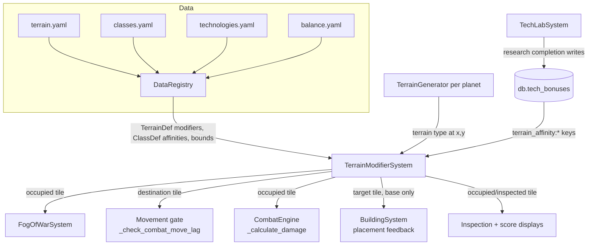

# Design Document: Terrain Strategy

## Overview

This feature makes terrain strategically meaningful by giving every terrain type three
combat-relevant modifiers — vision, in-combat movement, and defense — defined in
`terrain.yaml`, and by letting classes and researched technologies adjust how strongly those
modifiers apply to a player (Terrain_Affinity).

The design introduces exactly one new system, the **TerrainModifierSystem**
(`Terrain_Modifier_System` in the requirements): a small, stateless resolver that answers
"what terrain modifiers apply to this entity at this coordinate?" All consumers — the
FogOfWarSystem, the in-combat movement gate, the CombatEngine, the BuildingSystem placement
feedback, and the inspection/score displays — read through this single resolution point and
never combine terrain data themselves.

Everything else is a targeted extension of existing systems:

- `TerrainDef` gains three modifier fields, loaded and validated by the existing
  DataRegistry fail-fast pipeline.
- `ClassDef` gains an optional `terrain_affinities` list.
- Technology terrain effects reuse the existing `db.tech_bonuses` additive-dict mechanism
  unchanged, via structured bonus keys.
- Three balance bounds join `BalanceConfig`, picked up by the existing generic
  balance loader and validator.

### Intentional tile-selection asymmetry (Req 2.7) — DO NOT UNIFY

Vision and defense resolve against the terrain of the tile the entity **occupies**;
movement resolves against the terrain of the **destination** tile the entity is moving
onto. An entity sees and defends from where it stands, and slogs into the tile it enters.

The resolver itself is coordinate-based and agnostic — the asymmetry lives in the
*consumers*, each of which passes the correct coordinate:

| Consumer | Coordinate passed to resolver |
|---|---|
| FogOfWarSystem (vision) | entity's current position |
| CombatEngine (defense) | target's position at attack resolution |
| Movement gate (lag) | destination tile of the attempted move |

Implementers must not "simplify" this into a single tile choice. The asymmetry is a
gameplay decision, not an accident.

## Architecture



### Data flow

1. **Load time**: DataRegistry loads terrain modifier fields, class affinities, tech
   terrain effects, and balance bounds, following the existing fail-fast contract —
   errors are collected across all definitions and raised as a single
   `DataRegistryError`; a failed hot-reload atomically keeps current data
   (`reload_all` already builds a temp registry and swaps only on success — no change
   needed there).
2. **Resolution time**: a consumer calls the TerrainModifierSystem with a planet,
   coordinate, and optionally a player. The resolver asks the planet's TerrainGenerator
   for the terrain type, looks up the TerrainDef base modifiers, adds class and
   completed-technology affinity adjustments (players only), clamps each total to its
   balance bound sign-preservingly, and returns the result.
3. **Consumption**: each consumer feeds the resolved value into its existing formula
   (vision radius, movement lag, damage reduction) at a single, clearly marked point.

### Wiring (composition root)

`server/conf/game_init.py initialize_game()` constructs the TerrainModifierSystem after
the registry and terrain generators exist, and registers it in the systems dict as
`"terrain_modifier_system"` so consumers reach it via `services.get_service`. The
FogOfWarSystem is constructed before the terrain generators, so it receives the resolver
late-bound via a setter (same pattern as its existing `set_in_bounds_func`).

### Caching decision: none (Req 2.4)

Requirement 2.4 is a **determinism guarantee, not a cache mandate**. This design does
not add a cache:

- `TerrainGenerator.get_terrain` is a pure hash computation (no I/O), TerrainDef and
  ClassDef lookups are dict reads, and tech adjustments are a small dict scan. The
  whole resolution is a few dozen nanosecond-scale operations per query.
- Determinism follows from purity: given the same (planet, coordinate, generator epoch,
  player class, completed terrain technologies), every input to the computation is
  identical, so the output is identical.
- A cache would need invalidation on three axes — terrain generator epoch rotation,
  class change, and research completion — plus hot-reload. That complexity buys nothing
  measurable at current query rates (per move, per attack, per map render).

If profiling ever shows resolution as a hotspot, a cache keyed on
`(planet, x, y, epoch, class_key, tech_bonus_version)` can be added inside the resolver
without touching any consumer.

## Components and Interfaces

### 1. TerrainModifierSystem (new: `world/systems/terrain_modifiers.py`)

```python
@dataclass(frozen=True)
class TerrainModifiers:
    """Resolved, clamped terrain modifiers for one entity at one coordinate."""
    terrain_type: str | None   # None when no generator / resolution failed
    vision: int                # tiles, +widens / -narrows (Req glossary)
    movement: float            # ticks, +reduces lag / -increases lag
    defense: float             # DR points, +adds / -subtracts

ZERO_MODIFIERS = TerrainModifiers(None, 0, 0.0, 0.0)


class TerrainModifierSystem:
    def __init__(self, registry, terrain_generators: dict[str, TerrainGenerator]):
        ...

    def resolve_base(self, planet: str, x: int, y: int) -> TerrainModifiers:
        """Base terrain modifiers at (x, y) — no class/tech adjustments.

        Used for buildings (Req 2.6, 3.3, 5.3) and as the fallback path.
        Returns ZERO_MODIFIERS when no generator exists for *planet* (Req 2.3)
        or the generator's terrain type has no TerrainDef (Req 2.5).
        Every returned value is already clamped (Req 9.5).
        """

    def resolve_for_player(self, player, planet: str, x: int, y: int) -> TerrainModifiers:
        """Base modifiers plus the player's class and completed-tech affinity
        adjustments for the resolved terrain type (Req 2.2), clamped (Req 9.2, 9.5).

        Any failure reading class or tech affinities degrades to base modifiers
        (Req 6.4) — never raises.
        """
```

Resolution algorithm (per modifier kind):

```
terrain_type = generators[planet].get_terrain(x, y)      # Req 2.1; missing → ZERO (2.3)
tdef = registry.terrain.get(terrain_type)                # missing → ZERO (2.5)
total = tdef.<kind>_modifier                             # base
if player is not None:
    total += sum of class affinities matching (terrain_type, kind)      # 6.2, 6.7
    total += db.tech_bonuses.get(f"terrain_affinity:{terrain_type}:{kind}", 0)  # 7.3, 7.4
bound = balance.terrain_<kind>_bound
if abs(total) > bound:
    total = copysign(bound, total)                       # 9.2 sign-preserving clamp
```

The clamp is applied **inside the resolver, on every return path**, so consumers only
ever see clamped values (Req 9.5). `vision` is coerced to `int` after clamping.

Notes:

- Class affinities are read from `registry.get_class(player.db.player_class)`; a class
  may define multiple affinities matching the same terrain and kind — they are summed
  (Req 6.7). Any exception during affinity resolution is caught and logged once, and
  the base value is used (Req 6.4).
- Technology adjustments are read from `db.tech_bonuses` under structured keys (see §4).
  Only completed research writes those keys, so in-progress research contributes zero
  (Req 7.3) and adjustments survive reconnects because `db.tech_bonuses` is Evennia
  persistent state (Req 7.6).
- The resolver is planet+coordinate based; the occupied-vs-destination choice is the
  caller's (see the asymmetry table above).

### 2. DataRegistry + SchemaValidator extensions

**`TerrainDef` (world/definitions.py)** gains:

```python
vision_modifier: int = 0        # tiles
movement_modifier: float = 0.0  # ticks
defense_modifier: float = 0.0   # DR points
```

**`_populate_terrain`** reads the three fields with `entry.get(field) or 0` semantics
(missing or `null` → 0, Req 1.2). When **all three** are missing/null it logs a warning
naming the terrain type and still loads with zeros (Req 1.3) — this is the single
warning-not-error case; it does not fail the load.

**`SchemaValidator.validate_terrain`** gains per-field numeric checks: each of the three
modifier fields, when present and non-null, must be an `int` or `float` and not a `bool`
(bool is an int subclass in Python — reject explicitly, matching the existing
`validate_ability_gates` pattern). Violations append one error per offending field,
naming the terrain type and field (Req 1.4), into the shared error list that `load_all`
raises as `DataRegistryError` — so all errors across all terrain definitions are
reported at once, and hot-reload keeps current data on failure.

**`ClassDef` (world/definitions.py)** gains:

```python
@dataclass(frozen=True)
class TerrainAffinity:
    terrain_type: str
    kind: str          # "vision" | "movement" | "defense"
    adjustment: float

# on ClassDef:
terrain_affinities: list[TerrainAffinity] = field(default_factory=list)
```

**`_load_classes`** parses an optional `terrain_affinities` list per class entry.
Design decision — contract escalation, called out explicitly: classes.yaml today has a
lenient "malformed → skip, never block start" contract, but Requirements 6.5/6.6 mandate
fail-fast validation for affinity entries. `_load_classes` therefore collects affinity
validation errors across **all** classes and raises `DataRegistryError` at the end when
any exist, while keeping the lenient behavior for the pre-existing class fields
(key/name/description/stat_modifiers). Validated per entry (Req 6.6):

- `terrain_type` must exist in `self.terrain` (classes load after terrain populates,
  so the cross-file check is a direct dict lookup);
- `kind` must be one of `vision` / `movement` / `defense`;
- `adjustment` must be numeric (non-bool int or float).

Sidegrade rule (Req 6.5): if a class has any affinity with a positive adjustment, it
must also have at least one negative-adjustment affinity **or** at least one negative
`stat_modifiers` value, and a non-empty description; otherwise a validation error names
the class. (That the description *names* the weakness is an authoring convention
enforced by content review — free text is not machine-checkable.)

**`TechnologyDef`**: no structural change. Terrain technologies use the existing
`effect_type`/`effect_value` fields with `effect_type: terrain_affinity` and an
`effect_value` dict whose keys are structured bonus keys (see §4). Validation for these
entries is added to `validate_technologies` (key format, valid kind, numeric value) and
the terrain-type existence check goes in the existing `cross_validate` step (technologies
populate before terrain in `load_all`'s validate phase, but `cross_validate` runs after
all `_populate_*` calls, so terrain types are available there). Errors are collected
across all technology definitions and fail the load (Req 7.5).

**`BalanceConfig`** gains four fields:

```python
terrain_vision_bound: int = 5        # Req 9.3 default
terrain_movement_bound: float = 3.0  # ticks
terrain_defense_bound: float = 6.0   # DR points
min_vision_radius: int = 1           # Req 3.6 default
```

The generic `_build_balance` scalar copy and the derived `_BALANCE_INT_FIELDS` /
`_BALANCE_FLOAT_FIELDS` validation pick these up automatically (Req 9.1, 9.3). The three
bound fields and `min_vision_radius` are added to the validator's `non_negative_fields`
list so a negative or non-numeric value fails the load (Req 9.4) — defaults apply only
to *omitted* fields, exactly like the rest of balance.

### 3. FogOfWarSystem changes (`world/coordinate/fog_of_war.py`)

A late-bound resolver injection, mirroring `set_in_bounds_func`:

```python
def set_terrain_modifier_resolver(self, resolver) -> None:
    """Inject the TerrainModifierSystem (late-bound at the composition root)."""
```

`get_visible_tiles` changes:

- **Player circle**: `radius = base + sight_bonus + terrain_vision` where
  `terrain_vision` is `resolve_for_player(player, planet, px, py).vision` — the
  **occupied** tile (Req 3.1). The combined value is truncated toward zero with `int()`
  (Req 3.7) then clamped to `max(min_vision_radius, radius)` (Req 3.2).
- **Building circles**: `radius = building_vision_radius + resolve_base(planet, bx, by).vision`,
  base modifiers only (Req 3.3), same truncate-then-minimum treatment (Req 3.2).
- **Failure path**: if the resolver is unset (tests, unwired) or raises, terrain vision
  is 0 and the circle is computed from the remaining adjustments (Req 3.5). Never raises.

Requirement 3.4 (narrowed vision shows discovered tiles as fog, never unexplored) needs
**no new code**: discovery memory is a monotonically growing bitfield that
`update_discovery` only adds to, and `get_tile_visibility` already answers `"fog"` for
any discovered tile outside the visible set. A narrower circle shrinks the visible set
but never touches the bitfield. The design constraint is: *do not* remove tiles from the
bitfield anywhere in this feature. The property test locks this in.

### 4. TechLabSystem + tech bonus keys (no code change in tech_system.py)

Terrain technology effects reuse the existing additive mechanism byte-for-byte. A
terrain technology's `effect_value` is a dict whose keys follow:

```
terrain_affinity:{terrain_type}:{kind}     e.g.  terrain_affinity:Forest:movement
```

Example `technologies.yaml` entry:

```yaml
- name: Forest Warfare
  key: forest_warfare
  required_rank: Sergeant
  resource_cost: {Wood: 200}
  research_ticks: 20
  effect_type: terrain_affinity
  effect_value:
    "terrain_affinity:Forest:movement": 1
```

Why this works with zero TechLabSystem changes:

- `_apply_tech_effect` already merges numeric `effect_value` dict entries additively
  into `db.tech_bonuses` on research completion (Req 7.2), so multiple technologies
  touching the same terrain/kind sum naturally (Req 7.4).
- `db.tech_bonuses` is persistent Evennia state — reconnecting players keep their
  adjustments with no re-research (Req 7.6).
- `recompute_tech_bonuses` (the grandfathering path) rebuilds these keys from
  `researched_techs` for free.
- In-progress or unstarted research never writes bonuses, so the resolver's read of
  `db.tech_bonuses` inherently applies zero for them (Req 7.3).

The resolver parses nothing at read time — it does a single dict `get` with the exact
key it constructs from the resolved terrain type and kind.

### 5. Movement gate changes (`commands/game_commands.py _check_combat_move_lag`)

The gate's signature gains the destination coordinate:
`_check_combat_move_lag(caller, dest_x, dest_y)` — the caller (CmdMove) already knows the
destination tile before invoking the gate. The terrain modifier is resolved for the
**destination** tile (Req 4.1, Req 2.7 asymmetry), via
`resolve_for_player(caller, planet, dest_x, dest_y).movement`; resolution failure or an
unwired system yields 0 (Req 4.7).

Effective lag formula — a new helper in `world/constants.py`, because the existing
`compute_effective_delay` floors at 1 (agents must keep that floor) while Req 4.2
requires a **zero** floor for the player combat gate:

```python
def compute_combat_move_lag(base: int, move_speed: int, terrain_mod: float) -> int:
    """Player in-combat movement lag: max(0, int(base - move_speed - terrain_mod)).

    Zero-floored (Req 4.2): a fast, favorably-positioned player may move again on
    the same tick. int() truncates toward zero so fractional terrain modifiers
    never grant more relief than a full tick. Agents keep compute_effective_delay
    (min 1) — do not merge the two helpers.
    """
    return max(0, int(base - move_speed - terrain_mod))
```

Gate behavior updates:

- Out of combat: unchanged — instant movement, stale lag cleared (Req 4.3).
- Blocked move: position and pending lag unchanged (Req 4.4 — already true; the gate
  returns False before any state change). The wait message now includes the remaining
  wait in ticks (`next_move_tick - current_tick`, always > 0 on the blocked path, so
  "no message at zero remaining" (Req 4.6) is satisfied structurally — a zero remaining
  wait means the move proceeds).
- The `caller.msg(...)` call is wrapped in try/except so a message-delivery failure
  still blocks the move (Req 4.5).

### 6. CombatEngine changes (`world/systems/combat_engine.py _calculate_damage`)

Only the **physical** branch changes (Req 5.5 — non-physical types keep reading their
typed resist and never see terrain):

```python
if damage_type == "physical":
    armor_reduction = self._get_target_armor_reduction(target)
    armor_reduction += self._terrain_defense(target)   # occupied tile (Req 2.7)
    armor_reduction = max(0.0, armor_reduction)        # Req 5.4 floor
else:
    armor_reduction = self._get_target_typed_resist(target, damage_type)
```

New helper `_terrain_defense(target)`:

- Player target → `resolve_for_player(target, planet, x, y).defense` at the target's
  position **when the attack resolves** (Req 5.1) — including class/tech adjustments.
- Building target → `resolve_base(planet, x, y).defense` at the building's position
  (Req 5.3) — base only. Note buildings currently contribute 0 through
  `_get_target_armor_reduction` (it early-returns for non-players); the terrain term is
  the first DR buildings get, which is why the hook lives in `_calculate_damage` rather
  than inside that player-only helper.
- Any resolution failure → 0.0, guarded, never raises.

The chip floor is untouched and continues to apply **after** the terrain-adjusted DR
(Req 5.2): `dealt = max(chip_floor, int(raw - armor_reduction), 0)`. Because the DR
total is floored at zero before subtraction, a negative terrain modifier can never push
damage above `raw` (Req 5.4).

### 7. Visibility surfaces (Req 8)

- **Tile inspection** (the coordinate-inspection read points in
  `commands/game_commands.py` that currently call `gen.get_terrain_and_resource`): before
  showing terrain, check the tile's discovery state via
  `fog_system.get_tile_visibility(...)`. If `"unexplored"`, respond only "That tile is
  unexplored." — no terrain type, no modifiers (Req 8.4). Otherwise display the terrain
  type plus the three values from `resolve_for_player(caller, planet, x, y)` — the
  clamped, affinity-adjusted values, never raw TerrainDef fields (Req 8.1).
- **CmdScore**: a new "Terrain" section shows the three resolved values for the player's
  current tile, always printing all three (zeros included, Req 8.2).
- **BuildingSystem placement feedback**: both the acceptance message and every rejection
  message append the target tile's resolved Defense_Modifier, via
  `resolve_base(planet, x, y).defense` (buildings get base modifiers — Req 2.6/5.3 make
  the base value the honest number to show a builder; Req 8.3). The BuildingSystem
  receives the resolver the same way it already receives its `terrain_provider` —
  injected at the composition root with a services-lookup fallback.

## Data Models

### terrain.yaml (extended)

```yaml
terrain:
  - terrain_type: Forest
    map_symbol: "^^"
    resource_type: Wood
    passable: true
    vision_modifier: -2      # dense canopy narrows sightlines
    movement_modifier: -1    # slog: +1 tick of in-combat lag
    defense_modifier: 3      # cover: +3 DR
  - terrain_type: Plains
    map_symbol: "  "
    passable: true
    # all three omitted → zeros + one warning naming "Plains" (Req 1.3)
```

### classes.yaml (extended)

```yaml
classes:
  - key: ranger
    name: Ranger
    description: >
      At home under the canopy — but thin-skinned in the open. (names weakness)
    stat_modifiers: {damage_reduction: -2}   # offsetting weakness (Req 6.5)
    terrain_affinities:
      - {terrain_type: Forest, kind: movement, adjustment: 1}
      - {terrain_type: Forest, kind: vision, adjustment: 2}
```

### db.tech_bonuses keys (existing persistent dict, new key family)

```
"terrain_affinity:{terrain_type}:{kind}" -> float   (additive across technologies)
```

### Resolution result

`TerrainModifiers(terrain_type, vision: int, movement: float, defense: float)` — frozen,
always clamped, `ZERO_MODIFIERS` for every failure path.

## Error Handling

| Failure | Behavior | Req |
|---|---|---|
| Terrain modifier field non-numeric (incl. bool/str) | Collect error naming terrain + field across all defs; raise `DataRegistryError`; boot aborts / hot-reload keeps current data | 1.4 |
| All three modifier fields missing/null | **Warning** (log, names terrain type), load with zeros — the single warning-not-error case | 1.3 |
| Some modifier fields missing/null | Silent default to zero, no error, no warning | 1.2 |
| Class affinity invalid (unknown terrain / bad kind / non-numeric) | Collect across all classes; raise `DataRegistryError` | 6.6 |
| Class has positive affinity, no offsetting negative | Validation error naming the class; fail load | 6.5 |
| Tech terrain effect invalid | Collect across all technologies; raise `DataRegistryError` | 7.5 |
| Balance bound non-numeric or negative | Validation error; fail load (defaults only for omitted) | 9.4 |
| No terrain generator for planet | `ZERO_MODIFIERS` | 2.3 |
| Terrain type without TerrainDef (cross-file drift) | `ZERO_MODIFIERS` | 2.5 |
| Class/tech affinity read raises at resolve time | Base modifiers, log once, never raise | 6.4 |
| FogOfWar resolver unset or raises | Terrain vision 0, circle from remaining adjustments | 3.5 |
| Movement modifier unresolvable | Terrain movement 0 | 4.7 |
| Wait-message delivery fails | Move still blocked | 4.5 |
| Combat terrain defense unresolvable | Terrain defense 0.0 | — |

Guiding rule (matches codebase convention): **load time fails fast, run time fails
soft**. Every runtime resolver path degrades to zero/base and never propagates an
exception into movement, combat, or rendering.


## Correctness Properties

*A property is a characteristic or behavior that should hold true across all valid
executions of a system — essentially, a formal statement about what the system should do.
Properties serve as the bridge between human-readable specifications and
machine-verifiable correctness guarantees.*

### Property 1: Terrain modifier load round-trip with zero defaults

*For any* terrain definition set where each of the three modifier fields is independently
a valid number, missing, or null, `load_all` succeeds without validation errors, and the
`TerrainDef` returned by the registry's terrain lookup carries exactly the provided
numeric values, with every missing/null field defaulted to zero.

**Validates: Requirements 1.1, 1.2, 1.3, 1.5, 1.6**

### Property 2: Non-numeric terrain modifiers fail fast, collectively and atomically

*For any* terrain definition set containing one or more non-numeric modifier values
(bool, string, list, ...), `load_all` raises `DataRegistryError` whose message identifies
every offending terrain type and field name, and a `reload_all` against such data returns
failure while leaving all currently loaded registry data unchanged.

**Validates: Requirements 1.4**

### Property 3: Base resolution equals the generator's terrain definition

*For any* planet, coordinate, and terrain definition set, `resolve_base(planet, x, y)`
returns the clamped modifier values of the TerrainDef for
`generator.get_terrain(x, y)` — and returns all-zero modifiers when no generator exists
for the planet or when the resolved terrain type has no TerrainDef — regardless of any
class or technology affinity data present in the system.

**Validates: Requirements 2.1, 2.3, 2.5, 2.6**

### Property 4: Affinity summation

*For any* terrain type, class affinity list, and completed-technology bonus set, the
player-resolved modifier for each kind equals
`clamp(base + Σ matching class adjustments + Σ matching tech adjustments)` — where
"matching" means same terrain type and same kind — and every kind or terrain with no
matching affinity resolves to its clamped base value. Technology contributions equal
exactly the content of `db.tech_bonuses` (research not yet completed has written nothing
and therefore contributes zero).

**Validates: Requirements 2.2, 6.2, 6.3, 6.7, 7.3, 7.4**

### Property 5: Resolution determinism

*For any* fixed combination of planet, coordinate, terrain generator epoch, player class,
and completed terrain technologies, repeated resolution queries — including queries
interleaved with resolutions for other coordinates and players — return identical
modifier values every time.

**Validates: Requirements 2.4**

### Property 6: Sign-preserving clamp on every resolver output

*For any* resolution input state and any non-negative configured bounds, every modifier
value returned by the resolver satisfies `|value| <= bound(kind)`; when the unclamped
total is within the bound the value equals the total, and when it exceeds the bound the
value equals the bound magnitude carrying the total's sign.

**Validates: Requirements 9.2, 9.5**

### Property 7: Vision radius formula

*For any* base radius, sight bonus, terrain vision modifier (integer or fractional), and
configured minimum radius, the computed vision circle radius equals
`max(min_vision_radius, int(base + sight_bonus + terrain_vision))` — truncation toward
zero, then the minimum clamp — for player circles (player-resolved modifier at the
occupied tile) and for building circles (base modifier at the building position, never
affected by any player's class or technology affinities).

**Validates: Requirements 3.1, 3.2, 3.3, 3.7**

### Property 8: Narrowed vision never forgets discovery

*For any* sequence of discovery updates followed by any narrowing of the vision circle,
every previously discovered tile that falls outside the new circle reports `"fog"` —
never `"unexplored"` — and the discovery bitfield contains every tile it contained before
the narrowing.

**Validates: Requirements 3.4**

### Property 9: In-combat movement lag formula with destination asymmetry

*For any* in-combat player, equipment move_speed modifier, and pair of (occupied,
destination) tiles with independently generated terrain movement modifiers, a permitted
move schedules the next move at
`current_tick + max(0, int(COMBAT_MOVE_LAG_TICKS - move_speed - destination_modifier))` —
using the destination tile's modifier, not the occupied tile's — and *for any* player not
in combat, moves are always permitted with no lag scheduled.

**Validates: Requirements 4.1, 4.2, 4.3, 2.7**

### Property 10: Blocked moves change nothing

*For any* in-combat player whose pending `next_move_tick` is in the future, an attempted
move is rejected and the player's coordinates and pending lag value are exactly what they
were before the attempt.

**Validates: Requirements 4.4**

### Property 11: Physical damage formula with terrain DR, chip floor, and zero floor

*For any* physical attack with positive raw output against any target, the damage dealt
equals `max(chip_floor, int(raw - max(0, other_DR + terrain_defense)), 0)` where
`terrain_defense` is the player-resolved defense modifier at the target's occupied tile
for player targets and the base modifier at the building's position for building targets;
consequently damage never falls below `ceil(raw * chip_fraction)` no matter how large the
terrain defense, and never exceeds `raw` no matter how negative it is.

**Validates: Requirements 5.1, 5.2, 5.3, 5.4, 2.7**

### Property 12: Non-physical damage ignores terrain

*For any* attack whose damage type is not physical, the computed damage is identical
whether terrain defense modifiers, class affinities, and terrain technologies are present
or entirely absent.

**Validates: Requirements 5.5**

### Property 13: Affinity load round-trip

*For any* valid class definition set with terrain affinity lists and any valid terrain
technology set, loading succeeds and the `ClassDef.terrain_affinities` entries and
`TechnologyDef.effect_value` payloads read back from the registry equal the yaml input.

**Validates: Requirements 6.1, 7.1**

### Property 14: Affinity validation fails fast, collectively

*For any* class or technology definition set containing one or more invalid affinity
entries (a terrain type absent from the terrain definitions, a kind other than
vision/movement/defense, or a non-numeric adjustment) or a class carrying a
positive-adjustment affinity with no offsetting negative affinity or negative
stat_modifier, `load_all` raises `DataRegistryError` whose message identifies every
invalid entry and every unbalanced class.

**Validates: Requirements 6.5, 6.6, 7.5**

### Property 15: Research completion records terrain adjustments

*For any* set of terrain technologies, completing research on each writes its structured
`terrain_affinity:{terrain}:{kind}` adjustment into `db.tech_bonuses`, values for the
same key summing across technologies, and `recompute_tech_bonuses` reproduces the same
dict from the researched set (idempotent rebuild).

**Validates: Requirements 7.2, 7.6**

### Property 16: Inspection shows resolved values and unexplored tiles leak nothing

*For any* tile and player: if the tile is visible or in the player's discovery memory,
the inspection output contains the terrain type and the three resolver-produced values
(clamped, affinity-adjusted — asserted on states where resolved differs from the raw
TerrainDef values); if the tile has never been discovered, the output indicates it is
unexplored and contains neither the terrain type nor any modifier value.

**Validates: Requirements 8.1, 8.4**

### Property 17: Score and placement surfaces render resolved values

*For any* resolved modifier triple (including zeros), the score display contains all
three values for the player's current tile; and *for any* placement attempt — accepted or
rejected — the placement feedback contains the resolved defense modifier of the target
tile.

**Validates: Requirements 8.2, 8.3**

## Testing Strategy

### Dual approach

- **Property-based tests** (Hypothesis) implement the 17 correctness properties above —
  one property test per property, following the established codebase conventions.
- **Example-based unit tests** cover the specific behaviors prework classified as
  EXAMPLE/EDGE_CASE: the all-three-missing warning (1.3), resolver-failure fallbacks
  (3.5, 4.5, 4.7, 6.4), the `min_vision_radius` default (3.6), the blocked-move message
  content (4.6), balance bound defaults and invalid-bound load failures (9.1, 9.3, 9.4),
  and same-`db.tech_bonuses`-dict resolution equivalence (7.6, alongside Property 15).

### PBT conventions (must match existing `mygame/world/tests/test_prop_*.py`)

- Library: **Hypothesis** (already a test dependency — do not add a new library).
- New test files: `mygame/world/tests/test_prop_terrain_modifiers.py` (resolver, clamp,
  load/validation properties), `mygame/world/tests/test_prop_terrain_consumers.py`
  (vision, movement, damage, display properties). Command-layer tests may live in
  `mygame/commands/tests/` mirroring existing placement.
- `@settings(max_examples=100)` minimum on every property test (the codebase uses
  100–200).
- Tag each test with the design property, matching the existing comment format:

  ```python
  # Feature: terrain-strategy, Property 4: Affinity summation
  ```

  plus a module docstring `**Validates: Requirements X.Y, ...**` line, as in
  `test_prop_hot_reload.py`.
- Registry-load properties follow the `test_prop_hot_reload.py` pattern: write generated
  yaml into a `tempfile` tree seeded from the valid baseline fixtures, then `load_all` /
  `reload_all` a fresh `DataRegistry`.
- Runtime properties use plain fake objects (the `FakePlayer` style from
  `test_combat_engine.py` / `test_tech_system.py`) and `services.override` for system
  injection — no Evennia database objects in property tests.

### Test isolation and cost

- The resolver is constructed directly with a real `TerrainGenerator` (pure, no I/O) and
  an in-memory registry — property iteration cost is microseconds.
- CombatEngine and FogOfWarSystem properties drive the real methods with fakes for
  player/building/equipment, exactly as the existing engine test suites do.
- Consumer command tests (inspection, score, placement feedback) assert on captured
  `msg()` output strings.

### Regression safety

The full suite (2819 tests currently passing) is run with `python -m pytest mygame -q`
from the repo root after each implementation task. Every new modifier defaults to zero
and every new balance field has a neutral default, so shipped data files unchanged means
all existing formulas produce identical results (see Migration and Rollout).

## Migration and Rollout

The feature is designed so that every step keeps the full suite green:

1. **Neutral-by-default data.** All three `TerrainDef` modifier fields default to `0`,
   `terrain_affinities` defaults to `[]`, no shipped technology uses
   `effect_type: terrain_affinity` initially, and the balance bounds/minimum have
   defaults. With zero modifiers, every consumer formula reduces exactly to its current
   form: vision `+0` then `max(1, r)` (existing radii are well above 1), lag
   `max(0, int(base - speed - 0))` equals the current `compute_effective_delay` result
   for the shipped ranges (base 2, speed 0..1 — the divergence at the 0-vs-1 floor only
   appears once terrain relief exists), and damage `+0.0` DR. Existing yaml files load
   unchanged: missing modifier fields are legal (Req 1.2) — expect only the per-terrain
   all-three-missing warnings (Req 1.3) until `terrain.yaml` is populated.
2. **Implementation order** (each step independently green):
   a. Definitions + validators + balance fields (defaults keep behavior identical).
   b. TerrainModifierSystem + wiring in `initialize_game` (new code, no consumers).
   c. Consumers one at a time — fog of war, movement gate, combat engine, displays,
      placement feedback — each guarded by the fail-soft zero path so an unwired
      resolver changes nothing.
   d. Content: populate `terrain.yaml` modifiers, class affinities, and terrain
      technologies last, once all mechanics are tested.
3. **Hot-reload compatible.** All new data flows through `load_all`/`reload_all`; the
   temp-registry + atomic-swap already covers the new fields with no extra work. A
   `@reload` with invalid terrain/class/tech data keeps the running game on current
   data (Property 2).
4. **Movement-lag caveat (called out for reviewers).** Switching the player gate from
   `compute_effective_delay` (floor 1) to `compute_combat_move_lag` (floor 0) is
   behavior-identical for all shipped equipment (max shipped `move_speed` keeps
   `base - speed >= 1`); the floors only diverge once positive terrain movement relief
   ships. The two existing movement-lag unit tests in
   `commands/tests/test_game_commands.py` assert the formula against
   `COMBAT_MOVE_LAG_TICKS` and remain valid; the gate's new `(dest_x, dest_y)`
   parameters must be threaded through `CmdMove`'s call site in the same change.
5. **Style.** All new code respects the repo's `.flake8` 100-character line limit.
