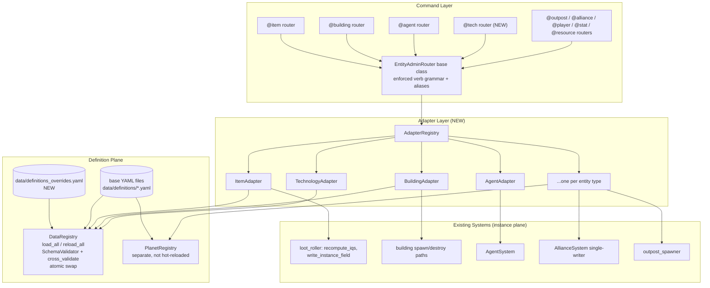

# Design Document: Unified Admin CRUD

## Overview

The game has accumulated many entity types — players, agents, NPC guards/bases, buildings, items, outposts, resource drops, bombs, technologies, powerups, terrain, planets — and each grew its own admin command dialect. Create is `spawn` for buildings and items, `create` for agents, `give` for resources. Read is `stats` for items, `inspect` for alliances, `show` for stats. `list` means definitions for `@item`/`@building` but instances for `@outpost`/`@alliance`. Buildings and agents cannot be `set` or `show`n at all, technologies cannot be granted or revoked, and powerups/terrain/planets have no admin surface whatsoever. An admin must memorize a per-entity dialect instead of learning one pattern.

This design unifies admin CRUD around three pillars:

1. A **shared EntityAdapter layer**: one descriptor per entity type declaring how to resolve targets, which fields are modifiable (with bounds and permission tiers), and how create/read/update/delete hook into the real systems. This is where the actual unification lives.
2. A **standardized verb grammar enforced by the router base class** (not by convention): every `@<entity>` admin command answers the same core verbs — `list`, `spawn`, `show`, `set`, `destroy` — plus a uniform `def` scope for definition-level operations. Entity-specific extra verbs survive; old spellings keep working via migration aliases.
3. **Overlay-backed definition CRUD**: a single override file merged over the base YAML at load time. `def set` writes only the overlay; base YAML files stay pristine and git history remains the source of truth for base data. Validation always runs on the merged result through the existing `SchemaValidator` + atomic-swap reload pipeline, so a bad override can never half-apply.

The design deliberately separates the two CRUD planes the user called out: **definition scope** (the YAML-backed `ItemDef`, `BuildingDef`, `TechnologyDef`, ... in `DataRegistry`) and **instance scope** (a live `GameItem`, `Building`, agent on the map). Both planes share the same grammar; the `def` keyword is the only pivot between them.

## Recorded Decisions (settled — not to be reopened)

| # | Decision | Choice |
|---|----------|--------|
| D1 | Definition edits: overlay file vs writing back to base YAML | **Overlay file** (`data/definitions_overrides.yaml`). Base YAML stays pristine; git history stays authoritative for base data. |
| D2 | Out-of-bounds `set` values | **Clamp with a note** to the caller (matches existing `@item set` band-clamping behavior), never silently and never rejected. |
| D3 | Definition-scope keyword | **`def`** — `@item def show rifle`, `@building def set hq hp_max 500`. |
| D4 | Unification shape | One shared adapter layer + per-entity routers with an enforced common grammar (Design A). NOT a single monolithic `@admin` command. |
| D5 | Compatibility | Old spellings survive as **aliases** with a deprecation note; phased per-entity rollout. |

## Architecture



The flow: an admin types `@building set #2 level 4`. The router base class dispatches the `set` verb (existing `SubcommandDispatchMixin` mechanics in `commands/command_router.py`), the shared `set` handler asks the `AdapterRegistry` for the `building` adapter, the adapter resolves `#2` against the last `@building list` output, looks up `level` in its field schema (bounds 1–5, permission tier, clamp policy), clamps if needed, and applies the write through the building system's real update path. `@building def set hq hp_max 500` takes the definition branch instead: the adapter writes the override into `data/definitions_overrides.yaml` and triggers the merged-validate-and-swap reload.

## Components and Interfaces

### Component 1: EntityAdapter (NEW — the unification core)

**Purpose**: A per-entity-type descriptor that declares everything the shared verb handlers need: target resolution, field schema, CRUD hooks, and definition-scope operations. Routers become thin; behavior differences live in adapter data, not in copy-pasted handler code.

**Interface** (Python, matching the existing frozen-dataclass style of `DataRegistry` defs):

```python
@dataclass(frozen=True)
class FieldSpec:
    """One modifiable field on an entity (instance or definition plane)."""
    name: str                    # e.g. "level", "hp_max", "damage"
    kind: str                    # "int" | "float" | "str" | "enum"
    min_value: float | None      # None = unbounded low
    max_value: float | None      # None = unbounded high; item roll fields
                                 # derive bounds from ItemDef.roll_spec bands
    perm: str                    # "Builder" | "Admin" — per-field tier
    dynamic_bounds: Callable | None  # optional: (entity) -> (lo, hi); used by
                                     # item roll bands which vary per ItemDef
    enum_values: tuple[str, ...] | None  # for kind == "enum" (e.g. rarity)

class EntityAdapter(Protocol):
    """One per entity type, registered in AdapterRegistry."""
    entity_key: str              # "item", "building", "agent", "tech", ...

    # --- target resolution (instance plane) ---
    def list_instances(self, caller, filter_str) -> list[InstanceRow]
    def resolve_instance(self, caller, token) -> Resolution
        # uniform grammar: "#N" index into caller's last list for this
        # entity type, exact key, exact name, unambiguous prefix;
        # trailing [player] arg defaults to caller where applicable

    # --- field schema ---
    def instance_fields(self) -> dict[str, FieldSpec]
    def definition_fields(self) -> dict[str, FieldSpec]

    # --- instance CRUD hooks (delegate to REAL system paths) ---
    def create(self, caller, def_token, kwargs) -> CreateResult   # spawn
    def read(self, caller, instance) -> ShowReport                # show
    def update(self, caller, instance, field, value) -> SetResult # set
    def delete(self, caller, instance) -> DeleteResult            # destroy

    # --- definition scope ---
    def def_registry_dict(self) -> Mapping[str, Any] | None
        # e.g. DataRegistry.items; None => no def surface (opt-out w/ reason)
    def def_resolve(self, token) -> Any | None
        # delegates to existing DataRegistry.resolve_* prefix matchers

    # --- grammar contract ---
    supported_verbs: frozenset[str]   # must cover CORE_VERBS or list
    opt_outs: dict[str, str]         # verb -> human-readable reason
    extra_verbs: dict[str, str]      # e.g. {"open": "Open shop menu"}
    aliases: dict[str, str]          # old spelling -> new verb
```

**Responsibilities**:
- Own the uniform target-resolution grammar per entity type
- Declare modifiable fields with bounds, clamp policy, per-field permission
- Route every write through the entity's existing single-writer path (e.g. items re-stamp IQS via `recompute_iqs` in `world/systems/loot_roller.py`; alliance mutations via `AllianceSystem`)
- Declare which core verbs are supported, opted out (with reason), extra, or aliased

### Component 2: AdapterRegistry (NEW)

**Purpose**: Registration point and lookup for all adapters; also the enforcement point for the grammar contract at startup.

```python
class AdapterRegistry:
    def register(self, adapter: EntityAdapter) -> None
        # Raises at registration time if adapter neither supports nor
        # explicitly opts out (with reason) of every core verb.
    def get(self, entity_key: str) -> EntityAdapter | None
    def all(self) -> list[EntityAdapter]
```

**Responsibilities**:
- Fail fast (at server start / test time) when an adapter's verb coverage is incomplete — this makes the grammar a checked invariant, not a convention
- Provide the enumeration surface for a future `@admin help` overview and for the verb-grammar-uniformity property test

### Component 3: EntityAdminRouter base class (extends existing router)

**Purpose**: A new subclass of the existing `AdminSubcommandRouter` (`commands/command_router.py`) that auto-builds the `subcommands` dict from the adapter's grammar contract, wires shared handlers for the core verbs, installs migration aliases, and dispatches the `def` scope.

**EXISTS**: `SubcommandDispatchMixin` already provides verb dispatch, per-verb permissions via `subcommands = {verb: (handler, help, perm)}`, `_log_admin` audit logging, and the Builder-floor lock (`locks = "cmd:perm(Builder)"` on `AdminSubcommandRouter`). This design builds on that, it does not replace it.

**NEW**: the shared core-verb handlers, alias installation, and `def` sub-dispatch.

```python
class EntityAdminRouter(AdminSubcommandRouter):
    adapter_key: str  # subclass sets: "item", "building", ...

    # Auto-registered core verbs (shared implementations):
    #   list [filter]                      — instances
    #   spawn <def> [kwargs] [player]      — create
    #   show <target>                      — full readout incl. modifiable
    #                                        fields rendered as value [min–max]
    #   set <target> <field> <value>       — bounded, clamped-with-note, logged
    #   destroy <target>                   — delete (confirmation for bulk)
    #   def list | def show <key> | def set <key> <field> <value>
    #       | def reset <key> [field] | def diff
    # Plus adapter.extra_verbs (entity-specific handlers kept on the subclass)
    # Plus adapter.aliases (old spelling -> canonical, with deprecation note)
```

**Responsibilities**:
- Guarantee every registered entity router answers the core grammar identically
- Render `show` uniformly: identity line, state, then a "Modifiable fields" block listing each `FieldSpec` as `field: value [min–max] (perm)`, flagging overridden definition fields with `*override*`
- Log every mutating verb through the existing `_log_admin`
- Emit the deprecation note when an alias is used (e.g. `@item stats` → "note: 'stats' is now 'show'")

### Component 4: OverlayStore (NEW — definition plane)

**Purpose**: Owns `data/definitions_overrides.yaml` — a single overlay file covering all definition domains (decision: one file, not per-domain overlays, because `def diff` across the whole game and atomic reload are simpler with one document; the file is small since it holds only deviations).

```python
class OverlayStore:
    def get(self, domain: str, key: str) -> dict            # current overrides
    def set(self, domain: str, key: str, field: str, value) -> None
    def reset(self, domain: str, key: str, field: str | None) -> None
    def diff(self) -> dict[str, dict[str, dict]]            # domain->key->fields
    def merge_into(self, raw: dict, domain: str) -> dict    # applied pre-validate
```

**Overlay file shape**:

```yaml
# data/definitions_overrides.yaml — admin overrides merged over base YAML.
# Managed by `@<entity> def set/reset`. Do not hand-edit while server runs.
items:
  rifle:
    damage_max: 42
buildings:
  hq:
    hp_max: 500
technologies:
  drone_swarm:
    cost: 900
```

**Responsibilities**:
- The ONLY writer of the overlay file; writes are atomic (write temp + rename)
- Provide merge hook consumed by `DataRegistry.load_all` between "read raw YAML" and "validate schemas" (see the merge flow below)
- Serve `def diff` and the `*override*` flags on `def show`

### Component 5: DataRegistry integration (EXISTS, extended)

**EXISTS**: `DataRegistry.load_all` (`world/data_registry.py`) reads required YAML (buildings/items/ranks/technologies/powerups/terrain/ability_gates) plus optional files (balance/outposts/classes/alliance_perks/directives/affixes), validates through `SchemaValidator`, populates frozen-dataclass registry dicts, then `cross_validate`s. `reload_all` builds a full temp registry and atomically swaps on success — a failed reload changes nothing.

**NEW (small)**: one merge step. After reading each raw YAML document and before `SchemaValidator` runs, `load_all` applies `OverlayStore.merge_into(raw[key], domain)`. Everything downstream — schema validation, populate, cross-validation, atomic swap, threshold rebuild — is untouched and automatically covers merged data. This is the atomicity guarantee: an invalid override fails the temp-registry load inside `reload_all`, the swap never happens, and live data is exactly what it was.

### Component 6: PlanetRegistry treatment (EXISTS — gap, explicitly deferred)

**EXISTS**: `planets.yaml` loads into a separate `PlanetRegistry` (`world/coordinate/planet_registry.py`, wired in `server/conf/game_init.py`) and is NOT part of `DataRegistry.reload_all`.

**Decision**: planets get a read-only def surface in phase 1 (`@planet def list`, `@planet def show <key>`) served straight from `PlanetRegistry`. `def set` on planets is explicitly opted out with the reason "planets are not hot-reloadable; edit planets.yaml and restart" — surfaced in help and in the opt-out message. Folding `PlanetRegistry` into the reload pipeline is out of scope for this feature and left as a follow-up.

## Verb Grammar Table

Core verbs (every adapter must support or explicitly opt out with a reason):

| Verb | Meaning | Default perm |
|------|---------|--------------|
| `list [filter]` | List instances | Builder |
| `spawn <def> [kwargs] [player]` | Create instance from a definition | Builder |
| `show <target>` | Full readout incl. modifiable fields with `[min–max]` | Builder |
| `set <target> <field> <value>` | Bounded write; clamp with note; logged | per-field |
| `destroy <target>` | Delete instance | Builder/Admin |
| `def list` | List definitions in this domain | Builder |
| `def show <key>` | Definition readout; overridden fields flagged | Builder |
| `def set <key> <field> <value>` | Write override to overlay + validated reload | Admin |
| `def reset <key> [field]` | Remove override(s); validated reload | Admin |
| `def diff` | Show all deviations from base YAML in this domain | Builder |

Per-entity matrix (✔ supported, A = alias from old spelling, ✖ opted out with reason, ➕ new surface this feature adds):

| Entity | list | spawn | show | set | destroy | def scope | Extras kept | Aliases installed |
|--------|------|-------|------|-----|---------|-----------|-------------|-------------------|
| `@item` | ✔ (was def-list; now instances — old meaning moves to `def list`) | ✔ | ✔ | ✔ (EXISTS: band-clamp + `recompute_iqs` re-stamp) | ➕ | ✔ | — | `stats`→`show` |
| `@building` | ✔ | ✔ | ➕ | ➕ (e.g. `level` 1–5, `hp`) | ✔ | ✔ | `open` | `list` def-meaning→`def list` |
| `@agent` | ✔ | ✔ | ➕ | ➕ | ✔ | ✖ (agents have no YAML def domain — spawned from player context) | — | `create`→`spawn` |
| `@tech` (NEW router) | ➕ (techs granted to a player) | ➕ `grant <tech> [player]` maps to spawn | ➕ | ✖ (grant/revoke is the write model) | ➕ `revoke` maps to destroy | ✔ | — | — |
| `@outpost` | ✔ (instances — unchanged meaning) | ✔ | ➕ | ➕ | ➕ | ✔ (base templates via `tiers` domain) | — | `tiers`→`def list` |
| `@alliance` | ✔ | ✖ (alliances are founded by players; admin-spawn undesired) | ✔ | ➕ (writes via `AllianceSystem` single-writer) | ✔ (`disband`) | ✖ (no YAML defs; perks catalog read-only via `def list`) | `kick`, `transfer`, `rename` | `inspect`→`show`, `disband`→`destroy` |
| `@player` | ✔ | ✖ (players register; not admin-spawned) | ➕ | ✔ (`level` 1–100, `rank`) | ✖ (use `obliterate` — destructive, separate confirmation flow) | ✖ | — | `level`/`rank` become `set <target> level/rank` (old forms aliased) |
| `@resource` | ✖ (resources are player balances, not listable instances) | A `give`→spawn semantics | ➕ (balances readout) | ➕ | ✖ | ✖ | `reset` | `give`→`spawn` |
| `@stat` | ✖ (fields of a target, not instances) | ✖ | ✔ | ✔ (allowlisted fields — EXISTS) | ✖ | ✖ | `hp`/`maxhp`/`xp` kept as aliases to `set` | `hp`→`set <t> hp` etc. |
| `@powerup` (NEW, def-only) | ✖ | ✖ (phase 2 candidate) | ✖ | ✖ | ✖ | ➕ `def list`/`def show`/`def set`/`def reset`/`def diff` | — | — |
| `@terrain` (NEW, def-only) | ✖ | ✖ | ✖ | ✖ | ✖ | ➕ full def scope | — | — |
| `@planet` (NEW, def-read-only) | ✖ | ✖ | ✖ | ✖ | ✖ | ➕ `def list`/`def show` only (not hot-reloadable — see Component 6) | — | — |

Notes:
- Every ✖ carries a reason string in the adapter's `opt_outs`; the router surfaces it when the verb is attempted ("@alliance spawn: alliances are founded by players — use the player-facing 'alliance found'").
- The `@item`/`@building` `list` meaning change (defs → instances) is the one breaking-ish change; mitigated by the alias emitting a pointer ("definitions moved to 'def list'") for a deprecation window.

## Target Resolution (uniform grammar)

Resolution order, identical across adapters:

1. `#N` — index into the caller's most recent `list` output for this entity type (per-caller, per-entity cached row list; expires on next `list`)
2. Exact key match (e.g. item key `rifle`, building abbr `hq`)
3. Exact name match (case-insensitive)
4. Unambiguous prefix (ambiguity → error listing candidates, never a guess)
5. Trailing `[player]` argument scopes the search to that player's holdings where applicable (items, agents, techs); omitted → defaults to the caller

**EXISTS**: `DataRegistry._resolve` already implements key/name/prefix matching for definitions (`resolve_building`, `resolve_item`, `resolve_technology`, `resolve_powerup`) — def-scope resolution delegates to it. The `#N` list-index cache and the uniform player-scoping are NEW, implemented once in the adapter layer.

Determinism requirement: resolution is a pure function of (token, cached list, registry contents) — same inputs always produce the same target or the same ambiguity error.

## Data Models

### InstanceRow (list output + resolution cache entry)

```python
@dataclass(frozen=True)
class InstanceRow:
    index: int          # the #N the admin can use
    key: str            # stable identifier (dbref, agent id, alliance id)
    name: str
    summary: str        # one-line list rendering
    ref: Any            # weak handle to the live object
```

### SetResult (clamp-with-note contract)

```python
@dataclass(frozen=True)
class SetResult:
    ok: bool
    field: str
    requested: Any
    applied: Any        # == requested unless clamped
    clamped: bool       # True => message includes "(clamped to X; bounds lo–hi)"
    error: str | None
```

**Validation rules**:
- `applied` always within `[min_value, max_value]` (or dynamic bounds) when `ok`
- `clamped == (applied != requested)` for numeric fields
- Every `ok` result is accompanied by an `_log_admin` entry recording operator, entity, target, field, requested, applied

### ShowReport

```python
@dataclass(frozen=True)
class ShowReport:
    header: str                       # identity + location/owner
    state_lines: list[str]            # current live state
    fields: list[tuple[FieldSpec, Any, bool]]  # (spec, value, is_override)
    staleness_note: str | None        # instance plane: warn when the def was
                                      # reloaded after this instance stamped
                                      # attrs from it (see Error Handling)
```

## Overlay Merge + Validation + Reload Flow

```mermaid
sequenceDiagram
    participant A as Admin
    participant R as @item router (def set)
    participant O as OverlayStore
    participant D as DataRegistry.reload_all
    participant V as SchemaValidator

    A->>R: @item def set rifle damage_max 42
    R->>R: perm check (Admin), field known in definition_fields
    R->>O: set("items", "rifle", "damage_max", 42)
    O->>O: write overlay atomically (temp + rename), keep pre-write snapshot
    R->>D: reload_all()
    D->>D: temp = DataRegistry(); temp.load_all(base_path)
    Note over D: load_all reads base YAML,<br/>applies OverlayStore.merge_into (NEW step),<br/>then validates the MERGED result
    D->>V: validate_* + cross_validate on merged data
    alt validation passes
        D->>D: atomic swap (existing mechanism)
        D-->>R: (True, [])
        R-->>A: "rifle.damage_max: 38 → 42 (override). Reloaded OK."
    else validation fails
        D-->>R: (False, errors)  — live registry untouched
        R->>O: restore pre-write snapshot (roll the overlay back)
        R-->>A: "Override rejected: <errors>. Overlay rolled back; nothing changed."
    end
```

Key properties of this flow:
- Validation always runs on the merged result — an override can never bypass `SchemaValidator` or `cross_validate`
- The existing temp-registry + atomic-swap mechanism is reused unchanged; a bad override leaves both the live registry AND the overlay file (after rollback) in their prior state
- `def reset` follows the identical flow with a removal instead of a write
- Because instances re-read defs lazily (`item_def`/`building_def` properties), computed reads pick up overrides on next access; stamped attributes do not (see Error Handling)

## Permission Model

**EXISTS**: `AdminSubcommandRouter` locks the whole command to Builder+; each verb carries its own tier in the `subcommands` tuple, checked by `_check_sub_perm`; `_log_admin` records operator/verb/target.

Layered on top:

| Layer | Rule |
|-------|------|
| Command | Builder floor (unchanged) |
| Verb | read verbs (`list`, `show`, `def list`, `def show`, `def diff`) → Builder; instance writes (`spawn`, `set`, `destroy`) → per current router conventions (mostly Builder, Admin where today's code already escalates, e.g. `@agent`, `@player`, `@stat`); definition writes (`def set`, `def reset`) → **Admin** always (they change game balance globally) |
| Field | `FieldSpec.perm` can escalate an individual field above the verb tier (e.g. a future `xp_multiplier` field could demand Admin even where `set` is Builder). Checked after verb-level perm, before bounds. |

Audit: every mutating verb logs through `_log_admin` with requested vs applied values; `def set`/`def reset` additionally log the reload outcome.

## Error Handling

### Scenario 1: Out-of-bounds `set`

**Condition**: `@building set #2 level 9` (bounds 1–5).
**Response**: Clamp to 5, apply, reply "level set to 5 (clamped; bounds 1–5)". (Decision D2 — mirrors existing `@item set` band clamping.)
**Recovery**: none needed; the applied value is always legal.

### Scenario 2: Invalid definition override

**Condition**: `@item def set rifle slot bogus_slot` — passes field-name check but fails schema/cross-validation on the merged data.
**Response**: reload fails inside the temp registry; live data untouched; overlay rolled back to pre-write snapshot; full validator errors relayed to the admin.
**Recovery**: automatic — the system is exactly as it was before the command.

### Scenario 3: Ambiguous target

**Condition**: `@item show ri` matches `rifle` and `riot_shield`.
**Response**: error listing all candidates; no action taken. Resolution never guesses among multiple matches.
**Recovery**: admin re-issues with a longer prefix or `#N`.

### Scenario 4: Stale `#N` index

**Condition**: `set #3 ...` when the caller has not run `list` for this entity this session, or the referenced object has since been deleted.
**Response**: "No cached list — run `@<entity> list` first" / "#3 no longer exists (list is stale); re-run list."
**Recovery**: re-list.

### Scenario 5: Instance staleness after def reload (surfaced, not solved)

**Condition**: `hp_max` was stamped onto a building instance at spawn from `BuildingDef`; a later `def set` changes the def. The instance keeps the old stamped value — retro-updating live instances is explicitly out of scope.
**Response**: `show` (instance plane) appends a staleness note when a stamped attribute differs from the current merged def value: "note: hp_max stamped 300, current def says 500 (def changed after spawn)". `def show` states "existing instances keep previously stamped values".
**Recovery**: manual per-instance `set`, or respawn. A bulk re-stamp verb is a possible follow-up, deliberately not in this feature.

### Scenario 6: Opted-out verb attempted

**Condition**: `@alliance spawn ...`.
**Response**: the opt-out reason from the adapter, plus a pointer to the supported path.
**Recovery**: n/a.

### Scenario 7: Concurrent `def set` during reload

**Condition**: two admins issue `def set` near-simultaneously.
**Response**: overlay writes and the reload trigger are serialized (single lock around write+reload); the second command queues behind the first and operates on the post-first-reload state.
**Recovery**: automatic serialization; both admins get accurate before→after messages.

## Migration / Compatibility Strategy

Phased per-entity rollout; each phase ships independently and old commands never break mid-migration:

1. **Phase 0 — scaffolding**: `EntityAdapter` protocol, `AdapterRegistry` with startup verb-coverage enforcement, `EntityAdminRouter` base, `OverlayStore` + the `load_all` merge step. No router behavior changes yet.
2. **Phase 1 — @item pilot**: the most complete existing router migrates first (its `set` already implements the clamp + `recompute_iqs` pattern the layer generalizes). `stats`→`show` alias; `list` moves to instances with `def list` taking the old meaning; full def scope. Validates the whole design end-to-end.
3. **Phase 2 — coverage gaps**: `@building` gains `show`/`set`; `@agent` gains `show`/`set` (`create`→`spawn` alias); NEW `@tech` router (grant/revoke/list per player + def scope).
4. **Phase 3 — remaining routers**: `@outpost` (`tiers`→`def list`), `@alliance` (`inspect`→`show`, `disband`→`destroy`; writes stay behind `AllianceSystem`), `@player`, `@stat` (old verb forms preserved as aliases), `@resource`.
5. **Phase 4 — def-only surfaces**: NEW `@powerup`, `@terrain` (full def scope), `@planet` (def read-only per Component 6).

Alias policy: aliases dispatch to the canonical handler and emit a one-line deprecation note; they are listed in help under "legacy spellings"; removal is a separate future decision, not scheduled here.

## Correctness Properties

These are the invariants the implementation must uphold; each maps to a property-based test in the Testing Strategy below.

### Property 1: Bounded-set invariant

*For every adapter, every field, and every input value*, the applied value always lands within the field's (possibly dynamic) bounds, and `clamped` is true if and only if `applied != requested`.

**Validates: Requirements 3.2, 3.3, 3.4, 7.6**

### Property 2: Overlay round-trip

*For any sequence of `def set` operations with valid values*, `def show` reflects the last-set value and flags it as overridden; a subsequent `def reset` restores exactly the base YAML value and clears the flag.

**Validates: Requirements 5.2, 5.4, 5.5, 5.6**

### Property 3: Merged-validation atomicity

*For any override payload (valid or invalid)*, either the reload succeeds and the merged value is live, or the reload fails and BOTH the live registry and the overlay file equal their pre-command state. No partial application, ever.

**Validates: Requirements 6.4, 6.5**

### Property 4: Verb-grammar uniformity

*For every adapter in `AdapterRegistry.all()`*, the adapter supports or explicitly opts out (with a non-empty reason) of every core verb; no verb is silently missing.

**Validates: Requirements 1.1, 1.2, 1.3, 1.5**

### Property 5: Resolution determinism

*For any token, cached list, and registry state*, resolving the same token against the same state always yields the same result; a token matching multiple candidates always errors (never selects one).

**Validates: Requirements 2.1, 2.2, 2.3, 2.4, 2.5, 10.1, 10.2**

### Property 6: Set idempotence at bounds

*For every adapter, field, and value*, applying `set` twice with the same value yields the same final state as once (no cumulative drift through clamp/re-stamp paths, including the item IQS re-stamp).

**Validates: Requirements 3.6, 7.6**

## Testing Strategy

### Unit Testing Approach

- `OverlayStore`: set/reset/diff round-trips, atomic write behavior, snapshot rollback
- `EntityAdminRouter`: alias dispatch, opt-out messaging, `def` sub-dispatch, per-field perm escalation — built on the existing `test_command_router.py` router-testing patterns
- Adapter-level tests per entity: resolution grammar cases (index/key/name/prefix/ambiguity/player-scoping), field schema correctness against real def bounds
- `DataRegistry` merge step: overlay applied before validation; failed merged validation leaves live registry untouched (extends existing reload tests)

### Property-Based Testing Approach

**Property Test Library**: Hypothesis (already in use — see `world/systems/tests/test_prop_loot_roller.py`, `tests/test_prop_terrain_and_buildings.py`).

Each numbered correctness property above becomes a Hypothesis property test: generated field/value inputs for the bounded-set invariant and idempotence (including item roll bands via dynamic bounds); generated `def set`/`def reset` sequences for the overlay round-trip and merged-validation atomicity (against a temp data directory); generated resolution tokens against generated lists for determinism; and the registration-time verb-coverage check iterated over all registered adapters for grammar uniformity.

### Integration Testing Approach

- End-to-end `def set` → reload → instance lazy re-read (via `item_def`/`building_def` properties) picks up the override
- Invalid override end-to-end: command → validator errors relayed → overlay rolled back → `@reboot`-equivalent reload still clean
- Alias end-to-end: old spelling produces identical effect + deprecation note

## Performance Considerations

- The overlay is read once per (re)load, not per lookup — zero cost on the hot definition-read path (registry dicts are unchanged post-merge)
- `reload_all` already rebuilds the full registry; a `def set` triggering it is an admin-frequency operation, acceptable as-is
- Per-caller `#N` list caches are small (bounded by list output size) and per-entity-type

## Security Considerations

- Definition writes (`def set`/`def reset`) are Admin-only: they alter global game balance, unlike instance writes which affect one object
- The overlay file is written only via `OverlayStore` with atomic temp+rename; hand-edits while the server runs are documented as unsupported (header comment in the file)
- All mutations are audited through the existing `_log_admin` (operator, verb, target, requested vs applied), giving a reconstructable trail for both planes
- YAML is loaded with `yaml.safe_load` (existing pattern in `data_registry.py`) — the overlay follows the same rule
- Checked ARCC for organizational guidance on this domain: this is in-game admin permissioning in a standalone game codebase, with no AWS/IAM/network surface; no applicable organizational policy found, standard audit-logging and least-privilege practices applied above

## Dependencies

- Existing: Evennia command framework, `PyYAML`, `SchemaValidator` (`world/data/schema_validator.py` path as wired in `DataRegistry`), Hypothesis (tests)
- No new external dependencies — the adapter layer, overlay store, and router base are pure additions to `mygame/`
