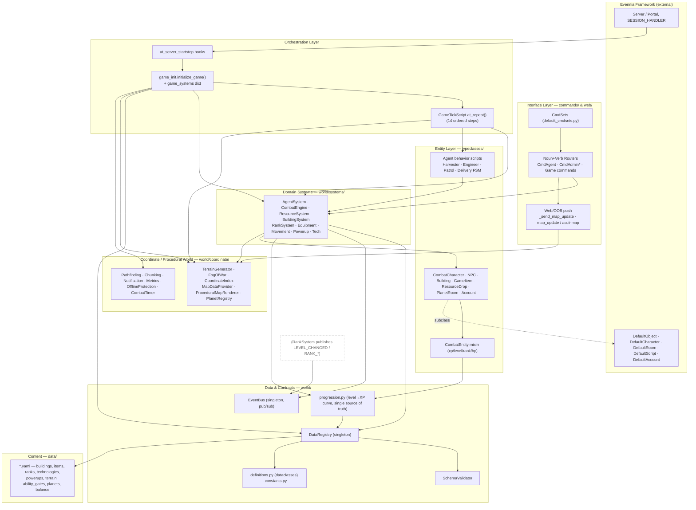
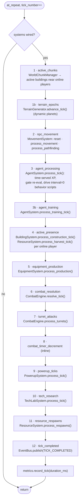
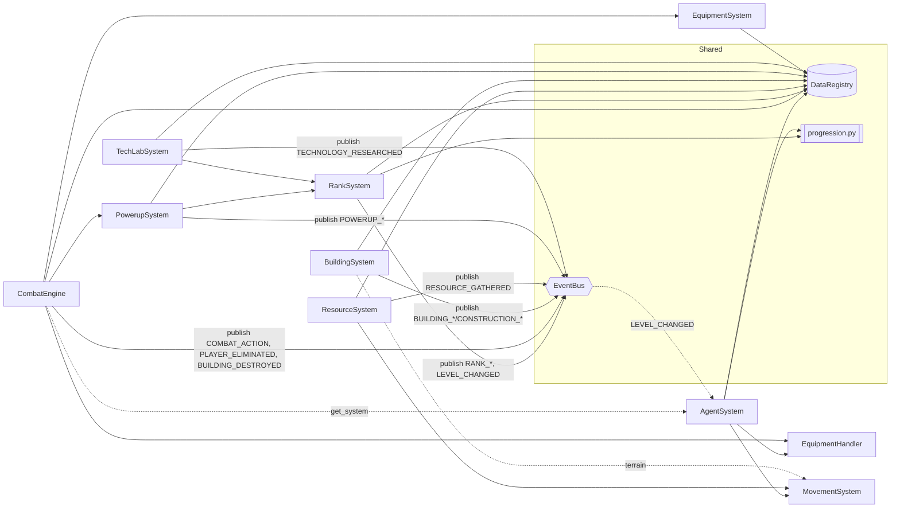
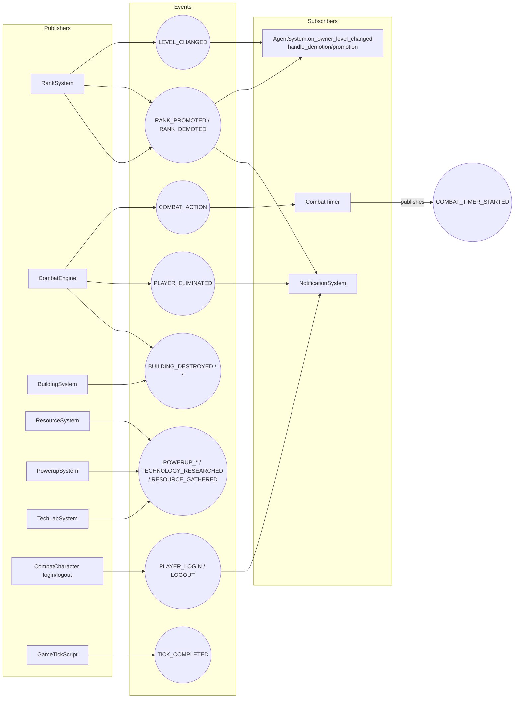
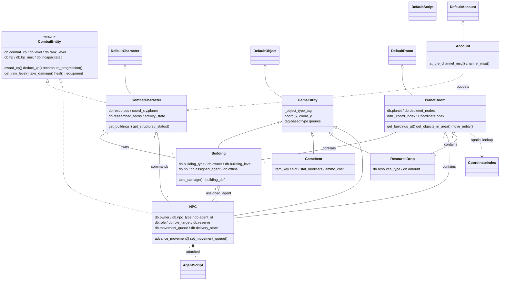
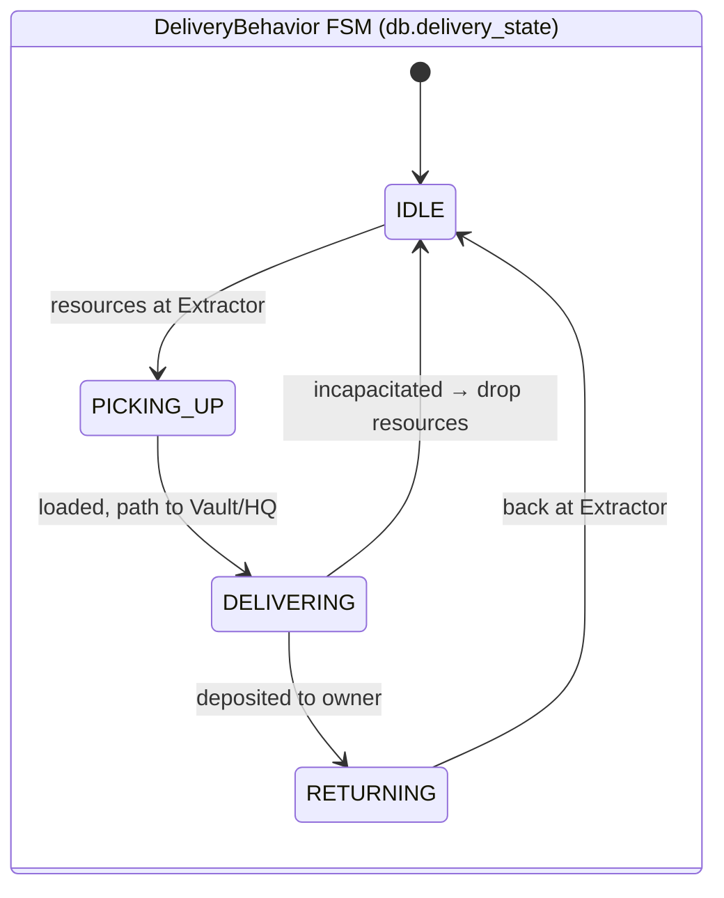
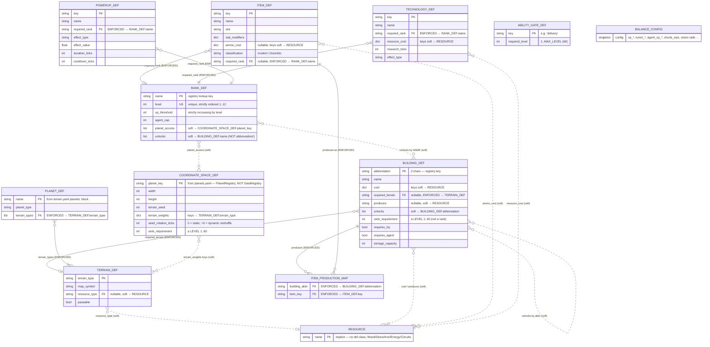

# RTS Combat Overworld — System Architecture

A real‑time‑strategy combat/economy game built on the **Evennia** MUD framework
(Python). Players and their NPC **agents** share a common progression model
(`CombatEntity`), operate over a procedurally‑generated coordinate overworld, and
are driven forward by a single per‑second **game tick**.

This document contains two views:

1. **Architecture diagrams** — layers, bootstrap, the tick loop, event wiring, and
   the core progression flow.
2. **Component diagrams** — the domain systems and the typeclass (entity) model.

> All diagrams are [Mermaid](https://mermaid.js.org/). GitHub, VS Code (with the
> Markdown Preview Mermaid extension), and most Markdown viewers render them inline.

---

## 1. Layered Architecture (containers)

The codebase is a strict acyclic stack. Lower layers never import upward; runtime
coupling is inverted via **dependency injection** (`registry`, `event_bus` passed
into every system) and a **service‑locator** (`get_system`).



**Dependency rules that hold across the stack**

- Systems **receive** `(registry, event_bus)` — they never import `game_init`.
- Cross‑system talk is either **EventBus** (decoupled) or **lazy `get_system()`**
  lookup (avoids import cycles, e.g. `CombatEngine → AgentSystem`).
- `progression.py` is the **single source of truth** for the level↔XP curve; both
  `CombatEntity` and `RankSystem` derive levels from it identically.

---

## 2. Bootstrap Sequence

`at_server_start()` → `initialize_game()` wires everything and stashes it in a
module‑level `game_systems` dict (also mirrored onto `GameTickScript.ndb.systems`).

```mermaid
sequenceDiagram
    autonumber
    participant EV as Evennia
    participant Hook as at_server_startstop
    participant Init as game_init.initialize_game()
    participant Reg as DataRegistry
    participant Val as SchemaValidator
    participant Prog as progression.py
    participant Bus as EventBus
    participant Sys as Game Systems
    participant Subs as Event Subscribers
    participant Tick as GameTickScript

    EV->>Hook: at_server_start()
    Hook->>Init: initialize_game()
    Init->>Reg: DataRegistry(); set_instance(registry)
    Init->>Reg: load_all("data")
    Reg->>Val: validate_* per file + cross_validate()
    Val-->>Reg: error list (raise DataRegistryError if any)
    Reg->>Prog: build_thresholds(registry.ranks)
    Init->>Bus: import event_bus singleton
    Init->>Sys: construct each system(registry, event_bus)
    Note over Sys: Building · Combat · Rank · Resource · Powerup<br/>Tech · Equipment · Agent · Movement · Chunk · Chat
    Init->>Sys: build procedural world<br/>(PlanetRegistry, TerrainGenerators, FogOfWar,<br/>MapDataProvider, ProceduralMapRenderer, PlanetRooms)
    Init->>Subs: NotificationSystem(event_bus) auto-subscribes
    Init->>Subs: subscribe_combat_timer(event_bus)
    Init->>Subs: subscribe RANK_PROMOTED / RANK_DEMOTED / LEVEL_CHANGED → AgentSystem
    Init->>Init: populate game_systems{} dict
    Init->>Tick: create/find GameTickScript + AutoSaveScript
    Init->>Tick: tick_script.ndb.systems = game_systems
    Note over Tick: interval=1s, persistent — begins at_repeat()
```

**Hot reload** (`@reload` admin command → `DataRegistry.reload_all()`): builds a
*temporary* registry, validates it, and only on success atomically swaps the data
attributes **and rebuilds `progression.build_thresholds()`** so the level curve
never goes stale. On validation failure the live data is preserved.

---

## 3. The Game Tick (orchestration heartbeat)

`GameTickScript.at_repeat()` runs every second. It computes the **active
chunks/buildings** once (only near online players — the perf gate) then drives each
system in a fixed order. Every step is wrapped in `try/except` so one failure never
halts the rest of the tick.



Behavior scripts (`HarvesterScript`, `DeliveryBehavior`, `PatrolBehavior`,
`EngineerScript`, …) all use `interval=0` — they are **externally clocked** from
step 3, not self‑timed. This makes the whole simulation deterministic and pausable.

---

## 4. Component Diagram — Domain Systems

Every system is injected with `registry` + `event_bus`. Arrows show **who calls /
depends on whom**; dashed arrows are lazy (`get_system`) lookups that avoid import
cycles.



| System | Tick step | Responsibility | Notable collaborators |
|---|---|---|---|
| **AgentSystem** | 3, 3b | Train/assign/patrol agents; freeze‑aware XP; gated‑ability convergence; demotion/promotion reserve | progression, Movement, EventBus (`LEVEL_CHANGED` subscriber), agent scripts |
| **CombatEngine** | 6, 7 | Queue + resolve attacks, damage w/ armor+tech+powerup mods, death/destruction, turrets | Agent (lazy), Equipment, Powerup, EventBus |
| **RankSystem** | event‑driven | Level 1‑60 → rank 1‑12; XP thresholds; tech unlock/revoke; **publishes** `LEVEL_CHANGED`/`RANK_*` | progression, EventBus |
| **ResourceSystem** | 4, 11 | Manual + presence harvest, Extractor inventory, respawns | Movement, terrain, EventBus |
| **BuildingSystem** | 4 | Construct/upgrade validation + timers (player‑presence & engineer‑agent) | terrain, EventBus |
| **EquipmentSystem** | 5 | Armory/Armorer per‑tick item production | registry |
| **EquipmentHandler** | — | Per‑character slot equip/unequip + stat aggregation | (standalone) |
| **MovementSystem** | 2 | In‑memory moving‑NPC set; per‑tick advance; pathfinding throttle | pathfinding |
| **PowerupSystem** | 9 | Timed buffs, cooldowns, combat stat modifiers | RankSystem, EventBus |
| **TechLabSystem** | 10 | Research timers, apply tech effects/unlocks | RankSystem, EventBus |

---

## 5. Core Domain Flow — Progression & Agent Gating

The signature mechanic: a player's level caps their agents' effective level, which
in turn gates agent abilities. This is the cross‑cutting flow that ties
`RankSystem`, `progression`, `EventBus`, and `AgentSystem` together.

```mermaid
sequenceDiagram
    autonumber
    participant Src as XP source<br/>(combat / harvest / tech)
    participant Rank as RankSystem
    participant Prog as progression.py
    participant Bus as EventBus
    participant Agent as AgentSystem
    participant NPC as Agent (NPC)

    Src->>Rank: award_xp(player, amount)
    Rank->>Prog: level_for_xp(new_xp)
    Prog-->>Rank: new_level
    Rank->>Bus: publish LEVEL_CHANGED(player, old, new)
    alt rank boundary crossed
        Rank->>Bus: publish RANK_PROMOTED / RANK_DEMOTED (+ new agent_cap)
    end
    Bus-->>Agent: on_owner_level_changed(player)
    loop each owned agent
        Agent->>Agent: cap_ceiling = max(1, owner_level - 1)
        Agent->>Agent: effective = max(1, min(raw_level, cap_ceiling))
        Agent->>Agent: evaluate_gated_abilities(agent)
        Note over Agent,NPC: attach ability script if (available AND enabled),<br/>detach if no longer wanted; notify on availability change
    end
    alt agent_cap reduced
        Bus-->>Agent: handle_demotion() → reserve highest-ID agents
    else agent_cap raised
        Bus-->>Agent: handle_promotion() → restore lowest-ID reserved agents
    end
```

**Freeze‑aware XP** (`AgentSystem.award_agent_xp`): an agent sitting at its
`cap_ceiling = owner_level − 1` earns **no** XP (no banking). The ceiling recomputes
whenever the owner's level changes, so agents "unfreeze" the moment their commander
levels up. Death loss (`apply_agent_death_loss`) always applies, bypassing the
freeze.

---

## 6. EventBus Wiring (publishers → events → subscribers)



The bus swallows subscriber exceptions (logs, never propagates) so a bad handler
can't break a publisher.

---

## 7. Component Diagram — Typeclasses (entity model)



### Agent behavior scripts (interval=0, driven by tick step 3)



| Script | Role | Behavior |
|---|---|---|
| `HarvesterScript` | harvester | Produce resources on `HARVEST_COOLDOWN_TICKS`; spawn `ResourceDrop`; award `harvest` XP |
| `DeliveryBehavior` | harvester (gated ability) | The 4‑state FSM above; laden vs empty move speed |
| `EngineerScript` | engineer | Advance construction/research progress on assigned building |
| `PatrolBehavior` | guard / scout | Cycle patrol waypoints via A* pathfinding |
| `SoldierScript` / `MedicScript` | soldier / medic | Placeholders (army combat / healing) |

**Lookup tables:** `ROLE_SCRIPT_MAP` (role → default script) and
`ABILITY_SCRIPT_MAP` (`"delivery"` → `DeliveryBehavior`, attached on enable).

---

## 8. Command Routing & Web Interface

```mermaid
flowchart LR
    In([player types 'agent assign 3 harvester']) --> Parser["Evennia cmdparser + CmdSet match<br/>(prefix match via GameCommand.match)"]
    Parser --> Router["CmdAgent(GameSubcommandRouter).func()"]
    Router --> Split["_get_subcommand_and_args() → ('assign','3 harvester')"]
    Split --> Perm["_check_sub_perm()"]
    Perm --> Handler["sub_assign(args)"]
    Handler --> GS["get_system(caller,'agent_system')"]
    GS --> Sysm["AgentSystem.assign_agent(...)"]
    Sysm --> Msg["caller.msg(result)"]
    Sysm --> Map["_send_map_update(caller)"]
    Map --> OOB["caller.msg(map_update=data)<br/>MapDataProvider + FogOfWar"]
    OOB --> Client{{Webclient renders canvas · Telnet ignores OOB}}
```



**Router classes** (`commands/command_router.py`):

- `SubcommandRouter(BaseCommand)` — core dispatch; `subcommands = {verb: (handler, help, perm)}`.
- `AdminSubcommandRouter` — adds `perm(Builder)` locks + `Admin` help category.
- `GameSubcommandRouter` — adds prefix matching + `Game` help category.

**Command families**

| Router / family | Key | Subcommands / commands | CmdSet |
|---|---|---|---|
| `CmdAgent` | `agent` | list, assign, unassign, train, patrol, stop, ability | Character |
| `CmdAdminBuilding` | `@building` | spawn, destroy | Character (perm‑locked) |
| `CmdAdminAgent` | `@agent` | create, destroy, list | Character (perm‑locked) |
| `CmdAdminResource` | `@resource` | give, reset | Character (perm‑locked) |
| `CmdAdminPlayer` | `@player` | level, rank | Character (perm‑locked) |
| Game commands | — | move/n/s/e/w, harvest, build, upgrade, demolish, attack, equip, research, score, map, scan, chat, … | Character |
| Standalone admin | — | `@reload`, `@teleport`, `@clearfog`, `@purgerooms`, `@migrate` | Character (perm‑locked) |

**CmdSets** (`commands/default_cmdsets.py`): `CharacterCmdSet` (all game + routers,
attached to the puppeted character), `AccountCmdSet` (OOC), `UnloggedinCmdSet`,
`SessionCmdSet`.

**System access pattern** (everywhere): `world.utils.get_system(caller, name)`
checks `caller.ndb.systems` first, then falls back to the module‑level
`game_systems` dict — so both tick‑driven and command‑driven code resolve the same
singletons.

---

## 9. Coordinate / Procedural World

```mermaid
graph TD
    PR[PlanetRegistry<br/>planet defs from YAML] --> TG
    TG[TerrainGenerator<br/>seed-based deterministic noise<br/>advance_tick epochs] --> MDP
    TG --> PMR
    TG --> PATH
    CI[CoordinateIndex<br/>O(1) tile → objects, on PlanetRoom.ndb]
    FOG[FogOfWarSystem<br/>visible / fog / unexplored] --> DBF[DiscoveryBitfield<br/>16×16 chunk bitfields]
    MDP[MapDataProvider<br/>structured JSON tiles] --> FOG
    PMR[ProceduralMapRenderer<br/>colored ASCII] --> FOG
    CHUNK[WorldChunkManager<br/>active chunks near online players]
    PATH[pathfinding<br/>A* find_path + passability]

    PlanetRoom -->|lazy| CI
    MDP -->|get_objects_in_area| PlanetRoom
    PMR -->|get_objects_in_area| PlanetRoom
    FOG -->|get_buildings_at| PlanetRoom
    PATH -->|get_buildings_at| PlanetRoom
```

- **CoordinateIndex** — non‑persistent spatial hash on `PlanetRoom.ndb`, rebuilt
  lazily from room contents after restart; powers all `get_*_at` queries.
- **TerrainGenerator** — deterministic hash noise; dynamic planets rotate their seed
  every `seed_rotation_ticks` (epoch change reshuffles terrain).
- **FogOfWar + DiscoveryBitfield** — Chebyshev vision circles; per‑player discovery
  stored compactly (~1.2 KB for a fully explored 100×100 map).
- **MapDataProvider vs ProceduralMapRenderer** — same fog logic, two outputs:
  structured OOB (`map_update`) for the webclient, colored ASCII for telnet.
- **WorldChunkManager** — the perf gate: only chunks within one chunk‑radius of an
  online player are processed each tick.
- **pathfinding** — pure A* (`find_path`) + `make_passability_checker`
  (terrain + offline‑building blocking) + `compute_path_for_npc` shared by agents.

---

## 10. Cross‑Cutting Support

| Module | Kind | Role | Wiring |
|---|---|---|---|
| `notification_system.py` | class | Broadcasts login/logout/elimination/rank messages to all sessions | **subscribes** PLAYER_LOGIN, PLAYER_LOGOUT, PLAYER_ELIMINATED, RANK_PROMOTED, RANK_DEMOTED |
| `combat_timer.py` | functions | Sets `combat_timer_expires = tick + 60` on combatants (blocks wall passage) | **subscribes** COMBAT_ACTION; **publishes** COMBAT_TIMER_STARTED |
| `offline_protection.py` | functions | Buildings become unattackable/blocking/idle while owner is offline | called from `CombatCharacter.at_post_login / at_pre_unpuppet` |
| `metrics.py` | class | In‑memory counters/gauges + periodic summary log | called directly (no bus) by tick, combat, building, command paths |

---

## 11. Data / Content ER Diagram

The YAML definition files load into typed dataclasses (`world/definitions.py`) held
by `DataRegistry`, then `SchemaValidator.cross_validate()` checks the references
between them. This diagram is the **content schema**: entities, primary keys, and
how they reference each other.

**Two classes of reference — read the line style:**

- **Solid line (`──`) = ENFORCED foreign key.** `cross_validate()` rejects the whole
  load (raises `DataRegistryError`) if the reference is dangling. These are the six
  checks in `SchemaValidator.cross_validate`.
- **Dashed line (`┈┈`) = SOFT reference.** Declared in YAML and used at runtime, but
  **never validated** — a typo here loads silently and only surfaces as a runtime
  miss. (`unlocks`, `planet_access`, `produces`, and every resource‑name key fall
  here.)



### Primary keys & registry stores

| Entity | Source file | Registry field | Keyed by |
|---|---|---|---|
| `BuildingDef` | `buildings.yaml` | `registry.buildings` | `abbreviation` (2 chars) |
| `ItemDef` | `items.yaml` | `registry.items` | `key` |
| `item_production_map` | `items.yaml` | `registry.item_production_map` | `building_abbr → [item_key]` |
| `RankDef` | `ranks.yaml` | `registry.ranks` (sorted **list**) | `name` (lookup); `level` unique |
| `TechnologyDef` | `technologies.yaml` | `registry.technologies` | `key` |
| `PowerupDef` | `powerups.yaml` | `registry.powerups` | `key` |
| `TerrainDef` | `terrain.yaml` | `registry.terrain` | `terrain_type` |
| `PlanetDef` | `terrain.yaml` (`planets:`) | `registry.planets` | `name` |
| `AbilityGateDef` | `ability_gates.yaml` | `registry.ability_gates` | `key` |
| `BalanceConfig` | `config/balance.yaml` (optional) | `registry.balance` | singleton |
| `CoordinateSpaceDef` | `planets.yaml` | **`PlanetRegistry`** (separate) | `planet_key` |

### Cross‑reference notes (things the schema does *not* protect you from)

- **`Resource` is implicit.** There is no `ResourceDef` and no master list of valid
  resource names. `Wood/Stone/Iron/Energy/Circuits` are just dict keys /
  `resource_type` strings scattered across `BuildingDef.cost`, `BuildingDef.produces`,
  `ItemDef.ammo_cost`, `TechnologyDef.resource_cost`, and `TerrainDef.resource_type`.
  A misspelled resource name is never caught at load time.
- **`RankDef.unlocks` uses building _names_** ("Extractor", "Academy") while
  **`BuildingDef.unlocks` uses building _abbreviations_** ("EX", "AC"). Different key
  spaces for the same concept — and neither is cross‑validated.
- **Two distinct "planet" entities.** `PlanetDef` (terrain.yaml) drives terrain‑type
  membership and *is* cross‑validated; `CoordinateSpaceDef` (planets.yaml) drives the
  actual coordinate space/seed and is loaded by a **separate** `PlanetRegistry`, so
  `RankDef.planet_access → planet_key` and `terrain_weights → terrain_type` are never
  checked against each other at load.
- **`rank_requirement` is a misnomer** on both `BuildingDef` and `CoordinateSpaceDef`:
  per the YAML comments it now holds a **level (1–60)**, not a rank (1–12).

---

## Appendix — Key Constants (`world/constants.py`)

```
NUM_RANKS = 12 · LEVELS_PER_RANK = 5 · MAX_LEVEL = 60 · FINAL_RANK_XP_PER_LEVEL = 10000
DeliveryState = {IDLE, PICKING_UP, DELIVERING, RETURNING}   # StrEnum
HARVEST_COOLDOWN_TICKS = 4 · EXTRACTOR_HARVEST_MULTIPLIER = 3 · EXTRACTOR_LEVEL_BONUS = 0.25
DEFAULT_MOVEMENT_DELAY = 1 · HARVESTER_LADEN_DELAY = 2 · HARVESTER_EMPTY_DELAY = 1 · DEFAULT_CARRY_CAPACITY = 50
PROTECTED_BUILDING_TYPES = {"VT"}   # survive disconnect cleanup
```
